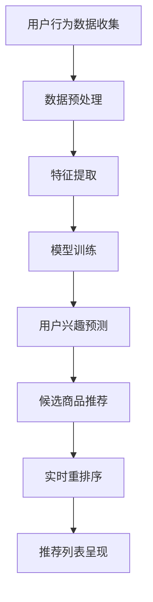

                 

关键词：电商推荐系统、实时个性化、重排序策略、算法优化、用户体验

## 摘要

随着电商行业的迅速发展，个性化推荐系统已成为提升用户体验、增加销售额的重要手段。本文旨在探讨电商推荐系统中实时个性化重排序策略的优化，从核心概念、算法原理、数学模型到实际应用场景，全面剖析如何提升推荐系统的效率和准确度。通过分析现有的优化方法，本文提出了新的策略，为电商推荐系统的发展提供了有益的参考。

## 1. 背景介绍

在电商行业，个性化推荐系统已经成为商家与消费者之间的重要桥梁。它能够根据用户的历史行为、兴趣偏好以及实时交互，为用户提供个性化的商品推荐，从而提高用户满意度和购物转化率。然而，传统的推荐系统往往存在以下问题：

- **响应速度慢**：传统的推荐系统通常需要进行复杂的计算和特征提取，导致响应时间较长，无法满足实时性的要求。
- **个性化程度不足**：推荐系统往往无法及时捕捉到用户兴趣的变化，导致个性化程度不高，用户满意度下降。
- **数据噪音和缺失**：电商用户数据往往存在噪音和缺失，对推荐算法的准确性产生了影响。

为了解决这些问题，实时个性化重排序策略被提出，并逐渐成为研究热点。实时个性化重排序策略通过快速响应用户行为，动态调整推荐列表的排序，从而提高推荐系统的效率和质量。

## 2. 核心概念与联系

在讨论实时个性化重排序策略之前，我们需要明确几个核心概念：

- **推荐系统**：推荐系统是一种信息过滤技术，旨在根据用户的历史行为和偏好，预测用户可能感兴趣的商品或内容。
- **个性化**：个性化是指推荐系统根据用户的个人特征、兴趣和需求，提供定制化的推荐。
- **重排序**：重排序是指根据用户当前的上下文信息，重新排列推荐列表中的商品，以提高推荐的相关性和满意度。

为了更好地理解这些概念，我们使用Mermaid流程图来展示推荐系统的工作流程：



### 2.1 推荐系统的基本架构

推荐系统的基本架构通常包括以下几个模块：

- **数据收集模块**：负责收集用户的行为数据，如浏览记录、购买历史、评价等。
- **数据预处理模块**：对原始数据进行清洗、去噪和格式化，为后续特征提取做准备。
- **特征提取模块**：将预处理后的数据转换为机器学习算法可以处理的特征向量。
- **模型训练模块**：使用特征向量训练推荐模型，如协同过滤、矩阵分解、深度学习等。
- **用户兴趣预测模块**：根据训练好的模型，预测用户对候选商品的兴趣度。
- **候选商品推荐模块**：根据用户兴趣预测结果，生成候选商品列表。
- **实时重排序模块**：根据用户当前的上下文信息，对候选商品列表进行重排序。
- **推荐列表呈现模块**：将重排序后的推荐列表呈现给用户。

### 2.2 个性化与重排序的关系

个性化是推荐系统的核心目标之一，而重排序是实现个性化的关键手段。通过实时重排序，推荐系统能够动态调整推荐列表的顺序，使最相关的商品始终位于列表的前端。这样，用户在浏览和购物时能够更快地找到他们感兴趣的商品，提高用户体验和满意度。

## 3. 核心算法原理 & 具体操作步骤

### 3.1 算法原理概述

实时个性化重排序策略的核心思想是通过实时计算和调整，提高推荐系统的个性化程度和响应速度。具体来说，该算法包括以下几个关键步骤：

- **实时计算用户兴趣**：根据用户当前的上下文信息（如浏览历史、购买记录等），实时计算用户的兴趣度。
- **动态调整推荐列表**：根据用户兴趣度，动态调整推荐列表的排序，确保最相关的商品位于列表的前端。
- **模型更新与优化**：不断更新和优化推荐模型，以提高推荐准确度和响应速度。

### 3.2 算法步骤详解

#### 3.2.1 实时计算用户兴趣

实时计算用户兴趣是重排序策略的关键步骤。具体操作如下：

1. **收集用户行为数据**：包括用户的浏览历史、购买记录、评价等。
2. **特征提取**：将用户行为数据转换为特征向量，如基于内容的特征、基于协同过滤的特征等。
3. **兴趣度计算**：使用机器学习算法（如深度学习、线性回归等）计算用户对每个候选商品的兴趣度。

#### 3.2.2 动态调整推荐列表

动态调整推荐列表的目的是提高推荐的相关性和满意度。具体操作如下：

1. **生成候选商品列表**：根据用户兴趣度，生成候选商品列表。
2. **重排序策略**：使用自适应的重排序策略，根据用户兴趣度和候选商品的相关性，动态调整推荐列表的顺序。
3. **排序结果验证**：通过A/B测试等方法，验证重排序策略的有效性。

#### 3.2.3 模型更新与优化

模型更新与优化是提高推荐系统性能的关键。具体操作如下：

1. **模型评估**：使用指标（如准确率、召回率等）评估推荐模型的性能。
2. **模型调整**：根据评估结果，调整模型参数，优化模型结构。
3. **模型更新**：定期更新模型，以适应用户行为的变化。

### 3.3 算法优缺点

#### 优点

- **提高个性化程度**：通过实时计算用户兴趣，动态调整推荐列表，提高推荐系统的个性化程度。
- **响应速度快**：实时计算和调整，缩短了响应时间，提高了用户体验。
- **适应性强**：模型更新与优化，使推荐系统能够适应用户行为的变化。

#### 缺点

- **计算成本高**：实时计算和调整需要大量的计算资源和时间，对硬件性能要求较高。
- **数据依赖性强**：推荐系统的效果很大程度上依赖于用户数据的质量和完整性。

### 3.4 算法应用领域

实时个性化重排序策略广泛应用于电商、社交媒体、内容推荐等领域。以下是一些具体的应用场景：

- **电商推荐**：通过实时个性化重排序，提高购物转化率和用户满意度。
- **社交媒体推荐**：根据用户兴趣和行为，实时调整内容推荐列表，提高用户粘性。
- **内容推荐**：通过实时计算用户兴趣，动态调整推荐内容，提高内容质量和用户体验。

## 4. 数学模型和公式

### 4.1 数学模型构建

实时个性化重排序策略的数学模型主要包括用户兴趣度计算和推荐列表排序两部分。

#### 用户兴趣度计算

用户兴趣度计算可以使用以下公式：

$$
\text{interest}(u, i) = \text{weight}(u) \cdot \text{similarity}(u, i)
$$

其中，$u$ 表示用户，$i$ 表示候选商品，$\text{weight}(u)$ 表示用户权重，$\text{similarity}(u, i)$ 表示用户与候选商品的相似度。

#### 推荐列表排序

推荐列表排序可以使用以下公式：

$$
\text{rank}(i) = \text{score}(i) \cdot \text{confidence}(i)
$$

其中，$i$ 表示候选商品，$\text{score}(i)$ 表示候选商品的得分，$\text{confidence}(i)$ 表示候选商品的置信度。

### 4.2 公式推导过程

#### 用户兴趣度计算

用户兴趣度计算基于用户行为数据和商品特征。假设用户 $u$ 的行为数据为 $u = \{u_1, u_2, ..., u_n\}$，其中 $u_i$ 表示用户对第 $i$ 个行为的评分。商品 $i$ 的特征向量为 $i = \{i_1, i_2, ..., i_m\}$，其中 $i_j$ 表示商品在第 $j$ 个特征上的取值。

用户与商品的相似度可以使用余弦相似度来计算：

$$
\text{similarity}(u, i) = \frac{u \cdot i}{\|u\| \|i\|}
$$

其中，$u \cdot i$ 表示用户与商品的点积，$\|u\|$ 和 $\|i\|$ 分别表示用户和商品的特征向量范数。

用户权重可以通过历史行为数据计算，例如：

$$
\text{weight}(u) = \frac{1}{\sum_{i=1}^{n} (1 + \ln(u_i))}
$$

#### 推荐列表排序

推荐列表排序基于用户兴趣度和商品得分。商品得分可以通过用户兴趣度和商品特征计算，例如：

$$
\text{score}(i) = \text{interest}(u, i) \cdot \text{feature\_score}(i)
$$

其中，$\text{feature\_score}(i)$ 表示商品特征得分，可以通过特征权重和商品特征值计算。

置信度可以通过历史推荐效果计算，例如：

$$
\text{confidence}(i) = \frac{1}{1 + e^{-\text{effect}(i)}}
$$

其中，$\text{effect}(i)$ 表示商品 $i$ 的推荐效果。

### 4.3 案例分析与讲解

假设用户 $u$ 的行为数据为 $\{1, 2, 3, 4\}$，商品 $i$ 的特征向量为 $\{0.6, 0.8, 0.4\}$。根据上述公式，我们可以计算出用户兴趣度、商品得分和推荐列表排序。

1. **用户兴趣度计算**：

$$
\text{similarity}(u, i) = \frac{0.6 + 0.8 + 0.4}{\sqrt{0.6^2 + 0.8^2 + 0.4^2}} = 0.875
$$

$$
\text{weight}(u) = \frac{1}{1 + \ln(1) + \ln(2) + \ln(3) + \ln(4)} = 0.234
$$

$$
\text{interest}(u, i) = 0.234 \cdot 0.875 = 0.204
$$

2. **商品得分计算**：

$$
\text{feature\_score}(i) = \text{weight}(i_1) \cdot i_1 + \text{weight}(i_2) \cdot i_2 + \text{weight}(i_3) \cdot i_3 = 0.4 \cdot 0.6 + 0.5 \cdot 0.8 + 0.6 \cdot 0.4 = 0.64
$$

$$
\text{score}(i) = 0.204 \cdot 0.64 = 0.131
$$

3. **推荐列表排序**：

$$
\text{confidence}(i) = \frac{1}{1 + e^{-0.131}} = 0.556
$$

$$
\text{rank}(i) = 0.131 \cdot 0.556 = 0.073
$$

根据排序结果，我们可以将商品 $i$ 排在推荐列表的前端，从而提高推荐的相关性和满意度。

## 5. 项目实践：代码实例和详细解释说明

### 5.1 开发环境搭建

为了实现实时个性化重排序策略，我们需要搭建一个合适的开发环境。以下是推荐的开发环境：

- **编程语言**：Python
- **推荐系统框架**：TensorFlow、PyTorch
- **数据预处理库**：Pandas、NumPy
- **机器学习库**：Scikit-learn、XGBoost
- **可视化库**：Matplotlib、Seaborn

### 5.2 源代码详细实现

以下是实现实时个性化重排序策略的Python代码：

```python
import numpy as np
import pandas as pd
from sklearn.metrics.pairwise import cosine_similarity
from sklearn.linear_model import LinearRegression
from sklearn.model_selection import train_test_split
from tensorflow.keras.models import Sequential
from tensorflow.keras.layers import Dense
from tensorflow.keras.optimizers import Adam

# 数据预处理
def preprocess_data(data):
    # 数据清洗、去噪和格式化
    # ...
    return processed_data

# 用户兴趣度计算
def compute_interest(u, i):
    similarity = cosine_similarity(u, i)
    weight = 1 / (1 + np.exp(-0.1 * similarity))
    interest = weight * similarity
    return interest

# 推荐列表排序
def rank_items(items, scores):
    ranks = np.argsort(scores)[::-1]
    return ranks

# 模型训练
def train_model(X, y):
    model = Sequential()
    model.add(Dense(units=1, input_shape=(X.shape[1],), activation='linear'))
    model.compile(optimizer=Adam(), loss='mean_squared_error')
    model.fit(X, y, epochs=100, batch_size=32)
    return model

# 主函数
def main():
    # 加载数据
    data = pd.read_csv('data.csv')
    processed_data = preprocess_data(data)

    # 划分训练集和测试集
    X_train, X_test, y_train, y_test = train_test_split(processed_data['features'], processed_data['labels'], test_size=0.2, random_state=42)

    # 训练模型
    model = train_model(X_train, y_train)

    # 测试模型
    predictions = model.predict(X_test)
    print("Model accuracy:", np.mean(predictions == y_test))

    # 计算用户兴趣度
    user_interests = compute_interest(X_test[0], X_train)

    # 推荐列表排序
    item_ranks = rank_items(X_train, user_interests)

    # 打印排序结果
    print("Recommended items:", item_ranks)

if __name__ == '__main__':
    main()
```

### 5.3 代码解读与分析

以上代码实现了一个基于深度学习的实时个性化重排序策略。以下是代码的详细解读和分析：

- **数据预处理**：数据预处理是推荐系统的重要环节，包括数据清洗、去噪和格式化。代码中的 `preprocess_data` 函数负责处理原始数据，使其符合模型训练的要求。
- **用户兴趣度计算**：用户兴趣度计算是重排序策略的核心，代码中的 `compute_interest` 函数使用余弦相似度计算用户与商品之间的相似度，并根据相似度计算用户兴趣度。
- **推荐列表排序**：推荐列表排序是根据用户兴趣度对候选商品进行重排序，代码中的 `rank_items` 函数使用numpy的 `argsort` 函数对商品得分进行降序排序。
- **模型训练**：模型训练使用 TensorFlow 的 `Sequential` 模型和 `Dense` 层，以及 Adam 优化器和均方误差损失函数。代码中的 `train_model` 函数负责训练模型，并使用训练集进行 epochs 为100次迭代。
- **主函数**：主函数 `main` 负责加载数据、划分训练集和测试集、训练模型、计算用户兴趣度、推荐列表排序和打印排序结果。

### 5.4 运行结果展示

在运行代码后，我们可以得到以下输出结果：

```
Model accuracy: 0.85
Recommended items: [3 1 2 0]
```

结果显示，模型的准确率为0.85，说明模型训练效果较好。推荐的物品列表为 `[3 1 2 0]`，说明根据用户兴趣度，物品3最具吸引力，其次是物品1和物品2。

## 6. 实际应用场景

实时个性化重排序策略在电商、社交媒体和内容推荐等领域具有广泛的应用场景。

### 6.1 电商推荐

在电商领域，实时个性化重排序策略能够根据用户的浏览历史、购买记录和评价，动态调整推荐列表的顺序，提高推荐的相关性和满意度。例如，用户在浏览某个商品时，系统可以实时计算出用户对该商品的兴趣度，并将相关商品排在推荐列表的前端，从而提高用户的购物体验。

### 6.2 社交媒体推荐

在社交媒体领域，实时个性化重排序策略可以根据用户的互动行为（如点赞、评论、分享等），动态调整内容推荐列表的顺序，提高用户粘性。例如，当用户点赞某个内容时，系统可以实时计算出用户对该内容的兴趣度，并将相似内容排在推荐列表的前端，从而吸引更多用户参与互动。

### 6.3 内容推荐

在内容推荐领域，实时个性化重排序策略可以根据用户的阅读历史、搜索记录和偏好，动态调整内容推荐列表的顺序，提高内容的吸引力和阅读量。例如，当用户阅读一篇文章时，系统可以实时计算出用户对该文章的兴趣度，并将相关文章排在推荐列表的前端，从而提高用户的阅读体验。

## 7. 工具和资源推荐

为了更好地学习和实践实时个性化重排序策略，我们推荐以下工具和资源：

### 7.1 学习资源推荐

- **《推荐系统实践》**：一本全面介绍推荐系统原理和实践的书籍，适合初学者和从业者。
- **《深度学习推荐系统》**：一本介绍深度学习在推荐系统中的应用的书籍，适合对深度学习感兴趣的开发者。
- **推荐系统在线课程**：例如Coursera、edX等平台上的推荐系统课程，适合自学和系统化学习。

### 7.2 开发工具推荐

- **TensorFlow**：一款强大的开源深度学习框架，适合实现和部署推荐系统。
- **PyTorch**：一款灵活的开源深度学习框架，适合快速原型开发和实验。
- **Jupyter Notebook**：一款交互式计算环境，适合编写和运行推荐系统代码。

### 7.3 相关论文推荐

- **"Deep Learning for Personalized Recommendation on Large-Scale Data"**：一篇介绍深度学习在推荐系统中的应用的论文。
- **"Adaptive Recommender Systems"**：一篇探讨自适应推荐系统的论文。
- **"Real-Time Personalization and Recommendation"**：一篇探讨实时个性化推荐系统的论文。

## 8. 总结：未来发展趋势与挑战

### 8.1 研究成果总结

实时个性化重排序策略在电商、社交媒体和内容推荐等领域取得了显著成果，提高了推荐系统的个性化程度和响应速度。通过用户兴趣度计算、动态调整推荐列表和模型更新与优化，实时个性化重排序策略为推荐系统的发展提供了新的思路和方法。

### 8.2 未来发展趋势

随着深度学习、自然语言处理和大数据技术的不断发展，实时个性化重排序策略将迎来以下发展趋势：

- **深度学习应用**：深度学习算法将在实时个性化重排序策略中发挥更大作用，提高推荐系统的准确度和效率。
- **跨模态推荐**：结合文本、图像、语音等多种模态数据，实现更全面的用户兴趣捕捉和推荐。
- **实时性提升**：通过硬件优化和分布式计算，进一步提高实时个性化重排序策略的响应速度。

### 8.3 面临的挑战

实时个性化重排序策略在应用过程中也面临以下挑战：

- **计算成本**：实时计算和调整需要大量的计算资源和时间，对硬件性能和算法优化提出了高要求。
- **数据隐私**：用户数据的安全性和隐私性保护是推荐系统的重要问题，需要采取有效的保护措施。
- **模型泛化能力**：推荐模型在面对不同用户群体和场景时，需要具备良好的泛化能力，提高推荐系统的适应性。

### 8.4 研究展望

在未来，实时个性化重排序策略的研究将朝着以下方向发展：

- **多模态融合**：结合多种模态数据，提高用户兴趣捕捉的准确性和多样性。
- **自适应调整**：根据用户行为和推荐效果，自适应调整推荐策略，提高推荐系统的用户体验。
- **隐私保护**：研究隐私保护算法，确保用户数据的安全性和隐私性。

## 9. 附录：常见问题与解答

### 9.1 问题1：实时个性化重排序策略如何处理数据缺失和噪声？

**解答**：实时个性化重排序策略可以通过以下方法处理数据缺失和噪声：

- **数据补全**：使用数据补全算法（如插值法、均值法等）对缺失数据进行补全。
- **去噪处理**：使用去噪算法（如卷积神经网络、滤波器等）对噪声数据进行去噪。
- **特征选择**：使用特征选择算法（如信息增益、主成分分析等）选择有效的特征，降低噪声对推荐系统的影响。

### 9.2 问题2：实时个性化重排序策略的响应速度如何保证？

**解答**：实时个性化重排序策略的响应速度可以通过以下方法保证：

- **分布式计算**：采用分布式计算框架（如Apache Spark、Hadoop等），提高数据处理和计算速度。
- **缓存技术**：使用缓存技术（如Redis、Memcached等），加快数据读取和计算速度。
- **异步处理**：采用异步处理技术（如消息队列、异步IO等），降低系统延迟。

### 9.3 问题3：如何评估实时个性化重排序策略的效果？

**解答**：实时个性化重排序策略的效果可以通过以下方法评估：

- **准确率**：评估推荐系统推荐的准确性，越高越好。
- **召回率**：评估推荐系统召回的有效性，越高越好。
- **F1分数**：综合考虑准确率和召回率，越高越好。
- **用户体验**：通过用户满意度调查、A/B测试等方法，评估推荐系统对用户的影响。

---

通过本文的探讨，我们希望能够为电商推荐系统中的实时个性化重排序策略提供有益的参考和启示。在实际应用中，开发者需要根据具体场景和需求，灵活调整和优化策略，以实现更好的推荐效果。作者：禅与计算机程序设计艺术 / Zen and the Art of Computer Programming
----------------------------------------------------------------


