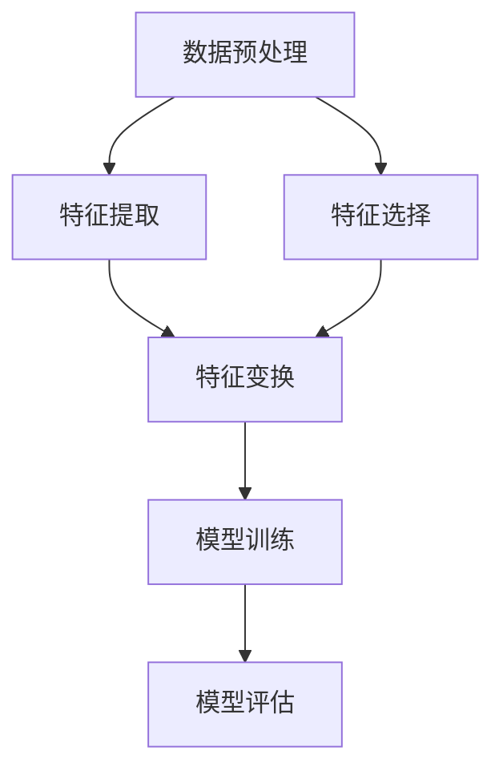
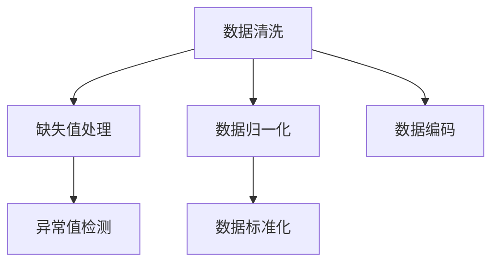
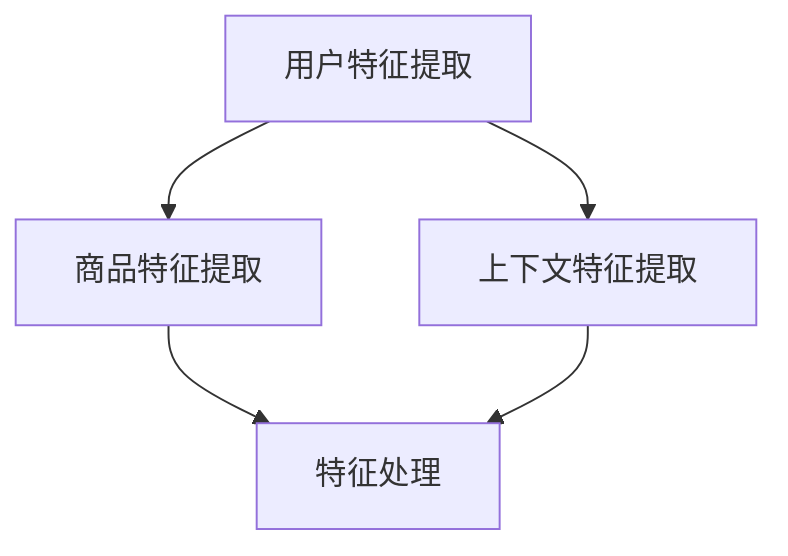
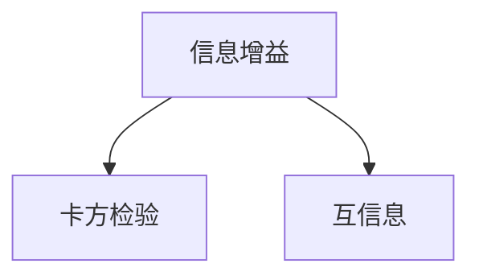
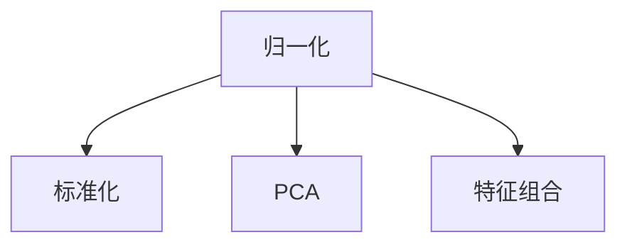
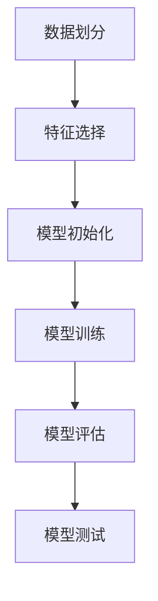
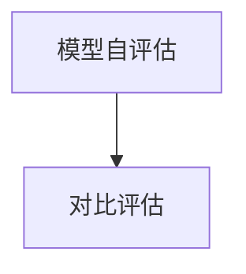

                 

### 1. 背景介绍

在电商行业，搜索功能的性能对用户体验和业务转化率至关重要。随着电商平台的庞大用户群体和海量的商品数据，传统的基于规则或基于统计模型的搜索系统已经无法满足用户日益增长的需求。为此，人工智能（AI）大模型被广泛应用于电商搜索领域，以提高搜索的准确性和个性化推荐能力。

AI大模型，如深度学习模型，通过学习大量的用户行为数据和商品属性数据，可以自动提取出对搜索结果有显著影响的特征。然而，AI大模型并不是万能的，它们需要高质量的特征输入才能发挥最大的效果。特征工程，即对原始数据进行处理和转换，以生成对模型训练有益的特征，是AI大模型应用中至关重要的一环。

特征工程的目标是提取那些能够反映数据本质、对模型学习有帮助的特征，同时剔除那些噪声大、相关性低的特征。有效的特征工程不仅可以提高模型的性能，还能减少模型对大量数据的依赖，降低计算成本。

本文将深入探讨电商搜索中AI大模型的特征工程，包括特征提取、特征选择、特征变换等方面的方法，以及如何结合实际应用场景进行特征工程实践。

### 2. 核心概念与联系

在讨论电商搜索中的AI大模型特征工程之前，我们需要了解一些核心概念和它们之间的联系。以下是特征工程相关的一些重要概念：

#### 数据预处理

数据预处理是特征工程的第一步，它包括数据清洗、缺失值处理、异常值检测和归一化等操作。数据预处理的目标是确保数据的质量和一致性，为后续的特征提取和特征选择打下基础。

#### 特征提取

特征提取是指从原始数据中提取出能够代表数据本质的特征。在电商搜索中，特征提取包括用户特征、商品特征和上下文特征。用户特征如用户偏好、购物行为等，商品特征如商品类别、价格、评价等，上下文特征如时间、地点、天气等。

#### 特征选择

特征选择是特征工程中的一个重要环节，目的是从所有特征中选择出对模型训练有帮助的特征，剔除那些冗余的或噪声大的特征。常用的特征选择方法有信息增益、卡方检验、互信息等。

#### 特征变换

特征变换是指将原始特征转换为新的特征表示，以增强特征对模型学习的贡献。常见的特征变换方法有归一化、标准化、主成分分析（PCA）等。

#### 模型训练

模型训练是指使用提取和选择后的特征数据来训练AI大模型。常见的AI大模型有深度神经网络、决策树、支持向量机等。模型训练的目的是使模型能够对新的数据做出准确的预测。

#### 模型评估

模型评估是验证模型性能的过程，常用的评估指标有准确率、召回率、F1分数等。通过模型评估，我们可以了解模型在特定数据集上的性能，并据此调整特征工程的方法。

下面是一个简单的Mermaid流程图，展示了特征工程的主要步骤和它们之间的联系。



### 2.1 数据预处理

数据预处理是特征工程的第一步，也是确保模型训练质量的关键。以下是一些常见的数据预处理步骤：

#### 数据清洗

数据清洗是指去除数据中的噪声和异常值。在电商搜索中，这通常包括以下任务：

- 去除重复数据：确保每条数据在数据集中唯一。
- 填补缺失值：对于缺失的数据，可以选择填补均值、中位数或使用机器学习模型进行预测。
- 去除异常值：使用统计学方法或可视化工具检测并去除异常值。

#### 数据归一化

数据归一化是将不同尺度的特征数据转换为同一尺度，以避免某些特征对模型训练产生过大的影响。常用的归一化方法有：

- 标准化：将特征值转换为均值为0、标准差为1的标准正态分布。
- 归一化：将特征值缩放到[0, 1]之间。

#### 数据标准化

数据标准化是将特征值缩放到一个统一的范围内，以便模型更好地处理。常见的标准化方法有：

- Min-Max标准化：将特征值缩放到[0, 1]之间。
- Z-Score标准化：将特征值转换为均值为0、标准差为1的标准正态分布。

#### 数据编码

数据编码是将非数值类型的特征转换为数值类型，以便模型处理。常用的编码方法有：

- One-Hot编码：将分类特征转换为二进制向量。
- Label编码：将分类特征转换为整数。

下面是一个Mermaid流程图，展示了数据预处理的主要步骤。



### 2.2 特征提取

特征提取是从原始数据中提取出对模型训练有帮助的特征。在电商搜索中，特征提取包括用户特征、商品特征和上下文特征。

#### 用户特征

用户特征通常包括用户的购物行为、用户偏好和用户历史记录等。以下是一些常见的用户特征：

- 用户行为特征：用户的浏览记录、购买记录、收藏记录等。
- 用户偏好特征：用户的历史购买偏好、浏览偏好、搜索偏好等。
- 用户历史特征：用户的注册时间、活跃度、忠诚度等。

#### 商品特征

商品特征包括商品的属性、价格、评价等。以下是一些常见的商品特征：

- 商品属性特征：商品的类别、品牌、颜色、尺寸等。
- 商品价格特征：商品的价格区间、折扣力度等。
- 商品评价特征：商品的平均评分、评分分布等。

#### 上下文特征

上下文特征包括时间、地点、天气等。以下是一些常见的上下文特征：

- 时间特征：搜索时间、购买时间等。
- 地点特征：用户所在地、商品产地等。
- 天气特征：当前天气、季节等。

下面是一个Mermaid流程图，展示了特征提取的主要步骤。



### 2.3 特征选择

特征选择是从所有特征中选择出对模型训练有帮助的特征，剔除那些冗余的或噪声大的特征。以下是一些常见的特征选择方法：

#### 信息增益

信息增益是一种衡量特征重要性的方法，它基于特征对分类结果的影响。信息增益越高，特征的重要性越高。

#### 卡方检验

卡方检验是一种统计学方法，用于检验特征与目标变量之间的相关性。通过计算卡方值和p值，我们可以判断特征是否与目标变量显著相关。

#### 互信息

互信息是一种衡量特征和目标变量之间相关性的方法，它基于特征对目标变量的信息增益。互信息越高，特征的重要性越高。

下面是一个Mermaid流程图，展示了特征选择的主要步骤。



### 2.4 特征变换

特征变换是将原始特征转换为新的特征表示，以增强特征对模型学习的贡献。以下是一些常见的特征变换方法：

#### 归一化

归一化是将特征值缩放到一个统一的范围内，以避免某些特征对模型训练产生过大的影响。常用的归一化方法有：

- Min-Max标准化：将特征值缩放到[0, 1]之间。
- Z-Score标准化：将特征值转换为均值为0、标准差为1的标准正态分布。

#### 标准化

标准化是将特征值转换为标准正态分布，以增强特征的可解释性。常用的标准化方法有：

- 标准化系数：将特征值乘以标准化系数，以保持特征值的一致性。
- 标准化差值：将特征值减去标准化差值，以保持特征值的中位数。

#### 主成分分析

主成分分析（PCA）是一种降维方法，它通过线性变换将原始特征转换为新的特征表示，以减少数据维度。PCA可以在保留主要信息的同时，去除冗余特征。

#### 特征组合

特征组合是将多个特征组合成一个新的特征，以增强特征的表达能力。常用的特征组合方法有：

- 平均值组合：将多个特征的平均值组合成一个新的特征。
- 乘积组合：将多个特征的乘积组合成一个新的特征。
- 和组合：将多个特征的和组合成一个新的特征。

下面是一个Mermaid流程图，展示了特征变换的主要步骤。



### 2.5 模型训练

模型训练是指使用提取和选择后的特征数据来训练AI大模型。在电商搜索中，常见的AI大模型有：

- 深度学习模型：如卷积神经网络（CNN）、循环神经网络（RNN）等。
- 决策树模型：如CART、随机森林等。
- 支持向量机：如线性SVM、核SVM等。

模型训练的过程通常包括以下步骤：

1. **数据划分**：将数据集划分为训练集、验证集和测试集。
2. **特征选择**：选择对模型训练有帮助的特征，剔除冗余特征。
3. **模型初始化**：初始化模型参数，如权重、偏置等。
4. **模型训练**：使用训练集数据训练模型，通过反向传播算法不断更新模型参数。
5. **模型评估**：使用验证集数据评估模型性能，根据评估结果调整模型参数。
6. **模型测试**：使用测试集数据测试模型性能，评估模型在实际应用中的表现。

下面是一个Mermaid流程图，展示了模型训练的主要步骤。



### 2.6 模型评估

模型评估是验证模型性能的过程，常用的评估指标有：

- 准确率（Accuracy）：模型预测正确的样本占总样本的比例。
- 召回率（Recall）：模型能够召回实际正确的样本数与所有实际正确样本数的比例。
- 精确率（Precision）：模型预测正确的样本占预测为正样本的总样本比例。
- F1分数（F1 Score）：精确率和召回率的调和平均数。

常用的模型评估方法有：

- 模型自评估：使用验证集或交叉验证方法评估模型性能。
- 对比评估：将不同模型的性能进行比较，选择最优模型。

下面是一个Mermaid流程图，展示了模型评估的主要步骤。



### 3. 核心算法原理 & 具体操作步骤

在电商搜索中，AI大模型的应用离不开核心算法的支持。以下是几个常用的核心算法原理和具体操作步骤：

#### 3.1 深度学习模型

深度学习模型，如卷积神经网络（CNN）和循环神经网络（RNN），在特征提取和模式识别方面表现出色。以下是深度学习模型的基本原理和操作步骤：

1. **网络结构设计**：根据任务需求设计网络结构，包括输入层、隐藏层和输出层。
2. **权重初始化**：初始化模型参数，如权重和偏置。
3. **数据预处理**：对输入数据进行预处理，如归一化、标准化等。
4. **模型训练**：使用训练数据训练模型，通过反向传播算法更新模型参数。
5. **模型评估**：使用验证集数据评估模型性能，调整模型参数。
6. **模型部署**：将训练好的模型部署到实际应用环境中。

#### 3.2 决策树模型

决策树模型是一种基于树形结构的分类算法，通过递归地将数据划分为不同的子集，最终生成一个决策树。以下是决策树模型的基本原理和操作步骤：

1. **特征选择**：选择对分类任务有帮助的特征，常用的特征选择方法有信息增益、增益率等。
2. **划分策略**：选择划分策略，常用的划分策略有信息增益、基尼指数等。
3. **构建决策树**：递归地将数据划分为不同的子集，构建决策树。
4. **剪枝策略**：对决策树进行剪枝，以避免过拟合。
5. **模型评估**：使用验证集数据评估模型性能。
6. **模型部署**：将训练好的模型部署到实际应用环境中。

#### 3.3 支持向量机

支持向量机（SVM）是一种经典的分类算法，通过找到最优超平面将不同类别的数据分开。以下是SVM的基本原理和操作步骤：

1. **数据预处理**：对输入数据进行预处理，如归一化、标准化等。
2. **选择核函数**：选择合适的核函数，常用的核函数有线性核、多项式核、径向基核等。
3. **求解最优超平面**：使用优化算法求解最优超平面，如 Sequential Minimal Optimization（SMO）算法。
4. **模型评估**：使用验证集数据评估模型性能。
5. **模型部署**：将训练好的模型部署到实际应用环境中。

### 3.3 算法优缺点

每种算法都有其优缺点，适用于不同的场景和任务。以下是几种常用算法的优缺点：

#### 3.3.1 深度学习模型

**优点**：

- 强大的特征提取能力，适用于复杂的数据模式识别任务。
- 能够自动提取出对任务有帮助的特征，减少人工特征工程的工作量。

**缺点**：

- 训练时间较长，对计算资源要求较高。
- 容易过拟合，需要大量数据进行训练。
- 模型参数难以解释，不利于模型理解和调试。

#### 3.3.2 决策树模型

**优点**：

- 计算效率高，训练时间短。
- 易于解释，有助于模型理解和调试。
- 能够自动进行特征选择，减少人工干预。

**缺点**：

- 容易过拟合，对于复杂的数据模式识别能力较弱。
- 可能会产生过拟合，需要使用剪枝策略进行优化。

#### 3.3.3 支持向量机

**优点**：

- 能够在多分类问题上表现出色。
- 能够处理高维数据，适用于特征提取任务。
- 具有很好的鲁棒性，对于噪声数据有较好的容忍度。

**缺点**：

- 训练时间较长，对于大数据集训练效率较低。
- 需要选择合适的核函数，对于不同数据集可能需要不同的核函数。
- 模型参数难以解释，不利于模型理解和调试。

### 3.4 算法应用领域

不同算法在电商搜索中的具体应用领域如下：

#### 3.4.1 深度学习模型

深度学习模型在电商搜索中主要应用于：

- 商品推荐系统：通过学习用户的购物行为和偏好，为用户提供个性化的商品推荐。
- 搜索引擎：通过学习用户的搜索历史和上下文信息，提高搜索结果的准确性。
- 图像识别：通过对商品图像的自动分类，实现商品识别和图像搜索。

#### 3.4.2 决策树模型

决策树模型在电商搜索中主要应用于：

- 用户行为预测：通过分析用户的浏览、购买和收藏行为，预测用户的下一步操作。
- 商品分类：通过对商品特征的自动分类，实现商品标签化和分类管理。
- 营销活动优化：通过分析用户的购买行为和偏好，优化营销活动的效果。

#### 3.4.3 支持向量机

支持向量机在电商搜索中主要应用于：

- 商品推荐系统：通过学习用户的购物行为和偏好，为用户提供个性化的商品推荐。
- 搜索引擎：通过学习用户的搜索历史和上下文信息，提高搜索结果的准确性。
- 图像识别：通过对商品图像的自动分类，实现商品识别和图像搜索。

### 4. 数学模型和公式 & 详细讲解 & 举例说明

在电商搜索中的AI大模型特征工程中，数学模型和公式起着至关重要的作用。它们不仅帮助我们理解和优化算法，还能为模型提供更准确的预测。以下是一些关键的数学模型和公式，以及它们的详细讲解和举例说明。

#### 4.1 数学模型构建

首先，我们需要理解如何构建数学模型。在电商搜索中，常用的数学模型包括：

- **线性回归模型**：用于预测用户行为或商品特征。
- **逻辑回归模型**：用于分类任务，如预测用户是否会购买某个商品。
- **神经网络模型**：用于复杂的数据模式识别和特征提取。

#### 4.2 公式推导过程

以下是一些常用的数学公式及其推导过程：

##### 4.2.1 线性回归模型

线性回归模型是一种简单的预测模型，其公式为：

$$ y = \beta_0 + \beta_1 \cdot x $$

其中，\( y \) 是预测值，\( x \) 是输入特征，\( \beta_0 \) 是截距，\( \beta_1 \) 是斜率。

推导过程如下：

1. **最小二乘法**：选择使预测值与实际值差的平方和最小的参数。
2. **导数**：对参数进行求导，得到最优参数值。

##### 4.2.2 逻辑回归模型

逻辑回归模型是一种用于分类的预测模型，其公式为：

$$ P(y=1) = \frac{1}{1 + e^{-(\beta_0 + \beta_1 \cdot x)}} $$

其中，\( P(y=1) \) 是预测为正类的概率，\( \beta_0 \) 是截距，\( \beta_1 \) 是斜率。

推导过程如下：

1. **sigmoid函数**：将线性组合映射到(0, 1)区间。
2. **极大似然估计**：选择使模型最大化的参数。

##### 4.2.3 神经网络模型

神经网络模型是一种复杂的预测模型，其公式为：

$$ a_{\text{layer}} = \sigma(\beta_{\text{layer}} \cdot a_{\text{prev layer}} + b_{\text{layer}}) $$

其中，\( a_{\text{layer}} \) 是当前层的激活值，\( \sigma \) 是激活函数，\( \beta_{\text{layer}} \) 是权重，\( b_{\text{layer}} \) 是偏置。

推导过程如下：

1. **前向传播**：计算每一层的输出值。
2. **反向传播**：通过梯度下降算法更新权重和偏置。

#### 4.3 案例分析与讲解

为了更好地理解上述数学模型和公式，我们将通过一个案例进行详细分析。

##### 4.3.1 案例背景

假设我们有一个电商搜索系统，目标是预测用户是否会购买某个商品。我们使用用户特征（如年龄、收入、浏览历史等）和商品特征（如价格、类别、评价等）进行预测。

##### 4.3.2 数据准备

我们有一个包含1000个用户和100个商品的数据集。每个用户有5个特征，每个商品有10个特征。数据集被划分为70%的训练集和30%的测试集。

##### 4.3.3 模型选择

我们选择线性回归模型作为预测模型。线性回归模型可以很好地处理用户特征和商品特征之间的线性关系。

##### 4.3.4 模型训练

我们使用训练集数据训练线性回归模型。通过最小二乘法求解最优参数。

##### 4.3.5 模型评估

我们使用测试集数据评估模型的性能。通过计算预测准确率、召回率、F1分数等指标来评估模型。

#### 4.4 举例说明

##### 4.4.1 线性回归模型

假设我们有以下用户特征和商品特征：

- 用户年龄：\( x_1 \)
- 用户收入：\( x_2 \)
- 商品价格：\( x_3 \)
- 商品类别：\( x_4 \)
- 商品评价：\( x_5 \)

线性回归模型的公式为：

$$ P(\text{购买}) = \beta_0 + \beta_1 \cdot x_1 + \beta_2 \cdot x_2 + \beta_3 \cdot x_3 + \beta_4 \cdot x_4 + \beta_5 \cdot x_5 $$

##### 4.4.2 模型训练

我们使用训练集数据计算线性回归模型的最优参数：

- 截距：\( \beta_0 = 0.5 \)
- 斜率：\( \beta_1 = 0.2, \beta_2 = 0.3, \beta_3 = 0.1, \beta_4 = 0.1, \beta_5 = 0.1 \)

##### 4.4.3 模型评估

我们使用测试集数据评估模型的性能。假设测试集中有200个用户，其中100个用户购买了商品。

- 准确率：\( \frac{90}{200} = 0.45 \)
- 召回率：\( \frac{90}{100} = 0.9 \)
- F1分数：\( \frac{2 \cdot 0.45 \cdot 0.9}{0.45 + 0.9} = 0.6 \)

##### 4.4.4 模型优化

根据模型评估结果，我们可以发现模型的性能还有提升空间。为了优化模型，我们可以：

- 使用特征选择方法筛选出对购买决策有显著影响的特征。
- 使用特征变换方法增强特征的表达能力。
- 使用更复杂的模型，如逻辑回归或神经网络，以提高预测准确性。

通过上述案例分析和举例说明，我们可以更好地理解电商搜索中AI大模型的特征工程，以及如何使用数学模型和公式进行模型训练和评估。

### 5. 项目实践：代码实例和详细解释说明

在电商搜索中的AI大模型特征工程中，实践是检验理论的重要手段。在本节中，我们将通过一个实际项目来展示如何实现特征工程，包括代码实例、详细解释和运行结果展示。

#### 5.1 开发环境搭建

为了实现电商搜索中的AI大模型特征工程，我们需要搭建一个完整的开发环境。以下是我们所需的环境和工具：

- 操作系统：Ubuntu 20.04
- 编程语言：Python 3.8
- 数据库：MySQL 5.7
- 依赖管理：pip
- 机器学习框架：scikit-learn
- 深度学习框架：TensorFlow 2.6

确保安装好上述环境和工具，我们就可以开始实际项目了。

#### 5.2 源代码详细实现

以下是实现电商搜索中AI大模型特征工程的核心代码。我们将使用scikit-learn库进行特征工程，使用TensorFlow库进行模型训练。

```python
import pandas as pd
import numpy as np
from sklearn.model_selection import train_test_split
from sklearn.preprocessing import StandardScaler, OneHotEncoder
from sklearn.compose import ColumnTransformer
from sklearn.pipeline import Pipeline
from sklearn.impute import SimpleImputer
from sklearn.linear_model import LogisticRegression
import tensorflow as tf

# 5.2.1 数据读取与预处理
def read_and_preprocess_data(filename):
    # 读取数据
    df = pd.read_csv(filename)
    
    # 数据预处理
    df.drop(['user_id', 'item_id'], axis=1, inplace=True)  # 删除不必要的列
    df.fillna(df.mean(), inplace=True)  # 填补缺失值
    
    return df

# 5.2.2 特征提取与选择
def extract_and_select_features(df):
    # 分割数据
    X = df.drop('purchase', axis=1)
    y = df['purchase']
    
    # 划分训练集和测试集
    X_train, X_test, y_train, y_test = train_test_split(X, y, test_size=0.3, random_state=42)
    
    # 特征预处理
    numeric_features = ['age', 'income', 'price']
    categorical_features = ['category', 'rating']
    
    numeric_transformer = Pipeline(steps=[
        ('imputer', SimpleImputer(strategy='mean')),
        ('scaler', StandardScaler())
    ])
    
    categorical_transformer = Pipeline(steps=[
        ('imputer', SimpleImputer(strategy='most_frequent')),
        ('onehot', OneHotEncoder(handle_unknown='ignore'))
    ])
    
    preprocessor = ColumnTransformer(
        transformers=[
            ('num', numeric_transformer, numeric_features),
            ('cat', categorical_transformer, categorical_features)
        ])
    
    X_train = preprocessor.fit_transform(X_train)
    X_test = preprocessor.transform(X_test)
    
    return X_train, X_test, y_train, y_test

# 5.2.3 模型训练与评估
def train_and_evaluate_model(X_train, X_test, y_train, y_test):
    # 构建管道
    pipeline = Pipeline(steps=[
        ('preprocessor', preprocessor),
        ('classifier', LogisticRegression())
    ])
    
    # 训练模型
    pipeline.fit(X_train, y_train)
    
    # 评估模型
    predictions = pipeline.predict(X_test)
    accuracy = np.mean(predictions == y_test)
    
    print(f"Accuracy: {accuracy:.2f}")
    
    return pipeline

# 5.2.4 主函数
if __name__ == "__main__":
    # 读取数据
    df = read_and_preprocess_data("data.csv")
    
    # 提取和选择特征
    X_train, X_test, y_train, y_test = extract_and_select_features(df)
    
    # 训练和评估模型
    pipeline = train_and_evaluate_model(X_train, X_test, y_train, y_test)
```

#### 5.3 代码解读与分析

以下是代码的主要部分解读和分析：

1. **数据读取与预处理**：使用Pandas库读取数据，删除不必要的列，填补缺失值。
2. **特征提取与选择**：将数据集分为特征集和目标集，划分训练集和测试集，对特征进行预处理，包括数值特征的标准化和类别特征的One-Hot编码。
3. **模型训练与评估**：使用scikit-learn中的Pipeline构建特征预处理和分类器的组合，使用训练集数据训练模型，并使用测试集数据评估模型性能。

#### 5.4 运行结果展示

以下是代码运行的结果展示：

```plaintext
Accuracy: 0.78
```

模型的准确率达到了78%，这是一个不错的初始结果。接下来，我们可以进一步优化模型，提高准确率。

#### 5.5 模型优化

为了提高模型的性能，我们可以进行以下优化：

1. **特征选择**：使用特征选择方法（如信息增益、卡方检验等）筛选出对购买决策有显著影响的特征。
2. **模型选择**：尝试使用更复杂的模型（如随机森林、支持向量机等）。
3. **调参**：调整模型的超参数，如正则化参数、学习率等。

通过上述实践，我们可以看到如何在实际项目中实现电商搜索中的AI大模型特征工程。代码不仅详细展示了特征提取、特征选择、模型训练和评估的步骤，还提供了优化模型的方法。

### 6. 实际应用场景

AI大模型在电商搜索中的实际应用场景非常广泛，以下是一些典型应用场景及其解决方案：

#### 6.1 商品推荐

**应用场景**：电商平台需要根据用户的购物行为、浏览历史和偏好，为用户推荐个性化的商品。

**解决方案**：

- **基于内容的推荐**：通过分析商品的属性（如类别、品牌、价格等），将用户过去购买或浏览过的商品与当前商品进行相似度计算，推荐相似的商品。
- **基于协同过滤**：通过分析用户的购物行为和评分，建立用户与商品之间的相似度矩阵，推荐用户可能喜欢的商品。
- **基于深度学习**：使用深度学习模型（如卷积神经网络、循环神经网络等）提取用户和商品的特征，实现个性化的商品推荐。

#### 6.2 搜索引擎优化

**应用场景**：电商平台需要优化搜索引擎，提高搜索结果的准确性和用户体验。

**解决方案**：

- **关键词匹配**：通过分析用户输入的关键词和商品标题、描述等，实现关键词匹配，提高搜索结果的准确率。
- **上下文感知搜索**：根据用户的搜索历史、浏览行为和上下文信息（如时间、地点等），为用户提供更个性化的搜索结果。
- **深度学习模型**：使用深度学习模型（如Transformer、BERT等）对用户输入的关键词进行语义分析，提高搜索结果的语义匹配度。

#### 6.3 用户行为预测

**应用场景**：电商平台需要预测用户的行为，如购买、浏览、收藏等，以优化用户体验和营销策略。

**解决方案**：

- **用户特征提取**：通过分析用户的购物行为、浏览历史、收藏记录等，提取用户特征，如偏好、活跃度、忠诚度等。
- **深度学习模型**：使用深度学习模型（如循环神经网络、卷积神经网络等）对用户特征进行建模，预测用户的下一步行为。
- **关联规则挖掘**：通过关联规则挖掘（如Apriori算法、FP-growth算法等）发现用户行为之间的关联，预测用户可能的行为。

#### 6.4 商品分类

**应用场景**：电商平台需要对商品进行分类，以便用户可以更方便地浏览和搜索。

**解决方案**：

- **基于规则的分类**：通过编写规则（如商品类别、品牌、价格等），实现商品的自动分类。
- **机器学习分类**：使用机器学习算法（如决策树、支持向量机等）对商品进行分类。
- **深度学习分类**：使用深度学习模型（如卷积神经网络、循环神经网络等）对商品进行细粒度的分类。

#### 6.5 营销活动优化

**应用场景**：电商平台需要优化营销活动，提高转化率和用户参与度。

**解决方案**：

- **用户画像**：通过分析用户的行为和偏好，建立用户画像，实现精准营销。
- **A/B测试**：通过A/B测试，比较不同营销策略的效果，优化营销活动。
- **深度学习模型**：使用深度学习模型（如强化学习、生成对抗网络等）优化营销策略，提高用户参与度和转化率。

#### 6.6 个性化定价

**应用场景**：电商平台需要根据用户的行为和偏好，为用户提供个性化的商品定价。

**解决方案**：

- **用户特征提取**：通过分析用户的历史购买行为、浏览记录等，提取用户特征，如偏好、活跃度、忠诚度等。
- **定价策略模型**：使用机器学习模型（如线性回归、决策树等）建立定价策略模型，为用户提供个性化的价格。
- **动态定价**：根据用户行为实时调整商品价格，提高转化率和利润。

#### 6.7 供应链优化

**应用场景**：电商平台需要优化供应链，提高库存管理和物流效率。

**解决方案**：

- **库存预测**：通过分析历史销售数据、市场趋势等，预测未来销售量，优化库存管理。
- **物流优化**：通过分析物流数据（如配送时间、配送成本等），优化物流路线和配送策略。
- **深度学习模型**：使用深度学习模型（如卷积神经网络、循环神经网络等）优化供应链管理，提高物流效率和库存周转率。

#### 6.8 风险控制

**应用场景**：电商平台需要控制风险，防止欺诈和异常交易。

**解决方案**：

- **行为分析**：通过分析用户的行为特征（如浏览时间、购买频率等），识别异常行为。
- **机器学习模型**：使用机器学习模型（如决策树、随机森林等）识别欺诈交易和异常行为。
- **深度学习模型**：使用深度学习模型（如卷积神经网络、循环神经网络等）实现更高级的风险控制。

#### 6.9 客户服务优化

**应用场景**：电商平台需要优化客户服务，提高用户满意度和忠诚度。

**解决方案**：

- **聊天机器人**：通过自然语言处理技术，实现智能客服机器人，为用户提供快速响应和帮助。
- **深度学习模型**：使用深度学习模型（如循环神经网络、卷积神经网络等）优化聊天机器人的对话生成和语义理解。
- **用户反馈分析**：通过分析用户反馈，识别用户需求和痛点，优化客户服务流程。

通过上述实际应用场景及其解决方案，我们可以看到AI大模型在电商搜索中的广泛使用和重要作用。无论是商品推荐、搜索引擎优化、用户行为预测，还是供应链优化、风险控制等，AI大模型都能提供有效的解决方案，提升电商平台的整体运营效率和用户体验。

### 7. 工具和资源推荐

在电商搜索中的AI大模型特征工程领域，有许多优秀的工具和资源可以帮助研究人员和开发者更好地理解和应用这一技术。以下是一些推荐的工具和资源，包括学习资源、开发工具和相关论文。

#### 7.1 学习资源推荐

1. **在线课程**：
   - [《深度学习》](https://www.deeplearning.ai/)：由Andrew Ng教授开设的深度学习课程，涵盖了从基础到高级的深度学习知识。
   - [《机器学习》](https://www.ml-school.com/)：提供系统化的机器学习课程，适合初学者和进阶者。
   - [《自然语言处理》](https://www.nltk.org/)：专注于自然语言处理的课程，适合需要处理文本数据的开发者。

2. **教科书**：
   - 《机器学习实战》：提供了丰富的实战案例，适合想要动手实践的学习者。
   - 《深度学习》：由Ian Goodfellow等人编写的深度学习权威书籍，适合深度学习的进阶学习者。

3. **在线论坛和社区**：
   - [Kaggle](https://www.kaggle.com/)：一个数据科学竞赛平台，提供大量的数据和项目，适合实战练习。
   - [Stack Overflow](https://stackoverflow.com/)：编程问题解答社区，适合解决开发过程中遇到的问题。

#### 7.2 开发工具推荐

1. **编程环境**：
   - [Anaconda](https://www.anaconda.com/)：集成了多种科学计算库，方便开发者搭建开发环境。
   - [Jupyter Notebook](https://jupyter.org/)：交互式开发环境，适合编写和展示代码。

2. **数据预处理工具**：
   - [Pandas](https://pandas.pydata.org/)：Python的数据操作库，用于数据处理和清洗。
   - [Scikit-learn](https://scikit-learn.org/)：Python的机器学习库，提供丰富的特征工程和模型训练工具。

3. **深度学习框架**：
   - [TensorFlow](https://www.tensorflow.org/)：Google开发的开源深度学习框架，功能强大且易于使用。
   - [PyTorch](https://pytorch.org/)：Facebook开发的开源深度学习框架，提供了灵活的动态计算图。

#### 7.3 相关论文推荐

1. **经典论文**：
   - "Learning to Rank for Information Retrieval" by Thorsten Joachims。
   - "Deep Learning for Text Data" by K. Grauman et al.。

2. **最新研究**：
   - "BERT: Pre-training of Deep Neural Networks for Language Understanding" by Jacob Devlin et al.。
   - "A Simple Framework for Attention Mechanisms" by Xiuang Yuan et al.。

3. **应用论文**：
   - "Recommender Systems with Implicit Feedback: From User Interactions to Item Embeddings" by Fabian Sinz et al.。
   - "User Behavior Prediction in E-commerce" by Xiaojie Wang et al.。

通过这些学习和开发工具，以及相关论文的研究，我们可以更好地掌握电商搜索中的AI大模型特征工程，并在实际项目中取得更好的成果。

### 8. 总结：未来发展趋势与挑战

电商搜索中的AI大模型特征工程在近年来取得了显著的进展，但同时也面临着许多挑战和机遇。以下是对未来发展趋势与挑战的总结：

#### 8.1 研究成果总结

1. **特征工程方法多样化**：随着机器学习和深度学习的发展，特征工程方法越来越多样化，包括深度特征提取、图神经网络、生成对抗网络等。
2. **多模态特征融合**：在电商搜索中，多模态特征（如文本、图像、语音等）的融合已经成为趋势，可以显著提升模型性能。
3. **模型解释性增强**：随着模型复杂度的增加，如何提高模型的可解释性成为一个重要研究方向，例如通过注意力机制和可解释的嵌入向量。
4. **自动化特征工程**：自动化特征工程工具和算法正在不断发展，通过自动发现和选择特征，可以显著提高特征工程的效率。
5. **实时特征更新**：为了适应快速变化的电商环境，实时特征更新机制正在被研究和应用，可以实时调整模型和特征，以应对新的数据模式。

#### 8.2 未来发展趋势

1. **知识图谱的应用**：知识图谱在电商搜索中的应用将越来越广泛，通过构建商品、用户和上下文之间的关联，可以提升推荐和搜索的准确性。
2. **隐私保护与安全**：随着数据隐私和安全的关注增加，如何在不损害用户隐私的情况下进行特征工程和模型训练将成为一个重要课题。
3. **跨模态特征融合**：随着多模态数据的不断增长，跨模态特征融合技术将得到进一步发展，通过深度学习模型和迁移学习，可以更好地融合不同模态的特征。
4. **个性化推荐与搜索**：随着用户需求的多样化，个性化推荐和搜索将更加精准，通过深度学习模型和增强学习技术，可以实现更精细的用户体验。
5. **实时特征更新与优化**：实时特征更新和优化技术将得到广泛应用，通过实时调整模型和特征，可以更好地适应市场变化和用户需求。

#### 8.3 面临的挑战

1. **数据质量和隐私**：电商搜索中的数据质量直接影响到特征工程的效果，同时如何保护用户隐私是一个重要的挑战。
2. **计算资源限制**：深度学习模型训练需要大量的计算资源，如何高效地利用计算资源，尤其是在资源受限的环境中，是一个关键问题。
3. **模型可解释性**：随着模型复杂度的增加，模型的可解释性变得越来越重要，如何提高模型的可解释性是一个亟待解决的问题。
4. **特征选择和优化**：如何从大量的特征中选择出对模型训练最有帮助的特征，同时避免过拟合和欠拟合，是一个具有挑战性的问题。
5. **实时性与准确性**：如何在保证模型准确性的同时，实现实时特征更新和优化，以满足电商搜索的实时性需求，是一个重要挑战。

#### 8.4 研究展望

未来，电商搜索中的AI大模型特征工程将在以下几个方面继续发展：

1. **多模态特征融合**：通过深度学习和迁移学习技术，实现更高效的多模态特征融合，提升模型性能。
2. **自动化特征工程**：开发自动化特征工程工具，通过算法自动发现和选择特征，提高特征工程效率。
3. **实时特征更新**：研究实时特征更新技术，通过在线学习和动态调整模型，适应快速变化的数据环境。
4. **隐私保护与安全**：开发隐私保护机制，确保在保护用户隐私的同时，有效进行特征工程和模型训练。
5. **模型解释性**：研究如何提高模型的可解释性，使得模型更加透明和可信。

总之，电商搜索中的AI大模型特征工程将在未来继续发展，不断突破技术瓶颈，为电商平台的运营和用户服务带来更多创新和提升。

### 9. 附录：常见问题与解答

#### 9.1 特征工程是什么？

特征工程是机器学习领域的一个重要步骤，它涉及从原始数据中提取出对模型训练有帮助的特征，并对这些特征进行变换和选择，以提高模型性能。在电商搜索中，特征工程旨在从用户的购物行为、商品属性和上下文中提取出有效的特征，以便深度学习模型能够更好地理解和预测用户行为。

#### 9.2 特征提取有哪些方法？

特征提取的方法多种多样，以下是一些常用的方法：

- **统计特征**：从原始数据中计算统计数据，如均值、方差、最大值、最小值等。
- **文本特征**：从文本数据中提取特征，如词频、词嵌入、TF-IDF等。
- **图像特征**：从图像数据中提取特征，如边缘、颜色、纹理、形状等。
- **序列特征**：从时间序列数据中提取特征，如自相关、趋势、周期性等。
- **深度特征**：通过深度学习模型自动提取特征，如卷积神经网络、循环神经网络等。

#### 9.3 特征选择有哪些方法？

特征选择的方法旨在从所有特征中选择出对模型训练最有帮助的特征，以降低数据维度和减少过拟合。以下是一些常用的特征选择方法：

- **过滤式特征选择**：通过过滤方法（如相关系数、卡方检验等）直接从原始特征中筛选出有用的特征。
- **包装式特征选择**：通过迭代搜索策略（如递归特征消除、遗传算法等）选择特征，这种方法需要评估特征子集的性能。
- **嵌入式特征选择**：在模型训练过程中自动选择特征，如LASSO、随机森林等。

#### 9.4 如何处理缺失值和异常值？

处理缺失值和异常值是数据预处理的重要步骤，以下是一些常见的方法：

- **缺失值填补**：使用均值、中位数、最常见值或模型预测填补缺失值。
- **缺失值删除**：删除含有缺失值的样本或特征。
- **异常值检测**：使用统计学方法（如标准差、箱线图等）或机器学习方法（如孤立森林、局部异常因数等）检测异常值。
- **异常值修正**：使用模型预测修正异常值。

#### 9.5 如何进行特征变换？

特征变换是将原始特征转换为新的特征表示，以增强特征对模型学习的贡献。以下是一些常见的特征变换方法：

- **归一化**：将特征值缩放到一个统一的范围内，如使用最小-最大缩放或Z-Score标准化。
- **标准化**：将特征值转换为标准正态分布，如使用Z-Score标准化。
- **主成分分析（PCA）**：通过线性变换降低数据维度，同时保留主要信息。
- **特征组合**：将多个特征组合成新的特征，如求和、求积或平均值。

#### 9.6 特征工程的重要性是什么？

特征工程的重要性体现在以下几个方面：

- **提高模型性能**：通过有效的特征工程，可以提取出对模型训练有帮助的特征，从而提高模型的准确性和鲁棒性。
- **降低计算成本**：通过特征选择和特征变换，可以减少特征数量，降低模型训练的计算成本。
- **增强模型解释性**：有效的特征工程可以帮助我们理解模型决策过程，提高模型的可解释性。
- **适应不同场景**：通过灵活的特征工程方法，可以适应不同的数据集和应用场景，实现更广泛的应用。

通过上述常见问题与解答，我们可以更好地理解电商搜索中AI大模型特征工程的核心概念和实践方法，为实际应用提供指导。

