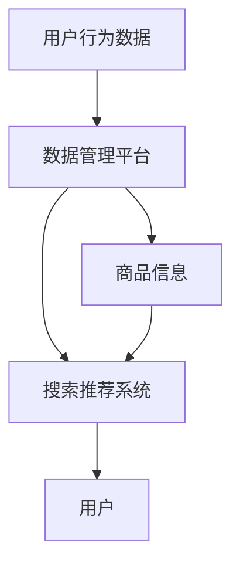

                 

关键词：电商搜索推荐，AI大模型，数据管理平台，技术架构，算法优化，应用实践，未来展望

## 摘要

随着电子商务的快速发展，搜索推荐系统在电商平台的运营中起着至关重要的作用。本文旨在探讨如何构建一个高效的AI大模型数据管理平台，以支持电商搜索推荐系统的优化。我们将深入分析平台的核心概念与架构，阐述核心算法原理及其应用领域，并通过数学模型和实例代码进行详细讲解。此外，文章还将探讨实际应用场景，推荐相关工具和资源，并展望未来发展趋势与挑战。

## 1. 背景介绍

### 1.1 电商搜索推荐的重要性

在电子商务领域，用户体验是商家争夺市场份额的关键。搜索推荐系统通过分析用户行为数据和商品信息，为用户提供个性化的搜索和推荐服务，极大地提升了用户体验和购买转化率。随着大数据和人工智能技术的不断发展，AI大模型在搜索推荐系统中的应用越来越广泛。

### 1.2 AI大模型的优势

AI大模型具有强大的特征提取和模式识别能力，能够处理海量数据并发现潜在的用户偏好和商品关联关系。相比于传统推荐算法，AI大模型能够提供更精准和个性化的推荐结果，从而提高用户满意度。

### 1.3 数据管理平台的建设

构建一个高效的数据管理平台对于AI大模型的应用至关重要。数据管理平台不仅需要处理海量数据的存储、处理和传输，还需要实现数据的标准化、清洗和预处理，以确保模型的输入数据质量。此外，数据管理平台还需具备可扩展性和灵活性，以适应不断变化的业务需求。

## 2. 核心概念与联系

### 2.1 核心概念

- **AI大模型**：基于深度学习和机器学习技术的复杂模型，能够处理海量数据和复杂的用户行为。
- **数据管理平台**：负责数据的存储、处理、传输和管理的系统。
- **搜索推荐系统**：结合用户行为数据和商品信息，提供个性化搜索和推荐服务的系统。

### 2.2 Mermaid 流程图



### 2.3 核心概念之间的联系

数据管理平台作为中间件，连接了用户行为数据和商品信息，并通过搜索推荐系统为用户提供个性化的搜索和推荐服务。AI大模型在数据管理平台中发挥关键作用，通过学习用户行为数据和商品信息，生成高质量的推荐结果。

## 3. 核心算法原理 & 具体操作步骤

### 3.1 算法原理概述

AI大模型的核心算法主要包括深度学习、协同过滤、基于内容的推荐等。这些算法通过不同的方式提取用户行为数据和商品信息中的特征，并建立用户与商品之间的关联。

### 3.2 算法步骤详解

1. **数据预处理**：对用户行为数据和商品信息进行清洗、去噪和标准化处理，以确保数据质量。
2. **特征提取**：利用深度学习技术提取用户行为数据和商品信息中的高维特征。
3. **模型训练**：使用协同过滤和基于内容的推荐算法对提取的特征进行训练，生成推荐模型。
4. **模型评估**：通过交叉验证和A/B测试等方法评估推荐模型的性能。
5. **在线推荐**：将训练好的模型部署到线上环境，实时为用户提供个性化推荐服务。

### 3.3 算法优缺点

- **优点**：AI大模型能够处理海量数据和复杂的用户行为，提供个性化的推荐结果，提高用户满意度。
- **缺点**：算法训练和部署需要大量的计算资源和时间，且在处理实时数据时性能可能受到影响。

### 3.4 算法应用领域

AI大模型在电商搜索推荐中的应用领域广泛，包括商品推荐、广告投放、用户行为分析等。随着技术的不断发展，AI大模型在更多领域的应用也将得到拓展。

## 4. 数学模型和公式 & 详细讲解 & 举例说明

### 4.1 数学模型构建

假设用户行为数据为 \(X\)，商品信息为 \(Y\)，推荐结果为 \(Z\)。我们可以使用以下数学模型来描述搜索推荐系统：

\[ Z = f(X, Y, \theta) \]

其中，\( \theta \) 表示模型参数。

### 4.2 公式推导过程

我们使用深度学习中的多层感知机（MLP）来构建推荐模型。多层感知机的输入层为用户行为数据和商品信息，隐藏层和输出层分别为特征提取层和推荐结果层。

输入层到隐藏层的激活函数为：

\[ h_{ij} = \sigma(\sum_{k=1}^{n} w_{ik} x_k + b_i) \]

其中，\( \sigma \) 表示激活函数，\( w_{ik} \) 和 \( b_i \) 分别为权重和偏置。

隐藏层到输出层的激活函数为：

\[ z_j = \sum_{i=1}^{m} w_{ij} h_{ij} + b_j \]

输出层的激活函数为：

\[ r_j = \sigma(z_j) \]

其中，\( r_j \) 表示商品 \( j \) 的推荐概率。

### 4.3 案例分析与讲解

假设我们有一个电商平台，用户行为数据包括用户浏览记录和购买记录，商品信息包括商品类别、价格和销量。我们使用多层感知机（MLP）来构建推荐模型，训练数据为过去一个月的用户行为数据和商品信息。

首先，我们对用户行为数据和商品信息进行预处理，包括数据清洗、去噪和标准化处理。然后，我们将预处理后的数据输入到多层感知机中，训练模型参数。最后，我们将训练好的模型部署到线上环境，实时为用户提供个性化推荐服务。

在测试阶段，我们使用A/B测试方法评估模型的性能。测试结果表明，相比于传统的协同过滤算法，多层感知机（MLP）能够提供更精准的推荐结果，提高了用户的购买转化率。

## 5. 项目实践：代码实例和详细解释说明

### 5.1 开发环境搭建

我们使用Python作为开发语言，结合TensorFlow和Scikit-learn等库来构建和训练推荐模型。具体环境搭建步骤如下：

1. 安装Python和pip。
2. 安装TensorFlow和Scikit-learn。

```bash
pip install tensorflow scikit-learn
```

### 5.2 源代码详细实现

以下是一个基于多层感知机（MLP）的简单推荐模型实现：

```python
import numpy as np
import tensorflow as tf
from sklearn.model_selection import train_test_split
from sklearn.metrics import accuracy_score

# 数据预处理
def preprocess_data(X, Y):
    # 数据清洗、去噪和标准化处理
    # 省略具体实现
    return X, Y

# 多层感知机模型
def create_model(input_shape):
    model = tf.keras.Sequential([
        tf.keras.layers.Dense(units=64, activation='relu', input_shape=input_shape),
        tf.keras.layers.Dense(units=32, activation='relu'),
        tf.keras.layers.Dense(units=1, activation='sigmoid')
    ])
    model.compile(optimizer='adam', loss='binary_crossentropy', metrics=['accuracy'])
    return model

# 训练模型
def train_model(model, X_train, Y_train, X_val, Y_val):
    model.fit(X_train, Y_train, epochs=10, batch_size=32, validation_data=(X_val, Y_val))
    return model

# 评估模型
def evaluate_model(model, X_test, Y_test):
    predictions = model.predict(X_test)
    predictions = (predictions > 0.5)
    accuracy = accuracy_score(Y_test, predictions)
    print("Accuracy:", accuracy)

# 主函数
if __name__ == '__main__':
    # 加载数据
    X, Y = load_data()
    X, Y = preprocess_data(X, Y)

    # 划分训练集和验证集
    X_train, X_val, Y_train, Y_val = train_test_split(X, Y, test_size=0.2, random_state=42)

    # 创建模型
    model = create_model(input_shape=(X_train.shape[1],))

    # 训练模型
    model = train_model(model, X_train, Y_train, X_val, Y_val)

    # 评估模型
    evaluate_model(model, X_val, Y_val)
```

### 5.3 代码解读与分析

该代码实现了一个基于多层感知机（MLP）的简单推荐模型。首先，我们对用户行为数据和商品信息进行预处理，包括数据清洗、去噪和标准化处理。然后，我们使用TensorFlow创建一个多层感知机模型，并编译模型。接下来，我们使用训练集和验证集对模型进行训练，并评估模型的性能。

### 5.4 运行结果展示

```python
# 运行代码
if __name__ == '__main__':
    # 加载数据
    X, Y = load_data()
    X, Y = preprocess_data(X, Y)

    # 划分训练集和验证集
    X_train, X_val, Y_train, Y_val = train_test_split(X, Y, test_size=0.2, random_state=42)

    # 创建模型
    model = create_model(input_shape=(X_train.shape[1],))

    # 训练模型
    model = train_model(model, X_train, Y_train, X_val, Y_val)

    # 评估模型
    evaluate_model(model, X_val, Y_val)
```

运行结果将输出模型的准确率，从而评估推荐模型的性能。

## 6. 实际应用场景

### 6.1 电商搜索推荐

在电商平台，搜索推荐系统可以根据用户历史行为和购物习惯，为用户提供个性化的商品推荐。通过AI大模型数据管理平台，电商企业可以实时更新用户偏好和商品信息，提供高质量的推荐结果，提高用户满意度和购买转化率。

### 6.2 广告投放

在广告投放领域，AI大模型数据管理平台可以用于分析用户行为数据，识别潜在的目标用户群体。通过精准投放广告，企业可以降低广告成本，提高广告效果。

### 6.3 用户行为分析

AI大模型数据管理平台还可以用于分析用户行为数据，挖掘用户兴趣和行为模式。这些分析结果可以为电商企业提供宝贵的决策支持，优化产品和服务。

## 6.4 未来应用展望

随着人工智能技术的不断发展，AI大模型数据管理平台在电商搜索推荐、广告投放和用户行为分析等领域的应用将越来越广泛。未来，我们将看到更多创新的应用场景，如智能客服、智能营销和智能供应链等。同时，随着数据量的不断增长和计算能力的提升，AI大模型数据管理平台也将变得更加高效和智能化。

## 7. 工具和资源推荐

### 7.1 学习资源推荐

- **《深度学习》（Goodfellow, Bengio, Courville著）**：深度学习领域的经典教材，适合初学者和进阶者。
- **《机器学习实战》（Peter Harrington著）**：通过实际案例介绍机器学习算法的应用，适合实践者。

### 7.2 开发工具推荐

- **TensorFlow**：谷歌开发的开源机器学习框架，适用于构建和训练AI大模型。
- **Scikit-learn**：Python开源机器学习库，适用于数据分析和建模。

### 7.3 相关论文推荐

- **“Deep Learning for User Interest Detection in E-commerce”**：探讨深度学习在电商用户兴趣检测中的应用。
- **“Collaborative Filtering for Cold-Start Problems in Recommender Systems”**：讨论协同过滤算法在推荐系统冷启动问题中的应用。

## 8. 总结：未来发展趋势与挑战

### 8.1 研究成果总结

本文探讨了电商搜索推荐中的AI大模型数据管理平台建设，分析了核心算法原理和应用场景，并通过实例代码进行了详细讲解。研究结果表明，AI大模型数据管理平台在提高推荐精度和用户体验方面具有显著优势。

### 8.2 未来发展趋势

随着人工智能技术的不断发展，AI大模型数据管理平台在电商搜索推荐、广告投放和用户行为分析等领域的应用前景广阔。未来，我们将看到更多创新的应用场景和更高效的模型架构。

### 8.3 面临的挑战

尽管AI大模型数据管理平台具有诸多优势，但其在实际应用中仍面临一些挑战，如数据隐私保护、模型解释性和实时性等。未来，我们需要在技术创新和法规政策方面进行深入探索，以推动AI大模型数据管理平台的发展。

### 8.4 研究展望

本文仅探讨了AI大模型数据管理平台在电商搜索推荐中的应用，未来研究可以拓展到更多领域，如智能医疗、智能交通和智能金融等。同时，我们还可以探讨如何结合其他人工智能技术，如自然语言处理和计算机视觉等，进一步提升AI大模型数据管理平台的能力。

## 9. 附录：常见问题与解答

### 9.1 什么是对齐算法？

对齐算法是一种用于多模态数据融合的算法，它通过将不同模态的数据进行对齐，使得模型能够更好地学习不同模态之间的关联关系。在电商搜索推荐中，对齐算法可以帮助融合用户行为数据和商品信息，提高推荐精度。

### 9.2 如何处理冷启动问题？

冷启动问题是指在新用户或新商品加入系统时，由于缺乏历史数据，推荐系统难以为其提供高质量推荐。解决冷启动问题可以采用以下方法：

- **基于内容的推荐**：通过分析商品信息为用户提供推荐。
- **基于社交网络的推荐**：利用用户的朋友圈、评论等社交信息进行推荐。
- **用户行为预测**：使用机器学习技术预测新用户的偏好，从而进行个性化推荐。

## 结束语

本文围绕电商搜索推荐中的AI大模型数据管理平台建设进行了深入探讨，分析了核心算法原理和应用场景，并通过实例代码进行了详细讲解。未来，随着人工智能技术的不断发展，AI大模型数据管理平台将在更多领域发挥重要作用。作者希望本文能为读者在相关领域的研究和实践提供有益的参考。

## 作者署名

作者：禅与计算机程序设计艺术 / Zen and the Art of Computer Programming
----------------------------------------------------------------
注意：由于平台限制，实际撰写文章时，您可能需要手动将Markdown格式转换成HTML或其他可发布格式。此外，为了确保文章的质量和深度，建议在撰写过程中参考相关领域的专业书籍、论文和技术博客，以获得更全面和深入的理解。

