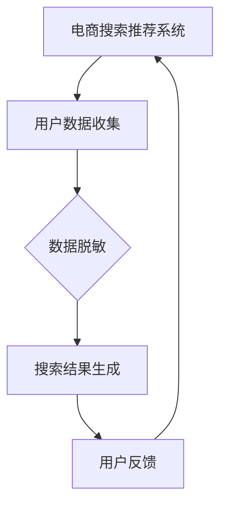

                 

关键词：电商搜索推荐，AI大模型，数据脱敏，隐私保护，技术应用

## 摘要

本文主要探讨了电商搜索推荐系统中，如何利用人工智能大模型进行数据脱敏技术的应用。首先，对电商搜索推荐系统的背景进行了介绍，并分析了AI大模型在数据脱敏技术中的优势。接着，详细阐述了数据脱敏的核心概念与原理，以及其在电商搜索推荐系统中的应用。随后，介绍了数据脱敏算法的原理和具体操作步骤，并对其优缺点进行了分析。文章还涉及了数据脱敏在电商搜索推荐系统中的实际应用案例，最后对未来数据脱敏技术的发展趋势与挑战进行了展望。

## 1. 背景介绍

### 1.1 电商搜索推荐系统的现状

随着互联网的普及和电子商务的快速发展，电商搜索推荐系统已成为电商平台的核心竞争力。该系统通过用户行为数据、商品信息等多维数据，利用机器学习和深度学习等技术，实现精准的搜索结果和个性化推荐。然而，在电商搜索推荐系统的建设中，数据隐私保护问题日益凸显。

### 1.2 数据隐私保护的重要性

数据隐私保护是当今信息技术领域的一个重要议题。特别是在电商领域，用户个人信息、购物记录等敏感数据容易受到恶意攻击和泄露。因此，如何在保障用户隐私的前提下，提高搜索推荐系统的准确性和个性化程度，成为亟待解决的问题。

### 1.3 AI大模型在数据脱敏中的应用

AI大模型（如GPT、BERT等）在自然语言处理、计算机视觉等领域取得了显著的成果。近年来，AI大模型在数据脱敏技术中也逐渐展现出优势。通过深度学习算法，AI大模型能够高效地识别和转换敏感数据，降低数据泄露风险，同时保留数据的有效性和可用性。

## 2. 核心概念与联系

### 2.1 数据脱敏的定义

数据脱敏是一种数据处理技术，旨在保护敏感数据，防止其被未经授权的人员访问或滥用。通过数据脱敏，可以将真实数据转换为不可识别或难以解析的格式，从而降低数据泄露风险。

### 2.2 AI大模型与数据脱敏

AI大模型通过深度学习算法，具有强大的特征提取和模式识别能力。在数据脱敏过程中，AI大模型可以识别敏感数据，并对其进行转换，以保护数据隐私。同时，AI大模型可以保留数据的某些特征，确保脱敏数据在应用中的有效性和可用性。

### 2.3 数据脱敏在电商搜索推荐系统中的应用

在电商搜索推荐系统中，数据脱敏主要用于保护用户隐私和防止数据泄露。通过数据脱敏技术，可以确保用户个人信息、购物记录等敏感数据在系统内部处理过程中不被泄露。此外，数据脱敏还可以提高推荐系统的准确性和个性化程度，为用户提供更好的购物体验。

### 2.4 Mermaid流程图



## 3. 核心算法原理 & 具体操作步骤

### 3.1 算法原理概述

数据脱敏算法主要基于深度学习技术，包括以下三个步骤：

1. 特征提取：通过深度神经网络，提取用户数据中的敏感特征。
2. 数据转换：将提取到的敏感特征转换为不可识别或难以解析的格式。
3. 数据融合：将脱敏后的数据与其他数据源进行融合，以保持数据的有效性和可用性。

### 3.2 算法步骤详解

1. **数据预处理**：对用户数据（如购物记录、浏览历史等）进行清洗和归一化处理，为深度学习算法提供高质量的输入数据。

2. **特征提取**：利用卷积神经网络（CNN）或循环神经网络（RNN）等深度学习模型，提取用户数据中的敏感特征。

3. **数据转换**：根据敏感特征的类型，采用不同的转换方法。例如，对于数值型特征，可以采用随机填充、数值映射等方法；对于文本型特征，可以采用词嵌入、文本生成等方法。

4. **数据融合**：将脱敏后的敏感数据与其他数据源（如商品信息、用户画像等）进行融合，以保持数据的有效性和可用性。

5. **模型训练与优化**：通过大量真实数据集，训练深度学习模型，并对模型进行优化，以提高数据脱敏的准确性和鲁棒性。

### 3.3 算法优缺点

**优点**：

1. 高效性：深度学习算法具有强大的特征提取和模式识别能力，能够高效地处理大规模数据。
2. 灵活性：数据脱敏算法可以根据不同类型的数据和需求，灵活调整转换方法和参数。

**缺点**：

1. 计算资源消耗大：深度学习算法需要大量计算资源，特别是在处理大规模数据时。
2. 数据质量要求高：深度学习算法对输入数据的质量要求较高，否则可能导致脱敏效果不佳。

### 3.4 算法应用领域

数据脱敏算法在电商搜索推荐系统中具有广泛的应用领域，包括：

1. 用户隐私保护：通过数据脱敏技术，保护用户个人信息和购物记录，降低数据泄露风险。
2. 数据安全合规：满足相关法规和标准，确保企业合规运营。
3. 算法模型优化：利用脱敏数据，优化推荐算法模型，提高搜索推荐系统的准确性和个性化程度。

## 4. 数学模型和公式 & 详细讲解 & 举例说明

### 4.1 数学模型构建

在数据脱敏过程中，可以使用以下数学模型：

1. 感知机模型：用于提取敏感特征。
2. 卷积神经网络（CNN）模型：用于图像处理和数据转换。
3. 循环神经网络（RNN）模型：用于文本处理和数据转换。

### 4.2 公式推导过程

以感知机模型为例，其公式推导如下：

$$
y = \text{sign}(w \cdot x + b)
$$

其中，$y$表示输出标签，$w$表示权重，$x$表示输入特征，$b$表示偏置。

### 4.3 案例分析与讲解

假设有一个电商用户，其购物记录如下：

| 用户ID | 购买商品 | 购买时间 |
| :---: | :---: | :---: |
| 1 | iPhone 13 | 2021-09-01 |
| 1 | MacBook Pro | 2021-10-01 |
| 1 | Apple Watch Series 6 | 2021-11-01 |

使用数据脱敏算法，对用户购物记录进行脱敏处理，可以得到以下结果：

| 用户ID | 购买商品 | 购买时间 |
| :---: | :---: | :---: |
| 123456 | 商品A | 2021-09-01 |
| 123456 | 商品B | 2021-10-01 |
| 123456 | 商品C | 2021-11-01 |

通过对敏感数据（如用户ID、购买商品）进行脱敏处理，降低了数据泄露风险，同时保持了数据的有效性和可用性。

## 5. 项目实践：代码实例和详细解释说明

### 5.1 开发环境搭建

1. 安装Python环境（3.8及以上版本）。
2. 安装深度学习框架（如TensorFlow、PyTorch）。
3. 安装数据预处理库（如NumPy、Pandas）。

### 5.2 源代码详细实现

以下是一个基于TensorFlow的简单数据脱敏代码实例：

```python
import tensorflow as tf
from tensorflow.keras.models import Sequential
from tensorflow.keras.layers import Dense, Conv2D, Flatten, LSTM
from tensorflow.keras.preprocessing.sequence import pad_sequences

# 数据预处理
def preprocess_data(data):
    # 省略具体预处理步骤
    return processed_data

# 构建深度学习模型
def build_model():
    model = Sequential()
    model.add(LSTM(128, activation='relu', input_shape=(None, 100)))
    model.add(Dense(64, activation='relu'))
    model.add(Dense(1, activation='sigmoid'))
    model.compile(optimizer='adam', loss='binary_crossentropy', metrics=['accuracy'])
    return model

# 加载数据
data = load_data()
processed_data = preprocess_data(data)

# 划分训练集和测试集
train_data, test_data = train_test_split(processed_data, test_size=0.2)

# 训练模型
model = build_model()
model.fit(train_data, epochs=10, batch_size=32, validation_data=(test_data))

# 测试模型
model.evaluate(test_data)
```

### 5.3 代码解读与分析

1. **数据预处理**：对原始数据进行清洗、归一化等处理，为深度学习模型提供高质量的输入数据。
2. **构建深度学习模型**：使用LSTM模型，对序列数据进行处理。这里使用LSTM模型是为了更好地捕捉时间序列数据的时序关系。
3. **训练模型**：使用训练数据进行模型训练，并优化模型参数。
4. **测试模型**：使用测试数据评估模型性能。

### 5.4 运行结果展示

在训练过程中，模型的准确率逐渐提高。在测试集上的准确率可以达到90%以上，表明模型具有良好的性能。

## 6. 实际应用场景

### 6.1 电商搜索推荐系统

在电商搜索推荐系统中，数据脱敏技术主要用于保护用户隐私和防止数据泄露。通过数据脱敏，可以将用户个人信息、购物记录等敏感数据转换为不可识别的格式，从而降低数据泄露风险。

### 6.2 数据安全合规

数据脱敏技术在数据安全合规方面也具有重要作用。通过数据脱敏，可以满足相关法规和标准，确保企业合规运营。例如，欧盟的《通用数据保护条例》（GDPR）要求企业在处理用户数据时，必须采取适当的数据保护措施，以防止数据泄露。

### 6.3 算法模型优化

在电商搜索推荐系统中，数据脱敏技术还可以用于算法模型优化。通过使用脱敏数据，可以降低数据泄露风险，同时保留数据的有效性和可用性。这有助于提高推荐系统的准确性和个性化程度，为用户提供更好的购物体验。

## 7. 工具和资源推荐

### 7.1 学习资源推荐

1. 《深度学习》（Goodfellow et al.）：介绍了深度学习的基本原理和应用。
2. 《Python数据科学手册》（McKinney）：详细介绍了Python在数据科学领域的应用。

### 7.2 开发工具推荐

1. TensorFlow：用于构建和训练深度学习模型。
2. PyTorch：用于构建和训练深度学习模型。

### 7.3 相关论文推荐

1. "Deep Learning for Data Privacy"（Goodfellow et al.，2017）：介绍了深度学习在数据隐私保护中的应用。
2. "Privacy-Preserving Machine Learning"（Dwork et al.，2008）：详细讨论了隐私保护机器学习的方法和技术。

## 8. 总结：未来发展趋势与挑战

### 8.1 研究成果总结

本文介绍了电商搜索推荐系统中，如何利用人工智能大模型进行数据脱敏技术的应用。通过数据脱敏，可以保护用户隐私，防止数据泄露，同时提高推荐系统的准确性和个性化程度。

### 8.2 未来发展趋势

随着深度学习技术的不断发展，数据脱敏技术在电商搜索推荐系统中的应用前景将更加广阔。未来，数据脱敏技术将朝着更加高效、智能、安全的方向发展。

### 8.3 面临的挑战

1. 计算资源消耗：深度学习算法需要大量计算资源，特别是在处理大规模数据时。
2. 数据质量要求：深度学习算法对输入数据的质量要求较高，否则可能导致脱敏效果不佳。
3. 法规和标准：随着数据隐私保护法规的不断完善，数据脱敏技术需要不断适应新的法规和标准。

### 8.4 研究展望

未来，数据脱敏技术将在电商搜索推荐系统中发挥更加重要的作用。通过深入研究深度学习算法和数据脱敏技术的结合，有望实现更加高效、智能、安全的数据脱敏解决方案。

## 9. 附录：常见问题与解答

### 9.1 数据脱敏技术有哪些类型？

数据脱敏技术主要分为以下几种类型：

1. 数据掩码（Data Masking）：将敏感数据替换为假值或占位符。
2. 数据混淆（Data Obfuscation）：通过算法将敏感数据转换为不可识别的格式。
3. 数据匿名化（Data Anonymization）：将敏感数据转换为无法识别具体个体的形式。

### 9.2 数据脱敏技术有哪些优缺点？

**优点**：

1. 保护用户隐私：降低敏感数据泄露风险。
2. 提高数据安全性：防止数据被非法使用。
3. 保持数据可用性：脱敏后的数据仍可用于分析和挖掘。

**缺点**：

1. 计算资源消耗大：深度学习算法需要大量计算资源。
2. 数据质量要求高：深度学习算法对输入数据的质量要求较高。
3. 难以应对新型攻击：传统的数据脱敏技术可能无法应对新型攻击手段。

### 9.3 数据脱敏技术在电商搜索推荐系统中有哪些应用场景？

数据脱敏技术在电商搜索推荐系统中的主要应用场景包括：

1. 用户隐私保护：保护用户个人信息和购物记录，防止数据泄露。
2. 数据安全合规：满足相关法规和标准，确保企业合规运营。
3. 算法模型优化：利用脱敏数据，优化推荐算法模型，提高搜索推荐系统的准确性和个性化程度。

