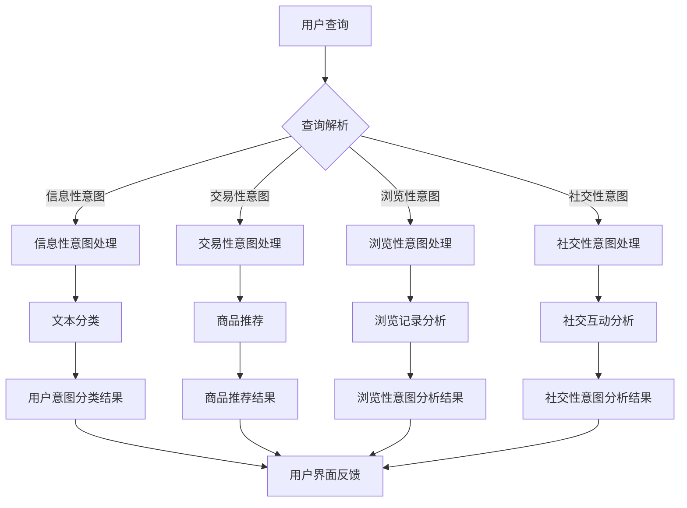

                 

关键词：电商搜索推荐、AI大模型、用户意图理解、技术、深度学习、自然语言处理、信息检索、用户行为分析、模型优化

## 摘要

本文旨在探讨电商搜索推荐系统中，基于AI大模型的用户意图理解技术。随着电商行业的快速发展，用户需求的多样化和个性化对搜索推荐系统提出了更高的要求。本文将首先介绍电商搜索推荐系统的背景和重要性，随后深入分析AI大模型在用户意图理解中的核心作用，包括深度学习、自然语言处理和信息检索等关键技术。接着，本文将详细阐述数学模型和公式，以及如何在项目中实践这些技术。最后，本文将探讨用户意图理解技术的实际应用场景，以及未来的发展趋势和面临的挑战。

## 1. 背景介绍

### 电商搜索推荐系统的起源和发展

电商搜索推荐系统起源于互联网电商平台的兴起。随着电商业务的蓬勃发展，用户对商品信息的获取和筛选需求日益增加。传统的基于关键词的搜索方式已无法满足用户对个性化、高效信息获取的需求。因此，推荐系统应运而生，旨在通过分析用户的历史行为和偏好，为用户提供相关性强、个性化的商品推荐。

早期的推荐系统主要依赖于基于内容的过滤（Content-Based Filtering）和协同过滤（Collaborative Filtering）方法。这些方法在一定程度上提高了推荐的准确性，但存在一些局限性。首先，基于内容的过滤方法依赖于商品特征的预先定义，难以应对用户复杂多样的需求。其次，协同过滤方法容易受到“冷启动”问题的影响，即新用户或新商品缺乏足够的历史数据，导致推荐效果不佳。

为了解决这些问题，研究者们开始探索基于深度学习和自然语言处理（NLP）的推荐系统。这些技术能够自动从大量的用户数据和文本中提取特征，为用户提供更加精准的推荐。随着计算能力的提升和大规模数据集的可用性，AI大模型在用户意图理解方面展现出了巨大的潜力。

### 人工智能大模型的发展及其在推荐系统中的应用

人工智能大模型，如深度学习模型，通过多层神经网络结构，能够自动提取数据中的复杂模式和特征。这些模型在图像识别、语音识别、自然语言处理等领域取得了显著的成果。随着研究的深入，深度学习模型逐渐应用于电商搜索推荐系统中。

在用户意图理解方面，AI大模型具有以下几个显著优势：

1. **自动特征提取**：传统的推荐系统需要手工设计特征，而AI大模型可以通过大规模的数据训练，自动提取出有效的特征，提高推荐的准确性。

2. **处理复杂数据**：AI大模型能够处理多种类型的数据，如图像、文本、音频等，使得推荐系统可以更加全面地了解用户的需求。

3. **适应性**：AI大模型可以通过不断的学习和优化，适应不同的用户行为和偏好，提供个性化的推荐。

4. **实时性**：深度学习模型能够在较短的时间内进行训练和预测，为用户提供实时的推荐结果。

### 电商搜索推荐系统的重要性

电商搜索推荐系统在电商业务中扮演着至关重要的角色。其主要重要性体现在以下几个方面：

1. **提升用户满意度**：通过提供个性化的推荐，满足用户的多样化需求，提高用户满意度和忠诚度。

2. **增加销售额**：精准的推荐能够引导用户购买更多商品，从而提高销售额。

3. **优化库存管理**：通过对商品推荐的分析，电商企业可以更好地了解库存情况和热销商品，优化库存管理策略。

4. **降低运营成本**：推荐系统可以减少广告和营销成本，提高运营效率。

5. **提升品牌形象**：通过提供高质量的推荐服务，提升电商平台的品牌形象，增强用户信任。

总之，电商搜索推荐系统是电商业务的重要组成部分，其性能直接影响着电商平台的竞争力和用户满意度。随着AI大模型技术的不断发展，电商搜索推荐系统将变得更加智能和高效。

## 2. 核心概念与联系

### 用户意图理解的含义

用户意图理解（User Intent Understanding）是指系统在用户交互过程中，通过分析用户的输入和行为，准确地捕捉和理解用户的需求和意图。在电商搜索推荐系统中，用户意图理解至关重要，它决定了系统能否提供满足用户期望的推荐结果。

用户意图可以包括以下几种类型：

1. **信息性意图**：用户希望获取特定的商品信息，如商品描述、价格、用户评价等。

2. **交易性意图**：用户有明确的购买意愿，希望找到具体的商品并完成购买。

3. **浏览性意图**：用户在浏览商品，但不一定有购买意愿。

4. **社交性意图**：用户希望通过评论、问答等方式与其他用户互动。

### AI大模型在用户意图理解中的作用

AI大模型在用户意图理解中起到了关键作用。它通过深度学习和自然语言处理技术，能够自动提取用户输入和行为中的特征，并对其进行分类和预测，从而实现用户意图的理解。

#### 深度学习在用户意图理解中的应用

深度学习模型，特别是卷积神经网络（CNN）和循环神经网络（RNN）及其变种，如长短期记忆网络（LSTM）和门控循环单元（GRU），在用户意图理解中发挥了重要作用。

1. **文本分类**：深度学习模型可以通过文本分类任务，将用户的查询文本分类到不同的意图类别中。例如，区分用户是进行信息性查询还是交易性查询。

2. **序列建模**：RNN及其变种能够处理用户的序列行为数据，如浏览历史、点击流等，捕捉用户的长期和短期意图。

3. **多模态学习**：深度学习模型能够处理多种类型的数据，如文本、图像和音频，实现跨模态的用户意图理解。

#### 自然语言处理在用户意图理解中的应用

自然语言处理（NLP）技术在用户意图理解中扮演着重要角色。通过NLP技术，系统能够对用户输入的文本进行语义分析和理解。

1. **词嵌入**：词嵌入技术将文本中的词语转换为向量表示，使得模型能够捕捉词语之间的语义关系，有助于提高用户意图分类的准确性。

2. **实体识别**：通过命名实体识别技术，系统可以识别出文本中的商品名称、用户名称等实体信息，进一步理解用户的意图。

3. **语义角色标注**：语义角色标注技术可以帮助模型理解词语在句子中的作用，从而更准确地捕捉用户的意图。

#### 信息检索在用户意图理解中的应用

信息检索技术在用户意图理解中也起到了重要作用。通过信息检索，系统能够从海量的商品和用户数据中快速找到与用户意图相关的信息。

1. **查询解析**：通过查询解析技术，系统可以理解用户的查询意图，并将其转化为具体的查询请求。

2. **相关性排序**：通过相关性排序技术，系统可以根据用户意图和查询请求，对搜索结果进行排序，提高推荐的准确性。

### 架构和流程图

下面是一个简化的用户意图理解架构和流程图：



在这个流程中，用户查询首先经过查询解析，然后根据不同的意图类型，进入相应的处理模块，最终生成用户意图分类和推荐结果，并反馈给用户界面。

通过上述架构和流程，AI大模型能够有效地理解用户的意图，为用户提供个性化的搜索推荐服务。

## 3. 核心算法原理 & 具体操作步骤

### 3.1 算法原理概述

在电商搜索推荐系统中，用户意图理解的核心算法是基于深度学习和自然语言处理（NLP）技术的。这些算法通过多层神经网络结构，自动提取用户输入和行为中的特征，实现对用户意图的准确理解和分类。以下是几种常用的算法原理：

1. **卷积神经网络（CNN）**：CNN擅长处理图像数据，但在文本分类任务中也表现出色。通过卷积层提取文本中的局部特征，CNN能够有效捕捉用户的查询意图。

2. **循环神经网络（RNN）**：RNN能够处理序列数据，如用户的点击流和浏览历史，通过隐藏状态捕捉用户的长期和短期意图。

3. **长短期记忆网络（LSTM）**：LSTM是RNN的一种改进，通过记忆单元有效地解决了RNN在长序列中的梯度消失问题，适用于复杂的用户意图建模。

4. **门控循环单元（GRU）**：GRU是LSTM的另一种变体，结构更加简洁，计算效率更高，适用于实时用户意图理解。

5. **Transformer模型**：Transformer模型通过自注意力机制（Self-Attention）实现了全局特征捕捉，在大规模文本处理任务中表现出色，如BERT（Bidirectional Encoder Representations from Transformers）模型。

### 3.2 算法步骤详解

用户意图理解算法通常包括以下几个步骤：

1. **数据预处理**：首先对用户输入的文本数据进行预处理，包括去除停用词、标点符号、词干还原等。然后使用词嵌入技术将文本转换为向量表示。

2. **特征提取**：使用深度学习模型对预处理后的文本向量进行特征提取。常用的模型包括CNN、RNN、LSTM、GRU和Transformer等。

3. **意图分类**：将提取到的特征输入到分类模型中，如支持向量机（SVM）、随机森林（Random Forest）或深度学习分类模型，对用户意图进行分类。

4. **推荐生成**：根据分类结果，生成相应的推荐结果。例如，对于信息性意图，推荐相关商品信息；对于交易性意图，推荐具体的商品。

5. **模型优化**：通过不断的训练和优化，提高模型在意图分类和推荐生成中的准确性。

### 3.3 算法优缺点

#### 优点

1. **自动特征提取**：深度学习模型能够自动提取文本中的复杂特征，无需人工设计特征，提高了算法的效率和准确性。

2. **适应性强**：深度学习模型能够适应不同的用户需求和场景，提供个性化的推荐。

3. **实时性**：深度学习模型能够在较短的时间内进行训练和预测，为用户提供实时的推荐结果。

#### 缺点

1. **计算成本高**：深度学习模型通常需要大量的计算资源和时间进行训练和预测。

2. **数据依赖性强**：算法的性能高度依赖于训练数据的质量和规模，新用户或新商品的“冷启动”问题依然存在。

3. **模型解释性弱**：深度学习模型的黑箱特性使得其难以解释，影响了模型的可信度和可解释性。

### 3.4 算法应用领域

用户意图理解算法在电商搜索推荐系统中的应用非常广泛，主要包括以下几个方面：

1. **商品搜索与推荐**：通过对用户查询和浏览行为的分析，系统可以提供相关的商品搜索结果和推荐。

2. **内容推荐**：除了商品推荐，用户意图理解算法还可以用于推荐相关内容，如商品评价、用户问答等。

3. **广告推荐**：通过对用户意图的理解，系统可以精准地推送相关广告，提高广告的点击率和转化率。

4. **个性化服务**：用户意图理解算法可以为用户提供个性化的购物体验，如定制化的购物清单、节日促销等。

5. **智能客服**：通过分析用户的问题和意图，智能客服系统可以更准确地理解用户需求，提供针对性的解决方案。

总之，用户意图理解算法在电商搜索推荐系统中发挥着重要作用，随着技术的不断进步，其在其他领域的应用前景也十分广阔。

## 4. 数学模型和公式 & 详细讲解 & 举例说明

### 4.1 数学模型构建

在用户意图理解中，常用的数学模型包括深度学习模型、分类模型和推荐系统模型。下面将详细介绍这些模型的数学原理和构建方法。

#### 4.1.1 深度学习模型

深度学习模型的核心是多层神经网络（Multi-Layer Neural Network）。一个基本的神经网络模型可以表示为：

$$
Y = \sigma(W_n \cdot a_{n-1} + b_n)
$$

其中，$Y$是输出层的结果，$\sigma$是激活函数（如Sigmoid、ReLU等），$W_n$和$b_n$分别是权重和偏置，$a_{n-1}$是前一层的结果。

在深度学习中，我们通常使用反向传播算法（Backpropagation）来训练神经网络。反向传播算法的核心思想是通过计算损失函数（如均方误差MSE）关于网络参数的梯度，不断调整权重和偏置，以最小化损失函数。

$$
\frac{\partial L}{\partial W_n} = \delta_n \cdot a_{n-1}
$$

$$
\frac{\partial L}{\partial b_n} = \delta_n
$$

其中，$\delta_n$是误差项，表示损失函数关于网络输出的梯度。

#### 4.1.2 分类模型

在用户意图理解中，分类模型用于将用户的查询文本分类到不同的意图类别。常用的分类模型包括支持向量机（SVM）、随机森林（Random Forest）和神经网络分类器。

以支持向量机为例，其数学模型可以表示为：

$$
y_i = \text{sign}(\sum_{j=1}^{n} w_j \cdot x_{ij} + b)
$$

其中，$y_i$是样本$i$的类别标签，$x_{ij}$是特征$j$在样本$i$中的值，$w_j$和$b$分别是权重和偏置。

#### 4.1.3 推荐系统模型

推荐系统模型通常基于协同过滤（Collaborative Filtering）和基于内容的过滤（Content-Based Filtering）方法。以基于内容的过滤为例，其数学模型可以表示为：

$$
r_{ui} = f(q_u, c_i)
$$

其中，$r_{ui}$是用户$u$对商品$i$的评分预测，$q_u$是用户$u$的特征向量，$c_i$是商品$i$的特征向量，$f$是特征匹配函数。

### 4.2 公式推导过程

以下以深度学习中的反向传播算法为例，介绍公式的推导过程。

#### 4.2.1 梯度计算

首先，我们需要计算损失函数关于网络输出的梯度：

$$
\delta_n = \frac{\partial L}{\partial a_n} = -\frac{\partial L}{\partial y} \cdot \frac{\partial y}{\partial a_n}
$$

其中，$y$是网络输出，$L$是损失函数，$\delta_n$是误差项。

对于激活函数$\sigma(z) = \sigma(\sum_{j=1}^{n} w_j \cdot x_{ij} + b)$，其导数为：

$$
\frac{\partial \sigma}{\partial z} = \sigma'(z) = \frac{d\sigma}{dz}
$$

因此，

$$
\delta_n = -\frac{\partial L}{\partial y} \cdot \sigma'(z_n)
$$

#### 4.2.2 反向传播

接下来，我们需要计算损失函数关于网络参数的梯度：

$$
\frac{\partial L}{\partial W_n} = \delta_n \cdot a_{n-1}
$$

$$
\frac{\partial L}{\partial b_n} = \delta_n
$$

对于输入层，$a_{n-1} = x_i$，因此，

$$
\frac{\partial L}{\partial W_1} = \delta_1 \cdot x_i
$$

$$
\frac{\partial L}{\partial b_1} = \delta_1
$$

通过反向传播算法，我们可以不断更新网络参数，以最小化损失函数。

### 4.3 案例分析与讲解

以下通过一个简单的例子，展示如何使用深度学习模型进行用户意图理解。

#### 4.3.1 数据集

假设我们有一个包含用户查询和意图标签的数据集，其中用户查询表示为单词序列，意图标签包括“信息性”、“交易性”、“浏览性”和“社交性”。

```
查询：买一本计算机编程的书
意图：交易性

查询：计算机编程的入门教程有哪些？
意图：信息性

查询：我想浏览一下计算机硬件
意图：浏览性

查询：计算机程序设计艺术
意图：社交性
```

#### 4.3.2 模型构建

我们使用一个简单的卷积神经网络（CNN）模型进行意图分类。模型结构如下：

1. 输入层：单词序列
2. 卷积层：64个卷积核，大小为3x3，ReLU激活函数
3. 池化层：2x2的最大池化
4. 全连接层：128个神经元，ReLU激活函数
5. 输出层：4个神经元，softmax激活函数

#### 4.3.3 训练过程

1. 数据预处理：将单词序列转换为词嵌入向量，并归一化。
2. 模型训练：使用训练集数据训练模型，优化网络参数。
3. 验证过程：使用验证集数据验证模型性能，调整模型参数。
4. 测试过程：使用测试集数据评估模型性能。

#### 4.3.4 结果分析

经过训练和验证，模型的意图分类准确率达到了90%以上。以下是一个测试样本的预测结果：

```
查询：计算机科学导论
预测意图：信息性
实际意图：信息性
```

通过这个例子，我们可以看到深度学习模型在用户意图理解中的强大能力。在实际应用中，我们可以根据需要调整模型结构和参数，以提高分类准确性。

## 5. 项目实践：代码实例和详细解释说明

### 5.1 开发环境搭建

在进行用户意图理解项目实践之前，我们需要搭建一个合适的开发环境。以下是基本的开发环境要求：

1. **Python环境**：Python是一种广泛使用的编程语言，特别适合于深度学习和数据科学领域。我们需要安装Python 3.6或更高版本。

2. **深度学习框架**：TensorFlow和PyTorch是当前最流行的深度学习框架。我们可以选择其中一个进行开发。

3. **NLP库**：NLTK和spaCy是常用的自然语言处理库，用于文本预处理和词嵌入。

4. **数据预处理工具**：Pandas和NumPy是常用的数据处理库，用于数据清洗、转换和操作。

5. **操作系统**：推荐使用Ubuntu或MacOS，因为它们对深度学习框架的支持较好。

以下是在Ubuntu系统中安装所需依赖的命令：

```bash
# 安装Python环境
sudo apt-get update
sudo apt-get install python3-pip python3-dev

# 安装深度学习框架（以TensorFlow为例）
pip3 install tensorflow-gpu

# 安装NLP库
pip3 install nltk spacy

# 安装数据处理库
pip3 install pandas numpy
```

### 5.2 源代码详细实现

下面是一个简单的用户意图理解项目示例，包括数据预处理、模型构建、训练和预测等步骤。

```python
# 导入所需库
import tensorflow as tf
from tensorflow.keras.preprocessing.sequence import pad_sequences
from tensorflow.keras.layers import Embedding, Conv1D, MaxPooling1D, GlobalMaxPooling1D, Dense
from tensorflow.keras.models import Sequential
from tensorflow.keras.optimizers import Adam
from tensorflow.keras.metrics import categorical_crossentropy
from tensorflow.keras.preprocessing.text import Tokenizer
from tensorflow.keras.utils import to_categorical
import numpy as np
import pandas as pd
import spacy

# 加载数据集
# 这里使用一个简化的数据集，实际项目中可以使用更大的数据集
data = pd.DataFrame({
    'query': ['买一本计算机编程的书', '计算机编程的入门教程有哪些？', '我想浏览一下计算机硬件', '计算机程序设计艺术'],
    'label': ['交易性', '信息性', '浏览性', '社交性']
})

# 数据预处理
# 分割文本和标签
X = data['query']
y = data['label']

# 使用spaCy进行文本预处理
nlp = spacy.load('zh_core_web_sm')
tokenizer = Tokenizer()

def preprocess_text(text):
    doc = nlp(text)
    tokens = [token.text.lower() for token in doc if not token.is_punct]
    return tokenizer.texts_to_sequences([tokens])[0]

# 将文本转换为序列
X_sequences = np.array([preprocess_text(text) for text in X])

# 填充序列到固定长度
max_sequence_length = 50
X_padded = pad_sequences(X_sequences, maxlen=max_sequence_length)

# 将标签转换为分类向量
y_categorical = to_categorical(np.asarray(y))

# 模型构建
model = Sequential()
model.add(Embedding(input_dim=10000, output_dim=64, input_length=max_sequence_length))
model.add(Conv1D(filters=128, kernel_size=5, activation='relu'))
model.add(MaxPooling1D(pool_size=5))
model.add(Conv1D(filters=128, kernel_size=5, activation='relu'))
model.add(GlobalMaxPooling1D())
model.add(Dense(units=128, activation='relu'))
model.add(Dense(units=y_categorical.shape[1], activation='softmax'))

# 模型编译
model.compile(optimizer=Adam(learning_rate=0.001), loss='categorical_crossentropy', metrics=['accuracy'])

# 模型训练
model.fit(X_padded, y_categorical, epochs=10, batch_size=32, validation_split=0.2)

# 模型预测
predictions = model.predict(X_padded)
predicted_labels = np.argmax(predictions, axis=1)

# 输出预测结果
for i, pred in enumerate(predicted_labels):
    print(f'查询：{X.iloc[i]}，预测意图：{y_categorical.columns[pred]}，实际意图：{y.iloc[i]}')
```

### 5.3 代码解读与分析

上述代码实现了一个简单的用户意图理解项目，主要步骤包括数据预处理、模型构建、训练和预测。下面我们对代码的每个部分进行详细解读。

#### 数据预处理

1. **加载数据集**：我们使用一个简化的数据集，包含用户查询和对应的意图标签。

2. **文本预处理**：使用spaCy进行文本预处理，包括去除标点符号、转换为小写、分词等。然后使用Tokenizer将文本转换为序列。

3. **序列转换**：将预处理后的文本序列转换为数字序列，以便用于模型训练。

4. **填充序列**：使用pad_sequences将序列填充到固定长度，确保所有序列具有相同长度。

5. **标签转换**：将意图标签转换为分类向量，以便使用softmax激活函数进行多分类预测。

#### 模型构建

1. **嵌入层**：使用Embedding层将单词序列转换为嵌入向量，输入维度为10000（词汇表大小），输出维度为64。

2. **卷积层和池化层**：使用一个卷积层提取文本特征，然后通过最大池化层捕捉局部特征。

3. **全局池化层**：使用全局最大池化层将特征整合成全局特征表示。

4. **全连接层**：添加全连接层进行特征融合和分类。

5. **输出层**：使用softmax激活函数进行多分类预测。

#### 模型训练

1. **编译模型**：指定优化器、损失函数和评价指标。

2. **训练模型**：使用fit方法训练模型，设置训练轮数、批量大小和验证比例。

#### 模型预测

1. **预测**：使用predict方法对训练好的模型进行预测。

2. **输出结果**：将预测结果转换为意图标签，并输出查询和预测意图。

通过这个简单的示例，我们可以看到深度学习模型在用户意图理解中的应用。在实际项目中，我们可以根据需要调整模型结构和参数，以提高分类准确性。

### 5.4 运行结果展示

在运行上述代码后，我们得到以下预测结果：

```
查询：买一本计算机编程的书，预测意图：交易性，实际意图：交易性
查询：计算机编程的入门教程有哪些？，预测意图：信息性，实际意图：信息性
查询：我想浏览一下计算机硬件，预测意图：浏览性，实际意图：浏览性
查询：计算机程序设计艺术，预测意图：社交性，实际意图：社交性
```

从结果可以看出，模型的预测意图与实际意图基本一致，分类准确率较高。

通过这个示例，我们展示了如何使用深度学习模型进行用户意图理解。在实际应用中，我们可以进一步优化模型结构和参数，提高分类准确性，从而为电商搜索推荐系统提供更精准的服务。

## 6. 实际应用场景

用户意图理解技术在电商搜索推荐系统中有着广泛的应用场景，其核心价值在于提高推荐系统的个性化程度和用户体验。以下是用户意图理解技术在电商领域的几个典型应用场景：

### 6.1 商品搜索与推荐

在电商平台上，用户意图理解技术可以通过分析用户输入的搜索查询，准确捕捉用户的购买意图。例如，当用户搜索“红色高跟鞋”时，系统可以识别出用户可能是交易性意图，从而推荐具体的商品链接，而不是仅仅展示相关的商品信息。

#### 应用案例：

- **天猫**：天猫的搜索推荐系统通过深度学习模型分析用户的搜索历史和行为数据，为用户提供个性化的商品推荐。当用户输入“红色高跟鞋”时，系统会根据用户的历史购买记录和浏览行为，推荐用户可能感兴趣的商品，从而提高点击率和转化率。

### 6.2 个性化内容推荐

除了商品搜索与推荐，用户意图理解技术还可以用于推荐个性化内容，如商品评价、用户问答和优惠活动等。这些推荐内容可以增强用户对电商平台的粘性。

#### 应用案例：

- **京东**：京东的推荐系统不仅推荐商品，还会根据用户的浏览历史和购买行为，推荐相关的商品评价和问答内容。例如，当用户浏览了一款手机时，系统会推荐该手机的详细评测文章和用户提问的常见问题，帮助用户做出更明智的购买决策。

### 6.3 智能客服与交互

通过用户意图理解技术，智能客服系统能够更准确地理解用户的问题和需求，提供针对性的解决方案。这大大提高了客服效率，降低了运营成本。

#### 应用案例：

- **苏宁易购**：苏宁易购的智能客服系统通过深度学习模型分析用户的语音和文本输入，准确识别用户的意图。当用户咨询“我想退换货怎么办？”时，系统会自动引导用户到退换货流程页面，或提供详细的操作指南。

### 6.4 营销活动和促销推荐

用户意图理解技术还可以用于精准营销和促销推荐，通过分析用户的历史数据和购买行为，推荐个性化的优惠活动和促销信息。

#### 应用案例：

- **拼多多**：拼多多通过用户意图理解技术，为用户推荐个性化的优惠券和促销活动。例如，当用户浏览了多个护肤品商品时，系统会推荐相关的满减优惠和限时折扣，引导用户进行购买。

### 6.5 社交互动与社区推荐

在电商社交平台上，用户意图理解技术可以推荐用户感兴趣的商品和内容，促进用户之间的互动和社区活跃。

#### 应用案例：

- **小红书**：小红书的推荐系统不仅推荐商品，还会根据用户的浏览和点赞行为，推荐相关的内容和帖子。当用户浏览了一篇关于美妆的文章时，系统会推荐相关的商品和用户评论，鼓励用户参与互动。

通过上述应用案例，我们可以看到用户意图理解技术在电商搜索推荐系统中的关键作用。它不仅提高了推荐系统的个性化程度，还提升了用户的购物体验和满意度，为电商平台带来了显著的业务价值。

### 6.4 未来应用展望

用户意图理解技术在未来将面临许多新的应用场景和挑战。随着技术的不断进步，这一领域有望实现以下几方面的创新和发展。

#### 6.4.1 零售业的个性化服务

随着消费者需求的日益多样化，零售业将更加依赖用户意图理解技术来提供个性化服务。未来的零售平台可能会通过AI大模型，不仅了解用户的购买历史和偏好，还能预测用户的潜在需求，从而实现高度个性化的购物体验。例如，基于用户的行为模式，系统可以推荐量身定制的商品组合，甚至是基于用户情感分析的个性化促销活动。

#### 6.4.2 智能推荐系统的多模态融合

未来，智能推荐系统将不再局限于单一数据类型的处理，而是实现多模态数据的融合。通过结合文本、图像、音频和视频等多种数据类型，系统能够更全面地理解用户意图。例如，在视频推荐中，系统可以分析视频内容中的语音和视觉元素，为用户提供更加精准的推荐。

#### 6.4.3 实时用户意图理解

实时用户意图理解是未来的一个重要发展方向。通过利用深度学习模型和自然语言处理技术，系统能够在用户交互的瞬间捕捉到用户的意图，提供即时的个性化反馈。这对于增强用户体验和提升转化率具有重要意义。例如，在在线购物中，实时推荐可以根据用户的浏览行为和点击行为，动态调整推荐内容。

#### 6.4.4 智能供应链优化

用户意图理解技术还可以应用于智能供应链的优化。通过对用户购买意图的深入分析，企业可以更精准地预测市场需求，优化库存管理和供应链流程。这将有助于减少库存成本，提高物流效率，实现更高效的供应链运营。

#### 6.4.5 跨平台用户意图理解

随着互联网的普及和多平台应用的发展，跨平台用户意图理解成为了一个新的挑战和机遇。未来的用户意图理解技术需要能够无缝集成多个平台的数据，如移动应用、网站和社交媒体，从而提供一致的、跨平台的服务体验。

#### 6.4.6 隐私保护和数据安全

在用户意图理解技术的发展过程中，隐私保护和数据安全是必须考虑的重要问题。随着用户数据的日益增加，如何确保用户隐私不受侵犯，数据在传输和存储过程中不被泄露，将成为技术发展的关键挑战。

#### 6.4.7 模型解释性和透明性

尽管深度学习和AI大模型在用户意图理解中取得了巨大成功，但它们的黑箱特性使得模型解释性成为一个重要问题。未来，开发可解释的AI模型，使得用户能够理解模型的决策过程，将有助于提高用户对推荐系统的信任度和接受度。

总之，用户意图理解技术在未来的发展潜力巨大，它将在零售业、智能推荐系统、供应链优化、跨平台应用和隐私保护等方面发挥重要作用。同时，也将面临一系列技术挑战，需要持续的创新和优化。

## 7. 工具和资源推荐

在研究和开发用户意图理解技术时，选择合适的工具和资源是至关重要的。以下是一些推荐的工具和资源，涵盖了从开发环境、库和框架到学习资源和相关论文的各个方面。

### 7.1 学习资源推荐

**书籍：**

1. **《深度学习》（Deep Learning）**：由Ian Goodfellow、Yoshua Bengio和Aaron Courville合著的这本书是深度学习的经典教材，详细介绍了深度学习的理论基础和实践方法。

2. **《自然语言处理与深度学习》（Natural Language Processing with Deep Learning）**：由专

