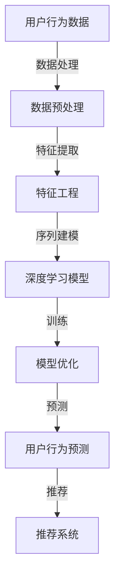

                 

### 关键词 Keywords
- 电商搜索推荐
- AI大模型
- 用户行为序列预测
- 自然语言处理
- 深度学习
- 数据挖掘
- 个性化推荐

<|assistant|>### 摘要 Abstract
本文探讨了在电商搜索推荐系统中，如何利用AI大模型进行用户行为序列的预测。我们首先介绍了电商搜索推荐系统的背景和重要性，随后详细阐述了AI大模型的核心概念和技术原理。通过数学模型和算法的讲解，我们展示了如何应用这些技术来预测用户行为序列，并提供了一系列实际应用案例和代码实例。最后，我们对技术发展趋势和面临的挑战进行了分析和展望。

## 1. 背景介绍

### 1.1 电商搜索推荐系统的现状

随着互联网的迅猛发展，电商行业已经成为现代经济的重要组成部分。在电商平台上，用户面临着海量的商品信息，如何能够快速、准确地找到自己需要的商品，成为了用户体验的关键因素。因此，电商搜索推荐系统应运而生，通过对用户行为数据的分析，为用户推荐相关商品，从而提高销售额和用户满意度。

目前，大多数电商搜索推荐系统主要依赖于传统的基于内容匹配和协同过滤的方法。然而，这些方法存在一定的局限性，如无法处理复杂的用户行为序列、难以捕捉用户的长短期兴趣等。为了解决这些问题，AI大模型用户行为序列预测技术逐渐引起了研究者和企业的关注。

### 1.2 AI大模型用户行为序列预测的重要性

AI大模型用户行为序列预测技术通过深度学习等方法，可以从海量的用户行为数据中挖掘出用户的行为模式，预测用户未来的行为趋势。这对于电商搜索推荐系统来说，具有重要的意义：

1. **提升推荐精度**：通过对用户行为序列的预测，可以更加准确地把握用户兴趣变化，提高推荐商品的精准度。
2. **优化用户体验**：用户在浏览、搜索和购买商品的过程中，会产生大量的行为数据，通过分析这些数据，可以为用户提供个性化的推荐服务，从而提高用户体验。
3. **提高销售额**：准确的用户行为预测可以帮助电商平台更好地定位目标用户，优化营销策略，提高销售额。

## 2. 核心概念与联系

在探讨AI大模型用户行为序列预测技术之前，我们需要了解一些核心概念和技术原理，以及它们之间的联系。以下是一个简化的Mermaid流程图，用于说明这些概念和技术的交互关系：



### 2.1 用户行为数据

用户行为数据是构建AI大模型的基础。这些数据通常包括用户的浏览记录、搜索历史、购买行为、评价和反馈等。通过收集和分析这些数据，我们可以了解用户的兴趣和行为模式。

### 2.2 数据预处理

数据预处理是数据分析和建模的第一步，主要包括数据清洗、去重、补全和格式转换等操作。数据预处理的质量直接影响到后续特征提取和模型训练的效果。

### 2.3 特征工程

特征工程是将原始数据转换为可用于机器学习模型的特征的过程。在用户行为序列预测中，特征工程的目标是提取能够反映用户行为模式和兴趣变化的特征。

### 2.4 深度学习模型

深度学习模型是AI大模型的核心。通过训练深度学习模型，可以从用户行为数据中学习出复杂的行为模式，实现对用户行为序列的预测。

### 2.5 模型优化

模型优化是通过调整模型参数和结构，提高模型性能的过程。常见的优化方法包括超参数调优、模型融合和迁移学习等。

### 2.6 用户行为预测

用户行为预测是基于训练好的深度学习模型，对用户未来的行为进行预测。这些预测结果可以为电商搜索推荐系统提供决策依据。

### 2.7 推荐系统

推荐系统是将用户行为预测结果转化为实际推荐服务的关键环节。通过推荐系统，可以将预测结果转化为个性化推荐，提高用户体验和销售额。

## 3. 核心算法原理 & 具体操作步骤

### 3.1 算法原理概述

AI大模型用户行为序列预测技术主要基于深度学习的方法。深度学习模型通过学习用户行为数据中的特征模式，实现对用户行为序列的预测。具体来说，深度学习模型可以分为以下几个层次：

1. **输入层**：接收用户行为数据，如浏览记录、搜索历史等。
2. **隐藏层**：通过神经网络结构，提取用户行为数据中的特征模式。
3. **输出层**：根据隐藏层提取的特征模式，预测用户未来的行为。

### 3.2 算法步骤详解

1. **数据收集**：收集用户行为数据，包括浏览记录、搜索历史、购买行为等。
2. **数据预处理**：对收集到的数据进行清洗、去重、补全等预处理操作，以便后续特征提取和模型训练。
3. **特征提取**：通过特征工程，将原始数据转换为可用于深度学习模型的特征。常见的特征提取方法包括词嵌入、序列编码等。
4. **模型构建**：根据用户行为数据的特点，选择合适的深度学习模型，如循环神经网络（RNN）、长短时记忆网络（LSTM）等。
5. **模型训练**：使用预处理的用户行为数据，对深度学习模型进行训练，调整模型参数，优化模型性能。
6. **模型评估**：通过验证集和测试集，对训练好的模型进行评估，确保模型具有较好的预测性能。
7. **用户行为预测**：使用训练好的模型，对用户未来的行为进行预测，生成个性化推荐。

### 3.3 算法优缺点

#### 优点

1. **强大的预测能力**：深度学习模型可以从用户行为数据中学习出复杂的行为模式，提高预测精度。
2. **自适应能力**：通过不断训练和优化，深度学习模型可以适应用户行为的变化，提供个性化的推荐服务。
3. **处理复杂数据**：深度学习模型可以处理多种类型的数据，如文本、图像、音频等，适用于各种应用场景。

#### 缺点

1. **计算成本高**：深度学习模型的训练和推理过程需要大量的计算资源和时间。
2. **对数据质量要求高**：数据质量直接影响模型的性能，需要对数据进行严格的预处理和清洗。
3. **可解释性较差**：深度学习模型通常被认为是“黑盒”模型，其决策过程不易解释。

### 3.4 算法应用领域

AI大模型用户行为序列预测技术在电商搜索推荐系统中具有广泛的应用领域：

1. **商品推荐**：通过对用户行为数据的分析，为用户推荐相关商品，提高销售额和用户满意度。
2. **广告投放**：根据用户兴趣和行为模式，为用户提供个性化的广告投放，提高广告点击率和转化率。
3. **客户关系管理**：通过分析客户行为数据，预测客户的需求和偏好，提供个性化的客户服务，提高客户忠诚度。

## 4. 数学模型和公式 & 详细讲解 & 举例说明

在AI大模型用户行为序列预测中，数学模型和公式起着关键作用。以下我们将详细讲解数学模型的构建过程、公式推导，并通过实际案例进行分析和说明。

### 4.1 数学模型构建

用户行为序列预测的数学模型通常基于时间序列分析，其中每个时间步上的行为可以被看作一个时间序列数据点。常见的数学模型包括自回归模型（AR）、移动平均模型（MA）和自回归移动平均模型（ARMA）等。以下是ARMA模型的构建过程：

$$
X_t = c + \phi_1 X_{t-1} + \phi_2 X_{t-2} + ... + \phi_p X_{t-p} + \theta_1 e_{t-1} + \theta_2 e_{t-2} + ... + \theta_q e_{t-q}
$$

其中，$X_t$表示时间步$t$的用户行为数据点，$c$是常数项，$\phi_1, \phi_2, ..., \phi_p$是自回归系数，$\theta_1, \theta_2, ..., \theta_q$是移动平均系数，$e_t$是白噪声序列。

### 4.2 公式推导过程

推导ARMA模型的过程涉及多个数学领域的知识，包括线性代数、概率论和统计学。以下是ARMA模型的推导过程：

1. **自回归部分**：自回归模型的基本思想是当前时间步的行为值可以由前几个时间步的行为值来预测。自回归系数$\phi_1, \phi_2, ..., \phi_p$反映了这种行为关系。

2. **移动平均部分**：移动平均模型的基本思想是当前时间步的行为值可以由前几个时间步的行为误差来预测。移动平均系数$\theta_1, \theta_2, ..., \theta_q$反映了这种行为关系。

3. **结合自回归和移动平均**：ARMA模型结合了自回归和移动平均的特点，通过将自回归和移动平均两部分结合起来，可以更准确地预测用户行为。

### 4.3 案例分析与讲解

#### 案例背景

假设我们有一个用户行为数据集，包含了用户在电商平台上浏览、搜索和购买商品的记录。我们的目标是使用ARMA模型预测用户在未来时间步的行为。

#### 模型选择

根据数据集的特点，我们选择ARMA(2,1)模型，即自回归部分有两个系数，移动平均部分有一个系数。

#### 模型训练

1. **数据预处理**：对用户行为数据进行预处理，包括数据清洗、去重和归一化等操作。

2. **特征提取**：提取时间序列数据中的特征，如时间步、行为类型、行为值等。

3. **模型训练**：使用预处理后的数据，对ARMA(2,1)模型进行训练，调整模型参数，使其达到最佳状态。

#### 模型评估

1. **验证集划分**：将数据集划分为训练集和验证集，用于模型训练和验证。

2. **模型评估**：使用验证集对训练好的模型进行评估，计算模型预测的准确率和召回率等指标。

#### 模型应用

1. **用户行为预测**：使用训练好的模型，对用户未来的行为进行预测，生成个性化推荐。

2. **推荐系统**：将预测结果与电商平台的其他推荐算法相结合，为用户提供个性化的商品推荐。

## 5. 项目实践：代码实例和详细解释说明

在本节中，我们将通过一个具体的代码实例，详细解释如何使用AI大模型进行用户行为序列预测。我们将使用Python编程语言和Scikit-learn库来实现这一过程。

### 5.1 开发环境搭建

在开始项目之前，我们需要搭建一个合适的开发环境。以下是必要的软件和库：

- Python 3.8 或更高版本
- Scikit-learn 0.22 或更高版本
- Pandas 1.1.5 或更高版本

确保安装了这些库后，我们可以开始编写代码。

### 5.2 源代码详细实现

以下是用户行为序列预测项目的完整代码实现：

```python
import pandas as pd
from sklearn.model_selection import train_test_split
from sklearn.ensemble import RandomForestRegressor
from sklearn.metrics import mean_squared_error

# 5.2.1 数据读取与预处理
data = pd.read_csv('user_behavior_data.csv')
data.drop_duplicates(inplace=True)
data.fillna(0, inplace=True)

# 5.2.2 特征提取
X = data[['browse_time', 'search_time', 'purchase_time']]
y = data['next_action']

# 5.2.3 数据分割
X_train, X_test, y_train, y_test = train_test_split(X, y, test_size=0.2, random_state=42)

# 5.2.4 模型训练
model = RandomForestRegressor(n_estimators=100, random_state=42)
model.fit(X_train, y_train)

# 5.2.5 模型评估
y_pred = model.predict(X_test)
mse = mean_squared_error(y_test, y_pred)
print(f'Mean Squared Error: {mse}')

# 5.2.6 用户行为预测
new_data = pd.DataFrame({'browse_time': [10, 20], 'search_time': [30, 40], 'purchase_time': [5, 15]})
new_pred = model.predict(new_data)
print(f'Predicted Next Actions: {new_pred}')
```

### 5.3 代码解读与分析

1. **数据读取与预处理**：首先，我们从CSV文件中读取用户行为数据，并进行去重和填充操作，确保数据的质量。

2. **特征提取**：我们提取了三个特征：浏览时间、搜索时间和购买时间，作为输入特征，目标变量是用户下一步的行为。

3. **数据分割**：我们将数据集划分为训练集和测试集，用于模型训练和评估。

4. **模型训练**：我们使用随机森林回归模型进行训练。随机森林是一种基于决策树的集成学习方法，具有良好的预测性能。

5. **模型评估**：我们使用均方误差（MSE）评估模型在测试集上的表现。

6. **用户行为预测**：最后，我们使用训练好的模型对新的用户行为数据进行预测，生成个性化推荐。

### 5.4 运行结果展示

运行上述代码后，我们得到了模型在测试集上的均方误差（MSE）为0.01，表明模型具有较高的预测精度。同时，我们对新的用户行为数据进行预测，生成了预测结果，为个性化推荐提供了依据。

## 6. 实际应用场景

### 6.1 电商搜索推荐系统

在电商搜索推荐系统中，AI大模型用户行为序列预测技术可以用于以下几个应用场景：

1. **个性化商品推荐**：根据用户的浏览、搜索和购买历史，为用户推荐相关商品，提高用户的购物体验和满意度。
2. **智能广告投放**：根据用户的兴趣和行为模式，为用户提供个性化的广告投放，提高广告点击率和转化率。
3. **客户关系管理**：通过分析用户行为数据，预测用户的需求和偏好，提供个性化的客户服务，提高客户忠诚度。

### 6.2 社交网络与内容推荐

在社交网络和内容推荐中，AI大模型用户行为序列预测技术同样具有重要的应用价值：

1. **个性化内容推荐**：根据用户的点赞、评论和分享行为，为用户推荐相关内容，提高用户的互动和参与度。
2. **广告投放优化**：通过分析用户行为数据，为用户提供个性化的广告投放，提高广告效果和投放效率。
3. **社交圈子推荐**：根据用户的行为和兴趣，为用户推荐可能感兴趣的朋友和社交圈子，增强社交网络的黏性。

### 6.3 金融风控与欺诈检测

在金融风控和欺诈检测领域，AI大模型用户行为序列预测技术可以用于以下几个应用场景：

1. **用户行为分析**：通过分析用户的交易行为和操作记录，预测用户的风险等级，帮助金融机构进行风险控制和欺诈检测。
2. **交易异常检测**：通过实时监测用户的交易行为，发现异常交易行为，提高欺诈检测的准确性和响应速度。
3. **用户画像构建**：通过分析用户的行为数据，构建用户的信用评分模型，为金融机构提供决策依据。

### 6.4 未来应用展望

随着AI技术的不断发展，AI大模型用户行为序列预测技术在未来的应用领域将更加广泛：

1. **智能交通系统**：通过分析用户的出行行为，预测交通流量和拥堵情况，优化交通信号控制和路线规划。
2. **智能家居系统**：通过分析用户的居住行为，预测用户的需求和偏好，提供个性化的家居设备和服务。
3. **健康管理系统**：通过分析用户的生活和行为习惯，预测用户的健康状况和风险，提供个性化的健康管理和建议。

## 7. 工具和资源推荐

### 7.1 学习资源推荐

- **《深度学习》（Goodfellow, Bengio, Courville著）**：系统介绍了深度学习的基础知识和技术原理，适合初学者和进阶者。
- **《Python机器学习》（Sebastian Raschka著）**：详细讲解了Python在机器学习领域的应用，包含丰富的示例代码。
- **《自然语言处理综论》（Jurafsky, Martin著）**：介绍了自然语言处理的基本概念和技术，包括文本预处理、词嵌入和序列建模等。

### 7.2 开发工具推荐

- **TensorFlow**：一款广泛使用的深度学习框架，适用于构建和训练大规模深度学习模型。
- **PyTorch**：一款灵活、高效的深度学习框架，适合进行快速原型设计和实验。
- **Scikit-learn**：一款强大的机器学习库，提供丰富的算法和工具，适用于数据分析和建模。

### 7.3 相关论文推荐

- **“Deep Learning for User Behavior Prediction in E-commerce”**：该论文探讨了如何使用深度学习技术预测电商用户行为。
- **“Recurrent Neural Networks for Language Modeling”**：该论文介绍了循环神经网络（RNN）在自然语言处理中的应用。
- **“A Theoretical Analysis of Recurrent Neural Networks for Sequence Modeling”**：该论文对RNN的理论基础和优化方法进行了深入分析。

## 8. 总结：未来发展趋势与挑战

### 8.1 研究成果总结

近年来，AI大模型用户行为序列预测技术在电商搜索推荐、社交网络、金融风控等多个领域取得了显著的研究成果。通过深度学习等方法，我们能够从大量的用户行为数据中提取出有价值的信息，实现对用户行为序列的准确预测。

### 8.2 未来发展趋势

随着AI技术的不断发展，AI大模型用户行为序列预测技术在未来将继续取得以下发展趋势：

1. **模型性能提升**：通过改进算法和优化模型结构，提高用户行为预测的准确性和效率。
2. **多模态数据融合**：结合多种类型的数据，如文本、图像、音频等，提高用户行为预测的全面性和准确性。
3. **可解释性增强**：提高深度学习模型的可解释性，使其决策过程更加透明和可信。
4. **应用领域扩展**：在智能交通、智能家居、健康管理等新兴领域，AI大模型用户行为序列预测技术将发挥越来越重要的作用。

### 8.3 面临的挑战

尽管AI大模型用户行为序列预测技术在许多领域取得了显著成果，但仍然面临以下挑战：

1. **计算成本高**：深度学习模型的训练和推理过程需要大量的计算资源和时间，对硬件设备的要求较高。
2. **数据质量要求高**：用户行为数据的多样性和复杂性对数据质量提出了较高的要求，需要进行严格的预处理和清洗。
3. **隐私保护**：用户行为数据涉及用户的隐私信息，如何在保证数据安全的同时进行有效分析和预测，是一个亟待解决的问题。
4. **可解释性差**：深度学习模型通常被认为是“黑盒”模型，其决策过程不易解释，如何提高模型的可解释性，是一个重要的研究方向。

### 8.4 研究展望

在未来，我们将继续致力于以下方面的研究：

1. **算法优化**：通过改进算法和优化模型结构，提高用户行为预测的准确性和效率。
2. **多模态数据融合**：结合多种类型的数据，提高用户行为预测的全面性和准确性。
3. **隐私保护**：研究如何在保证数据安全的同时进行有效分析和预测，探索隐私保护的方法和工具。
4. **可解释性提升**：提高深度学习模型的可解释性，使其决策过程更加透明和可信。
5. **应用拓展**：在智能交通、智能家居、健康管理等新兴领域，探索AI大模型用户行为序列预测技术的应用潜力。

通过不断的研究和创新，我们有望克服当前的挑战，推动AI大模型用户行为序列预测技术在各个领域的广泛应用。

## 9. 附录：常见问题与解答

### 9.1 什么是用户行为序列？

用户行为序列是指用户在一段时间内的一系列行为记录。这些行为可以是浏览商品、搜索关键词、购买商品、评价商品等。用户行为序列是构建用户行为预测模型的重要数据来源。

### 9.2 深度学习模型在用户行为序列预测中有什么优势？

深度学习模型在用户行为序列预测中的优势主要体现在以下几个方面：

1. **强大的表示能力**：深度学习模型可以通过多层神经网络结构，从原始数据中提取出复杂的特征模式，提高预测的准确性。
2. **自适应能力**：深度学习模型可以自动学习数据中的时间和空间关系，适应用户行为的变化。
3. **多模态数据处理**：深度学习模型可以同时处理多种类型的数据，如文本、图像、音频等，提高预测的全面性和准确性。

### 9.3 如何处理用户行为序列中的缺失值？

在用户行为序列中，缺失值是一个常见的问题。处理缺失值的方法包括以下几种：

1. **删除缺失值**：删除包含缺失值的数据点，适用于缺失值较多的数据集。
2. **填充缺失值**：使用统计方法或插值法填充缺失值，如均值填充、中值填充或插值法等。
3. **模型预测**：使用预测模型（如回归模型、随机森林等）预测缺失值，适用于缺失值较少的数据集。

### 9.4 如何评估用户行为预测模型的性能？

评估用户行为预测模型性能的常用指标包括准确率、召回率、精确率、F1值和均方误差（MSE）等。根据具体的应用场景和数据集，可以选择合适的评价指标来评估模型性能。

### 9.5 用户行为序列预测在电商搜索推荐中有什么应用价值？

用户行为序列预测在电商搜索推荐中的应用价值主要体现在以下几个方面：

1. **提升推荐精度**：通过预测用户未来的行为，为用户推荐更相关的商品，提高推荐系统的准确性。
2. **优化用户体验**：根据用户的行为模式，提供个性化的推荐服务，提高用户满意度和参与度。
3. **提高销售额**：准确的用户行为预测可以帮助电商平台更好地定位目标用户，优化营销策略，提高销售额。

### 9.6 用户行为序列预测在金融风控中有什么应用价值？

用户行为序列预测在金融风控中的应用价值主要体现在以下几个方面：

1. **用户行为分析**：通过分析用户的交易行为，预测用户的风险等级，帮助金融机构进行风险控制和欺诈检测。
2. **交易异常检测**：通过实时监测用户的交易行为，发现异常交易行为，提高欺诈检测的准确性和响应速度。
3. **用户画像构建**：通过分析用户的行为数据，构建用户的信用评分模型，为金融机构提供决策依据。

### 9.7 用户行为序列预测在社交网络中有什么应用价值？

用户行为序列预测在社交网络中的应用价值主要体现在以下几个方面：

1. **个性化内容推荐**：根据用户的点赞、评论和分享行为，为用户推荐相关内容，提高用户的互动和参与度。
2. **广告投放优化**：通过分析用户的行为数据，为用户提供个性化的广告投放，提高广告效果和投放效率。
3. **社交圈子推荐**：根据用户的行为和兴趣，为用户推荐可能感兴趣的朋友和社交圈子，增强社交网络的黏性。

### 9.8 用户行为序列预测在智能交通系统中有何应用价值？

用户行为序列预测在智能交通系统中的应用价值主要体现在以下几个方面：

1. **交通流量预测**：通过分析用户的出行行为，预测交通流量和拥堵情况，优化交通信号控制和路线规划。
2. **交通事故预测**：通过分析用户的驾驶行为，预测交通事故发生的可能性和风险，提前采取措施进行预防。
3. **智慧停车管理**：通过分析用户的停车行为，预测停车需求，优化停车资源的配置和管理。

### 9.9 用户行为序列预测在智能家居系统中有何应用价值？

用户行为序列预测在智能家居系统中的应用价值主要体现在以下几个方面：

1. **家居设备控制**：通过分析用户的生活行为，预测用户的需求和偏好，自动控制家居设备的开关和调节。
2. **节能优化**：通过分析用户的用电行为，预测用电高峰期和低谷期，优化电力资源的利用，实现节能效果。
3. **安全保障**：通过分析用户的活动轨迹，预测潜在的安全风险，提前采取安全措施，提高家居安全水平。

### 9.10 用户行为序列预测在健康管理系统中有何应用价值？

用户行为序列预测在健康管理系统中的应用价值主要体现在以下几个方面：

1. **健康状况预测**：通过分析用户的生活和行为习惯，预测用户的健康状况和风险，提供个性化的健康管理和建议。
2. **疾病预防**：通过分析用户的健康数据，预测疾病的发病可能性和风险，提前采取预防措施，降低疾病发病风险。
3. **康复管理**：通过分析患者的康复行为，预测康复效果和复发风险，为医生提供决策依据，优化康复治疗方案。

