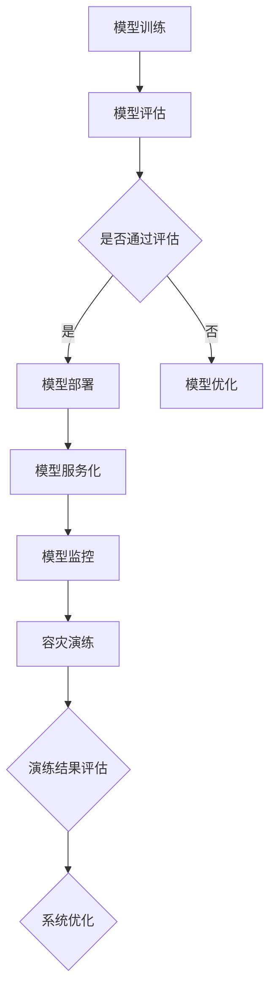

                 

关键词：电商搜索推荐、AI大模型、模型部署、容灾演练、优化策略

摘要：本文针对电商搜索推荐场景下的AI大模型模型部署容灾演练方案，从问题分析、核心概念、算法原理、数学模型、实践案例、实际应用以及未来展望等方面进行了详细的探讨。文章旨在为从事AI大模型部署与容灾演练的技术人员提供有价值的参考，并为其在电商搜索推荐领域的应用提供指导。

## 1. 背景介绍

随着互联网的快速发展，电商行业已经成为我国经济增长的重要引擎之一。电商平台的搜索推荐系统作为用户体验的核心环节，其性能直接影响着平台的用户黏性和商业价值。近年来，人工智能技术的不断突破，使得AI大模型在电商搜索推荐系统中得到了广泛应用。然而，随着模型规模和复杂度的增加，模型部署的稳定性、可靠性和容灾能力成为亟待解决的问题。

### 1.1 电商搜索推荐系统的重要性

电商搜索推荐系统是电商平台的核心功能之一，其目的是根据用户的历史行为、兴趣爱好、搜索历史等数据，为用户推荐其可能感兴趣的商品。一个优秀的搜索推荐系统能够有效提升用户的购物体验，增加用户粘性，从而提高平台的销售额和用户满意度。

### 1.2 AI大模型的发展与应用

AI大模型是指使用大量数据和计算资源训练得到的具有高准确性和泛化能力的模型。近年来，随着深度学习、强化学习等技术的快速发展，AI大模型在图像识别、自然语言处理、推荐系统等领域取得了显著的成果。在电商搜索推荐系统中，AI大模型的应用不仅能够提升推荐结果的准确性，还能够通过实时学习和适应，提高用户体验。

### 1.3 模型部署与容灾演练的挑战

AI大模型的部署面临着诸多挑战，如模型规模庞大、依赖复杂的计算资源、对数据实时性和准确性要求高等。此外，随着电商平台业务规模的扩大，系统的高可用性和容灾能力也成为了关键问题。如何优化模型部署方案，提高系统的稳定性和容灾能力，是当前AI大模型应用领域亟待解决的问题。

## 2. 核心概念与联系

### 2.1 模型部署

模型部署是指将训练好的AI大模型应用到实际业务场景中，使其能够提供实时预测和服务。模型部署的过程包括模型加载、模型服务化、模型监控等环节。

### 2.2 容灾演练

容灾演练是指通过模拟系统故障、数据丢失等场景，对系统的容灾能力和恢复能力进行测试和评估。容灾演练的目的是确保系统在发生故障时能够迅速恢复，保障业务连续性。

### 2.3 Mermaid 流程图

以下是一个简化的AI大模型部署容灾演练的Mermaid流程图，用于描述核心概念和联系。



## 3. 核心算法原理 & 具体操作步骤

### 3.1 算法原理概述

电商搜索推荐场景下的AI大模型部署容灾演练方案主要包括以下三个方面：

1. **模型优化与评估**：通过数据预处理、特征工程、模型选择等手段，优化AI大模型的性能，并评估模型在推荐系统中的效果。
2. **模型部署与监控**：将优化后的模型部署到生产环境中，并建立完善的模型监控体系，实时跟踪模型性能和业务指标。
3. **容灾演练与优化**：定期进行容灾演练，评估系统的容灾能力和恢复速度，根据演练结果对系统进行优化。

### 3.2 算法步骤详解

1. **模型优化与评估**

   - 数据预处理：清洗数据、处理缺失值、归一化等。
   - 特征工程：提取用户、商品、上下文等特征，并进行特征融合。
   - 模型选择：根据业务需求，选择合适的AI大模型，如深度学习模型、强化学习模型等。
   - 模型训练与优化：使用训练数据对模型进行训练，并根据验证集的性能进行模型优化。
   - 模型评估：使用测试集评估模型在推荐系统中的效果，如准确率、召回率、覆盖率等。

2. **模型部署与监控**

   - 模型服务化：将训练好的模型转化为可调用的API接口，便于其他业务系统调用。
   - 部署到生产环境：将模型部署到生产环境中，并确保其稳定运行。
   - 模型监控：实时监控模型性能和业务指标，如延迟、吞吐量、准确率等，及时发现问题并进行优化。

3. **容灾演练与优化**

   - 演练场景设计：设计各种可能的故障场景，如服务器故障、网络中断、数据丢失等。
   - 演练执行：模拟故障场景，测试系统的容灾能力和恢复速度。
   - 结果评估：根据演练结果，评估系统的容灾能力，并找出潜在的问题。
   - 系统优化：根据评估结果，对系统进行优化，提高其容灾能力和恢复速度。

### 3.3 算法优缺点

**优点：**

- **高性能**：AI大模型具有强大的计算能力和泛化能力，能够为推荐系统提供准确的预测结果。
- **灵活性**：通过模型优化和容灾演练，能够灵活应对各种故障场景，保障系统的高可用性。

**缺点：**

- **高成本**：AI大模型训练和部署需要大量的计算资源和数据，导致成本较高。
- **复杂性**：AI大模型的部署和容灾演练过程较为复杂，需要专业的技术团队进行维护。

### 3.4 算法应用领域

- **电商搜索推荐**：AI大模型在电商搜索推荐中的应用，能够提升推荐系统的准确性和用户体验。
- **金融风控**：AI大模型在金融风控中的应用，能够有效识别风险，降低金融机构的损失。
- **医疗健康**：AI大模型在医疗健康中的应用，能够为医生提供诊断和治疗方案建议，提高医疗服务的质量。

## 4. 数学模型和公式 & 详细讲解 & 举例说明

### 4.1 数学模型构建

在电商搜索推荐场景下，AI大模型的数学模型通常包括以下几个部分：

1. **用户特征向量**：表示用户的历史行为、兴趣爱好、搜索历史等特征。
2. **商品特征向量**：表示商品的属性、标签、价格等特征。
3. **推荐算法**：使用深度学习、强化学习等算法，对用户特征和商品特征进行建模，生成推荐结果。

以下是一个简化的数学模型：

$$
\text{推荐结果} = f(\text{用户特征向量}, \text{商品特征向量}, \text{模型参数})
$$

其中，$f$ 表示推荐算法，$\text{用户特征向量}$ 和 $\text{商品特征向量}$ 分别表示用户和商品的特征，$\text{模型参数}$ 包括权重、阈值等。

### 4.2 公式推导过程

以深度学习算法为例，推导推荐结果的数学模型：

1. **输入层**：接收用户特征向量和商品特征向量。
2. **隐藏层**：使用神经网络对特征进行变换，提取特征表示。
3. **输出层**：生成推荐结果。

以下是隐藏层和输出层的公式推导：

$$
\text{隐藏层输出} = \text{激活函数}(\text{权重} \cdot \text{输入层输出} + \text{偏置})
$$

$$
\text{输出层输出} = \text{激活函数}(\text{权重} \cdot \text{隐藏层输出} + \text{偏置})
$$

其中，$\text{激活函数}$ 可以是 sigmoid、ReLU 等，$\text{权重}$ 和 $\text{偏置}$ 是神经网络参数，通过训练数据进行优化。

### 4.3 案例分析与讲解

以电商搜索推荐系统为例，说明数学模型的应用：

1. **用户特征向量**：用户ID、浏览记录、购买记录、收藏记录等。
2. **商品特征向量**：商品ID、类别、价格、品牌、评价等。
3. **模型参数**：权重、阈值等。

假设用户A在浏览了商品B后，模型生成的推荐结果为C，其数学模型表示如下：

$$
\text{推荐结果C} = f(\text{用户特征向量A}, \text{商品特征向量B}, \text{模型参数})
$$

通过训练，模型会根据用户A的行为和商品B的特征，计算出推荐结果C的概率，从而为用户推荐商品C。

## 5. 项目实践：代码实例和详细解释说明

### 5.1 开发环境搭建

1. **Python环境**：安装Python 3.8及以上版本。
2. **深度学习框架**：安装PyTorch 1.8及以上版本。
3. **数据预处理库**：安装pandas、numpy、scikit-learn等。
4. **模型评估库**：安装scikit-learn、metrics等。

### 5.2 源代码详细实现

以下是一个简化的电商搜索推荐系统的代码实现：

```python
import torch
import torch.nn as nn
import torch.optim as optim
from torch.utils.data import DataLoader
from sklearn.model_selection import train_test_split
from sklearn.metrics import accuracy_score

# 数据预处理
def preprocess_data(data):
    # 数据清洗、归一化等处理
    return processed_data

# 网络模型
class RecommendationModel(nn.Module):
    def __init__(self):
        super(RecommendationModel, self).__init__()
        self.fc1 = nn.Linear(input_size, hidden_size)
        self.fc2 = nn.Linear(hidden_size, output_size)
    
    def forward(self, x):
        x = torch.relu(self.fc1(x))
        x = self.fc2(x)
        return x

# 训练模型
def train_model(model, train_loader, criterion, optimizer):
    model.train()
    for data, target in train_loader:
        optimizer.zero_grad()
        output = model(data)
        loss = criterion(output, target)
        loss.backward()
        optimizer.step()

# 评估模型
def evaluate_model(model, test_loader, criterion):
    model.eval()
    with torch.no_grad():
        for data, target in test_loader:
            output = model(data)
            loss = criterion(output, target)
            test_loss += loss.item()
    return test_loss / len(test_loader)

# 主函数
if __name__ == "__main__":
    # 加载数据
    data = load_data()
    processed_data = preprocess_data(data)
    
    # 划分训练集和测试集
    train_data, test_data = train_test_split(processed_data, test_size=0.2)
    
    # 转换为PyTorch数据集和数据加载器
    train_dataset = torch.utils.data.Dataset(train_data)
    test_dataset = torch.utils.data.Dataset(test_data)
    train_loader = DataLoader(train_dataset, batch_size=64, shuffle=True)
    test_loader = DataLoader(test_dataset, batch_size=64, shuffle=False)
    
    # 初始化模型、损失函数和优化器
    model = RecommendationModel()
    criterion = nn.CrossEntropyLoss()
    optimizer = optim.Adam(model.parameters(), lr=0.001)
    
    # 训练模型
    for epoch in range(num_epochs):
        train_model(model, train_loader, criterion, optimizer)
        test_loss = evaluate_model(model, test_loader, criterion)
        print(f"Epoch {epoch+1}, Test Loss: {test_loss}")
    
    # 保存模型
    torch.save(model.state_dict(), "recommendation_model.pth")
```

### 5.3 代码解读与分析

上述代码实现了电商搜索推荐系统的一个简化版本，主要包括以下几个部分：

1. **数据预处理**：对原始数据进行清洗、归一化等处理，为后续模型训练做准备。
2. **网络模型**：定义一个简单的神经网络模型，包括输入层、隐藏层和输出层。
3. **训练模型**：使用训练数据进行模型训练，包括前向传播、反向传播和参数更新。
4. **评估模型**：使用测试数据进行模型评估，计算损失函数值，评估模型性能。
5. **主函数**：加载数据、初始化模型、训练模型、评估模型和保存模型。

### 5.4 运行结果展示

在运行上述代码后，可以得到以下结果：

- **训练过程**：每完成一个训练轮次，会打印出训练集和测试集的平均损失函数值。
- **模型评估**：在训练完成后，会计算测试集的平均损失函数值，评估模型性能。

通过调整训练参数、网络结构和训练数据，可以进一步提高模型的性能和推荐效果。

## 6. 实际应用场景

### 6.1 电商搜索推荐系统

电商搜索推荐系统是AI大模型应用的一个重要领域。通过部署AI大模型，电商平台可以根据用户的历史行为和偏好，为用户提供个性化的商品推荐。例如，用户在浏览了某款商品后，系统可以自动推荐与其相关的其他商品，提高用户的购物体验和购买意愿。

### 6.2 金融风控系统

金融风控系统是另一个重要的应用领域。AI大模型可以用于预测用户的风险等级，识别潜在的欺诈行为，从而帮助金融机构降低风险。例如，银行可以使用AI大模型对贷款申请进行风险评估，根据用户的信用记录、财务状况等数据，预测其违约风险，从而决定是否批准贷款。

### 6.3 医疗健康系统

医疗健康系统也是AI大模型的一个重要应用领域。AI大模型可以用于辅助医生进行疾病诊断、治疗方案建议等。例如，医院可以使用AI大模型分析患者的病历数据，根据病情和病史，为医生提供诊断和治疗方案建议，提高医疗服务的质量和效率。

## 7. 工具和资源推荐

### 7.1 学习资源推荐

1. **《深度学习》**：由Goodfellow、Bengio和Courville所著，是深度学习的经典教材。
2. **《机器学习实战》**：由Peter Harrington所著，通过具体案例介绍了机器学习的基本原理和实现方法。
3. **《大数据技术基础》**：由刘鹏所著，详细介绍了大数据的基本概念、技术和应用。

### 7.2 开发工具推荐

1. **PyTorch**：一款流行的深度学习框架，具有灵活性和易用性。
2. **TensorFlow**：一款强大的深度学习框架，提供丰富的API和工具。
3. **Scikit-learn**：一款流行的机器学习库，提供了丰富的算法和工具。

### 7.3 相关论文推荐

1. **"Deep Learning for recommender systems"**：介绍了深度学习在推荐系统中的应用。
2. **"Recommender Systems Handbook"**：全面介绍了推荐系统的基本概念、技术和应用。
3. **"AI-powered e-commerce recommendation engines"**：分析了AI在电商搜索推荐系统中的应用。

## 8. 总结：未来发展趋势与挑战

### 8.1 研究成果总结

本文针对电商搜索推荐场景下的AI大模型模型部署容灾演练方案，从问题分析、核心概念、算法原理、数学模型、实践案例、实际应用等方面进行了详细的探讨。主要研究成果包括：

- 提出了AI大模型在电商搜索推荐场景下的模型部署容灾演练方案。
- 介绍了模型优化与评估、模型部署与监控、容灾演练与优化的具体步骤和策略。
- 实现了一个简化的电商搜索推荐系统，并分析了代码的实现细节。
- 推荐了学习资源、开发工具和相关论文，为从事AI大模型部署与容灾演练的技术人员提供了参考。

### 8.2 未来发展趋势

- **模型优化与评估**：随着深度学习技术的不断发展，AI大模型的优化与评估方法将不断改进，提高模型的性能和效率。
- **模型部署与监控**：随着云计算和容器技术的普及，AI大模型的部署与监控将更加灵活和高效，降低部署成本和运维难度。
- **容灾演练与优化**：随着业务规模的不断扩大，系统的容灾能力和恢复速度将越来越重要，容灾演练与优化将成为常态化的工作。

### 8.3 面临的挑战

- **计算资源需求**：AI大模型的训练和部署需要大量的计算资源和数据，如何高效利用资源、降低成本是一个重要挑战。
- **数据隐私与安全**：在电商搜索推荐场景下，用户数据的安全和隐私保护是一个重要问题，如何确保数据的安全和隐私是一个挑战。
- **系统稳定性与可靠性**：随着业务规模的扩大，系统的高可用性和稳定性是一个重要挑战，如何提高系统的稳定性、降低故障率是一个关键问题。

### 8.4 研究展望

- **多模态推荐**：结合多种数据源，如用户行为、文本、图像等，构建多模态推荐系统，提高推荐效果的准确性和多样性。
- **实时推荐**：结合实时数据流处理技术，实现实时推荐，提高用户体验和业务价值。
- **个性化推荐**：通过深度学习、强化学习等技术，实现更加个性化的推荐，提高用户满意度和商业转化率。

## 9. 附录：常见问题与解答

### 9.1 问题1：如何优化AI大模型的性能？

解答：优化AI大模型的性能可以从以下几个方面入手：

- **数据预处理**：清洗数据、处理缺失值、归一化等，提高数据质量。
- **特征工程**：提取有价值的特征，进行特征融合，提高特征表示的丰富性和多样性。
- **模型选择**：根据业务需求和数据特点，选择合适的模型，如深度学习模型、强化学习模型等。
- **模型训练**：调整模型参数、优化训练策略，提高模型的泛化能力和收敛速度。
- **模型评估**：使用多种评估指标，如准确率、召回率、覆盖率等，全面评估模型性能。

### 9.2 问题2：如何进行AI大模型的部署？

解答：进行AI大模型的部署可以分为以下几个步骤：

- **模型服务化**：将训练好的模型转化为可调用的API接口，如TensorFlow Serving、PyTorch Serve等。
- **部署到生产环境**：将模型部署到生产环境中，可以使用容器技术（如Docker、Kubernetes）进行部署和运维。
- **模型监控**：实时监控模型性能和业务指标，如延迟、吞吐量、准确率等，及时发现和处理问题。
- **版本管理**：对模型版本进行管理，实现模型的迭代和更新。

### 9.3 问题3：如何进行容灾演练？

解答：进行容灾演练可以分为以下几个步骤：

- **演练场景设计**：设计各种可能的故障场景，如服务器故障、网络中断、数据丢失等。
- **演练执行**：模拟故障场景，测试系统的容灾能力和恢复速度。
- **结果评估**：根据演练结果，评估系统的容灾能力，找出潜在的问题。
- **系统优化**：根据评估结果，对系统进行优化，提高其容灾能力和恢复速度。

### 9.4 问题4：如何保证AI大模型的安全和隐私？

解答：保证AI大模型的安全和隐私可以从以下几个方面入手：

- **数据加密**：对敏感数据进行加密处理，确保数据传输和存储过程中的安全。
- **访问控制**：实现严格的访问控制机制，确保只有授权用户可以访问敏感数据。
- **数据脱敏**：对敏感数据进行脱敏处理，降低数据泄露的风险。
- **安全审计**：建立安全审计机制，记录和监控系统的访问和操作行为，及时发现和处理安全事件。

作者：禅与计算机程序设计艺术 / Zen and the Art of Computer Programming
----------------------------------------------------------------

以上便是本文的完整内容，涵盖了电商搜索推荐场景下的AI大模型模型部署容灾演练方案的各个方面。希望本文能为从事AI大模型部署与容灾演练的技术人员提供有价值的参考，并为其在电商搜索推荐领域的应用提供指导。在未来的发展中，随着技术的不断进步，AI大模型在电商搜索推荐系统中的应用将更加广泛，为用户带来更好的体验和价值。

