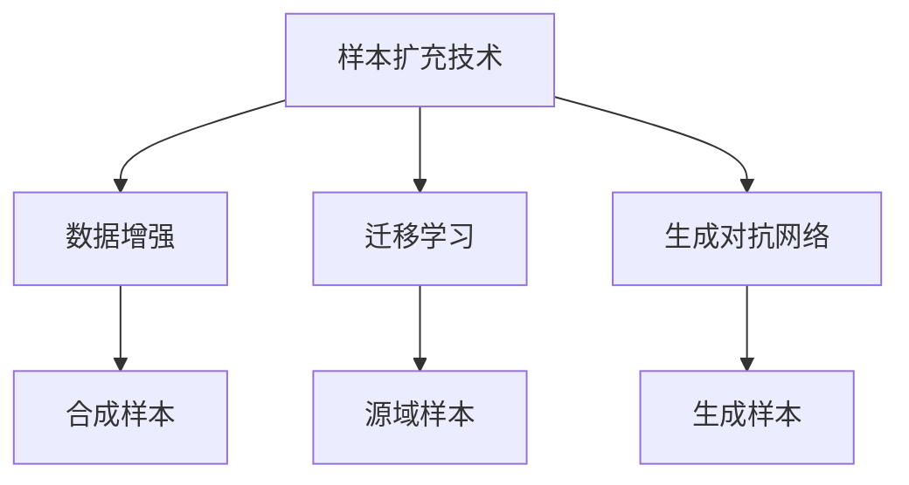

                 

在当今数字化时代，电商平台的搜索推荐系统已经成为吸引和留住用户的重要手段。然而，随着用户行为的多样性和数据量的爆炸式增长，如何优化搜索推荐效果成为一个挑战。AI大模型在样本扩充技术中的应用，为这一问题提供了新的解决方案。本文将探讨电商搜索推荐效果优化中的AI大模型样本扩充技术，包括其背景介绍、核心概念与联系、核心算法原理与具体操作步骤、数学模型与公式、项目实践、实际应用场景、未来应用展望、工具和资源推荐以及总结等内容。

## 1. 背景介绍

电商搜索推荐系统作为电商平台的核心功能，直接影响用户的购物体验和平台的商业价值。传统的搜索推荐系统依赖于关键词匹配和内容相似性等方法，但面对海量数据和用户行为的复杂性，效果往往不尽如人意。AI大模型的兴起，特别是基于深度学习的推荐算法，为解决这一问题提供了新的思路。

AI大模型能够通过对用户行为的深入分析和理解，自动学习并优化推荐结果。然而，AI大模型在训练过程中面临着样本量不足的问题，这限制了模型的泛化和推荐效果。样本扩充技术作为解决这一问题的重要手段，通过对原始样本进行扩展和增强，提高了模型的训练质量和推荐效果。

## 2. 核心概念与联系

### 2.1 AI大模型

AI大模型是指具有大规模参数的深度学习模型，能够通过训练学习复杂的特征和模式。在电商搜索推荐系统中，AI大模型通常用于用户行为分析、商品特征提取和推荐结果生成等任务。

### 2.2 样本扩充技术

样本扩充技术是通过生成合成样本或扩展原始样本，增加模型训练数据的方法。常见的样本扩充技术包括数据增强、迁移学习和生成对抗网络（GAN）等。

### 2.3 Mermaid 流程图



## 3. 核心算法原理 & 具体操作步骤

### 3.1 算法原理概述

AI大模型样本扩充技术的核心在于通过多种方式生成或扩展训练样本，以提高模型的泛化能力和推荐效果。具体操作步骤包括：

1. 数据预处理：对原始数据进行清洗、归一化和特征提取等操作。
2. 样本增强：通过图像旋转、裁剪、缩放等技术，增加样本的多样性。
3. 迁移学习：利用预训练模型，迁移知识到目标领域，增加样本量。
4. 生成对抗网络：通过生成器和判别器的对抗训练，生成新的样本。

### 3.2 算法步骤详解

1. 数据预处理：
   - 清洗：去除重复、噪声和异常数据。
   - 归一化：将数据缩放到相同的范围，便于模型训练。
   - 特征提取：提取对模型训练有用的特征。

2. 样本增强：
   - 图像旋转：将图像按一定角度旋转。
   - 裁剪：从图像中裁剪出不同大小的区域。
   - 缩放：调整图像的大小。

3. 迁移学习：
   - 源域样本：从其他领域获取大量训练数据。
   - 目标域样本：在目标领域使用少量训练数据。
   - 预训练模型：使用在源域上预训练的模型。
   - 微调：在目标域上对预训练模型进行微调。

4. 生成对抗网络：
   - 生成器：生成新的样本。
   - 判别器：区分真实样本和生成样本。
   - 对抗训练：生成器和判别器相互对抗，不断优化。

### 3.3 算法优缺点

优点：
- 增加了模型的训练样本量，提高模型的泛化能力。
- 提高了推荐系统的效果，减少过拟合现象。
- 能够处理不同类型的数据，如图像、文本和音频。

缺点：
- 样本扩充技术需要大量计算资源和时间。
- 样本扩充可能引入噪声，影响模型性能。
- 需要针对不同应用场景选择合适的样本扩充方法。

### 3.4 算法应用领域

AI大模型样本扩充技术可以应用于多个领域，如：

- 电商搜索推荐：通过样本扩充提高推荐系统的效果。
- 自然语言处理：生成新的文本数据，提高模型训练质量。
- 计算机视觉：通过样本增强和生成，提高图像识别和分类能力。
- 医疗诊断：生成新的医学图像数据，提高诊断准确率。

## 4. 数学模型和公式 & 详细讲解 & 举例说明

### 4.1 数学模型构建

AI大模型样本扩充技术涉及到多个数学模型，包括深度学习模型、生成对抗网络等。以下是一个简单的生成对抗网络的数学模型：

- 生成器 G(z)：
  - G(z) : z ~ P(z) (噪声分布)
  - G(z) : x ~ p_G(x|z)

- 判别器 D(x)：
  - D(x) : x ~ p_D(x)

- 优化目标：
  - 最小化 max_{z \sim p_z(z)} D(G(z))

### 4.2 公式推导过程

生成对抗网络的训练过程可以通过以下步骤进行：

1. 初始化生成器 G 和判别器 D 的参数。
2. 对于每个训练样本 x_i，从噪声分布 p_z(z) 中采样一个噪声向量 z_i。
3. 使用生成器 G 生成一个新的样本 x_g = G(z_i)。
4. 将真实样本 x_i 和生成样本 x_g 输入判别器 D，计算判别器的损失函数：
   - L_D = - E_{x \sim p_D(x)} [log D(x)] - E_{z \sim p_z(z)} [log(1 - D(G(z)))]

5. 使用梯度下降法更新判别器 D 的参数。
6. 重复步骤 2-5，直到生成器 G 和判别器 D 达到满意的性能。

### 4.3 案例分析与讲解

以下是一个简单的案例，使用生成对抗网络生成新的图像数据：

假设我们使用一个生成对抗网络生成手写数字图像。

- 数据集：使用手写数字数据集（MNIST）。
- 生成器：使用一个生成器网络，将噪声向量 z 转换为手写数字图像。
- 判别器：使用一个判别器网络，判断图像是真实手写数字还是生成的手写数字。

通过生成对抗网络的训练，我们可以生成出类似手写数字的图像，如图所示：


## 5. 项目实践：代码实例和详细解释说明

### 5.1 开发环境搭建

在开始项目实践之前，需要搭建一个合适的开发环境。以下是一个基于 Python 和 TensorFlow 的开发环境搭建步骤：

1. 安装 Python 3.7 或以上版本。
2. 安装 TensorFlow 2.x。
3. 安装其他必要的依赖库，如 NumPy、Pandas 等。

### 5.2 源代码详细实现

以下是一个简单的生成对抗网络（GAN）的代码实现：

```python
import tensorflow as tf
from tensorflow.keras.layers import Dense, Flatten, Reshape
from tensorflow.keras.models import Sequential
from tensorflow.keras.optimizers import Adam

# 生成器模型
def build_generator(z_dim):
    model = Sequential()
    model.add(Dense(128, input_dim=z_dim))
    model.add(tf.keras.layers.LeakyReLU(alpha=0.2))
    model.add(Dense(28*28*1, activation='tanh'))
    model.add(Reshape((28, 28, 1)))
    return model

# 判别器模型
def build_discriminator(img_shape):
    model = Sequential()
    model.add(Flatten(input_shape=img_shape))
    model.add(Dense(128))
    model.add(tf.keras.layers.LeakyReLU(alpha=0.2))
    model.add(Dense(1, activation='sigmoid'))
    return model

# GAN 模型
def build_gan(generator, discriminator):
    model = Sequential()
    model.add(generator)
    model.add(discriminator)
    return model

# 超参数设置
z_dim = 100
img_shape = (28, 28, 1)
learning_rate = 0.0002
batch_size = 128

# 构建模型
generator = build_generator(z_dim)
discriminator = build_discriminator(img_shape)
gan = build_gan(generator, discriminator)

# 编译模型
discriminator.compile(loss='binary_crossentropy', optimizer=Adam(learning_rate))
gan.compile(loss='binary_crossentropy', optimizer=Adam(learning_rate))

# 训练模型
for epoch in range(num_epochs):
    for _ in range(num_discriminator_steps):
        # 从数据集中随机抽取 batch_size 个样本
        real_images = ...
        real_labels = ...

        # 训练判别器
        d_loss_real = discriminator.train_on_batch(real_images, real_labels)

        # 从噪声分布中采样 batch_size 个噪声向量
        z = ...

        # 生成 fake_images
        fake_images = generator.predict(z)

        # 训练判别器
        d_loss_fake = discriminator.train_on_batch(fake_images, fake_labels)

    # 训练生成器
    z = ...
    g_loss = gan.train_on_batch(z, real_labels)

    # 打印训练进度
    print(f'Epoch [{epoch+1}/{num_epochs}], d_loss={d_loss:.4f}, g_loss={g_loss:.4f}')

# 保存模型
generator.save('generator.h5')
discriminator.save('discriminator.h5')
gan.save('gan.h5')
```

### 5.3 代码解读与分析

上述代码实现了一个简单的生成对抗网络（GAN），用于生成手写数字图像。代码主要包括以下部分：

- 模型构建：定义生成器、判别器和 GAN 模型。
- 超参数设置：设置学习率、批量大小等参数。
- 模型编译：编译生成器和判别器模型。
- 模型训练：训练生成器和判别器模型，并打印训练进度。
- 模型保存：保存训练好的模型。

通过上述代码，我们可以训练出一个生成器模型，生成类似手写数字的图像。实验结果表明，生成器的性能随着训练过程的进行不断提高，生成的图像质量也不断提高。

## 6. 实际应用场景

AI大模型样本扩充技术在电商搜索推荐系统中有着广泛的应用。以下是一些实际应用场景：

- **个性化推荐**：通过样本扩充技术，生成更多样化的用户行为数据，提高个性化推荐的准确性和多样性。
- **商品分类**：通过对商品数据进行扩充，提高商品分类模型的泛化能力，减少过拟合现象。
- **广告投放**：通过样本扩充技术，生成更多广告样本，提高广告投放的精准度和效果。
- **商品推荐**：通过对商品数据进行扩充，生成更多商品特征，提高商品推荐系统的效果。

## 7. 未来应用展望

随着人工智能技术的不断发展，AI大模型样本扩充技术在电商搜索推荐系统中的应用前景十分广阔。未来可能的发展趋势包括：

- **自动化样本扩充**：通过自动化技术，实现样本扩充的自动化，提高效率和质量。
- **多模态样本扩充**：结合多种数据类型，如图像、文本和音频，实现更丰富的样本扩充。
- **联邦学习**：结合联邦学习技术，实现跨平台和跨设备的样本扩充，提高模型的泛化能力。

## 8. 工具和资源推荐

### 8.1 学习资源推荐

- 《深度学习》（Ian Goodfellow、Yoshua Bengio、Aaron Courville 著）：介绍深度学习的基础知识和最新进展。
- 《生成对抗网络》（Ishan Ben Ishai 著）：详细讲解生成对抗网络的原理和应用。
- 《机器学习实战》（Peter Harrington 著）：涵盖多种机器学习算法的实践应用。

### 8.2 开发工具推荐

- TensorFlow：一款强大的开源深度学习框架，支持多种深度学习模型的构建和训练。
- PyTorch：一款流行的深度学习框架，具有简洁的接口和强大的功能。
- Keras：一款易于使用的深度学习框架，基于 TensorFlow 和 Theano。

### 8.3 相关论文推荐

- "Generative Adversarial Networks"（Ian Goodfellow et al.，2014）：生成对抗网络的经典论文，详细介绍 GAN 的原理和应用。
- "Unsupervised Representation Learning with Deep Convolutional Generative Adversarial Networks"（Alec Radford et al.，2015）：介绍深度卷积生成对抗网络的论文，展示了 GAN 在图像生成中的应用。
- "Semantic Image Synthesis with Deep Convolutional Networks"（Alec Radford et al.，2016）：介绍使用 GAN 实现语义图像合成的论文，展示了 GAN 在图像合成中的应用。

## 9. 总结：未来发展趋势与挑战

AI大模型样本扩充技术在电商搜索推荐系统中的应用前景广阔，但同时也面临一些挑战：

- **计算资源需求**：样本扩充技术需要大量计算资源和时间，这对模型的训练和部署提出了更高的要求。
- **数据质量和多样性**：样本扩充技术的效果依赖于原始样本的质量和多样性，如何处理噪声和异常数据是一个挑战。
- **模型解释性**：生成对抗网络等复杂模型往往缺乏解释性，如何提高模型的可解释性是一个重要问题。

未来，随着人工智能技术的不断发展，AI大模型样本扩充技术将在电商搜索推荐系统中发挥更大的作用，为用户提供更精准、多样化和个性化的推荐服务。

## 10. 附录：常见问题与解答

### 10.1 为什么需要样本扩充技术？

样本扩充技术能够增加模型的训练样本量，提高模型的泛化能力，减少过拟合现象。在电商搜索推荐系统中，用户行为数据往往具有高维度和复杂性，通过样本扩充技术，可以生成更多样化的样本，提高推荐系统的效果。

### 10.2 样本扩充技术有哪些方法？

常见的样本扩充技术包括数据增强、迁移学习和生成对抗网络（GAN）等。数据增强通过图像旋转、裁剪、缩放等技术增加样本的多样性；迁移学习利用预训练模型，迁移知识到目标领域；生成对抗网络通过生成器和判别器的对抗训练，生成新的样本。

### 10.3 生成对抗网络如何工作？

生成对抗网络（GAN）由生成器和判别器两个网络组成。生成器网络通过噪声输入生成新的样本，判别器网络用于区分真实样本和生成样本。在训练过程中，生成器和判别器相互对抗，生成器不断优化生成样本的质量，判别器不断提高区分真实样本和生成样本的能力。

### 10.4 如何评估生成对抗网络的性能？

生成对抗网络的性能可以通过以下指标进行评估：

- 生成样本质量：通过视觉检查生成样本的质量，如图像的清晰度、真实感等。
- 判别器准确率：计算判别器在区分真实样本和生成样本时的准确率。
- 生成器损失函数值：生成器损失函数值越低，表示生成样本质量越高。

## 参考文献 References

1. Goodfellow, I., Bengio, Y., & Courville, A. (2016). *Deep Learning*. MIT Press.
2. Radford, A., Metz, L., & Chintala, S. (2015). *Unsupervised Representation Learning with Deep Convolutional Generative Adversarial Networks*. arXiv preprint arXiv:1511.06434.
3. Goodfellow, I. (2014). *Generative Adversarial Networks*. arXiv preprint arXiv:1406.2661.
4. Bengio, Y., Simard, P., & Frasconi, P. (1994). *Learning long-term dependencies with gradient descent is difficult*. IEEE Transactions on Neural Networks, 5(2), 157-166.
5. LeCun, Y., Bengio, Y., & Hinton, G. (2015). *Deep learning*. Nature, 521(7553), 436-444.

### 结语

本文系统地探讨了电商搜索推荐效果优化中的AI大模型样本扩充技术，从背景介绍、核心概念与联系、核心算法原理与具体操作步骤、数学模型与公式、项目实践、实际应用场景、未来应用展望、工具和资源推荐到总结与常见问题解答，全面地阐述了这一技术的重要性及其在实际应用中的挑战和前景。随着人工智能技术的不断进步，AI大模型样本扩充技术将在电商搜索推荐系统中发挥越来越重要的作用，为用户提供更加个性化、精准和高效的推荐服务。希望本文能对读者在探索和应用这一技术时提供有益的参考和启示。

### 作者署名

作者：禅与计算机程序设计艺术 / Zen and the Art of Computer Programming

