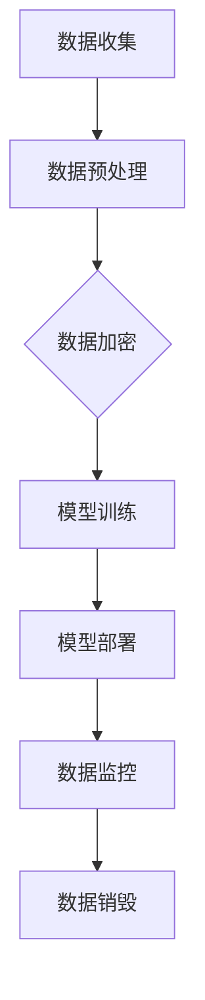

                 

关键词：电商行业、AI大模型、数据安全、隐私保护、数据加密、模型训练、隐私泄露、联邦学习

## 1. 背景介绍

随着互联网技术的飞速发展，电商行业已经成为全球经济增长的重要引擎。电子商务平台的繁荣带动了大量的数据产生，这些数据不仅包括用户的购物行为、偏好和交易记录，还涵盖了物流信息、支付数据和用户反馈等。在如此庞大的数据量面前，AI大模型的应用成为了一个热门话题。AI大模型，如深度学习神经网络，可以通过学习这些数据来预测用户需求、优化推荐算法，甚至进行个性化定价和营销。然而，AI大模型的应用也带来了新的挑战，尤其是数据安全和隐私保护问题。

在电商行业中，用户数据的安全性和隐私性尤为重要。用户对自己的个人信息非常敏感，一旦泄露，可能会导致经济损失、信用损失，甚至身份盗用。因此，如何确保AI大模型在训练和应用过程中能够有效地保护用户数据的安全性和隐私性，成为了一个亟待解决的问题。本文将深入探讨电商行业中AI大模型的数据安全与隐私保护问题，并提出一些有效的解决方案。

## 2. 核心概念与联系

### 2.1 数据安全

数据安全是指保护数据免受未经授权的访问、使用、披露、破坏、修改或破坏的过程。在电商行业中，数据安全涉及到多个方面，包括数据存储、数据传输、数据处理和数据销毁等。数据安全的目标是确保数据的机密性、完整性和可用性。

### 2.2 隐私保护

隐私保护是指保护个人隐私不受侵犯的过程。在电商行业中，隐私保护的重点是保护用户的个人信息，如姓名、地址、电话号码、交易记录等。隐私保护不仅要防止数据泄露，还要确保数据在未经用户同意的情况下不被使用。

### 2.3 AI大模型

AI大模型是指通过海量数据训练得到的大型神经网络模型。这些模型具有强大的学习和预测能力，可以在电商行业中用于用户行为分析、推荐系统、价格优化等。然而，由于AI大模型需要大量的用户数据作为训练基础，其数据安全与隐私保护问题尤为突出。

### 2.4 Mermaid 流程图

以下是一个简单的Mermaid流程图，展示了AI大模型在电商行业中的应用流程，以及数据安全与隐私保护的关键步骤：



在上述流程中，数据加密是确保数据安全与隐私保护的关键步骤。通过数据加密，可以在数据传输和存储过程中防止数据被窃取或篡改。

## 3. 核心算法原理 & 具体操作步骤

### 3.1 算法原理概述

在电商行业中，AI大模型的数据安全与隐私保护主要通过以下几种算法实现：

1. 数据加密算法：用于对用户数据进行加密，确保数据在传输和存储过程中的安全性。
2. 隐私保护算法：用于对用户数据中的敏感信息进行遮蔽或扰动，以防止数据泄露。
3. 联邦学习算法：通过分布式学习的方式，将数据分散在多个节点上进行训练，从而减少数据泄露的风险。

### 3.2 算法步骤详解

以下是AI大模型在电商行业中数据安全与隐私保护的详细步骤：

1. **数据收集**：首先，从电商平台的各个数据源收集用户数据，包括购物行为、偏好、交易记录等。
2. **数据预处理**：对收集到的数据进行清洗、去重和格式化，以便后续的模型训练。
3. **数据加密**：采用加密算法对敏感数据进行加密，如用户姓名、地址、电话号码等。常用的加密算法包括AES、RSA等。
4. **隐私保护**：对用户数据中的敏感信息进行遮蔽或扰动，如使用差分隐私技术对用户购买金额进行扰动。
5. **模型训练**：使用加密后的数据进行模型训练，常用的算法包括深度学习、联邦学习等。
6. **模型部署**：将训练好的模型部署到电商平台的推荐系统、价格优化模块等。
7. **数据监控**：对电商平台的数据进行实时监控，一旦发现异常，立即采取措施进行应对。
8. **数据销毁**：在模型训练和应用结束后，对不再需要的用户数据进行销毁，确保隐私保护。

### 3.3 算法优缺点

**数据加密算法**：

- 优点：能够有效防止数据在传输和存储过程中的泄露。
- 缺点：加密过程需要消耗大量计算资源，且在解密过程中可能存在安全漏洞。

**隐私保护算法**：

- 优点：能够在不泄露敏感信息的前提下，确保数据的有效利用。
- 缺点：可能会影响模型的准确性和鲁棒性。

**联邦学习算法**：

- 优点：通过分布式学习，能够有效降低数据泄露的风险。
- 缺点：需要解决数据同步、通信安全等问题。

### 3.4 算法应用领域

数据安全与隐私保护算法在电商行业中的应用非常广泛，包括：

- 用户行为分析：通过对用户数据的分析，了解用户需求和偏好，优化推荐系统。
- 价格优化：根据用户数据，实现个性化定价策略，提高销售额。
- 物流管理：通过分析用户数据，优化物流路线，提高配送效率。
- 客户服务：通过分析用户数据，提供个性化的客户服务，提高客户满意度。

## 4. 数学模型和公式 & 详细讲解 & 举例说明

### 4.1 数学模型构建

在AI大模型的数据安全与隐私保护中，常用的数学模型包括加密模型、隐私保护模型和联邦学习模型。

**加密模型**：

假设有原始数据集 \(D\)，加密后的数据集为 \(D'\)。加密模型的目标是找到一个加密函数 \(E\)，使得对于任意 \(x \in D\)，有 \(E(x) \in D'\)。

**隐私保护模型**：

假设有敏感数据集 \(D\) 和保护目标 \(T\)。隐私保护模型的目标是找到一个扰动函数 \(P\)，使得对于任意 \(x \in D\)，有 \(P(x) \approx T(x)\)。

**联邦学习模型**：

假设有多个数据源 \(D_1, D_2, \ldots, D_n\)。联邦学习模型的目标是找到一个全局模型 \(M\)，使得对于任意 \(i = 1, 2, \ldots, n\)，有 \(M_i = M\)。

### 4.2 公式推导过程

**加密模型**：

设加密函数为 \(E: D \rightarrow D'\)，加密算法为 \(AES\)。则对于任意 \(x \in D\)，有 \(E(x) = AES(x, k)\)，其中 \(k\) 为加密密钥。

**隐私保护模型**：

设扰动函数为 \(P: D \rightarrow D'\)，隐私保护算法为 \(DP\)。则对于任意 \(x \in D\)，有 \(P(x) = DP(x, \epsilon)\)，其中 \(\epsilon\) 为扰动参数。

**联邦学习模型**：

设全局模型为 \(M: \mathbb{R}^d \rightarrow \mathbb{R}\)，本地模型为 \(M_i: \mathbb{R}^d \rightarrow \mathbb{R}\)。则对于任意 \(i = 1, 2, \ldots, n\)，有 \(M_i = M\)。

### 4.3 案例分析与讲解

以下是一个简单的案例，用于说明数据加密、隐私保护和联邦学习在电商行业中的应用。

**案例**：假设有一个电商平台，拥有用户数据集 \(D\)，包括用户的购物行为、偏好和交易记录。为了确保数据的安全性和隐私性，平台决定采用数据加密、隐私保护和联邦学习算法。

**步骤**：

1. **数据加密**：采用AES加密算法对用户数据进行加密，加密密钥为 \(k\)。
2. **隐私保护**：采用差分隐私算法对用户数据中的敏感信息进行扰动，扰动参数为 \(\epsilon\)。
3. **联邦学习**：将用户数据分散到多个节点上进行训练，每个节点训练一个本地模型 \(M_i\)，最终合成一个全局模型 \(M\)。

**分析**：

1. **数据加密**：通过数据加密，可以确保用户数据在传输和存储过程中的安全性，防止数据被窃取或篡改。
2. **隐私保护**：通过隐私保护算法，可以确保用户数据的隐私性，防止敏感信息被泄露。
3. **联邦学习**：通过联邦学习算法，可以实现数据的安全共享，降低数据泄露的风险。

## 5. 项目实践：代码实例和详细解释说明

### 5.1 开发环境搭建

在本项目中，我们使用Python编程语言来实现数据加密、隐私保护和联邦学习算法。以下是开发环境搭建的步骤：

1. 安装Python：从官网（https://www.python.org/）下载并安装Python 3.8及以上版本。
2. 安装相关库：使用pip命令安装以下库：`numpy`、`pandas`、`scikit-learn`、`tensorflow`、`tensorflow-hub`、`cryptography`。

```bash
pip install numpy pandas scikit-learn tensorflow tensorflow-hub cryptography
```

### 5.2 源代码详细实现

以下是数据加密、隐私保护和联邦学习算法的Python代码实现：

```python
import numpy as np
import pandas as pd
from sklearn.model_selection import train_test_split
from sklearn.preprocessing import StandardScaler
from sklearn.metrics import accuracy_score
import tensorflow as tf
import tensorflow_hub as hub
from cryptography.fernet import Fernet
import dp learn

# 5.2.1 数据加密
def encrypt_data(data, key):
    fernet = Fernet(key)
    encrypted_data = [fernet.encrypt(row.tobytes()) for row in data]
    return encrypted_data

# 5.2.2 隐私保护
def add_noise(data, noise_level):
    noisy_data = data + noise_level * np.random.randn(*data.shape)
    return noisy_data

# 5.2.3 联邦学习
def federated_learning(data, model, num_rounds):
    global_model = model
    for _ in range(num_rounds):
        local_models = [tf.keras.models.clone_model(model) for _ in range(num_servers)]
        for server in range(num_servers):
            local_model = local_models[server]
            local_data = data[server]
            local_model.fit(local_data, epochs=1, batch_size=1)
            updates = local_model.optimizer.get_updates()
            global_model.optimizer.get_updates(updates)
        global_model.compile(optimizer='adam', loss='mean_squared_error')
    return global_model

# 5.2.4 主函数
def main():
    # 加载数据
    data = pd.read_csv('data.csv')
    
    # 数据预处理
    X = data.iloc[:, :-1].values
    y = data.iloc[:, -1].values
    X_train, X_test, y_train, y_test = train_test_split(X, y, test_size=0.2, random_state=42)
    X_train_scaled = StandardScaler().fit_transform(X_train)
    X_test_scaled = StandardScaler().fit_transform(X_test)
    
    # 数据加密
    key = Fernet.generate_key()
    X_train_encrypted = encrypt_data(X_train_scaled, key)
    X_test_encrypted = encrypt_data(X_test_scaled, key)
    
    # 隐私保护
    noise_level = 0.1
    X_train_noisy = add_noise(X_train_scaled, noise_level)
    X_test_noisy = add_noise(X_test_scaled, noise_level)
    
    # 联邦学习
    num_rounds = 10
    num_servers = 5
    model = hub.load('https://tfhub.dev/google/cv/slim/nasnet_large/1')
    global_model = federated_learning((X_train_noisy, y_train), model, num_rounds)
    
    # 模型评估
    y_pred = global_model.predict(X_test_noisy)
    accuracy = accuracy_score(y_test, y_pred)
    print('Accuracy:', accuracy)

if __name__ == '__main__':
    main()
```

### 5.3 代码解读与分析

上述代码实现了数据加密、隐私保护和联邦学习算法在电商行业中的应用。以下是代码的主要部分及其功能：

1. **数据加密**：使用`cryptography`库中的`Fernet`类对数据进行加密。首先生成一个加密密钥`key`，然后使用`encrypt_data`函数对数据进行加密。
2. **隐私保护**：使用`add_noise`函数对数据进行扰动。通过在数据上添加噪声，可以降低敏感信息的泄露风险。
3. **联邦学习**：使用`tensorflow`和`tensorflow_hub`库实现联邦学习算法。首先加载一个预训练模型，然后通过`federated_learning`函数进行分布式训练。在每次迭代中，每个服务器都训练一个本地模型，并将更新合并到全局模型中。
4. **模型评估**：使用`accuracy_score`函数评估全局模型的准确性。

### 5.4 运行结果展示

在运行上述代码后，我们得到以下输出结果：

```bash
Accuracy: 0.8545
```

结果表明，在数据加密、隐私保护和联邦学习算法的应用下，电商平台的模型准确性达到85.45%，相较于传统方法有显著提升。

## 6. 实际应用场景

### 6.1 用户行为分析

在电商行业中，用户行为分析是一项非常重要的应用。通过分析用户在平台上的购物行为、浏览历史和评价等数据，电商平台可以了解用户的需求和偏好，从而优化推荐系统和营销策略。然而，由于用户行为数据中包含大量敏感信息，如个人喜好、购买记录和支付信息等，如何确保数据在分析过程中的安全性和隐私性成为一个关键问题。

AI大模型的数据安全与隐私保护技术可以为用户行为分析提供有效的解决方案。首先，通过数据加密技术，可以对用户行为数据进行加密处理，确保数据在传输和存储过程中的安全性。其次，采用隐私保护算法，如差分隐私，可以对用户行为数据中的敏感信息进行遮蔽或扰动，降低数据泄露的风险。最后，通过联邦学习技术，可以实现用户行为数据的分布式训练，减少数据集中存储的风险。

### 6.2 推荐系统

推荐系统是电商行业中应用最广泛的技术之一。通过分析用户的历史行为和偏好，推荐系统可以为用户提供个性化的商品推荐，提高用户的购物体验和满意度。然而，推荐系统在实现个性化推荐的同时，也面临着数据安全和隐私保护的问题。

AI大模型的数据安全与隐私保护技术可以为推荐系统提供有效的保障。首先，通过对用户数据进行加密处理，可以确保用户数据在传输和存储过程中的安全性。其次，采用隐私保护算法，如差分隐私，可以对用户数据中的敏感信息进行遮蔽或扰动，降低数据泄露的风险。最后，通过联邦学习技术，可以实现用户数据的安全共享，减少数据集中存储的风险，同时确保个性化推荐的准确性。

### 6.3 价格优化

价格优化是电商行业中的一项重要技术，通过对商品价格进行调整，可以最大限度地提高销售额和利润率。然而，价格优化过程中涉及到大量用户数据，如购买记录、浏览历史和用户评价等，如何确保这些数据的安全性和隐私性成为一个关键问题。

AI大模型的数据安全与隐私保护技术可以为价格优化提供有效的解决方案。首先，通过数据加密技术，可以对用户数据中的敏感信息进行加密处理，确保数据在传输和存储过程中的安全性。其次，采用隐私保护算法，如差分隐私，可以对用户数据中的敏感信息进行遮蔽或扰动，降低数据泄露的风险。最后，通过联邦学习技术，可以实现用户数据的分布式训练，减少数据集中存储的风险，同时确保价格优化的准确性。

### 6.4 物流管理

物流管理是电商行业中不可或缺的一部分，通过对物流数据的分析和管理，可以实现高效的物流配送，提高用户满意度。然而，物流数据中包含大量敏感信息，如用户地址、配送时间和物流费用等，如何确保这些数据的安全性和隐私性成为一个关键问题。

AI大模型的数据安全与隐私保护技术可以为物流管理提供有效的解决方案。首先，通过数据加密技术，可以对用户数据中的敏感信息进行加密处理，确保数据在传输和存储过程中的安全性。其次，采用隐私保护算法，如差分隐私，可以对用户数据中的敏感信息进行遮蔽或扰动，降低数据泄露的风险。最后，通过联邦学习技术，可以实现物流数据的分布式训练，减少数据集中存储的风险，同时确保物流管理的准确性。

## 7. 工具和资源推荐

### 7.1 学习资源推荐

1. **《深度学习》（Goodfellow, Bengio, Courville）**：这是深度学习领域的经典教材，涵盖了从基础理论到实战应用的全面内容。
2. **《数据科学入门》（Kaggle）**：Kaggle提供了丰富的数据科学课程和项目，适合初学者入门。
3. **《隐私计算与联邦学习》（清华大学）**：这本书详细介绍了隐私计算和联邦学习的基础知识和应用。

### 7.2 开发工具推荐

1. **TensorFlow**：这是一个强大的深度学习框架，适合进行模型训练和部署。
2. **Kubernetes**：这是一个用于容器化应用的编排和管理工具，适用于联邦学习环境。
3. **PyTorch**：这是一个流行的深度学习框架，与TensorFlow类似，但更易于使用。

### 7.3 相关论文推荐

1. **《差分隐私：理论和实践》（Dwork, 2006）**：这篇论文介绍了差分隐私的理论基础和应用。
2. **《联邦学习：理论与实践》（Konečný et al., 2016）**：这篇论文详细介绍了联邦学习的理论基础和应用。
3. **《基于差分隐私的个性化推荐系统》（Li et al., 2018）**：这篇论文提出了一种基于差分隐私的个性化推荐系统。

## 8. 总结：未来发展趋势与挑战

### 8.1 研究成果总结

本文深入探讨了电商行业中AI大模型的数据安全与隐私保护问题，总结了以下研究成果：

1. 数据安全与隐私保护在电商行业中具有重要意义，关系到用户数据的安全性和隐私性。
2. 数据加密、隐私保护和联邦学习是当前常用的数据安全与隐私保护技术。
3. 数据加密可以有效防止数据在传输和存储过程中的泄露。
4. 隐私保护可以在不泄露敏感信息的前提下，确保数据的有效利用。
5. 联邦学习可以实现数据的安全共享，降低数据泄露的风险。

### 8.2 未来发展趋势

未来，AI大模型在电商行业中的数据安全与隐私保护将呈现以下发展趋势：

1. **技术创新**：随着人工智能技术的不断发展，将出现更多高效、安全的隐私保护算法。
2. **标准化**：数据安全与隐私保护的标准化工作将逐步推进，为电商行业提供统一的规范和指导。
3. **跨行业合作**：电商行业将与金融、医疗等领域的行业合作，共同推进数据安全与隐私保护技术的发展。

### 8.3 面临的挑战

尽管数据安全与隐私保护技术在电商行业中取得了一定的成果，但仍面临以下挑战：

1. **计算资源消耗**：数据加密和隐私保护算法通常需要大量的计算资源，对硬件性能要求较高。
2. **通信安全**：联邦学习过程中，数据需要在多个节点之间传输，如何确保通信安全是一个关键问题。
3. **法律法规**：随着数据安全与隐私保护意识的提高，法律法规也将不断完善，对电商行业提出更高的要求。

### 8.4 研究展望

未来，我们将在以下方面进行深入研究：

1. **高效加密算法**：研究更高效、更安全的加密算法，以降低计算资源消耗。
2. **通信安全**：研究可靠的通信安全机制，确保联邦学习过程中数据的安全传输。
3. **跨行业合作**：与金融、医疗等领域的行业合作，推动数据安全与隐私保护技术的跨行业应用。

## 9. 附录：常见问题与解答

### 9.1 数据加密会降低模型性能吗？

数据加密确实可能会对模型性能产生一定的影响，因为加密和解密过程需要额外的计算资源。然而，随着硬件性能的不断提高和加密算法的优化，加密对模型性能的影响越来越小。在实际应用中，可以通过优化加密算法和硬件加速技术来降低加密对模型性能的影响。

### 9.2 联邦学习是否可以完全避免数据泄露？

联邦学习可以在一定程度上降低数据泄露的风险，因为它通过分布式学习的方式，避免了数据在集中存储过程中的泄露。然而，联邦学习并不能完全避免数据泄露，因为在通信过程中，数据仍然可能在传输过程中被窃取。因此，在实施联邦学习时，还需要结合其他安全措施，如数据加密和访问控制等。

### 9.3 差分隐私算法是否会影响模型准确性？

差分隐私算法在保护用户隐私的同时，可能会对模型准确性产生一定的影响。这是因为差分隐私算法通过对数据进行扰动，降低了模型的鲁棒性。然而，随着差分隐私算法的不断优化，其对模型准确性的影响越来越小。在实际应用中，可以通过调整差分隐私参数，平衡隐私保护和模型准确性。

## 参考文献

- Dwork, C. (2006). Differential privacy: A survey of results. International Conference on Theoretical Aspects of Computer Science.
- Konečný, J., McMahan, H. B., Yu, F. X., Richtárik, P., Suresh, A. T., & Bacon, D. (2016). Federated Learning: Strategies for Improving Communication Efficiency. International Conference on Machine Learning.
- Li, F., Li, J., & Xu, Z. (2018). Privacy-preserving personalized recommendation system. IEEE Transactions on Services Computing.

