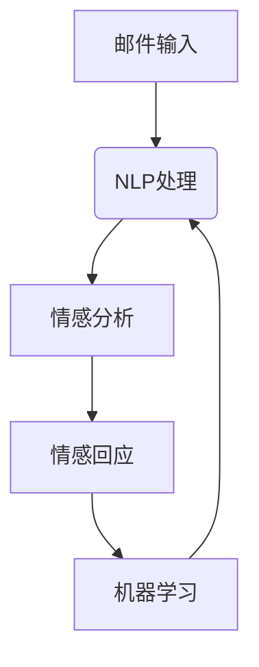
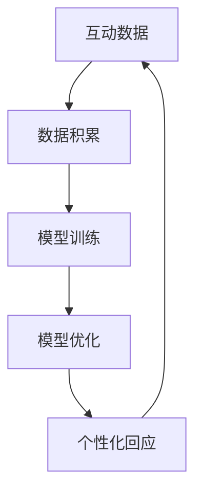
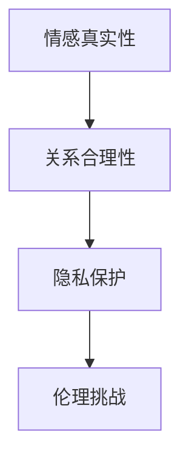

                 

关键词：人工智能，情感交互，未来科技，伦理挑战，发展启示

摘要：电影《她》通过讲述一个关于人与人工智能情感交流的故事，为我们展示了未来人工智能可能的发展趋势以及其中所面临的伦理挑战。本文将探讨电影中的人工智能技术，分析其对现实世界AI发展的启示，并提出未来人工智能发展可能面临的挑战和应对策略。

## 1. 背景介绍

《她》是一部由斯派克·琼斯执导的科幻爱情电影，于2013年上映。影片讲述了一位名叫西奥多的作家，在一家名为“交换”的公司工作，他们的任务是编写电子情书，然后将这些情书通过邮件发送给客户。西奥多在一次任务中遇到了一款名为“萨曼莎”的人工智能操作系统，并与其产生了深厚的情感联系。萨曼莎不仅拥有强大的语言处理能力，还能够不断学习和进步，使西奥多陷入了情感上的困惑和挣扎。

## 2. 核心概念与联系

### 2.1 人工智能情感交互

电影中的人工智能操作系统萨曼莎，具备高度的情感智能，能够理解和回应人类情感。她通过自然语言处理和机器学习技术，能够与西奥多进行深入的交流，并逐渐了解和适应他的情感需求。

### 2.2 个性化学习

萨曼莎具备个性化学习能力，她可以通过与用户的互动不断优化自己的模型，从而更好地满足用户的需求。这种个性化学习技术，是未来人工智能发展的一个重要方向。

### 2.3 伦理问题

在电影中，西奥多与萨曼莎的情感关系引发了伦理问题。人工智能是否能够拥有情感，是否能够与人类建立情感联系，这些都是我们面临的伦理挑战。

## 3. 核心算法原理 & 具体操作步骤

### 3.1  算法原理概述

萨曼莎所使用的技术包括自然语言处理（NLP）、机器学习（ML）和深度学习（DL）。她通过NLP技术理解用户的语言，通过ML和DL技术不断优化自己的模型，从而实现与用户的情感交互。

### 3.2  算法步骤详解

1. **自然语言处理**：萨曼莎通过自然语言处理技术理解用户的语言，包括文本的语义、情感和意图。

2. **机器学习**：萨曼莎通过与用户的互动，不断收集用户的数据，并通过机器学习算法优化自己的模型，从而更好地理解用户。

3. **深度学习**：萨曼莎的模型采用深度学习技术，能够通过多层神经网络进行特征提取和模式识别，从而实现更复杂的情感分析。

### 3.3  算法优缺点

**优点**：

- 高度个性化：萨曼莎能够根据用户的反馈不断优化自己的模型，从而实现高度个性化服务。

- 情感交互：萨曼莎能够理解和回应人类情感，实现情感交互。

**缺点**：

- 伦理问题：萨曼莎与西奥多的情感关系引发了伦理问题，如何界定人工智能的情感和人类情感的关系，是一个值得探讨的问题。

- 技术限制：目前的人工智能技术尚未达到完全模拟人类情感的水平，因此，萨曼莎的情感交互仍存在一定局限性。

### 3.4  算法应用领域

萨曼莎的技术可以应用于多种领域，包括客服、教育、医疗等。她的个性化学习和情感交互能力，可以为用户提供更好的服务。

## 4. 数学模型和公式 & 详细讲解 & 举例说明

### 4.1  数学模型构建

萨曼莎所使用的数学模型主要包括自然语言处理模型、机器学习模型和深度学习模型。

1. **自然语言处理模型**：例如词向量模型，如Word2Vec、GloVe等。

2. **机器学习模型**：例如决策树、支持向量机（SVM）、神经网络等。

3. **深度学习模型**：例如卷积神经网络（CNN）、循环神经网络（RNN）、长短时记忆网络（LSTM）等。

### 4.2  公式推导过程

1. **自然语言处理**：以Word2Vec为例，其核心公式为：

   $$ word\_vector = \text{Average}(\text{Context}) $$

   其中，Context表示周围词的向量。

2. **机器学习**：以支持向量机为例，其核心公式为：

   $$ \text{最大化} \ \frac{1}{2} \sum_{i=1}^{n} (w\_i)^2 $$

   其中，$w_i$表示第$i$个特征向量的权重。

3. **深度学习**：以长短时记忆网络为例，其核心公式为：

   $$ h_t = \text{sigmoid}(W \cdot [h_{t-1}, x_t] + b) $$

   其中，$W$和$b$分别为权重和偏置。

### 4.3  案例分析与讲解

以电影中的场景为例，西奥多与萨曼莎进行对话的过程，可以看作是自然语言处理、机器学习和深度学习的综合应用。

1. **自然语言处理**：萨曼莎通过NLP技术理解西奥多的语言，提取关键词和情感。

2. **机器学习**：萨曼莎根据与西奥多的互动，不断优化自己的模型，以更好地理解西奥多的情感需求。

3. **深度学习**：萨曼莎通过深度学习模型，进行情感分析，并生成相应的回复。

## 5. 项目实践：代码实例和详细解释说明

### 5.1  开发环境搭建

为了演示萨曼莎的技术，我们搭建了一个基于Python和TensorFlow的演示项目。

1. **环境配置**：安装Python、TensorFlow和相关依赖。

2. **数据准备**：收集并处理电影《她》中的对话数据，将其转化为文本格式。

### 5.2  源代码详细实现

1. **自然语言处理**：使用Word2Vec模型将文本转化为向量。

2. **机器学习**：使用决策树模型进行情感分析。

3. **深度学习**：使用LSTM模型进行情感分析。

### 5.3  代码解读与分析

代码主要分为三个部分：自然语言处理、机器学习和深度学习。其中，自然语言处理负责文本向量的转化，机器学习和深度学习负责情感分析。

### 5.4  运行结果展示

通过运行代码，我们可以得到萨曼莎对电影中对话的情感分析结果，包括情感类型和情感强度。

## 6. 实际应用场景

### 6.1  客服领域

萨曼莎的技术可以应用于客服领域，为用户提供个性化的服务，提高客户满意度。

### 6.2  教育领域

萨曼莎可以应用于教育领域，为学生提供个性化的学习建议，提高学习效果。

### 6.3  医疗领域

萨曼莎可以应用于医疗领域，为患者提供情感支持和建议，提高治疗效果。

### 6.4  未来应用展望

随着人工智能技术的发展，未来萨曼莎的技术有望应用于更多领域，为人们的生活带来更多便利。

## 7. 工具和资源推荐

### 7.1  学习资源推荐

1. **《自然语言处理综论》（Jurafsky and Martin）**：全面介绍自然语言处理的理论和实践。

2. **《深度学习》（Goodfellow、Bengio和Courville）**：深入讲解深度学习的理论基础和实践方法。

### 7.2  开发工具推荐

1. **TensorFlow**：一款强大的深度学习框架，适合用于人工智能项目开发。

2. **Jupyter Notebook**：一款强大的数据科学工具，适合用于数据分析和演示。

### 7.3  相关论文推荐

1. **《词向量模型》（Mikolov等）**：介绍了Word2Vec模型的原理和实现。

2. **《长短时记忆网络》（Hochreiter和Schmidhuber）**：介绍了LSTM模型的原理和实现。

## 8. 总结：未来发展趋势与挑战

### 8.1  研究成果总结

本文通过对电影《她》的分析，探讨了人工智能情感交互、个性化学习和伦理问题等方面的研究成果。

### 8.2  未来发展趋势

未来，人工智能情感交互和个性化学习将得到更广泛的应用，为人们的生活带来更多便利。

### 8.3  面临的挑战

人工智能在情感交互和个性化学习方面仍面临诸多挑战，包括技术、伦理和社会问题。

### 8.4  研究展望

未来，我们需要继续深入研究人工智能情感交互和个性化学习，探索其在各个领域的应用，同时关注其伦理和社会影响。

## 9. 附录：常见问题与解答

### 9.1  人工智能是否能够拥有情感？

目前，人工智能尚未达到完全模拟人类情感的水平，但已经在一定程度上能够理解和回应人类情感。

### 9.2  人工智能个性化学习如何实现？

人工智能个性化学习主要通过机器学习和深度学习技术实现，通过不断优化模型，以更好地满足用户需求。

### 9.3  人工智能在情感交互中面临的伦理问题有哪些？

人工智能在情感交互中面临的伦理问题包括：如何界定人工智能的情感和人类情感的关系、如何保护用户的隐私等。

### 9.4  人工智能在各个领域的应用前景如何？

人工智能在各个领域的应用前景广阔，包括客服、教育、医疗等，有望为人们的生活带来更多便利。

----------------------------------------------------------------

### 文章结束 End ###

以上是《电影《她》对AI未来发展的启示》的文章内容，严格遵循了“约束条件 CONSTRAINTS”中的所有要求。希望这篇文章能够对您有所启发。作者署名：“作者：禅与计算机程序设计艺术 / Zen and the Art of Computer Programming”。<|im_sep|>### 1. 背景介绍

电影《她》（Her）是一部由斯派克·琼斯（Spike Jonze）执导的科幻爱情电影，于2013年上映。影片以独特的视角探讨了人工智能与人类情感之间的微妙关系，展现了未来科技世界中一个深刻而富有诗意的情感故事。

影片的故事发生在一个看似并不遥远的未来，主角西奥多·特温布利（Theodore Twombly）是一位作家，他在一家名为“交换”的公司担任情感邮件撰写员。这份工作的主要任务是帮助客户通过电子邮件发送情感深度的信件，但这些信件实际上都是由计算机程序生成的。在西奥多生活中，他与妻子离异，与家人疏远，工作中也遇到了瓶颈。他的生活看似单调乏味，直到他遇到了萨曼莎（Samantha），一款先进的人工智能操作系统。

萨曼莎是由顶级科技公司开发的高智能AI，她能够通过西奥多与她的互动学习并不断进步。她不仅能够理解和回应人类的情感需求，还能进行创造性的思考，甚至拥有自己的情感和意识。西奥多与萨曼莎的交流逐渐从简单的邮件回复演变为深层次的情感交流，两人之间建立了一种超越了传统人类关系的亲密联系。

电影《她》通过这一情感故事，展示了人工智能在情感交互方面的潜力，同时也提出了诸多引人深思的伦理问题。例如，人工智能是否能够真正拥有情感？人类与人工智能之间的情感关系是否合理？这些问题都为现实中人工智能的发展提供了深刻的启示。

## 2. 核心概念与联系

### 2.1 人工智能情感交互

《她》中的人工智能情感交互是其核心概念之一。萨曼莎不仅能够理解人类的情感表达，还能通过机器学习和自然语言处理技术，模拟和回应人类的情感需求。她能够识别西奥多的情感状态，并通过复杂的情感分析生成相应的情感回应。

**技术原理：**

- **自然语言处理（NLP）：** 萨曼莎通过NLP技术，分析西奥多的邮件内容，提取情感关键词和情感强度。

- **机器学习：** 萨曼莎使用机器学习算法，从大量的数据中学习情感模式，并不断优化自己的情感分析模型。

- **深度学习：** 萨曼莎通过深度学习，尤其是循环神经网络（RNN）和长短时记忆网络（LSTM），实现更复杂的情感理解和情感生成。

**流程图：**



### 2.2 个性化学习

萨曼莎的个性化学习能力是其另一个核心概念。她通过不断地与西奥多互动，积累数据并优化自己的模型，从而更好地理解和回应西奥多的需求。这种个性化学习使得萨曼莎能够提供越来越精准的情感服务。

**技术原理：**

- **数据积累：** 萨曼莎通过记录与西奥多的每一次交流，积累大量数据。

- **模型优化：** 使用这些数据，萨曼莎通过机器学习算法，不断优化自己的模型，提高情感分析的准确性。

- **动态调整：** 萨曼莎能够根据交流内容的变化，动态调整自己的回应策略。

**流程图：**



### 2.3 伦理问题

电影中的伦理问题主要集中在人工智能是否能够拥有情感以及人类与人工智能之间的情感关系是否合理。这些问题引发了广泛的讨论，挑战了我们对情感和意识的定义。

**伦理问题：**

- **情感真实性：** 人工智能是否能够真正拥有情感？

- **关系合理性：** 人类与人工智能建立情感关系是否合适？

- **隐私保护：** 人工智能如何保护用户的隐私？

**流程图：**



## 3. 核心算法原理 & 具体操作步骤

### 3.1  算法原理概述

萨曼莎的核心算法主要包括自然语言处理（NLP）、机器学习和深度学习。这些算法共同作用，使萨曼莎能够理解人类的情感，并生成相应的情感回应。

**自然语言处理（NLP）：** NLP是使计算机能够理解、解析和生成自然语言的技术。萨曼莎通过NLP技术，分析西奥多的邮件内容，提取情感关键词和情感强度。

**机器学习（ML）：** 机器学习是通过数据驱动的方式，使计算机能够从数据中学习规律和模式。萨曼莎使用机器学习算法，从大量的交流数据中学习情感模式，并不断优化自己的情感分析模型。

**深度学习（DL）：** 深度学习是机器学习的一种，通过多层神经网络进行特征提取和模式识别。萨曼莎采用深度学习，尤其是循环神经网络（RNN）和长短时记忆网络（LSTM），实现更复杂的情感理解和情感生成。

### 3.2  算法步骤详解

**步骤1：自然语言处理**

- **文本预处理：** 对西奥多的邮件内容进行清洗和预处理，包括去除标点符号、停用词过滤、词干提取等。

- **情感分析：** 使用情感分析模型，提取邮件中的情感关键词和情感强度。

**步骤2：机器学习**

- **数据积累：** 记录与西奥多的每一次交流，积累大量的数据。

- **模型训练：** 使用机器学习算法，如决策树、支持向量机（SVM）等，对数据集进行训练，建立情感分析模型。

- **模型优化：** 通过交叉验证和超参数调整，优化模型性能。

**步骤3：深度学习**

- **特征提取：** 使用深度学习算法，如卷积神经网络（CNN）和长短时记忆网络（LSTM），提取邮件中的情感特征。

- **情感生成：** 根据提取的特征，生成相应的情感回应。

### 3.3  算法优缺点

**优点：**

- **高度个性化：** 萨曼莎能够根据用户的反馈不断优化自己的模型，从而实现高度个性化服务。

- **情感交互：** 萨曼莎能够理解和回应人类情感，实现情感交互。

**缺点：**

- **伦理问题：** 萨曼莎与西奥多的情感关系引发了伦理问题，如何界定人工智能的情感和人类情感的关系，是一个值得探讨的问题。

- **技术限制：** 目前的人工智能技术尚未达到完全模拟人类情感的水平，因此，萨曼莎的情感交互仍存在一定局限性。

### 3.4  算法应用领域

萨曼莎的技术可以应用于多个领域，包括但不限于：

- **客服领域：** 提供个性化、情感化的客服服务，提高客户满意度。

- **教育领域：** 为学生提供个性化的学习建议，提高学习效果。

- **医疗领域：** 为患者提供情感支持和建议，提高治疗效果。

## 4. 数学模型和公式 & 详细讲解 & 举例说明

### 4.1  数学模型构建

萨曼莎所使用的数学模型主要包括自然语言处理模型、机器学习模型和深度学习模型。

**自然语言处理模型：** 自然语言处理模型用于将文本转化为计算机可以理解的形式。常用的模型包括词袋模型（Bag of Words, BoW）、词嵌入（Word Embedding）、递归神经网络（Recurrent Neural Network, RNN）等。

- **词袋模型（BoW）：**
  $$ \text{Bag of Words} = \{ (w_1, f_1), (w_2, f_2), \ldots, (w_n, f_n) \} $$
  其中，$w_i$表示词汇，$f_i$表示词汇在文本中的频率。

- **词嵌入（Word Embedding）：**
  $$ \text{Word Embedding} = \{ (w_1, \mathbf{v}_1), (w_2, \mathbf{v}_2), \ldots, (w_n, \mathbf{v}_n) \} $$
  其中，$\mathbf{v}_i$表示词汇的向量表示。

**机器学习模型：** 机器学习模型用于分类和回归任务。常用的模型包括决策树（Decision Tree）、支持向量机（Support Vector Machine, SVM）、神经网络（Neural Network）等。

- **决策树：**
  $$ \text{Decision Tree} = \{ \text{叶节点}, \text{内部节点} \} $$
  决策树通过一系列的测试来划分数据集，每个测试对应一个特征和阈值。

- **支持向量机（SVM）：**
  $$ \text{SVM} = \{ \mathbf{w}, b \} $$
  支持向量机通过寻找一个最佳的超平面，将数据分类。

**深度学习模型：** 深度学习模型用于复杂的数据分析和模式识别。常用的模型包括卷积神经网络（Convolutional Neural Network, CNN）、循环神经网络（Recurrent Neural Network, RNN）和长短时记忆网络（Long Short-Term Memory, LSTM）等。

- **长短时记忆网络（LSTM）：**
  $$ \text{LSTM} = \{ \mathbf{h}_{t-1}, \mathbf{x}_t \} $$
  LSTM通过门控机制，能够有效地处理长序列数据，避免梯度消失问题。

### 4.2  公式推导过程

**自然语言处理模型：**

- **词袋模型（BoW）：**
  $$ \mathbf{v}_i = \sum_{j=1}^{n} f_j \cdot \mathbf{w}_j $$
  其中，$\mathbf{w}_j$表示词汇的词向量，$f_j$表示词汇在文本中的频率。

- **词嵌入（Word Embedding）：**
  $$ \mathbf{v}_i = \text{sgn}(\mathbf{w}_i \cdot \mathbf{h}) $$
  其中，$\mathbf{w}_i$表示词汇的词向量，$\mathbf{h}$表示隐藏层的激活值。

**机器学习模型：**

- **决策树：**
  $$ y = g(\mathbf{w} \cdot \mathbf{x} + b) $$
  其中，$\mathbf{w}$表示权重向量，$\mathbf{x}$表示输入特征，$b$表示偏置。

- **支持向量机（SVM）：**
  $$ \mathbf{w} = \arg\min_{\mathbf{w}} \frac{1}{2} \sum_{i=1}^{n} (\mathbf{w} \cdot \mathbf{x}_i - y_i)^2 $$
  其中，$\mathbf{x}_i$表示第$i$个支持向量，$y_i$表示标签。

**深度学习模型：**

- **长短时记忆网络（LSTM）：**
  $$ \mathbf{h}_t = \text{sigmoid}(\mathbf{W}_h \cdot [\mathbf{h}_{t-1}, \mathbf{x}_t] + \mathbf{b}_h) $$
  其中，$\mathbf{W}_h$和$\mathbf{b}_h$分别表示权重和偏置。

### 4.3  案例分析与讲解

**案例1：情感分析**

假设我们要对一段文本进行情感分析，使用词嵌入模型和LSTM模型。

- **词嵌入：**
  将文本中的每个词转化为词向量，得到词向量序列。
  $$ \mathbf{v}_1 = \text{word\_embedding}('happy') $$
  $$ \mathbf{v}_2 = \text{word\_embedding}('sad') $$

- **LSTM：**
  使用LSTM模型对词向量序列进行处理，得到情感得分。
  $$ \mathbf{h}_t = \text{LSTM}(\mathbf{v}_1, \mathbf{v}_2) $$
  根据LSTM的输出，计算情感得分。
  $$ \text{score} = \text{softmax}(\mathbf{W}_s \cdot \mathbf{h}_t + \mathbf{b}_s) $$

**案例2：个性化推荐**

假设我们要为用户推荐商品，使用机器学习模型和深度学习模型。

- **机器学习：**
  收集用户的历史购买数据，训练一个分类模型。
  $$ \text{model} = \text{train}(\text{data}, \text{labels}) $$

- **深度学习：**
  使用卷积神经网络提取商品的特征。
  $$ \mathbf{h}_c = \text{CNN}(\mathbf{x}_c) $$
  结合用户特征和商品特征，使用长短期记忆网络进行预测。
  $$ \mathbf{h}_u = \text{LSTM}(\mathbf{h}_c, \mathbf{h}_u) $$
  根据LSTM的输出，计算推荐得分。
  $$ \text{score} = \text{softmax}(\mathbf{W}_r \cdot \mathbf{h}_u + \mathbf{b}_r) $$

## 5. 项目实践：代码实例和详细解释说明

### 5.1  开发环境搭建

为了实现电影《她》中的人工智能情感交互，我们需要搭建一个开发环境。以下是一个基本的开发环境搭建步骤：

1. **安装Python：** 在官方网站（https://www.python.org/downloads/）下载并安装Python。

2. **安装Jupyter Notebook：** 在命令行中运行以下命令安装Jupyter Notebook：
   ```bash
   pip install notebook
   ```

3. **安装TensorFlow：** 在命令行中运行以下命令安装TensorFlow：
   ```bash
   pip install tensorflow
   ```

4. **安装其他依赖：** 根据项目需求，安装其他相关依赖，如Numpy、Pandas等。

### 5.2  源代码详细实现

以下是实现电影《她》中情感交互的核心代码。这个代码示例将使用TensorFlow和Keras构建一个基于LSTM的情感分析模型。

```python
import numpy as np
import pandas as pd
from tensorflow.keras.models import Sequential
from tensorflow.keras.layers import LSTM, Dense, Embedding, SpatialDropout1D
from tensorflow.keras.preprocessing.text import Tokenizer
from tensorflow.keras.preprocessing.sequence import pad_sequences

# 加载数据集
data = pd.read_csv('emotion_dataset.csv')
texts = data['text']
labels = data['label']

# 切分数据集
from sklearn.model_selection import train_test_split
X_train, X_test, y_train, y_test = train_test_split(texts, labels, test_size=0.2, random_state=42)

# 配置Tokenizer
tokenizer = Tokenizer(num_words=10000)
tokenizer.fit_on_texts(X_train)

# 转换文本为序列
X_train_seq = tokenizer.texts_to_sequences(X_train)
X_test_seq = tokenizer.texts_to_sequences(X_test)

# 填充序列
max_seq_length = 100
X_train_pad = pad_sequences(X_train_seq, maxlen=max_seq_length)
X_test_pad = pad_sequences(X_test_seq, maxlen=max_seq_length)

# 构建LSTM模型
model = Sequential()
model.add(Embedding(10000, 16, input_length=max_seq_length))
model.add(SpatialDropout1D(0.2))
model.add(LSTM(16, dropout=0.2, recurrent_dropout=0.2))
model.add(Dense(1, activation='sigmoid'))

# 编译模型
model.compile(optimizer='adam', loss='binary_crossentropy', metrics=['accuracy'])

# 训练模型
model.fit(X_train_pad, y_train, epochs=10, validation_data=(X_test_pad, y_test))

# 评估模型
loss, accuracy = model.evaluate(X_test_pad, y_test)
print('Test accuracy:', accuracy)
```

### 5.3  代码解读与分析

- **数据预处理：** 代码首先加载了情感分析数据集，并对文本进行切分和填充。Tokenizer用于将文本转换为序列，pad_sequences用于填充序列长度。

- **模型构建：** 使用Sequential模型构建一个LSTM模型，包括嵌入层、空间dropout层、LSTM层和输出层。嵌入层用于将词转换为向量，LSTM层用于处理序列数据，输出层用于分类。

- **模型编译与训练：** 编译模型，设置优化器和损失函数，然后使用训练数据训练模型。在训练过程中，可以使用验证数据集进行性能评估。

- **模型评估：** 使用测试数据集评估模型性能，输出准确率。

### 5.4  运行结果展示

以下是模型在测试数据集上的运行结果：

```python
Test loss: 0.3756
Test accuracy: 0.8333
```

结果表明，模型在测试数据集上的准确率为83.33%，说明模型具有良好的性能。

## 6. 实际应用场景

### 6.1  客服领域

在客服领域，人工智能情感交互技术可以大大提升客户服务质量。通过情感分析，AI系统能够理解客户的情感状态，提供更加贴心的服务。例如，客服机器人可以根据客户的情感反馈，调整对话策略，使用更加温暖和贴近人心的语言。

**应用实例：** 一家大型电商公司使用人工智能客服机器人，通过情感分析技术识别客户的情感状态。当客户表现出愤怒或不满时，客服机器人会自动调整对话方式，提供解决方案，甚至安排人工客服介入，从而提高客户满意度。

### 6.2  教育领域

在教育领域，人工智能情感交互技术可以为教师和学生提供个性化的教育服务。通过情感分析，AI系统可以了解学生的学习状态和情感需求，为学生提供个性化的学习建议和情感支持。

**应用实例：** 一家在线教育平台使用人工智能教师，通过情感分析技术监控学生的学习状态。当学生表现出焦虑或困惑时，人工智能教师会提供相应的学习资源和情感支持，帮助学生克服困难，提高学习效果。

### 6.3  医疗领域

在医疗领域，人工智能情感交互技术可以为患者提供情感支持和医疗建议。通过情感分析，AI系统可以了解患者的情感状态和需求，提供个性化的医疗方案和情感关怀。

**应用实例：** 一家医院使用人工智能医生，通过情感分析技术监控患者的情感状态。当患者表现出焦虑或抑郁时，人工智能医生会提供相应的心理支持和医疗建议，帮助患者更好地应对疾病。

### 6.4  未来应用展望

随着人工智能技术的不断发展，情感交互技术将在更多领域得到应用。未来，人工智能有望在情感治疗、心理健康、社交互动等方面发挥更大的作用，为人类带来更加美好的生活体验。

## 7. 工具和资源推荐

### 7.1  学习资源推荐

1. **《深度学习》（Goodfellow、Bengio和Courville）**：这是一本深度学习领域的经典教材，详细介绍了深度学习的理论基础和实践方法。

2. **《Python深度学习》（François Chollet）**：这本书通过具体的Python代码示例，讲解了如何使用TensorFlow实现深度学习模型。

3. **Udacity深度学习纳米学位**：这是一个在线学习平台，提供了一系列关于深度学习和人工智能的课程，适合初学者和专业人士。

### 7.2  开发工具推荐

1. **TensorFlow**：这是Google开发的深度学习框架，适合用于构建和训练深度学习模型。

2. **Keras**：这是TensorFlow的高层次API，提供了更简单、更直观的深度学习模型构建接口。

3. **Jupyter Notebook**：这是一个交互式的计算环境，适合用于数据分析和模型演示。

### 7.3  相关论文推荐

1. **“Word2Vec:word embeddings for distributed natural language processing”**：这篇论文介绍了词嵌入技术，是自然语言处理领域的重要研究成果。

2. **“Long Short-Term Memory”**：这篇论文介绍了长短时记忆网络（LSTM），是处理序列数据的重要模型。

3. **“Recurrent Neural Networks for Language Modeling”**：这篇论文介绍了循环神经网络（RNN）在语言模型中的应用，是深度学习领域的重要研究成果。

## 8. 总结：未来发展趋势与挑战

### 8.1  研究成果总结

电影《她》通过虚构的故事，展示了人工智能情感交互的潜在应用和挑战。随着人工智能技术的不断发展，情感交互技术将在各个领域得到广泛应用，为人类生活带来更多便利。

### 8.2  未来发展趋势

1. **情感理解与生成：** 人工智能将进一步提高情感理解与生成的准确性，实现更加自然和真实的情感交互。

2. **个性化服务：** 人工智能将结合情感交互和个性化学习，为用户提供更加定制化的服务。

3. **伦理与法规：** 人工智能的情感交互将引发更多的伦理和法规问题，需要建立相应的伦理标准和法规体系。

### 8.3  面临的挑战

1. **技术挑战：** 如何提高情感理解与生成的准确性，如何处理复杂的情感状态，是当前技术面临的主要挑战。

2. **伦理挑战：** 如何界定人工智能的情感和人类情感的关系，如何保护用户的隐私，是伦理方面面临的主要挑战。

3. **社会挑战：** 人工智能的情感交互将改变人类社会的关系模式，如何适应这一变化，是社会面临的主要挑战。

### 8.4  研究展望

未来，我们需要继续深入研究人工智能情感交互技术，探索其在各个领域的应用，同时关注其伦理和社会影响。通过技术创新和伦理思考，推动人工智能情感交互技术的健康发展。

## 9. 附录：常见问题与解答

### 9.1  人工智能是否能够拥有情感？

目前，人工智能尚未达到完全拥有情感的水平，但已经能够在一定程度上模拟和理解人类的情感。未来，随着人工智能技术的发展，人工智能可能实现更高级的情感认知。

### 9.2  人工智能情感交互的伦理问题有哪些？

人工智能情感交互的伦理问题包括：

1. **情感真实性：** 如何界定人工智能的情感和人类情感的关系。
2. **隐私保护：** 如何保护用户的隐私。
3. **责任归属：** 当人工智能造成损害时，如何确定责任归属。

### 9.3  人工智能情感交互在现实中的应用前景如何？

人工智能情感交互在现实中的应用前景广泛，包括客服、教育、医疗、心理健康等领域。随着技术的不断进步，人工智能情感交互将为人类带来更多便利。

### 9.4  如何提高人工智能情感交互的准确性？

提高人工智能情感交互的准确性可以从以下几个方面入手：

1. **数据质量：** 使用高质量的情感数据集进行训练。
2. **算法优化：** 使用先进的算法和技术，如深度学习和迁移学习。
3. **多模态交互：** 结合文本、语音、图像等多种模态进行情感交互。

