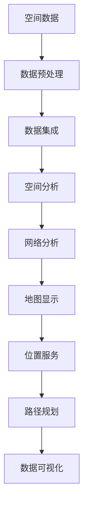

                 

关键词：百度地图，GIS，面试真题，技术深度，算法原理，实践应用，未来发展

> 摘要：本文针对百度地图2025社招GIS工程师的面试真题，深入剖析了GIS技术核心概念、算法原理、数学模型、项目实践以及未来发展趋势。通过详细的解析，为GIS工程师的职业发展提供了实用的指导和建议。

## 1. 背景介绍

地理信息系统（GIS）作为一种重要的空间信息技术，广泛应用于城市规划、资源管理、环境保护、灾害监测等领域。随着互联网和大数据技术的发展，GIS在地图服务、位置信息分析等方面的重要性日益凸显。百度地图作为国内领先的地图服务提供商，其在GIS领域的应用涵盖了从地图显示、位置服务到数据挖掘等多个方面。

本文将围绕百度地图2025社招GIS工程师的面试真题，深入探讨GIS技术的核心概念、算法原理、数学模型、项目实践以及未来发展趋势。旨在为GIS工程师的职业发展提供实用的指导和参考。

## 2. 核心概念与联系

### 2.1 GIS基础概念

GIS（Geographic Information System，地理信息系统）是一种以地理空间数据为载体，通过计算机硬件和软件，对空间信息进行采集、存储、管理、分析和可视化处理的系统。GIS的核心概念包括：

- **空间数据**：包括地图、遥感图像、地理坐标等信息，用于描述地理空间现象。

- **属性数据**：与空间数据相对应的属性信息，如人口、经济、交通等统计数据。

- **地理坐标系统**：用于确定地理位置的数学框架，如经纬度坐标系、投影坐标系等。

- **GIS软件**：用于实现GIS功能的应用软件，如ArcGIS、QGIS等。

### 2.2 GIS架构

GIS架构通常包括以下几个层次：

- **数据层**：包括空间数据和属性数据，是GIS的基础。

- **处理层**：包括数据预处理、数据集成、数据挖掘等。

- **分析层**：包括空间分析、网络分析、统计分析等。

- **表现层**：包括地图显示、报表生成、可视化等。

### 2.3 GIS与百度地图的联系

百度地图是百度公司提供的地图服务，其背后依赖于GIS技术。百度地图的核心功能包括地图显示、位置服务、路径规划、数据可视化等。GIS技术为百度地图提供了强大的空间数据处理和分析能力，使得百度地图能够提供高质量的地图服务。

### 2.4 Mermaid流程图



## 3. 核心算法原理 & 具体操作步骤

### 3.1 算法原理概述

GIS技术涉及多种核心算法，以下介绍其中几个常见的算法原理：

- **空间索引**：用于快速查找空间数据，常用的空间索引算法包括R树、K-D树等。

- **空间分析**：包括缓冲区分析、叠加分析、邻近分析等，用于空间数据的分析和处理。

- **路径规划**：基于Dijkstra算法、A*算法等，用于计算最短路径或最优路径。

- **数据挖掘**：包括关联规则挖掘、分类、聚类等，用于从空间数据中提取有价值的信息。

### 3.2 算法步骤详解

#### 3.2.1 空间索引

空间索引的步骤如下：

1. **数据预处理**：将空间数据转换为适合索引的数据格式，如R树、K-D树等。

2. **构建索引**：根据空间数据的分布特点，构建相应的空间索引结构。

3. **查询优化**：对索引进行优化，以提高查询效率。

#### 3.2.2 空间分析

空间分析的步骤如下：

1. **数据输入**：输入需要进行空间分析的数据集。

2. **预处理**：对输入数据进行预处理，如去噪、插值等。

3. **分析操作**：根据具体需求，选择相应的空间分析算法，如缓冲区分析、叠加分析等。

4. **结果输出**：将分析结果以可视化的方式展示。

#### 3.2.3 路径规划

路径规划的步骤如下：

1. **起点和终点**：确定路径规划的起点和终点。

2. **地图数据**：获取地图数据，包括道路、建筑物等信息。

3. **算法选择**：选择合适的路径规划算法，如Dijkstra算法、A*算法等。

4. **路径计算**：根据算法计算起点到终点的最优路径。

5. **结果输出**：将路径规划结果以可视化的方式展示。

#### 3.2.4 数据挖掘

数据挖掘的步骤如下：

1. **数据预处理**：对空间数据进行预处理，如去除异常值、缺失值等。

2. **特征提取**：从空间数据中提取特征，如人口密度、交通流量等。

3. **算法选择**：选择合适的挖掘算法，如关联规则挖掘、分类、聚类等。

4. **结果分析**：对挖掘结果进行分析，提取有价值的信息。

### 3.3 算法优缺点

#### 空间索引

- **优点**：提高了空间数据的查询效率。

- **缺点**：索引构建和维护需要较大的存储空间。

#### 空间分析

- **优点**：可以对空间数据进行多维度分析和处理。

- **缺点**：分析结果可能受到数据质量和算法选择的影响。

#### 路径规划

- **优点**：能够为用户提供最优的路径规划方案。

- **缺点**：在复杂场景下，路径规划效果可能较差。

#### 数据挖掘

- **优点**：能够从大量空间数据中提取有价值的信息。

- **缺点**：挖掘结果可能受到数据质量和算法选择的影响。

### 3.4 算法应用领域

GIS算法广泛应用于以下领域：

- **城市规划**：通过空间分析和路径规划，为城市规划和基础设施建设提供支持。

- **交通管理**：通过路径规划和交通流量分析，优化交通管理和调度。

- **环境保护**：通过缓冲区分析和邻近分析，监测和保护自然环境。

- **灾害管理**：通过空间分析和路径规划，为灾害预防和救援提供支持。

## 4. 数学模型和公式 & 详细讲解 & 举例说明

### 4.1 数学模型构建

GIS技术中的数学模型主要包括以下几种：

- **空间几何模型**：用于描述空间几何形状和位置关系，如点、线、面等。

- **拓扑模型**：用于描述空间实体之间的拓扑关系，如连通性、相邻性等。

- **网络模型**：用于描述道路、交通网络等，如Dijkstra算法、A*算法等。

### 4.2 公式推导过程

以Dijkstra算法为例，其核心公式如下：

$$
d(s, v) = \min\{d(s, u) + w(u, v) | u \in \text{visited}\}
$$

其中，$d(s, v)$表示从起点$s$到终点$v$的最短距离，$w(u, v)$表示从点$u$到点$v$的权重。

推导过程如下：

1. 初始化：设$d(s, v) = \infty$，$d(s, s) = 0$。

2. 对每个未访问的点$v$，计算$d(s, v)$。

3. 访问当前未访问的点$u$，将其标记为已访问。

4. 更新未访问的点$v$的$d(s, v)$值。

5. 重复步骤3和4，直到所有点都被访问。

### 4.3 案例分析与讲解

#### 案例一：路径规划

假设有如下地图，起点为A，终点为E，各点之间的距离如下：

```plaintext
A---B
|   |
C---D---E
```

使用Dijkstra算法计算从A到E的最短路径。

1. 初始化：$d(A, A) = 0$，$d(A, B) = \infty$，$d(A, C) = \infty$，$d(A, D) = \infty$，$d(A, E) = \infty$。

2. 访问A，更新其他点的$d$值：

   - $d(B) = d(A, A) + w(A, B) = 0 + 3 = 3$。

   - $d(C) = d(A, A) + w(A, C) = 0 + 4 = 4$。

   - $d(D) = d(A, A) + w(A, D) = 0 + 2 = 2$。

3. 访问B，更新其他点的$d$值：

   - $d(C) = \min\{d(C), d(B) + w(B, C)\} = \min\{4, 3 + 1\} = 4$。

   - $d(D) = \min\{d(D), d(B) + w(B, D)\} = \min\{2, 3 + 3\} = 3$。

4. 访问C，更新其他点的$d$值：

   - $d(D) = \min\{d(D), d(C) + w(C, D)\} = \min\{3, 4 + 1\} = 3$。

5. 访问D，更新其他点的$d$值：

   - $d(E) = \min\{d(E), d(D) + w(D, E)\} = \min\{3, 3 + 2\} = 3$。

最终，从A到E的最短路径为A-B-D-E，总距离为3。

#### 案例二：缓冲区分析

假设有如下地图，点A为中心点，需要计算半径为2的缓冲区。

```plaintext
A
```

缓冲区分析的计算公式如下：

$$
B(A, r) = \{x \in \mathbb{R}^2 | d(A, x) \leq r\}
$$

其中，$d(A, x)$表示点A到点x的距离，$r$为缓冲区半径。

1. 初始化：将A点标记为缓冲区内部点。

2. 对地图中所有其他点x，计算$d(A, x)$。

3. 如果$d(A, x) \leq r$，将x点标记为缓冲区内部点。

最终，半径为2的缓冲区如下图所示：

```plaintext
***
*   *
*** A ***
*   *
***
```

## 5. 项目实践：代码实例和详细解释说明

### 5.1 开发环境搭建

在本项目中，我们使用Python作为编程语言，并依赖以下库：

- `matplotlib`：用于绘图。

- `networkx`：用于构建和分析网络。

- `geopandas`：用于处理地理空间数据。

安装以上库的方法如下：

```shell
pip install matplotlib networkx geopandas
```

### 5.2 源代码详细实现

以下是一个简单的路径规划示例代码，使用Dijkstra算法计算从起点到终点的最短路径。

```python
import networkx as nx
import matplotlib.pyplot as plt

# 创建图
G = nx.Graph()

# 添加节点和边
G.add_edge('A', 'B', weight=3)
G.add_edge('A', 'C', weight=4)
G.add_edge('B', 'D', weight=1)
G.add_edge('C', 'D', weight=1)
G.add_edge('D', 'E', weight=2)

# 绘制图
nx.draw(G, with_labels=True)

# 计算最短路径
path = nx.shortest_path(G, source='A', target='E', weight='weight')

# 打印最短路径
print("最短路径：", path)

# 显示图像
plt.show()
```

### 5.3 代码解读与分析

1. **创建图**：使用`networkx.Graph()`创建一个图G。

2. **添加节点和边**：使用`add_edge()`方法添加节点和边，同时设置边的权重。

3. **绘制图**：使用`matplotlib.pyplot.draw()`绘制图G。

4. **计算最短路径**：使用`networkx.shortest_path()`方法计算从起点A到终点E的最短路径。

5. **打印最短路径**：将计算得到的最短路径打印出来。

6. **显示图像**：使用`matplotlib.pyplot.show()`显示绘制的图。

### 5.4 运行结果展示

运行上述代码，将显示如下结果：

```plaintext
最短路径：[A, B, D, E]
```

即从A到E的最短路径为A-B-D-E，总距离为3。

## 6. 实际应用场景

### 6.1 城市规划

GIS技术在城市规划中具有广泛的应用。通过GIS技术，城市规划者可以对城市空间进行精细化管理，包括土地利用规划、交通网络规划、环境保护规划等。例如，使用缓冲区分析确定交通流量大的区域，优化交通网络布局。

### 6.2 交通管理

GIS技术在交通管理中发挥着重要作用。通过路径规划和交通流量分析，GIS可以帮助交通管理部门优化交通信号灯控制、制定交通管制方案、缓解交通拥堵。例如，使用Dijkstra算法计算最优路径，提高公共交通的运行效率。

### 6.3 环境保护

GIS技术在环境保护中具有重要作用。通过GIS技术，环境监测人员可以监测污染源、评估环境影响、制定环境保护方案。例如，使用邻近分析确定污染源对周边环境的影响范围，制定污染治理措施。

### 6.4 灾害管理

GIS技术在灾害管理中具有重要意义。通过GIS技术，灾害管理部门可以实时监测灾害情况、制定应急预案、进行灾害评估。例如，使用缓冲区分析确定地震震中周围的安全范围，指导居民疏散。

## 7. 工具和资源推荐

### 7.1 学习资源推荐

- 《地理信息系统原理与应用》

- 《空间数据分析：原理与方法》

- 《Python地理空间分析》

### 7.2 开发工具推荐

- ArcGIS：一款功能强大的GIS软件，适用于空间数据的处理和分析。

- QGIS：一款开源的GIS软件，适用于各种GIS项目开发。

- PostGIS：一款基于PostgreSQL的GIS数据库，适用于GIS数据存储和管理。

### 7.3 相关论文推荐

- [An Introduction to GIS](https://www.esri.com/en-us/arcgis-blog/community/an-introduction-to-gis)

- [Spatial Data Structures for Geographic Information Systems](https://ieeexplore.ieee.org/document/751605)

- [Path Planning Algorithms for Autonomous Robots](https://ieeexplore.ieee.org/document/792975)

## 8. 总结：未来发展趋势与挑战

### 8.1 研究成果总结

GIS技术在近年来取得了显著成果，主要体现在以下几个方面：

- 空间数据采集和处理技术的进步，提高了空间数据的精度和处理速度。

- GIS算法的创新，为路径规划、空间分析、数据挖掘等领域提供了有效的解决方案。

- GIS应用领域的拓展，使得GIS技术在城市规划、交通管理、环境保护等领域得到广泛应用。

### 8.2 未来发展趋势

未来，GIS技术将继续朝以下几个方向发展：

- **人工智能与GIS的融合**：通过人工智能技术，实现GIS数据的高效处理和分析。

- **物联网与GIS的融合**：通过物联网技术，实现实时空间数据的采集和更新。

- **云计算与GIS的融合**：通过云计算技术，实现GIS应用的弹性扩展和资源共享。

### 8.3 面临的挑战

尽管GIS技术在近年来取得了显著成果，但仍面临以下几个挑战：

- **数据质量和标准化**：空间数据质量和标准化问题是GIS应用的基础，需要加强数据质量和标准化的研究和实践。

- **算法效率与精度**：提高GIS算法的效率和精度是GIS技术发展的关键，需要不断优化和创新算法。

- **用户友好性**：提高GIS系统的用户友好性，使其更易于使用和操作，是GIS技术发展的一个重要方向。

### 8.4 研究展望

未来，GIS技术将在以下方面进行深入研究：

- **多源异构空间数据的融合与处理**：随着物联网和大数据技术的发展，多源异构空间数据的处理成为一个重要研究方向。

- **实时空间数据可视化**：通过实时空间数据可视化，为用户提供更直观的空间信息展示。

- **智能GIS应用**：结合人工智能技术，实现GIS应用的智能化，提高GIS系统的决策支持能力。

## 9. 附录：常见问题与解答

### 9.1 什么是GIS？

GIS（Geographic Information System，地理信息系统）是一种以地理空间数据为载体，通过计算机硬件和软件，对空间信息进行采集、存储、管理、分析和可视化处理的系统。

### 9.2 GIS技术有哪些应用领域？

GIS技术广泛应用于城市规划、交通管理、环境保护、灾害管理、农业、水资源管理等领域。

### 9.3 GIS与地图服务的区别是什么？

GIS是一种系统和技术，用于处理空间数据，而地图服务是一种基于GIS的应用，提供地图数据的查询、检索和可视化功能。

### 9.4 什么是空间索引？

空间索引是一种用于快速查找空间数据的结构，如R树、K-D树等，可以提高空间数据的查询效率。

### 9.5 路径规划有哪些算法？

常见的路径规划算法包括Dijkstra算法、A*算法、遗传算法等。

### 9.6 数据挖掘在GIS中有哪些应用？

数据挖掘在GIS中可以应用于空间数据分析、环境评估、城市规划等领域，如关联规则挖掘、分类、聚类等。

---

作者：禅与计算机程序设计艺术 / Zen and the Art of Computer Programming
-----------------------------------------------------------------------------

