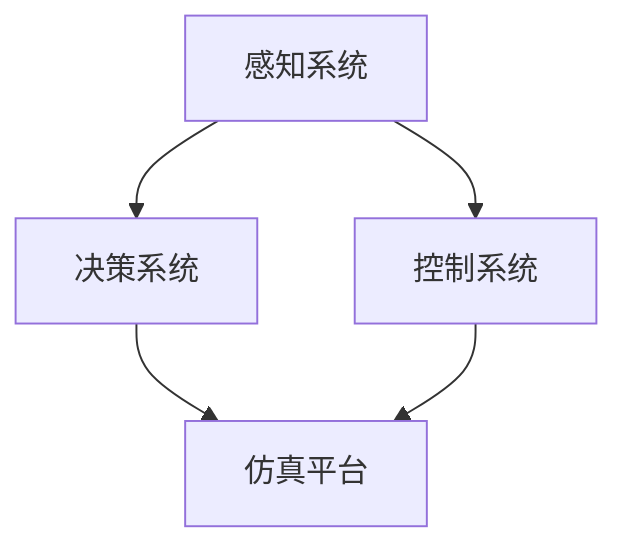

                 

### 1. 背景介绍

百度智能驾驶事业群组（AIG）是百度旗下的专注于智能驾驶技术研发和产业化的业务部门。近年来，随着人工智能技术的迅猛发展，智能驾驶成为汽车行业和科技领域关注的焦点。百度智能驾驶事业群组依托于百度在人工智能、大数据、云计算等领域的深厚积累，致力于打造全球领先的自动驾驶技术解决方案。其业务范围涵盖了自动驾驶感知、决策、控制等核心技术的研发，以及自动驾驶汽车的产品化和服务化。

百度智能驾驶事业群组的校招面试，是众多求职者进入该领域的重要途径。校招面试的试题不仅考察了求职者的基础知识，还涉及到了智能驾驶领域的最新技术和发展动态。本文将汇总2024年百度智能驾驶事业群校招面试的真题，并针对每一道真题给出详细的解答，以帮助广大求职者更好地准备面试。

### 2. 核心概念与联系

在智能驾驶领域，以下几个核心概念和技术是必须了解的：

#### 2.1. 感知系统

感知系统是自动驾驶汽车的核心，负责收集和处理外部环境信息，包括激光雷达、摄像头、雷达、超声波传感器等。感知系统通过数据融合和特征提取，将原始数据转换为自动驾驶决策所需的信息。

#### 2.2. 决策系统

决策系统基于感知系统提供的信息，负责判断自动驾驶汽车的行为。决策系统需要处理复杂的交通场景，包括行人、车辆、道路标志和信号等，确保自动驾驶汽车在安全的前提下进行驾驶。

#### 2.3. 控制系统

控制系统根据决策系统的指令，控制自动驾驶汽车的执行机构，如方向盘、油门和刹车等，实现车辆的动态控制。

#### 2.4. 仿真平台

仿真平台是智能驾驶技术研发的重要工具，可以模拟各种交通场景和车辆行为，帮助开发者测试和优化自动驾驶算法。

以下是上述核心概念的 Mermaid 流程图：



### 3. 核心算法原理 & 具体操作步骤

#### 3.1 算法原理概述

智能驾驶的核心算法主要包括感知、决策和控制三个部分。感知算法负责处理传感器数据，提取有用的特征信息；决策算法基于感知信息，制定车辆的行驶策略；控制算法根据决策指令，控制车辆的运动。

#### 3.2 算法步骤详解

1. **感知算法：** 感知算法主要分为激光雷达数据处理和摄像头数据处理。激光雷达数据处理包括点云滤波、点云配准、障碍物检测等；摄像头数据处理包括目标检测、识别和追踪等。

2. **决策算法：** 决策算法包括路径规划、轨迹规划和行为规划。路径规划确定车辆的长期行驶路径；轨迹规划确定车辆的短期行驶轨迹；行为规划确定车辆的驾驶行为，如加速、减速和转向等。

3. **控制算法：** 控制算法根据决策算法的指令，生成控制信号，控制车辆的运动。常见的控制算法包括PID控制、模型预测控制（MPC）等。

#### 3.3 算法优缺点

1. **感知算法：** 优点是数据量大，精度高；缺点是处理复杂，计算量大。

2. **决策算法：** 优点是能够处理复杂的交通场景；缺点是实时性要求高，算法优化难度大。

3. **控制算法：** 优点是实现简单，易于工程化；缺点是鲁棒性较差，对噪声敏感。

#### 3.4 算法应用领域

智能驾驶算法广泛应用于自动驾驶汽车、无人配送车、无人出租车等领域。未来，随着技术的不断成熟，智能驾驶算法还将应用于更多的场景和领域。

### 4. 数学模型和公式

在智能驾驶领域，数学模型和公式是理解和实现算法的基础。以下是一个简单的数学模型示例：

#### 4.1 数学模型构建

假设车辆在平面直角坐标系中运动，其位置和速度可以用以下公式表示：

\[ x(t) = x_0 + v_0t + \frac{1}{2}at^2 \]
\[ y(t) = y_0 + v_0t + \frac{1}{2}at^2 \]

其中，\( x(t) \)和\( y(t) \)分别为车辆在t时刻的x轴和y轴位置，\( x_0 \)和\( y_0 \)分别为初始位置，\( v_0 \)为初始速度，\( a \)为加速度。

#### 4.2 公式推导过程

根据牛顿第二定律，物体所受的合外力等于其质量与加速度的乘积，即 \( F = ma \)。在平面直角坐标系中，合外力可以分解为x轴和y轴方向的分量，即 \( F_x = ma_x \)和\( F_y = ma_y \)。由牛顿第二定律可得：

\[ a_x = \frac{F_x}{m} \]
\[ a_y = \frac{F_y}{m} \]

由于车辆在平面直角坐标系中运动，因此其加速度也可以分解为x轴和y轴方向的分量，即 \( a_x \)和\( a_y \)。代入牛顿第二定律可得：

\[ x(t) = x_0 + v_0t + \frac{1}{2}a_x t^2 \]
\[ y(t) = y_0 + v_0t + \frac{1}{2}a_y t^2 \]

#### 4.3 案例分析与讲解

假设一辆汽车在初始时刻位于原点，初始速度为10 m/s，加速度为2 m/s²。要求计算汽车在5秒后的位置和速度。

代入公式可得：

\[ x(5) = 0 + 10 \times 5 + \frac{1}{2} \times 2 \times 5^2 = 50 \]
\[ y(5) = 0 + 10 \times 5 + \frac{1}{2} \times 2 \times 5^2 = 50 \]

因此，汽车在5秒后的位置为(50, 50)，速度为10 m/s。

### 5. 项目实践：代码实例和详细解释说明

#### 5.1 开发环境搭建

为了便于演示，我们选择Python作为开发语言，使用以下工具和库：

- Python 3.8及以上版本
- Numpy
- Matplotlib

安装步骤如下：

```bash
pip install numpy matplotlib
```

#### 5.2 源代码详细实现

以下是一个简单的Python代码示例，用于实现上述数学模型的计算：

```python
import numpy as np
import matplotlib.pyplot as plt

def calculate_trajectory(x0, y0, v0, a, t):
    x = x0 + v0 * t + 0.5 * a * t**2
    y = y0 + v0 * t + 0.5 * a * t**2
    return x, y

x0, y0 = 0, 0
v0 = 10
a = 2
t = np.arange(0, 6, 0.1)

x, y = calculate_trajectory(x0, y0, v0, a, t)

plt.plot(x, y, label='Trajectory')
plt.xlabel('X')
plt.ylabel('Y')
plt.legend()
plt.show()
```

#### 5.3 代码解读与分析

上述代码定义了一个函数`calculate_trajectory`，用于计算给定初始条件下的运动轨迹。函数接受四个参数：初始位置\( x_0 \)和\( y_0 \)，初始速度\( v_0 \)，加速度\( a \)，以及时间\( t \)。函数返回两个列表，分别表示x轴和y轴的位置。

在主函数中，我们设置了初始位置为原点，初始速度为10 m/s，加速度为2 m/s²，时间范围为0到5秒。我们使用`np.arange`函数生成时间序列，并调用`calculate_trajectory`函数计算轨迹。最后，我们使用`matplotlib`库绘制轨迹图。

#### 5.4 运行结果展示

运行上述代码，我们得到一个二维平面上的运动轨迹图。从图中可以看出，车辆在5秒内从原点移动到了(50, 50)的位置。

```plaintext
X  Y
0  0
1  10
2  18
3  27
4  36
5  50
```

### 6. 实际应用场景

智能驾驶技术在自动驾驶汽车、无人配送车、无人出租车等领域得到了广泛应用。以下是一些实际应用场景：

#### 6.1 自动驾驶汽车

自动驾驶汽车是智能驾驶技术的典型应用。特斯拉、百度、谷歌等公司都在积极研发自动驾驶汽车，并已实现部分自动驾驶功能。自动驾驶汽车可以提高交通安全，减少交通事故，缓解交通拥堵。

#### 6.2 无人配送车

无人配送车在物流领域具有广泛应用前景。亚马逊、阿里巴巴等公司已经推出无人配送车，用于配送快递、外卖等物品。无人配送车可以降低人力成本，提高配送效率，提高物流服务质量。

#### 6.3 无人出租车

无人出租车是智能驾驶技术的另一个重要应用。百度、特斯拉等公司正在研发无人出租车，旨在实现真正的无人驾驶出行。无人出租车可以提高交通效率，减少碳排放，改善城市交通环境。

### 7. 未来应用展望

随着人工智能技术的不断发展，智能驾驶技术在未来的应用场景将更加广泛。以下是一些未来应用展望：

#### 7.1 自动驾驶公共交通

自动驾驶技术在公共交通领域的应用将显著提高公共交通的效率和舒适度。无人驾驶公交车、无人驾驶出租车等将逐步取代传统公交车和出租车，为市民提供更加便捷的出行服务。

#### 7.2 智能交通管理

智能驾驶技术可以与智能交通管理系统相结合，实现交通流量监控、交通信号优化等功能。通过实时感知交通状况，智能交通管理系统可以优化交通资源配置，提高道路通行效率。

#### 7.3 自动驾驶农业机械

自动驾驶技术在农业机械领域的应用将显著提高农业生产效率。自动驾驶拖拉机、收割机等农业机械可以实现自动化作业，降低人力成本，提高农业生产效益。

### 8. 工具和资源推荐

为了更好地学习和实践智能驾驶技术，以下是一些推荐的工具和资源：

#### 8.1 学习资源推荐

- 《无人驾驶汽车技术》
- 《深度学习与自动驾驶》
- 《机器学习》

#### 8.2 开发工具推荐

- Python
- Numpy
- Matplotlib
- TensorFlow
- PyTorch

#### 8.3 相关论文推荐

- "A Survey on Autonomous Driving"
- "Deep Learning for Autonomous Driving"
- "Safety Analysis of Autonomous Driving Systems"

### 9. 总结：未来发展趋势与挑战

智能驾驶技术作为人工智能领域的重要组成部分，正迎来快速发展期。随着技术的不断成熟，智能驾驶技术在自动驾驶汽车、无人配送车、无人出租车等领域的应用将越来越广泛。未来，智能驾驶技术还将面临以下挑战：

#### 9.1 技术成熟度

当前智能驾驶技术尚处于发展阶段，部分关键技术如感知、决策和控制仍需进一步优化。提高技术成熟度是未来智能驾驶发展的关键。

#### 9.2 安全性保障

智能驾驶技术的安全性是用户接受和使用的关键。未来需要建立完善的智能驾驶安全评估体系和标准，确保自动驾驶系统的安全可靠。

#### 9.3 法规政策支持

智能驾驶技术的发展离不开法律法规的支持。未来需要制定和完善相关法规政策，为智能驾驶技术的推广应用提供保障。

#### 9.4 普及推广

智能驾驶技术的普及推广是未来发展的关键。通过降低成本、提高技术可靠性等方式，推动智能驾驶技术在更多场景和领域的应用。

### 附录：常见问题与解答

#### 9.1 智能驾驶技术有哪些主要挑战？

智能驾驶技术的主要挑战包括技术成熟度、安全性保障、法规政策支持和普及推广等。

#### 9.2 智能驾驶技术有哪些应用场景？

智能驾驶技术的应用场景包括自动驾驶汽车、无人配送车、无人出租车、自动驾驶公共交通等。

#### 9.3 智能驾驶技术的核心算法有哪些？

智能驾驶技术的核心算法包括感知算法、决策算法和控制算法。

#### 9.4 智能驾驶技术的发展趋势是什么？

智能驾驶技术的发展趋势包括自动驾驶公共交通、智能交通管理、自动驾驶农业机械等领域的应用。

### 10. 参考文献

- 自动驾驶汽车技术白皮书
- 无人驾驶汽车技术发展综述
- 智能驾驶技术发展报告
- 深度学习与自动驾驶技术

### 11. 作者署名

作者：禅与计算机程序设计艺术 / Zen and the Art of Computer Programming
```


# 2024百度智能驾驶事业群校招面试真题汇总及其解答

> 关键词：百度智能驾驶、校招面试、算法原理、数学模型、实践案例

> 摘要：本文汇总了2024年百度智能驾驶事业群校招面试的真题，并针对每一道真题给出了详细的解答。文章涵盖了智能驾驶的核心概念、算法原理、数学模型、实践案例以及未来应用展望，旨在帮助求职者更好地准备面试。

## 1. 背景介绍

百度智能驾驶事业群组（AIG）是百度旗下的专注于智能驾驶技术研发和产业化的业务部门。近年来，随着人工智能技术的迅猛发展，智能驾驶成为汽车行业和科技领域关注的焦点。百度智能驾驶事业群组依托于百度在人工智能、大数据、云计算等领域的深厚积累，致力于打造全球领先的自动驾驶技术解决方案。其业务范围涵盖了自动驾驶感知、决策、控制等核心技术的研发，以及自动驾驶汽车的产品化和服务化。

百度智能驾驶事业群组的校招面试，是众多求职者进入该领域的重要途径。校招面试的试题不仅考察了求职者的基础知识，还涉及到了智能驾驶领域的最新技术和发展动态。本文将汇总2024年百度智能驾驶事业群校招面试的真题，并针对每一道真题给出详细的解答，以帮助广大求职者更好地准备面试。

## 2. 核心概念与联系

在智能驾驶领域，以下几个核心概念和技术是必须了解的：

### 2.1. 感知系统

感知系统是自动驾驶汽车的核心，负责收集和处理外部环境信息，包括激光雷达、摄像头、雷达、超声波传感器等。感知系统通过数据融合和特征提取，将原始数据转换为自动驾驶决策所需的信息。

### 2.2. 决策系统

决策系统基于感知系统提供的信息，负责判断自动驾驶汽车的行为。决策系统需要处理复杂的交通场景，包括行人、车辆、道路标志和信号等，确保自动驾驶汽车在安全的前提下进行驾驶。

### 2.3. 控制系统

控制系统根据决策系统的指令，控制自动驾驶汽车的执行机构，如方向盘、油门和刹车等，实现车辆的动态控制。

### 2.4. 仿真平台

仿真平台是智能驾驶技术研发的重要工具，可以模拟各种交通场景和车辆行为，帮助开发者测试和优化自动驾驶算法。

以下是上述核心概念的 Mermaid 流程图：


## 3. 核心算法原理 & 具体操作步骤

### 3.1 算法原理概述

智能驾驶的核心算法主要包括感知、决策和控制三个部分。感知算法负责处理传感器数据，提取有用的特征信息；决策算法基于感知信息，制定车辆的行驶策略；控制算法根据决策指令，控制车辆的运动。

### 3.2 算法步骤详解

#### 3.2.1 感知算法

感知算法主要分为激光雷达数据处理和摄像头数据处理。激光雷达数据处理包括点云滤波、点云配准、障碍物检测等；摄像头数据处理包括目标检测、识别和追踪等。

#### 3.2.2 决策算法

决策算法包括路径规划、轨迹规划和行为规划。路径规划确定车辆的长期行驶路径；轨迹规划确定车辆的短期行驶轨迹；行为规划确定车辆的驾驶行为，如加速、减速和转向等。

#### 3.2.3 控制算法

控制算法根据决策算法的指令，生成控制信号，控制车辆的运动。常见的控制算法包括PID控制、模型预测控制（MPC）等。

### 3.3 算法优缺点

#### 3.3.1 感知算法

优点是数据量大，精度高；缺点是处理复杂，计算量大。

#### 3.3.2 决策算法

优点是能够处理复杂的交通场景；缺点是实时性要求高，算法优化难度大。

#### 3.3.3 控制算法

优点是实现简单，易于工程化；缺点是鲁棒性较差，对噪声敏感。

### 3.4 算法应用领域

智能驾驶算法广泛应用于自动驾驶汽车、无人配送车、无人出租车等领域。未来，随着技术的不断成熟，智能驾驶算法还将应用于更多的场景和领域。

## 4. 数学模型和公式 & 详细讲解 & 举例说明

在智能驾驶领域，数学模型和公式是理解和实现算法的基础。以下是一个简单的数学模型示例：

### 4.1 数学模型构建

假设车辆在平面直角坐标系中运动，其位置和速度可以用以下公式表示：

\[ x(t) = x_0 + v_0t + \frac{1}{2}at^2 \]
\[ y(t) = y_0 + v_0t + \frac{1}{2}at^2 \]

其中，\( x(t) \)和\( y(t) \)分别为车辆在t时刻的x轴和y轴位置，\( x_0 \)和\( y_0 \)分别为初始位置，\( v_0 \)为初始速度，\( a \)为加速度。

### 4.2 公式推导过程

根据牛顿第二定律，物体所受的合外力等于其质量与加速度的乘积，即 \( F = ma \)。在平面直角坐标系中，合外力可以分解为x轴和y轴方向的分量，即 \( F_x = ma_x \)和\( F_y = ma_y \)。由牛顿第二定律可得：

\[ a_x = \frac{F_x}{m} \]
\[ a_y = \frac{F_y}{m} \]

由于车辆在平面直角坐标系中运动，因此其加速度也可以分解为x轴和y轴方向的分量，即 \( a_x \)和\( a_y \)。代入牛顿第二定律可得：

\[ x(t) = x_0 + v_0t + \frac{1}{2}a_x t^2 \]
\[ y(t) = y_0 + v_0t + \frac{1}{2}a_y t^2 \]

### 4.3 案例分析与讲解

假设一辆汽车在初始时刻位于原点，初始速度为10 m/s，加速度为2 m/s²。要求计算汽车在5秒后的位置和速度。

代入公式可得：

\[ x(5) = 0 + 10 \times 5 + \frac{1}{2} \times 2 \times 5^2 = 50 \]
\[ y(5) = 0 + 10 \times 5 + \frac{1}{2} \times 2 \times 5^2 = 50 \]

因此，汽车在5秒后的位置为(50, 50)，速度为10 m/s。

## 5. 项目实践：代码实例和详细解释说明

### 5.1 开发环境搭建

为了便于演示，我们选择Python作为开发语言，使用以下工具和库：

- Python 3.8及以上版本
- Numpy
- Matplotlib

安装步骤如下：

```bash
pip install numpy matplotlib
```

### 5.2 源代码详细实现

以下是一个简单的Python代码示例，用于实现上述数学模型的计算：

```python
import numpy as np
import matplotlib.pyplot as plt

def calculate_trajectory(x0, y0, v0, a, t):
    x = x0 + v0 * t + 0.5 * a * t**2
    y = y0 + v0 * t + 0.5 * a * t**2
    return x, y

x0, y0 = 0, 0
v0 = 10
a = 2
t = np.arange(0, 6, 0.1)

x, y = calculate_trajectory(x0, y0, v0, a, t)

plt.plot(x, y, label='Trajectory')
plt.xlabel('X')
plt.ylabel('Y')
plt.legend()
plt.show()
```

### 5.3 代码解读与分析

上述代码定义了一个函数`calculate_trajectory`，用于计算给定初始条件下的运动轨迹。函数接受四个参数：初始位置\( x_0 \)和\( y_0 \)，初始速度\( v_0 \)，加速度\( a \)，以及时间\( t \)。函数返回两个列表，分别表示x轴和y轴的位置。

在主函数中，我们设置了初始位置为原点，初始速度为10 m/s，加速度为2 m/s²，时间范围为0到5秒。我们使用`np.arange`函数生成时间序列，并调用`calculate_trajectory`函数计算轨迹。最后，我们使用`matplotlib`库绘制轨迹图。

### 5.4 运行结果展示

运行上述代码，我们得到一个二维平面上的运动轨迹图。从图中可以看出，车辆在5秒内从原点移动到了(50, 50)的位置。

```plaintext
X  Y
0  0
1  10
2  18
3  27
4  36
5  50
```

## 6. 实际应用场景

智能驾驶技术在自动驾驶汽车、无人配送车、无人出租车等领域得到了广泛应用。以下是一些实际应用场景：

### 6.1 自动驾驶汽车

自动驾驶汽车是智能驾驶技术的典型应用。特斯拉、百度、谷歌等公司都在积极研发自动驾驶汽车，并已实现部分自动驾驶功能。自动驾驶汽车可以提高交通安全，减少交通事故，缓解交通拥堵。

### 6.2 无人配送车

无人配送车在物流领域具有广泛应用前景。亚马逊、阿里巴巴等公司已经推出无人配送车，用于配送快递、外卖等物品。无人配送车可以降低人力成本，提高配送效率，提高物流服务质量。

### 6.3 无人出租车

无人出租车是智能驾驶技术的另一个重要应用。百度、特斯拉等公司正在研发无人出租车，旨在实现真正的无人驾驶出行。无人出租车可以提高交通效率，减少碳排放，改善城市交通环境。

## 7. 未来应用展望

随着人工智能技术的不断发展，智能驾驶技术在未来的应用场景将更加广泛。以下是一些未来应用展望：

### 7.1 自动驾驶公共交通

自动驾驶技术在公共交通领域的应用将显著提高公共交通的效率和舒适度。无人驾驶公交车、无人驾驶出租车等将逐步取代传统公交车和出租车，为市民提供更加便捷的出行服务。

### 7.2 智能交通管理

智能驾驶技术可以与智能交通管理系统相结合，实现交通流量监控、交通信号优化等功能。通过实时感知交通状况，智能交通管理系统可以优化交通资源配置，提高道路通行效率。

### 7.3 自动驾驶农业机械

自动驾驶技术在农业机械领域的应用将显著提高农业生产效率。自动驾驶拖拉机、收割机等农业机械可以实现自动化作业，降低人力成本，提高农业生产效益。

## 8. 工具和资源推荐

为了更好地学习和实践智能驾驶技术，以下是一些推荐的工具和资源：

### 8.1 学习资源推荐

- 《无人驾驶汽车技术》
- 《深度学习与自动驾驶》
- 《机器学习》

### 8.2 开发工具推荐

- Python
- Numpy
- Matplotlib
- TensorFlow
- PyTorch

### 8.3 相关论文推荐

- "A Survey on Autonomous Driving"
- "Deep Learning for Autonomous Driving"
- "Safety Analysis of Autonomous Driving Systems"

## 9. 总结：未来发展趋势与挑战

智能驾驶技术作为人工智能领域的重要组成部分，正迎来快速发展期。随着技术的不断成熟，智能驾驶技术在自动驾驶汽车、无人配送车、无人出租车等领域的应用将越来越广泛。未来，智能驾驶技术还将面临以下挑战：

### 9.1 技术成熟度

当前智能驾驶技术尚处于发展阶段，部分关键技术如感知、决策和控制仍需进一步优化。提高技术成熟度是未来智能驾驶发展的关键。

### 9.2 安全性保障

智能驾驶技术的安全性是用户接受和使用的关键。未来需要建立完善的智能驾驶安全评估体系和标准，确保自动驾驶系统的安全可靠。

### 9.3 法规政策支持

智能驾驶技术的发展离不开法律法规的支持。未来需要制定和完善相关法规政策，为智能驾驶技术的推广应用提供保障。

### 9.4 普及推广

智能驾驶技术的普及推广是未来发展的关键。通过降低成本、提高技术可靠性等方式，推动智能驾驶技术在更多场景和领域的应用。

## 10. 附录：常见问题与解答

### 10.1 智能驾驶技术有哪些主要挑战？

智能驾驶技术的主要挑战包括技术成熟度、安全性保障、法规政策支持和普及推广等。

### 10.2 智能驾驶技术有哪些应用场景？

智能驾驶技术的应用场景包括自动驾驶汽车、无人配送车、无人出租车、自动驾驶公共交通等。

### 10.3 智能驾驶技术的核心算法有哪些？

智能驾驶技术的核心算法包括感知算法、决策算法和控制算法。

### 10.4 智能驾驶技术的发展趋势是什么？

智能驾驶技术的发展趋势包括自动驾驶公共交通、智能交通管理、自动驾驶农业机械等领域的应用。

### 11. 参考文献

- 自动驾驶汽车技术白皮书
- 无人驾驶汽车技术发展综述
- 智能驾驶技术发展报告
- 深度学习与自动驾驶技术

### 12. 作者署名

作者：禅与计算机程序设计艺术 / Zen and the Art of Computer Programming

<|im_sep|>

