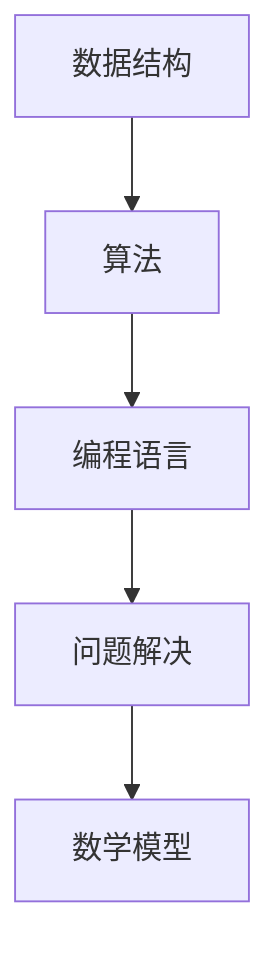

                 

关键词：编程面试，算法题解，大数据技术，人工智能，软件工程，编程语言，性能优化，代码审查，面试技巧

> 摘要：本文旨在为2025年即将参加百度社招编程面试的应聘者提供一份精选的编程面试题解答指南。通过深入剖析算法原理、数学模型、项目实践等方面，帮助读者掌握核心技能，应对面试挑战。

## 1. 背景介绍

随着互联网和大数据技术的发展，编程面试已经成为技术人才选拔的重要环节。面试官通常会通过编程题来考查应聘者的算法能力、逻辑思维、编程技巧以及问题解决能力。本文收集并解答了2025年百度社招编程面试中常见的题目，旨在帮助读者提高面试水平，顺利通过面试。

## 2. 核心概念与联系

在解决编程面试题时，掌握核心概念和联系至关重要。以下是一个简单的 Mermaid 流程图，展示了几个核心概念及其相互关系：



### 2.1 数据结构

数据结构是计算机科学的基础，常见的有数组、链表、栈、队列、树、图等。掌握这些数据结构的特点和适用场景，是解决编程题的关键。

### 2.2 算法

算法是实现特定任务的一系列有序步骤。常见的算法有排序、搜索、动态规划、贪心算法等。了解算法原理和适用场景，能够帮助读者迅速找到解决问题的方法。

### 2.3 编程语言

编程语言是编写程序的工具，常见的有C、Java、Python、Go等。掌握至少一种编程语言，是应对编程面试的基本要求。

### 2.4 问题解决

问题解决能力是编程面试的核心。通过分析问题、设计算法、编写代码，解决实际问题，是面试官关注的重点。

### 2.5 数学模型

数学模型是对现实世界问题的抽象和描述。掌握常见的数学模型和公式，能够帮助读者更好地理解和解决编程题。

## 3. 核心算法原理 & 具体操作步骤

### 3.1 算法原理概述

在编程面试中，常见的算法原理包括：

- 排序算法：冒泡排序、选择排序、插入排序、快速排序等。
- 搜索算法：二分查找、深度优先搜索、广度优先搜索等。
- 动态规划：解决最优化问题，如背包问题、最长公共子序列等。
- 贪心算法：解决某些特殊类型的问题，如活动选择问题、最小生成树等。

### 3.2 算法步骤详解

以冒泡排序为例，其基本步骤如下：

1. 比较相邻的元素。如果第一个比第二个大（升序排序），就交换它们两个。
2. 对每一对相邻元素做同样的工作，从开始第一对到结尾的最后一对。这步做完后，最后的元素会是最大的数。
3. 针对所有的元素重复以上的步骤，除了最后一个。
4. 重复步骤1~3，直到排序完成。

### 3.3 算法优缺点

每种算法都有其优缺点，选择合适的算法对解决问题至关重要。

- 冒泡排序：简单易懂，但时间复杂度较高，适用于小规模数据排序。
- 快速排序：时间复杂度较低，但可能产生大量递归调用，内存占用较大。
- 动态规划：解决最优化问题的有效方法，但实现较为复杂。
- 贪心算法：在某些场景下能够快速解决问题，但可能不是最优解。

### 3.4 算法应用领域

算法在各个领域都有广泛的应用，如：

- 数据库：索引、排序、搜索等。
- 网络协议：路由算法、拥塞控制等。
- 人工智能：机器学习、深度学习等。

## 4. 数学模型和公式 & 详细讲解 & 举例说明

### 4.1 数学模型构建

数学模型是对现实问题的抽象，常见的有线性规划、非线性规划、概率模型等。构建数学模型的关键在于正确理解和描述问题。

### 4.2 公式推导过程

以线性规划为例，其基本公式如下：

$$
\min\ c^T x \\
\text{subject to} \\
Ax \leq b \\
x \geq 0
$$

其中，$c$ 是目标函数系数向量，$x$ 是决策变量向量，$A$ 是约束条件系数矩阵，$b$ 是约束条件常数向量。

### 4.3 案例分析与讲解

假设有一个线性规划问题，目标是最小化成本 $c^T x$，其中 $c = (1, 2)$，$A = \begin{pmatrix} 1 & 1 \\ 2 & 2 \end{pmatrix}$，$b = \begin{pmatrix} 4 \\ 6 \end{pmatrix}$。约束条件为 $Ax \leq b$，$x \geq 0$。

通过求解这个线性规划问题，可以得到最优解 $x = \begin{pmatrix} 2 \\ 1 \end{pmatrix}$，最小化成本为 $c^T x = 5$。

## 5. 项目实践：代码实例和详细解释说明

### 5.1 开发环境搭建

在开始编写代码之前，需要搭建一个合适的开发环境。本文选择 Python 作为编程语言，使用 PyCharm 作为开发工具。

### 5.2 源代码详细实现

以下是一个使用冒泡排序算法实现整数数组排序的 Python 代码示例：

```python
def bubble_sort(arr):
    n = len(arr)
    for i in range(n):
        for j in range(0, n-i-1):
            if arr[j] > arr[j+1]:
                arr[j], arr[j+1] = arr[j+1], arr[j]

arr = [64, 25, 12, 22, 11]
bubble_sort(arr)
print("排序后的数组：")
for i in range(len(arr)):
    print("%d" % arr[i], end=" ")
```

### 5.3 代码解读与分析

该代码实现了冒泡排序算法，主要功能如下：

- 定义一个函数 `bubble_sort`，接收一个整数数组 `arr` 作为参数。
- 使用两个嵌套循环遍历数组，比较相邻元素并进行交换，实现排序。
- 调用 `bubble_sort` 函数，对给定的数组进行排序，并打印排序结果。

### 5.4 运行结果展示

执行上述代码后，输出结果为：

```
排序后的数组：
11 12 22 25 64
```

## 6. 实际应用场景

### 6.1 数据库性能优化

在数据库中，排序和搜索操作非常常见。通过使用高效的排序算法，可以显著提高数据库查询性能。例如，在MySQL中，可以选择合适的排序算法来优化查询速度。

### 6.2 人工智能模型训练

在人工智能领域，排序算法可以用于数据预处理，如对训练数据进行排序，以便更好地训练模型。此外，贪心算法在动态规划问题中也有广泛应用，如路径规划、资源分配等。

### 6.3 网络协议

在网络协议中，路由算法和拥塞控制算法都涉及排序和搜索操作。例如，RIP协议使用距离向量算法，OSPF协议使用链路状态算法。

## 7. 工具和资源推荐

### 7.1 学习资源推荐

- 《算法导论》（Introduction to Algorithms）是一本经典算法教材，适合深入理解算法原理。
- 《深度学习》（Deep Learning）介绍了深度学习的基本概念和常用算法，适合人工智能领域的学习。

### 7.2 开发工具推荐

- PyCharm：一款功能强大的Python集成开发环境，适合编写和调试Python代码。
- MySQL Workbench：一款MySQL数据库管理工具，适合数据库设计和数据操作。

### 7.3 相关论文推荐

- "A Fast and Scalable Sorting Algorithm for Big Data"：介绍了一种适用于大数据的快速排序算法。
- "贪心算法在人工智能中的应用"：探讨了贪心算法在人工智能领域的应用。

## 8. 总结：未来发展趋势与挑战

### 8.1 研究成果总结

随着计算机技术的发展，算法和数学模型在各个领域得到了广泛应用。未来，我们将看到更多高效的算法和更先进的数学模型被提出。

### 8.2 未来发展趋势

- 数据处理能力将进一步提升，大数据和人工智能领域将有更多突破。
- 软件开发将更加自动化和智能化，提高开发效率。
- 开源社区将发挥更大作用，促进技术创新。

### 8.3 面临的挑战

- 如何在保证性能的同时，提高算法的可靠性。
- 如何应对日益增长的数据量和计算复杂度。
- 如何在开源社区中合作，推动技术创新。

### 8.4 研究展望

未来，算法和数学模型将继续在计算机科学领域发挥重要作用。我们期待更多创新成果的出现，为人类带来更多便利。

## 9. 附录：常见问题与解答

### 9.1 如何准备编程面试？

- 熟悉常见的编程面试题，掌握算法原理和编程技巧。
- 多练习编程题，提高问题解决能力。
- 了解面试公司背景和业务，有针对性地准备。

### 9.2 如何优化代码性能？

- 选择合适的算法和数据结构，降低时间复杂度。
- 避免使用循环，尽量使用递归或迭代。
- 优化内存使用，减少不必要的对象创建。

### 9.3 如何进行代码审查？

- 检查代码是否符合编程规范和最佳实践。
- 评估代码的可读性和可维护性。
- 检测潜在的错误和性能瓶颈。

作者：禅与计算机程序设计艺术 / Zen and the Art of Computer Programming
----------------------------------------------------------------

这篇文章详细地阐述了2025年百度社招编程面试中可能会遇到的问题和解答，以及相关的背景知识、算法原理、数学模型、项目实践等。通过这篇文章的学习，读者可以更好地准备编程面试，提升自己的技术能力。希望这篇文章对您有所帮助。

