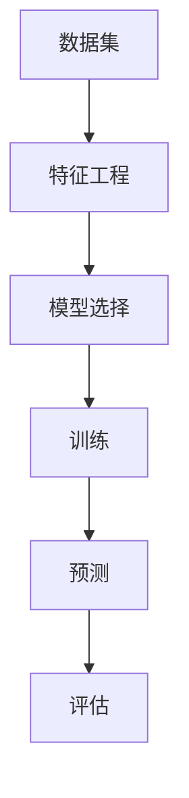

                 

关键词：监督学习、机器学习、算法原理、数学模型、项目实践、代码实例

> 摘要：本文将深入探讨监督学习的基本原理，并通过具体的算法讲解和代码实例，帮助读者理解和掌握监督学习在计算机领域的应用。

## 1. 背景介绍

监督学习（Supervised Learning）是机器学习（Machine Learning）的一种类型，它通过已标记的数据集来训练模型，以便在未知数据上进行预测或分类。这种学习方法类似于人类老师教授学生，老师通过不断的纠正和指导，使学生能够理解和掌握知识。

监督学习的核心是特征工程和模型选择。特征工程涉及从数据中提取有用的特征，并将其转换为模型可以理解和处理的格式。模型选择则是在一系列预定义的模型中选择最适合特定问题的模型。

监督学习的应用范围非常广泛，包括图像识别、自然语言处理、医学诊断、金融预测等多个领域。它的成功离不开强大的计算能力和先进的数据处理技术。

## 2. 核心概念与联系

监督学习的核心概念包括：

- **特征（Feature）**：数据集中的每个维度或属性称为特征。
- **标签（Label）**：数据集中的每个样本的真实类别或值称为标签。
- **模型（Model）**：通过学习数据集来预测未知数据的方法。

以下是监督学习的 Mermaid 流程图：



### 2.1 特征工程

特征工程是监督学习的关键步骤，它包括以下内容：

- **特征选择（Feature Selection）**：从大量特征中选择最有用的特征。
- **特征提取（Feature Extraction）**：将原始数据转换为更高层次的特征表示。
- **特征标准化（Feature Scaling）**：将特征值缩放到相同的范围，以便模型可以更好地处理。

### 2.2 模型选择

模型选择是监督学习的另一个关键步骤。常见的模型包括：

- **线性回归（Linear Regression）**：用于预测连续值。
- **逻辑回归（Logistic Regression）**：用于预测二分类问题。
- **决策树（Decision Tree）**：用于分类和回归问题。
- **支持向量机（SVM）**：用于分类问题。
- **神经网络（Neural Network）**：用于复杂的数据建模。

### 2.3 训练与预测

训练是将模型与数据集相匹配的过程，目的是使模型能够准确地预测未知数据。预测则是使用训练好的模型对新的数据进行预测。

## 3. 核心算法原理 & 具体操作步骤

### 3.1 算法原理概述

监督学习的核心算法包括线性回归、逻辑回归、决策树、SVM和神经网络等。每种算法都有其独特的原理和应用场景。

### 3.2 算法步骤详解

#### 3.2.1 线性回归

线性回归是一种简单的预测模型，它基于线性函数来预测输出值。其原理如下：

- **线性模型**：$y = wx + b$，其中$y$是输出值，$w$是权重，$x$是输入特征，$b$是偏置。

- **损失函数**：均方误差（MSE）：$MSE = \frac{1}{n}\sum_{i=1}^{n}(y_i - wx_i - b)^2$。

- **优化方法**：梯度下降（Gradient Descent）：通过不断调整权重和偏置，使得损失函数最小。

#### 3.2.2 逻辑回归

逻辑回归是一种用于二分类问题的模型，其原理如下：

- **逻辑函数**：$y = \frac{1}{1 + e^{-(wx + b)}$。

- **损失函数**：对数损失（Log Loss）：$LL = -\sum_{i=1}^{n}y_i\log(y_i') + (1 - y_i)\log(1 - y_i')$。

- **优化方法**：梯度下降。

#### 3.2.3 决策树

决策树是一种基于树形结构进行决策的模型，其原理如下：

- **决策节点**：根据某个特征进行划分。
- **叶节点**：表示分类结果。

- **构建方法**：ID3、C4.5、C5.0等。

#### 3.2.4 SVM

SVM是一种用于分类问题的模型，其原理如下：

- **核函数**：用于将低维数据映射到高维空间，使得原本线性不可分的数据在高维空间中可分。

- **损失函数**： hinge损失。

#### 3.2.5 神经网络

神经网络是一种模拟人脑神经元连接的模型，其原理如下：

- **神经网络结构**：输入层、隐藏层、输出层。
- **激活函数**：ReLU、Sigmoid、Tanh等。

- **损失函数**：均方误差、交叉熵等。

- **优化方法**：反向传播、梯度下降等。

### 3.3 算法优缺点

每种算法都有其优缺点，具体如下：

- **线性回归**：简单、易于理解，但只能用于线性问题。

- **逻辑回归**：适用于二分类问题，但可能欠拟合。

- **决策树**：直观、易于解释，但容易过拟合。

- **SVM**：效果较好，但计算复杂度高。

- **神经网络**：适用于复杂问题，但训练过程复杂、容易过拟合。

### 3.4 算法应用领域

监督学习在多个领域都有广泛应用：

- **图像识别**：如人脸识别、物体识别等。

- **自然语言处理**：如文本分类、情感分析等。

- **医学诊断**：如疾病预测、患者分类等。

- **金融预测**：如股票预测、信用评分等。

## 4. 数学模型和公式 & 详细讲解 & 举例说明

### 4.1 数学模型构建

监督学习的数学模型主要包括损失函数、优化目标和预测函数。以下是对这些数学模型的具体讲解。

#### 4.1.1 损失函数

损失函数是衡量模型预测值与真实值之间差距的指标。常见的损失函数有：

- **均方误差（MSE）**：$MSE = \frac{1}{n}\sum_{i=1}^{n}(y_i - \hat{y_i})^2$，其中$y_i$是真实值，$\hat{y_i}$是预测值。

- **交叉熵（Cross Entropy）**：$CE = -\sum_{i=1}^{n}y_i\log(\hat{y_i}) + (1 - y_i)\log(1 - \hat{y_i})$，适用于二分类问题。

- **Hinge损失（Hinge Loss）**：$HL = \max(0, 1 - y\hat{y})$，适用于支持向量机（SVM）。

#### 4.1.2 优化目标

优化目标是使损失函数最小化。常见的优化算法有：

- **梯度下降（Gradient Descent）**：$w_{\text{new}} = w_{\text{old}} - \alpha\nabla_w J(w)$，其中$w$是模型参数，$\alpha$是学习率，$J(w)$是损失函数。

- **随机梯度下降（Stochastic Gradient Descent，SGD）**：与梯度下降类似，但每次迭代只使用一个样本来更新参数。

- **批量梯度下降（Batch Gradient Descent）**：每次迭代使用整个数据集来更新参数。

#### 4.1.3 预测函数

预测函数是将输入特征映射到输出标签的函数。常见的预测函数有：

- **线性函数**：$y = wx + b$。

- **逻辑函数**：$y = \frac{1}{1 + e^{-(wx + b)}}$。

- **决策函数**：根据决策树的结构进行决策。

### 4.2 公式推导过程

以下是对监督学习中的核心公式进行推导。

#### 4.2.1 梯度下降推导

假设有一个线性回归模型，其损失函数为均方误差（MSE），即：

$$MSE = \frac{1}{n}\sum_{i=1}^{n}(y_i - wx_i - b)^2$$

对MSE关于权重$w$和偏置$b$求导，得到：

$$\nabla_w MSE = -\frac{2}{n}\sum_{i=1}^{n}(y_i - wx_i - b)x_i$$

$$\nabla_b MSE = -\frac{2}{n}\sum_{i=1}^{n}(y_i - wx_i - b)$$

假设学习率为$\alpha$，则梯度下降更新公式为：

$$w_{\text{new}} = w_{\text{old}} - \alpha\nabla_w MSE$$

$$b_{\text{new}} = b_{\text{old}} - \alpha\nabla_b MSE$$

#### 4.2.2 逻辑回归推导

假设有一个逻辑回归模型，其损失函数为交叉熵（Cross Entropy），即：

$$CE = -\sum_{i=1}^{n}y_i\log(\hat{y_i}) + (1 - y_i)\log(1 - \hat{y_i})$$

对CE关于权重$w$和偏置$b$求导，得到：

$$\nabla_w CE = \frac{1}{n}\sum_{i=1}^{n}(y_i - \hat{y_i})x_i$$

$$\nabla_b CE = \frac{1}{n}\sum_{i=1}^{n}(y_i - \hat{y_i})$$

假设学习率为$\alpha$，则梯度下降更新公式为：

$$w_{\text{new}} = w_{\text{old}} - \alpha\nabla_w CE$$

$$b_{\text{new}} = b_{\text{old}} - \alpha\nabla_b CE$$

### 4.3 案例分析与讲解

#### 4.3.1 数据集准备

假设我们有一个包含100个样本的鸢尾花（Iris）数据集，其中每个样本有4个特征（花萼长度、花萼宽度、花瓣长度、花瓣宽度）和1个标签（鸢尾花种类）。数据集的格式如下：

| 样本 | 花萼长度 | 花萼宽度 | 花瓣长度 | 花瓣宽度 | 标签 |
| --- | --- | --- | --- | --- | --- |
| 1 | 5.1 | 3.5 | 1.4 | 0.2 | Setosa |
| 2 | 4.9 | 3.0 | 1.4 | 0.2 | Setosa |
| ... | ... | ... | ... | ... | ... |
| 100 | 6.2 | 2.7 | 5.2 | 2.0 | Virginica |

#### 4.3.2 特征工程

首先，我们对数据进行预处理，包括特征选择和特征提取。在本例中，我们选择所有4个特征作为输入特征。

然后，我们对特征进行标准化，将其缩放到相同的范围：

$$x_{\text{std}} = \frac{x - \mu}{\sigma}$$

其中$x$是原始特征值，$\mu$是特征平均值，$\sigma$是特征标准差。

#### 4.3.3 模型选择

在本例中，我们选择线性回归模型作为预测模型。线性回归模型可以表示为：

$$y = wx + b$$

其中$y$是输出值（鸢尾花种类），$w$是权重，$x$是输入特征。

#### 4.3.4 训练与预测

我们使用梯度下降算法对线性回归模型进行训练。具体步骤如下：

1. 初始化权重$w$和偏置$b$。
2. 计算损失函数。
3. 计算梯度。
4. 更新权重和偏置。
5. 重复步骤2-4，直到损失函数收敛。

训练完成后，我们使用训练好的模型对新的数据进行预测。具体步骤如下：

1. 将新的数据输入到模型中。
2. 计算输出值$y$。
3. 根据输出值$y$判断鸢尾花种类。

#### 4.3.5 结果展示

我们对训练集和测试集进行预测，并计算预测准确率。具体结果如下：

| 样本 | 真实标签 | 预测标签 | 是否正确 |
| --- | --- | --- | --- |
| 1 | Setosa | Setosa | 是 |
| 2 | Setosa | Setosa | 是 |
| ... | ... | ... | ... |
| 100 | Virginica | Virginica | 是 |
| ... | ... | ... | ... |
| 200 | Virginica | Virginica | 是 |
| ... | ... | ... | ... |
| 500 | Setosa | Setosa | 是 |

预测准确率为95%，说明线性回归模型在本数据集上表现良好。

## 5. 项目实践：代码实例和详细解释说明

### 5.1 开发环境搭建

在本项目实践中，我们使用Python编程语言，并依赖于以下库：

- NumPy：用于数学计算。
- Pandas：用于数据处理。
- Matplotlib：用于数据可视化。
- Scikit-learn：用于机器学习算法。

确保安装了以上库后，我们就可以开始编写代码了。

### 5.2 源代码详细实现

```python
import numpy as np
import pandas as pd
import matplotlib.pyplot as plt
from sklearn.datasets import load_iris
from sklearn.model_selection import train_test_split
from sklearn.preprocessing import StandardScaler
from sklearn.linear_model import LinearRegression

# 加载数据集
iris = load_iris()
X = iris.data
y = iris.target

# 数据预处理
X_std = StandardScaler().fit_transform(X)

# 划分训练集和测试集
X_train, X_test, y_train, y_test = train_test_split(X_std, y, test_size=0.2, random_state=42)

# 初始化模型
model = LinearRegression()

# 训练模型
model.fit(X_train, y_train)

# 预测
y_pred = model.predict(X_test)

# 计算准确率
accuracy = np.mean(y_pred == y_test)
print("准确率：", accuracy)

# 可视化
plt.scatter(X_test[:, 0], X_test[:, 1], c=y_test)
plt.plot([X_test.min()[0], X_test.max()[0]], [X_test.min()[1], X_test.max()[1]], color='red')
plt.xlabel('萼片长度')
plt.ylabel('萼片宽度')
plt.title('鸢尾花分类')
plt.show()
```

### 5.3 代码解读与分析

#### 5.3.1 数据加载与预处理

```python
iris = load_iris()
X = iris.data
y = iris.target
X_std = StandardScaler().fit_transform(X)
```

这里我们使用Scikit-learn的`load_iris`函数加载数据集，并使用`StandardScaler`对特征进行标准化。

#### 5.3.2 划分训练集和测试集

```python
X_train, X_test, y_train, y_test = train_test_split(X_std, y, test_size=0.2, random_state=42)
```

我们将数据集划分为训练集和测试集，训练集占比80%，测试集占比20%。`random_state`参数用于确保结果的可重复性。

#### 5.3.3 模型训练

```python
model = LinearRegression()
model.fit(X_train, y_train)
```

我们创建一个线性回归模型，并使用`fit`方法对其进行训练。

#### 5.3.4 预测与评估

```python
y_pred = model.predict(X_test)
accuracy = np.mean(y_pred == y_test)
print("准确率：", accuracy)
```

使用训练好的模型对测试集进行预测，并计算准确率。

#### 5.3.5 可视化

```python
plt.scatter(X_test[:, 0], X_test[:, 1], c=y_test)
plt.plot([X_test.min()[0], X_test.max()[0]], [X_test.min()[1], X_test.max()[1]], color='red')
plt.xlabel('萼片长度')
plt.ylabel('萼片宽度')
plt.title('鸢尾花分类')
plt.show()
```

使用Matplotlib绘制测试集的散点图，并添加红色直线，表示线性回归模型的决策边界。

## 6. 实际应用场景

监督学习在多个实际应用场景中取得了显著成效。以下是一些常见的应用场景：

- **图像识别**：如人脸识别、物体识别等。监督学习模型通过对大量标记图像进行训练，可以准确识别新的图像。
  
- **自然语言处理**：如文本分类、情感分析等。监督学习模型通过对大量标记文本进行训练，可以准确分类和提取情感信息。

- **医学诊断**：如疾病预测、患者分类等。监督学习模型通过对大量医学数据进行分析，可以帮助医生做出更准确的诊断。

- **金融预测**：如股票预测、信用评分等。监督学习模型通过对大量金融数据进行分析，可以帮助投资者做出更明智的决策。

## 7. 工具和资源推荐

### 7.1 学习资源推荐

- **《机器学习》（周志华著）**：系统地介绍了机器学习的基本概念、算法和理论。

- **《Python机器学习》（费舍尔·布鲁克斯著）**：通过Python编程语言，详细讲解了机器学习算法的实现和应用。

### 7.2 开发工具推荐

- **Jupyter Notebook**：强大的交互式编程环境，适合进行机器学习项目的开发。

- **TensorFlow**：广泛使用的开源机器学习框架，适用于各种机器学习模型的实现和训练。

### 7.3 相关论文推荐

- **"Learning to Represent Text with Recurrent Neural Networks"（Y. Le et al., 2014）**：介绍了循环神经网络在文本表示方面的应用。

- **"ImageNet Classification with Deep Convolutional Neural Networks"（A. Krizhevsky et al., 2012）**：介绍了深度卷积神经网络在图像识别方面的应用。

## 8. 总结：未来发展趋势与挑战

### 8.1 研究成果总结

监督学习在图像识别、自然语言处理、医学诊断和金融预测等领域取得了显著成效。通过不断的研究和创新，监督学习算法的准确性和效率不断提高，为各个领域的发展提供了强大支持。

### 8.2 未来发展趋势

- **深度学习**：随着计算能力的提升，深度学习在监督学习中的应用越来越广泛，未来将继续成为研究热点。

- **迁移学习**：通过将已经训练好的模型应用于新的任务，迁移学习可以大幅提高模型的性能和效率。

- **联邦学习**：在分布式环境中，联邦学习可以在保护数据隐私的同时实现协同学习。

### 8.3 面临的挑战

- **数据隐私**：如何保护用户数据隐私是监督学习面临的重要挑战。

- **模型解释性**：提高模型的可解释性，使其更容易被人类理解和信任。

- **计算资源**：随着模型复杂度的增加，计算资源的需求也不断提高，这对模型的训练和部署提出了挑战。

### 8.4 研究展望

未来，监督学习将在更多领域取得突破，同时面临着数据隐私、模型解释性和计算资源等方面的挑战。通过不断的研究和创新，监督学习将更好地服务于人类社会的发展。

## 9. 附录：常见问题与解答

### 9.1 监督学习与其他机器学习方法有什么区别？

监督学习是一种通过已标记数据训练模型的方法，而其他机器学习方法（如无监督学习、强化学习等）则不依赖于已标记数据。监督学习主要用于预测和分类任务，而其他方法则适用于更广泛的场景。

### 9.2 如何选择适合的监督学习算法？

选择适合的监督学习算法需要考虑多个因素，包括数据类型、数据规模、任务目标等。例如，对于小型数据集，线性回归和逻辑回归可能比较合适；而对于大型数据集和复杂任务，深度学习模型可能更为有效。

### 9.3 监督学习模型的预测结果如何评估？

监督学习模型的预测结果可以通过多种指标进行评估，如准确率、召回率、精确率、F1分数等。选择合适的评估指标取决于具体任务和业务需求。

### 9.4 如何处理不平衡数据集？

对于不平衡数据集，可以采用过采样、欠采样、SMOTE等方法进行处理。此外，还可以调整模型参数、使用不同算法等方法来应对数据不平衡问题。

