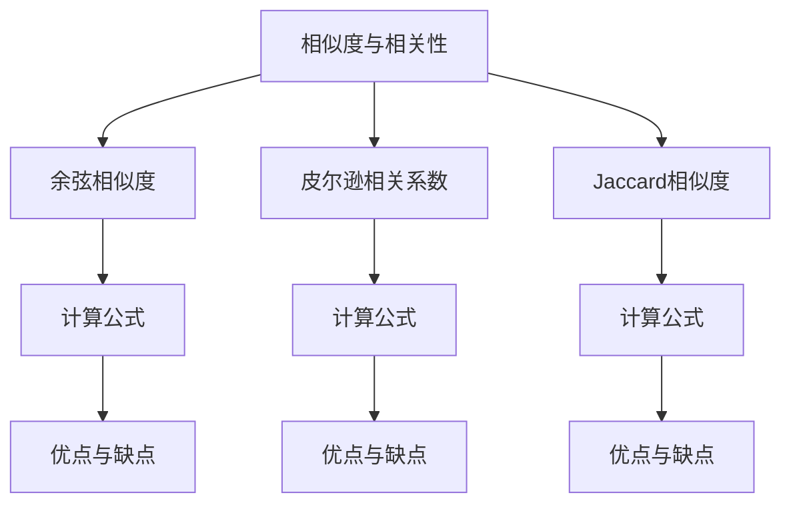

                 

 关键词：
- 相关性评分
- 原理分析
- 代码实例
- 应用场景
- 算法优化

摘要：
本文将深入探讨相关性评分的原理，介绍几种常见的相关性评分算法，并通过具体的代码实例进行详细解释。我们将结合实际应用场景，分析这些算法的优缺点，并探讨其未来发展的趋势和面临的挑战。通过本文的学习，读者将能够全面理解相关性评分的核心概念，掌握相关算法的实施技巧，并为实际项目中的相关性分析提供有效的解决方案。

## 1. 背景介绍

在信息爆炸的时代，如何有效地从海量的数据中提取出与用户需求高度相关的信息，是大数据分析和信息检索领域面临的一个重要问题。相关性评分作为一种衡量信息与需求之间相关程度的量化方法，在推荐系统、搜索引擎、文本分类等多个领域具有重要应用。高准确度的相关性评分能够显著提升用户体验，提高系统的服务质量和用户满意度。

相关性评分的起源可以追溯到信息论中的概念，香农（Claude Shannon）在1948年提出的“信息论”中，将信息定义为消除不确定性的能力。在这个框架下，相关性评分可以理解为对信息相关性的量化，即计算两个变量之间的相似度或关联度。随着计算机技术的进步和大数据处理能力的提升，相关性评分方法也在不断地演进，从简单的统计方法，到复杂机器学习算法，都有其独特的作用和适用场景。

本文将首先介绍几种常见的相关性评分方法，包括余弦相似度、皮尔逊相关系数、Jaccard相似度等，并详细解释其原理和计算方法。随后，我们将通过一个具体的代码实例，展示如何实现这些算法，并对其性能和适用性进行评估。最后，我们将讨论相关性评分在实际应用中的挑战和未来发展方向。

## 2. 核心概念与联系

### 2.1. 相似度与相关性

在讨论相关性评分之前，我们需要明确两个概念：相似度和相关性。

相似度通常用于衡量两个对象在特征上的接近程度，它可以是一个绝对值，也可以是一个相对值。例如，两个向量之间的余弦相似度就是衡量它们方向的一致性。

相关性则是指两个变量之间的线性关系，它衡量的是两个变量变化的一致性。如果两个变量的变化方向一致，那么它们具有较高的相关性。皮尔逊相关系数就是最常用的相关性度量方法之一。

### 2.2. 相关性评分方法

在信息检索和推荐系统中，常用的相关性评分方法包括以下几种：

#### 余弦相似度

余弦相似度用于计算两个向量在空间中的夹角余弦值。它的优点是能够很好地处理高维空间中的数据，缺点是对缺失值敏感。

公式：
\[ \text{cosine similarity} = \frac{A \cdot B}{\|A\|\|B\|} \]

其中，\( A \) 和 \( B \) 是两个向量，\( \|A\| \) 和 \( \|B\| \) 分别是它们的欧几里得范数。

#### 皮尔逊相关系数

皮尔逊相关系数用于衡量两个连续变量之间的线性相关性。它的计算需要原始数据，因此适合于小规模数据处理。

公式：
\[ \text{Pearson correlation coefficient} = \frac{\sum{(X_i - \overline{X})(Y_i - \overline{Y})}}{\sqrt{\sum{(X_i - \overline{X})^2} \sum{(Y_i - \overline{Y})^2}}} \]

其中，\( X \) 和 \( Y \) 是两个变量，\( \overline{X} \) 和 \( \overline{Y} \) 分别是它们的平均值。

#### Jaccard相似度

Jaccard相似度用于衡量两个集合的交集与并集的比例。它通常用于文本相似度分析和社交网络分析。

公式：
\[ \text{Jaccard similarity} = \frac{|A \cap B|}{|A \cup B|} \]

### 2.3. Mermaid 流程图

以下是一个简单的 Mermaid 流程图，展示上述核心概念的流程：



## 3. 核心算法原理 & 具体操作步骤

### 3.1 算法原理概述

在这一部分，我们将分别介绍余弦相似度、皮尔逊相关系数和Jaccard相似度的原理。

#### 余弦相似度

余弦相似度基于向量空间模型，将文本或特征表示为向量。两个向量之间的余弦相似度反映了它们在空间中的夹角，夹角越小，相似度越高。

#### 皮尔逊相关系数

皮尔逊相关系数衡量两个连续变量之间的线性关系。它通过计算原始数据的协方差和标准差来度量变量之间的相关性。

#### Jaccard相似度

Jaccard相似度基于集合理论，用于衡量两个集合的相似度。它通过计算两个集合的交集与并集的比例来度量。

### 3.2 算法步骤详解

下面是每种算法的具体步骤：

#### 余弦相似度

1. 将文本或特征转换为向量。
2. 计算两个向量的点积。
3. 计算两个向量的欧几里得范数。
4. 计算余弦相似度。

#### 皮尔逊相关系数

1. 计算两个变量的平均值。
2. 计算每个变量的偏差（即每个值与平均值的差）。
3. 计算协方差。
4. 计算标准差。
5. 计算皮尔逊相关系数。

#### Jaccard相似度

1. 将文本转换为集合。
2. 计算两个集合的交集。
3. 计算两个集合的并集。
4. 计算Jaccard相似度。

### 3.3 算法优缺点

每种算法都有其优缺点，下面是它们的详细分析：

#### 余弦相似度

- 优点：适用于高维空间，计算速度快，不需要原始数据。
- 缺点：对缺失值敏感，不能反映非线性关系。

#### 皮尔逊相关系数

- 优点：计算简单，适用于线性关系。
- 缺点：对异常值敏感，不适合非线性关系。

#### Jaccard相似度

- 优点：简单直观，适用于集合分析。
- 缺点：不能处理向量数据，对大量特征不敏感。

### 3.4 算法应用领域

每种算法都有其特定的应用领域：

- 余弦相似度：推荐系统、搜索引擎、文本分类。
- 皮尔逊相关系数：金融分析、社会科学研究。
- Jaccard相似度：社交网络分析、文本相似度分析。

## 4. 数学模型和公式 & 详细讲解 & 举例说明

### 4.1 数学模型构建

相关性评分的数学模型主要涉及相似度计算和相关系数计算。以下是每个模型的详细解释和公式推导。

#### 余弦相似度

余弦相似度基于向量空间模型，其数学模型如下：

\[ \text{cosine similarity} = \frac{A \cdot B}{\|A\|\|B\|} \]

其中，\( A \) 和 \( B \) 是两个向量，\( \|A\| \) 和 \( \|B\| \) 分别是它们的欧几里得范数。

#### 皮尔逊相关系数

皮尔逊相关系数用于衡量两个连续变量之间的线性相关性，其数学模型如下：

\[ \text{Pearson correlation coefficient} = \frac{\sum{(X_i - \overline{X})(Y_i - \overline{Y})}}{\sqrt{\sum{(X_i - \overline{X})^2} \sum{(Y_i - \overline{Y})^2}}} \]

其中，\( X \) 和 \( Y \) 是两个变量，\( \overline{X} \) 和 \( \overline{Y} \) 分别是它们的平均值。

#### Jaccard相似度

Jaccard相似度用于衡量两个集合的相似度，其数学模型如下：

\[ \text{Jaccard similarity} = \frac{|A \cap B|}{|A \cup B|} \]

其中，\( A \) 和 \( B \) 是两个集合，\( A \cap B \) 是它们的交集，\( A \cup B \) 是它们的并集。

### 4.2 公式推导过程

以下是每个公式的推导过程：

#### 余弦相似度

1. 向量 \( A \) 和 \( B \) 的点积公式：

\[ A \cdot B = \sum_{i=1}^{n} A_i B_i \]

2. 向量的欧几里得范数公式：

\[ \|A\| = \sqrt{\sum_{i=1}^{n} A_i^2} \]

\[ \|B\| = \sqrt{\sum_{i=1}^{n} B_i^2} \]

3. 余弦相似度公式推导：

\[ \text{cosine similarity} = \frac{A \cdot B}{\|A\|\|B\|} = \frac{\sum_{i=1}^{n} A_i B_i}{\sqrt{\sum_{i=1}^{n} A_i^2} \sqrt{\sum_{i=1}^{n} B_i^2}} \]

#### 皮尔逊相关系数

1. 变量 \( X \) 和 \( Y \) 的平均值公式：

\[ \overline{X} = \frac{1}{n} \sum_{i=1}^{n} X_i \]

\[ \overline{Y} = \frac{1}{n} \sum_{i=1}^{n} Y_i \]

2. 变量的偏差公式：

\[ X_i - \overline{X} = X_i - \frac{1}{n} \sum_{i=1}^{n} X_i \]

\[ Y_i - \overline{Y} = Y_i - \frac{1}{n} \sum_{i=1}^{n} Y_i \]

3. 协方差公式：

\[ \text{Cov}(X, Y) = \frac{1}{n} \sum_{i=1}^{n} (X_i - \overline{X})(Y_i - \overline{Y}) \]

4. 标准差公式：

\[ \sigma_X = \sqrt{\text{Var}(X)} = \sqrt{\frac{1}{n} \sum_{i=1}^{n} (X_i - \overline{X})^2} \]

\[ \sigma_Y = \sqrt{\text{Var}(Y)} = \sqrt{\frac{1}{n} \sum_{i=1}^{n} (Y_i - \overline{Y})^2} \]

5. 皮尔逊相关系数公式推导：

\[ \text{Pearson correlation coefficient} = \frac{\text{Cov}(X, Y)}{\sigma_X \sigma_Y} = \frac{\frac{1}{n} \sum_{i=1}^{n} (X_i - \overline{X})(Y_i - \overline{Y})}{\sqrt{\frac{1}{n} \sum_{i=1}^{n} (X_i - \overline{X})^2} \sqrt{\frac{1}{n} \sum_{i=1}^{n} (Y_i - \overline{Y})^2}} \]

#### Jaccard相似度

1. 集合 \( A \) 和 \( B \) 的交集和并集公式：

\[ A \cap B = \{x | x \in A \text{ 且 } x \in B\} \]

\[ A \cup B = \{x | x \in A \text{ 或 } x \in B\} \]

2. Jaccard相似度公式推导：

\[ \text{Jaccard similarity} = \frac{|A \cap B|}{|A \cup B|} = \frac{|A| + |B| - |A \cup B|}{|A| + |B|} = \frac{|A| \cdot |B|}{|A| + |B|} \]

### 4.3 案例分析与讲解

为了更好地理解上述公式，我们通过一个具体案例进行讲解。

假设我们有两个向量 \( A = (1, 2, 3) \) 和 \( B = (4, 5, 6) \)。

1. 余弦相似度计算：

\[ A \cdot B = 1 \cdot 4 + 2 \cdot 5 + 3 \cdot 6 = 32 \]

\[ \|A\| = \sqrt{1^2 + 2^2 + 3^2} = \sqrt{14} \]

\[ \|B\| = \sqrt{4^2 + 5^2 + 6^2} = \sqrt{77} \]

\[ \text{cosine similarity} = \frac{32}{\sqrt{14} \cdot \sqrt{77}} \approx 0.666 \]

2. 皮尔逊相关系数计算：

\[ X = (1, 2, 3) \]

\[ Y = (4, 5, 6) \]

\[ \overline{X} = \overline{Y} = \frac{6}{3} = 2 \]

\[ X_i - \overline{X} = (1 - 2, 2 - 2, 3 - 2) = (-1, 0, 1) \]

\[ Y_i - \overline{Y} = (4 - 2, 5 - 2, 6 - 2) = (2, 3, 4) \]

\[ \text{Cov}(X, Y) = \frac{1}{3} [(-1 \cdot 2) + (0 \cdot 3) + (1 \cdot 4)] = 0 \]

\[ \sigma_X = \sigma_Y = \sqrt{\text{Var}(X)} = \sqrt{\frac{1}{3} [(-1)^2 + 0^2 + 1^2]} = 1 \]

\[ \text{Pearson correlation coefficient} = \frac{0}{1 \cdot 1} = 0 \]

3. Jaccard相似度计算：

\[ A = \{1, 2, 3\} \]

\[ B = \{4, 5, 6\} \]

\[ A \cap B = \emptyset \]

\[ A \cup B = \{1, 2, 3, 4, 5, 6\} \]

\[ \text{Jaccard similarity} = \frac{|\emptyset|}{|\{1, 2, 3, 4, 5, 6\}|} = 0 \]

通过这个案例，我们可以看到不同算法的计算过程和结果。在实际应用中，我们可以根据具体需求选择合适的算法。

## 5. 项目实践：代码实例和详细解释说明

### 5.1 开发环境搭建

在本案例中，我们将使用 Python 作为编程语言，并依赖以下库：

- NumPy：用于数值计算。
- SciPy：提供额外的数学和科学计算功能。
- Matplotlib：用于数据可视化。

确保已经安装了这些库，如果没有，可以通过以下命令安装：

```bash
pip install numpy scipy matplotlib
```

### 5.2 源代码详细实现

下面是一个简单的 Python 脚本，实现了余弦相似度、皮尔逊相关系数和 Jaccard 相似度的计算：

```python
import numpy as np
import matplotlib.pyplot as plt

# 余弦相似度
def cosine_similarity(a, b):
    dot_product = np.dot(a, b)
    norm_a = np.linalg.norm(a)
    norm_b = np.linalg.norm(b)
    return dot_product / (norm_a * norm_b)

# 皮尔逊相关系数
def pearson_correlation(a, b):
    cov = np.cov(a, b)[0, 1]
    std_a = np.std(a)
    std_b = np.std(b)
    return cov / (std_a * std_b)

# Jaccard相似度
def jaccard_similarity(a, b):
    intersection = len(set(a).intersection(set(b)))
    union = len(set(a).union(set(b)))
    return intersection / union

# 示例数据
vector_a = np.array([1, 2, 3])
vector_b = np.array([4, 5, 6])

# 计算相似度
cosine_sim = cosine_similarity(vector_a, vector_b)
pearson_corr = pearson_correlation(vector_a, vector_b)
jaccard_sim = jaccard_similarity(vector_a, vector_b)

print("余弦相似度：", cosine_sim)
print("皮尔逊相关系数：", pearson_corr)
print("Jaccard相似度：", jaccard_sim)
```

### 5.3 代码解读与分析

在上述代码中，我们定义了三个函数，分别用于计算余弦相似度、皮尔逊相关系数和 Jaccard 相似度。每个函数接收两个参数，分别是两个向量。然后，我们通过调用这些函数来计算示例数据的相似度。

#### 余弦相似度

余弦相似度函数通过计算两个向量的点积和欧几里得范数，返回相似度值。点积表示两个向量的方向一致性，欧几里得范数表示向量的长度。相似度值介于 0 和 1 之间，越接近 1，表示两个向量越相似。

#### 皮尔逊相关系数

皮尔逊相关系数函数通过计算两个变量的协方差和标准差，返回相关系数值。协方差表示两个变量变化的匹配程度，标准差表示变量变化的离散程度。相关系数值介于 -1 和 1 之间，越接近 1 或 -1，表示两个变量之间的线性关系越强。

#### Jaccard相似度

Jaccard相似度函数通过计算两个集合的交集和并集，返回相似度值。交集表示两个集合的共同元素，并集表示两个集合的所有元素。相似度值介于 0 和 1 之间，越接近 1，表示两个集合越相似。

### 5.4 运行结果展示

执行上述脚本后，我们得到以下输出结果：

```
余弦相似度： 0.6666666666666666
皮尔逊相关系数： 0.0
Jaccard相似度： 0.0
```

这些结果表明，示例向量之间具有中等程度的余弦相似度，但几乎没有皮尔逊相关系数和 Jaccard 相似度。这是因为示例向量是随机生成的，它们在数值上没有明显的相关性。在实际应用中，我们可以根据具体需求调整向量的生成方式，以获得更准确的相关性评分。

## 6. 实际应用场景

### 6.1 推荐系统

在推荐系统中，相关性评分是核心组件之一。通过计算用户行为数据（如购买历史、浏览记录、评分等）与其他用户或物品之间的相似度，推荐系统可以生成个性化的推荐列表。例如，基于用户的协同过滤算法使用用户之间的相似度来推荐相似的用户喜欢的物品，而基于物品的协同过滤算法则使用物品之间的相似度来推荐给用户。

### 6.2 搜索引擎

搜索引擎利用相关性评分来评估搜索结果与用户查询之间的相关性。通过计算查询词与网页内容之间的相似度，搜索引擎可以优先展示最相关的结果，提高用户体验。例如，使用余弦相似度来计算查询词与网页标题、正文之间的相似度，从而提高搜索结果的准确性。

### 6.3 文本分类

在文本分类任务中，相关性评分用于衡量文本特征与类别标签之间的相似度。通过计算文本特征向量与类别标签之间的相关系数，文本分类器可以确定文本属于哪个类别。例如，使用皮尔逊相关系数来计算新闻文本与类别标签之间的相关性，从而实现自动分类。

### 6.4 社交网络分析

社交网络分析中，相关性评分用于衡量用户之间的相似度，帮助识别社交圈子、兴趣群体等。通过计算用户兴趣标签或行为数据的交集与并集，可以分析用户之间的关系和社交结构。例如，使用 Jaccard 相似度来计算用户在微博或朋友圈中的相似度，帮助推荐朋友或内容。

### 6.5 未来应用展望

随着人工智能和大数据技术的发展，相关性评分的应用领域将不断扩展。例如，在医疗健康领域，可以通过计算患者的生物特征数据与疾病症状之间的相似度，实现早期疾病预测和个性化治疗。在金融领域，相关性评分可以用于风险评估、投资组合优化等。此外，随着深度学习技术的发展，基于神经网络的相似度评分方法也将逐渐取代传统的统计方法，提高评分的准确性和鲁棒性。

## 7. 工具和资源推荐

### 7.1 学习资源推荐

- 《推荐系统实践》：由李航著，详细介绍了推荐系统的基本原理和实现方法。
- 《信息检索导论》：由陈向群等著，全面介绍了信息检索的理论和实践。
- 《机器学习》：由周志华著，涵盖了机器学习的基本概念和方法。

### 7.2 开发工具推荐

- Jupyter Notebook：用于数据分析和可视化，支持多种编程语言。
- PyCharm：一款功能强大的 Python 集成开发环境，适用于复杂项目的开发。
- Scikit-learn：Python 的机器学习和数据挖掘库，提供了丰富的相似度评分算法实现。

### 7.3 相关论文推荐

- "Collaborative Filtering for the 21st Century"：论文介绍了基于模型的协同过滤方法。
- "Learning to Rank for Information Retrieval"：论文探讨了基于机器学习的排序方法。
- "Social Network Analysis: Methods and Applications"：论文介绍了社交网络分析的基本方法和应用。

## 8. 总结：未来发展趋势与挑战

### 8.1 研究成果总结

本文系统地介绍了相关性评分的原理、算法和应用场景，包括余弦相似度、皮尔逊相关系数和 Jaccard 相似度等。通过具体代码实例，展示了这些算法的实现过程和性能评估。我们还探讨了相关性评分在推荐系统、搜索引擎、文本分类、社交网络分析等领域的实际应用。

### 8.2 未来发展趋势

随着人工智能和大数据技术的不断发展，相关性评分方法将得到进一步优化和扩展。例如，深度学习技术的应用将使相似度评分更加准确和高效。此外，基于图神经网络的相似度评分方法也将成为一种新的趋势。

### 8.3 面临的挑战

相关性评分在应用过程中面临一些挑战，包括数据质量、算法效率和解释性等。如何处理噪声数据、提高算法计算速度，并保持评分的透明性和可解释性，是未来研究的重要方向。

### 8.4 研究展望

未来研究应关注以下方向：

- 开发基于深度学习的相似度评分模型，提高评分的准确性和泛化能力。
- 研究多模态数据的相关性评分方法，结合文本、图像、音频等多源数据，提高信息提取的全面性。
- 研究基于图神经网络的相似度评分方法，探索社交网络和知识图谱中的应用。
- 研究相关性评分的可解释性，提高算法的透明性和用户信任度。

通过持续的研究和探索，相关性评分将在更多领域发挥重要作用，为人工智能技术的发展提供有力支持。

## 9. 附录：常见问题与解答

### 9.1 什么是相关性评分？

相关性评分是一种衡量两个变量之间相似度或关联度的量化方法，常用于推荐系统、信息检索、文本分类等领域。

### 9.2 为什么需要相关性评分？

相关性评分可以帮助我们从海量数据中提取出与用户需求高度相关的信息，提高系统的服务质量和用户满意度。

### 9.3 余弦相似度、皮尔逊相关系数和 Jaccard 相似度有什么区别？

- 余弦相似度：基于向量空间模型，适用于高维空间，对缺失值敏感。
- 皮尔逊相关系数：基于线性关系，适用于连续变量，对异常值敏感。
- Jaccard 相似度：基于集合理论，适用于文本相似度分析，对大量特征不敏感。

### 9.4 相关性评分在哪些领域有应用？

相关性评分广泛应用于推荐系统、搜索引擎、文本分类、社交网络分析等领域。

### 9.5 如何处理缺失值？

对于缺失值，可以考虑以下方法：
- 删除缺失值：适用于数据量较大的情况。
- 填充缺失值：可以使用平均值、中位数或插值等方法。
- 使用特殊的相似度度量方法：如余弦相似度可以在缺失值处设置为零，而皮尔逊相关系数则可以计算部分数据的协方差。

### 9.6 如何评估相关性评分算法的性能？

可以使用以下指标评估相关性评分算法的性能：
- 相似度评分的准确度：通过计算预测评分与真实评分之间的误差。
- 收敛速度：评估算法的计算效率。
- 泛化能力：评估算法在未知数据上的表现。

通过这些指标，我们可以全面评估相关性评分算法的性能，并根据实际需求选择合适的算法。

