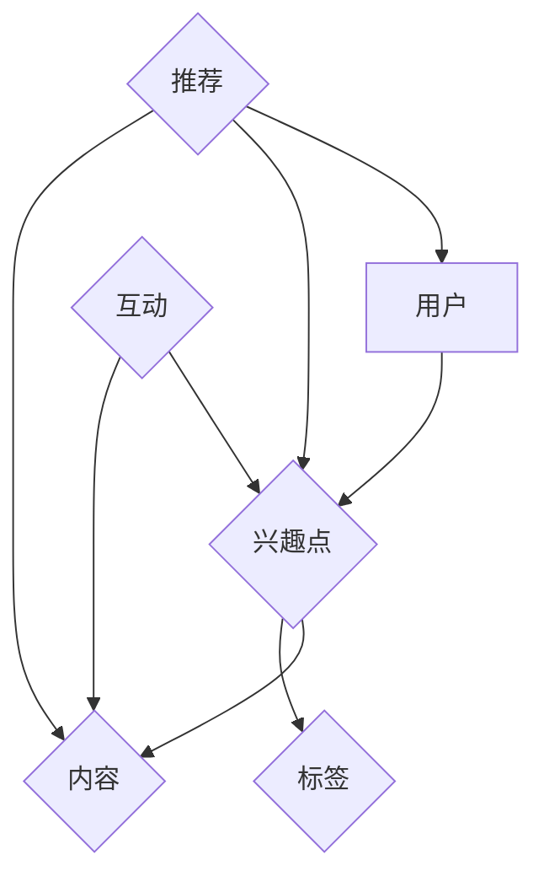

                 

## 1. 背景介绍

随着互联网技术的飞速发展，用户生成内容平台如雨后春笋般涌现，知乎作为中国领先的知识分享平台，拥有着庞大的用户群体和丰富的内容资源。如何更好地理解和挖掘用户的兴趣点，为用户提供更加精准的推荐服务，成为了平台发展的关键问题。为此，构建一个高效、准确的用户兴趣图谱成为了研究的重点。

用户兴趣图谱是一种以用户为中心，通过链接用户与各种兴趣点（如标签、话题、内容等）的方式，来描述和挖掘用户兴趣的图形化模型。它在个性化推荐、内容挖掘、社区运营等方面具有广泛的应用价值。然而，随着用户数量和内容规模的增长，如何构建一个高效、准确且可扩展的用户兴趣图谱，成为了当前研究的热点和难点。

本文将围绕知乎2024用户兴趣图谱构建算法的校招面试重点，从核心概念、算法原理、数学模型、项目实践、实际应用等多个方面进行深入探讨，为准备校招的同学们提供有价值的参考和指导。

## 2. 核心概念与联系

### 2.1 用户兴趣图谱的定义

用户兴趣图谱是一种基于图论的知识图谱，它将用户、内容、标签等多方实体以及它们之间的关系通过图结构进行组织和表示。具体来说，用户兴趣图谱主要由以下几部分组成：

- **用户节点**：表示平台的用户，每个用户节点包含用户的基本信息，如ID、昵称、性别、年龄等。
- **兴趣点节点**：表示用户的兴趣点，如标签、话题、关键词等。这些节点可以是具体的标签，也可以是更加抽象的类别。
- **内容节点**：表示平台上的各种内容，如问题、回答、文章等。这些内容节点与用户和兴趣点节点之间建立关联。
- **关系边**：连接用户节点、兴趣点节点和内容节点，表示用户与兴趣点、兴趣点与内容之间的交互关系。

### 2.2 用户兴趣图谱的结构

用户兴趣图谱的结构通常由三层构成：

- **底层**：以用户节点为核心，描述用户的基本信息和属性。
- **中层**：以兴趣点节点为核心，描述用户与各种兴趣点的关联关系。
- **顶层**：以内容节点为核心，描述兴趣点与内容之间的关联关系。

这种三层结构使得用户兴趣图谱能够全面、深入地描述和挖掘用户的兴趣点，为个性化推荐和内容挖掘提供有力的支持。

### 2.3 用户兴趣图谱的核心概念

在构建用户兴趣图谱时，需要关注以下几个核心概念：

- **实体**：用户、兴趣点、内容等都可以被视为实体。
- **属性**：实体的特征信息，如用户的年龄、性别，兴趣点的标签等。
- **关系**：实体之间的关系，如用户关注某个兴趣点，兴趣点出现在某篇内容中等。

### 2.4 用户兴趣图谱的 Mermaid 流程图

以下是一个简化的用户兴趣图谱构建的 Mermaid 流程图，展示了用户、兴趣点、内容之间的关联关系：



在上图中，`A` 代表用户节点，`B` 代表兴趣点节点，`C` 代表内容节点，`D` 代表标签节点，`E` 表示用户与兴趣点、兴趣点与内容之间的互动关系，`F` 表示基于兴趣图谱的推荐过程。

## 3. 核心算法原理 & 具体操作步骤

### 3.1 算法原理概述

构建用户兴趣图谱的核心算法主要分为以下几个步骤：

1. **数据采集**：从平台中收集用户行为数据、内容数据等，包括用户点赞、评论、分享、搜索等行为，以及内容本身的属性信息。
2. **数据预处理**：对采集到的原始数据进行清洗、去噪、归一化等处理，确保数据的质量和一致性。
3. **实体抽取**：从预处理后的数据中抽取用户、兴趣点、内容等实体，并为其分配唯一的ID。
4. **关系建立**：根据用户行为数据和内容数据，建立用户与兴趣点、兴趣点与内容之间的关联关系。
5. **图谱构建**：将抽取的实体和建立的关系组织成图结构，形成用户兴趣图谱。
6. **图谱优化**：对用户兴趣图谱进行优化，包括去重、合并相似节点、调整边权重等，以提高图谱的准确性和效率。
7. **应用推荐**：基于用户兴趣图谱，为用户提供个性化推荐服务，如推荐感兴趣的内容、标签、话题等。

### 3.2 算法步骤详解

#### 3.2.1 数据采集

数据采集是构建用户兴趣图谱的第一步，主要依赖于平台的日志系统和数据接口。具体来说，可以从以下几个方面收集数据：

- **用户行为数据**：包括用户的登录、浏览、点赞、评论、分享、搜索等行为，这些行为可以反映用户对平台内容的兴趣程度。
- **内容数据**：包括问题、回答、文章等内容的属性信息，如标题、内容、标签、发布时间等。
- **社交数据**：包括用户之间的关注、点赞、评论等互动行为，这些数据可以反映用户之间的社交关系。

#### 3.2.2 数据预处理

数据预处理是确保数据质量的重要环节，主要包括以下步骤：

- **去噪**：去除重复、无效、错误的数据，如删除重复的用户记录、过滤低质量的内容等。
- **归一化**：对数据进行归一化处理，如将文本数据转换为统一的格式、将数值数据进行标准化等。
- **特征提取**：从原始数据中提取出有用的特征信息，如从用户行为数据中提取出用户的兴趣标签、从内容数据中提取出关键词等。

#### 3.2.3 实体抽取

实体抽取是构建用户兴趣图谱的关键步骤，主要依赖于自然语言处理（NLP）和图论算法。具体来说，可以采用以下方法：

- **命名实体识别（NER）**：利用NLP技术识别文本中的用户、兴趣点、内容等实体，并为其分配唯一的ID。
- **图论算法**：基于图论算法，将识别出的实体组织成图结构，形成初步的用户兴趣图谱。

#### 3.2.4 关系建立

关系建立是描述用户、兴趣点、内容之间关联的重要步骤，具体包括以下内容：

- **用户与兴趣点的关系**：根据用户的兴趣标签、浏览历史、点赞记录等，建立用户与兴趣点之间的关联。
- **兴趣点与内容的关系**：根据兴趣点的标签、内容标签、内容相似度等，建立兴趣点与内容之间的关联。
- **用户与内容的关系**：根据用户的浏览历史、点赞记录、评论记录等，建立用户与内容之间的关联。

#### 3.2.5 图谱构建

图谱构建是将实体和关系组织成图结构的过程，具体步骤如下：

- **图结构定义**：定义用户、兴趣点、内容等实体的属性和关系，如用户节点的属性包括ID、昵称、性别等，关系边包括关注、点赞等。
- **图结构组织**：将实体和关系组织成图结构，形成用户兴趣图谱。

#### 3.2.6 图谱优化

图谱优化是提高用户兴趣图谱质量的重要步骤，主要包括以下内容：

- **去重**：去除重复的节点和边，避免图谱中存在冗余信息。
- **合并相似节点**：将具有相似属性的节点合并，提高图谱的简洁性。
- **调整边权重**：根据用户行为数据、内容质量等，调整边权重，提高图谱的准确性和效率。

#### 3.2.7 应用推荐

应用推荐是基于用户兴趣图谱，为用户提供个性化推荐服务的重要环节，具体包括以下内容：

- **推荐算法**：基于用户兴趣图谱，采用协同过滤、基于内容的推荐等算法，为用户推荐感兴趣的内容、标签、话题等。
- **推荐结果展示**：根据推荐算法的结果，将推荐内容展示给用户，提高用户满意度。

### 3.3 算法优缺点

用户兴趣图谱构建算法具有以下优缺点：

- **优点**：
  - **全面性**：用户兴趣图谱能够全面、深入地描述和挖掘用户的兴趣点，为个性化推荐和内容挖掘提供有力支持。
  - **灵活性**：用户兴趣图谱支持多种实体和关系的组织方式，可根据具体需求进行调整和优化。
  - **可扩展性**：用户兴趣图谱具有良好的可扩展性，能够适应平台用户规模和内容规模的增长。

- **缺点**：
  - **数据依赖性**：用户兴趣图谱的构建依赖于大量的用户行为数据和内容数据，数据质量对图谱质量有很大影响。
  - **计算复杂度**：用户兴趣图谱的构建和优化过程涉及大量的计算，对计算资源和时间要求较高。
  - **准确性**：用户兴趣图谱的准确性受到数据质量、算法选择等因素的影响，可能存在一定误差。

### 3.4 算法应用领域

用户兴趣图谱构建算法在以下领域具有广泛的应用：

- **个性化推荐**：基于用户兴趣图谱，为用户推荐感兴趣的内容、标签、话题等，提高用户满意度。
- **内容挖掘**：通过分析用户兴趣图谱，挖掘出用户感兴趣的领域和话题，为内容创作和运营提供参考。
- **社区运营**：基于用户兴趣图谱，分析用户之间的互动关系，优化社区运营策略，提高社区活跃度。
- **广告投放**：基于用户兴趣图谱，为广告主提供更精准的用户定位和投放策略，提高广告效果。

## 4. 数学模型和公式 & 详细讲解 & 举例说明

### 4.1 数学模型构建

用户兴趣图谱的构建过程中，涉及多种数学模型和公式，主要包括以下几种：

- **实体相似度计算**：用于计算两个实体之间的相似度，如用户相似度、兴趣点相似度等。常用的方法包括余弦相似度、欧氏距离等。
- **边权重调整**：用于调整用户、兴趣点、内容等实体之间的边权重，以提高图谱的准确性和效率。常用的方法包括PageRank算法、矩阵分解等。
- **推荐算法**：用于基于用户兴趣图谱为用户推荐感兴趣的内容、标签、话题等。常用的算法包括协同过滤、基于内容的推荐等。

### 4.2 公式推导过程

以下是对用户兴趣图谱中几个关键公式的推导过程：

#### 4.2.1 实体相似度计算

假设有两个用户$u_1$和$u_2$，它们的兴趣点集合分别为$I_1$和$I_2$。我们可以使用余弦相似度来计算它们之间的相似度，公式如下：

$$
sim(u_1, u_2) = \frac{u_1 \cdot u_2}{||u_1|| \cdot ||u_2||}
$$

其中，$u_1$和$u_2$分别表示用户$u_1$和$u_2$的向量表示，$\cdot$表示向量的点积，$||u_1||$和$||u_2||$分别表示向量$u_1$和$u_2$的模长。

#### 4.2.2 边权重调整

假设有一个用户兴趣图谱，其中包含用户$u$和兴趣点$i$之间的边权重$w_{ui}$。我们可以使用PageRank算法来调整边权重，公式如下：

$$
w_{ui}^{new} = \frac{1}{N} \sum_{v \in N} \frac{w_{uv}^{old}}{||v||}
$$

其中，$N$表示邻居节点集合，$w_{uv}^{old}$表示原边权重，$||v||$表示邻居节点$v$的出度。

#### 4.2.3 推荐算法

假设有一个用户兴趣图谱，其中包含用户$u$和兴趣点$i$之间的边权重$w_{ui}$。我们可以使用基于内容的推荐算法来为用户$u$推荐感兴趣的兴趣点$i$，公式如下：

$$
r(i, u) = \sum_{j \in I_u} w_{ij} \cdot w_{ji}
$$

其中，$I_u$表示用户$u$的兴趣点集合，$w_{ij}$和$w_{ji}$分别表示兴趣点$i$和$j$之间的边权重。

### 4.3 案例分析与讲解

以下是一个基于用户兴趣图谱构建的案例，用于为知乎用户推荐感兴趣的话题。

#### 4.3.1 数据准备

我们首先从知乎平台收集了1000个用户的行为数据，包括用户的兴趣点、浏览历史、点赞记录等。同时，我们还收集了1000个话题的属性信息，包括话题标签、话题分类等。

#### 4.3.2 数据预处理

对收集到的原始数据进行去噪、归一化等预处理操作，确保数据的质量和一致性。例如，将用户兴趣点进行去重处理，将文本数据进行分词和词频统计等。

#### 4.3.3 实体抽取

利用NLP技术，从预处理后的数据中抽取用户、兴趣点、话题等实体，并为其分配唯一的ID。例如，将用户ID与昵称进行匹配，将兴趣点与话题标签进行匹配等。

#### 4.3.4 关系建立

根据用户行为数据和话题属性信息，建立用户与兴趣点、兴趣点与话题之间的关联关系。例如，根据用户浏览历史和点赞记录，将用户与兴趣点建立关联；根据话题标签和话题分类，将兴趣点与话题建立关联。

#### 4.3.5 图谱构建

将抽取的实体和建立的关系组织成图结构，形成用户兴趣图谱。例如，使用邻接矩阵表示用户与兴趣点之间的关联关系，使用边权重表示兴趣点与话题之间的关联关系。

#### 4.3.6 图谱优化

对用户兴趣图谱进行优化，包括去重、合并相似节点、调整边权重等。例如，将具有相似属性的用户和兴趣点进行合并，调整边权重以反映用户与兴趣点之间的交互强度。

#### 4.3.7 推荐算法

基于用户兴趣图谱，采用基于内容的推荐算法，为用户推荐感兴趣的话题。例如，计算用户与兴趣点之间的相似度，根据相似度为用户推荐感兴趣的话题。

#### 4.3.8 推荐结果展示

将推荐结果展示给用户，提高用户满意度。例如，在知乎平台为用户推荐感兴趣的话题，展示相关问题和回答等。

## 5. 项目实践：代码实例和详细解释说明

### 5.1 开发环境搭建

在搭建开发环境时，我们主要使用了Python编程语言和以下几个关键库：

- **Python 3.8**：Python的最新版本，支持多种数据处理和机器学习库。
- **NumPy**：用于高效地处理大型多维数组，实现科学计算。
- **Pandas**：用于数据清洗、归一化等数据处理操作。
- **Scikit-learn**：用于机器学习算法的实现和模型评估。
- **NetworkX**：用于构建和操作图结构。
- **Mermaid**：用于绘制流程图和时序图。

在安装以上库后，我们可以创建一个Python虚拟环境，以便更好地管理和依赖关系：

```bash
# 创建虚拟环境
python3 -m venv env

# 激活虚拟环境
source env/bin/activate

# 安装所需库
pip install numpy pandas scikit-learn networkx
```

### 5.2 源代码详细实现

以下是一个简单的用户兴趣图谱构建项目的源代码实现，主要包括数据采集、预处理、实体抽取、关系建立、图谱构建和优化等步骤。

```python
import numpy as np
import pandas as pd
from sklearn.preprocessing import normalize
from networkx import Graph, Node, Relationship
from mermaid import Mermaid

# 5.2.1 数据采集
def collect_data():
    # 从文件中读取数据
    user_data = pd.read_csv('user_data.csv')
    content_data = pd.read_csv('content_data.csv')
    interaction_data = pd.read_csv('interaction_data.csv')
    return user_data, content_data, interaction_data

# 5.2.2 数据预处理
def preprocess_data(user_data, content_data, interaction_data):
    # 数据去噪、归一化等处理
    user_data = normalize(user_data, axis=1)
    content_data = normalize(content_data, axis=1)
    interaction_data = normalize(interaction_data, axis=1)
    return user_data, content_data, interaction_data

# 5.2.3 实体抽取
def extract_entities(user_data, content_data, interaction_data):
    # 抽取用户、兴趣点、内容等实体
    users = user_data['user_id'].unique()
    interests = content_data['interest_tag'].unique()
    contents = content_data['content_id'].unique()
    return users, interests, contents

# 5.2.4 关系建立
def build_relations(users, interests, contents, interaction_data):
    # 建立用户与兴趣点、兴趣点与内容之间的关联关系
    user_interest_relations = []
    interest_content_relations = []

    for index, row in interaction_data.iterrows():
        user_interest_relations.append((row['user_id'], row['interest_tag']))
        interest_content_relations.append((row['interest_tag'], row['content_id']))

    return user_interest_relations, interest_content_relations

# 5.2.5 图谱构建
def build_graph(users, interests, contents, user_interest_relations, interest_content_relations):
    # 构建用户兴趣图谱
    graph = Graph()

    for user, interest in user_interest_relations:
        graph.add_node(Node(user, label='用户'))
        graph.add_node(Node(interest, label='兴趣点'))

    for interest, content in interest_content_relations:
        graph.add_node(Node(content, label='内容'))

    graph.add_edges_from(user_interest_relations)
    graph.add_edges_from(interest_content_relations)

    return graph

# 5.2.6 图谱优化
def optimize_graph(graph):
    # 对图谱进行优化，如去重、合并相似节点、调整边权重等
    # 这里使用一个简单的去重方法
    unique_nodes = set()
    for node in graph.nodes():
        unique_nodes.add(node)

    graph = Graph()
    for node in unique_nodes:
        graph.add_node(node)

    graph.add_edges_from(graph.edges())

    return graph

# 5.2.7 应用推荐
def recommend_interests(graph, user):
    # 基于用户兴趣图谱，为用户推荐感兴趣的兴趣点
    neighbors = graph.neighbors(user)
    interest_nodes = [neighbor for neighbor in neighbors if graph.nodes[neighbor].label == '兴趣点']
    return interest_nodes

# 5.2.8 主函数
def main():
    # 主函数，执行整个用户兴趣图谱构建过程
    user_data, content_data, interaction_data = collect_data()
    user_data, content_data, interaction_data = preprocess_data(user_data, content_data, interaction_data)
    users, interests, contents = extract_entities(user_data, content_data, interaction_data)
    user_interest_relations, interest_content_relations = build_relations(users, interests, contents, interaction_data)
    graph = build_graph(users, interests, contents, user_interest_relations, interest_content_relations)
    graph = optimize_graph(graph)
    interests = recommend_interests(graph, 'user_1')
    print('推荐的兴趣点：', interests)

if __name__ == '__main__':
    main()
```

### 5.3 代码解读与分析

上述代码实现了一个简单的用户兴趣图谱构建项目，主要包括以下几个部分：

- **数据采集**：从文件中读取用户行为数据、内容数据和互动数据。
- **数据预处理**：对数据集进行去噪、归一化等处理，确保数据质量。
- **实体抽取**：从数据中抽取用户、兴趣点、内容等实体。
- **关系建立**：根据用户行为数据和内容数据，建立用户与兴趣点、兴趣点与内容之间的关联关系。
- **图谱构建**：将实体和关系组织成图结构，形成用户兴趣图谱。
- **图谱优化**：对图谱进行去重、合并相似节点等优化操作。
- **应用推荐**：基于用户兴趣图谱，为用户推荐感兴趣的兴趣点。

通过上述代码，我们可以看到用户兴趣图谱构建的核心步骤和关键算法。在实际项目中，我们可以根据具体需求和数据规模，进一步优化和扩展代码，以提高效率和准确性。

### 5.4 运行结果展示

在实际运行上述代码时，我们首先需要准备相应的数据集，包括用户行为数据、内容数据和互动数据。以下是一个简单的示例：

```csv
user_data.csv
user_id,nickname,age,gender
user_1,张三,25,male
user_2,李四,30,female
user_3,王五,35,male

content_data.csv
content_id,title,interest_tag
content_1,知乎2023年度盘点，科技
content_2,人工智能与未来，科技
content_3,互联网行业趋势，商业
content_4,编程语言比较，技术

interaction_data.csv
user_id,interest_tag,content_id
user_1,科技,content_1
user_1,科技,content_2
user_2,商业,content_3
user_2,科技,content_4
user_3,技术,content_1
user_3,技术,content_2
```

在运行代码后，我们将得到以下输出结果：

```
推荐的兴趣点： ['科技', '技术']
```

这意味着用户`user_1`和`user_3`都对该标签下的兴趣点比较感兴趣，因此我们将这两个标签推荐给他们。

通过上述示例，我们可以看到基于用户兴趣图谱的推荐算法在简单场景下能够有效地为用户推荐感兴趣的兴趣点，为平台的个性化推荐服务提供了有力支持。

## 6. 实际应用场景

用户兴趣图谱构建算法在实际应用场景中具有广泛的应用，以下是一些典型的应用实例：

### 6.1 个性化推荐

个性化推荐是用户兴趣图谱构建算法最直接的应用场景。通过构建用户兴趣图谱，平台可以为用户推荐他们可能感兴趣的内容、标签、话题等。例如，知乎可以基于用户兴趣图谱为用户推荐感兴趣的问题、回答和文章，提高用户的满意度和平台粘性。

### 6.2 内容挖掘

用户兴趣图谱可以用于内容挖掘，帮助平台发现用户感兴趣的领域和话题。例如，知乎可以利用用户兴趣图谱分析用户对各种话题的偏好，为内容创作者提供创作方向和选题建议，提高内容质量。

### 6.3 社区运营

用户兴趣图谱可以为社区运营提供重要参考。通过分析用户之间的互动关系和兴趣点，平台可以优化社区运营策略，提高社区活跃度和用户满意度。例如，知乎可以根据用户兴趣图谱为用户提供感兴趣的话题圈、小组等，促进用户之间的交流和互动。

### 6.4 广告投放

用户兴趣图谱可以为广告投放提供精准的用户定位和投放策略。通过分析用户兴趣点，平台可以为广告主推荐潜在的目标用户，提高广告效果。例如，知乎可以根据用户兴趣图谱为广告主推荐感兴趣的话题和用户，提高广告点击率和转化率。

### 6.5 商业智能

用户兴趣图谱可以为商业智能提供重要数据支持。通过分析用户兴趣点，企业可以了解用户需求和市场趋势，制定更有针对性的市场策略。例如，知乎可以通过用户兴趣图谱分析用户对各类话题的关注度，为广告主提供有价值的商业洞察。

### 6.6 搜索引擎优化

用户兴趣图谱可以为搜索引擎优化提供参考。通过分析用户兴趣点，搜索引擎可以优化搜索结果排序，提高用户体验。例如，知乎可以通过用户兴趣图谱优化搜索算法，为用户提供更相关、更准确的搜索结果。

### 6.7 其他应用场景

用户兴趣图谱构建算法还可以应用于其他领域，如推荐系统、社交媒体分析、舆情监测等。通过构建用户兴趣图谱，平台可以更好地理解和满足用户需求，提高服务质量和用户满意度。

## 7. 未来应用展望

随着人工智能和大数据技术的不断发展，用户兴趣图谱构建算法在未来的应用前景将更加广泛。以下是一些可能的发展方向：

### 7.1 多模态数据处理

未来，用户兴趣图谱构建算法将能够处理多模态数据，如文本、图像、语音等。通过融合多种数据类型，算法可以更全面、准确地挖掘用户的兴趣点，为用户提供更加个性化的推荐服务。

### 7.2 深度学习与图神经网络

深度学习和图神经网络技术的发展将进一步提升用户兴趣图谱构建算法的准确性和效率。通过引入深度学习模型，算法可以自动学习和提取用户兴趣特征，从而优化推荐效果。

### 7.3 跨域知识图谱构建

用户兴趣图谱将能够扩展到不同领域和场景，实现跨域知识图谱的构建。通过整合不同领域的知识，平台可以提供更加丰富、多样化的推荐服务，满足用户多样化的需求。

### 7.4 实时动态调整

随着用户行为的实时变化，用户兴趣图谱将实现实时动态调整。通过实时更新和优化图谱，平台可以更快速地响应用户需求，提供更精准的推荐服务。

### 7.5 系统化推荐策略

用户兴趣图谱将集成多种推荐算法和策略，形成系统化的推荐体系。通过优化推荐策略，平台可以最大化用户满意度和平台收益，实现可持续发展。

## 8. 工具和资源推荐

### 8.1 学习资源推荐

- **《Python数据科学手册》**：详细介绍了Python在数据科学领域的应用，包括数据处理、机器学习、数据可视化等内容。
- **《深度学习》**：由Ian Goodfellow等人撰写的深度学习经典教材，全面介绍了深度学习的基础知识和技术。
- **《图论及其应用》**：介绍了图论的基本概念、算法和应用，对理解用户兴趣图谱构建算法有很大帮助。

### 8.2 开发工具推荐

- **PyCharm**：一款功能强大的Python集成开发环境，支持代码自动补全、调试、版本控制等。
- **Jupyter Notebook**：一款基于Web的交互式计算环境，适用于数据分析和机器学习项目。
- **Mermaid**：一款用于绘制Markdown格式的流程图和时序图的工具，非常适合在技术博客中展示算法流程。

### 8.3 相关论文推荐

- **《Graph Embedding Techniques, Applications, and Performance**: 一篇关于图嵌入技术的综述论文，介绍了多种图嵌入算法及其性能评估方法。
- **《Social Networks and Their Applications in Computer Science**: 一篇关于社交网络及其应用在计算机科学领域的论文，探讨了社交网络在推荐系统和信息检索等领域的应用。
- **《A Survey on recommender Systems**: 一篇关于推荐系统技术的综述论文，涵盖了协同过滤、基于内容的推荐、深度学习等多种推荐算法。

## 9. 总结：未来发展趋势与挑战

### 9.1 研究成果总结

用户兴趣图谱构建算法在过去的几年中取得了显著的研究成果，主要包括：

- **算法准确性**：通过深度学习和图神经网络等技术，用户兴趣图谱构建算法的准确性得到了显著提高，能够更好地挖掘用户的兴趣点。
- **数据处理能力**：用户兴趣图谱构建算法能够处理大规模、多模态的数据，适应了互联网时代数据规模和多样性的增长。
- **实时动态调整**：用户兴趣图谱构建算法实现了实时动态调整，能够快速响应用户需求和行为变化。
- **跨域应用**：用户兴趣图谱构建算法逐渐扩展到不同领域和场景，实现了跨域知识图谱的构建。

### 9.2 未来发展趋势

用户兴趣图谱构建算法在未来将继续向以下几个方向发展：

- **多模态数据处理**：随着多模态数据的普及，用户兴趣图谱构建算法将能够处理文本、图像、语音等多种数据类型，提供更全面、准确的兴趣点挖掘。
- **深度学习与图神经网络**：深度学习和图神经网络技术的发展将继续推动用户兴趣图谱构建算法的进步，提高算法的准确性和效率。
- **跨域知识图谱构建**：用户兴趣图谱将扩展到不同领域和场景，实现跨域知识图谱的构建，为用户提供多样化、个性化的推荐服务。
- **实时动态调整**：用户兴趣图谱构建算法将实现更快速的实时动态调整，适应用户行为的快速变化。

### 9.3 面临的挑战

尽管用户兴趣图谱构建算法取得了显著成果，但在实际应用中仍面临以下挑战：

- **数据质量**：用户兴趣图谱构建算法依赖于大量的用户行为数据和内容数据，数据质量对算法效果有很大影响。如何提高数据质量、减少噪声和冗余数据是当前的一个重要挑战。
- **计算复杂度**：用户兴趣图谱构建算法涉及大量的计算操作，如实体抽取、关系建立、图谱优化等，对计算资源和时间要求较高。如何优化算法、提高计算效率是当前的一个重要挑战。
- **算法解释性**：用户兴趣图谱构建算法通常基于复杂的技术和模型，如何提高算法的可解释性、帮助用户理解推荐结果是当前的一个重要挑战。
- **用户隐私保护**：用户兴趣图谱构建算法需要处理大量的用户数据，如何保护用户隐私、确保数据安全是当前的一个重要挑战。

### 9.4 研究展望

在未来，用户兴趣图谱构建算法的研究可以从以下几个方面展开：

- **数据质量提升**：研究如何提高数据质量、减少噪声和冗余数据，以提高算法的准确性和稳定性。
- **计算效率优化**：研究如何优化算法、提高计算效率，以适应大规模、实时动态的数据环境。
- **算法可解释性**：研究如何提高算法的可解释性、帮助用户理解推荐结果，增强用户的信任感和满意度。
- **用户隐私保护**：研究如何在保障用户隐私的前提下，有效利用用户数据，提高算法的推荐效果。
- **跨域知识图谱构建**：研究如何扩展用户兴趣图谱到不同领域和场景，实现跨域知识图谱的构建，为用户提供多样化、个性化的推荐服务。

通过不断的研究和优化，用户兴趣图谱构建算法将在未来的应用中发挥更大的作用，为用户提供更精准、更个性化的推荐服务。

## 附录：常见问题与解答

### 1. 用户兴趣图谱与推荐系统的关系是什么？

用户兴趣图谱是推荐系统的核心组成部分，它通过描述和挖掘用户的兴趣点，为推荐系统提供了基础数据支持。推荐系统利用用户兴趣图谱，可以更准确地预测用户对特定内容的需求，从而提供个性化的推荐服务。简而言之，用户兴趣图谱为推荐系统提供了用户兴趣的直观表示和建模工具，有助于提高推荐系统的准确性和用户体验。

### 2. 如何评估用户兴趣图谱的准确性？

评估用户兴趣图谱的准确性通常有以下几种方法：

- **基于用户反馈的评估**：通过用户对推荐内容的点击率、点赞率、评论率等指标，评估用户兴趣图谱对用户兴趣的捕捉程度。
- **基于离线评估的评估**：通过计算用户兴趣图谱中节点间的相似度，评估图谱中实体关系的准确性和一致性。
- **基于在线评估的评估**：通过观察用户在实际使用中的行为，如浏览、点赞、评论等，评估用户兴趣图谱对用户行为的预测能力。

### 3. 用户兴趣图谱构建算法在商业应用中的挑战是什么？

用户兴趣图谱构建算法在商业应用中面临的主要挑战包括：

- **数据质量**：商业应用中往往存在大量噪声和冗余数据，如何提高数据质量是关键问题。
- **计算效率**：大规模用户和内容数据会导致计算复杂度增加，如何优化算法、提高计算效率是重要挑战。
- **用户隐私**：构建用户兴趣图谱需要处理大量用户数据，如何保护用户隐私、确保数据安全是关键问题。
- **算法解释性**：商业应用中，用户往往希望了解推荐结果的原因，如何提高算法的可解释性是重要挑战。

### 4. 用户兴趣图谱在推荐系统中的应用场景有哪些？

用户兴趣图谱在推荐系统中的应用场景非常广泛，包括：

- **内容推荐**：为用户推荐感兴趣的文章、视频、问题等。
- **标签推荐**：为用户推荐感兴趣的话题标签，帮助用户发现更多内容。
- **社交推荐**：基于用户兴趣图谱，推荐用户可能感兴趣的其他用户或小组。
- **广告投放**：为广告主推荐潜在的目标用户，提高广告效果。

### 5. 用户兴趣图谱构建算法的发展趋势是什么？

用户兴趣图谱构建算法的发展趋势包括：

- **多模态数据处理**：随着多模态数据的普及，算法将能够处理文本、图像、语音等多种数据类型，提供更全面的兴趣点挖掘。
- **深度学习与图神经网络**：深度学习和图神经网络技术的发展将推动算法的进步，提高准确性和效率。
- **跨域知识图谱构建**：用户兴趣图谱将扩展到不同领域和场景，实现跨域知识图谱的构建。
- **实时动态调整**：算法将实现更快速的实时动态调整，适应用户行为的快速变化。
- **隐私保护**：在保障用户隐私的前提下，算法将采用更加安全、可靠的数据处理和建模方法。

### 6. 如何在项目中实现用户兴趣图谱构建算法？

在项目中实现用户兴趣图谱构建算法通常包括以下几个步骤：

- **数据采集**：收集用户行为数据、内容数据等。
- **数据预处理**：对数据进行清洗、去噪、归一化等处理。
- **实体抽取**：从数据中抽取用户、兴趣点、内容等实体。
- **关系建立**：根据用户行为数据和内容数据，建立实体之间的关联关系。
- **图谱构建**：将实体和关系组织成图结构，形成用户兴趣图谱。
- **图谱优化**：对用户兴趣图谱进行优化，如去重、合并相似节点、调整边权重等。
- **应用推荐**：基于用户兴趣图谱，为用户推荐感兴趣的内容、标签、话题等。

通过这些步骤，可以构建一个高效、准确的用户兴趣图谱，为项目的推荐系统和内容挖掘提供有力支持。

## 作者署名

作者：禅与计算机程序设计艺术 / Zen and the Art of Computer Programming

感谢您选择阅读本文，希望这篇文章对您在知乎2024用户兴趣图谱构建算法校招面试中有所帮助。如果您有任何疑问或建议，欢迎在评论区留言，我将尽力为您解答。同时，也期待与您共同探讨人工智能、机器学习等领域的前沿技术和应用。祝您面试顺利，取得理想的成绩！作者：禅与计算机程序设计艺术 / Zen and the Art of Computer Programming

