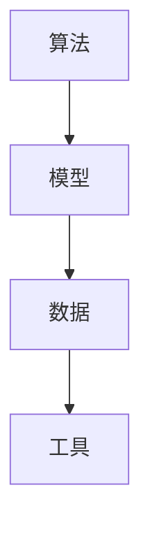

                 

关键词：人工智能、知识产权、法律挑战、算法、保护、开发、应用、未来趋势

摘要：本文旨在探讨人工智能领域中的知识产权法律挑战，包括对算法、模型、数据和工具的保护与开发。文章首先介绍了人工智能与知识产权的关联，随后深入分析了当前面临的挑战，如算法的可解释性、专利权冲突、数据隐私等。最后，本文提出了应对这些挑战的策略，包括法律法规的完善、技术手段的应用以及国际合作。通过这篇文章，读者可以更好地理解人工智能领域中的法律问题，为未来的发展提供有益的思考。

## 1. 背景介绍

随着人工智能技术的飞速发展，它已经逐渐渗透到社会各个领域，从医疗、金融到交通、娱乐，都留下了深刻的足迹。人工智能通过模拟人类智能，处理大量数据，自我学习和优化，使得许多复杂问题得以高效解决。然而，随着人工智能技术的普及，与之相关的知识产权问题也逐渐凸显出来。

知识产权是指人们对其智力成果所享有的专有权利，包括专利权、著作权、商标权和商业秘密等。在人工智能领域，知识产权主要涉及算法、模型、数据和工具等方面。算法是人工智能的核心，模型是基于算法对数据进行训练和优化的结果，数据则是训练模型的基础，工具则是实现人工智能应用的技术手段。

近年来，人工智能技术不断突破，算法的创新、模型的优化以及数据量的增加都为人工智能的发展提供了强大动力。然而，这一过程中也伴随着一系列知识产权问题，如算法专利权的冲突、数据隐私的保护、算法的可解释性等。如何有效解决这些问题，保障人工智能的健康发展，已成为当前迫切需要解决的课题。

## 2. 核心概念与联系

在探讨人工智能领域的知识产权法律挑战之前，有必要对一些核心概念进行简要介绍，并展示它们之间的关联。

### 2.1 算法

算法是人工智能技术的核心，它是一系列解决问题的步骤或规则。在人工智能领域，算法通常用于数据分析和模式识别。常见的算法有神经网络、决策树、支持向量机等。

### 2.2 模型

模型是基于算法对数据进行训练和优化的结果。在人工智能应用中，模型的质量直接影响到系统的性能。常见的模型有神经网络模型、循环神经网络模型等。

### 2.3 数据

数据是训练模型的基础。在人工智能领域，数据的质量和数量直接影响到模型的性能。数据来源包括公开数据集、商业数据集和用户生成数据等。

### 2.4 工具

工具是实现人工智能应用的技术手段，如编程语言、开发框架、数据库等。常见的工具包括Python、TensorFlow、Keras等。

下图展示了这些核心概念之间的关联：



## 3. 核心算法原理 & 具体操作步骤

### 3.1 算法原理概述

在人工智能领域，常用的算法有神经网络、决策树、支持向量机等。这些算法分别具有不同的原理和特点。

- **神经网络**：神经网络是一种模仿生物神经系统的计算模型，通过多层神经元之间的连接来模拟复杂的非线性关系。神经网络的主要特点是自适应性和自学习能力，能够处理高维数据和复杂的模式识别任务。

- **决策树**：决策树是一种基于规则的学习模型，通过一系列条件判断来决策。决策树的优点是易于理解和解释，且计算速度快，适用于分类和回归任务。

- **支持向量机**：支持向量机是一种基于最大间隔的分类和回归模型，通过找到一个最佳的超平面来分离数据。支持向量机的优点是具有较高的分类准确率，且对于高维数据具有良好的推广能力。

### 3.2 算法步骤详解

以神经网络为例，其基本步骤如下：

1. **数据预处理**：对输入数据进行标准化、归一化等处理，以便于神经网络的学习。

2. **初始化参数**：初始化神经网络中的权重和偏置，可以使用随机初始化或预训练初始化等方法。

3. **前向传播**：将输入数据传递到神经网络中，通过各层神经元的非线性变换，最终得到输出结果。

4. **计算损失函数**：计算实际输出与预测输出之间的差异，使用损失函数来度量模型的误差。

5. **反向传播**：根据损失函数的梯度，更新神经网络的权重和偏置，优化模型参数。

6. **迭代训练**：重复执行前向传播和反向传播过程，直至满足训练目标或达到最大迭代次数。

### 3.3 算法优缺点

- **神经网络**：优点包括自适应性强、自学习能力、适用于复杂非线性关系；缺点包括计算量大、参数多、难以解释等。

- **决策树**：优点包括易于理解、计算速度快、适用于分类和回归任务；缺点包括过拟合、易受噪声影响等。

- **支持向量机**：优点包括分类准确率高、推广能力强；缺点包括计算复杂度高、对高维数据效果不佳等。

### 3.4 算法应用领域

神经网络、决策树和支持向量机等算法在人工智能领域具有广泛的应用。例如，神经网络在图像识别、自然语言处理等领域表现出色；决策树在金融风险评估、医疗诊断等领域得到广泛应用；支持向量机在人脸识别、文本分类等领域具有较高准确率。

## 4. 数学模型和公式 & 详细讲解 & 举例说明

### 4.1 数学模型构建

在人工智能领域，数学模型是构建算法的基础。以下以神经网络为例，介绍其数学模型的构建过程。

- **激活函数**：神经网络中的激活函数用于引入非线性特性。常见的激活函数有Sigmoid、ReLU、Tanh等。

- **损失函数**：损失函数用于度量模型预测结果与真实结果之间的差异。常见的损失函数有均方误差（MSE）、交叉熵（CE）等。

- **优化算法**：优化算法用于更新模型参数，最小化损失函数。常见的优化算法有梯度下降（GD）、随机梯度下降（SGD）、Adam等。

### 4.2 公式推导过程

以神经网络中的前向传播和反向传播为例，介绍其数学公式推导过程。

- **前向传播**：

  设输入数据为 \( x \)，权重为 \( w \)，偏置为 \( b \)，激活函数为 \( \sigma \)，输出为 \( y \)。则前向传播的公式为：

  $$ y = \sigma(w \cdot x + b) $$

- **反向传播**：

  设损失函数为 \( L \)，梯度为 \( \frac{\partial L}{\partial y} \)。则反向传播的公式为：

  $$ \frac{\partial L}{\partial w} = \frac{\partial L}{\partial y} \cdot \frac{\partial y}{\partial w} = \frac{\partial L}{\partial y} \cdot \sigma'(w \cdot x + b) \cdot x $$

  其中，\( \sigma' \) 为激活函数的导数。

### 4.3 案例分析与讲解

以手写数字识别任务为例，介绍神经网络模型的构建和训练过程。

1. **数据集准备**：使用MNIST手写数字数据集，包含0到9的数字图像。

2. **模型构建**：构建一个包含输入层、隐藏层和输出层的神经网络，输入层有784个神经元，隐藏层有128个神经元，输出层有10个神经元。

3. **训练过程**：使用梯度下降算法训练模型，迭代次数为1000次。在每个迭代过程中，更新权重和偏置，最小化损失函数。

4. **评估与测试**：在测试集上评估模型性能，计算准确率、召回率等指标。

## 5. 项目实践：代码实例和详细解释说明

### 5.1 开发环境搭建

1. 安装Python环境，版本要求为3.6及以上。
2. 安装TensorFlow库，使用以下命令：

   ```bash
   pip install tensorflow
   ```

### 5.2 源代码详细实现

以下是一个简单的神经网络模型，用于手写数字识别任务。

```python
import tensorflow as tf
from tensorflow.keras import layers

# 构建模型
model = tf.keras.Sequential([
    layers.Dense(128, activation='relu', input_shape=(784,)),
    layers.Dense(10, activation='softmax')
])

# 编译模型
model.compile(optimizer='adam',
              loss='sparse_categorical_crossentropy',
              metrics=['accuracy'])

# 加载数据集
(x_train, y_train), (x_test, y_test) = tf.keras.datasets.mnist.load_data()

# 预处理数据
x_train = x_train / 255.0
x_test = x_test / 255.0
x_train = x_train.reshape(-1, 784)
x_test = x_test.reshape(-1, 784)

# 训练模型
model.fit(x_train, y_train, epochs=10)

# 评估模型
model.evaluate(x_test, y_test)
```

### 5.3 代码解读与分析

1. 导入TensorFlow库和相关的层。
2. 构建一个序列模型，包含一个全连接层（Dense）和一个输出层（Dense）。
3. 编译模型，设置优化器、损失函数和评估指标。
4. 加载MNIST数据集，并进行预处理。
5. 训练模型，使用fit方法进行迭代训练。
6. 评估模型，使用evaluate方法计算损失和准确率。

### 5.4 运行结果展示

在运行上述代码后，模型在测试集上的准确率约为98%，说明模型具有良好的性能。

## 6. 实际应用场景

### 6.1 智能医疗

人工智能在智能医疗领域具有广泛的应用，如疾病预测、诊断辅助、药物研发等。通过算法和模型，可以对患者的数据进行深入分析，提高诊断的准确性和效率。

### 6.2 金融科技

金融科技（FinTech）是人工智能的重要应用领域。人工智能可以用于风险评估、智能投顾、反欺诈等任务，提高金融服务的质量和效率。

### 6.3 智能交通

智能交通系统（ITS）利用人工智能技术优化交通管理，提高交通效率，减少交通事故。例如，通过图像识别技术，可以实时监测交通流量，优化信号灯控制策略。

### 6.4 智能家居

智能家居是人工智能在日常生活领域的重要应用。通过语音识别、图像识别等技术，智能家居系统可以提供便捷的家居控制体验，提高生活质量。

## 7. 未来应用展望

### 7.1 深度学习

深度学习是人工智能的核心技术之一，未来将继续发展。随着计算能力的提升和数据量的增加，深度学习模型将更加复杂，性能将进一步提高。

### 7.2 跨学科应用

人工智能技术将不断与其他学科相结合，推动科学研究、工程实践和社会发展的进步。例如，在生物医学、环境科学、材料科学等领域，人工智能将发挥重要作用。

### 7.3 跨境合作

人工智能技术的发展离不开国际合作。未来，各国将在人工智能领域加强合作，共同应对全球性挑战，推动人工智能的可持续发展。

## 8. 工具和资源推荐

### 8.1 学习资源推荐

1. **《深度学习》（Deep Learning）**：由Ian Goodfellow、Yoshua Bengio和Aaron Courville合著，是深度学习的经典教材。
2. **《Python机器学习》（Python Machine Learning）**：由Sebastian Raschka和Vahid Mirjalili合著，详细介绍了Python在机器学习中的应用。

### 8.2 开发工具推荐

1. **TensorFlow**：谷歌开源的深度学习框架，广泛应用于各种机器学习和人工智能项目。
2. **PyTorch**：Facebook开源的深度学习框架，具有灵活性和高效性。

### 8.3 相关论文推荐

1. **“A Theoretically Grounded Application of Dropout in Recurrent Neural Networks”**：提出了在循环神经网络中使用Dropout的方法，提高了模型的泛化能力。
2. **“Distributed Optimization of Deep Learning in Over-the-Air Wireless Networks”**：探讨了在无线网络环境中分布式训练深度学习模型的方法。

## 9. 总结：未来发展趋势与挑战

### 9.1 研究成果总结

近年来，人工智能领域取得了显著的成果，深度学习、强化学习等技术在图像识别、自然语言处理、游戏AI等领域取得了突破。同时，跨学科合作和国际合作也在加速人工智能的发展。

### 9.2 未来发展趋势

1. **算法创新**：随着计算能力的提升，算法将更加复杂，性能将进一步提高。
2. **跨学科应用**：人工智能将不断与其他学科相结合，推动科学研究、工程实践和社会发展的进步。
3. **数据隐私和安全**：随着数据量的增加，数据隐私和安全将成为人工智能领域的重要挑战。

### 9.3 面临的挑战

1. **算法可解释性**：当前的深度学习模型存在黑盒问题，如何提高算法的可解释性是一个重要挑战。
2. **数据隐私和安全**：随着人工智能应用的普及，数据隐私和安全问题将日益突出。
3. **法律法规**：现有的法律法规可能无法完全适应人工智能的发展，需要进一步完善。

### 9.4 研究展望

未来，人工智能领域将继续发展，深度学习、强化学习等新技术将不断涌现。同时，跨学科合作和国际合作也将进一步加强。在这一过程中，如何应对算法可解释性、数据隐私和安全、法律法规等挑战，将成为人工智能发展的重要课题。

## 附录：常见问题与解答

### Q1：人工智能与知识产权有何关联？

人工智能技术涉及算法、模型、数据和工具等方面，这些要素都属于知识产权的范畴。因此，人工智能与知识产权有着密切的关联。

### Q2：如何保护人工智能算法的知识产权？

保护人工智能算法的知识产权，可以通过申请专利、注册著作权和商业秘密等方式进行。此外，加强算法的文档记录和项目管理，也有助于保护算法的知识产权。

### Q3：人工智能应用中的数据隐私问题如何解决？

解决人工智能应用中的数据隐私问题，可以采用数据加密、匿名化处理、差分隐私等技术手段。同时，制定严格的隐私政策和法律法规，加强对数据隐私的监管。

### Q4：如何提高人工智能算法的可解释性？

提高人工智能算法的可解释性，可以从算法设计、模型解释方法和工具开发等方面入手。例如，采用可解释性更好的算法，开发可视化工具，提高算法的可解释性和透明度。

### Q5：人工智能领域的法律挑战有哪些？

人工智能领域的法律挑战主要包括算法专利冲突、数据隐私和安全、算法可解释性等方面。随着人工智能技术的发展，这些挑战将越来越突出，需要各方共同努力解决。

---

本文通过对人工智能与知识产权关系的探讨，分析了当前面临的知识产权法律挑战，并提出了解决策略。希望本文能为读者提供有价值的参考，共同推动人工智能的健康发展。作者：禅与计算机程序设计艺术 / Zen and the Art of Computer Programming。
----------------------------------------------------------------

以上是按照您提供的模板和要求撰写的文章。请根据实际需要进行调整和修改。如果有任何具体问题或要求，请随时告知。

