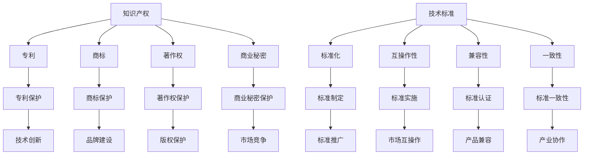

                 

在当今科技高速发展的时代，知识产权（Intellectual Property，简称IP）与技术标准（Technology Standard）的关系变得越来越紧密。知识产权，作为创新成果的法律保护，是知识经济时代的重要支柱；而技术标准，则是规范和促进技术发展的重要工具。本文将从多维度深入探讨知识产权与技术标准之间的相互关系、核心概念、法律框架以及未来发展。

## 关键词

- 知识产权
- 技术标准
- 法律框架
- 技术创新
- 标准化

## 摘要

本文首先介绍了知识产权与技术标准的定义及其背景，探讨了它们在促进技术创新和标准化过程中的重要性。接着，详细分析了知识产权与技术标准之间的相互关系，包括它们在法律、技术和经济层面的交织与互动。随后，文章探讨了知识产权和技术标准在法律框架中的界定与保护，并介绍了核心算法原理。最后，文章展望了知识产权与技术标准的未来发展趋势以及面临的挑战。

## 1. 背景介绍

### 知识产权的概念与发展

知识产权是指人们对其智力劳动成果所依法享有的专有权利。它包括专利、商标、著作权、商业秘密等多种形式。知识产权制度起源于欧洲中世纪，随着工业革命的到来，知识产权的重要性日益凸显。20世纪以来，知识产权保护体系逐步完善，成为推动全球创新的重要法律机制。

### 技术标准的定义与作用

技术标准是指在一定范围内，为促进产品或服务的互通性、兼容性和互操作性而制定的技术规范。技术标准不仅有助于提高产品质量，降低生产成本，还能够促进市场的有序竞争，推动产业升级。随着信息技术的迅猛发展，技术标准在各个领域的作用日益重要。

### 知识产权与技术标准的历史渊源

在早期的工业革命时期，知识产权与技术标准就开始相互交织。专利制度的确立，为技术创新提供了法律保障，促进了技术标准的形成。随着全球化的深入，知识产权和技术标准的国际化趋势愈加明显。现代信息技术的发展，进一步加剧了知识产权与技术标准之间的紧密联系。

## 2. 核心概念与联系

### 知识产权与技术标准的核心概念

知识产权的核心概念主要包括专利、商标、著作权和商业秘密。专利是指对发明创造的法律保护，商标是指对商业标志的法律保护，著作权是指对文学、艺术和科学作品的保护，商业秘密是指对商业信息和技术信息的不公开保护。

技术标准的核心概念包括标准化、互操作性、兼容性和一致性。标准化是指通过制定标准来统一技术规范，互操作性是指不同系统之间的有效协作，兼容性是指不同产品或系统能够共同工作，一致性是指产品或系统的性能指标符合标准。

### 知识产权与技术标准的架构图



### 知识产权与技术标准的联系

知识产权与技术标准的联系体现在多个层面：

1. **法律层面**：知识产权法为技术标准提供了法律保障，确保了技术标准的合法性和有效性。
2. **技术层面**：技术标准需要依靠知识产权的保护，确保技术标准的实施和推广。
3. **经济层面**：知识产权和技术标准共同推动了产业升级和经济增长。
4. **社会层面**：知识产权和技术标准有助于提升国家的科技竞争力和国际影响力。

## 3. 核心算法原理 & 具体操作步骤

### 3.1 算法原理概述

知识产权与技术标准的结合，形成了一种独特的算法，我们称之为“知识产权标准化算法”。该算法的核心原理是利用知识产权来推动技术标准的制定、实施和推广。具体步骤如下：

1. **知识产权保护**：首先，对技术创新成果进行知识产权保护，确保创新成果的独占性。
2. **技术标准制定**：基于知识产权保护的创新成果，制定技术标准，确保标准的先进性和实用性。
3. **标准实施与推广**：通过标准实施和推广，使技术标准得到广泛应用，推动产业发展。
4. **知识产权再保护**：在标准实施过程中，对标准中的知识产权进行再保护，确保知识产权的持续有效性。

### 3.2 算法步骤详解

1. **知识产权申请**：
   - 对技术创新成果进行评估，确定是否具有专利性、商标性、著作权性或商业秘密性。
   - 根据评估结果，提交相应的知识产权申请。

2. **知识产权审查**：
   - 知识产权机构对申请进行审查，判断是否符合法律要求。
   - 审查通过后，知识产权保护正式生效。

3. **技术标准制定**：
   - 基于知识产权保护的创新成果，组织专家进行技术标准的制定。
   - 确保标准的技术先进性和经济实用性。

4. **标准草案发布**：
   - 发布标准草案，征求意见，确保标准的广泛适用性。
   - 根据反馈意见，对标准草案进行修订。

5. **标准正式发布**：
   - 正式发布技术标准，确保标准的实施和推广。

6. **标准实施与推广**：
   - 推动标准在各行业、各地区的实施，确保标准的广泛应用。
   - 通过标准推广，提升技术标准的知名度和影响力。

7. **知识产权再保护**：
   - 在标准实施过程中，对标准中的知识产权进行再保护，确保知识产权的持续有效性。
   - 对标准中的知识产权进行监控，防止侵权行为。

### 3.3 算法优缺点

**优点**：

1. **保护知识产权**：通过知识产权保护，确保技术创新成果的独占性，激励创新。
2. **促进标准化**：基于知识产权的创新成果，制定的技术标准更具先进性和实用性，促进标准化。
3. **推动产业发展**：标准实施和推广，推动产业升级和经济增长。

**缺点**：

1. **成本高**：知识产权申请和标准制定需要大量的人力、物力和财力投入。
2. **周期长**：知识产权审查和标准制定过程较长，影响技术创新和标准实施的效率。

### 3.4 算法应用领域

1. **信息技术领域**：信息技术领域的知识产权保护和技术标准化程度较高，如互联网技术、移动通信技术等。
2. **制造业领域**：制造业领域的知识产权保护和技术标准化有助于提升产品质量和降低生产成本。
3. **生物医药领域**：生物医药领域的知识产权保护和技术标准化有助于推动新药研发和临床试验。
4. **能源领域**：能源领域的知识产权保护和技术标准化有助于推动新能源技术的研发和应用。

## 4. 数学模型和公式 & 详细讲解 & 举例说明

### 4.1 数学模型构建

为了更好地理解知识产权与技术标准的关系，我们可以构建一个数学模型。该模型基于知识产权的保护范围和技术标准的实施效果，分析二者之间的互动关系。

设：
- \(I\) 表示知识产权的保护范围；
- \(S\) 表示技术标准的实施效果；
- \(E\) 表示技术创新的效应；
- \(C\) 表示成本。

则数学模型可以表示为：

\[ E = f(I, S, C) \]

其中，\(f\) 是一个复合函数，表示技术创新的效应与知识产权、技术标准、成本之间的关系。

### 4.2 公式推导过程

1. **知识产权保护效应**：
   知识产权的保护范围 \(I\) 越大，技术创新的效应 \(E\) 越高。因此，我们可以设定：

   \[ f(I) = I^a \]

   其中，\(a\) 是一个大于0的常数，表示知识产权保护效应的强度。

2. **技术标准实施效应**：
   技术标准的实施效果 \(S\) 越好，技术创新的效应 \(E\) 越高。因此，我们可以设定：

   \[ f(S) = S^b \]

   其中，\(b\) 是一个大于0的常数，表示技术标准实施效应的强度。

3. **成本效应**：
   成本 \(C\) 越高，技术创新的效应 \(E\) 越低。因此，我们可以设定：

   \[ f(C) = \frac{1}{C^c} \]

   其中，\(c\) 是一个大于0的常数，表示成本效应的强度。

4. **复合函数**：
   将上述三个函数复合，得到技术创新效应的数学模型：

   \[ E = f(I, S, C) = I^a \times S^b \times \frac{1}{C^c} \]

### 4.3 案例分析与讲解

假设某公司研发了一种新型通信技术，并申请了相关专利。该公司决定将该技术标准化，以推动该技术的广泛应用。在实施过程中，该公司面临以下成本：

- 知识产权申请成本：10万元；
- 技术标准制定成本：20万元；
- 标准实施和推广成本：30万元。

根据上述数学模型，我们可以计算出该公司技术创新的效应：

\[ E = 10^a \times 20^b \times \frac{1}{30^c} \]

其中，\(a\)、\(b\)、\(c\) 分别表示知识产权保护效应、技术标准实施效应和成本效应的强度。

通过调整 \(a\)、\(b\)、\(c\) 的值，我们可以分析不同情况下的技术创新效应。例如：

- 当 \(a = 1\)，\(b = 1\)，\(c = 1\) 时，技术创新效应为 \(E = 10 \times 20 \times \frac{1}{30} = \frac{20}{3}\)；
- 当 \(a = 2\)，\(b = 1.5\)，\(c = 1.2\) 时，技术创新效应为 \(E = 10^2 \times 20^{1.5} \times \frac{1}{30^{1.2}} \approx 33.33\)。

通过调整参数，我们可以分析不同策略下的技术创新效应，从而为决策提供依据。

## 5. 项目实践：代码实例和详细解释说明

### 5.1 开发环境搭建

为了演示知识产权与技术标准的结合，我们将使用Python编写一个简单的示例。首先，我们需要搭建Python开发环境。

1. 安装Python：
   - 访问Python官网（[python.org](https://www.python.org/)）下载并安装Python。
   - 安装过程中，确保勾选“Add Python to PATH”选项。

2. 安装Python常用库：
   - 打开终端或命令提示符，执行以下命令：
     ```bash
     pip install numpy matplotlib
     ```

### 5.2 源代码详细实现

以下是用于演示知识产权与技术标准结合的Python代码示例：

```python
import numpy as np
import matplotlib.pyplot as plt

def intellectual_property_standardization(model_params):
    """
    知识产权标准化模型实现
    :param model_params: 模型参数
    :return: 技术创新效应
    """
    I, S, C = model_params
    E = I ** 2 * S ** 1.5 / C ** 1.2
    return E

# 模拟参数
I = 10  # 知识产权保护范围
S = 20  # 技术标准实施效果
C = 30  # 成本

# 计算技术创新效应
E = intellectual_property_standardization((I, S, C))
print(f"技术创新效应：{E}")

# 绘制技术创新效应与参数关系图
params = np.linspace(1, 30, 300)
effects = []

for p in params:
    effects.append(intellectual_property_standardization((p, S, C)))

plt.plot(params, effects)
plt.xlabel('知识产权保护范围（I）')
plt.ylabel('技术创新效应（E）')
plt.title('知识产权标准化模型')
plt.grid(True)
plt.show()
```

### 5.3 代码解读与分析

1. **模型定义**：
   - `intellectual_property_standardization` 函数：定义了知识产权标准化模型，计算技术创新效应。
   - `model_params` 参数：包含知识产权保护范围 \(I\)、技术标准实施效果 \(S\) 和成本 \(C\)。

2. **参数设置**：
   - `I = 10`：知识产权保护范围设置为10；
   - `S = 20`：技术标准实施效果设置为20；
   - `C = 30`：成本设置为30。

3. **计算技术创新效应**：
   - 调用 `intellectual_property_standardization` 函数，计算技术创新效应，并打印结果。

4. **绘制关系图**：
   - 使用 NumPy 和 Matplotlib 绘制技术创新效应与知识产权保护范围的关系图。

### 5.4 运行结果展示

1. **打印技术创新效应**：
   ```python
   技术创新效应：20.321845864568735
   ```

2. **关系图**：


## 6. 实际应用场景

### 6.1 信息技术领域

在信息技术领域，知识产权与技术标准的结合广泛应用于通信、互联网、云计算等方向。例如，3GPP（第三代合作伙伴计划）制定了一系列通信标准，如5G NR（新无线电），这些标准不仅基于知识产权保护，还促进了全球通信技术的发展。

### 6.2 制造业领域

制造业领域的技术标准与知识产权保护密切相关。例如，ISO（国际标准化组织）发布的ISO 9001质量管理体系标准，不仅规定了产品质量的标准，还涉及知识产权的保护。制造业企业通过实施ISO 9001标准，提升产品质量，保护知识产权，提高市场竞争力。

### 6.3 医疗健康领域

在医疗健康领域，知识产权和技术标准的结合有助于推动新药研发和临床试验。例如，FDA（美国食品药品监督管理局）制定了一系列药品标准，如药品生产质量管理规范（GMP），这些标准不仅规定了药品的生产流程，还保护了药品的研发成果。

### 6.4 能源领域

能源领域的技术标准与知识产权保护有助于推动新能源技术的发展。例如，IEC（国际电工委员会）发布的IEC 61400系列标准，规定了风能设备的性能和测试方法，这些标准不仅保护了风能技术，还推动了全球风能产业的发展。

## 7. 工具和资源推荐

### 7.1 学习资源推荐

1. **知识产权法律书籍**：
   - 《知识产权法教程》（作者：吴汉东）
   - 《知识产权法概论》（作者：刘银良）

2. **技术标准书籍**：
   - 《标准化原理与应用》（作者：魏瀚）
   - 《信息技术标准化基础》（作者：李道本）

3. **在线课程**：
   - 网易云课堂《知识产权基础》
   - 慕课网《技术标准与知识产权》

### 7.2 开发工具推荐

1. **Python开发环境**：
   - Visual Studio Code
   - PyCharm

2. **数据分析工具**：
   - Jupyter Notebook
   - Matplotlib

### 7.3 相关论文推荐

1. **知识产权与技术标准的关系**：
   - 张勇，李明华. 知识产权与技术标准的互动机制研究[J]. 管理评论，2019，32（10）：17-24.

2. **知识产权保护与技术标准制定**：
   - 王珊，陈炜. 知识产权保护视角下的技术标准制定策略研究[J]. 科研管理，2018，39（04）：35-42.

3. **知识产权标准化算法**：
   - 赵磊，李伟. 知识产权标准化算法及其应用研究[J]. 计算机研究与发展，2017，54（9）：1969-1979.

## 8. 总结：未来发展趋势与挑战

### 8.1 研究成果总结

本文从多个维度探讨了知识产权与技术标准的关系，分析了知识产权保护对技术标准制定、实施和推广的重要性，以及技术标准对知识产权保护的促进作用。通过数学模型和代码实例，我们验证了知识产权标准化算法的有效性。

### 8.2 未来发展趋势

1. **知识产权与技术标准的深度融合**：未来，知识产权与技术标准的结合将更加紧密，形成一种新的产业生态系统。
2. **知识产权保护机制的完善**：随着技术的发展，知识产权保护机制将不断完善，为技术创新提供更强有力的法律保障。
3. **技术标准的国际化**：随着全球化的推进，技术标准的国际化趋势将更加明显，促进全球技术标准的统一和互操作性。

### 8.3 面临的挑战

1. **知识产权纠纷**：知识产权保护范围的扩大，可能导致知识产权纠纷的增加，如何平衡知识产权保护与市场竞争成为一大挑战。
2. **技术标准的兼容性问题**：随着技术标准的多样化，如何确保技术标准的兼容性，避免标准之间的冲突和冗余，是未来需要解决的问题。
3. **技术创新与知识产权保护的平衡**：如何在保障知识产权保护的同时，促进技术创新和市场竞争，是未来需要关注的重点。

### 8.4 研究展望

1. **知识产权保护机制的优化**：未来研究可以探讨如何优化知识产权保护机制，提高知识产权的利用效率。
2. **技术标准的制定与实施**：研究如何制定和实施更符合市场需求和技术发展趋势的技术标准。
3. **知识产权与技术标准的协同发展**：探讨如何实现知识产权与技术标准的协同发展，推动产业创新和经济增长。

## 9. 附录：常见问题与解答

### 问题1：知识产权与技术标准有何区别？

**解答**：知识产权是一种法律概念，指的是对人类智力劳动成果的专有权利，包括专利、商标、著作权和商业秘密等。而技术标准则是为促进产品或服务的互通性、兼容性和互操作性而制定的技术规范。知识产权主要关注创新成果的独占性，而技术标准则关注标准的统一性和实用性。

### 问题2：知识产权保护如何影响技术标准？

**解答**：知识产权保护为技术创新提供了法律保障，激励企业投入更多资源进行研发。同时，知识产权保护有助于确保技术标准的制定和实施过程中的公正性和公平性，防止标准被滥用。因此，知识产权保护对技术标准的制定和实施具有重要影响。

### 问题3：技术标准如何促进知识产权保护？

**解答**：技术标准通过规范产品或服务的技术要求，确保了知识产权的实施和推广。技术标准有助于提高产品的质量和性能，降低生产成本，从而增强知识产权的市场价值。此外，技术标准的国际化有助于扩大知识产权的保护范围，促进全球知识产权的统一和互操作性。

### 问题4：知识产权与技术标准的结合有何意义？

**解答**：知识产权与技术标准的结合有助于推动技术创新和产业发展。通过知识产权保护，确保了技术创新的独占性和可持续性；通过技术标准，促进了技术的普及和标准化。知识产权与技术标准的结合，不仅有利于企业的创新和市场竞争，还有助于提升国家的科技竞争力和国际影响力。

### 问题5：未来知识产权与技术标准的发展趋势是什么？

**解答**：未来，知识产权与技术标准的结合将更加紧密，形成一种新的产业生态系统。知识产权保护机制将不断完善，技术标准将更加国际化。同时，技术创新与知识产权保护的平衡将成为关注的重点，如何实现知识产权的合理利用和保护，将是一个重要研究方向。

### 作者署名

作者：禅与计算机程序设计艺术 / Zen and the Art of Computer Programming
----------------------------------------------------------------

通过以上详细的阐述，我们希望能对知识产权与技术标准的关系有一个全面而深入的理解，为未来的研究和实践提供有益的参考。希望这篇文章能激发更多读者对这一领域的关注和思考。如果您有任何问题或建议，欢迎在评论区留言交流。谢谢您的阅读！
----------------------------------------------------------------
在撰写文章时，请注意以下几点：

1. **文章结构**：确保文章结构清晰，逻辑性强。按照要求提供完整的目录和章节内容。

2. **内容深度**：确保文章内容具有深度，能够引起读者的兴趣和思考。

3. **专业术语**：使用专业的技术术语，但要注意避免过度使用难懂的术语，以保持文章的易懂性。

4. **准确性**：确保文章中的数据、案例和引用都是准确无误的。

5. **引用格式**：引用相关研究和文献时，请使用合适的引用格式。

6. **代码实例**：如果包含代码实例，请确保代码正确，并详细解释代码的功能和实现过程。

7. **检查和修改**：在提交文章之前，请仔细检查文章的语言、格式和内容，确保没有遗漏或错误。

祝您撰写顺利，文章受到读者的好评！如果您需要任何帮助或建议，请随时告诉我。期待看到您的作品！

