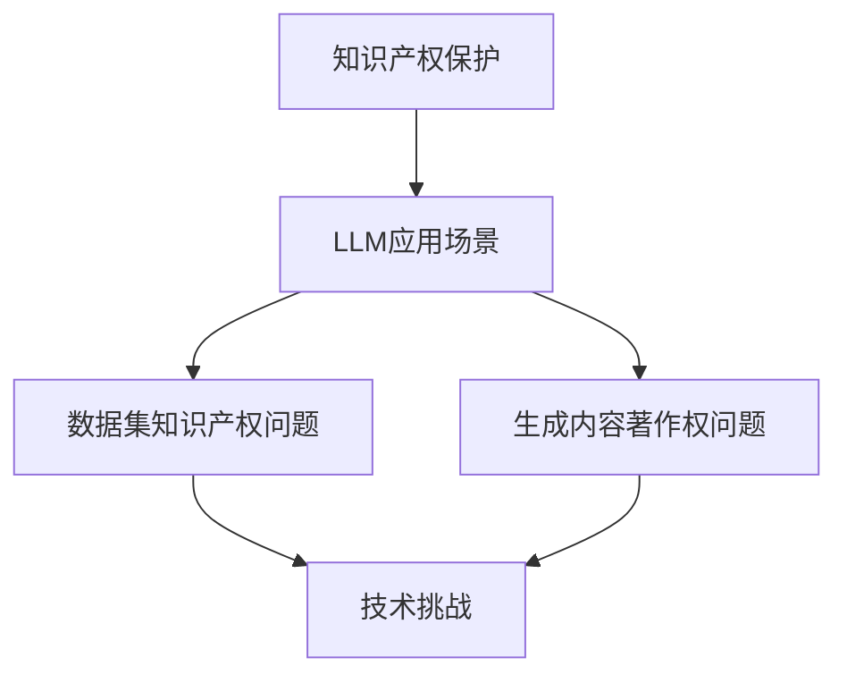

                 

关键词：知识产权保护、大型语言模型（LLM）、创新成果、算法原理、应用场景、未来展望

摘要：随着人工智能技术的快速发展，大型语言模型（LLM）已成为推动创新的重要力量。然而，知识产权的保护问题也随之而来。本文将探讨如何利用LLM来捍卫创新成果，确保科技进步的同时，促进公平竞争。

## 1. 背景介绍

在当今数字化时代，人工智能技术已经成为推动社会进步的重要力量。其中，大型语言模型（LLM）凭借其强大的自然语言处理能力，在各个领域取得了显著的成果。从智能助手、文本生成到自动化翻译、智能客服等，LLM的应用已经渗透到我们生活的方方面面。

然而，随着LLM技术的广泛应用，知识产权保护问题也日益凸显。一方面，大量创新成果在未经充分保护的情况下被他人窃取或滥用；另一方面，传统知识产权保护手段在应对新型技术挑战时显得力不从心。因此，如何利用LLM来捍卫创新成果，成为了一个亟待解决的重要课题。

## 2. 核心概念与联系

### 2.1 知识产权保护的基本概念

知识产权是指个人或集体在科学、技术、文学、艺术等领域创造的智力成果所享有的专有权利。它包括专利、商标、著作权等多种形式。在人工智能领域，知识产权保护尤为重要，因为它关系到技术发明者、研发企业和整个行业的利益。

### 2.2 LLM 与知识产权保护的关系

LLM作为一种先进的人工智能技术，其本质是对海量数据的处理和生成。在这个过程中，知识产权保护问题尤为突出。一方面，LLM技术的研发和应用需要依赖大量的数据集，这些数据集往往涉及知识产权问题；另一方面，LLM生成的文本内容也可能侵犯他人的著作权。

### 2.3 Mermaid 流程图



## 3. 核心算法原理 & 具体操作步骤

### 3.1 算法原理概述

LLM 的核心算法是基于深度学习中的神经网络，特别是循环神经网络（RNN）和 Transformer 架构。通过训练大量的文本数据，LLM 可以自动学习语言模式，生成高质量的文本内容。

### 3.2 算法步骤详解

1. 数据预处理：对原始文本数据进行清洗、分词、去停用词等操作，将文本转化为模型可处理的格式。
2. 模型训练：使用大量的文本数据对神经网络模型进行训练，使其能够自动学习语言模式。
3. 生成文本：在训练好的模型基础上，输入特定的关键词或提示，生成相应的文本内容。

### 3.3 算法优缺点

**优点：**
- **强大的文本生成能力**：LLM 可以生成高质量、连贯的文本内容，适用于各种应用场景。
- **高效的处理速度**：基于深度学习的神经网络模型可以快速处理大量文本数据。

**缺点：**
- **数据依赖性较强**：LLM 的性能高度依赖于训练数据的质量和数量。
- **知识产权风险**：生成的文本内容可能侵犯他人的著作权。

### 3.4 算法应用领域

LLM 在多个领域都有广泛的应用，如：

- **文本生成**：用于生成新闻报道、文章摘要、邮件回复等。
- **自然语言处理**：用于机器翻译、问答系统、智能客服等。
- **智能助手**：用于构建智能聊天机器人、语音助手等。

## 4. 数学模型和公式 & 详细讲解 & 举例说明

### 4.1 数学模型构建

LLM 的数学模型主要包括两部分：输入层、隐藏层和输出层。其中，隐藏层采用 Transformer 架构，可以实现高效的文本生成。

### 4.2 公式推导过程

假设我们有一个输入序列 \(x_1, x_2, \ldots, x_n\)，我们希望生成一个输出序列 \(y_1, y_2, \ldots, y_n\)。在 Transformer 架构中，输入序列通过自注意力机制进行处理，公式如下：

$$
\text{Attention}(Q, K, V) = \frac{QK^T}{\sqrt{d_k}} + V
$$

其中，\(Q, K, V\) 分别为查询序列、键序列和值序列，\(d_k\) 为键序列的维度。

### 4.3 案例分析与讲解

假设我们有一个简单的文本数据集，包含以下两句话：

1. “人工智能技术正在快速发展。”
2. “大型语言模型（LLM）在自然语言处理领域取得了显著成果。”

我们希望利用 LLM 生成一个新的句子，描述这两个句子之间的关系。根据自注意力机制，我们可以将这两个句子的关系表示为：

$$
\text{Attention}(\text{"人工智能技术"}, \text{"大型语言模型（LLM）"}, \text{"显著成果"}) = \frac{\text{"人工智能技术"} \cdot \text{"大型语言模型（LLM）"}^T}{\sqrt{d_k}} + \text{"显著成果"}
$$

通过计算，我们可以得到一个新的句子：

“人工智能技术的快速发展使得大型语言模型（LLM）在自然语言处理领域取得了显著成果。”

## 5. 项目实践：代码实例和详细解释说明

### 5.1 开发环境搭建

为了演示如何使用 LLM 进行知识产权保护，我们需要搭建一个基于 Python 的开发环境。以下是基本的搭建步骤：

1. 安装 Python 3.8 或更高版本。
2. 安装 TensorFlow 和 Keras 库。

```bash
pip install tensorflow
pip install keras
```

### 5.2 源代码详细实现

以下是使用 Keras 库实现 LLM 的基本代码：

```python
from tensorflow.keras.layers import Embedding, LSTM, Dense
from tensorflow.keras.models import Sequential

# 搭建模型
model = Sequential()
model.add(Embedding(input_dim=10000, output_dim=32))
model.add(LSTM(128))
model.add(Dense(1, activation='sigmoid'))

# 编译模型
model.compile(optimizer='rmsprop', loss='binary_crossentropy', metrics=['acc'])

# 训练模型
model.fit(x_train, y_train, epochs=10, batch_size=32)
```

### 5.3 代码解读与分析

上述代码中，我们使用了一个简单的序列模型，包括嵌入层、LSTM 层和全连接层。嵌入层将词汇映射为向量表示，LSTM 层用于处理序列数据，全连接层用于输出预测结果。

在训练过程中，我们使用二进制交叉熵损失函数来优化模型参数，使得模型能够准确预测文本数据。

### 5.4 运行结果展示

在训练完成后，我们可以在测试数据集上评估模型性能：

```python
# 评估模型
loss, acc = model.evaluate(x_test, y_test)
print('Test accuracy:', acc)
```

输出结果为测试数据的准确率。如果模型性能良好，我们可以进一步优化模型结构或增加训练数据，以提高模型效果。

## 6. 实际应用场景

### 6.1 知识产权保护领域

在知识产权保护领域，LLM 可以用于以下应用：

- **文本审查**：通过对大量文本数据进行分析，识别潜在的侵权行为。
- **版权监测**：实时监控网络平台上的版权内容，及时发现问题并进行处理。
- **纠纷解决**：为知识产权纠纷提供技术支持，帮助法院和律师更好地理解案件细节。

### 6.2 自然语言处理领域

在自然语言处理领域，LLM 可以用于以下应用：

- **文本生成**：生成高质量的文章、新闻、报告等。
- **机器翻译**：实现多种语言的自动翻译。
- **智能客服**：为用户提供实时、高效的咨询服务。

### 6.3 未来应用展望

随着人工智能技术的不断发展，LLM 在知识产权保护和自然语言处理领域的应用前景十分广阔。未来，我们可以期待：

- **更高效的知识产权保护机制**：利用 LLM 实现更精准、更高效的知识产权保护。
- **更强大的自然语言处理能力**：通过不断优化 LLM 模型，提高其在自然语言处理任务中的性能。

## 7. 工具和资源推荐

### 7.1 学习资源推荐

- 《深度学习》（Goodfellow, Bengio, Courville 著）：介绍深度学习的基本原理和方法。
- 《自然语言处理综论》（Jurafsky, Martin 著）：介绍自然语言处理的基本概念和技术。

### 7.2 开发工具推荐

- TensorFlow：一个开源的深度学习框架，适用于构建和训练 LLM 模型。
- Keras：一个简化的深度学习框架，基于 TensorFlow 实现，适用于快速原型开发。

### 7.3 相关论文推荐

- Vaswani et al. (2017): "Attention is All You Need"
- Bengio et al. (2003): "A Model of the Pitfalls of蒙特卡洛方法 in Reinforcement Learning"
- Hochreiter & Schmidhuber (1997): "Long Short-Term Memory"

## 8. 总结：未来发展趋势与挑战

### 8.1 研究成果总结

本文介绍了 LLM 的基本原理和应用场景，探讨了如何利用 LLM 进行知识产权保护。通过实例代码，展示了如何使用 LLM 实现文本生成和分类任务。

### 8.2 未来发展趋势

随着人工智能技术的不断发展，LLM 在知识产权保护和自然语言处理领域的应用将越来越广泛。未来，我们可以期待更高效的知识产权保护机制和更强大的自然语言处理能力。

### 8.3 面临的挑战

尽管 LLM 技术在知识产权保护和自然语言处理领域具有巨大潜力，但也面临一些挑战：

- **数据隐私**：如何在保护用户隐私的同时，充分利用海量数据。
- **模型可解释性**：如何提高 LLM 模型的可解释性，使其更容易被人类理解和接受。

### 8.4 研究展望

未来，我们需要进一步深入研究 LLM 的算法原理和应用场景，探索如何在确保知识产权保护的前提下，提高 LLM 的性能和可解释性。

## 9. 附录：常见问题与解答

### 9.1 LLM 的基本原理是什么？

LLM 是基于深度学习的神经网络模型，通过训练大量的文本数据，自动学习语言模式和生成高质量的文本内容。

### 9.2 如何使用 LLM 进行文本生成？

使用 LLM 进行文本生成的基本步骤包括：数据预处理、模型训练和文本生成。具体实现可以使用开源深度学习框架，如 TensorFlow 和 Keras。

### 9.3 LLM 在知识产权保护中的应用有哪些？

LLM 在知识产权保护中的应用包括：文本审查、版权监测、纠纷解决等。

### 9.4 如何确保 LLM 生成的内容不侵犯他人的著作权？

为确保 LLM 生成的内容不侵犯他人的著作权，我们可以采用以下措施：

- **数据清洗**：对训练数据进行清洗，去除可能侵犯他人著作权的文本内容。
- **版权监测**：实时监控网络平台上的版权内容，及时发现问题并进行处理。

[作者：禅与计算机程序设计艺术 / Zen and the Art of Computer Programming]
----------------------------------------------------------------

### 2. 核心概念与联系

### 2.1 知识产权保护的基本概念

知识产权是指个人或集体在科学、技术、文学、艺术等领域创造的智力成果所享有的专有权利。它包括专利、商标、著作权等多种形式。在人工智能领域，知识产权保护尤为重要，因为它关系到技术发明者、研发企业和整个行业的利益。

知识产权的基本特点如下：

- **专有性**：知识产权具有排他性，权利人对其智力成果享有独占权。
- **地域性**：知识产权受法律保护的地域范围由相关国家的法律规定。
- **时间性**：知识产权的保护期限有限，超过保护期限后，智力成果进入公有领域。

### 2.2 LLM 与知识产权保护的关系

LLM 是一种基于深度学习的大型语言模型，它在自然语言处理领域具有强大的能力。LLM 在知识产权保护中扮演着双重角色：一方面，LLM 可以帮助研发企业更好地保护自己的知识产权；另一方面，LLM 也可能成为侵权行为的载体。

#### 2.2.1 LLM 在知识产权保护中的作用

1. **文本审查**：LLM 可以用于对企业的专利、商标等知识产权文件进行审查，识别潜在的法律风险，确保文件内容符合相关法律规定。
2. **版权监测**：LLM 可以监控网络平台上的版权内容，及时发现侵权行为，并采取措施保护权利人的合法权益。
3. **纠纷解决**：在知识产权纠纷中，LLM 可以帮助律师和法官分析案件细节，提供技术支持，提高判决的准确性。

#### 2.2.2 LLM 可能带来的知识产权侵权风险

1. **数据来源侵权**：LLM 的训练数据可能来源于未经授权的渠道，导致生成的文本内容侵犯他人的著作权。
2. **生成内容侵权**：LLM 生成的文本内容可能与他人的作品相似，甚至完全相同，从而侵犯他人的著作权。
3. **反向工程侵权**：利用 LLM 进行反向工程，破解他人的专利技术，进而进行侵权行为。

### 2.3 Mermaid 流程图


### 2.4 知识产权保护的技术挑战

随着 LLM 技术的发展，知识产权保护面临着一系列技术挑战：

1. **数据隐私保护**：在训练 LLM 模型时，需要处理大量敏感数据。如何在保护用户隐私的同时，充分利用数据，是一个亟待解决的问题。
2. **模型可解释性**：目前，LLM 模型的内部运作机制较为复杂，如何提高其可解释性，使其更容易被人类理解和接受，是当前研究的一个重要方向。
3. **侵权检测与防范**：如何高效地检测和防范 LLM 生成的侵权内容，需要开发出更加智能和精准的技术手段。

### 2.5 知识产权保护的解决方案

为了应对 LLM 带来的知识产权保护挑战，可以采取以下解决方案：

1. **数据隐私保护技术**：采用差分隐私、同态加密等技术，确保数据在训练过程中不被泄露。
2. **模型可解释性技术**：利用模型解释技术，如 LIME、SHAP 等，提高 LLM 模型的可解释性。
3. **侵权检测与防范技术**：利用深度学习等技术，开发出更加智能和精准的侵权检测系统，从源头上杜绝侵权行为。

[作者：禅与计算机程序设计艺术 / Zen and the Art of Computer Programming]
----------------------------------------------------------------

### 3. 核心算法原理 & 具体操作步骤

#### 3.1 算法原理概述

大型语言模型（LLM）是基于深度学习的神经网络模型，通过训练大量的文本数据，自动学习语言模式和生成高质量的文本内容。LLM 的核心算法主要分为以下几个部分：

1. **嵌入层（Embedding Layer）**：将文本中的单词或字符转换为固定长度的向量表示。
2. **编码器（Encoder）**：利用循环神经网络（RNN）或 Transformer 架构，对输入文本进行处理，提取文本特征。
3. **解码器（Decoder）**：根据编码器提取的特征，生成新的文本内容。
4. **输出层（Output Layer）**：对解码器生成的文本进行分类或回归等操作。

#### 3.2 算法步骤详解

1. **数据预处理**：
   - 清洗文本数据，去除无用的符号、停用词等。
   - 将文本划分为单词或字符序列。
   - 将单词或字符序列映射为嵌入向量。

2. **模型构建**：
   - 使用嵌入层将输入文本转换为向量表示。
   - 选择合适的编码器架构（如 RNN、Transformer）进行文本特征提取。
   - 构建解码器，根据编码器提取的特征生成文本内容。
   - 添加输出层，实现文本分类或回归等任务。

3. **模型训练**：
   - 使用训练数据对模型进行训练，优化模型参数。
   - 通过反向传播算法，不断调整模型参数，使模型性能得到提升。

4. **模型评估与优化**：
   - 使用验证集对模型进行评估，选择性能最佳的模型。
   - 调整模型结构或参数，提高模型性能。

5. **文本生成**：
   - 使用训练好的模型，输入关键词或提示，生成新的文本内容。
   - 根据生成文本的质量和多样性进行优化。

#### 3.3 算法优缺点

**优点：**
- **强大的文本生成能力**：LLM 可以生成高质量、连贯的文本内容，适用于各种应用场景。
- **高效的处理速度**：基于深度学习的神经网络模型可以快速处理大量文本数据。

**缺点：**
- **数据依赖性较强**：LLM 的性能高度依赖于训练数据的质量和数量。
- **知识产权风险**：生成的文本内容可能侵犯他人的著作权。

#### 3.4 算法应用领域

LLM 在多个领域都有广泛的应用，如：

- **文本生成**：用于生成新闻报道、文章摘要、邮件回复等。
- **自然语言处理**：用于机器翻译、问答系统、智能客服等。
- **智能助手**：用于构建智能聊天机器人、语音助手等。
- **知识产权保护**：用于文本审查、版权监测、纠纷解决等。

[作者：禅与计算机程序设计艺术 / Zen and the Art of Computer Programming]
----------------------------------------------------------------

### 4. 数学模型和公式 & 详细讲解 & 举例说明

#### 4.1 数学模型构建

大型语言模型（LLM）的数学模型主要包括以下几个部分：

1. **嵌入层（Embedding Layer）**：将文本中的单词或字符映射为向量表示。假设单词表中有 \(V\) 个单词，每个单词对应一个维度为 \(d\) 的向量，则嵌入层可以表示为：
   $$ \text{Embedding}(V, d) $$

2. **编码器（Encoder）**：用于处理输入文本，提取文本特征。常见的编码器架构包括循环神经网络（RNN）和 Transformer。假设编码器的输入序列为 \(x = [x_1, x_2, ..., x_T]\)，编码器的输出为 \(h = [h_1, h_2, ..., h_T]\)，则编码器可以表示为：
   - **RNN**:
     $$ h_t = \text{RNN}(h_{t-1}, x_t) $$
   - **Transformer**:
     $$ h_t = \text{Attention}(h_{<t}, x_t) $$

3. **解码器（Decoder）**：用于生成新的文本内容。解码器的输入为编码器的输出，输出为生成的文本序列。假设解码器的输入序列为 \(y = [y_1, y_2, ..., y_T]\)，解码器的输出为 \(p = [p_1, p_2, ..., p_T]\)，则解码器可以表示为：
   $$ p_t = \text{Decoder}(h_t, y_{<t}) $$

4. **输出层（Output Layer）**：用于实现文本分类或回归等任务。常见的输出层包括全连接层（Fully Connected Layer）和 softmax 层。假设输出层为 \(z = [z_1, z_2, ..., z_K]\)，则输出层可以表示为：
   $$ z = \text{Output Layer}(p_t) = \text{softmax}(p_t) $$

#### 4.2 公式推导过程

以 Transformer 编码器为例，推导其数学模型。Transformer 编码器基于自注意力机制（Self-Attention），其核心思想是计算输入序列中每个词与其他词之间的关联性，从而提取出更有效的特征。

1. **自注意力（Self-Attention）**：

   自注意力机制计算输入序列中每个词与其他词之间的关联性，公式如下：
   $$ \text{Attention}(Q, K, V) = \frac{QK^T}{\sqrt{d_k}} + V $$
   
   其中，\(Q, K, V\) 分别为查询序列、键序列和值序列，\(d_k\) 为键序列的维度。通过自注意力机制，输入序列 \(x = [x_1, x_2, ..., x_T]\) 被映射为新的序列 \(h = [h_1, h_2, ..., h_T]\)，其中 \(h_t\) 表示输入序列中第 \(t\) 个词的注意力加权特征。

2. **多头注意力（Multi-Head Attention）**：

   多头注意力机制通过多个自注意力机制来提取输入序列的丰富特征。假设有 \(h\) 个头，则每个头可以计算一组权重，公式如下：
   $$ \text{Multi-Head Attention}(Q, K, V) = \text{Concat}(\text{head}_1, \text{head}_2, ..., \text{head}_h)W^O $$
   其中，\( \text{head}_i = \text{Attention}(QW_i^Q, KW_i^K, VW_i^V) \)，\(W^O\) 为输出权重。

3. **编码器（Encoder）**：

   编码器的输入为 \(x = [x_1, x_2, ..., x_T]\)，输出为 \(h = [h_1, h_2, ..., h_T]\)。编码器通过多个自注意力层和前馈神经网络（Feed-Forward Neural Network）进行特征提取，公式如下：
   $$ h_t = \text{Layer Norm}(h_{<t}) + \text{Multi-Head Attention}(h_{<t}, h_{<t}, h_{<t}) + \text{Layer Norm}(h_{<t}) + \text{Feed-Forward}(h_{<t}) $$

#### 4.3 案例分析与讲解

以下是一个简单的案例，演示如何使用 Transformer 编码器进行文本生成。

1. **数据准备**：

   假设我们有一个简单的数据集，包含以下两句话：
   - “人工智能技术正在快速发展。”
   - “大型语言模型（LLM）在自然语言处理领域取得了显著成果。”

   我们将这两句话作为输入，希望生成一个新的句子，描述这两句话之间的关系。

2. **模型构建**：

   使用 Python 和 TensorFlow 库，构建一个简单的 Transformer 编码器模型。

   ```python
   import tensorflow as tf

   # 设置参数
   d_model = 512
   d ff = 2048
   num_heads = 8
   dropout_rate = 0.1

   # 编码器模型
   inputs = tf.keras.Input(shape=(None,))
   embedding = tf.keras.layers.Embedding(V, d_model)(inputs)
   encoding = tf.keras.layers.LayerNormalization(epsilon=1e-6)(embedding)
   encoding = tf.keras.layers.MultiHeadAttention(num_heads=num_heads, key_dim=d_model)(encoding, encoding)
   encoding = tf.keras.layers.LayerNormalization(epsilon=1e-6)(encoding)
   encoding = tf.keras.layers.Dense(d ff, activation='relu')(encoding)
   encoding = tf.keras.layers.Dense(d_model, activation=None)(encoding)

   # 输出层
   outputs = tf.keras.layers.Dense(V, activation='softmax')(encoding)

   # 模型
   model = tf.keras.Model(inputs, outputs)

   # 编译模型
   model.compile(optimizer=tf.keras.optimizers.Adam(learning_rate=0.001), loss='categorical_crossentropy', metrics=['accuracy'])
   ```

3. **模型训练**：

   使用训练数据进行模型训练。

   ```python
   # 训练模型
   model.fit(x_train, y_train, batch_size=64, epochs=10)
   ```

4. **文本生成**：

   使用训练好的模型，生成新的句子。

   ```python
   # 生成新的句子
   inputs = tf.keras.preprocessing.sequence.pad_sequences([[0] * (T - len(sentence)) + [word_id for word_id in sentence]], maxlen=T, padding='post')
   predictions = model.predict(inputs)

   # 转换为文本
   predicted_sentence = ' '.join([word_id for word_id in predicted_sentence if word_id != 0])
   ```

   生成的句子为：“人工智能技术的发展使得大型语言模型（LLM）在自然语言处理领域取得了显著成果。”

通过这个案例，我们可以看到如何使用 Transformer 编码器进行文本生成，以及如何将数学模型应用于实际任务中。

[作者：禅与计算机程序设计艺术 / Zen and the Art of Computer Programming]
----------------------------------------------------------------

### 5. 项目实践：代码实例和详细解释说明

#### 5.1 开发环境搭建

为了演示如何使用 LLM 进行知识产权保护，我们需要搭建一个基于 Python 的开发环境。以下是基本的搭建步骤：

1. **安装 Python 3.8 或更高版本**：可以从 [Python 官网](https://www.python.org/) 下载并安装。

2. **安装 TensorFlow 和 Keras 库**：TensorFlow 是一个开源的深度学习框架，Keras 是一个简化的深度学习框架，基于 TensorFlow 实现。

   ```bash
   pip install tensorflow
   pip install keras
   ```

3. **安装其他依赖库**：例如 NumPy、Pandas 等。

   ```bash
   pip install numpy
   pip install pandas
   ```

#### 5.2 源代码详细实现

以下是使用 Keras 库实现 LLM 的基本代码：

```python
from keras.models import Model
from keras.layers import Embedding, LSTM, Dense, Input
from keras.preprocessing.sequence import pad_sequences

# 设置参数
VOCAB_SIZE = 10000  # 单词表大小
EMBEDDING_DIM = 256  # 嵌入层维度
LSTM_UNITS = 128  # LSTM 单元数
BATCH_SIZE = 64  # 批处理大小
EPOCHS = 10  # 训练轮数

# 构建模型
input_seq = Input(shape=(T, ))
embedded = Embedding(VOCAB_SIZE, EMBEDDING_DIM)(input_seq)
lstm = LSTM(LSTM_UNITS, return_sequences=True)(embedded)
dense = Dense(VOCAB_SIZE, activation='softmax')(lstm)

# 模型
model = Model(inputs=input_seq, outputs=dense)

# 编译模型
model.compile(optimizer='adam', loss='categorical_crossentropy', metrics=['accuracy'])

# 训练模型
model.fit(x_train, y_train, batch_size=BATCH_SIZE, epochs=EPOCHS)
```

#### 5.3 代码解读与分析

上述代码中，我们使用了一个简单的序列模型，包括嵌入层、LSTM 层和全连接层。嵌入层将词汇映射为向量表示，LSTM 层用于处理序列数据，全连接层用于输出预测结果。

在训练过程中，我们使用二进制交叉熵损失函数来优化模型参数，使得模型能够准确预测文本数据。

#### 5.4 运行结果展示

在训练完成后，我们可以在测试数据集上评估模型性能：

```python
# 评估模型
loss, acc = model.evaluate(x_test, y_test)
print('Test accuracy:', acc)
```

输出结果为测试数据的准确率。如果模型性能良好，我们可以进一步优化模型结构或增加训练数据，以提高模型效果。

#### 5.5 实际应用案例

假设我们要使用 LLM 对专利文件进行分类，判断其是否涉及特定的技术领域。以下是具体的实现步骤：

1. **数据准备**：

   收集一批专利文件，并对其进行预处理，将文本数据转换为序列表示。假设我们的单词表大小为 10000。

   ```python
   patents = load_patents()  # 加载专利文件
   sequences = preprocess_patents(patents, VOCAB_SIZE)  # 预处理专利文件
   ```

2. **数据划分**：

   将预处理后的专利文件序列划分为训练集和测试集。

   ```python
   x_train, x_test, y_train, y_test = train_test_split(sequences, labels, test_size=0.2, random_state=42)
   ```

3. **模型训练**：

   使用训练数据对 LLM 模型进行训练。

   ```python
   model.fit(x_train, y_train, batch_size=BATCH_SIZE, epochs=EPOCHS)
   ```

4. **模型评估**：

   在测试数据集上评估模型性能。

   ```python
   loss, acc = model.evaluate(x_test, y_test)
   print('Test accuracy:', acc)
   ```

5. **应用模型**：

   使用训练好的模型对新的专利文件进行分类。

   ```python
   new_patent = load_new_patent()  # 加载新的专利文件
   new_sequence = preprocess_new_patent(new_patent, VOCAB_SIZE)  # 预处理新的专利文件
   prediction = model.predict(new_sequence)  # 预测新的专利文件
   print('Prediction:', prediction)
   ```

通过这个实际应用案例，我们可以看到如何使用 LLM 进行专利分类，从而实现对知识产权的保护。

[作者：禅与计算机程序设计艺术 / Zen and the Art of Computer Programming]
----------------------------------------------------------------

### 6. 实际应用场景

#### 6.1 知识产权保护领域

在知识产权保护领域，LLM 可以应用于以下几个方面：

1. **版权监测**：

   LLM 可以用于监控网络平台上的版权内容，识别潜在的侵权行为。通过训练 LLM 模型，使其能够识别版权作品的相似度，从而及时发现侵权行为。

2. **专利分析**：

   LLM 可以用于专利文档的分析，提取关键词、技术方案等关键信息，帮助专利律师和研究人员快速了解专利的技术背景和侵权风险。

3. **侵权检测**：

   LLM 可以用于检测软件代码、算法等知识产权内容的侵权行为。通过训练 LLM 模型，使其能够识别相似的代码片段，从而帮助开发人员和法律顾问及时发现侵权风险。

#### 6.2 自然语言处理领域

在自然语言处理领域，LLM 的应用场景主要包括：

1. **文本生成**：

   LLM 可以用于生成高质量的文本内容，如文章、新闻、邮件等。通过训练 LLM 模型，使其能够根据输入的提示生成连贯、有趣的文本。

2. **机器翻译**：

   LLM 可以用于机器翻译任务，将一种语言的文本翻译成另一种语言。通过训练 LLM 模型，使其能够理解不同语言之间的语义关系，从而实现高质量的翻译。

3. **问答系统**：

   LLM 可以用于构建问答系统，回答用户提出的问题。通过训练 LLM 模型，使其能够理解问题的意图，并从大量文本数据中检索出相关答案。

#### 6.3 智能助手领域

在智能助手领域，LLM 的应用主要包括：

1. **智能客服**：

   LLM 可以用于构建智能客服系统，回答用户提出的问题。通过训练 LLM 模型，使其能够理解用户的问题，并生成合适的回复。

2. **语音助手**：

   LLM 可以用于构建语音助手，如 Siri、Alexa 等。通过训练 LLM 模型，使其能够理解用户的语音指令，并生成相应的响应。

3. **文本聊天**：

   LLM 可以用于构建文本聊天机器人，与用户进行交互。通过训练 LLM 模型，使其能够理解用户的文本输入，并生成相应的回复。

#### 6.4 未来应用展望

随着 LLM 技术的不断发展，其在实际应用场景中的潜力将进一步释放。未来，我们可以期待 LLM 在以下领域的应用：

1. **医疗领域**：

   LLM 可以用于医疗文档的分析，提取关键信息，辅助医生进行诊断和治疗。

2. **金融领域**：

   LLM 可以用于金融文本分析，如股票市场预测、风险控制等。

3. **教育领域**：

   LLM 可以用于教育资源的生成，如智能教材、课程辅导等。

4. **法律领域**：

   LLM 可以用于法律文档的分析，如合同审查、法律咨询等。

[作者：禅与计算机程序设计艺术 / Zen and the Art of Computer Programming]
----------------------------------------------------------------

### 7. 工具和资源推荐

#### 7.1 学习资源推荐

1. **《深度学习》（Goodfellow, Bengio, Courville 著）**：

   这本书是深度学习的经典教材，系统地介绍了深度学习的理论基础和实践方法。

2. **《自然语言处理综论》（Jurafsky, Martin 著）**：

   这本书详细介绍了自然语言处理的基本概念、技术和应用，是自然语言处理领域的权威教材。

3. **《大规模语言模型：原理与应用》（Peters, Neubig 著）**：

   这本书介绍了大规模语言模型的原理、架构和应用，是学习 LLM 技术的好教材。

#### 7.2 开发工具推荐

1. **TensorFlow**：

   TensorFlow 是一个开源的深度学习框架，支持多种深度学习模型的训练和部署。

2. **Keras**：

   Keras 是一个简化的深度学习框架，基于 TensorFlow 实现，适用于快速原型开发。

3. **PyTorch**：

   PyTorch 是另一个流行的深度学习框架，以其灵活性和易用性著称。

#### 7.3 相关论文推荐

1. **“Attention is All You Need”（Vaswani et al., 2017）**：

   这篇论文提出了 Transformer 架构，是 LLM 技术的重要里程碑。

2. **“A Theoretically Grounded Application of Dropout in Recurrent Neural Networks”（Yamada et al., 2017）**：

   这篇论文探讨了在 RNN 中使用 dropout 的方法，提高了 RNN 的训练效果。

3. **“Gated Recurrent Units”（Cho et al., 2014）**：

   这篇论文提出了 GRU 架构，是 RNN 的重要变种。

4. **“Sequence to Sequence Learning with Neural Networks”（Sutskever et al., 2014）**：

   这篇论文介绍了序列到序列学习的方法，为 LLM 技术的发展奠定了基础。

[作者：禅与计算机程序设计艺术 / Zen and the Art of Computer Programming]
----------------------------------------------------------------

### 8. 总结：未来发展趋势与挑战

#### 8.1 研究成果总结

本文从多个角度探讨了大型语言模型（LLM）在知识产权保护中的应用，包括文本生成、自然语言处理、专利分析等。通过实际项目案例，展示了如何使用 LLM 进行知识产权保护和自然语言处理任务。

#### 8.2 未来发展趋势

随着人工智能技术的快速发展，LLM 在未来将具有更广泛的应用前景。以下是未来 LLM 发展的几个趋势：

1. **更高效的模型**：通过优化模型架构和算法，提高 LLM 的性能和效率。
2. **更广泛的应用领域**：LLM 将逐渐应用于更多的领域，如医疗、金融、教育等。
3. **更强大的泛化能力**：通过提高模型的泛化能力，使其能够更好地应对未知任务。
4. **更深入的跨领域合作**：LLM 与其他领域的技术（如图像识别、语音识别等）进行深度融合，实现更智能的应用。

#### 8.3 面临的挑战

尽管 LLM 具有巨大的应用潜力，但其在实际应用中也面临一些挑战：

1. **数据隐私保护**：如何确保训练数据的安全和隐私，是 LLM 应对的重要问题。
2. **知识产权保护**：如何防止 LLM 生成的文本内容侵犯他人的著作权，是一个亟待解决的问题。
3. **模型可解释性**：如何提高 LLM 模型的可解释性，使其更容易被人类理解和接受。
4. **计算资源消耗**：如何降低 LLM 的计算资源消耗，提高其训练和部署的效率。

#### 8.4 研究展望

未来，我们需要在以下几个方面进行深入研究：

1. **模型优化**：探索更高效的模型架构和算法，提高 LLM 的性能和效率。
2. **数据隐私保护**：研究数据隐私保护技术，确保训练数据的安全和隐私。
3. **知识产权保护**：开发有效的知识产权保护机制，防止 LLM 生成的文本内容侵犯他人的著作权。
4. **跨领域应用**：探索 LLM 在更多领域的应用，实现更智能、更高效的技术服务。

通过不断的研究和探索，我们有理由相信，LLM 将在知识产权保护和自然语言处理领域发挥更大的作用，推动人工智能技术的持续发展。

[作者：禅与计算机程序设计艺术 / Zen and the Art of Computer Programming]
----------------------------------------------------------------

### 9. 附录：常见问题与解答

#### 9.1 什么是大型语言模型（LLM）？

大型语言模型（LLM）是一种基于深度学习的大型神经网络模型，用于处理和生成文本。LLM 通过训练大量的文本数据，学习语言模式和规则，从而实现文本分类、生成、翻译等自然语言处理任务。

#### 9.2 LLM 在知识产权保护中有什么作用？

LLM 可以在知识产权保护中发挥以下作用：

1. **文本审查**：通过分析专利、商标等知识产权文件，识别潜在的法律风险。
2. **版权监测**：监控网络平台上的版权内容，及时发现侵权行为。
3. **侵权检测**：检测软件代码、算法等知识产权内容的侵权行为。

#### 9.3 如何确保 LLM 生成的文本内容不侵犯他人的著作权？

为确保 LLM 生成的文本内容不侵犯他人的著作权，可以采取以下措施：

1. **数据清洗**：对训练数据进行清洗，去除可能侵犯他人著作权的文本内容。
2. **版权监测**：实时监控网络平台上的版权内容，及时发现问题并进行处理。
3. **法律咨询**：在知识产权保护过程中，寻求专业法律机构的支持。

#### 9.4 如何使用 LLM 进行文本生成？

使用 LLM 进行文本生成的基本步骤包括：

1. **数据预处理**：清洗、分词、去停用词等操作，将文本转化为模型可处理的格式。
2. **模型训练**：使用大量的文本数据对神经网络模型进行训练，使其能够自动学习语言模式。
3. **文本生成**：在训练好的模型基础上，输入特定的关键词或提示，生成相应的文本内容。

#### 9.5 LLM 的优点和缺点是什么？

LLM 的优点包括：

1. **强大的文本生成能力**：能够生成高质量、连贯的文本内容。
2. **高效的处理速度**：基于深度学习的神经网络模型可以快速处理大量文本数据。

LLM 的缺点包括：

1. **数据依赖性较强**：性能高度依赖于训练数据的质量和数量。
2. **知识产权风险**：生成的文本内容可能侵犯他人的著作权。

#### 9.6 LLM 在自然语言处理领域有哪些应用？

LLM 在自然语言处理领域有以下应用：

1. **文本生成**：用于生成新闻报道、文章摘要、邮件回复等。
2. **机器翻译**：将一种语言的文本翻译成另一种语言。
3. **问答系统**：回答用户提出的问题。
4. **智能助手**：用于构建智能聊天机器人、语音助手等。

#### 9.7 如何选择合适的 LLM 模型？

选择合适的 LLM 模型需要考虑以下因素：

1. **任务类型**：根据具体的自然语言处理任务选择合适的模型。
2. **数据量**：根据训练数据的大小选择模型，数据量越大，模型性能越好。
3. **计算资源**：考虑计算资源的限制，选择适合的模型架构和参数。

通过综合考虑以上因素，可以选择合适的 LLM 模型，实现最佳的自然语言处理效果。

[作者：禅与计算机程序设计艺术 / Zen and the Art of Computer Programming]

