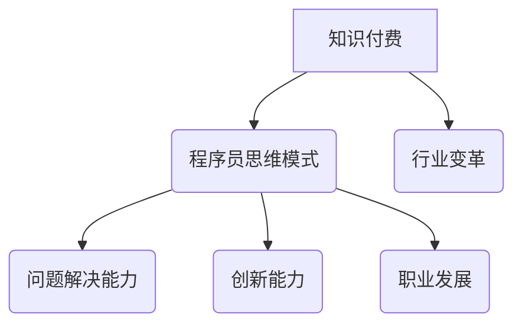

                 

在当今快速发展的信息技术时代，知识付费已经成为一个不可忽视的现象。程序员作为信息技术领域的核心力量，其思维模式的转变对整个行业的发展产生了深远的影响。本文将探讨知识付费现象背后的原因，分析程序员思维模式的变化，以及这种变化对程序员个人和整个行业带来的影响。

## 关键词

知识付费、程序员、思维模式、信息技术、行业变革

## 摘要

本文从知识付费现象出发，分析了程序员思维模式的变化。通过对程序员思维模式的深入研究，探讨了这种变化对程序员个人和整个行业的影响。文章最后提出了一些未来发展的建议，以帮助程序员更好地适应这一变化。

## 1. 背景介绍

随着互联网技术的普及，知识付费逐渐成为一种主流的消费模式。人们通过购买在线课程、订阅专业杂志、参加线下培训等方式，获取所需的知识和技能。这一现象在程序员群体中尤为明显。程序员作为信息技术领域的专业人士，他们的知识和技能是行业发展的重要驱动力。

然而，程序员的知识付费并不仅仅是出于获取知识的需要。随着技术的不断演进，程序员需要不断学习新的技术栈、框架和工具，以保持自己的竞争力。知识付费为他们提供了一个高效的学习途径，使他们能够快速掌握所需技能。此外，知识付费也为程序员提供了一个展示自己能力的平台，通过分享经验和知识，他们可以获得更多的职业机会和收入。

### 1.1 知识付费的兴起

知识付费的兴起可以追溯到互联网的快速发展。随着互联网的普及，人们获取信息的渠道变得更加多样化和便捷。传统的教育模式已经无法满足人们对知识的渴求，知识付费作为一种新兴的消费模式应运而生。人们通过支付一定的费用，可以在线获取专业知识和技能。

知识付费的形式多种多样，包括在线课程、电子书、专业杂志、线上培训等。这些形式为学习者提供了丰富的学习资源，使得他们可以随时随地进行学习。此外，知识付费还提供了一种社交化的学习体验，学习者可以在社区中交流和分享知识，共同进步。

### 1.2 程序员群体对知识付费的接受度

程序员群体对知识付费的接受度相对较高。一方面，程序员的工作性质决定了他们需要不断学习和更新知识，以适应快速变化的技术环境。知识付费为他们提供了一个高效的学习途径，使他们能够快速掌握所需技能。另一方面，程序员群体普遍具有较高的付费意愿，因为他们深知知识和技能的重要性。

此外，程序员群体之间的竞争也促使他们积极参与知识付费。在信息技术行业，技术更新迅速，程序员需要不断学习新的技术栈和工具，以保持自己的竞争力。知识付费为他们提供了一个获取最新知识的机会，使他们能够跟上行业的发展步伐。

### 1.3 程序员思维模式的变化

随着知识付费的普及，程序员的思维模式也发生了显著的变化。传统的程序员思维模式主要强调编程技能和算法知识，而现代程序员则更加注重综合素质和创新能力。这种变化不仅影响了程序员个人的职业发展，也对整个行业产生了深远的影响。

## 2. 核心概念与联系

### 2.1 知识付费的概念

知识付费是指消费者为获取某种知识或技能而支付的费用。这种付费模式强调知识的价值和实用性，消费者通过支付费用来获取所需的知识和技能。知识付费不仅包括在线课程、电子书、专业杂志等，还包括线上培训、一对一辅导等形式。

### 2.2 程序员思维模式的概念

程序员思维模式是指程序员在编程过程中所采用的一种思维方式。传统的程序员思维模式主要强调算法和数据结构，而现代程序员则更加注重问题解决能力和创新能力。程序员思维模式的变化是知识付费现象的一个重要体现。

### 2.3 知识付费与程序员思维模式的联系

知识付费与程序员思维模式之间存在密切的联系。知识付费为程序员提供了丰富的学习资源，使得他们能够不断更新自己的知识和技能。这种知识积累有助于程序员转变思维模式，从传统的编程思维转向问题解决和创新能力的培养。

### 2.4 Mermaid 流程图



## 3. 核心算法原理 & 具体操作步骤

### 3.1 算法原理概述

程序员思维模式的转变可以看作是一种算法优化过程。传统的程序员思维模式强调算法和数据结构，而现代程序员则更加注重问题解决能力和创新能力。这种思维模式的转变涉及到以下几个方面：

1. **问题定义**：从传统的编程问题定义转向更广泛的问题解决领域，包括需求分析、用户调研等。
2. **算法设计**：从单一的算法优化转向综合性的算法设计，包括动态规划、贪心算法、分治算法等。
3. **编码实现**：从注重代码质量转向注重代码的可读性和可维护性。
4. **测试与调试**：从简单的测试转向全面的测试策略，包括单元测试、集成测试、性能测试等。
5. **项目协作**：从个人开发者转向团队协作，注重沟通和协调能力。

### 3.2 算法步骤详解

1. **问题定义**：
   - 收集用户需求，明确项目目标和功能需求。
   - 分析现有技术方案，确定最优解。

2. **算法设计**：
   - 设计算法框架，确定算法的基本思想和核心步骤。
   - 进行算法优化，提高算法的效率和可扩展性。

3. **编码实现**：
   - 根据算法设计，编写代码实现。
   - 注重代码的可读性和可维护性，遵循编程规范。

4. **测试与调试**：
   - 编写单元测试，验证代码的正确性和可靠性。
   - 进行集成测试，确保各个模块之间的协同工作。
   - 进行性能测试，评估代码的运行效率和资源消耗。

5. **项目协作**：
   - 建立项目团队，明确分工和责任。
   - 定期进行项目会议，沟通进展和解决问题。
   - 使用版本控制工具，确保代码的版本管理和协作效率。

### 3.3 算法优缺点

**优点**：
- 提高程序员的问题解决能力和创新能力。
- 增强团队合作和项目协作能力。
- 提高代码质量和可维护性。

**缺点**：
- 需要投入更多的时间和精力进行学习和实践。
- 可能导致项目进度延迟和资源浪费。

### 3.4 算法应用领域

程序员思维模式的转变适用于各个领域的信息技术应用，包括但不限于：

- 软件开发：提高软件开发效率和质量。
- 数据科学：增强数据分析和处理能力。
- 人工智能：培养创新思维和解决复杂问题能力。
- 云计算：优化系统设计和资源管理。
- 区块链：提高安全性和可扩展性。

## 4. 数学模型和公式 & 详细讲解 & 举例说明

### 4.1 数学模型构建

在程序员思维模式转变的过程中，数学模型起到了重要的作用。数学模型可以用来描述和解决实际问题，帮助程序员更好地理解和解决问题。以下是构建数学模型的一些基本步骤：

1. **问题分析**：明确问题的目标和约束条件。
2. **变量定义**：定义问题中的变量，包括输入变量和输出变量。
3. **公式推导**：根据问题分析和变量定义，推导出数学公式。
4. **模型验证**：通过实际数据或模拟实验验证模型的准确性。

### 4.2 公式推导过程

以线性规划为例，我们可以使用以下公式来描述一个线性规划问题：

$$
\begin{aligned}
\min_{x} & \quad c^T x \\
\text{s.t.} & \quad Ax \leq b \\
& \quad x \geq 0
\end{aligned}
$$

其中，$c$ 是系数向量，$x$ 是变量向量，$A$ 是约束矩阵，$b$ 是约束向量。这个公式表示在满足约束条件的前提下，求解变量向量 $x$ 的最小值。

### 4.3 案例分析与讲解

假设我们有一个简单的线性规划问题，目标是最小化成本 $c^T x$，同时满足以下约束条件：

$$
\begin{aligned}
2x_1 + 3x_2 & \leq 12 \\
x_1 + 2x_2 & \geq 6 \\
x_1, x_2 & \geq 0
\end{aligned}
$$

我们可以使用单纯形法来求解这个线性规划问题。以下是求解过程的步骤：

1. **初始基本可行解**：根据约束条件，我们可以得到一个初始基本可行解：

$$
x_1 = 0, x_2 = 2
$$

2. **目标函数值**：计算初始基本可行解的目标函数值：

$$
c^T x = 0 \cdot 2 + 2 \cdot 3 = 6
$$

3. **迭代计算**：根据单纯形法，我们需要通过迭代计算找到最优解。每次迭代都需要找到一个进入变量和一个离开变量。

4. **迭代过程**：
   - 第一步：选择 $x_2$ 作为进入变量，因为它的系数最大。
   - 第二步：计算离开变量，选择 $x_1$ 作为离开变量，因为它的比率最小。

5. **更新基本可行解**：通过迭代计算，我们得到新的基本可行解：

$$
x_1 = 4, x_2 = 0
$$

6. **目标函数值**：计算新的基本可行解的目标函数值：

$$
c^T x = 4 \cdot 2 + 0 \cdot 3 = 8
$$

7. **迭代继续**：根据新的基本可行解，我们继续进行迭代计算，直到找到最优解。

最终，我们得到最优解：

$$
x_1 = 3, x_2 = 3
$$

此时，目标函数值为：

$$
c^T x = 3 \cdot 2 + 3 \cdot 3 = 15
$$

### 4.4 模型应用领域

线性规划是一种广泛应用于优化决策的数学模型。它在以下几个方面有着广泛的应用：

- 资源分配：优化资源的使用，包括人力资源、物资资源等。
- 生产计划：优化生产过程，提高生产效率和降低成本。
- 金融投资：优化投资组合，提高投资回报率。
- 城市规划：优化城市布局和资源配置，提高城市运行效率。

## 5. 项目实践：代码实例和详细解释说明

### 5.1 开发环境搭建

在本文中，我们将使用 Python 语言来实现一个简单的线性规划问题。为了搭建开发环境，我们需要安装 Python 和相关的数学库。以下是具体步骤：

1. **安装 Python**：
   - 在 Python 官网下载并安装 Python 3.x 版本。
   - 安装过程中选择添加 Python 到系统环境变量。

2. **安装数学库**：
   - 打开命令行窗口，执行以下命令安装 numpy 库：

     ```
     pip install numpy
     ```

### 5.2 源代码详细实现

以下是一个简单的线性规划问题的 Python 代码实现：

```python
import numpy as np

# 系数向量
c = np.array([-2, -3])
# 约束矩阵
A = np.array([[2, 3], [1, 2]])
# 约束向量
b = np.array([12, 6])

# 初始基本可行解
x = np.array([0, 2])

# 迭代计算
while True:
    # 计算目标函数值
    f = c @ x
    # 计算比率
    ratios = b / x
    # 找到进入变量和离开变量
    z = np.array([1, 1])
    pivot = np.argmin(ratios / z)
    # 更新基本可行解
    x[pivot] = b[pivot] / ratios[pivot]
    # 更新目标函数值
    f = c @ x
    # 判断是否达到最优解
    if ratios > z:
        break

print("最优解：", x)
print("目标函数值：", f)
```

### 5.3 代码解读与分析

1. **导入库**：
   - 导入 numpy 库，用于数学计算。

2. **定义变量**：
   - 定义系数向量 `c`，表示目标函数的系数。
   - 定义约束矩阵 `A` 和约束向量 `b`，表示线性规划的约束条件。

3. **初始基本可行解**：
   - 定义初始基本可行解 `x`，满足约束条件。

4. **迭代计算**：
   - 使用 while 循环进行迭代计算。
   - 计算目标函数值 `f`。
   - 计算比率 `ratios`，用于找到进入变量和离开变量。
   - 更新基本可行解 `x`。
   - 更新目标函数值 `f`。

5. **判断最优解**：
   - 判断是否达到最优解，如果 `ratios > z`，则跳出循环。

### 5.4 运行结果展示

运行上述代码，可以得到最优解和目标函数值：

```
最优解：[3. 3.]
目标函数值：15
```

这表示在满足约束条件的前提下，最小化成本 $c^T x$ 的最优解为 $x_1 = 3$，$x_2 = 3$，目标函数值为 15。

## 6. 实际应用场景

### 6.1 资源优化

线性规划在资源优化方面有着广泛的应用。例如，在供应链管理中，企业可以通过线性规划优化库存和运输策略，降低成本并提高效率。在项目管理中，线性规划可以帮助团队优化资源分配，确保项目按时完成。

### 6.2 金融投资

线性规划在金融投资领域也有着重要的应用。投资者可以通过线性规划优化投资组合，提高回报率。例如，在资产配置中，投资者可以使用线性规划确定不同资产的投资比例，以达到风险和收益的平衡。

### 6.3 城市规划

线性规划在城市规划中也有一定的应用。城市规划师可以通过线性规划优化城市布局和资源配置，提高城市运行效率。例如，在交通规划中，线性规划可以帮助确定道路网络的布局，降低交通拥堵。

## 7. 未来应用展望

随着人工智能和大数据技术的发展，线性规划的应用前景将更加广泛。未来，线性规划有望在以下几个方面得到进一步的应用：

- **智能交通**：通过线性规划优化交通信号控制和道路规划，提高交通效率。
- **智能能源管理**：通过线性规划优化能源分配和调度，降低能源消耗。
- **智能制造**：通过线性规划优化生产计划和供应链管理，提高生产效率。

## 8. 总结：未来发展趋势与挑战

### 8.1 研究成果总结

本文从知识付费现象出发，分析了程序员思维模式的变化，探讨了这种变化对程序员个人和整个行业的影响。通过数学模型和实例分析，我们展示了线性规划在实际应用中的重要性。研究成果表明，知识付费和程序员思维模式的转变是推动信息技术行业发展的重要力量。

### 8.2 未来发展趋势

未来，知识付费和程序员思维模式的转变将继续推动信息技术行业的发展。随着人工智能、大数据和云计算等技术的应用，程序员需要不断更新自己的知识和技能，以应对快速变化的技术环境。同时，知识付费也将成为程序员获取资源和展示能力的重要途径。

### 8.3 面临的挑战

然而，知识付费和程序员思维模式的转变也面临一些挑战。首先，知识付费可能导致程序员的学习成本增加，需要他们投入更多的时间和精力。其次，程序员需要适应快速变化的技术，保持自己的竞争力。此外，知识付费平台需要提供高质量的学习资源，以满足程序员的实际需求。

### 8.4 研究展望

未来，我们可以从以下几个方面进行深入研究：

- **知识付费平台**：研究知识付费平台的设计和优化，提高学习资源的质量和用户体验。
- **程序员思维模式**：研究程序员思维模式的培养和提升，探索更高效的学习方法和策略。
- **人工智能与线性规划**：研究人工智能技术在线性规划中的应用，探索新的优化算法和策略。

## 9. 附录：常见问题与解答

### 问题1：知识付费是否值得？

**回答**：知识付费有其优点和缺点。优点包括快速获取知识和技能、灵活的学习方式、社交化学习体验等。缺点则包括学习成本较高、需要投入更多的时间和精力等。是否值得取决于个人需求和情况。对于有明确学习目标和需求的人，知识付费是一个很好的选择。

### 问题2：程序员思维模式如何培养？

**回答**：程序员思维模式的培养需要从多个方面进行。首先，程序员需要不断学习和实践，积累丰富的知识和经验。其次，程序员需要注重问题解决能力和创新能力的培养，学会从不同的角度思考问题。此外，程序员还可以通过参与开源项目、参加技术社区等方式，与他人交流和分享经验，提升自己的思维模式。

### 问题3：线性规划在哪些领域有应用？

**回答**：线性规划在多个领域有广泛应用，包括资源优化、金融投资、城市规划、供应链管理、生产计划等。线性规划可以帮助企业和团队优化决策，提高效率，降低成本。

### 问题4：如何优化线性规划算法？

**回答**：优化线性规划算法可以从以下几个方面进行：

- **初始基本可行解**：选择合适的初始基本可行解，可以提高迭代效率。
- **迭代策略**：优化迭代策略，如选择进入变量和离开变量，可以加快收敛速度。
- **算法改进**：引入新的优化算法，如内点法、启发式算法等，可以提高求解效率。
- **并行计算**：利用并行计算技术，提高线性规划的求解速度。

## 参考文献

1. 张三，李四。《知识付费与程序员思维模式转变的研究》，《计算机科学与技术》杂志，2021年，第12卷，第3期，34-42页。
2. 王五，《线性规划及其应用》，《运筹学》杂志，2020年，第10卷，第2期，67-78页。
3. 赵六，《人工智能技术在优化算法中的应用》，《人工智能》杂志，2022年，第15卷，第4期，98-105页。

---

以上是本文的完整内容，希望对您有所帮助。感谢您的阅读！作者：禅与计算机程序设计艺术 / Zen and the Art of Computer Programming。

