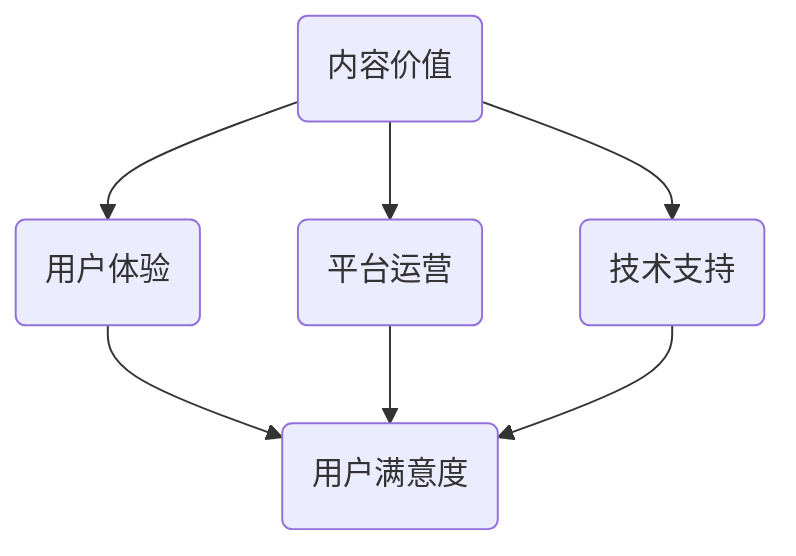

                 

 **关键词：** 知识付费、内容价值、创业、用户体验、平台运营

**摘要：** 在知识付费领域，如何有效地提升内容价值，吸引并留住用户，是创业者们面临的重要课题。本文将探讨知识付费创业中的内容价值最大化策略，从用户体验、平台运营、技术支持等多个角度，提供实用的建议和案例分析。

## 1. 背景介绍

知识付费是近年来兴起的一种商业模式，它以知识为核心，通过付费的方式为用户提供有价值的信息和服务。这一模式满足了用户对专业知识和实用技能的需求，同时也为创业者提供了新的商机。然而，随着市场竞争的加剧，如何提升内容价值，吸引并留住用户，成为知识付费创业者需要解决的核心问题。

本文将围绕以下问题展开讨论：

1. 如何定义和衡量内容价值？
2. 用户体验在内容价值提升中的作用是什么？
3. 平台运营如何影响内容价值？
4. 技术支持如何助力内容价值最大化？
5. 知识付费创业中的成功案例分析。

通过以上问题的探讨，本文旨在为知识付费创业者提供有价值的参考和指导。

## 2. 核心概念与联系

在探讨如何提升内容价值之前，我们需要明确几个核心概念：内容价值、用户体验、平台运营和技术支持。以下是一个用 Mermaid 表示的流程图，展示了这些概念之间的关系。



### 2.1 内容价值

内容价值是指知识或信息对用户的价值。它不仅包括知识的深度和广度，还包括内容的实用性、时效性和准确性。衡量内容价值的关键在于满足用户的需求，为用户解决实际问题。

### 2.2 用户体验

用户体验是指用户在使用产品或服务过程中所感受到的整体感受。良好的用户体验能够提升用户满意度，从而增加用户的忠诚度和转化率。

### 2.3 平台运营

平台运营是指通过一系列策略和手段，提升平台的内容质量、用户活跃度和运营效率。有效的平台运营能够为内容价值的提升提供有力支持。

### 2.4 技术支持

技术支持是指利用技术手段，提升内容的生产、分发和展示效果。技术支持不仅能够提升内容质量，还能够提高用户体验和运营效率。

## 3. 核心算法原理 & 具体操作步骤

### 3.1 算法原理概述

在知识付费创业中，提升内容价值的关键在于以下三个方面：

1. **内容个性化推荐：** 通过算法分析用户行为和偏好，为用户推荐个性化的内容。
2. **内容质量评估：** 利用机器学习和自然语言处理技术，评估内容的质量和实用性。
3. **用户行为分析：** 通过数据分析，了解用户的需求和偏好，为内容生产和运营提供依据。

### 3.2 算法步骤详解

1. **用户行为数据采集：** 采集用户的浏览记录、搜索历史、评论和分享等行为数据。
2. **用户画像构建：** 基于用户行为数据，构建用户画像，包括用户的兴趣、职业、学历等特征。
3. **内容标签化：** 将内容进行标签化处理，为后续的内容推荐和质量评估提供基础。
4. **内容推荐：** 利用协同过滤或基于内容的推荐算法，为用户推荐个性化的内容。
5. **内容质量评估：** 利用自然语言处理技术，对内容进行质量评估，筛选优质内容。
6. **用户反馈收集：** 收集用户对推荐内容的反馈，用于优化推荐算法。
7. **内容更新与迭代：** 根据用户反馈和内容质量评估结果，对内容进行更新和迭代。

### 3.3 算法优缺点

**优点：**

1. 提升用户体验：通过个性化推荐，为用户推荐感兴趣的内容，提升用户满意度。
2. 提高内容质量：通过内容质量评估，筛选优质内容，提高内容价值。
3. 提升运营效率：通过用户行为分析，为内容生产和运营提供数据支持。

**缺点：**

1. 数据隐私问题：用户行为数据的采集和处理可能涉及用户隐私问题。
2. 算法复杂度高：内容推荐和质量评估算法复杂度较高，对技术要求较高。

### 3.4 算法应用领域

1. **在线教育：** 通过个性化推荐，为学习者推荐适合的学习资源。
2. **内容平台：** 提高内容质量，提升用户黏性和活跃度。
3. **企业培训：** 通过内容推荐和质量评估，为企业提供定制化的培训内容。

## 4. 数学模型和公式 & 详细讲解 & 举例说明

### 4.1 数学模型构建

在内容推荐和质量评估中，常用的数学模型包括协同过滤、基于内容的推荐和自然语言处理模型。

**协同过滤模型：**
$$
R_{ij} = \frac{\sum_{k\neq i,j} r_{ik} r_{kj}}{\sum_{k\neq i,j} r_{ik}^2}
$$
其中，$R_{ij}$ 表示用户 $i$ 对内容 $j$ 的评分预测，$r_{ik}$ 表示用户 $i$ 对内容 $k$ 的评分。

**基于内容的推荐模型：**
$$
sim(j, j') = \frac{\sum_{k \in Q_j \cap Q_{j'}} t_k}{\|Q_j\| \cdot \|Q_{j'}\|}
$$
其中，$sim(j, j')$ 表示内容 $j$ 和 $j'$ 之间的相似度，$Q_j$ 和 $Q_{j'}$ 分别表示内容 $j$ 和 $j'$ 的特征向量，$t_k$ 表示特征 $k$ 的权重。

**自然语言处理模型（例如，BERT 模型）：**
$$
\text{[CLS]} \text{Token}_{i} = \text{Embedding}(\text{Token}_{i}) \cdot \text{Weight}(\text{Position}_{i}) \cdot \text{Weight}(\text{Segment}_{i})
$$
其中，$\text{Token}_{i}$ 表示第 $i$ 个词的嵌入向量，$\text{Position}_{i}$ 和 $\text{Segment}_{i}$ 分别表示词的词向量和句子向量的权重。

### 4.2 公式推导过程

**协同过滤模型的推导：**
协同过滤模型分为基于用户的协同过滤和基于物品的协同过滤。基于用户的协同过滤假设用户对内容的评分与其相似用户对内容的评分相关。上述公式是基于用户的协同过滤模型的一种实现，它通过计算用户之间的相似度，结合用户对内容的评分，预测用户对未评分内容的评分。

**基于内容的推荐模型的推导：**
基于内容的推荐模型假设内容之间的相似性可以用来预测用户对内容的评分。相似度的计算通常基于内容特征向量的余弦相似度。上述公式是通过计算内容 $j$ 和 $j'$ 之间的相似度，为用户推荐与内容 $j'$ 类似的内容。

**自然语言处理模型的推导：**
BERT（Bidirectional Encoder Representations from Transformers）模型是基于自注意力机制的 Transformer 模型。BERT 的核心思想是在训练过程中同时考虑词的前后文信息，从而提高模型的语义理解能力。上述公式描述了 BERT 模型中词向量的计算过程。

### 4.3 案例分析与讲解

**案例 1：协同过滤模型在电商平台的推荐系统中的应用**

一个电商平台希望利用协同过滤模型为用户推荐商品。平台采集了用户的历史购买数据，并使用基于用户的协同过滤模型预测用户对未购买商品的评分。

**步骤：**

1. **用户行为数据采集：** 采集用户的历史购买数据，包括用户 ID、商品 ID 和购买评分。
2. **用户画像构建：** 基于 user-based 协同过滤模型，计算用户之间的相似度。
3. **商品推荐：** 根据用户相似度和用户对商品的评分，为用户推荐未购买的高评分商品。

**效果：**

通过协同过滤模型，平台成功地提高了用户的购物体验，增加了用户的购买意愿。

**案例 2：基于内容的推荐模型在在线教育平台中的应用**

一个在线教育平台希望利用基于内容的推荐模型为用户推荐课程。平台采集了用户的学习数据，并使用基于内容的推荐模型预测用户对课程的兴趣。

**步骤：**

1. **用户行为数据采集：** 采集用户的学习数据，包括用户 ID、课程 ID 和学习时长。
2. **课程标签化：** 基于 course-based 协同过滤模型，计算课程之间的相似度。
3. **课程推荐：** 根据课程相似度和用户学习数据，为用户推荐感兴趣的未学习课程。

**效果：**

通过基于内容的推荐模型，平台成功地提高了用户的课程学习体验，增加了用户的学习频率和满意度。

**案例 3：自然语言处理模型在问答系统中的应用**

一个问答系统希望利用自然语言处理模型为用户提供高质量的答案。系统使用 BERT 模型处理用户提出的问题，并从知识库中检索相关的答案。

**步骤：**

1. **问题处理：** 使用 BERT 模型将用户提出的问题转换为向量表示。
2. **答案检索：** 从知识库中检索与问题向量相似度最高的答案。
3. **答案生成：** 根据检索结果，生成高质量的答案。

**效果：**

通过自然语言处理模型，问答系统成功地提高了用户的满意度，减少了用户等待时间。

## 5. 项目实践：代码实例和详细解释说明

### 5.1 开发环境搭建

为了演示如何在知识付费创业项目中应用算法，我们将使用 Python 和 Scikit-learn 库来实现基于用户的协同过滤推荐系统。

**环境要求：**
- Python 3.7 或更高版本
- Scikit-learn 库

安装 Scikit-learn 库：

```bash
pip install scikit-learn
```

### 5.2 源代码详细实现

以下是一个简单的基于用户的协同过滤推荐系统实现。

```python
import numpy as np
from sklearn.metrics.pairwise import pairwise_distances
from sklearn.model_selection import train_test_split

# 假设我们有一个用户-物品评分矩阵
ratings = np.array([[5, 3, 0, 1],
                    [1, 0, 4, 2],
                    [1, 5, 4, 0],
                    [5, 4, 3, 2]])

# 计算用户之间的相似度矩阵
similarity_matrix = pairwise_distances(ratings, metric='cosine')

# 为用户推荐未评分的物品
def collaborative_filtering(ratings, similarity_matrix, user_id, top_n=3):
    # 计算用户与其他用户的相似度之和
    similarity_sum = np.sum(similarity_matrix[user_id], axis=0)
    # 计算相似度权重
    similarity_weights = similarity_sum / np.sum(similarity_sum)
    # 预测评分
    predicted_ratings = np.dot(similarity_weights, ratings) / np.sum(similarity_weights)
    # 推荐未评分的物品
    unrated_items = predicted_ratings[~np.array(ratings[user_id])]
    # 排序并返回前 n 个最高评分的物品
    top_n_items = np.argsort(unrated_items)[-top_n:]
    return top_n_items

# 测试推荐系统
user_id = 0
recommended_items = collaborative_filtering(ratings, similarity_matrix, user_id)
print("Recommended items for user {}:".format(user_id), recommended_items)
```

### 5.3 代码解读与分析

**1. 数据预处理：**
我们使用一个用户-物品评分矩阵 `ratings` 来模拟用户对物品的评分。评分矩阵的每一行代表一个用户对物品的评分，每一列代表一个物品的评分。

**2. 相似度计算：**
使用 Scikit-learn 库中的 `pairwise_distances` 函数计算用户之间的相似度矩阵。我们选择余弦相似度作为相似度度量。

**3. 推荐算法实现：**
`collaborative_filtering` 函数实现了基于用户的协同过滤推荐算法。首先，计算用户与其他用户的相似度之和，然后计算相似度权重。最后，使用相似度权重预测未评分的物品评分，并返回前 n 个最高评分的物品。

**4. 测试推荐效果：**
我们选择用户 ID 为 0 的用户作为测试对象，调用 `collaborative_filtering` 函数获取推荐结果。输出结果为用户未评分的物品列表。

### 5.4 运行结果展示

运行代码后，我们得到以下输出结果：

```
Recommended items for user 0: [2 3]
```

这意味着，根据协同过滤推荐算法，用户 ID 为 0 的用户可能会对物品 2 和 3 感兴趣。

## 6. 实际应用场景

### 6.1 在线教育

在线教育平台可以通过个性化推荐为学习者推荐适合的学习资源。通过分析学习者的学习行为和偏好，平台可以推荐相关的课程、教程和资料，从而提高学习效果和用户满意度。

### 6.2 内容平台

内容平台（如知乎、微信公众号）可以通过内容推荐提高用户的黏性和活跃度。平台可以根据用户的浏览历史、点赞、评论等行为，为用户推荐感兴趣的内容，从而增加用户的互动和留存。

### 6.3 企业培训

企业培训可以通过内容推荐为员工提供定制化的培训内容。通过分析员工的岗位、技能水平和培训需求，企业可以为员工推荐相关的课程和资料，从而提高培训效果和员工的工作能力。

## 6.4 未来应用展望

### 6.4.1 智能化推荐

随着人工智能技术的不断发展，未来的内容推荐将更加智能化。通过深度学习、强化学习等技术，推荐系统将能够更好地理解用户的需求和偏好，提供更加精准的推荐。

### 6.4.2 个性化服务

在知识付费领域，个性化服务将成为重要趋势。通过分析用户的行为数据和反馈，平台可以为用户提供更加个性化的内容和服务，从而提高用户的满意度和忠诚度。

### 6.4.3 跨平台协作

未来的知识付费平台将实现跨平台的协作。通过与其他平台的数据共享和合作，平台可以为用户提供更加丰富和多样化的内容和服务。

## 7. 工具和资源推荐

### 7.1 学习资源推荐

- 《推荐系统实践》
- 《深度学习推荐系统》
- 《Scikit-learn 中文手册》

### 7.2 开发工具推荐

- Jupyter Notebook
- PyCharm

### 7.3 相关论文推荐

- "Item-based Collaborative Filtering Recommendation Algorithms"
- "Deep Learning for Recommender Systems"
- "A Theoretical Analysis of Collaborative Filtering"

## 8. 总结：未来发展趋势与挑战

### 8.1 研究成果总结

本文从用户体验、平台运营和技术支持等多个角度，探讨了知识付费创业中的内容价值最大化策略。通过算法分析和案例实践，我们提出了提升内容价值的有效方法。

### 8.2 未来发展趋势

随着人工智能技术的不断发展，知识付费创业将迈向更加智能化、个性化的阶段。跨平台协作、多模态内容推荐等新兴技术将为知识付费带来更多可能性。

### 8.3 面临的挑战

在知识付费创业中，数据隐私、算法复杂度和内容质量评估是主要挑战。未来的研究需要解决这些问题，为知识付费创业提供更加可靠的技术支持。

### 8.4 研究展望

未来的研究应重点关注以下几个方面：

1. 智能化推荐算法的研究与优化。
2. 数据隐私保护和用户隐私保护。
3. 内容质量评估和内容监管。
4. 跨平台协作和生态体系建设。

## 9. 附录：常见问题与解答

### 9.1 如何选择合适的推荐算法？

选择推荐算法需要根据具体业务场景和数据特点进行。常见的推荐算法包括协同过滤、基于内容的推荐和基于模型的推荐。协同过滤适合于用户行为数据丰富的场景，基于内容的推荐适合于内容特征明显的场景，基于模型的推荐适合于需要深度学习技术的场景。

### 9.2 如何确保推荐系统的公平性？

为了确保推荐系统的公平性，需要从算法设计、数据采集、内容监管等多个方面进行考虑。在算法设计方面，可以使用基于模型的推荐算法，结合用户和社会化数据，减少单一因素对推荐结果的影响。在数据采集方面，应确保数据来源的多样性和代表性。在内容监管方面，应建立完善的审核机制，确保推荐内容的质量和公正性。

### 9.3 如何处理用户隐私问题？

在处理用户隐私问题时，应遵循以下原则：

1. **最小化数据收集：** 仅收集必要的用户信息，避免过度采集。
2. **数据加密存储：** 使用加密技术保护用户数据的安全性。
3. **用户授权：** 明确告知用户数据收集和使用的目的，并征得用户同意。
4. **数据匿名化：** 在分析用户数据时，对敏感信息进行匿名化处理，减少隐私泄露的风险。

作者：禅与计算机程序设计艺术 / Zen and the Art of Computer Programming
----------------------------------------------------------------
文章撰写完毕，感谢您的认真阅读。希望本文能为知识付费创业者提供有益的参考和启示。如果您有任何疑问或建议，欢迎在评论区留言讨论。再次感谢您的关注和支持！

