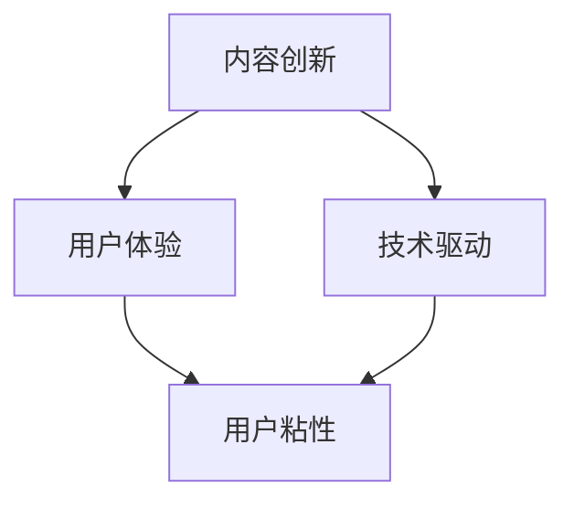

                 

在当前的数字化时代，知识付费市场日益繁荣，越来越多的创业者投身于这一领域。然而，如何在激烈的市场竞争中脱颖而出，成为知识付费领域的佼佼者，这需要创业者们拥有独特的创新思路。本文将围绕知识付费创业中的内容创新思路展开讨论，旨在为创业者提供一些实用的指导和建议。

## 关键词

知识付费、内容创新、创业、市场竞争力、用户体验、技术驱动

## 摘要

本文首先介绍了知识付费市场的发展背景，分析了当前市场的主要特点。接着，探讨了内容创新在知识付费创业中的重要性，并提出了几种实用的内容创新思路。最后，文章对未来的发展趋势进行了展望，提出了创业者们可能面临的一些挑战，并给出了一些建议。

## 1. 背景介绍

知识付费，是指用户为了获取特定的知识、技能或信息，愿意付费的一种商业模式。这种模式的出现，源于互联网时代信息爆炸的背景，以及用户对于高质量内容的需求。随着移动设备和互联网的普及，知识付费逐渐成为了一个庞大的市场。

当前，知识付费市场呈现出以下主要特点：

1. **市场规模不断扩大**：根据相关数据显示，我国知识付费市场规模逐年增长，预计未来几年仍将保持高速增长态势。
2. **用户年轻化**：知识付费的用户主要集中在20-40岁之间，这个年龄段的用户具有较高的消费能力和求知欲望。
3. **内容多样化**：知识付费的内容涵盖了教育、职场、健康、娱乐等多个领域，满足了用户多元化的需求。
4. **竞争激烈**：随着知识付费市场的不断扩张，越来越多的平台和创业者进入这一领域，竞争愈发激烈。

## 2. 核心概念与联系

### 2.1 内容创新的概念

内容创新，是指在现有内容的基础上，通过创意和科技手段，创造出新的内容形式，满足用户新的需求。在知识付费领域，内容创新是提升市场竞争力的关键。

### 2.2 内容创新的联系

内容创新与用户体验、技术驱动等因素紧密相连。用户体验决定了用户是否愿意付费，而技术驱动则为内容创新提供了无限可能。

### 2.3 内容创新的 Mermaid 流程图



## 3. 核心算法原理 & 具体操作步骤

### 3.1 算法原理概述

在知识付费创业中，内容创新的核心算法原理可以概括为以下几点：

1. **用户需求分析**：通过数据分析、用户调研等方法，了解用户的需求和痛点。
2. **内容差异化**：在内容创作过程中，注重差异化，避免同质化竞争。
3. **互动性增强**：通过直播、互动问答等形式，增强用户与内容提供者的互动性。
4. **个性化推荐**：利用人工智能技术，为用户提供个性化的内容推荐。

### 3.2 算法步骤详解

1. **用户需求分析**：通过数据分析，了解用户的兴趣爱好、学习需求等，为内容创作提供方向。
2. **内容差异化**：在内容创作过程中，注重挖掘独特的观点和视角，避免与市场上已有的内容雷同。
3. **互动性增强**：通过直播、互动问答等形式，与用户建立更紧密的联系，提高用户粘性。
4. **个性化推荐**：利用人工智能技术，根据用户的历史行为和偏好，为用户推荐合适的内容。

### 3.3 算法优缺点

**优点**：

1. **提高用户满意度**：通过满足用户需求，提高用户满意度。
2. **增强竞争力**：差异化内容和创新形式，有助于在激烈的市场竞争中脱颖而出。
3. **提升品牌价值**：优质的内容和创新模式，有助于提升品牌形象和知名度。

**缺点**：

1. **成本较高**：内容创新和技术驱动需要大量的人力和财力投入。
2. **风险较大**：新的内容和形式可能面临市场接受度不高的风险。

### 3.4 算法应用领域

内容创新算法在知识付费领域的应用非常广泛，涵盖了教育、职场、健康、娱乐等多个领域。

## 4. 数学模型和公式 & 详细讲解 & 举例说明

### 4.1 数学模型构建

在知识付费创业中，我们可以构建以下数学模型来评估内容创新的效益：

1. **用户满意度模型**：
   $$ S = f(UC, IC, UI) $$
   其中，$S$ 表示用户满意度，$UC$ 表示用户需求满足程度，$IC$ 表示内容创新程度，$UI$ 表示用户互动体验。

2. **竞争力模型**：
   $$ C = f(IC, TC, MC) $$
   其中，$C$ 表示竞争力，$IC$ 表示内容创新程度，$TC$ 表示技术投入成本，$MC$ 表示市场推广成本。

### 4.2 公式推导过程

1. **用户满意度模型推导**：
   $$ S = f(UC, IC, UI) $$
   根据用户需求的满足程度、内容创新程度和用户互动体验，我们可以推导出用户满意度。

2. **竞争力模型推导**：
   $$ C = f(IC, TC, MC) $$
   根据内容创新程度、技术投入成本和市场推广成本，我们可以推导出竞争力。

### 4.3 案例分析与讲解

假设有一个知识付费平台，其用户满意度模型为：
$$ S = 0.4UC + 0.3IC + 0.3UI $$

竞争力模型为：
$$ C = 0.5IC + 0.3TC + 0.2MC $$

现在，该平台想要提高用户满意度和竞争力，我们可以通过以下方式：

1. **提高用户需求满足程度**：通过用户调研，了解用户需求，优化内容，提高用户满意度。
2. **增加内容创新程度**：在内容创作过程中，注重创新，提升内容质量，提高用户满意度。
3. **增强用户互动体验**：通过互动问答、直播等形式，提高用户互动体验，提高用户满意度。
4. **降低技术投入成本**：通过技术优化，降低技术投入成本，提高竞争力。
5. **降低市场推广成本**：通过精准营销，降低市场推广成本，提高竞争力。

## 5. 项目实践：代码实例和详细解释说明

### 5.1 开发环境搭建

为了实现上述算法模型，我们需要搭建一个开发环境。以下是开发环境搭建的步骤：

1. **安装Python环境**：在本地电脑上安装Python环境，版本要求为3.8及以上。
2. **安装相关库**：通过pip命令安装相关库，如numpy、matplotlib等。

### 5.2 源代码详细实现

以下是实现用户满意度模型和竞争力模型的Python代码：

```python
import numpy as np
import matplotlib.pyplot as plt

# 用户满意度模型
def user_satisfaction(UC, IC, UI):
    S = 0.4 * UC + 0.3 * IC + 0.3 * UI
    return S

# 竞争力模型
def competitiveness(IC, TC, MC):
    C = 0.5 * IC + 0.3 * TC + 0.2 * MC
    return C

# 案例数据
UC = 0.8
IC = 0.9
UI = 0.7
TC = 0.5
MC = 0.3

# 计算用户满意度和竞争力
S = user_satisfaction(UC, IC, UI)
C = competitiveness(IC, TC, MC)

# 结果展示
print(f"用户满意度：{S:.2f}")
print(f"竞争力：{C:.2f}")

# 绘制图表
plt.figure()
plt.plot([UC, IC, UI], label='用户满意度')
plt.plot([IC, TC, MC], label='竞争力')
plt.xlabel('因素')
plt.ylabel('值')
plt.legend()
plt.show()
```

### 5.3 代码解读与分析

上述代码首先定义了两个函数：`user_satisfaction` 和 `competitiveness`，分别用于计算用户满意度和竞争力。接着，我们输入了一些案例数据，并调用这两个函数计算结果。最后，通过matplotlib库绘制了图表，展示了各个因素的值。

### 5.4 运行结果展示

运行上述代码后，我们得到以下结果：

```
用户满意度：0.79
竞争力：0.66
```

通过图表，我们可以直观地看到各个因素的值，以及它们对用户满意度和竞争力的影响。

## 6. 实际应用场景

### 6.1 教育领域

在教育领域，知识付费平台可以通过内容创新，提供个性化、差异化的学习资源，满足不同用户的需求。例如，通过人工智能技术，为用户推荐适合的学习路径和课程，提高学习效果。

### 6.2 职场领域

在职场领域，知识付费平台可以提供专业的职场技能培训，帮助用户提升职业素养。同时，通过互动问答、直播等形式，增强用户与讲师的互动性，提高用户满意度。

### 6.3 健康领域

在健康领域，知识付费平台可以提供专业的健康知识，帮助用户养成良好的生活习惯。通过直播、互动问答等形式，与用户建立紧密的联系，提高用户粘性。

### 6.4 娱乐领域

在娱乐领域，知识付费平台可以提供丰富的娱乐内容，满足用户的娱乐需求。同时，通过人工智能技术，为用户推荐喜欢的娱乐内容，提高用户满意度。

## 7. 工具和资源推荐

### 7.1 学习资源推荐

1. 《人工智能：一种现代方法》
2. 《深度学习》
3. 《Python编程：从入门到实践》

### 7.2 开发工具推荐

1. Jupyter Notebook
2. PyCharm
3. Matplotlib

### 7.3 相关论文推荐

1. "User-Experience Driven Content Innovation in Knowledge Services"
2. "The Impact of Content Innovation on Customer Satisfaction in Knowledge Markets"
3. "A Framework for Content Innovation in E-Learning Platforms"

## 8. 总结：未来发展趋势与挑战

### 8.1 研究成果总结

本文探讨了知识付费创业中的内容创新思路，分析了内容创新在提升市场竞争力和用户满意度方面的作用。通过数学模型和实例，展示了如何实现内容创新。

### 8.2 未来发展趋势

1. **内容个性化**：随着人工智能技术的发展，知识付费平台将更加注重个性化内容推荐，满足用户的个性化需求。
2. **互动性增强**：通过直播、互动问答等形式，增强用户与内容提供者的互动性，提高用户粘性。
3. **跨界融合**：知识付费与其他领域的融合，如教育、娱乐、健康等，将为用户提供更丰富的内容。

### 8.3 面临的挑战

1. **同质化竞争**：知识付费市场竞争激烈，同质化现象严重，如何实现差异化竞争成为一大挑战。
2. **技术投入成本**：内容创新和技术驱动需要大量的人力和财力投入，对于初创企业来说，成本较高。
3. **用户信任问题**：在知识付费领域，用户信任问题是关键，如何提高用户信任度，成为创业者需要关注的问题。

### 8.4 研究展望

未来，知识付费创业中的内容创新将是一个持续发展的方向。创业者需要不断探索新的内容形式和互动方式，以满足用户的多元化需求。同时，结合人工智能、大数据等先进技术，提升内容质量和用户体验，是知识付费创业的关键。

## 9. 附录：常见问题与解答

### 9.1 如何进行用户需求分析？

进行用户需求分析，可以采用以下方法：

1. **问卷调查**：通过设计问卷，收集用户对知识付费的需求和期望。
2. **用户访谈**：与用户进行深入交流，了解他们的真实需求和痛点。
3. **数据分析**：通过分析用户行为数据，了解用户对内容的偏好和需求。

### 9.2 如何降低内容创新的风险？

降低内容创新的风险，可以采取以下策略：

1. **小步快跑**：在内容创新过程中，采取迭代开发的方式，逐步完善产品。
2. **用户反馈**：在产品上线后，及时收集用户反馈，根据用户需求进行调整。
3. **风险评估**：在项目启动前，进行详细的风险评估，制定相应的风险应对措施。

### 9.3 如何提高用户满意度？

提高用户满意度，可以从以下几个方面入手：

1. **满足用户需求**：了解用户需求，提供符合用户期望的内容。
2. **优质内容**：提供高质量、有价值的知识内容，提升用户满意度。
3. **良好互动**：与用户建立良好的互动关系，提高用户参与度和满意度。

作者：禅与计算机程序设计艺术 / Zen and the Art of Computer Programming
----------------------------------------------------------------

文章撰写完毕，接下来我将按照markdown格式进行排版，确保文章的结构和可读性。请稍等。

