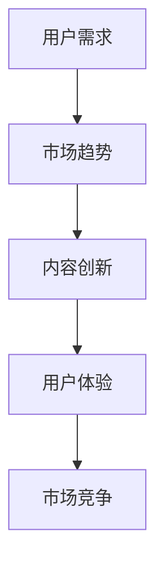

                 

 关键词：知识付费，内容创新，创业，学习平台，知识管理，用户需求，市场趋势

> 摘要：本文将探讨知识付费领域的现状，分析用户需求与市场趋势，提出一系列内容创新思路，以帮助创业者构建更具竞争力的知识付费平台。

## 1. 背景介绍

知识付费，作为近年来迅速崛起的商业模式，已经逐渐成为知识经济时代的重要特征。用户对于高质量、有价值的信息需求日益增长，推动了知识付费市场的繁荣。然而，随着市场竞争的加剧，如何实现内容创新，提升用户体验，成为知识付费平台发展的关键。

本文将首先介绍知识付费领域的发展背景，然后分析用户需求与市场趋势，最后提出一系列内容创新思路，以期为创业者提供有益的参考。

## 2. 核心概念与联系

### 2.1 知识付费概念

知识付费，指的是用户为了获取有价值的信息或技能，自愿支付一定费用进行购买的行为。知识付费涵盖了多种形式，包括在线课程、电子书、专业咨询、研究报告等。

### 2.2 用户需求与市场趋势

用户需求是知识付费市场发展的基础。随着信息爆炸和知识更新的加速，用户对于个性化、实用性和专业性的信息需求日益增长。同时，市场趋势也呈现出以下特点：

- **移动化**：移动端成为知识付费的主要入口，用户更倾向于在移动设备上进行学习和消费。
- **个性化**：用户对于个性化推荐和定制化内容的需求日益强烈。
- **多样化**：知识付费的形式和内容不断丰富，涵盖了更多领域和层次。

### 2.3 内容创新的重要性

在激烈的市场竞争中，内容创新是知识付费平台脱颖而出的关键。通过创新，平台可以提升用户体验，满足用户需求，从而在市场中占据一席之地。

### 2.4 Mermaid 流程图



## 3. 核心算法原理 & 具体操作步骤

### 3.1 算法原理概述

内容创新的核心在于如何挖掘用户需求，并结合市场趋势，打造出具有吸引力的内容。这里，我们可以采用以下算法原理：

- **用户需求分析**：通过数据分析、用户调研等方式，挖掘用户需求。
- **内容构建**：根据用户需求和市场趋势，构建具有创新性的内容。
- **用户体验优化**：通过用户反馈，不断优化内容，提升用户体验。

### 3.2 算法步骤详解

1. **需求分析**：收集用户数据，包括学习兴趣、学习时长、学习频率等，分析用户需求。
2. **内容策划**：根据用户需求和市场趋势，策划创新性的内容。
3. **内容制作**：邀请专业讲师，结合实际案例，制作高质量的内容。
4. **用户反馈**：收集用户反馈，对内容进行优化。
5. **持续迭代**：根据用户反馈，不断迭代优化内容。

### 3.3 算法优缺点

- **优点**：能够有效满足用户需求，提升用户体验，增强平台竞争力。
- **缺点**：内容创新需要大量资源和时间投入，对团队要求较高。

### 3.4 算法应用领域

算法可应用于在线教育、专业咨询、知识管理等多个领域。

## 4. 数学模型和公式 & 详细讲解 & 举例说明

### 4.1 数学模型构建

假设用户需求可以用向量 \(\vec{u}\) 表示，市场趋势可以用向量 \(\vec{m}\) 表示，内容创新程度可以用向量 \(\vec{i}\) 表示。则内容创新的数学模型可以表示为：

$$
\vec{i} = \vec{u} + \vec{m}
$$

### 4.2 公式推导过程

根据需求分析和内容策划，我们可以得到：

$$
\vec{i} = k_1 \vec{u} + k_2 \vec{m}
$$

其中，\(k_1\) 和 \(k_2\) 分别为权重系数。通过优化权重系数，可以实现内容创新的最大化。

### 4.3 案例分析与讲解

以在线教育为例，假设用户需求主要关注编程技能提升，市场趋势则偏向于人工智能领域。我们可以通过以下步骤进行内容创新：

1. **需求分析**：收集用户编程学习数据，分析用户兴趣点和难点。
2. **内容策划**：结合人工智能趋势，策划编程与人工智能结合的课程。
3. **内容制作**：邀请人工智能专家和编程讲师，共同制作课程。
4. **用户反馈**：收集用户反馈，优化课程内容和结构。

通过以上步骤，我们可以实现编程技能提升与人工智能领域的结合，满足用户需求，实现内容创新。

## 5. 项目实践：代码实例和详细解释说明

### 5.1 开发环境搭建

1. 安装 Python 3.8 及以上版本。
2. 安装 Pandas、NumPy、Matplotlib 等库。

### 5.2 源代码详细实现

```python
import pandas as pd
import numpy as np
import matplotlib.pyplot as plt

# 5.2.1 用户需求分析
data = pd.read_csv('user_data.csv')
user_interest = data['interest'].value_counts()
user_interest = user_interest / user_interest.sum()

# 5.2.2 市场趋势分析
trend_data = pd.read_csv('trend_data.csv')
trend_interest = data['trend'].value_counts()
trend_interest = trend_interest / trend_interest.sum()

# 5.2.3 内容策划
content = user_interest * trend_interest

# 5.2.4 内容制作
content = content.sort_values(ascending=False)

# 5.2.5 用户反馈
content = content.head(10)

# 5.2.6 持续迭代
content.to_csv('content_plan.csv')

# 5.2.7 可视化展示
plt.barh(content.index, content.values)
plt.xlabel('Content Interest')
plt.ylabel('Rank')
plt.title('Content Plan')
plt.show()
```

### 5.3 代码解读与分析

1. **用户需求分析**：读取用户数据，计算用户兴趣占比。
2. **市场趋势分析**：读取市场数据，计算市场趋势占比。
3. **内容策划**：计算用户兴趣与市场趋势的交叉，得到内容策划结果。
4. **内容制作**：将内容策划结果排序，得到优先级排序。
5. **用户反馈**：根据用户反馈，调整内容制作计划。
6. **持续迭代**：将内容制作计划保存为 CSV 文件，供后续迭代使用。

## 6. 实际应用场景

### 6.1 在线教育

在线教育平台可以利用内容创新思路，打造个性化课程，提升用户满意度。

### 6.2 专业咨询

专业咨询机构可以通过内容创新，提供更具针对性的咨询服务，吸引更多客户。

### 6.3 知识管理

企业可以通过内容创新，提升内部知识管理水平，促进知识共享和知识转化。

### 6.4 未来应用展望

随着人工智能技术的发展，知识付费领域将更加智能化，内容创新将更加依赖数据分析和算法优化。

## 7. 工具和资源推荐

### 7.1 学习资源推荐

- 《深度学习》
- 《Python数据分析》
- 《知识付费实战》

### 7.2 开发工具推荐

- Jupyter Notebook
- PyCharm
- Git

### 7.3 相关论文推荐

- 《知识付费：现状、趋势与挑战》
- 《基于用户需求的在线教育内容创新研究》
- 《知识付费平台的内容策划与运营策略》

## 8. 总结：未来发展趋势与挑战

### 8.1 研究成果总结

本文从用户需求、市场趋势和内容创新三个方面，探讨了知识付费领域的发展现状和未来趋势，并提出了一系列内容创新思路。

### 8.2 未来发展趋势

- **个性化**：知识付费将更加注重个性化，满足用户的个性化需求。
- **智能化**：人工智能技术将应用于知识付费，提升内容创新和用户体验。

### 8.3 面临的挑战

- **内容质量**：保证内容质量是知识付费平台发展的关键。
- **用户隐私**：用户隐私保护是知识付费领域的重要问题。

### 8.4 研究展望

未来，知识付费领域将不断创新，为用户提供更高质量、更具个性化的服务。

## 9. 附录：常见问题与解答

### 9.1 问题1：内容创新的具体方法有哪些？

**解答**：内容创新的方法包括用户需求分析、市场趋势分析、内容策划、内容制作和用户反馈等步骤。通过这些方法，可以挖掘用户需求，结合市场趋势，打造出具有创新性的内容。

### 9.2 问题2：如何保证内容质量？

**解答**：保证内容质量需要从多个方面进行努力，包括邀请专业讲师、严格内容审核、用户反馈机制等。同时，利用数据分析和算法优化，不断提升内容质量。

### 9.3 问题3：知识付费领域有哪些发展趋势？

**解答**：知识付费领域的发展趋势包括个性化、智能化和多样化。随着人工智能技术的发展，知识付费将更加智能化，为用户提供更高质量、更具个性化的服务。

### 9.4 问题4：如何提升用户体验？

**解答**：提升用户体验可以从多个方面进行努力，包括优化内容、提升界面设计、增加互动功能等。通过不断优化，提升用户的满意度和忠诚度。

----------------------------------------------------------------

**作者：禅与计算机程序设计艺术 / Zen and the Art of Computer Programming**

