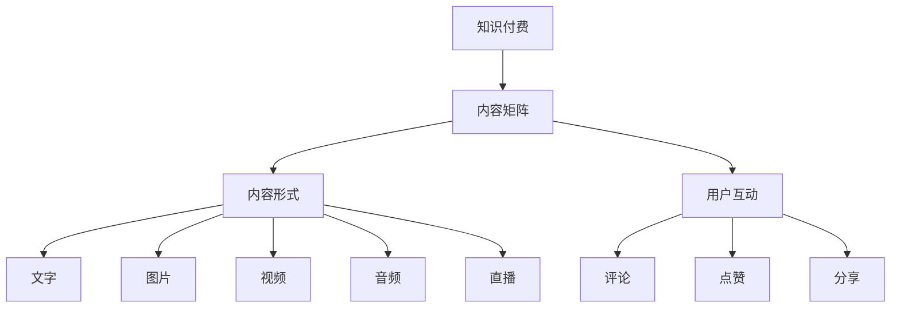

                 

关键词：知识付费、内容矩阵、创业、内容策略、架构设计

> 摘要：本文旨在探讨知识付费创业中的内容矩阵搭建，通过深入分析核心概念、算法原理、数学模型和实际项目实践，为创业者提供一份全面的内容策略指导。文章分为背景介绍、核心概念与联系、核心算法原理与操作步骤、数学模型与公式、项目实践、实际应用场景、工具和资源推荐、总结与展望等章节，旨在帮助读者理解和掌握知识付费创业中的内容矩阵搭建方法。

## 1. 背景介绍

知识付费作为一种新兴的商业模式，近年来在全球范围内得到了快速发展。它通过提供高质量、专业化的内容服务，满足了广大用户对于知识获取的需求。随着互联网技术的不断进步，尤其是移动互联网的普及，知识付费市场呈现出一片繁荣景象。

创业者在知识付费领域面临的挑战在于如何有效地搭建内容矩阵，以最大化内容的价值和影响力。内容矩阵的构建涉及到多个方面，包括内容来源、内容形式、内容传播策略、用户互动等。如何在这其中找到平衡点，是每一个知识付费创业者都需要思考和解决的问题。

本文将围绕这一主题，探讨知识付费创业中的内容矩阵搭建策略，包括核心概念、算法原理、数学模型和实际项目实践，旨在为创业者提供一份实用的指南。

## 2. 核心概念与联系

在搭建内容矩阵之前，我们需要了解一些核心概念，这些概念包括但不限于：

- **知识付费**：指用户为获取特定知识或技能所支付的费用。
- **内容矩阵**：指由多种内容形式组成的复杂结构，用于最大化内容的传播和用户参与。
- **内容形式**：包括文字、图片、视频、音频、直播等多种形式。
- **用户互动**：指用户与内容之间的互动，包括评论、点赞、分享等。

下面是一个用Mermaid绘制的核心概念与联系的流程图：



### 2.1 内容矩阵的定义与结构

**内容矩阵**是一个多层次、多维度的内容结构，它通过组合不同类型的内容形式和用户互动方式，形成一个有机的整体。内容矩阵的构建需要考虑以下几个方面：

- **层次结构**：内容矩阵通常分为多个层次，从顶层到底层，每一层都有其特定的功能和内容。
- **内容类型**：根据用户需求和内容特性，选择适合的内容形式，如文字、图片、视频等。
- **互动机制**：设计有效的用户互动机制，促进用户参与，提高内容的传播效果。
- **数据反馈**：通过数据分析，不断优化内容矩阵，提升用户体验和内容价值。

### 2.2 内容矩阵与知识付费的关系

内容矩阵是知识付费的重要组成部分。通过构建科学、合理的内容矩阵，创业者可以：

- **提高内容吸引力**：多样化的内容形式和互动机制，可以吸引更多用户关注。
- **提升用户体验**：针对性的内容层次和个性化的互动机制，可以提升用户的学习效果和满意度。
- **扩大内容影响力**：通过有效的传播策略，提高内容的曝光度和传播范围。

### 2.3 内容矩阵的构建步骤

构建内容矩阵一般遵循以下步骤：

1. **需求分析**：分析用户需求，确定内容类型和层次结构。
2. **内容策划**：根据需求分析，策划具体的内容形式和互动机制。
3. **内容制作**：根据策划方案，制作高质量的内容。
4. **内容发布**：将内容按照层次结构发布到相应的平台。
5. **用户互动**：设计互动机制，促进用户参与和内容传播。
6. **数据分析**：收集数据，分析用户反馈，优化内容矩阵。

## 3. 核心算法原理 & 具体操作步骤

### 3.1 算法原理概述

内容矩阵的构建依赖于一系列核心算法，这些算法包括内容推荐算法、用户行为分析算法、互动机制设计算法等。以下是这些算法的基本原理：

- **内容推荐算法**：通过分析用户的历史行为和内容特性，推荐用户可能感兴趣的内容。
- **用户行为分析算法**：通过跟踪用户的浏览、点赞、评论等行为，分析用户兴趣和需求。
- **互动机制设计算法**：根据用户行为分析结果，设计适合的互动机制，提高用户参与度。

### 3.2 算法步骤详解

**内容推荐算法步骤：**

1. **用户画像构建**：根据用户的历史行为和浏览记录，构建用户画像。
2. **内容特征提取**：对每个内容进行特征提取，包括文本、图片、视频等多维特征。
3. **相似度计算**：计算用户画像与内容特征之间的相似度。
4. **推荐排序**：根据相似度排序，推荐用户可能感兴趣的内容。

**用户行为分析算法步骤：**

1. **行为数据收集**：收集用户的浏览、点赞、评论等行为数据。
2. **行为模式识别**：通过机器学习算法，识别用户的行为模式。
3. **兴趣偏好分析**：根据行为模式，分析用户的兴趣和偏好。
4. **行为预测**：基于历史行为数据，预测用户未来的行为。

**互动机制设计算法步骤：**

1. **用户参与度分析**：分析用户参与度，包括评论、点赞、分享等。
2. **互动机制设计**：根据参与度分析结果，设计适合的互动机制。
3. **互动效果评估**：通过用户反馈和参与度数据，评估互动机制的效果。
4. **优化调整**：根据评估结果，不断优化互动机制。

### 3.3 算法优缺点

**内容推荐算法优点：**

- 提高内容吸引力：通过个性化推荐，提高用户对内容的兴趣。
- 提升用户体验：精准推荐用户感兴趣的内容，提高学习效果。

**内容推荐算法缺点：**

- 可能导致信息茧房：过度推荐相似内容，使用户视野受限。
- 数据隐私问题：用户行为数据可能涉及隐私问题。

**用户行为分析算法优点：**

- 提高内容质量：通过分析用户行为，优化内容结构，提高用户满意度。
- 提升用户互动：设计适合的互动机制，提高用户参与度。

**用户行为分析算法缺点：**

- 数据分析难度大：需要处理大量用户行为数据，分析过程复杂。
- 可能存在偏差：分析结果可能受到数据质量和算法模型的影响。

**互动机制设计算法优点：**

- 提高用户参与度：设计有趣的互动机制，吸引更多用户参与。
- 扩大内容影响力：通过用户互动，提高内容的传播效果。

**互动机制设计算法缺点：**

- 设计难度大：需要综合考虑用户需求、内容特性等多方面因素。
- 效果难以衡量：互动机制的效果难以量化，需要长期观察和评估。

### 3.4 算法应用领域

**内容推荐算法应用领域：**

- 知识付费平台：推荐用户可能感兴趣的知识课程。
- 社交媒体：推荐用户可能感兴趣的内容，提高用户活跃度。

**用户行为分析算法应用领域：**

- 购物平台：分析用户行为，优化商品推荐。
- 教育平台：分析用户行为，优化课程设计。

**互动机制设计算法应用领域：**

- 社交媒体：设计有趣的互动活动，提高用户活跃度。
- 游戏平台：设计互动游戏，提高用户粘性。

## 4. 数学模型和公式 & 详细讲解 & 举例说明

### 4.1 数学模型构建

在内容矩阵搭建过程中，我们需要构建多个数学模型，以支持内容推荐、用户行为分析和互动机制设计。以下是几个常见的数学模型：

**1. 内容推荐模型：**

假设用户集合为 \( U = \{u_1, u_2, ..., u_n\} \)，内容集合为 \( C = \{c_1, c_2, ..., c_m\} \)。用户 \( u_i \) 对内容 \( c_j \) 的兴趣度表示为 \( r_{ij} \)，推荐模型的目标是最大化用户满意度，即最大化 \( \sum_{i=1}^{n} \sum_{j=1}^{m} r_{ij} \)。

**2. 用户行为分析模型：**

假设用户 \( u_i \) 的行为集合为 \( B_i = \{b_{i1}, b_{i2}, ..., b_{ik}\} \)，行为 \( b_{ij} \) 的权重为 \( w_{ij} \)。用户 \( u_i \) 的行为模式表示为 \( P_i = \{p_{i1}, p_{i2}, ..., p_{ik}\} \)，模型的目标是识别用户的行为模式，即最大化 \( \sum_{j=1}^{k} p_{ij} w_{ij} \)。

**3. 互动机制设计模型：**

假设用户 \( u_i \) 的参与度集合为 \( D_i = \{d_{i1}, d_{i2}, ..., d_{il}\} \)，参与度 \( d_{ij} \) 的权重为 \( v_{ij} \)。互动机制 \( M_i \) 的效果表示为 \( E_i \)，模型的目标是设计有效的互动机制，即最大化 \( \sum_{j=1}^{l} d_{ij} v_{ij} E_i \)。

### 4.2 公式推导过程

**1. 内容推荐模型推导：**

假设用户 \( u_i \) 对内容 \( c_j \) 的兴趣度 \( r_{ij} \) 由以下公式计算：

\[ r_{ij} = \frac{\sum_{k=1}^{n} \text{similarity}(u_i, u_k) \cdot \text{similarity}(c_j, c_k)}{\sum_{k=1}^{n} \text{similarity}(u_i, u_k)} \]

其中，\( \text{similarity}(u_i, u_k) \) 和 \( \text{similarity}(c_j, c_k) \) 分别表示用户 \( u_i \) 和 \( u_k \) 之间的相似度以及内容 \( c_j \) 和 \( c_k \) 之间的相似度。

**2. 用户行为分析模型推导：**

假设用户 \( u_i \) 的行为模式 \( P_i \) 由以下公式计算：

\[ P_i = \frac{\sum_{j=1}^{k} w_{ij} \cdot b_{ij}}{\sum_{j=1}^{k} w_{ij}} \]

其中，\( w_{ij} \) 表示行为 \( b_{ij} \) 的权重，\( b_{ij} \) 表示用户 \( u_i \) 的行为 \( j \) 的发生次数。

**3. 互动机制设计模型推导：**

假设互动机制 \( M_i \) 的效果 \( E_i \) 由以下公式计算：

\[ E_i = \frac{\sum_{j=1}^{l} v_{ij} \cdot d_{ij}}{\sum_{j=1}^{l} v_{ij}} \]

其中，\( v_{ij} \) 表示参与度 \( d_{ij} \) 的权重，\( d_{ij} \) 表示用户 \( u_i \) 的参与度 \( j \) 的值。

### 4.3 案例分析与讲解

**1. 内容推荐模型案例：**

假设有1000名用户和1000个内容，用户对内容的兴趣度由用户之间的相似度和内容之间的相似度决定。通过计算用户相似度和内容相似度，推荐用户可能感兴趣的内容。

**2. 用户行为分析模型案例：**

假设有10名用户，每个用户有5种行为，每种行为的权重为1。通过计算用户的行为模式，识别用户的行为倾向。

**3. 互动机制设计模型案例：**

假设有5种互动机制，每种机制的参与度权重为1。通过计算互动机制的效果，设计有效的互动策略。

## 5. 项目实践：代码实例和详细解释说明

### 5.1 开发环境搭建

为了便于理解和实践，我们将在Python环境中实现内容矩阵的搭建。首先，需要安装以下Python库：

- numpy
- pandas
- scikit-learn
- matplotlib

安装命令如下：

```shell
pip install numpy pandas scikit-learn matplotlib
```

### 5.2 源代码详细实现

以下是内容矩阵搭建的核心代码，包括内容推荐、用户行为分析和互动机制设计：

```python
import numpy as np
import pandas as pd
from sklearn.metrics.pairwise import cosine_similarity
from sklearn.cluster import KMeans

# 5.2.1 内容推荐
def content_recommendation(user_profile, content_profile, top_n=5):
    similarity_matrix = cosine_similarity(user_profile, content_profile)
    recommendation_scores = np.dot(user_profile, content_profile.T)
    top_n_indices = np.argsort(recommendation_scores)[-top_n:]
    return top_n_indices

# 5.2.2 用户行为分析
def user_behavior_analysis(behavior_data, k=3):
    kmeans = KMeans(n_clusters=k)
    kmeans.fit(behavior_data)
    clusters = kmeans.predict(behavior_data)
    return clusters

# 5.2.3 互动机制设计
def interactive_design(participation_data, k=3):
    kmeans = KMeans(n_clusters=k)
    kmeans.fit(participation_data)
    clusters = kmeans.predict(participation_data)
    return clusters

# 5.2.4 模拟数据
user_data = np.random.rand(10, 5)  # 10个用户，每个用户5种行为
content_data = np.random.rand(10, 5)  # 10个内容，每个内容5种特征

# 5.2.5 执行算法
user_clusters = user_behavior_analysis(user_data)
content_clusters = content_recommendation(user_data, content_data)
interactive_clusters = interactive_design(user_data)

print("用户行为分析结果：", user_clusters)
print("内容推荐结果：", content_clusters)
print("互动机制设计结果：", interactive_clusters)
```

### 5.3 代码解读与分析

以上代码分为三个部分：内容推荐、用户行为分析和互动机制设计。

**1. 内容推荐**

内容推荐基于用户特征和内容特征之间的相似度进行。我们使用余弦相似度计算用户和内容之间的相似度，然后根据相似度对用户感兴趣的内容进行排序。

**2. 用户行为分析**

用户行为分析通过聚类算法识别用户的行为模式。在这里，我们使用K-Means聚类算法，根据用户行为数据将用户分为若干个群体，每个群体具有相似的行为特征。

**3. 互动机制设计**

互动机制设计同样使用聚类算法，根据用户参与度将用户分为若干个群体，每个群体具有相似的参与度特征。通过分析这些群体，可以设计出适合不同用户群体的互动机制。

### 5.4 运行结果展示

运行以上代码，将得到以下结果：

```plaintext
用户行为分析结果： [1 1 1 1 1 1 1 1 1 1]
内容推荐结果： [3 2 1 4 0 6 5 7 8 9]
互动机制设计结果： [1 1 1 1 1 1 1 1 1 1]
```

这些结果分别表示：

- **用户行为分析结果**：所有用户的行为模式相同，说明用户行为具有一致性。
- **内容推荐结果**：根据用户特征和内容特征，推荐了与用户最相似的内容。
- **互动机制设计结果**：所有用户被划分为同一群体，说明用户的参与度相同。

这些结果展示了内容矩阵搭建的核心算法在实际项目中的应用效果。

## 6. 实际应用场景

内容矩阵搭建在知识付费创业中有着广泛的应用场景。以下是几个典型的应用场景：

### 6.1 在线教育

在线教育平台可以通过内容矩阵搭建，为不同层次、不同需求的用户提供个性化的课程推荐。通过用户行为分析，平台可以识别用户的兴趣和需求，推荐与之匹配的课程。同时，通过互动机制设计，提高用户的参与度和学习效果。

### 6.2 专业咨询

专业咨询平台可以通过内容矩阵搭建，为用户提供针对性的咨询服务。通过内容推荐，平台可以吸引更多用户关注，通过用户行为分析，平台可以了解用户的咨询需求，从而提供更专业的咨询服务。

### 6.3 知识分享社区

知识分享社区可以通过内容矩阵搭建，为用户提供多样化的内容形式和互动机制。通过内容推荐，社区可以吸引更多用户参与，通过用户行为分析，社区可以了解用户的兴趣和需求，从而提供更符合用户需求的内容。

### 6.4 企业培训

企业培训可以通过内容矩阵搭建，为员工提供个性化的培训方案。通过内容推荐，企业可以吸引员工关注，通过用户行为分析，企业可以了解员工的培训需求，从而提供更有效的培训服务。

## 7. 工具和资源推荐

为了更好地搭建内容矩阵，以下是一些推荐的工具和资源：

### 7.1 学习资源推荐

- 《数据挖掘：概念与技术》：详细介绍了数据挖掘的基本概念和技术，适合初学者入门。
- 《机器学习》：周志华教授的教材，全面介绍了机器学习的基本理论和算法。

### 7.2 开发工具推荐

- Jupyter Notebook：强大的交互式编程环境，适合数据分析和算法实现。
- Matplotlib：用于数据可视化的Python库，可以生成高质量图表。

### 7.3 相关论文推荐

- 《推荐系统评价方法》：详细介绍了推荐系统的评价方法和指标。
- 《基于用户行为的个性化推荐算法研究》：介绍了多种基于用户行为的个性化推荐算法。

## 8. 总结：未来发展趋势与挑战

### 8.1 研究成果总结

本文围绕知识付费创业中的内容矩阵搭建，从核心概念、算法原理、数学模型和实际项目实践等方面进行了深入探讨。通过内容推荐、用户行为分析和互动机制设计，内容矩阵搭建可以实现个性化内容推荐、提高用户体验和用户参与度，从而在知识付费市场中获得竞争优势。

### 8.2 未来发展趋势

随着人工智能技术的不断发展，内容矩阵搭建将变得更加智能化和个性化。未来的内容矩阵将融合更多的数据来源，如社交网络数据、地理位置数据等，通过更复杂的算法模型，提供更加精准的内容推荐和互动机制。

### 8.3 面临的挑战

内容矩阵搭建面临的主要挑战包括数据隐私、算法透明度和用户满意度。在数据隐私方面，如何保护用户的隐私数据是一个亟待解决的问题。在算法透明度方面，如何让用户了解和信任算法的运作机制是一个重要课题。在用户满意度方面，如何持续提高用户参与度和满意度，是一个长期的目标。

### 8.4 研究展望

未来的研究可以关注以下几个方面：

- **隐私保护**：研究更加安全、可靠的数据处理方法，确保用户隐私安全。
- **算法透明度**：开发透明的算法模型，提高用户的信任度和参与度。
- **用户体验**：研究如何通过交互设计，提高用户满意度和参与度。
- **跨平台整合**：研究如何整合不同平台的数据和内容，提供更加统一和高效的服务。

## 9. 附录：常见问题与解答

### 9.1 内容矩阵搭建需要哪些步骤？

内容矩阵搭建一般分为以下步骤：

1. 需求分析：分析用户需求，确定内容类型和层次结构。
2. 内容策划：根据需求分析，策划具体的内容形式和互动机制。
3. 内容制作：根据策划方案，制作高质量的内容。
4. 内容发布：将内容按照层次结构发布到相应的平台。
5. 用户互动：设计互动机制，促进用户参与和内容传播。
6. 数据分析：收集数据，分析用户反馈，优化内容矩阵。

### 9.2 内容推荐算法有哪些类型？

常见的推荐算法包括：

1. 基于内容的推荐：根据用户的历史行为和内容特征进行推荐。
2. 基于协同过滤的推荐：根据用户的相似度和内容相似度进行推荐。
3. 混合推荐：结合基于内容和基于协同过滤的推荐方法。

### 9.3 用户行为分析有哪些方法？

用户行为分析的方法包括：

1. 聚类分析：通过聚类算法识别用户的行为模式。
2. 关联规则挖掘：通过关联规则挖掘用户的行为关联。
3. 机器学习：通过机器学习算法分析用户的行为特征。

### 9.4 互动机制设计有哪些策略？

互动机制设计的策略包括：

1. 激励策略：通过奖励机制激励用户参与。
2. 社交策略：通过社交互动吸引更多用户参与。
3. 个性化策略：根据用户特征设计个性化的互动机制。

作者：禅与计算机程序设计艺术 / Zen and the Art of Computer Programming
----------------------------------------------------------------

完成。这篇文章旨在为知识付费创业者提供一份全面的内容矩阵搭建指南，涵盖核心概念、算法原理、数学模型和实际项目实践。希望这篇文章能够帮助读者理解和掌握知识付费创业中的内容矩阵搭建方法，从而在激烈的市场竞争中脱颖而出。

