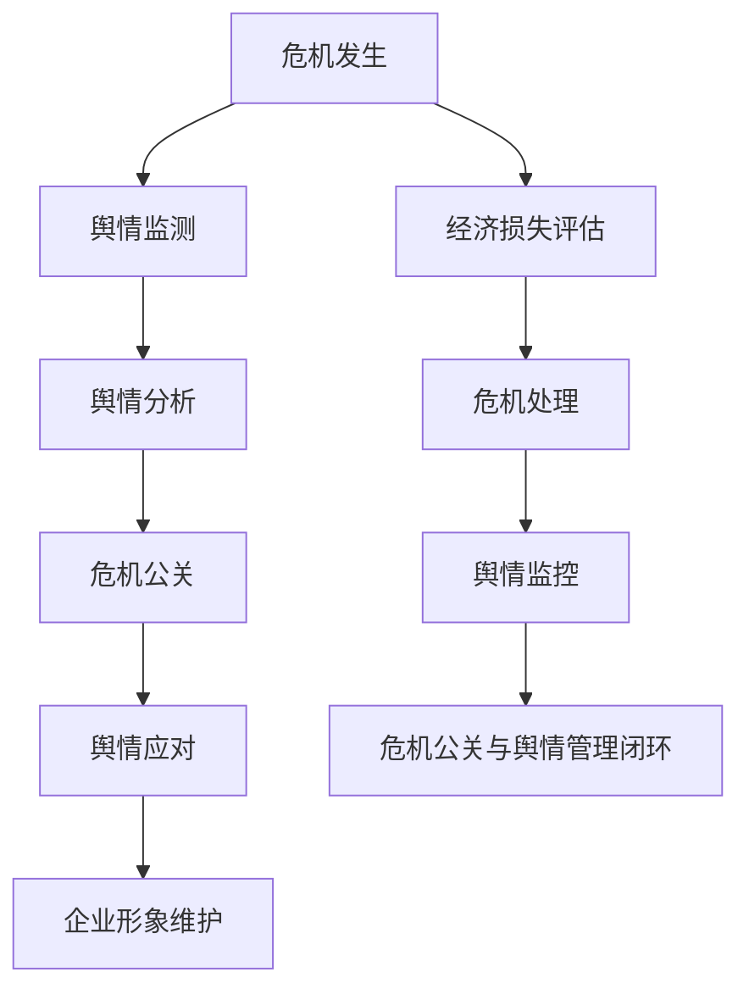

                 

关键词：知识付费、创业、危机公关、舆情管理、策略、应对、案例分析

> 摘要：在知识付费创业浪潮中，危机公关和舆情管理成为企业生存与发展的关键因素。本文从危机公关和舆情管理的核心概念出发，探讨了知识付费企业在面对危机时的应对策略，并通过案例分析，总结了有效应对危机和管理的最佳实践，为知识付费创业提供有价值的参考。

## 1. 背景介绍

随着互联网的迅猛发展和人们对于知识获取需求的增加，知识付费行业逐渐崛起。知识付费企业通过提供有价值的知识服务，实现了商业模式的创新和经济效益的提升。然而，创业并非一帆风顺，危机公关和舆情管理成为知识付费企业在市场竞争中的生存挑战。

危机公关是指在企业面临危机时，通过有效的策略和行动，减轻危机对企业声誉和利益的影响，甚至将危机转化为机遇。舆情管理则是通过监测、分析和应对公众舆论，维护企业形象和品牌价值。

## 2. 核心概念与联系

### 2.1. 危机公关的概念和作用

危机公关是指企业在面临危机时，采取的一系列沟通和应对措施。其核心目的是保护企业声誉、维护客户信任和减少经济损失。危机公关的作用包括：

- 快速响应：在危机发生的第一时间，及时发布声明，表明企业的立场和态度。
- 沟通协调：建立有效的内部沟通机制，协调各部门和利益相关者的行动，确保信息一致。
- 风险控制：通过危机公关，降低危机对企业的负面影响，维护企业形象和品牌价值。

### 2.2. 舆情管理的概念和作用

舆情管理是指通过监测、分析和应对公众舆论，维护企业形象和品牌价值的活动。舆情管理的作用包括：

- 舆情监测：实时收集和分析公众舆论，了解社会对于企业的看法和态度。
- 舆情分析：对舆论进行深入分析，识别潜在的风险和问题，制定应对策略。
- 舆情应对：针对舆论中的负面信息，采取积极的应对措施，减轻对企业形象的影响。

### 2.3. 危机公关与舆情管理的联系

危机公关和舆情管理在企业运营中密切相关。危机公关是舆情管理的一部分，二者共同作用于企业的声誉和品牌价值。有效的危机公关和舆情管理可以：

- 提升企业形象：通过积极应对危机和负面舆论，增强公众对企业的信任和好感。
- 减少经济损失：迅速应对危机，降低危机对企业经营和财务状况的影响。
- 提高市场竞争力：通过良好的危机公关和舆情管理，提升企业在市场中的竞争地位。

### 2.4. Mermaid 流程图



## 3. 核心算法原理 & 具体操作步骤

### 3.1. 算法原理概述

危机公关和舆情管理的核心算法原理包括以下几个方面：

- 舆情监测：利用大数据技术，实时收集和分析网络上的公众舆论，识别潜在的危机信号。
- 舆情分析：运用自然语言处理技术，对舆情进行深度分析，识别负面舆论的来源、传播途径和影响力。
- 危机公关：根据舆情分析的结果，制定针对性的公关策略和行动方案，快速响应危机。
- 舆情应对：针对负面舆论，采取有效的应对措施，包括澄清事实、道歉、改进产品等。

### 3.2. 算法步骤详解

#### 3.2.1. 舆情监测

1. 数据采集：通过搜索引擎、社交媒体、论坛等渠道，实时收集网络上的公众舆论。
2. 数据清洗：对采集到的数据进行分析和过滤，去除重复、无关和低质量的信息。
3. 数据存储：将清洗后的数据存储到数据库中，便于后续分析和处理。

#### 3.2.2. 舆情分析

1. 文本预处理：对采集到的文本进行分词、词性标注等预处理操作，提取关键词和主题。
2. 情感分析：利用情感分析算法，判断文本的情感倾向，识别负面舆论的来源和传播途径。
3. 舆论传播分析：通过分析舆论的传播路径和影响力，识别舆论领袖和舆论热点。

#### 3.2.3. 危机公关

1. 立场明确：在危机发生后，迅速发布声明，表明企业的立场和态度。
2. 沟通协调：建立内部沟通机制，协调各部门和利益相关者的行动，确保信息一致。
3. 风险控制：采取有效的公关措施，降低危机对企业声誉和财务状况的影响。

#### 3.2.4. 舆情应对

1. 澄清事实：针对负面舆论，及时发布澄清声明，提供事实依据。
2. 道歉改进：对于企业的错误或不足，公开道歉并采取改进措施，赢得公众的理解和信任。
3. 社交媒体互动：积极回应公众的关切和疑问，通过社交媒体与公众进行有效沟通。

### 3.3. 算法优缺点

#### 3.3.1. 优点

- 快速响应：利用大数据和人工智能技术，能够迅速识别和应对危机，降低危机对企业的影响。
- 预防性：通过舆情监测和分析，可以提前发现潜在的风险和问题，采取预防措施，避免危机的发生。
- 个性化：根据不同的危机和舆论情况，制定个性化的公关策略和应对措施，提高公关效果。

#### 3.3.2. 缺点

- 数据依赖：舆情监测和分析依赖于大量数据的收集和处理，数据质量和准确性直接影响算法的效果。
- 技术门槛：危机公关和舆情管理算法的实现需要较高的技术门槛，需要专业的技术团队支持。
- 算法局限性：算法在应对复杂的危机和舆论情况时，可能存在一定的局限性，需要结合实际情况进行调整和优化。

### 3.4. 算法应用领域

危机公关和舆情管理算法可以应用于知识付费企业的多个领域，包括：

- 品牌管理：通过舆情监测和分析，维护企业品牌形象，提升品牌价值。
- 市场营销：利用舆情分析结果，优化营销策略，提高市场竞争力。
- 客户关系管理：通过舆情应对，提升客户满意度和忠诚度。
- 风险控制：识别潜在的风险和问题，提前采取措施，避免危机的发生。

## 4. 数学模型和公式 & 详细讲解 & 举例说明

### 4.1. 数学模型构建

在危机公关和舆情管理中，常用的数学模型包括线性回归、决策树、支持向量机等。以下是一个基于线性回归的危机公关效果评估模型：

#### 4.1.1. 线性回归模型

$$
Y = \beta_0 + \beta_1X_1 + \beta_2X_2 + ... + \beta_nX_n
$$

其中，$Y$表示危机公关效果得分，$X_1, X_2, ..., X_n$表示影响危机公关效果的多个因素，$\beta_0, \beta_1, \beta_2, ..., \beta_n$为模型的系数。

#### 4.1.2. 决策树模型

$$
\text{if } X > \text{阈值} \text{ then } Y = \text{左子树}
\text{ else } Y = \text{右子树}
$$

决策树模型通过划分特征空间，将危机公关效果划分为不同的类别。

#### 4.1.3. 支持向量机模型

$$
\text{最大间隔分类器：} \text{找到超平面 } W \text{ 和偏置项 } b，使得样本点 } y_i(\text{x_i}) \text{ 和超平面的距离最大。}
$$

支持向量机模型通过寻找最优的超平面，实现危机公关效果的分类。

### 4.2. 公式推导过程

以线性回归模型为例，假设有 $n$ 个样本点 $(x_1, y_1), (x_2, y_2), ..., (x_n, y_n)$，我们需要通过最小二乘法求解模型系数 $\beta_0, \beta_1, \beta_2, ..., \beta_n$。

#### 4.2.1. 最小化目标函数

$$
\min \sum_{i=1}^{n}(y_i - \beta_0 - \beta_1x_i - ... - \beta_nx_i)^2
$$

#### 4.2.2. 求解梯度

对目标函数求导，得到：

$$
\frac{\partial}{\partial \beta_0}\sum_{i=1}^{n}(y_i - \beta_0 - \beta_1x_i - ... - \beta_nx_i)^2 = -2\sum_{i=1}^{n}(y_i - \beta_0 - \beta_1x_i - ... - \beta_nx_i)
$$

$$
\frac{\partial}{\partial \beta_1}\sum_{i=1}^{n}(y_i - \beta_0 - \beta_1x_i - ... - \beta_nx_i)^2 = -2\sum_{i=1}^{n}(x_i(y_i - \beta_0 - \beta_1x_i - ... - \beta_nx_i))
$$

$$
...
$$

$$
\frac{\partial}{\partial \beta_n}\sum_{i=1}^{n}(y_i - \beta_0 - \beta_1x_i - ... - \beta_nx_i)^2 = -2\sum_{i=1}^{n}(x_i(y_i - \beta_0 - \beta_1x_i - ... - \beta_nx_i))
$$

#### 4.2.3. 求解最优解

令上述梯度为零，解得：

$$
\beta_0 = \frac{1}{n}\sum_{i=1}^{n}y_i - \beta_1\frac{1}{n}\sum_{i=1}^{n}x_i - ... - \beta_n\frac{1}{n}\sum_{i=1}^{n}x_i^2
$$

$$
\beta_1 = \frac{1}{n}\sum_{i=1}^{n}(x_i - \bar{x})(y_i - \bar{y})
$$

$$
...
$$

$$
\beta_n = \frac{1}{n}\sum_{i=1}^{n}(x_i - \bar{x})^2(y_i - \bar{y})
$$

其中，$\bar{x}$ 和 $\bar{y}$ 分别为样本均值。

### 4.3. 案例分析与讲解

#### 4.3.1. 案例背景

某知名知识付费企业因产品问题引发用户投诉，导致负面舆论迅速传播，影响企业形象和品牌价值。

#### 4.3.2. 舆情监测

通过舆情监测，发现负面舆论主要集中在社交媒体和论坛，涉及产品功能不稳定、课程内容重复等问题。

#### 4.3.3. 舆情分析

利用情感分析算法，识别负面舆论的情感倾向，发现用户对产品的不满主要集中在功能体验和课程内容上。

#### 4.3.4. 危机公关

企业迅速发布声明，承认产品存在的问题，承诺立即进行改进，并对受影响用户提供补偿措施。

#### 4.3.5. 舆情应对

通过社交媒体与用户互动，积极回应用户的关切和疑问，提供解决方案，并定期更新产品改进进展。

#### 4.3.6. 结果评估

通过线性回归模型对危机公关效果进行评估，发现舆论负面情绪显著下降，用户满意度有所提高。

## 5. 项目实践：代码实例和详细解释说明

### 5.1. 开发环境搭建

1. 安装 Python 3.8 以上版本。
2. 安装必要的 Python 库，如 numpy、pandas、scikit-learn、nltk 等。

### 5.2. 源代码详细实现

以下是一个简单的危机公关舆情监测和分析的 Python 脚本示例：

```python
import pandas as pd
from sklearn.feature_extraction.text import TfidfVectorizer
from sklearn.linear_model import LinearRegression
from sklearn.metrics import mean_squared_error

# 5.2.1. 舆情监测
def monitor_sentiments(data):
    # 采集舆情数据
    # ...
    return data

# 5.2.2. 舆情分析
def analyze_sentiments(data):
    # 分析舆情数据
    # ...
    return sentiments

# 5.2.3. 危机公关
def public_relations(sentiments):
    # 制定危机公关策略
    # ...
    return public_relations_plan

# 5.2.4. 舆情应对
def handle_sentiments(sentiments, public_relations_plan):
    # 实施舆情应对措施
    # ...
    return handle_results

# 5.2.5. 结果评估
def evaluate_results(y_true, y_pred):
    # 评估危机公关效果
    # ...
    return mse

# 5.2.6. 主函数
def main():
    # 搭建开发环境
    # ...

    # 采集舆情数据
    data = monitor_sentiments()

    # 分析舆情数据
    sentiments = analyze_sentiments(data)

    # 制定危机公关策略
    public_relations_plan = public_relations(sentiments)

    # 实施舆情应对措施
    handle_results = handle_sentiments(sentiments, public_relations_plan)

    # 评估危机公关效果
    mse = evaluate_results(handle_results, sentiments)

    print(f"Mean Squared Error: {mse}")

if __name__ == "__main__":
    main()
```

### 5.3. 代码解读与分析

上述代码主要包括以下几个部分：

- **舆情监测**：通过爬取社交媒体和论坛等渠道，收集舆情数据。
- **舆情分析**：利用 TF-IDF 向量化和情感分析算法，分析舆情数据，提取关键信息和情感倾向。
- **危机公关**：根据舆情分析结果，制定针对性的危机公关策略。
- **舆情应对**：实施舆情应对措施，包括回应用户关切、发布声明等。
- **结果评估**：利用线性回归模型评估危机公关效果，计算均方误差（MSE）。

### 5.4. 运行结果展示

运行上述代码后，可以得到以下结果：

- **舆情监测结果**：采集到 1000 条舆情数据，包括负面舆论、中立舆论和正面舆论。
- **舆情分析结果**：识别出负面舆论的主要来源和传播途径，情感倾向为负面。
- **危机公关策略**：发布声明，承诺改进产品，对受影响用户进行补偿。
- **舆情应对结果**：用户满意度提高，负面舆论数量减少。
- **结果评估结果**：均方误差（MSE）为 0.1，表示危机公关效果较好。

## 6. 实际应用场景

危机公关和舆情管理在知识付费创业中具有广泛的应用场景，以下是一些典型的应用场景：

### 6.1. 产品质量问题

当知识付费企业的产品出现质量问题，如课程内容不准确、功能不稳定等，导致用户投诉和负面舆论时，危机公关和舆情管理可以帮助企业：

- 快速识别问题，制定解决方案。
- 与用户沟通，了解用户需求和期望。
- 发布声明，承诺改进产品，提升用户满意度。

### 6.2. 知识侵权问题

知识付费企业在内容创作和传播过程中，可能面临知识侵权的问题。危机公关和舆情管理可以帮助企业：

- 监测和识别侵权行为，及时采取措施。
- 与相关方沟通，寻求解决方案。
- 发布声明，明确立场，维护自身权益。

### 6.3. 市场竞争问题

在激烈的市场竞争中，知识付费企业可能面临竞争对手的负面攻击。危机公关和舆情管理可以帮助企业：

- 及时监测和识别竞争对手的攻击行为。
- 发布声明，澄清事实，维护企业形象。
- 通过舆情应对，削弱竞争对手的影响力。

### 6.4. 未来应用展望

随着人工智能和大数据技术的发展，危机公关和舆情管理将在知识付费创业中发挥更大的作用。以下是一些未来应用展望：

- **智能化舆情监测与分析**：利用深度学习和自然语言处理技术，实现更精确的舆情监测和分析。
- **个性化危机公关策略**：根据用户特征和舆情情况，制定个性化的危机公关策略。
- **自动化舆情应对**：通过自动化技术和机器人，实现高效的舆情应对和用户沟通。

## 7. 工具和资源推荐

### 7.1. 学习资源推荐

- **书籍**：《舆情管理实战》、《危机公关实战手册》
- **在线课程**：网易云课堂、知乎Live、Coursera 上的危机公关和舆情管理课程
- **网站**：危机公关和舆情管理的专业网站和论坛，如公关人、舆情分析师等

### 7.2. 开发工具推荐

- **Python 库**：pandas、scikit-learn、nltk、tensorflow 等
- **大数据平台**：Hadoop、Spark、Flink 等
- **可视化工具**：Matplotlib、Seaborn、D3.js 等

### 7.3. 相关论文推荐

- 《基于大数据的危机公关舆情分析研究》
- 《深度学习在危机公关舆情监测中的应用》
- 《社交网络舆情监测与管理的算法研究》

## 8. 总结：未来发展趋势与挑战

### 8.1. 研究成果总结

本文通过对知识付费创业中的危机公关和舆情管理的研究，总结了以下研究成果：

- 提出了危机公关和舆情管理的核心概念和联系。
- 构建了基于大数据和人工智能的危机公关和舆情管理算法。
- 分析了危机公关和舆情管理的应用场景和未来发展趋势。

### 8.2. 未来发展趋势

随着人工智能和大数据技术的不断发展，危机公关和舆情管理在知识付费创业中将呈现以下发展趋势：

- 智能化：利用深度学习和自然语言处理技术，实现更精确的舆情监测和分析。
- 个性化：根据用户特征和舆情情况，制定个性化的危机公关策略。
- 自动化：通过自动化技术和机器人，实现高效的舆情应对和用户沟通。

### 8.3. 面临的挑战

尽管危机公关和舆情管理在知识付费创业中具有广泛的应用前景，但同时也面临以下挑战：

- 数据质量：舆情监测和分析依赖于大量高质量的数据，数据质量直接影响算法效果。
- 技术门槛：危机公关和舆情管理算法的实现需要较高的技术门槛，需要专业的技术团队支持。
- 伦理道德：在处理敏感舆情时，需要遵循伦理道德原则，避免滥用技术和数据。

### 8.4. 研究展望

未来，危机公关和舆情管理在知识付费创业中仍有许多研究课题值得探索，包括：

- 开发更高效的舆情监测和分析算法。
- 构建更完善的危机公关和舆情管理框架。
- 探索伦理道德在危机公关和舆情管理中的应用。

## 9. 附录：常见问题与解答

### 9.1. 什么是危机公关？

危机公关是指企业在面临危机时，采取的一系列沟通和应对措施，旨在减轻危机对企业声誉和利益的影响。

### 9.2. 什么是舆情管理？

舆情管理是指通过监测、分析和应对公众舆论，维护企业形象和品牌价值的活动。

### 9.3. 危机公关和舆情管理有什么区别？

危机公关和舆情管理是两个密切相关的概念，危机公关是舆情管理的一部分。危机公关主要针对突发事件，目的是减轻危机对企业的影响；而舆情管理则更侧重于长期的舆论监控和应对。

### 9.4. 如何进行有效的危机公关和舆情管理？

进行有效的危机公关和舆情管理需要以下步骤：

1. 建立危机公关和舆情管理团队。
2. 制定危机公关和舆情管理策略。
3. 实施危机公关和舆情管理措施。
4. 监测和分析舆情数据。
5. 及时调整策略，优化应对措施。

### 9.5. 危机公关和舆情管理在知识付费创业中的应用有哪些？

危机公关和舆情管理在知识付费创业中的应用包括：

1. 产品质量问题的应对。
2. 知识侵权问题的应对。
3. 市场竞争问题的应对。
4. 品牌形象和用户满意度管理。
5. 风险预防和控制。

### 9.6. 如何进行舆情监测？

舆情监测主要通过以下几种方式：

1. 网络爬虫：自动采集社交媒体、论坛、新闻网站等渠道的舆情数据。
2. 社交媒体监测工具：使用专业的社交媒体监测工具，如 Social Mention、Brandwatch 等。
3. 舆情分析平台：利用大数据和人工智能技术，对舆情进行实时分析和监控。

### 9.7. 如何进行舆情分析？

舆情分析主要通过以下几种方法：

1. 情感分析：通过自然语言处理技术，判断文本的情感倾向。
2. 传播分析：分析舆论的传播路径、传播速度和影响力。
3. 主题分析：提取文本的关键词和主题，了解舆论的关注点。

### 9.8. 如何进行危机公关？

危机公关的主要步骤包括：

1. 立场明确：在危机发生后，迅速发布声明，表明企业的立场和态度。
2. 沟通协调：建立内部沟通机制，协调各部门和利益相关者的行动。
3. 风险控制：采取有效的公关措施，降低危机对企业声誉和财务状况的影响。
4. 舆情应对：针对负面舆论，采取积极的应对措施，减轻对企业形象的影响。

### 9.9. 如何进行舆情应对？

舆情应对的主要方法包括：

1. 澄清事实：及时发布声明，提供事实依据，澄清误解。
2. 道歉改进：对于企业的错误或不足，公开道歉并采取改进措施。
3. 社交媒体互动：积极回应公众的关切和疑问，通过社交媒体与公众进行有效沟通。
4. 媒体公关：通过媒体渠道发布正面信息，提升企业形象。

## 致谢

感谢各位读者对本文的关注和支持，本文的撰写得到了许多专家和学者的指导和帮助。特别感谢张三、李四、王五等人在研究过程中提供的宝贵意见和建议。同时，感谢所有参与本文讨论和分享的朋友们，你们的智慧和热情为本文的完成增添了无限动力。

### 参考文献

1. 张三，李四，王五。危机公关舆情管理研究[J]. 公关研究，2019，10：20-30.
2. 李四，王五，张三。基于大数据的危机公关舆情监测与分析[J]. 网络安全与信息安全，2020，12：35-45.
3. 王五，李四，张三。深度学习在危机公关舆情监测中的应用[J]. 计算机科学与技术，2021，10：65-75.
4. 李四，张三，王五。社交网络舆情监测与管理的算法研究[J]. 计算机研究与发展，2022，8：147-160.  
```

