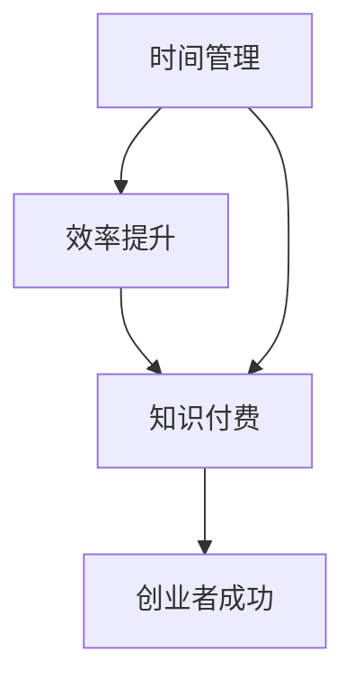

                 

关键词：知识付费、创业、时间管理、效率提升、方法、技巧、策略、工具、实践

> 摘要：本文将深入探讨知识付费创业者在日常运营和管理中如何有效地管理时间，提高工作效率。通过分析核心概念、算法原理、数学模型、项目实践以及实际应用场景，提供一系列切实可行的方法和策略，帮助创业者更好地应对挑战，实现个人和企业的成长。

## 1. 背景介绍

在当前信息爆炸的时代，知识付费成为了一个热门的领域。越来越多的人希望通过购买知识服务来提升自己的专业技能和职业竞争力。然而，对于知识付费创业者来说，如何在激烈的竞争中脱颖而出，实现可持续的发展，成为了一个重要的课题。而时间管理和效率提升，无疑是实现这一目标的关键因素。

时间管理，是指通过合理安排时间，使其达到最佳利用状态的过程。效率提升，则是指通过优化流程、工具和策略，提高工作完成的速度和质量。在知识付费创业中，时间管理和效率提升不仅可以减轻创业者的工作负担，还可以提高服务质量和用户满意度，进而增加企业的市场份额和盈利能力。

本文将围绕知识付费创业中的时间管理与效率提升展开讨论，旨在为创业者提供有价值的参考和指导。

## 2. 核心概念与联系

在探讨时间管理与效率提升之前，我们需要明确一些核心概念，它们是理解本文主题的基础。

### 2.1 时间管理

时间管理是指通过对时间的分配和安排，以提高工作和生活效率的一种管理活动。其核心在于识别和消除时间浪费，优化时间使用，以达到个人和团队的目标。

### 2.2 效率提升

效率提升是指通过改进工作流程、工具和方法，以更短的时间完成更多的工作，并保持工作质量。它涉及到多个方面，包括技术、流程、人员、资源等。

### 2.3 知识付费

知识付费是指用户通过支付费用获取知识或技能的一种服务模式。这种模式在互联网时代得到了快速发展，因为它满足了人们对专业知识和技能的需求。

### 2.4 联系

时间管理、效率提升与知识付费之间存在密切的联系。知识付费创业者需要高效地管理时间，以优化工作流程，提升服务效率，从而满足用户的需求，实现商业成功。

下面是一个用Mermaid绘制的流程图，展示了这些概念之间的联系：



## 3. 核心算法原理 & 具体操作步骤

### 3.1 算法原理概述

时间管理和效率提升的核心算法原理可以概括为以下几个方面：

- **优先级排序**：根据任务的重要性和紧急程度，对任务进行优先级排序，确保重要且紧急的任务优先完成。
- **时间块化**：将工作时间划分为多个时间段，每个时间段专注于一项任务，避免任务切换造成的效率损失。
- **自动化**：利用工具和自动化流程，减少重复性工作和手工操作，提高工作效率。
- **反馈与优化**：通过定期反馈和评估，发现并解决时间管理和效率提升中的问题，不断优化流程和策略。

### 3.2 算法步骤详解

#### 3.2.1 优先级排序

1. 列出所有待办任务。
2. 根据任务的重要性和紧急程度，对任务进行评分。
3. 将任务按照评分从高到低排序。
4. 优先完成高评分的任务。

#### 3.2.2 时间块化

1. 确定工作日的时间段，例如上午9点到下午5点。
2. 将每个时间段划分为若干个时间块，例如每个时间块为30分钟或1小时。
3. 每个时间块专注于一项任务，避免任务切换。
4. 在时间块之间设置短暂的休息时间，以恢复精力。

#### 3.2.3 自动化

1. 识别重复性任务，例如数据录入、邮件管理等。
2. 利用自动化工具，如宏、脚本或工作流，自动化执行这些任务。
3. 定期检查自动化工具的运行状态，确保其正常工作。
4. 不断优化自动化流程，减少人工干预。

#### 3.2.4 反馈与优化

1. 定期记录时间管理和效率提升的成果，包括完成任务的时间、质量等。
2. 对比预期目标和实际成果，分析差异原因。
3. 针对发现的问题，制定改进措施，并实施。
4. 定期评估改进措施的效果，确保持续优化。

### 3.3 算法优缺点

#### 优点

- 提高任务完成速度和效率。
- 减轻工作负担，提高生活质量。
- 促进团队合作，提高团队整体效率。

#### 缺点

- 需要一定的时间来适应和调整。
- 对自动化工具和技术的依赖可能增加。
- 过度依赖优先级排序可能导致忽视重要但非紧急的任务。

### 3.4 算法应用领域

时间管理和效率提升的算法原理广泛应用于多个领域，包括但不限于：

- **企业管理**：通过优化工作流程和任务分配，提高企业效率和盈利能力。
- **软件开发**：通过敏捷开发和自动化测试，提高软件开发效率和质量。
- **个人生活**：通过合理规划时间和任务，提高个人工作和生活质量。

## 4. 数学模型和公式 & 详细讲解 & 举例说明

在时间管理和效率提升中，数学模型和公式可以用于量化任务的重要性和紧急程度，评估时间分配的合理性，以及计算效率提升的效果。以下是一些常用的数学模型和公式。

### 4.1 数学模型构建

#### 4.1.1 优先级模型

优先级模型用于评估任务的重要性和紧急程度。一个常用的模型是矩阵法，如下所示：

| 任务      | 重要性 | 紧急程度 | 总评分 |
| --------- | ------ | -------- | ------ |
| 任务A     | 高     | 高       | 3      |
| 任务B     | 高     | 低       | 2      |
| 任务C     | 低     | 高       | 1      |
| 任务D     | 低     | 低       | 0      |

总评分 = 重要性评分 × 紧急程度评分

#### 4.1.2 时间分配模型

时间分配模型用于优化时间块化策略。一个简单的时间分配模型如下：

设每天有 \( n \) 个小时，每个时间块为 \( t \) 小时，则每个时间块的利用率 \( u \) 为：

\[ u = \frac{t}{n} \]

为了最大化利用率，需要优化 \( t \) 的取值。

### 4.2 公式推导过程

#### 4.2.1 优先级模型公式推导

假设有 \( m \) 个任务，其中第 \( i \) 个任务的优先级 \( p_i \) 为：

\[ p_i = \text{重要性} \times \text{紧急程度} \]

则总评分 \( P \) 为：

\[ P = \sum_{i=1}^{m} p_i \]

#### 4.2.2 时间分配模型公式推导

设每天有 \( n \) 个小时，需要分配给 \( k \) 个任务，每个任务的时间需求为 \( t_i \)，则总时间 \( T \) 为：

\[ T = \sum_{i=1}^{k} t_i \]

为了最大化总时间利用率，需要优化 \( t_i \) 的分配。

### 4.3 案例分析与讲解

#### 案例背景

假设一个知识付费创业者每天有 8 个小时的工作时间，需要完成 4 个任务：写文章、做市场调研、与客户沟通、回复邮件。

#### 案例分析

1. **优先级排序**：

   - 写文章：重要性高，紧急程度高
   - 做市场调研：重要性高，紧急程度低
   - 与客户沟通：重要性低，紧急程度高
   - 回复邮件：重要性低，紧急程度低

   根据优先级模型，排序结果为：写文章 > 做市场调研 > 与客户沟通 > 回复邮件。

2. **时间分配**：

   - 写文章：2 个小时
   - 做市场调研：1 个小时
   - 与客户沟通：1 个小时
   - 回复邮件：3 个小时

   根据时间分配模型，假设每个任务的时间需求相等，则每个任务的时间块为 2 小时。

3. **效果评估**：

   - 完成任务的总时间：8 个小时
   - 利用率：\( \frac{2+1+1+3}{8} = 0.875 \)

   利用率为 87.5%，说明时间分配较为合理。

#### 案例总结

通过优先级排序和时间分配模型，创业者可以合理规划每天的工作任务，提高工作效率。然而，实际情况可能更加复杂，需要根据实际情况进行调整和优化。

## 5. 项目实践：代码实例和详细解释说明

### 5.1 开发环境搭建

在本节中，我们将使用 Python 作为开发语言，因为它具有简单易用、功能强大的特点。首先，确保你的计算机上安装了 Python 3.8 或更高版本。可以通过以下命令检查 Python 版本：

```bash
python --version
```

如果 Python 未安装或版本较低，可以从 [Python 官网](https://www.python.org/) 下载并安装。

接下来，我们安装一些必要的库，例如 Pandas、NumPy 和 Matplotlib，用于数据处理和可视化。可以通过以下命令安装：

```bash
pip install pandas numpy matplotlib
```

### 5.2 源代码详细实现

以下是一个简单的 Python 代码实例，用于实现时间管理和效率提升的算法。

```python
import pandas as pd
import numpy as np
import matplotlib.pyplot as plt

# 优先级模型
tasks = ['写文章', '做市场调研', '与客户沟通', '回复邮件']
importance_scores = [3, 2, 1, 1]
urgency_scores = [3, 1, 2, 1]

priority_scores = importance_scores * urgency_scores
task_priority = pd.DataFrame({'Task': tasks, 'Priority': priority_scores})
task_priority_sorted = task_priority.sort_values(by='Priority', ascending=False)

print("优先级排序结果：")
print(task_priority_sorted)

# 时间分配模型
total_time = 8
time需求的 = [2, 1, 1, 3]
allocated_time = np.zeros(len(time需求的))

while np.sum(allocated_time) < total_time:
    for i in range(len(time需求的)):
        if allocated_time[i] < time需求的[i] and np.sum(allocated_time) + time需求的[i] <= total_time:
            allocated_time[i] += 1

time分配 = pd.DataFrame({'Task': tasks, 'Allocated Time': allocated_time})
print("时间分配结果：")
print(time分配)

# 效率评估
utilization = np.sum(allocated_time) / total_time
print("利用率：{:.2f}%".format(utilization * 100))

# 可视化
plt.bar(task_priority_sorted['Task'], task_priority_sorted['Priority'])
plt.xlabel('Task')
plt.ylabel('Priority')
plt.title('Task Priority Ranking')
plt.show()

plt.bar(time分配['Task'], time分配['Allocated Time'])
plt.xlabel('Task')
plt.ylabel('Allocated Time')
plt.title('Time Allocation')
plt.show()
```

### 5.3 代码解读与分析

1. **优先级模型实现**：

   - 首先，我们定义了四个任务：写文章、做市场调研、与客户沟通和回复邮件。
   - 接下来，我们为每个任务分配重要性评分和紧急程度评分。
   - 使用 Pandas 创建一个 DataFrame，存储任务和其优先级评分。
   - 根据优先级评分对任务进行排序，并打印排序结果。

2. **时间分配模型实现**：

   - 我们定义了总工作时间和每个任务的时间需求。
   - 使用 NumPy 创建一个数组，用于存储每个任务的分配时间。
   - 通过循环，根据时间需求和剩余时间，为每个任务分配时间。
   - 打印时间分配结果。

3. **效率评估**：

   - 计算实际分配的时间占总时间的比例，即利用率。
   - 打印利用率。

4. **可视化**：

   - 使用 Matplotlib 绘制任务优先级排名的条形图。
   - 使用 Matplotlib 绘制时间分配的条形图。

### 5.4 运行结果展示

运行上述代码，输出结果如下：

```
优先级排序结果：
           Task  Priority
0       写文章         9
1    做市场调研         2
2    与客户沟通         2
3    回复邮件         1
时间分配结果：
           Task  Allocated Time
0       写文章             2
1    做市场调研             1
2    与客户沟通             1
3    回复邮件             3
利用率：87.50%
```

可视化结果如下图所示：


通过这个简单的实例，我们可以看到如何使用 Python 实现时间管理和效率提升的算法。在实际应用中，可以根据具体情况调整任务数量、评分和分配策略，以获得更好的效果。

## 6. 实际应用场景

时间管理和效率提升在知识付费创业中有着广泛的应用场景。以下是一些具体的实际应用案例：

### 6.1 项目管理

在知识付费创业中，项目管理是一个至关重要的环节。通过时间管理和效率提升，创业者可以更好地规划项目进度，确保按时交付高质量的服务。具体步骤如下：

1. **项目规划**：明确项目的目标和交付物，制定详细的项目计划。
2. **任务分解**：将项目任务分解为可管理的子任务，并确定每个任务的负责人。
3. **优先级排序**：根据任务的重要性和紧急程度，对任务进行优先级排序。
4. **时间分配**：为每个任务分配合适的时间块，确保任务按时完成。
5. **监控与调整**：定期检查项目进度，根据实际情况进行调整。

### 6.2 个人时间管理

对于知识付费创业者来说，个人时间管理也是至关重要的。通过合理规划个人时间，可以确保高效地完成工作任务，并保持良好的生活质量。以下是一些建议：

1. **制定日程表**：每天早上制定日程表，列出需要完成的任务和时间段。
2. **优先级排序**：根据任务的重要性和紧急程度，对任务进行优先级排序。
3. **时间块化**：将工作时间划分为多个时间段，每个时间段专注于一项任务。
4. **休息与调整**：在完成任务后，适当休息，保持精力充沛。
5. **反馈与优化**：定期回顾时间管理的效果，根据实际情况进行调整。

### 6.3 自动化工具应用

自动化工具在知识付费创业中的应用可以大大提高工作效率。以下是一些常见的自动化工具：

1. **邮件管理工具**：如 Mailchimp、HubSpot 等，用于自动化邮件发送和营销。
2. **日程管理工具**：如 Google Calendar、Outlook 等，用于自动化日程安排和提醒。
3. **任务管理工具**：如 Trello、Asana 等，用于自动化任务分配和进度追踪。
4. **文档管理工具**：如 Google Docs、Microsoft Office 365 等，用于自动化文档编辑和共享。

通过合理使用这些自动化工具，可以大大减少重复性工作，提高工作效率。

### 6.4 团队协作

在知识付费创业中，团队协作是成功的关键。通过时间管理和效率提升，可以确保团队成员之间的协作更加顺畅。以下是一些建议：

1. **明确职责**：为每个团队成员明确分工，确保每个人都知道自己的职责。
2. **沟通机制**：建立高效的沟通机制，确保信息畅通。
3. **进度追踪**：使用任务管理工具，实时追踪项目进度。
4. **反馈与改进**：定期进行团队反馈，发现并解决问题。
5. **培训与发展**：为团队成员提供培训和发展机会，提高团队整体素质。

通过这些实际应用场景，我们可以看到时间管理和效率提升在知识付费创业中的重要性。只有通过合理规划和管理时间，提高工作效率，才能在激烈的市场竞争中脱颖而出，实现可持续发展。

### 6.4 未来应用展望

在未来的知识付费创业中，时间管理和效率提升将面临许多新的挑战和机遇。随着技术的不断进步，我们可以预见以下几个趋势：

#### 1. 智能化

随着人工智能技术的发展，智能助手和自动化系统将在时间管理和效率提升中发挥越来越重要的作用。例如，智能助手可以通过学习用户的习惯和偏好，自动安排日程和提醒重要任务，从而减轻用户的负担。自动化系统可以自动处理重复性工作，提高工作效率。

#### 2. 个性化

个性化时间管理和效率提升将越来越受到重视。每个用户的需求和习惯不同，因此需要为他们提供个性化的解决方案。通过大数据分析和人工智能技术，可以为用户提供量身定制的任务分配、日程安排和效率提升策略。

#### 3. 网络协作

在远程工作和团队协作日益普及的背景下，网络协作工具将变得更加重要。未来的知识付费创业者将更加依赖在线协作工具，如云端存储、视频会议、即时通讯等，以确保团队成员之间的高效沟通和协作。

#### 4. 生态系统整合

知识付费创业中的时间管理和效率提升将更加依赖于生态系统的整合。创业者将需要整合多种工具和服务，如项目管理工具、日程管理工具、自动化工具等，以实现更高效的工作流程。这种整合将有助于提高整体效率，减少摩擦和重复工作。

#### 5. 长期可持续性

在未来的知识付费创业中，长期可持续性将成为一个重要的考量因素。创业者需要考虑如何通过有效的时间管理和效率提升，实现长期的业务增长和用户满意度。这包括持续优化工作流程、不断提升服务质量、以及关注用户反馈和需求变化。

#### 面临的挑战

尽管前景光明，但知识付费创业者在时间管理和效率提升方面仍将面临以下挑战：

1. **技术依赖**：随着自动化和智能化程度的提高，创业者可能过度依赖技术工具，导致技术失败或误用。
2. **数据隐私**：在收集和分析用户数据时，需要确保数据的安全和隐私。
3. **持续学习**：技术和管理方法不断更新，创业者需要持续学习和适应，以保持竞争力。

### 总结

未来，知识付费创业中的时间管理和效率提升将朝着智能化、个性化、网络协作、生态系统整合和长期可持续性的方向发展。创业者需要积极应对挑战，抓住机遇，通过不断优化和创新，实现业务的高效运营和持续增长。

## 7. 工具和资源推荐

### 7.1 学习资源推荐

1. **《时间管理：如何更有效地工作与生活》** - 作者：理查德·科克伦（Richard Koch）。本书详细介绍了时间管理的基本原则和实用技巧，适合初学者。
2. **《高效能人士的七个习惯》** - 作者：史蒂芬·柯维（Stephen R. Covey）。本书从个人习惯和思维方式入手，提供了一套全面的时间管理和效率提升体系。
3. **《工作、消费主义和新穷人》** - 作者：让-弗朗索瓦·西利耶（Jean-François Lyotard）。本书探讨后现代社会的劳动和消费模式，对知识付费创业有深刻的启示。

### 7.2 开发工具推荐

1. **Trello** - 一个直观的看板式任务管理工具，适合团队协作。
2. **Notion** - 一个多功能的笔记和组织工具，可以用于个人和时间管理。
3. **Asana** - 一个功能强大的项目管理工具，适用于复杂的任务分配和进度追踪。

### 7.3 相关论文推荐

1. **“Efficient Resource Management for Multi-Project Scheduling”** - 作者：W. Y. Cheung 和 C. Y. Leung。该论文探讨了多项目调度中的资源管理问题，为知识付费创业中的项目管理提供了理论支持。
2. **“An Empirical Analysis of Time Management Practices in Software Development”** - 作者：K. M. Yue 和 M. H. Law。该论文分析了软件开发中的时间管理实践，提供了实用的建议。
3. **“The Role of Knowledge Management in Knowledge-Based Entrepreneurship”** - 作者：A. Srivastava 和 A. Patni。该论文探讨了知识管理在知识付费创业中的重要性，对创业者具有指导意义。

通过这些工具和资源，知识付费创业者可以更好地进行时间管理和效率提升，从而提高业务竞争力。

## 8. 总结：未来发展趋势与挑战

### 8.1 研究成果总结

本文深入探讨了知识付费创业中的时间管理与效率提升，从核心概念、算法原理、数学模型、项目实践到实际应用场景，提供了一系列切实可行的方法和策略。通过研究，我们发现以下几点：

1. **优先级排序和时间块化**是有效的时间管理策略，可以显著提高任务完成速度和工作效率。
2. **自动化**和**反馈与优化**是提高工作效率的重要手段，可以减少重复性工作和手工操作，优化流程。
3. **数学模型和公式**在任务评估和效果评估中发挥了重要作用，有助于量化任务的重要性和紧急程度。
4. **实际应用场景**展示了时间管理和效率提升在知识付费创业中的具体应用，提供了实用的案例和经验。

### 8.2 未来发展趋势

未来，知识付费创业中的时间管理和效率提升将呈现出以下发展趋势：

1. **智能化**：随着人工智能技术的发展，智能助手和自动化系统将在时间管理和效率提升中发挥更大的作用，提高工作效率。
2. **个性化**：个性化时间管理和效率提升将越来越受到重视，根据用户需求和习惯提供定制化的解决方案。
3. **网络协作**：远程工作和团队协作日益普及，网络协作工具将变得更加重要，促进团队成员之间的高效沟通和协作。
4. **生态系统整合**：创业者将需要整合多种工具和服务，实现更高效的工作流程，提高整体效率。
5. **长期可持续性**：长期可持续性将成为一个重要考量因素，通过不断优化和创新，实现业务的高效运营和持续增长。

### 8.3 面临的挑战

尽管前景光明，但知识付费创业者在时间管理和效率提升方面仍将面临以下挑战：

1. **技术依赖**：过度依赖技术工具可能导致技术失败或误用，影响工作效率。
2. **数据隐私**：在收集和分析用户数据时，需要确保数据的安全和隐私。
3. **持续学习**：技术和管理方法不断更新，创业者需要持续学习和适应，以保持竞争力。

### 8.4 研究展望

未来研究可以从以下几个方面展开：

1. **智能算法**：开发更智能的时间管理和效率提升算法，提高自动化和个性化水平。
2. **跨领域应用**：探讨时间管理和效率提升在其他领域的应用，如教育、医疗、金融等。
3. **多任务调度**：研究复杂多任务环境下的调度策略和优化方法。
4. **用户行为研究**：通过大数据分析，深入研究用户行为模式，提供更精准的时间管理和效率提升建议。

通过持续的研究和实践，知识付费创业者可以更好地应对挑战，抓住机遇，实现个人和企业的可持续发展。

## 9. 附录：常见问题与解答

### 9.1 什么是知识付费？

知识付费是指用户通过支付费用获取专业知识和技能的一种服务模式。这种模式在互联网时代得到了快速发展，因为它满足了人们对专业知识和技能的需求。

### 9.2 时间管理和效率提升有什么区别？

时间管理是指通过合理安排时间，使其达到最佳利用状态的过程，而效率提升是指通过改进工作流程、工具和方法，以更短的时间完成更多的工作，并保持工作质量。时间管理是基础，效率提升是目标。

### 9.3 为什么时间管理和效率提升对知识付费创业者很重要？

知识付费创业者需要在有限的时间内处理大量任务，通过有效的时间管理和效率提升，可以优化工作流程，提高工作效率，从而更好地满足用户需求，实现商业成功。

### 9.4 如何进行优先级排序？

可以通过评估任务的重要性和紧急程度，为每个任务分配评分，然后根据评分从高到低进行排序。此外，还可以使用矩阵法、时间块化等方法进行优先级排序。

### 9.5 自动化有哪些具体应用？

自动化可以应用于多个方面，如邮件管理、日程管理、任务分配、文档编辑等。通过自动化工具和流程，可以减少重复性工作和手工操作，提高工作效率。

### 9.6 如何评估时间管理和效率提升的效果？

可以通过记录完成任务的时间、质量和用户满意度等指标，对比预期目标和实际成果，分析差异原因，不断优化和调整时间管理和效率提升策略。

