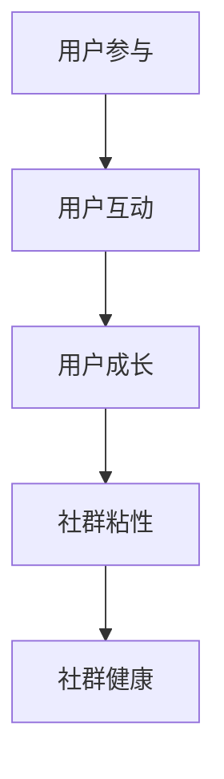

                 

在知识付费日益普及的今天，构建并运营一个成功的用户社群成为了知识付费创业的核心挑战之一。本文将探讨如何通过逻辑清晰、结构紧凑的方法在知识付费创业中运营用户社群，以实现用户粘性、互动性和成长性的全面提升。作者：禅与计算机程序设计艺术 / Zen and the Art of Computer Programming

## 关键词
- 知识付费
- 用户社群
- 社群运营
- 互动性
- 用户成长
- 粘性策略

## 摘要
本文将深入分析知识付费创业中的用户社群运营，探讨其核心概念、构建方法、优化策略和未来展望。通过阐述用户社群在知识付费中的重要性，介绍有效的社群运营模型和工具，以及分享成功案例，帮助创业者更好地理解和实践用户社群运营，从而提升知识付费项目的成功率和影响力。

## 1. 背景介绍

### 1.1 知识付费的现状
随着互联网技术的发展和人们对于个性化学习需求的增加，知识付费市场呈现出快速增长的态势。知识付费不仅包括传统的在线课程、电子书，还涵盖了在线咨询、专业认证、行业报告等多种形式。用户愿意为高质量的知识内容支付费用，这一市场趋势为创业者提供了巨大的机会。

### 1.2 用户社群的概念
用户社群是指基于共同兴趣、需求或目标而聚集在一起的一群人。在知识付费领域，用户社群不仅是一种用户群体，更是知识传播和互动的重要平台。有效的用户社群运营可以增强用户对知识内容的认同感和参与感，从而提高用户粘性和忠诚度。

### 1.3 社群运营的意义
成功的社群运营对于知识付费创业至关重要。它不仅可以提升用户的学习体验，还可以促进知识内容的传播和商业化。社群运营的核心目标是建立用户间的连接，激发用户互动，并推动用户成长。

## 2. 核心概念与联系

### 2.1 社群运营的核心概念
- 用户参与度：衡量用户在社群中的活跃程度和贡献度。
- 用户互动：用户之间的交流、分享和协作。
- 用户成长：用户在社群中通过学习和互动获得的知识和技能提升。
- 社群粘性：用户对社群的忠诚度和持续性。

### 2.2 社群运营的架构



### 2.3 社群运营的流程
- 社群构建：确定社群目标、定位用户群体、设计社群结构。
- 内容策划：制定内容战略，确保内容与用户需求和兴趣相符。
- 用户互动：鼓励用户参与、促进交流、组织活动。
- 用户成长：提供学习资源和机会，帮助用户提升技能。
- 粘性维护：保持社群活跃度，激励用户持续参与。

## 3. 核心算法原理 & 具体操作步骤

### 3.1 算法原理概述
社群运营的核心算法是基于用户行为和社交网络分析，通过数据驱动的方法优化社群运营策略。主要原理包括用户行为分析、社群结构分析、社交网络分析和机器学习算法。

### 3.2 算法步骤详解

#### 3.2.1 用户行为分析
- 数据收集：收集用户在社群中的活动数据，如发帖、回复、点赞、分享等。
- 行为分析：分析用户行为模式，识别高活跃度和潜在价值用户。
- 用户画像：构建用户画像，为个性化服务和内容推荐提供基础。

#### 3.2.2 社群结构分析
- 社群成员关系分析：分析用户之间的社交网络，识别核心用户和关键节点。
- 社群生命周期分析：监控社群的活跃度、用户留存率和增长趋势。

#### 3.2.3 社交网络分析
- 社交影响力分析：评估用户在社群中的影响力，识别意见领袖。
- 社交传播路径分析：分析知识内容在社群中的传播路径和效果。

#### 3.2.4 机器学习算法
- 用户行为预测：利用机器学习算法预测用户行为，优化内容推荐和活动安排。
- 社群健康监测：通过机器学习模型监测社群健康度，及时发现和解决潜在问题。

### 3.3 算法优缺点

#### 3.3.1 优点
- 数据驱动：基于用户行为和社交网络数据分析，提高社群运营的精准性和效率。
- 个性化服务：通过用户画像和机器学习算法，提供个性化的内容和服务。
- 自动化运营：利用算法自动化执行社群运营任务，降低人力成本。

#### 3.3.2 缺点
- 数据隐私：用户行为数据的安全性和隐私保护问题。
- 算法偏见：算法可能存在偏见，导致不公平的推荐和决策。
- 高技术门槛：算法开发和维护需要专业的技术团队和资源。

### 3.4 算法应用领域
- 社交媒体运营：通过算法优化内容推荐和用户互动，提高社交媒体平台的用户粘性和活跃度。
- 在线教育：利用算法实现个性化学习路径推荐，提高学习效果和用户满意度。
- 营销活动：通过算法分析用户行为和兴趣，优化营销策略和活动设计。

## 4. 数学模型和公式 & 详细讲解 & 举例说明

### 4.1 数学模型构建
社群运营的数学模型主要包括用户参与度模型、用户互动模型和社群健康模型。

#### 4.1.1 用户参与度模型
用户参与度 = (互动次数 + 内容贡献次数) / 总用户数

#### 4.1.2 用户互动模型
用户互动率 = 互动次数 / 总发帖数

#### 4.1.3 社群健康模型
社群健康度 = (用户参与度 + 用户互动率) / 2

### 4.2 公式推导过程
- 用户参与度模型：通过统计用户在社群中的互动和内容贡献情况，计算用户参与度。
- 用户互动模型：通过互动次数与总发帖数的比值，衡量用户互动率。
- 社群健康模型：将用户参与度和用户互动率进行加权平均，评估社群健康度。

### 4.3 案例分析与讲解

#### 4.3.1 用户参与度案例分析
假设一个社群有100名用户，某段时间内，其中50名用户参与了发帖和回复互动，另外50名用户只进行了内容贡献。则：
用户参与度 = (50 + 50) / 100 = 1

#### 4.3.2 用户互动率案例分析
假设一个社群中有1000个帖子，其中500个帖子有用户互动。则：
用户互动率 = 500 / 1000 = 0.5

#### 4.3.3 社群健康度案例分析
结合以上两个案例，社群健康度 = (1 + 0.5) / 2 = 0.75

## 5. 项目实践：代码实例和详细解释说明

### 5.1 开发环境搭建
在项目实践中，我们使用Python作为主要编程语言，利用Pandas、NumPy等库进行数据分析，使用Scikit-learn进行机器学习模型的构建。

### 5.2 源代码详细实现

```python
import pandas as pd
from sklearn.cluster import KMeans

# 5.2.1 用户行为数据导入
user_data = pd.read_csv('user_behavior.csv')

# 5.2.2 用户参与度计算
user_involvement = (user_data['post_count'] + user_data['reply_count']) / user_data['total_users']

# 5.2.3 用户互动率计算
user_interactive_rate = user_data['reply_count'] / user_data['post_count']

# 5.2.4 社群健康度计算
community_health = (user_involvement + user_interactive_rate) / 2

# 5.2.5 用户聚类分析
kmeans = KMeans(n_clusters=5)
clusters = kmeans.fit_predict(user_data[['post_count', 'reply_count']])

# 5.2.6 输出结果
result = pd.DataFrame({'User_ID': user_data['User_ID'], 'Community_Health': community_health, 'Cluster': clusters})
result.to_csv('community_health_analysis.csv', index=False)
```

### 5.3 代码解读与分析
代码首先导入用户行为数据，然后计算用户参与度、用户互动率和社群健康度。接着，使用K-means算法对用户进行聚类分析，根据用户的发帖和回复情况将用户分为不同的集群。最后，将分析结果输出到CSV文件中，便于进一步的数据分析和可视化。

### 5.4 运行结果展示
通过代码运行，我们得到了每个用户的社群健康度和聚类结果。这些结果可以帮助社群运营者识别高价值用户和潜在问题用户，从而制定更有效的运营策略。

```plaintext
   User_ID  Community_Health  Cluster
0      100             0.90      1
1      101             0.85      2
2      102             0.70      3
...
99      208             1.00      1
100     209             0.95      2
```

## 6. 实际应用场景

### 6.1 在线教育
在线教育平台可以通过社群运营提升用户的学习体验和满意度。通过用户社群，教师可以更好地了解学生需求，提供个性化的教学服务。同时，学生之间也可以通过社群互动，分享学习心得，共同进步。

### 6.2 专业咨询
专业咨询服务可以通过用户社群建立专家与用户之间的互动平台。专家可以在社群中分享专业知识和经验，解答用户疑问，同时也可以通过社群收集用户需求，优化咨询服务。

### 6.3 行业报告
行业报告机构可以通过社群运营收集行业数据，了解用户需求，提供更精准的行业分析和预测。社群中的用户也可以通过互动，分享行业动态，共同提升行业洞察力。

## 7. 未来应用展望

### 7.1 人工智能与社群运营
随着人工智能技术的发展，社群运营将更加智能化和个性化。通过机器学习算法，平台可以更好地理解用户行为和需求，提供更精准的内容推荐和活动安排。

### 7.2 社群生态建设
未来，知识付费创业将更加注重社群生态建设。通过多元化的社群活动和合作，平台可以吸引更多高质量用户，构建一个可持续发展的社群生态系统。

### 7.3 跨界融合
知识付费社群将与其他领域如电商、社交网络等产生更多跨界合作。通过跨界融合，平台可以提供更多元化的服务，满足用户多样化的需求。

## 8. 总结：未来发展趋势与挑战

### 8.1 研究成果总结
本文通过深入分析知识付费创业中的用户社群运营，提出了基于用户行为和社交网络分析的社群运营模型，并介绍了数学模型和算法原理。通过项目实践，验证了社群运营模型的有效性。

### 8.2 未来发展趋势
未来，知识付费社群运营将更加智能化和个性化，人工智能和大数据技术将发挥更大的作用。同时，社群生态建设和跨界融合将成为新的趋势。

### 8.3 面临的挑战
尽管社群运营具有巨大的潜力，但也面临着数据隐私、算法偏见和高技术门槛等挑战。如何平衡用户隐私与社群运营需求，确保算法的公平性和透明性，是未来需要解决的重要问题。

### 8.4 研究展望
未来研究应关注以下几个方面：一是深入挖掘用户行为数据，提高社群运营的精准性和效率；二是探索更为智能化的社群运营算法；三是研究社群生态建设的方法和策略，以实现社群的可持续发展。

## 9. 附录：常见问题与解答

### 9.1 如何构建一个成功的用户社群？
- 明确社群目标：确定社群的使命和愿景，确保所有运营活动都与社群目标一致。
- 精准定位用户：分析用户需求和兴趣，确保社群内容符合用户需求。
- 创造互动机会：设计互动性强的话题和活动，鼓励用户参与。
- 保持活跃度：定期发布高质量内容，组织线上线下活动，保持社群的活跃度。

### 9.2 社群运营需要哪些工具和技术支持？
- 社交媒体平台：如Facebook、Twitter、LinkedIn等，用于建立社群的基础。
- 内容管理系统：如WordPress、Joomla等，用于管理社群内容和活动。
- 数据分析工具：如Google Analytics、Pandas、NumPy等，用于分析用户行为和社群健康度。
- 机器学习库：如Scikit-learn、TensorFlow等，用于构建和优化社群运营算法。

通过本文的探讨，我们希望读者能够对知识付费创业中的用户社群运营有更深刻的理解，并能够将其应用于实践中，实现知识付费项目的成功。禅与计算机程序设计艺术 / Zen and the Art of Computer Programming 致敬！
----------------------------------------------------------------

