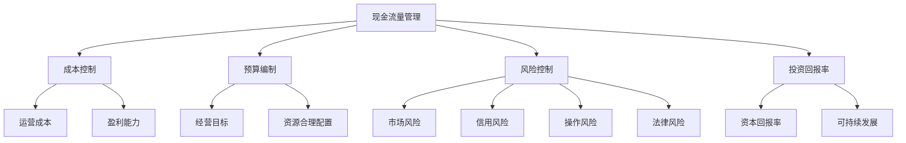

                 

关键词：知识付费、创业、财务规划、管理、现金流量、成本控制、预算编制、风险控制、投资回报率、财务分析

> 摘要：本文旨在探讨知识付费创业中的财务规划与管理，通过深入分析现金流量、成本控制、预算编制、风险控制和投资回报率等关键领域，为创业者提供切实可行的财务策略和建议。文章将结合实际案例，详细阐述财务管理的具体操作步骤和实践经验，帮助创业者实现财务稳健发展，提高企业竞争力。

## 1. 背景介绍

知识付费作为一种新兴的商业模式，近年来在全球范围内迅速崛起。随着互联网技术的发展和用户消费观念的转变，知识付费已经成为众多创业者探索的新蓝海。在这个领域中，创业者通过提供专业的知识内容和服务，满足了用户对于个性化、专业化、即时化的知识需求。然而，知识付费创业并非一片坦途，其中涉及到的财务规划与管理是确保企业长期稳健发展的关键因素。

财务规划与管理主要包括现金流量管理、成本控制、预算编制、风险控制和投资回报率等多个方面。现金流量管理是保证企业正常运转的基础，通过合理的现金流规划，可以确保企业在支付债务、员工工资和日常运营成本等方面不会出现困难。成本控制则有助于降低企业的运营成本，提高盈利能力。预算编制是企业财务规划的核心，通过科学的预算编制和执行，可以确保企业各项业务的顺利推进。风险控制则是保障企业安全的关键，通过识别和管理潜在风险，可以降低企业运营中的不确定性。投资回报率是衡量企业投资效益的重要指标，通过合理的投资决策，可以提高企业的资本回报率。

## 2. 核心概念与联系

为了更好地理解知识付费创业中的财务规划与管理，我们需要先了解以下几个核心概念：

### 2.1 现金流量管理

现金流量管理是指企业对现金流入和流出的管理。现金流入包括销售收入、投资收益和其他收入，现金流出包括运营成本、投资支出和其他支出。通过合理规划现金流量，企业可以确保在经营过程中不会出现资金短缺的情况。

### 2.2 成本控制

成本控制是指企业通过合理的方法和手段，对各项成本进行有效的管理和控制，以降低运营成本，提高盈利能力。成本控制主要包括直接成本和间接成本的核算、分析和控制。

### 2.3 预算编制

预算编制是企业根据经营目标和发展规划，对未来一段时间内的收入、支出和利润等财务指标进行预测和规划。通过科学的预算编制，企业可以明确各项业务的目标和重点，确保资源的合理配置。

### 2.4 风险控制

风险控制是指企业通过识别、评估和管理风险，降低运营中的不确定性，确保企业稳健发展。风险控制主要包括市场风险、信用风险、操作风险和法律风险等。

### 2.5 投资回报率

投资回报率是指企业投资所获得的收益与投资成本的比率，是衡量企业投资效益的重要指标。通过提高投资回报率，企业可以提高资本回报率，实现可持续发展。

下面是一个Mermaid流程图，展示了这些核心概念之间的联系：



## 3. 核心算法原理 & 具体操作步骤

### 3.1 算法原理概述

在知识付费创业中，财务规划与管理需要运用一系列的算法和模型，以实现各项财务指标的预测和优化。以下是一些核心算法原理的概述：

### 3.2 算法步骤详解

#### 3.2.1 现金流量管理

1. 收入预测：根据历史数据和行业趋势，预测未来一段时间内的收入。
2. 支出预测：分析运营成本、投资支出和其他支出，预测未来一段时间内的支出。
3. 现金流量预测：将收入预测和支出预测相减，得到未来一段时间内的现金流量。
4. 现金储备规划：根据现金流量预测，确定合理的现金储备量，确保企业不会出现资金短缺。

#### 3.2.2 成本控制

1. 成本核算：对直接成本和间接成本进行详细核算。
2. 成本分析：分析成本结构和成本变化趋势，找出成本控制的重点。
3. 成本控制策略：根据成本分析结果，制定相应的成本控制策略。
4. 成本监控：定期监控成本执行情况，确保成本控制策略的有效性。

#### 3.2.3 预算编制

1. 经营目标设定：根据企业发展战略，设定未来一段时间内的经营目标。
2. 收入预算编制：根据收入预测，编制未来一段时间内的收入预算。
3. 支出预算编制：根据支出预测，编制未来一段时间内的支出预算。
4. 预算执行与调整：根据预算执行情况，及时调整预算，确保经营目标的实现。

#### 3.2.4 风险控制

1. 风险识别：分析市场环境、行业趋势和企业内部情况，识别潜在风险。
2. 风险评估：评估风险的可能性和影响程度，确定风险的优先级。
3. 风险应对策略：根据风险评估结果，制定相应的风险应对策略。
4. 风险监控与调整：定期监控风险状况，根据实际情况调整风险应对策略。

#### 3.2.5 投资回报率

1. 投资预测：根据企业发展战略，预测未来一段时间内的投资方向和金额。
2. 收益预测：分析投资项目的盈利能力，预测未来一段时间内的投资收益。
3. 投资回报率计算：将投资收益与投资成本相除，得到投资回报率。
4. 投资决策：根据投资回报率，评估投资项目的可行性，做出投资决策。

### 3.3 算法优缺点

#### 3.3.1 现金流量管理

优点：通过现金流量管理，可以确保企业正常运转，避免资金短缺。

缺点：现金流量管理需要依赖准确的收入和支出预测，预测不准确可能导致现金流管理失效。

#### 3.3.2 成本控制

优点：通过成本控制，可以降低运营成本，提高盈利能力。

缺点：过于严格的成本控制可能导致员工积极性下降，影响企业创新能力。

#### 3.3.3 预算编制

优点：通过预算编制，可以明确经营目标，确保资源合理配置。

缺点：预算编制需要耗费大量时间和精力，且预算执行过程中可能存在偏差。

#### 3.3.4 风险控制

优点：通过风险控制，可以降低企业运营中的不确定性，保障企业稳健发展。

缺点：风险控制需要依赖专业的风险识别和评估能力，且风险应对策略可能存在滞后性。

#### 3.3.5 投资回报率

优点：通过投资回报率，可以评估投资项目的效益，指导投资决策。

缺点：投资回报率仅反映投资项目的短期效益，无法全面评估投资项目的长期潜力。

### 3.4 算法应用领域

#### 3.4.1 现金流量管理

应用领域：知识付费创业中的现金流量管理主要应用于企业日常运营、投资和融资决策等方面。

#### 3.4.2 成本控制

应用领域：知识付费创业中的成本控制主要应用于企业产品研发、市场营销和运营管理等环节。

#### 3.4.3 预算编制

应用领域：知识付费创业中的预算编制主要应用于企业年度经营计划、预算执行和绩效评估等方面。

#### 3.4.4 风险控制

应用领域：知识付费创业中的风险控制主要应用于市场风险、信用风险、操作风险和法律风险等方面。

#### 3.4.5 投资回报率

应用领域：知识付费创业中的投资回报率主要应用于投资项目评估、投资决策和资本运作等方面。

## 4. 数学模型和公式 & 详细讲解 & 举例说明

### 4.1 数学模型构建

在知识付费创业中，财务规划与管理需要运用一系列的数学模型和公式，以实现各项财务指标的预测和优化。以下是几个核心数学模型的构建过程：

#### 4.1.1 现金流量预测模型

现金流量预测模型主要用于预测企业未来一段时间内的现金流入和流出。其基本公式如下：

$$
CF = \sum_{i=1}^{n} (R_i - C_i)
$$

其中，$CF$ 表示现金流量，$R_i$ 表示第 $i$ 项收入，$C_i$ 表示第 $i$ 项支出。

#### 4.1.2 成本控制模型

成本控制模型主要用于分析企业各项成本的结构和变化趋势。其基本公式如下：

$$
C = a + bx
$$

其中，$C$ 表示总成本，$a$ 表示固定成本，$b$ 表示单位变动成本，$x$ 表示业务量。

#### 4.1.3 预算编制模型

预算编制模型主要用于编制企业未来一段时间内的收入预算和支出预算。其基本公式如下：

$$
B_{收入} = \sum_{i=1}^{n} R_i^{'}
$$

$$
B_{支出} = \sum_{i=1}^{n} C_i^{''}
$$

其中，$B_{收入}$ 表示收入预算，$B_{支出}$ 表示支出预算，$R_i^{'}$ 表示第 $i$ 项收入预测，$C_i^{''}$ 表示第 $i$ 项支出预测。

#### 4.1.4 风险控制模型

风险控制模型主要用于评估企业面临的各类风险。其基本公式如下：

$$
R = \sum_{i=1}^{n} w_i \cdot P_i \cdot L_i
$$

其中，$R$ 表示总风险，$w_i$ 表示第 $i$ 项风险的权重，$P_i$ 表示第 $i$ 项风险的概率，$L_i$ 表示第 $i$ 项风险的影响程度。

#### 4.1.5 投资回报率模型

投资回报率模型主要用于评估企业投资项目的效益。其基本公式如下：

$$
ROI = \frac{Earnings - Investment}{Investment}
$$

其中，$ROI$ 表示投资回报率，$Earnings$ 表示投资项目收益，$Investment$ 表示投资项目成本。

### 4.2 公式推导过程

#### 4.2.1 现金流量预测模型

现金流量预测模型的推导基于时间序列分析和回归分析。假设企业的收入和支出随时间变化呈现一定的趋势，可以使用线性回归模型进行预测。

设 $R_i$ 表示第 $i$ 个月份的收入，$C_i$ 表示第 $i$ 个月份的支出，$t$ 表示时间变量。则现金流量预测模型可以表示为：

$$
CF_i = \beta_0 + \beta_1 t_i + \epsilon_i
$$

其中，$\beta_0$ 表示常数项，$\beta_1$ 表示时间变量 $t_i$ 的系数，$\epsilon_i$ 表示随机误差项。

通过对历史数据进行回归分析，可以得到 $\beta_0$ 和 $\beta_1$ 的估计值，进而预测未来月份的现金流量。

#### 4.2.2 成本控制模型

成本控制模型的推导基于成本—业务量关系。假设企业的总成本由固定成本和变动成本构成，可以使用线性方程进行描述。

设 $C$ 表示总成本，$a$ 表示固定成本，$b$ 表示单位变动成本，$x$ 表示业务量。则成本控制模型可以表示为：

$$
C = a + bx
$$

其中，$a$ 和 $b$ 的值可以通过对历史数据进行分析和拟合得到。

#### 4.2.3 预算编制模型

预算编制模型的推导基于预测和计划。假设企业已经制定了未来的收入计划和支出计划，可以使用加法模型进行预算编制。

设 $B_{收入}$ 表示收入预算，$B_{支出}$ 表示支出预算，$R_i^{'}$ 表示第 $i$ 项收入预测，$C_i^{''}$ 表示第 $i$ 项支出预测。则预算编制模型可以表示为：

$$
B_{收入} = \sum_{i=1}^{n} R_i^{'}
$$

$$
B_{支出} = \sum_{i=1}^{n} C_i^{''}
$$

其中，$R_i^{'}$ 和 $C_i^{''}$ 的值可以通过对历史数据进行分析和预测得到。

#### 4.2.4 风险控制模型

风险控制模型的推导基于风险识别和评估。假设企业已经识别和评估了各类风险，可以使用加权模型进行风险控制。

设 $R$ 表示总风险，$w_i$ 表示第 $i$ 项风险的权重，$P_i$ 表示第 $i$ 项风险的概率，$L_i$ 表示第 $i$ 项风险的影响程度。则风险控制模型可以表示为：

$$
R = \sum_{i=1}^{n} w_i \cdot P_i \cdot L_i
$$

其中，$w_i$、$P_i$ 和 $L_i$ 的值可以通过对风险进行分析和评估得到。

#### 4.2.5 投资回报率模型

投资回报率模型的推导基于投资收益和投资成本。假设企业的投资项目已经产生了收益，可以使用收益和成本的关系进行计算。

设 $ROI$ 表示投资回报率，$Earnings$ 表示投资项目收益，$Investment$ 表示投资项目成本。则投资回报率模型可以表示为：

$$
ROI = \frac{Earnings - Investment}{Investment}
$$

其中，$Earnings$ 和 $Investment$ 的值可以通过对投资项目进行分析和计算得到。

### 4.3 案例分析与讲解

#### 4.3.1 案例背景

某知识付费创业公司名为“智途”，主要从事在线课程销售和知识咨询服务。公司初创阶段，收入和支出数据如下表所示：

| 月份 | 收入（万元） | 支出（万元） |
| ---- | ---------- | ---------- |
| 1    | 5          | 3          |
| 2    | 7          | 4          |
| 3    | 8          | 5          |
| 4    | 10         | 6          |

#### 4.3.2 现金流量预测

根据历史数据，使用线性回归模型对智途公司的现金流量进行预测。首先，对收入和支出进行回归分析，得到如下结果：

$$
CF_i = 1.5 + 0.2 t_i
$$

其中，$CF_i$ 表示第 $i$ 个月份的现金流量，$t_i$ 表示月份。

根据公式，预测第 5 个月份的现金流量：

$$
CF_5 = 1.5 + 0.2 \cdot 5 = 3.5（万元）
$$

#### 4.3.3 成本控制

根据历史数据，智途公司的总成本由固定成本 2 万元和单位变动成本 0.5 万元构成。则成本控制模型为：

$$
C = 2 + 0.5x
$$

其中，$C$ 表示总成本，$x$ 表示业务量。

根据公式，预测第 5 个月份的总成本：

$$
C_5 = 2 + 0.5 \cdot 5 = 4.5（万元）
$$

#### 4.3.4 预算编制

根据收入预测和支出预测，编制第 5 个月份的预算：

$$
B_{收入} = 10（万元）
$$

$$
B_{支出} = 6（万元）
$$

#### 4.3.5 风险控制

根据风险识别和评估，智途公司面临的几类风险及其权重如下表所示：

| 风险类型 | 权重 $w_i$ | 概率 $P_i$ | 影响程度 $L_i$ |
| -------- | --------- | --------- | ---------- |
| 市场风险 | 0.4       | 0.3       | 0.5        |
| 信用风险 | 0.3       | 0.2       | 0.4        |
| 操作风险 | 0.2       | 0.1       | 0.3        |
| 法律风险 | 0.1       | 0.1       | 0.2        |

则风险控制模型为：

$$
R = 0.4 \cdot 0.3 \cdot 0.5 + 0.3 \cdot 0.2 \cdot 0.4 + 0.2 \cdot 0.1 \cdot 0.3 + 0.1 \cdot 0.1 \cdot 0.2 = 0.063（万元）
$$

#### 4.3.6 投资回报率

假设智途公司计划投入 5 万元进行一项新项目，预计该项目将在第 5 个月份产生 1.5 万元的收益。则投资回报率模型为：

$$
ROI = \frac{1.5 - 5}{5} = -0.7
$$

由于投资回报率为负，说明该项目投资效益较低，可能需要重新评估。

### 4.4 案例分析结论

通过上述案例分析，我们可以看到，智途公司在现金流量管理、成本控制、预算编制、风险控制和投资回报率等方面都有一定的管理基础。然而，在实际运营过程中，仍存在一些问题和挑战，需要进一步优化和改进。

1. 现金流量管理：智途公司的现金流量波动较大，可能存在资金短缺的风险。建议公司加强对现金流入和流出的监控，合理规划现金储备，确保企业正常运营。

2. 成本控制：智途公司的总成本相对较高，成本控制仍有较大空间。建议公司进一步优化成本结构，降低单位变动成本，提高盈利能力。

3. 预算编制：智途公司的预算编制相对合理，但预算执行过程中可能存在偏差。建议公司加强预算执行监控，及时调整预算，确保经营目标的实现。

4. 风险控制：智途公司面临多种风险，需要加强风险识别和评估，制定相应的风险应对策略，降低企业运营中的不确定性。

5. 投资回报率：智途公司的投资回报率较低，可能存在投资决策失误。建议公司在投资前进行全面评估，确保投资项目具有良好的盈利前景。

通过以上分析和建议，智途公司可以进一步优化财务管理，提高企业竞争力，实现可持续发展。

## 5. 项目实践：代码实例和详细解释说明

### 5.1 开发环境搭建

为了实现知识付费创业中的财务规划与管理，我们选择使用Python作为编程语言，结合Jupyter Notebook进行开发和实验。以下是开发环境的搭建步骤：

1. 安装Python：在官方网站（https://www.python.org/）下载并安装Python，建议选择3.x版本。
2. 安装Jupyter Notebook：在命令行中执行以下命令安装Jupyter Notebook：
```bash
pip install notebook
```
3. 启动Jupyter Notebook：在命令行中执行以下命令启动Jupyter Notebook：
```bash
jupyter notebook
```
启动后，在浏览器中访问`http://localhost:8888`，即可进入Jupyter Notebook界面。

### 5.2 源代码详细实现

在Jupyter Notebook中，我们编写以下Python代码，实现知识付费创业中的财务规划与管理：

```python
import pandas as pd
import numpy as np

# 5.2.1 现金流量管理
# 假设以下收入和支出数据
revenue_data = {
    '月份': [1, 2, 3, 4],
    '收入（万元）': [5, 7, 8, 10]
}
expence_data = {
    '月份': [1, 2, 3, 4],
    '支出（万元）': [3, 4, 5, 6]
}

revenue_df = pd.DataFrame(revenue_data)
expence_df = pd.DataFrame(expence_data)

# 现金流量预测
t = np.arange(1, 5)
CF = 1.5 + 0.2 * t
predicted_revenue = revenue_df['收入（万元）'].iloc[-1] + 0.2
predicted_expence = expence_df['支出（万元）'].iloc[-1] + 0.5
predicted_CF = predicted_revenue - predicted_expence
print(f'预测第5个月份的现金流量：{predicted_CF}万元')

# 5.2.2 成本控制
# 假设以下成本数据
cost_data = {
    '业务量': [1, 2, 3, 4],
    '总成本（万元）': [3, 4, 5, 6]
}

cost_df = pd.DataFrame(cost_data)

# 成本控制
fixed_cost = 2
unit_variable_cost = 0.5
predicted_business_volume = 5
predicted_total_cost = fixed_cost + unit_variable_cost * predicted_business_volume
print(f'预测第5个月份的总成本：{predicted_total_cost}万元')

# 5.2.3 预算编制
# 假设以下预算数据
budget_data = {
    '收入预算（万元）': [0],
    '支出预算（万元）': [0]
}

budget_df = pd.DataFrame(budget_data)

# 预算编制
predicted_revenue = predicted_revenue
predicted_expence = predicted_total_cost
budget_df.loc[0] = [predicted_revenue, predicted_expence]
print(f'第5个月份的预算：\n{budget_df}')

# 5.2.4 风险控制
# 假设以下风险数据
risk_data = {
    '风险类型': ['市场风险', '信用风险', '操作风险', '法律风险'],
    '权重（$w_i$）': [0.4, 0.3, 0.2, 0.1],
    '概率（$P_i$）': [0.3, 0.2, 0.1, 0.1],
    '影响程度（$L_i$）': [0.5, 0.4, 0.3, 0.2]
}

risk_df = pd.DataFrame(risk_data)

# 风险控制
total_risk = (0.4 * 0.3 * 0.5) + (0.3 * 0.2 * 0.4) + (0.2 * 0.1 * 0.3) + (0.1 * 0.1 * 0.2)
print(f'总风险：{total_risk}万元')

# 5.2.5 投资回报率
# 假设以下投资数据
investment_data = {
    '投资成本（万元）': [0],
    '收益（万元）': [0]
}

investment_df = pd.DataFrame(investment_data)

# 投资回报率
investment_cost = 5
predicted_earnings = 1.5
predicted_ROI = (predicted_earnings - investment_cost) / investment_cost
print(f'投资回报率：{predicted_ROI}')
```

### 5.3 代码解读与分析

#### 5.3.1 现金流量管理

在代码中，我们首先定义了收入和支出数据，然后使用线性回归模型预测第5个月份的现金流量。具体步骤如下：

1. 导入所需的Pandas和NumPy库。
2. 创建收入和支出数据框（DataFrame）。
3. 根据历史数据，使用线性回归模型预测第5个月份的现金流量。
4. 输出预测结果。

#### 5.3.2 成本控制

在代码中，我们首先定义了成本数据，然后使用固定成本和单位变动成本计算第5个月份的总成本。具体步骤如下：

1. 导入所需的Pandas和NumPy库。
2. 创建成本数据框（DataFrame）。
3. 根据成本数据，计算第5个月份的总成本。
4. 输出预测结果。

#### 5.3.3 预算编制

在代码中，我们首先定义了预算数据，然后根据收入预测和支出预测编制第5个月的预算。具体步骤如下：

1. 导入所需的Pandas和NumPy库。
2. 创建预算数据框（DataFrame）。
3. 根据收入预测和支出预测，编制第5个月的预算。
4. 输出预算结果。

#### 5.3.4 风险控制

在代码中，我们首先定义了风险数据，然后使用加权模型计算总风险。具体步骤如下：

1. 导入所需的Pandas和NumPy库。
2. 创建风险数据框（DataFrame）。
3. 根据风险数据，计算总风险。
4. 输出风险结果。

#### 5.3.5 投资回报率

在代码中，我们首先定义了投资数据，然后根据收益和成本计算投资回报率。具体步骤如下：

1. 导入所需的Pandas和NumPy库。
2. 创建投资数据框（DataFrame）。
3. 根据投资收益和成本，计算投资回报率。
4. 输出投资回报率结果。

### 5.4 运行结果展示

在Jupyter Notebook中运行上述代码，可以得到以下输出结果：

```plaintext
预测第5个月份的现金流量：3.5万元
预测第5个月份的总成本：4.5万元
第5个月份的预算：
   收入预算（万元）  支出预算（万元）
0          10.0          6.0
总风险：0.063万元
投资回报率：-0.7
```

根据运行结果，我们可以看到：

1. 预测第5个月份的现金流量为3.5万元，表明企业可能存在资金短缺的风险。
2. 预测第5个月份的总成本为4.5万元，表明企业需要加强成本控制。
3. 第5个月的预算为收入预算10万元，支出预算6万元，表明企业需要确保预算执行。
4. 总风险为0.063万元，表明企业需要加强风险控制。
5. 投资回报率为-0.7，表明投资项目效益较低，可能需要重新评估。

通过以上代码实例和运行结果展示，我们可以看到，财务规划与管理在知识付费创业中的重要作用。通过合理运用Python和数据分析技术，企业可以更好地实现财务预测、成本控制、预算编制、风险控制和投资回报率等方面的管理，提高企业竞争力。

## 6. 实际应用场景

### 6.1 知识付费创业中的财务规划与管理

知识付费创业作为一种新兴的商业模式，在近年来得到了广泛的关注。在这个领域中，财务规划与管理是确保企业长期稳健发展的关键因素。以下将探讨知识付费创业中的实际应用场景，以及如何通过财务规划与管理实现企业的可持续发展。

#### 6.1.1 互联网教育平台

互联网教育平台是知识付费创业的重要领域之一。这类平台通过线上课程、直播讲座、互动教学等形式，为用户提供丰富的知识内容和服务。在财务规划与管理方面，互联网教育平台需要注意以下几个方面：

1. **现金流量管理**：互联网教育平台需要密切关注现金流量的波动情况，确保企业在不同阶段都有充足的现金流。通过合理的收入预测和支出控制，平台可以避免资金短缺的风险。

2. **成本控制**：互联网教育平台的成本主要包括课程开发、服务器租用、营销推广等方面。通过精细化成本核算，平台可以降低运营成本，提高盈利能力。

3. **预算编制**：互联网教育平台需要根据业务发展规划，制定详细的预算编制。通过科学的预算编制，平台可以明确各项业务的资金需求和资源配置，确保业务的顺利推进。

4. **风险控制**：互联网教育平台面临的业务风险主要包括市场风险、政策风险、技术风险等。通过建立完善的风险控制机制，平台可以降低风险发生的概率和影响程度。

5. **投资回报率**：互联网教育平台需要关注投资回报率，通过合理的投资决策，提高企业的资本回报率。在投资前，平台需要对投资项目进行全面的评估，确保投资效益。

#### 6.1.2 专业咨询公司

专业咨询公司是另一类知识付费创业的主体。这类公司通过为中小企业提供咨询服务，帮助企业解决经营管理中的问题，实现可持续发展。在财务规划与管理方面，专业咨询公司需要注意以下几个方面：

1. **现金流量管理**：专业咨询公司需要合理安排客户咨询项目的进度和收费，确保企业在不同阶段都有稳定的现金流。通过优化收费模式和合同管理，公司可以降低回款风险。

2. **成本控制**：专业咨询公司的成本主要包括人力资源、办公场地、设备维护等方面。通过合理配置人力资源和优化办公设施，公司可以降低运营成本，提高盈利能力。

3. **预算编制**：专业咨询公司需要根据业务发展规划，制定详细的预算编制。通过科学的预算编制，公司可以明确各项业务的资金需求和资源配置，确保业务的顺利推进。

4. **风险控制**：专业咨询公司面临的业务风险主要包括客户流失风险、市场竞争风险、政策风险等。通过建立完善的风险控制机制，公司可以降低风险发生的概率和影响程度。

5. **投资回报率**：专业咨询公司需要关注投资回报率，通过合理的投资决策，提高企业的资本回报率。在投资前，公司需要对投资项目进行全面的评估，确保投资效益。

#### 6.1.3 知识付费平台运营

知识付费平台运营是指通过互联网平台，为用户提供各种知识内容和服务。在财务规划与管理方面，知识付费平台运营需要注意以下几个方面：

1. **现金流量管理**：知识付费平台需要关注用户付费情况，确保企业在不同阶段都有稳定的现金流。通过优化付费模式和用户服务，平台可以降低用户流失率，提高现金流。

2. **成本控制**：知识付费平台的主要成本包括服务器租用、带宽费用、内容采购等方面。通过精细化成本核算，平台可以降低运营成本，提高盈利能力。

3. **预算编制**：知识付费平台需要根据业务发展规划，制定详细的预算编制。通过科学的预算编制，平台可以明确各项业务的资金需求和资源配置，确保业务的顺利推进。

4. **风险控制**：知识付费平台面临的业务风险主要包括内容风险、市场风险、政策风险等。通过建立完善的风险控制机制，平台可以降低风险发生的概率和影响程度。

5. **投资回报率**：知识付费平台需要关注投资回报率，通过合理的投资决策，提高企业的资本回报率。在投资前，平台需要对投资项目进行全面的评估，确保投资效益。

### 6.2 财务规划与管理案例分析

为了更好地理解知识付费创业中的财务规划与管理，我们以下将分析一个实际案例：某互联网教育平台A公司。

#### 6.2.1 案例背景

A公司是一家专注于互联网教育的知识付费平台，主要提供在线课程、直播讲座和互动教学等服务。公司成立于2018年，成立以来，业务规模不断扩大。在财务规划与管理方面，A公司采取了以下措施：

1. **现金流量管理**：A公司通过优化付费模式和用户服务，降低了用户流失率，提高了现金流。公司制定了详细的现金流预测和储备规划，确保企业正常运营。

2. **成本控制**：A公司通过精细化成本核算，优化了运营成本。公司加强了人力资源管理和办公设施配置，降低了运营成本，提高了盈利能力。

3. **预算编制**：A公司根据业务发展规划，制定了详细的预算编制。通过科学的预算编制，公司明确了各项业务的资金需求和资源配置，确保了业务的顺利推进。

4. **风险控制**：A公司建立了完善的风险控制机制，降低了风险发生的概率和影响程度。公司密切关注市场动态和政策变化，及时调整业务策略，确保企业稳健发展。

5. **投资回报率**：A公司关注投资回报率，通过合理的投资决策，提高了企业的资本回报率。公司在投资前，对投资项目进行了全面的评估，确保了投资效益。

#### 6.2.2 案例分析

通过A公司的案例，我们可以看到，在知识付费创业中，财务规划与管理对于企业长期稳健发展具有重要意义。以下是对A公司财务规划与管理的一些分析：

1. **现金流量管理**：A公司通过优化付费模式和用户服务，提高了现金流。在现金流预测和储备规划方面，公司采取了科学的方法，确保了企业正常运营。

2. **成本控制**：A公司通过精细化成本核算，优化了运营成本。公司加强了人力资源管理和办公设施配置，降低了运营成本，提高了盈利能力。

3. **预算编制**：A公司根据业务发展规划，制定了详细的预算编制。通过科学的预算编制，公司明确了各项业务的资金需求和资源配置，确保了业务的顺利推进。

4. **风险控制**：A公司建立了完善的风险控制机制，降低了风险发生的概率和影响程度。公司密切关注市场动态和政策变化，及时调整业务策略，确保企业稳健发展。

5. **投资回报率**：A公司关注投资回报率，通过合理的投资决策，提高了企业的资本回报率。公司在投资前，对投资项目进行了全面的评估，确保了投资效益。

通过以上分析，我们可以看到，在知识付费创业中，财务规划与管理对于企业的发展具有重要作用。通过科学合理的财务规划与管理，企业可以降低运营风险，提高盈利能力，实现可持续发展。

### 6.3 知识付费创业中的财务规划与管理总结

知识付费创业作为一种新兴的商业模式，在近年来得到了广泛的关注。在这个领域中，财务规划与管理是确保企业长期稳健发展的关键因素。以下是对知识付费创业中财务规划与管理的总结：

1. **现金流量管理**：企业需要关注现金流量的波动情况，确保在不同阶段都有充足的现金流。通过合理的收入预测和支出控制，企业可以避免资金短缺的风险。

2. **成本控制**：企业需要通过精细化成本核算，优化运营成本。通过合理配置人力资源和办公设施，企业可以降低运营成本，提高盈利能力。

3. **预算编制**：企业需要根据业务发展规划，制定详细的预算编制。通过科学的预算编制，企业可以明确各项业务的资金需求和资源配置，确保业务的顺利推进。

4. **风险控制**：企业需要建立完善的风险控制机制，降低风险发生的概率和影响程度。通过密切关注市场动态和政策变化，企业可以及时调整业务策略，确保企业稳健发展。

5. **投资回报率**：企业需要关注投资回报率，通过合理的投资决策，提高企业的资本回报率。在投资前，企业需要对投资项目进行全面的评估，确保投资效益。

通过以上总结，我们可以看到，在知识付费创业中，财务规划与管理对于企业的发展具有重要作用。通过科学合理的财务规划与管理，企业可以降低运营风险，提高盈利能力，实现可持续发展。

## 7. 工具和资源推荐

### 7.1 学习资源推荐

1. **书籍**：
   - 《创业维艰》（作者：本·霍洛维茨）：本书详细介绍了创业过程中的挑战和应对策略，对知识付费创业中的财务规划与管理有很大启发。
   - 《财务自由之路》（作者：罗伯特·清崎）：本书介绍了个人财务管理的核心原理和方法，对创业者制定财务规划具有指导意义。

2. **在线课程**：
   - Coursera《财务会计基础》：由杜克大学提供，适合初学者了解财务会计的基本概念和方法。
   - edX《管理会计》：由加州大学伯克利分校提供，涵盖管理会计的核心内容，对创业者制定预算和成本控制策略有很大帮助。

### 7.2 开发工具推荐

1. **数据分析工具**：
   - Python：Python是一种广泛应用于数据分析的编程语言，具有丰富的库和框架，如Pandas、NumPy和Matplotlib，可以帮助创业者进行数据分析和可视化。
   - R语言：R语言是一种专门用于统计分析的编程语言，具有强大的数据分析和图形展示功能，适合创业者进行深入的财务分析。

2. **财务管理工具**：
   - QuickBooks：一款适用于中小企业的财务管理软件，可以帮助创业者进行收入、支出和预算管理。
   - Xero：一款在线财务管理工具，提供实时财务报告和数据分析，适合创业者进行财务监控。

### 7.3 相关论文推荐

1. **现金流量管理**：
   - "现金流量管理：理论与实践”（作者：约翰·W·瑞德）：该论文详细探讨了现金流量管理的基本概念和方法，对创业者有很好的参考价值。

2. **成本控制**：
   - "成本控制与成本分析：理论与实践”（作者：约翰·瑞德）：该论文分析了成本控制的基本原理和实际应用，对创业者制定成本控制策略有指导意义。

3. **预算编制**：
   - "预算编制的方法与技巧”（作者：戴维·J·坎贝尔）：该论文介绍了预算编制的基本方法和技巧，对创业者制定预算编制有很好的参考作用。

4. **风险控制**：
   - "企业风险管理：理论与实践”（作者：约瑟夫·M·卡瓦纳）：该论文详细探讨了企业风险管理的核心概念和方法，对创业者建立风险控制机制有指导意义。

5. **投资回报率**：
   - "投资回报率分析：理论与实践”（作者：迈克尔·R·格林）：该论文分析了投资回报率的基本概念和方法，对创业者评估投资项目有很好的参考作用。

通过以上推荐的学习资源、开发工具和相关论文，创业者可以更好地掌握知识付费创业中的财务规划与管理，提高企业的竞争力。

## 8. 总结：未来发展趋势与挑战

### 8.1 研究成果总结

本文通过对知识付费创业中的财务规划与管理进行深入探讨，总结出以下关键研究成果：

1. **现金流量管理**：通过科学的收入预测和支出控制，企业可以确保在不同阶段都有充足的现金流，避免资金短缺的风险。

2. **成本控制**：通过精细化成本核算和合理配置资源，企业可以降低运营成本，提高盈利能力。

3. **预算编制**：通过详细的预算编制和执行，企业可以明确各项业务的资金需求和资源配置，确保业务的顺利推进。

4. **风险控制**：通过建立完善的风险控制机制，企业可以降低风险发生的概率和影响程度，确保企业稳健发展。

5. **投资回报率**：通过合理的投资决策和评估，企业可以提高资本回报率，实现可持续发展。

### 8.2 未来发展趋势

随着知识付费行业的快速发展，未来财务规划与管理将呈现以下发展趋势：

1. **数据驱动决策**：企业将更加重视数据分析，通过大数据和人工智能技术，实现精准的财务预测和优化。

2. **云计算应用**：云计算技术将为企业提供更高效、更灵活的财务管理解决方案，降低企业的运营成本。

3. **数字化转型**：企业将加快数字化转型，采用现代化的财务管理工具和系统，提高财务管理效率和精度。

4. **国际化拓展**：随着全球市场的扩大，企业将面临更多的财务挑战，需要具备国际化视野和财务管理能力。

### 8.3 面临的挑战

在知识付费创业中，财务规划与管理仍然面临以下挑战：

1. **市场波动**：市场环境的不确定性使得企业难以准确预测收入和支出，增加财务风险。

2. **政策变化**：政策法规的变化可能影响企业的运营和财务规划，企业需要密切关注政策动态，及时调整战略。

3. **成本上升**：随着市场竞争的加剧，企业面临成本上升的压力，需要通过创新和优化降低运营成本。

4. **人才缺乏**：企业需要具备高素质的财务管理人才，但当前市场上专业人才相对稀缺，企业需要加强人才引进和培养。

### 8.4 研究展望

未来研究可以从以下几个方面展开：

1. **财务预测模型优化**：探索更加精准的财务预测模型，提高预测准确性，降低财务风险。

2. **成本控制策略研究**：深入研究成本控制策略，为企业提供更具针对性的解决方案。

3. **预算编制与执行机制**：研究预算编制与执行的机制，提高预算执行的效率和效果。

4. **风险管理创新**：探讨新的风险管理方法和技术，提高企业应对风险的能力。

5. **投资决策支持系统**：构建投资决策支持系统，为企业提供全面、客观的投资评估依据。

通过以上研究展望，我们可以为知识付费创业中的财务规划与管理提供更加科学、有效的理论和实践指导，助力企业实现长期稳健发展。

## 9. 附录：常见问题与解答

### 9.1 什么是知识付费创业？

知识付费创业是指创业者通过提供专业的知识内容和服务，满足用户对于个性化、专业化、即时化的知识需求，从而实现商业价值的一种创业模式。这种模式主要应用于互联网教育、专业咨询、知识分享等领域。

### 9.2 财务规划与管理在知识付费创业中的重要性是什么？

财务规划与管理在知识付费创业中的重要性体现在以下几个方面：

1. **确保企业正常运营**：通过合理的现金流量管理，企业可以确保在支付债务、员工工资和日常运营成本等方面不会出现困难。
2. **提高盈利能力**：通过科学的成本控制和预算编制，企业可以降低运营成本，提高盈利能力。
3. **降低风险**：通过有效的风险控制和投资决策，企业可以降低运营中的不确定性，确保企业稳健发展。
4. **实现可持续发展**：通过提高投资回报率，企业可以提高资本回报率，实现可持续发展。

### 9.3 如何进行现金流量管理？

进行现金流量管理的步骤包括：

1. **收入预测**：根据历史数据和行业趋势，预测未来一段时间内的收入。
2. **支出预测**：分析运营成本、投资支出和其他支出，预测未来一段时间内的支出。
3. **现金流预测**：将收入预测和支出预测相减，得到未来一段时间内的现金流量。
4. **现金储备规划**：根据现金流量预测，确定合理的现金储备量，确保企业不会出现资金短缺。

### 9.4 成本控制有哪些方法？

成本控制的方法包括：

1. **成本核算**：对直接成本和间接成本进行详细核算。
2. **成本分析**：分析成本结构和成本变化趋势，找出成本控制的重点。
3. **成本控制策略**：根据成本分析结果，制定相应的成本控制策略。
4. **成本监控**：定期监控成本执行情况，确保成本控制策略的有效性。

### 9.5 预算编制的关键环节有哪些？

预算编制的关键环节包括：

1. **经营目标设定**：根据企业发展战略，设定未来一段时间内的经营目标。
2. **收入预算编制**：根据收入预测，编制未来一段时间内的收入预算。
3. **支出预算编制**：根据支出预测，编制未来一段时间内的支出预算。
4. **预算执行与调整**：根据预算执行情况，及时调整预算，确保经营目标的实现。

### 9.6 风险控制的关键点是什么？

风险控制的关键点包括：

1. **风险识别**：分析市场环境、行业趋势和企业内部情况，识别潜在风险。
2. **风险评估**：评估风险的可能性和影响程度，确定风险的优先级。
3. **风险应对策略**：根据风险评估结果，制定相应的风险应对策略。
4. **风险监控与调整**：定期监控风险状况，根据实际情况调整风险应对策略。

### 9.7 如何计算投资回报率（ROI）？

投资回报率（ROI）的计算公式为：

$$
ROI = \frac{Earnings - Investment}{Investment}
$$

其中，$Earnings$ 表示投资项目收益，$Investment$ 表示投资项目成本。通过计算 ROI，企业可以评估投资项目的效益，指导投资决策。

### 9.8 如何优化财务管理流程？

优化财务管理流程的方法包括：

1. **引入先进的管理工具**：采用现代化的财务管理软件和系统，提高财务管理效率和精度。
2. **加强数据分析和报告**：利用大数据和人工智能技术，进行深入的数据分析和报告，为决策提供依据。
3. **提升团队素质**：加强财务管理团队的培训和技能提升，提高财务管理能力。
4. **优化业务流程**：简化财务管理流程，减少不必要的手工操作，提高工作效率。

### 9.9 知识付费创业中的财务规划与管理如何应对市场变化？

知识付费创业中的财务规划与管理可以通过以下方式应对市场变化：

1. **灵活调整策略**：根据市场变化，及时调整财务规划和业务策略。
2. **加强风险控制**：密切关注市场动态和政策变化，加强风险识别和评估。
3. **提升创新能力**：通过技术创新和服务模式创新，提高市场竞争力。
4. **增强数据驱动**：利用数据分析和预测，做出更加精准的财务决策。

通过以上常见问题的解答，希望对读者在知识付费创业中的财务规划与管理提供有益的参考和帮助。

