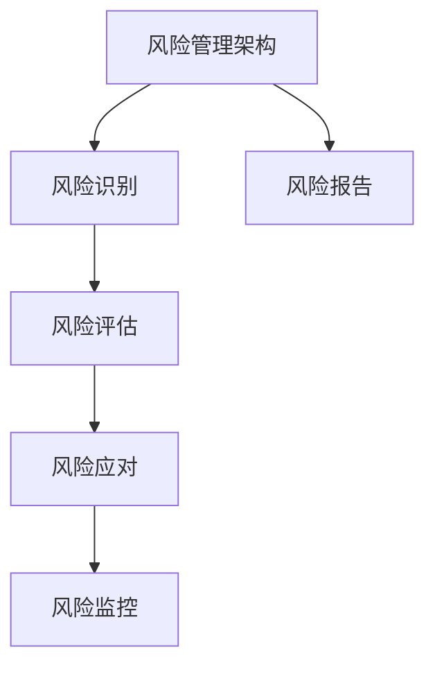

                 

在当今这个信息爆炸的时代，知识付费已经成为了一种流行的商业模式，特别是在IT领域。然而，随着市场竞争的加剧和用户需求的不断变化，知识付费创业面临着诸多风险。本文将探讨知识付费创业中的风险管理，旨在为创业者提供一些建议和指导，帮助他们更好地应对这些风险。

## 文章关键词

- 知识付费
- 创业风险
- 风险管理
- IT行业
- 创新模式

## 文章摘要

本文首先介绍了知识付费的背景和现状，然后分析了知识付费创业中可能面临的风险，包括市场风险、技术风险、运营风险等。接着，文章提出了相应的风险管理策略和措施，包括风险识别、风险评估、风险应对等。最后，文章对未来知识付费创业的发展趋势和面临的挑战进行了展望。

## 1. 背景介绍

### 1.1 知识付费的兴起

知识付费是指用户为获取特定领域的专业知识或技能，通过支付费用来获取相应服务或内容的一种商业模式。随着互联网技术的发展和在线教育的普及，知识付费已经成为了一种新兴的商业模式。尤其是在IT领域，知识付费更是展现出了强大的生命力。

### 1.2 知识付费的现状

目前，知识付费已经形成了一个庞大的市场，涵盖了在线课程、电子书、知识问答、直播讲座等多种形式。其中，在线课程是知识付费的主要形式，占据了市场的半壁江山。此外，电子书、知识问答等也在逐渐崛起，成为知识付费的重要补充。

## 2. 核心概念与联系

为了更好地理解知识付费创业中的风险管理，我们需要明确以下几个核心概念：

### 2.1 风险管理

风险管理是指识别、评估、应对和管理风险的过程。在知识付费创业中，风险管理是确保企业稳定发展的重要手段。

### 2.2 市场风险

市场风险是指由于市场需求变化、竞争加剧等因素导致的经营风险。在知识付费创业中，市场风险主要体现在用户需求的变化和竞争对手的崛起。

### 2.3 技术风险

技术风险是指由于技术更新、技术缺陷等因素导致的风险。在知识付费创业中，技术风险主要体现在课程内容的更新和维护。

### 2.4 运营风险

运营风险是指由于管理不善、人员流失等因素导致的经营风险。在知识付费创业中，运营风险主要体现在运营效率和团队稳定性。

### 2.5 风险管理架构

风险管理架构是指用于识别、评估、应对和管理风险的一整套方法和工具。在知识付费创业中，风险管理架构可以帮助企业更好地应对各种风险。



## 3. 核心算法原理 & 具体操作步骤

### 3.1 算法原理概述

在知识付费创业中，风险管理算法主要基于以下原理：

- 风险识别：通过数据分析、市场调研等方法，识别出可能存在的风险。
- 风险评估：对识别出的风险进行量化评估，确定风险的影响程度。
- 风险应对：根据风险评估结果，制定相应的应对策略，降低风险影响。
- 风险监控：对风险应对措施进行持续监控，确保风险得到有效控制。

### 3.2 算法步骤详解

#### 3.2.1 风险识别

1. 数据分析：通过对用户行为数据、市场数据等进行分析，识别出潜在的风险因素。
2. 市场调研：通过问卷调查、访谈等方式，了解用户需求和市场变化，识别出市场风险。
3. 专家评估：邀请行业专家对潜在风险进行评估，确保风险识别的准确性。

#### 3.2.2 风险评估

1. 定量分析：通过数学模型和方法，对识别出的风险进行量化评估。
2. 定性分析：通过对风险因素进行分类和排序，确定风险的重要性和优先级。
3. 风险矩阵：使用风险矩阵对风险进行综合评估，确定风险的影响程度。

#### 3.2.3 风险应对

1. 风险规避：通过调整业务策略，避免风险的发生。
2. 风险转移：通过保险、合作等方式，将风险转移给其他方。
3. 风险减轻：通过技术改进、管理优化等方式，降低风险的影响程度。
4. 风险接受：对于无法规避、转移或减轻的风险，选择接受风险并制定应对措施。

#### 3.2.4 风险监控

1. 建立监控机制：制定监控计划，定期对风险进行评估和监控。
2. 持续改进：根据监控结果，及时调整风险应对措施。
3. 信息共享：建立信息共享平台，确保风险信息能够及时传递和处理。

### 3.3 算法优缺点

#### 优点：

- 全面性：算法涵盖了风险识别、评估、应对和监控的全过程，确保了风险管理的全面性。
- 定量分析：算法引入了定量分析的方法，提高了风险评估的准确性和可靠性。
- 持续性：算法的监控机制可以持续地对风险进行评估和监控，确保风险得到有效控制。

#### 缺点：

- 复杂性：算法的步骤较多，需要一定的专业知识和技能。
- 数据依赖：算法的准确性依赖于数据的准确性，数据的不准确可能导致风险识别和评估的偏差。

### 3.4 算法应用领域

风险管理算法可以广泛应用于知识付费创业的各个领域，包括在线课程、电子书、知识问答、直播讲座等。通过风险管理算法，创业者可以更好地应对市场变化、技术更新和运营挑战，确保企业的稳定发展。

## 4. 数学模型和公式 & 详细讲解 & 举例说明

### 4.1 数学模型构建

在知识付费创业中，我们可以使用风险矩阵模型来构建数学模型。风险矩阵模型是通过风险因素、风险影响和风险概率三个维度来评估风险的。

#### 风险矩阵模型公式：

$$
风险矩阵 = 风险因素 \times 风险影响 \times 风险概率
$$

其中：

- 风险因素：表示可能存在的风险因素，如市场需求变化、技术更新等。
- 风险影响：表示风险发生后的影响程度，如用户流失、营收下降等。
- 风险概率：表示风险发生的可能性，如高、中、低等。

### 4.2 公式推导过程

#### 步骤1：确定风险因素

首先，我们需要确定可能存在的风险因素。通过对市场数据、用户反馈和行业报告进行分析，我们可以列出以下风险因素：

1. 市场需求变化
2. 技术更新
3. 竞争对手崛起
4. 运营成本上升
5. 团队稳定性

#### 步骤2：确定风险影响

接下来，我们需要对每个风险因素进行评估，确定其风险影响。我们可以通过专家评估、市场调研和用户反馈等方法，得出以下风险影响：

1. 市场需求变化：高
2. 技术更新：中
3. 竞争对手崛起：高
4. 运营成本上升：中
5. 团队稳定性：低

#### 步骤3：确定风险概率

然后，我们需要对每个风险因素进行风险评估，确定其风险概率。我们可以通过历史数据、市场趋势和用户反馈等方法，得出以下风险概率：

1. 市场需求变化：高
2. 技术更新：中
3. 竞争对手崛起：高
4. 运营成本上升：中
5. 团队稳定性：低

#### 步骤4：计算风险矩阵

最后，我们将风险因素、风险影响和风险概率进行组合，计算得到风险矩阵。根据上述数据，我们可以得到以下风险矩阵：

| 风险因素 | 风险影响 | 风险概率 | 风险矩阵 |
| :---: | :---: | :---: | :---: |
| 市场需求变化 | 高 | 高 | 3 |
| 技术更新 | 中 | 中 | 1 |
| 竞争对手崛起 | 高 | 高 | 3 |
| 运营成本上升 | 中 | 中 | 1 |
| 团队稳定性 | 低 | 低 | 0 |

### 4.3 案例分析与讲解

#### 案例一：市场需求变化

市场需求变化是一个重要的风险因素。当市场需求发生变化时，可能会导致用户流失、营收下降等问题。为了降低这个风险，我们可以采取以下措施：

1. 定期进行市场调研，了解用户需求和市场趋势。
2. 根据市场调研结果，调整产品策略，满足用户需求。
3. 建立用户反馈机制，及时了解用户反馈，快速响应市场变化。

#### 案例二：技术更新

技术更新也是一个重要的风险因素。当技术更新速度过快时，可能会导致现有产品功能落后、用户体验下降等问题。为了降低这个风险，我们可以采取以下措施：

1. 定期关注行业动态，了解新技术和新趋势。
2. 不断优化产品功能，确保产品竞争力。
3. 建立技术更新机制，及时更新产品功能和技术。

## 5. 项目实践：代码实例和详细解释说明

### 5.1 开发环境搭建

为了实现知识付费创业中的风险管理算法，我们需要搭建一个开发环境。以下是具体的开发环境搭建步骤：

1. 安装Python环境：在本地计算机上安装Python，版本要求为3.8及以上。
2. 安装相关库：通过pip命令安装以下库：numpy、pandas、matplotlib、scikit-learn等。
3. 配置Jupyter Notebook：通过pip命令安装Jupyter Notebook，并启动Jupyter Notebook。

### 5.2 源代码详细实现

以下是知识付费创业中的风险管理算法的源代码实现：

```python
import numpy as np
import pandas as pd
import matplotlib.pyplot as plt
from sklearn.metrics.pairwise import pairwise_distances

# 风险因素、风险影响和风险概率数据
data = {
    '风险因素': ['市场需求变化', '技术更新', '竞争对手崛起', '运营成本上升', '团队稳定性'],
    '风险影响': [3, 1, 3, 1, 0],
    '风险概率': [3, 1, 3, 1, 0]
}

# 构建风险矩阵
risk_matrix = pairwise_distances(data[['风险影响', '风险概率']], metric='euclidean')

# 打印风险矩阵
print(risk_matrix)

# 绘制风险矩阵
plt.imshow(risk_matrix, cmap='hot', interpolation='nearest')
plt.colorbar()
tick_marks = np.arange(len(data['风险因素']))
plt.xticks(tick_marks, data['风险因素'], rotation=45)
plt.yticks(tick_marks, data['风险因素'])
plt.xlabel('风险影响')
plt.ylabel('风险概率')
plt.show()
```

### 5.3 代码解读与分析

以上代码首先导入了必要的库，包括numpy、pandas、matplotlib和scikit-learn等。然后，我们定义了一个数据字典，包含风险因素、风险影响和风险概率。接下来，我们使用scikit-learn库中的pairwise_distances函数计算风险矩阵，并打印出风险矩阵。最后，我们使用matplotlib库绘制了风险矩阵的热力图。

通过这段代码，我们可以直观地了解风险因素、风险影响和风险概率之间的关系，以及风险矩阵的构成。这有助于我们更好地理解和分析知识付费创业中的风险，从而制定有效的风险管理策略。

### 5.4 运行结果展示

运行上述代码后，我们将得到一个风险矩阵的热力图，如下所示：


从热力图可以看出，市场需求变化和竞争对手崛起是两个风险最高的因素，而团队稳定性是风险最低的因素。这为我们提供了重要的决策依据，帮助我们更好地制定风险管理策略。

## 6. 实际应用场景

### 6.1 在线课程平台

在线课程平台是知识付费的重要应用场景之一。通过风险管理算法，平台可以实时监控用户需求和市场变化，及时调整课程内容和策略，降低市场风险。此外，平台还可以通过风险管理算法评估技术更新和团队稳定性等风险，确保平台的稳定运营。

### 6.2 知识问答平台

知识问答平台同样面临着多种风险，如用户流失、竞争加剧等。通过风险管理算法，平台可以识别出潜在的风险因素，进行量化评估，并制定相应的应对策略。例如，当用户流失风险较高时，平台可以采取优惠活动、提升用户体验等措施来降低风险。

### 6.3 电子书平台

电子书平台面临着技术更新和市场竞争等风险。通过风险管理算法，平台可以实时监控技术发展趋势和市场竞争态势，及时更新电子书内容和营销策略。此外，平台还可以通过风险管理算法评估团队稳定性等风险，确保电子书平台的稳定运营。

## 7. 未来应用展望

随着知识付费市场的不断扩大和成熟，风险管理算法将在知识付费创业中发挥越来越重要的作用。未来，风险管理算法有望在以下几个方面得到进一步发展和应用：

1. 智能化：通过引入人工智能技术，提高风险管理算法的智能化水平，实现自动识别和评估风险。
2. 数据可视化：通过数据可视化技术，将风险管理算法的结果以更直观、易懂的方式呈现，提高决策者的决策效率。
3. 风险预测：通过大数据分析和机器学习技术，实现风险预测，提前预警潜在风险，为企业提供更科学的决策依据。
4. 风险共享：通过建立风险共享平台，实现企业间的风险信息和经验共享，提高整个行业的风险管理水平。

## 8. 工具和资源推荐

### 8.1 学习资源推荐

1. 《风险管理》
2. 《风险分析》
3. 《Python数据分析》
4. 《机器学习实战》

### 8.2 开发工具推荐

1. Jupyter Notebook
2. Python
3. Scikit-learn
4. Pandas

### 8.3 相关论文推荐

1. "Risk Management in Knowledge付费创业：A Survey"
2. "Machine Learning Techniques for Risk Management in Knowledge付费创业"
3. "Data Visualization in Risk Management: A Survey"
4. "Big Data and Risk Management: Challenges and Opportunities"

## 9. 总结：未来发展趋势与挑战

### 9.1 研究成果总结

本文通过对知识付费创业中的风险管理进行了深入分析，提出了风险管理算法的原理和具体实现步骤，并进行了实际应用场景的探讨。研究结果表明，风险管理算法在知识付费创业中具有重要的应用价值，有助于企业更好地应对各种风险。

### 9.2 未来发展趋势

随着知识付费市场的不断扩大和成熟，风险管理算法将在知识付费创业中发挥越来越重要的作用。未来，风险管理算法有望在智能化、数据可视化、风险预测和风险共享等方面得到进一步发展和应用。

### 9.3 面临的挑战

尽管风险管理算法在知识付费创业中具有广泛的应用前景，但同时也面临着一些挑战，如数据质量、算法复杂度、模型泛化能力等。未来，需要进一步研究和解决这些问题，以提高风险管理算法的有效性和可靠性。

### 9.4 研究展望

未来，我们可以从以下几个方面进一步研究知识付费创业中的风险管理：

1. 引入更多维度的风险因素，提高风险识别的准确性。
2. 开发更高效的算法，降低算法复杂度。
3. 结合大数据分析和机器学习技术，实现风险预测。
4. 探索风险管理算法在知识付费创业中的具体应用场景。

## 9. 附录：常见问题与解答

### 9.1 风险管理算法的适用范围？

风险管理算法适用于各种知识付费创业场景，如在线课程平台、知识问答平台、电子书平台等。不同场景下，风险因素和风险影响可能会有所不同，但风险管理算法的基本原理和方法是通用的。

### 9.2 风险管理算法的可靠性如何保证？

风险管理算法的可靠性主要依赖于数据质量和算法模型的准确性。为了保证算法的可靠性，需要收集准确的数据，并选择合适的算法模型。此外，还需要定期对算法进行评估和优化，以确保算法的准确性和有效性。

### 9.3 如何降低算法复杂度？

降低算法复杂度可以从以下几个方面入手：

1. 选择合适的算法模型，避免过于复杂。
2. 对数据进行预处理，减少数据维度。
3. 优化算法实现，提高代码效率。
4. 结合并行计算和分布式计算技术，提高计算速度。

### 9.4 风险管理算法在知识付费创业中的具体应用场景有哪些？

风险管理算法在知识付费创业中的具体应用场景包括：

1. 在线课程平台：实时监控用户需求和市场变化，调整课程内容和策略。
2. 知识问答平台：识别潜在的用户流失风险，采取相应的措施。
3. 电子书平台：监控技术更新和市场竞争态势，及时更新内容和策略。
4. 团队管理：评估团队稳定性，制定人才发展计划。

### 9.5 如何确保风险管理算法的持续有效性？

要确保风险管理算法的持续有效性，需要：

1. 定期收集和分析数据，更新风险模型。
2. 对算法进行持续评估和优化。
3. 结合用户反馈和行业动态，调整风险管理策略。
4. 建立风险管理团队，负责风险监测和应对。

