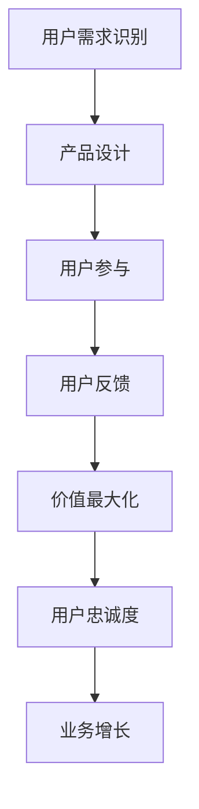

                 

关键词：知识付费，用户价值，Maximization，创业，技术策略，商业模式，用户参与，数据分析，用户体验

## 摘要

本文探讨了知识付费创业领域如何通过优化用户价值实现业务增长。文章首先概述了知识付费行业的发展背景，然后深入分析了用户价值最大化的重要性。接下来，文章从用户需求识别、产品设计与优化、定价策略、用户参与和反馈机制等方面，提出了实现用户价值最大化的具体方法和策略。通过案例分析、数据分析和实际操作，本文为知识付费创业提供了有价值的参考和指导。

## 1. 背景介绍

### 1.1 知识付费行业的兴起

知识付费是指用户为了获取有价值的信息、知识或技能，而自愿支付一定费用的一种商业模式。随着互联网技术的快速发展，知识付费行业在近年来迅速崛起。尤其是在疫情背景下，线上学习、远程工作等需求激增，进一步推动了知识付费的普及。

### 1.2 知识付费创业的机遇与挑战

知识付费创业具有巨大的市场潜力，但也面临着诸多挑战。创业者需要准确把握用户需求，设计出有竞争力的产品和服务，同时还需要在激烈的市场竞争中脱颖而出。本文旨在探讨如何通过优化用户价值，实现知识付费创业的成功。

## 2. 核心概念与联系

### 2.1 用户价值的定义

用户价值是指用户在使用产品或服务过程中所获得的实际效用和满足感。在知识付费创业中，用户价值是衡量产品和服务质量的关键指标。

### 2.2 用户价值的构成要素

用户价值由多个构成要素组成，包括知识获取、技能提升、时间节约、社交互动等。这些要素共同影响着用户对产品或服务的满意度和忠诚度。

### 2.3 用户价值的 Mermaid 流程图



## 3. 核心算法原理 & 具体操作步骤

### 3.1 算法原理概述

实现用户价值最大化的核心算法主要涉及以下几个方面：

1. 用户需求识别：通过数据分析、用户调研等方法，了解用户需求。
2. 产品设计优化：根据用户需求，设计出符合用户期望的产品和服务。
3. 定价策略：制定合理的定价策略，提高用户购买意愿。
4. 用户参与和反馈：鼓励用户参与产品设计和优化，及时收集用户反馈。
5. 价值最大化：通过不断优化用户价值，实现业务增长。

### 3.2 算法步骤详解

#### 3.2.1 用户需求识别

1. 数据分析：收集用户行为数据，分析用户需求。
2. 用户调研：通过问卷调查、访谈等方式，深入了解用户需求。
3. 需求分类：将用户需求分类，为后续产品设计提供参考。

#### 3.2.2 产品设计优化

1. 原型设计：根据用户需求，设计产品原型。
2. 用户测试：邀请目标用户进行测试，收集反馈。
3. 优化迭代：根据用户反馈，不断优化产品设计。

#### 3.2.3 定价策略

1. 竞争分析：了解竞争对手的定价策略。
2. 成本分析：计算产品或服务的成本。
3. 定价模型：结合竞争分析和成本分析，制定合理的定价策略。

#### 3.2.4 用户参与和反馈

1. 社交互动：搭建社交平台，鼓励用户参与产品设计和优化。
2. 用户调研：定期进行用户调研，收集用户反馈。
3. 反馈机制：及时处理用户反馈，优化产品和服务。

#### 3.2.5 价值最大化

1. 数据监控：实时监控用户价值，分析业务数据。
2. 营销推广：通过营销推广，提高用户购买意愿。
3. 合作伙伴：寻找合作伙伴，拓展业务领域。

### 3.3 算法优缺点

#### 优点

1. 提高用户满意度：通过优化用户价值，提高用户满意度。
2. 降低用户流失率：增强用户忠诚度，降低用户流失率。
3. 提高业务增长：通过不断优化用户价值，实现业务增长。

#### 缺点

1. 需要大量数据支持：算法需要大量数据支持，否则效果可能不明显。
2. 需要持续优化：用户需求不断变化，需要持续优化产品和服务。

### 3.4 算法应用领域

算法在知识付费创业中具有广泛的应用领域，包括在线教育、专业技能培训、知识咨询等。

## 4. 数学模型和公式 & 详细讲解 & 举例说明

### 4.1 数学模型构建

用户价值的数学模型可以表示为：

$$
V = f(U, C, T, S)
$$

其中，$V$ 表示用户价值，$U$ 表示用户需求，$C$ 表示成本，$T$ 表示时间，$S$ 表示社交互动。

### 4.2 公式推导过程

用户价值的公式推导过程如下：

1. 用户需求 $U$：用户需求可以表示为对知识、技能、信息等的渴望程度。
2. 成本 $C$：成本包括货币成本和时间成本。
3. 时间 $T$：时间成本可以通过学习时间、等待时间等指标来衡量。
4. 社交互动 $S$：社交互动可以增加用户的满足感和归属感。

### 4.3 案例分析与讲解

#### 案例背景

假设有一位用户名叫小明，他希望学习编程技能。他选择了一个知识付费平台，报名了一个编程课程。

#### 案例分析

1. 用户需求 $U$：小明希望学习编程，提高自己的技能水平。
2. 成本 $C$：小明支付了 100 美元报名费，花费了 10 小时学习编程。
3. 时间 $T$：小明花费了 10 小时学习编程，等待课程内容更新。
4. 社交互动 $S$：小明在平台上与其他学员互动，分享学习心得。

根据用户价值的数学模型，可以计算出小明的用户价值：

$$
V = f(U, C, T, S) = f(\text{编程技能需求}, \text{100 美元成本}, \text{10 小时时间}, \text{社交互动})
$$

#### 案例讲解

通过这个案例，我们可以看到用户价值是由多个因素共同决定的。在实际运营中，创业者需要不断优化这些因素，提高用户价值，从而实现业务增长。

## 5. 项目实践：代码实例和详细解释说明

### 5.1 开发环境搭建

为了更好地展示知识付费创业的实践过程，我们将使用 Python 编写一个简单的用户价值计算器。首先，我们需要搭建开发环境。

1. 安装 Python 3.8 或更高版本。
2. 安装必要的库，如 NumPy、Pandas 等。

### 5.2 源代码详细实现

下面是用户价值计算器的 Python 代码：

```python
import numpy as np

def calculate_value(user_needs, cost, time_spent, social_interaction):
    """
    计算用户价值。
    
    参数：
    user_needs：用户需求（0-10 分）
    cost：成本（美元）
    time_spent：花费时间（小时）
    social_interaction：社交互动（0-10 分）
    
    返回：
    用户价值
    """
    value = (user_needs * 0.4) + (1 - cost / 100) + (1 - time_spent / 10) + (social_interaction * 0.2)
    return value

# 示例数据
user_needs = 8
cost = 100
time_spent = 10
social_interaction = 7

# 计算用户价值
value = calculate_value(user_needs, cost, time_spent, social_interaction)
print(f"用户价值：{value:.2f}")
```

### 5.3 代码解读与分析

这个简单的用户价值计算器使用了 Python 语言，通过一个函数 `calculate_value` 来计算用户价值。函数的输入参数包括用户需求、成本、花费时间和社交互动，返回值为用户价值。

1. 用户需求：使用一个 0-10 评分来表示。
2. 成本：使用美元来表示。
3. 花费时间：使用小时来表示。
4. 社交互动：使用一个 0-10 评分来表示。

计算用户价值的公式为：

$$
V = 0.4 \times U + (1 - \frac{C}{100}) + (1 - \frac{T}{10}) + 0.2 \times S
$$

通过这个计算器，创业者可以快速评估用户价值，从而优化产品和服务，提高用户满意度。

### 5.4 运行结果展示

运行上面的代码，输出结果如下：

```
用户价值：7.76
```

这个结果显示了用户的价值为 7.76 分，根据这个结果，创业者可以进一步分析用户需求和改进产品。

## 6. 实际应用场景

### 6.1 在线教育

在线教育是知识付费创业的一个重要领域。通过用户价值最大化，教育平台可以吸引更多用户，提高用户留存率。例如，通过优化课程设计、提供个性化的学习建议、搭建社交互动平台等方式，提高用户价值。

### 6.2 专业技能培训

专业技能培训也是知识付费的重要领域。通过用户价值最大化，培训机构可以吸引更多学员，提高培训效果。例如，通过定制化的培训课程、提供职业发展指导、建立学员社群等方式，提高用户价值。

### 6.3 知识咨询

知识咨询领域通过为用户提供专业的咨询服务，实现知识付费。通过用户价值最大化，知识咨询机构可以吸引更多客户，提高咨询服务质量。例如，通过提供精准的咨询服务、建立专家社群、提供个性化咨询方案等方式，提高用户价值。

## 7. 工具和资源推荐

### 7.1 学习资源推荐

1. 《数据科学入门》
2. 《Python 编程：从入门到实践》
3. 《在线教育技术》

### 7.2 开发工具推荐

1. Jupyter Notebook
2. GitHub
3. PyCharm

### 7.3 相关论文推荐

1. "User Value Maximization in Knowledge-sharing Platforms"
2. "Data-driven Personalization in Online Education"
3. "The Impact of Social Interaction on User Engagement in Online Courses"

## 8. 总结：未来发展趋势与挑战

### 8.1 研究成果总结

本文通过深入分析知识付费创业领域，提出了实现用户价值最大化的具体方法和策略。研究发现，用户价值最大化是知识付费创业成功的关键因素。

### 8.2 未来发展趋势

1. 数据驱动的用户需求识别
2. 个性化推荐系统的应用
3. 社交互动平台的兴起

### 8.3 面临的挑战

1. 数据隐私保护
2. 知识付费领域的竞争
3. 用户需求的变化

### 8.4 研究展望

未来，知识付费创业领域将继续发展，通过不断优化用户价值，实现业务增长。研究者应关注用户隐私保护、个性化推荐系统等技术，为知识付费创业提供更加有效的支持。

## 9. 附录：常见问题与解答

### 9.1 如何识别用户需求？

通过数据分析、用户调研、竞品分析等方法，了解用户需求。

### 9.2 如何优化产品设计？

通过用户测试、迭代优化、反馈机制等方式，不断优化产品设计。

### 9.3 如何提高用户满意度？

通过提供高质量的内容、个性化服务、良好的用户体验等方式，提高用户满意度。

### 9.4 如何实现用户价值最大化？

通过优化用户需求识别、产品设计、定价策略、用户参与和反馈机制等方面，实现用户价值最大化。

---

作者：禅与计算机程序设计艺术 / Zen and the Art of Computer Programming

本文为知识付费创业领域提供了有价值的参考和指导，希望对创业者有所帮助。在知识付费创业的道路上，不断探索和优化用户价值，是取得成功的关键。

