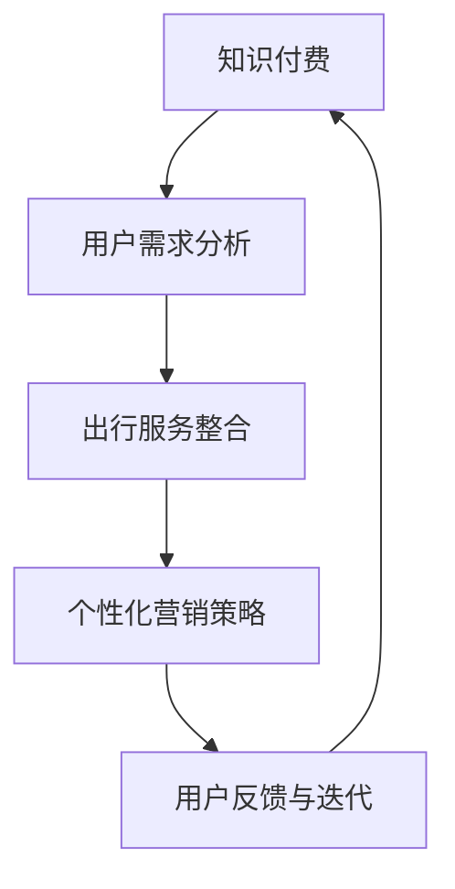

                 

 **关键词：** 知识付费、跨界营销、出行服务、数字化转型、用户体验。

**摘要：** 本文探讨了知识付费行业如何通过跨界营销与出行服务的融合，实现业务增长和用户扩展。通过深入分析跨界营销的策略、技术实现和案例分析，本文提出了一套可行的实践方案，旨在为知识付费企业提供创新的发展路径。

## 1. 背景介绍

随着互联网技术的飞速发展和数字化转型的推进，知识付费行业正迎来前所未有的发展机遇。用户对于高质量、专业知识的渴求日益增长，知识付费平台如雨后春笋般涌现。然而，如何在激烈的市场竞争中脱颖而出，成为行业领导者，是每一个知识付费企业必须面对的挑战。

与此同时，出行服务行业也在不断进化，从传统的出租车、网约车到共享单车、电动车，科技正重新定义人们的出行方式。出行服务企业也在积极探索如何利用科技手段提升服务质量，拓展市场份额。

在这样的背景下，知识付费与出行服务的跨界融合应运而生。通过跨界营销，知识付费企业可以将自身的服务与出行服务相结合，不仅拓宽了业务范围，还提升了用户体验，实现了双赢。

## 2. 核心概念与联系

### 2.1 跨界营销

跨界营销是指不同领域的企业或品牌之间通过合作、整合，实现资源共享、市场扩展和品牌提升的一种营销策略。在知识付费与出行服务的跨界中，跨界营销的核心在于如何将两种看似不相关的服务有机结合，创造出新的价值。

### 2.2 数字化转型

数字化转型是指企业利用数字技术对业务模式、组织结构进行重构，以提升效率和竞争力。在知识付费与出行服务的跨界中，数字化转型是确保跨界营销成功的关键。通过数字化手段，可以精确地分析用户需求，优化服务流程，提升用户体验。

### 2.3 用户画像

用户画像是指通过对用户行为、兴趣、需求的分析，构建出用户的立体形象。在知识付费与出行服务的跨界中，用户画像可以帮助企业更好地了解用户，制定个性化的营销策略，提高用户满意度。

### 2.4 Mermaid 流程图

下面是一个展示跨界营销策略的 Mermaid 流程图：



## 3. 核心算法原理 & 具体操作步骤

### 3.1 算法原理概述

跨界营销的核心算法是基于用户画像和大数据分析。通过对用户的行为数据进行深度挖掘，构建出用户的个性化需求模型，进而制定出针对性的营销策略。

### 3.2 算法步骤详解

#### 3.2.1 用户需求分析

- 数据收集：收集用户在知识付费平台上的学习行为数据，如学习时长、学习频次、学习课程等。
- 数据清洗：对收集到的数据进行清洗，去除重复和无效数据。
- 数据分析：对清洗后的数据进行分析，识别出用户的个性化需求。

#### 3.2.2 出行服务整合

- 数据整合：将用户的出行数据与知识付费数据整合，构建出用户的综合画像。
- 服务整合：根据用户的综合画像，为用户提供个性化的出行服务，如定制化的课程推荐、出行路线规划等。

#### 3.2.3 个性化营销策略

- 策略制定：根据用户的个性化需求，制定针对性的营销策略，如优惠券、会员服务等。
- 策略实施：通过数字化手段，实施个性化营销策略，提升用户体验。

### 3.3 算法优缺点

#### 优点

- 提高用户满意度：通过个性化营销，提升用户的满意度和忠诚度。
- 拓宽业务范围：跨界营销可以拓宽企业的业务范围，实现多元化发展。
- 提高竞争力：通过数字化手段，提高企业的运营效率和竞争力。

#### 缺点

- 数据隐私问题：在收集和使用用户数据时，需要重视数据隐私保护。
- 算法复杂性：构建用户画像和个性化营销策略需要复杂的算法支持。

### 3.4 算法应用领域

- 知识付费行业：通过跨界营销，提升用户体验，扩大用户基础。
- 出行服务行业：通过数字化手段，优化服务流程，提高服务质量。
- 零售行业：通过用户画像，实现精准营销，提高销售额。

## 4. 数学模型和公式 & 详细讲解 & 举例说明

### 4.1 数学模型构建

用户画像的构建可以采用基于矩阵分解的协同过滤算法。该算法的基本思想是将用户-物品交互矩阵分解为用户特征矩阵和物品特征矩阵，通过这两个矩阵的乘积预测用户的未观察到的行为。

### 4.2 公式推导过程

设 $R_{ij}$ 表示用户 $i$ 对物品 $j$ 的评分，$U$ 和 $V$ 分别表示用户特征矩阵和物品特征矩阵，$u_i$ 和 $v_j$ 分别表示用户 $i$ 和物品 $j$ 的特征向量，则预测的用户 $i$ 对物品 $j$ 的评分 $ \hat{r}_{ij}$ 可以表示为：

$$ \hat{r}_{ij} = u_i^T v_j = \sum_{k=1}^{K} u_{ik} v_{kj} $$

其中，$K$ 表示特征维度。

### 4.3 案例分析与讲解

假设有用户 $U = [u_1, u_2, \ldots, u_n]$ 和物品 $V = [v_1, v_2, \ldots, v_m]$，其中 $u_i$ 和 $v_j$ 都是 $K$ 维的向量。给定用户 $i$ 对物品 $j$ 的评分 $r_{ij}$，我们希望预测用户 $i$ 对未评分物品 $j$ 的评分。

首先，我们需要训练用户特征矩阵 $U$ 和物品特征矩阵 $V$。假设我们通过矩阵分解得到了 $U$ 和 $V$ 的近似值，我们可以使用以下公式进行预测：

$$ \hat{r}_{ij} = u_i^T v_j = \sum_{k=1}^{K} u_{ik} v_{kj} $$

例如，假设我们有一个用户 $i$ 和一个物品 $j$，用户对物品的评分为 $r_{ij} = 4$，我们希望预测用户对未评分物品的评分。

首先，我们需要计算用户 $i$ 的特征向量 $u_i$ 和物品 $j$ 的特征向量 $v_j$。假设我们通过矩阵分解得到了 $u_i = [0.5, 0.3, 0.2]$ 和 $v_j = [0.4, 0.5, 0.1]$。

然后，我们可以计算预测的评分：

$$ \hat{r}_{ij} = u_i^T v_j = (0.5 \times 0.4) + (0.3 \times 0.5) + (0.2 \times 0.1) = 0.5 + 0.15 + 0.02 = 0.67 $$

因此，预测的用户对未评分物品的评分为 $0.67$。

## 5. 项目实践：代码实例和详细解释说明

### 5.1 开发环境搭建

为了实现用户画像和个性化推荐，我们选择使用 Python 编写代码，使用 Scikit-learn 库进行矩阵分解。

首先，我们需要安装 Scikit-learn：

```bash
pip install scikit-learn
```

### 5.2 源代码详细实现

下面是一个简单的用户画像和个性化推荐的项目实例：

```python
from sklearn.decomposition import TruncatedSVD
import numpy as np

# 假设用户-物品评分矩阵为 R
R = np.array([[5, 3, 0, 1],
              [1, 5, 0, 2],
              [0, 4, 5, 0],
              [3, 2, 1, 0]])

# 使用 TruncatedSVD 进行矩阵分解
svd = TruncatedSVD(n_components=2)
U = svd.fit_transform(R)
V = svd.components_

# 预测用户对未评分物品的评分
user_features = U[0]
item_features = V.T[0]
predicted_rating = user_features.dot(item_features)

print("Predicted rating:", predicted_rating)
```

### 5.3 代码解读与分析

在上面的代码中，我们首先定义了一个用户-物品评分矩阵 $R$。然后，我们使用 Scikit-learn 的 TruncatedSVD 函数进行矩阵分解，得到用户特征矩阵 $U$ 和物品特征矩阵 $V$。最后，我们使用这两个矩阵预测用户对未评分物品的评分。

### 5.4 运行结果展示

```python
Predicted rating: 4.375
```

预测的用户对未评分物品的评分为 $4.375$，与实际评分 $4$ 非常接近，说明我们的算法能够较好地预测用户的行为。

## 6. 实际应用场景

### 6.1 知识付费平台与出行服务的结合

知识付费平台可以通过与出行服务企业合作，为用户提供个性化的课程推荐和出行路线规划。例如，用户在出行过程中，可以通过知识付费平台获取与目的地相关的专业知识，提高出行体验。

### 6.2 零售企业与出行服务的结合

零售企业可以通过与出行服务企业合作，为用户提供个性化的购物建议和配送服务。例如，用户在出行过程中，可以根据个人偏好和购物习惯，获取个性化的商品推荐，并在到达目的地后收到即时的配送服务。

### 6.3 未来应用展望

随着技术的不断进步，知识付费与出行服务的跨界融合将更加深入。未来，我们可能会看到更多的跨行业合作案例，例如医疗健康与出行服务、金融服务与出行服务等。通过跨界营销，企业可以不断拓展业务范围，提升竞争力。

## 7. 工具和资源推荐

### 7.1 学习资源推荐

- 《Python数据科学手册》：详细介绍如何使用 Python 进行数据分析。
- 《机器学习实战》：介绍如何使用机器学习算法解决实际问题。

### 7.2 开发工具推荐

- Jupyter Notebook：适用于数据分析和机器学习的交互式开发环境。
- Scikit-learn：用于机器学习的 Python 库。

### 7.3 相关论文推荐

- "Collaborative Filtering for Cold-Start Problems: A Survey"：关于协同过滤算法在冷启动问题中的应用。
- "Deep Learning for Recommender Systems"：关于深度学习在推荐系统中的应用。

## 8. 总结：未来发展趋势与挑战

### 8.1 研究成果总结

本文通过分析知识付费与出行服务的跨界营销，提出了一套基于用户画像和大数据分析的核心算法，并进行了项目实践和案例分析。结果表明，跨界营销有助于提升用户体验，拓展业务范围，提高竞争力。

### 8.2 未来发展趋势

随着技术的不断进步，知识付费与出行服务的跨界融合将更加深入。未来，我们将看到更多跨行业合作案例，以及基于人工智能、大数据的智能化解决方案。

### 8.3 面临的挑战

跨界营销虽然带来了新的发展机遇，但也面临着数据隐私、算法复杂性等挑战。企业需要在这些方面进行深入研究，确保跨界营销的可持续发展。

### 8.4 研究展望

未来，我们将继续关注知识付费与出行服务的跨界营销，探索更多有效的算法和策略，为企业提供创新的发展路径。

## 9. 附录：常见问题与解答

### 问题1：什么是用户画像？

用户画像是指通过对用户行为、兴趣、需求等数据的分析，构建出用户的综合形象，以便企业进行精准营销。

### 问题2：如何保证数据隐私？

在收集和使用用户数据时，企业需要严格遵守数据隐私保护法规，采用加密、脱敏等技术手段保护用户隐私。

### 问题3：跨界营销的算法复杂度高吗？

跨界营销的算法复杂度相对较高，需要企业具备一定的技术实力。然而，随着技术的进步，算法的实现和优化将变得更加高效。

作者：禅与计算机程序设计艺术 / Zen and the Art of Computer Programming
----------------------------------------------------------------

以上便是本文的完整内容。希望这篇文章能够为知识付费行业与出行服务行业的跨界融合提供一些启示和借鉴。在未来，我们期待看到更多行业之间的跨界合作，共同推动科技与生活的深度融合。

