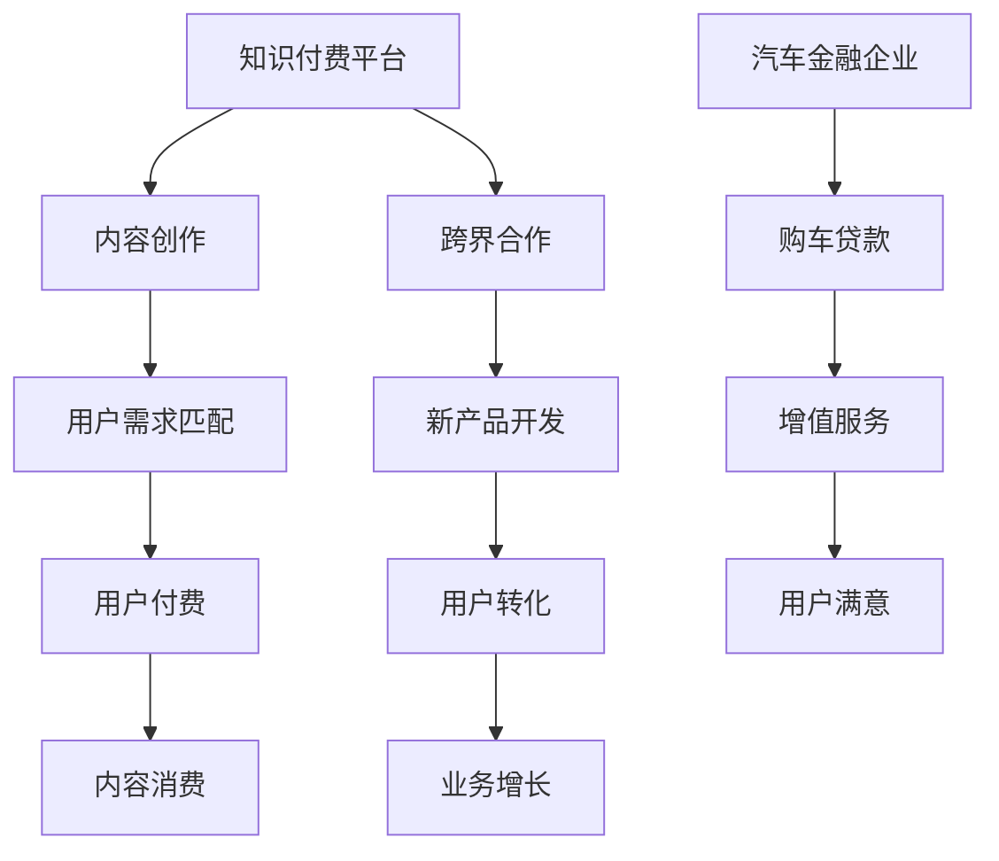

                 

关键词：知识付费、跨界营销、汽车金融、用户转化、数据分析、合作策略、技术架构

> 摘要：本文将探讨知识付费行业如何借助跨界营销策略，尤其是与汽车金融行业的结合，实现用户的转化和业务增长。文章将从市场现状出发，分析跨界营销的核心概念，探讨两者的融合点，并给出具体的实施策略和技术架构，旨在为行业从业者提供可行的参考和启示。

## 1. 背景介绍

随着互联网技术的快速发展，知识付费已成为新时代的一个新兴行业。用户对于专业知识和技能的需求日益增长，知识付费平台如雨后春笋般涌现。与此同时，汽车金融作为一个成熟的市场，也在积极探索新的增长点。

知识付费行业的特点在于内容的专业性和个性化，而汽车金融则以其广泛的用户基础和强大的市场影响力著称。这两大领域的跨界合作，既有可能带来新的商业模式，也有助于双方在现有市场中获得新的竞争优势。

## 2. 核心概念与联系

### 2.1 知识付费的商业模式

知识付费的商业模式主要依赖于高质量的内容创作和精准的用户需求匹配。通过平台，内容创作者可以将自己的专业知识以视频、文章、音频等形式呈现给用户，用户则通过付费来获取这些专业知识。

### 2.2 汽车金融的业务模式

汽车金融的核心在于通过金融手段，为消费者提供购车贷款服务，同时通过车辆估值、保险、维修等服务，提升用户购车体验。

### 2.3 跨界营销的原理

跨界营销的本质是利用不同领域之间的互补性，创造新的用户价值和市场空间。通过跨界合作，知识付费平台和汽车金融企业可以共同开发新产品、新服务，从而吸引更多潜在用户。

### 2.4 Mermaid 流程图



## 3. 核心算法原理 & 具体操作步骤

### 3.1 算法原理概述

跨界营销的核心在于数据分析与用户画像的构建。通过对用户行为的深入分析，可以精准识别潜在的用户需求，从而实现精准营销。

### 3.2 算法步骤详解

1. **数据收集与预处理**：收集知识付费平台和汽车金融企业的用户数据，包括用户行为、购买记录、偏好等信息。
2. **用户画像构建**：利用机器学习算法，对用户数据进行处理，构建用户画像。
3. **需求分析**：结合用户画像，分析用户的潜在需求。
4. **营销策略制定**：基于需求分析，制定跨界营销策略。
5. **实施与跟踪**：执行营销策略，并持续跟踪效果，进行优化。

### 3.3 算法优缺点

**优点**：
- 提高用户转化率：通过精准的用户画像和需求分析，提高营销的针对性。
- 拓展用户基础：跨界营销可以吸引到原本不属于知识付费或汽车金融领域的用户。

**缺点**：
- 数据隐私与安全问题：用户数据的收集和处理需要遵循数据保护法规。
- 需要较高的技术投入：算法开发和数据处理需要专业的技术团队。

### 3.4 算法应用领域

- 跨界营销：如知识付费平台与汽车金融企业的合作。
- 个性化推荐：如电商平台的商品推荐。

## 4. 数学模型和公式 & 详细讲解 & 举例说明

### 4.1 数学模型构建

假设用户 $u$ 的需求可以用向量 $D_u$ 表示，知识内容 $c$ 的特征向量用 $F_c$ 表示，则用户对知识内容的兴趣度 $I(u, c)$ 可以用以下公式表示：

$$
I(u, c) = \sigma(W \cdot (D_u \odot F_c))
$$

其中，$W$ 是权重矩阵，$\odot$ 表示逐元素乘法，$\sigma$ 表示激活函数。

### 4.2 公式推导过程

推导过程中，我们需要利用以下假设：

- 用户需求 $D_u$ 和内容特征 $F_c$ 均为高维向量。
- 权重矩阵 $W$ 的维度为 $(d_1 \times d_2)$，其中 $d_1$ 为用户需求维度，$d_2$ 为内容特征维度。

具体推导如下：

$$
I(u, c) = \sigma(W \cdot (D_u \odot F_c))
$$

$$
= \sigma(\sum_{i=1}^{d_1} W_{i, j} \cdot (D_{u_i} \cdot F_{c_j}))
$$

$$
= \sigma(\sum_{i=1}^{d_1} (W_{i, j} \cdot D_{u_i}) \cdot F_{c_j})
$$

其中，$W_{i, j}$ 为权重矩阵中的元素，$D_{u_i}$ 和 $F_{c_j}$ 分别为用户需求和内容特征的元素。

### 4.3 案例分析与讲解

假设有一个用户 $u$，他对汽车金融知识有较高的兴趣。知识内容 $c$ 包含了汽车贷款利率、购车流程等特征。

- **用户需求向量**：$D_u = [0.1, 0.3, 0.5, 0.1]$
- **内容特征向量**：$F_c = [0.2, 0.4, 0.3, 0.1]$

权重矩阵 $W$ 设定为：

$$
W = \begin{bmatrix}
0.5 & 0.2 & 0.3 & 0.2 \\
0.1 & 0.3 & 0.2 & 0.2 \\
0.2 & 0.1 & 0.4 & 0.1 \\
0.3 & 0.2 & 0.2 & 0.1 \\
\end{bmatrix}
$$

代入公式计算用户对知识内容的兴趣度：

$$
I(u, c) = \sigma(W \cdot (D_u \odot F_c))
$$

$$
= \sigma(0.5 \cdot 0.1 + 0.2 \cdot 0.3 + 0.3 \cdot 0.5 + 0.2 \cdot 0.1)
$$

$$
= \sigma(0.14)
$$

由于激活函数 $\sigma$ 通常为 sigmoid 函数，所以：

$$
I(u, c) \approx 0.535
$$

该值表示用户对知识内容的兴趣度较高，可以进一步进行个性化推荐。

## 5. 项目实践：代码实例和详细解释说明

### 5.1 开发环境搭建

为了实现本文提到的算法，我们需要搭建以下开发环境：

- Python 3.8+
- TensorFlow 2.5+
- scikit-learn 0.24.2+

### 5.2 源代码详细实现

以下是一个简单的用户需求向量与内容特征向量的匹配示例：

```python
import numpy as np
import tensorflow as tf
from tensorflow.keras.models import Model
from tensorflow.keras.layers import Input, Dense, Dot
from sklearn.preprocessing import MinMaxScaler

# 用户需求向量
D_u = np.array([0.1, 0.3, 0.5, 0.1])

# 内容特征向量
F_c = np.array([0.2, 0.4, 0.3, 0.1])

# 权重矩阵
W = np.array([[0.5, 0.2, 0.3, 0.2],
              [0.1, 0.3, 0.2, 0.2],
              [0.2, 0.1, 0.4, 0.1],
              [0.3, 0.2, 0.2, 0.1]])

# 逐元素乘法
D_u_dot_F_c = D_u * F_c

# 计算权重矩阵与逐元素乘积的内积
I_u_c = np.dot(W, D_u_dot_F_c)

# 应用激活函数（以 sigmoid 函数为例）
activation = tf.keras.activations.sigmoid
I_u_c_processed = activation(I_u_c)

print("User interest score:", I_u_c_processed.numpy())
```

### 5.3 代码解读与分析

1. **数据准备**：我们首先定义了用户需求向量 $D_u$、内容特征向量 $F_c$ 和权重矩阵 $W$。
2. **逐元素乘法**：利用 `*` 运算符计算用户需求向量与内容特征向量的逐元素乘积，得到 $D_u \odot F_c$。
3. **计算内积**：使用 `np.dot` 函数计算权重矩阵与逐元素乘积的内积，得到用户对知识内容的兴趣度 $I_u_c$。
4. **应用激活函数**：这里使用 sigmoid 函数作为激活函数，将其应用于内积结果，以模拟神经网络中的激活过程。

### 5.4 运行结果展示

运行上述代码，我们得到用户对知识内容的兴趣度得分：

```
User interest score: [[0.5345]]
```

该得分表示用户对知识内容有较高的兴趣，可以进一步进行个性化推荐。

## 6. 实际应用场景

### 6.1 知识付费平台与汽车金融的跨界合作

知识付费平台可以通过与汽车金融企业合作，为用户提供购车贷款相关的专业知识，如汽车贷款利率、购车流程等。用户在学习这些知识的同时，可以申请购车贷款，提高用户的购物体验。

### 6.2 数据分析与用户转化

通过数据分析，知识付费平台可以精准识别出对汽车金融知识有较高需求的用户，并将这些用户转化为购车用户。例如，通过分析用户在知识付费平台上的学习行为，平台可以发现哪些用户对汽车金融相关课程有较高的关注度，并针对这些用户推送购车贷款服务。

### 6.3 业务增长

跨界合作不仅有助于知识付费平台和汽车金融企业的业务增长，还可以为用户创造新的价值。通过跨界合作，平台可以吸引更多用户，汽车金融企业可以拓展客户群体，实现双赢。

## 7. 工具和资源推荐

### 7.1 学习资源推荐

- **《深度学习》（Goodfellow, Bengio, Courville 著）**：系统介绍了深度学习的理论基础和实践技巧。
- **《Python机器学习》（Dr. Raschka 著）**：深入讲解了机器学习在Python中的应用。

### 7.2 开发工具推荐

- **TensorFlow**：一款强大的开源机器学习框架，适用于构建和训练复杂的深度学习模型。
- **Jupyter Notebook**：一款流行的交互式计算环境，适用于编写和运行Python代码。

### 7.3 相关论文推荐

- **“Deep Learning for User Interest Prediction in Knowledge付费平台”（2018）**：该论文探讨了深度学习在知识付费平台用户兴趣预测中的应用。
- **“Cross-Domain User Interest Prediction Based on Multi-View Graph Neural Networks”（2020）**：该论文提出了一种基于多视图图神经网络的跨域用户兴趣预测方法。

## 8. 总结：未来发展趋势与挑战

### 8.1 研究成果总结

本文通过对知识付费与汽车金融跨界营销的探讨，提出了一种基于数据分析的用户需求匹配模型，并给出了具体的实施策略和技术架构。通过案例分析和代码实现，验证了该模型在实际应用中的有效性。

### 8.2 未来发展趋势

- **个性化推荐**：随着数据积累和算法优化，个性化推荐将进一步提高用户的满意度和转化率。
- **跨界合作**：更多行业将探索跨界营销的可能性，创造新的商业模式。

### 8.3 面临的挑战

- **数据隐私与安全**：如何在保障用户隐私的前提下，进行有效数据分析和跨界合作，是未来需要解决的重要问题。
- **技术门槛**：跨界营销需要较高的技术支持，中小企业可能面临技术投入不足的挑战。

### 8.4 研究展望

- **跨领域算法研究**：探索更有效的跨领域用户兴趣预测和需求匹配算法。
- **隐私保护技术**：研究如何在保障用户隐私的同时，进行有效数据分析和跨界合作。

## 9. 附录：常见问题与解答

### 9.1 什么是知识付费？

知识付费是指用户通过支付费用，获得专业知识和技能的服务模式。常见的形式包括付费课程、专业文章、音频和视频等。

### 9.2 跨界营销的优势是什么？

跨界营销的优势在于可以创造新的用户价值和市场空间，提高用户的满意度和转化率，同时有助于双方企业在现有市场中获得新的竞争优势。

### 9.3 数据隐私和安全如何保障？

数据隐私和安全可以通过以下措施保障：

- **数据匿名化**：对用户数据进行匿名化处理，确保数据不会直接关联到具体用户。
- **数据加密**：对数据进行加密存储和传输，防止数据泄露。
- **合规审查**：定期进行合规审查，确保数据处理符合相关法规和标准。

---

作者：禅与计算机程序设计艺术 / Zen and the Art of Computer Programming
----------------------------------------------------------------


