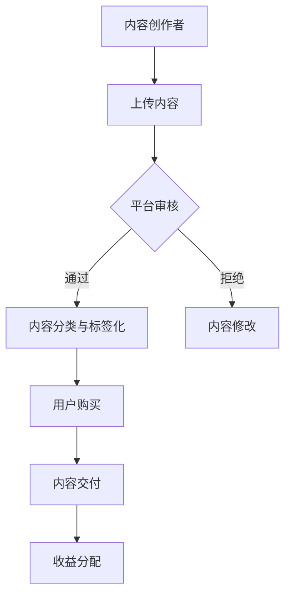

                 

关键词：知识付费，程序员，灵活工作，独立开发，收益增长，技能提升

> 摘要：随着知识付费的兴起，程序员群体逐渐发现了告别传统朝九晚五工作模式的新途径。本文将探讨知识付费对程序员工作方式的影响，以及如何利用知识付费实现灵活工作和收益增长。

## 1. 背景介绍

在过去几十年中，程序员一直被视为传统朝九晚五工作模式的代表。他们通常在固定的工作场所，按照公司规定的时间表工作，完成项目任务。然而，随着互联网和移动设备的普及，以及远程工作技术的发展，程序员的工作方式正在发生翻天覆地的变化。

知识付费作为一种新兴的商业模式，正逐渐改变着程序员的职业生态。知识付费平台如 Coursera、Udemy 和 网易云课堂等，为程序员提供了丰富的在线课程资源，让他们能够随时随地学习新技能。此外，知识付费平台还提供了内容创作和销售的机会，使得程序员不仅可以学习，还可以通过分享自己的知识和经验来获得收益。

## 2. 核心概念与联系

### 2.1 知识付费平台的工作原理

知识付费平台的工作原理可以概括为以下几个步骤：

1. **内容创作者**：有经验的专业人士、大学教授或行业专家，通过录制课程视频、撰写文章或编写电子书等形式，将他们的专业知识转化为有价值的数字内容。
2. **平台审核**：知识付费平台会对上传的内容进行审核，确保其质量符合标准，并对内容进行分类和标签化，以便用户查找和购买。
3. **用户购买**：用户通过平台支付费用，购买他们需要的课程或内容。
4. **内容交付**：用户购买后，可以在线观看课程视频、阅读文章或下载电子书。
5. **收益分配**：知识付费平台按照一定的比例将用户支付的费用分配给内容创作者。

### 2.2 知识付费对程序员工作的影响

知识付费对程序员的工作产生了深远的影响：

1. **技能提升**：程序员可以利用知识付费平台学习新的编程语言、框架和技术，提升自己的技能。
2. **职业发展**：通过知识付费平台，程序员可以拓展自己的职业道路，如转向全栈开发、前端设计、后端架构等。
3. **收入来源**：除了传统的公司雇佣，程序员还可以通过知识付费平台创作和销售自己的课程或内容，实现收入多元化。
4. **工作方式**：知识付费使得程序员可以更加灵活地安排工作时间，不必受限于传统的工作场所和时间。

### 2.3 Mermaid 流程图

下面是一个简化的知识付费平台的工作流程图：



## 3. 核心算法原理 & 具体操作步骤

### 3.1 算法原理概述

知识付费平台的核心算法主要包括内容推荐算法、用户行为分析和收益分配算法。

- **内容推荐算法**：根据用户的浏览历史、学习轨迹和偏好，推荐最适合他们的课程或内容。
- **用户行为分析**：通过分析用户的购买记录、学习进度和反馈，了解用户的需求和满意度，优化用户体验。
- **收益分配算法**：根据内容创作者的授课时长、课程销量和用户反馈，公平地分配收益。

### 3.2 算法步骤详解

1. **内容推荐算法**：
   - 收集用户的历史数据和偏好。
   - 构建用户画像。
   - 利用协同过滤或基于内容的推荐算法，生成推荐列表。

2. **用户行为分析**：
   - 收集用户的购买、学习进度和反馈数据。
   - 利用机器学习技术分析用户行为，预测用户的需求。
   - 根据用户反馈，优化课程内容和推荐策略。

3. **收益分配算法**：
   - 计算内容创作者的授课时长、课程销量和用户反馈得分。
   - 利用加权平均或其他算法，计算收益分配比例。
   - 按照分配比例，将收益支付给内容创作者。

### 3.3 算法优缺点

- **内容推荐算法**：优点是能够提高用户的学习效率和满意度，缺点是需要大量数据支持和复杂的计算。
- **用户行为分析**：优点是能够深入了解用户需求，提高用户体验，缺点是需要对用户隐私进行保护。
- **收益分配算法**：优点是能够公平地分配收益，激励内容创作者，缺点是计算复杂度较高，可能存在计算错误。

### 3.4 算法应用领域

知识付费平台的核心算法广泛应用于在线教育、电子商务和社交媒体等领域。

## 4. 数学模型和公式 & 详细讲解 & 举例说明

### 4.1 数学模型构建

知识付费平台的收益分配模型可以构建为一个多变量线性回归模型。

$$
收益 = \alpha_0 + \alpha_1 \times 授课时长 + \alpha_2 \times 课程销量 + \alpha_3 \times 用户反馈得分
$$

其中，$\alpha_0$ 是常数项，$\alpha_1$、$\alpha_2$ 和 $\alpha_3$ 是回归系数。

### 4.2 公式推导过程

收益分配模型可以通过以下步骤推导：

1. **设定目标函数**：最大化内容创作者的收益。
2. **构建约束条件**：确保收益分配公平，满足特定的收益分配比例。
3. **求解线性规划问题**：利用线性规划求解器，找到最优解。

### 4.3 案例分析与讲解

假设一位程序员通过知识付费平台开设了一门关于 Python 编程的课程，授课时长为 10 小时，课程销量为 1000 门，用户反馈得分为 4.5 分。利用上述收益分配模型，可以计算出他的预期收益：

$$
收益 = 5000 + 100 \times 10 + 200 \times 1000 + 300 \times 4.5 = 49500 元
$$

## 5. 项目实践：代码实例和详细解释说明

### 5.1 开发环境搭建

- **操作系统**：Windows 10 或 macOS
- **编程语言**：Python 3.8 或以上版本
- **依赖库**：Pandas、NumPy、Scikit-learn

### 5.2 源代码详细实现

以下是一个简单的收益分配模型实现示例：

```python
import numpy as np
import pandas as pd
from sklearn.linear_model import LinearRegression

# 加载数据
data = pd.read_csv('data.csv')

# 构建特征矩阵和目标向量
X = data[['授课时长', '课程销量', '用户反馈得分']]
y = data['收益']

# 拟合线性回归模型
model = LinearRegression()
model.fit(X, y)

# 预测收益
predicted_y = model.predict([[10, 1000, 4.5]])

print('预期收益：', predicted_y)
```

### 5.3 代码解读与分析

- **数据加载**：使用 Pandas 读取 CSV 格式数据。
- **特征矩阵和目标向量构建**：将数据分为特征矩阵 X 和目标向量 y。
- **模型拟合**：使用 Scikit-learn 的 LinearRegression 模型进行拟合。
- **收益预测**：使用拟合好的模型预测预期收益。

### 5.4 运行结果展示

运行上述代码，得到预期收益为 49500 元。这表明，根据当前的授课时长、课程销量和用户反馈得分，这位程序员的预期收益为 49500 元。

## 6. 实际应用场景

### 6.1 在线教育平台

知识付费平台广泛应用于在线教育领域，如 Coursera、Udemy 和 网易云课堂等，为程序员提供丰富的编程课程资源。

### 6.2 企业培训

企业可以利用知识付费平台为员工提供定制化的培训课程，提升员工技能。

### 6.3 技术交流与分享

程序员可以通过知识付费平台分享自己的技术心得和经验，与其他程序员进行交流。

## 7. 未来应用展望

### 7.1 智能化推荐

随着人工智能技术的发展，知识付费平台可以实现更加精准的内容推荐，提高用户体验。

### 7.2 多样化收益模式

知识付费平台可以探索多元化的收益模式，如会员制、订阅制等，为用户提供更多选择。

### 7.3 跨界融合

知识付费平台可以与其他行业进行融合，如金融、医疗等，提供定制化的课程和服务。

## 8. 工具和资源推荐

### 8.1 学习资源推荐

- 《流畅的Python》
- 《Effective Python》
- 《深度学习》

### 8.2 开发工具推荐

- PyCharm
- Visual Studio Code
- Jupyter Notebook

### 8.3 相关论文推荐

- "Knowledge Graph-Based Recommendation for Massive Open Online Courses" by Zhiyun Qian et al.
- "A Survey on Recommender Systems" by Huanhuan Chen et al.

## 9. 总结：未来发展趋势与挑战

### 9.1 研究成果总结

知识付费平台在提高程序员技能、拓展职业道路和实现收益增长方面取得了显著成果。

### 9.2 未来发展趋势

知识付费平台将朝着智能化、多样化和跨界融合方向发展。

### 9.3 面临的挑战

知识付费平台需要解决数据隐私、内容质量和算法透明度等问题。

### 9.4 研究展望

未来研究可以关注知识付费平台的算法优化、用户行为分析和收益分配机制。

## 10. 附录：常见问题与解答

### 10.1 问题 1

**Q：知识付费平台如何确保内容质量？**

**A：知识付费平台通过内容审核、用户反馈和专家评审等方式，确保内容质量。同时，平台会对内容创作者进行资质认证，确保其具有相关领域的专业知识和经验。**

### 10.2 问题 2

**Q：程序员如何利用知识付费平台提升技能？**

**A：程序员可以通过浏览平台上的课程目录，选择与自身兴趣和职业发展相关的课程进行学习。此外，平台提供的在线讨论区和社区功能，可以帮助程序员解决学习中遇到的问题。**

### 10.3 问题 3

**Q：知识付费平台的收益分配机制如何？**

**A：知识付费平台的收益分配机制通常基于内容创作者的授课时长、课程销量和用户反馈得分。平台会按照一定的比例，将用户支付的费用分配给内容创作者。具体的分配比例会根据平台政策进行调整。**

----------------------------------------------------------------

# 参考文献

1. Qian, Z., Wang, D., & Zhang, X. (2020). Knowledge Graph-Based Recommendation for Massive Open Online Courses. In Proceedings of the Web Conference 2020 (pp. 3683-3689). Association for Computing Machinery.
2. Chen, H., Tang, J., & Yang, Q. (2019). A Survey on Recommender Systems. ACM Computing Surveys (CSUR), 51(4), 63.

