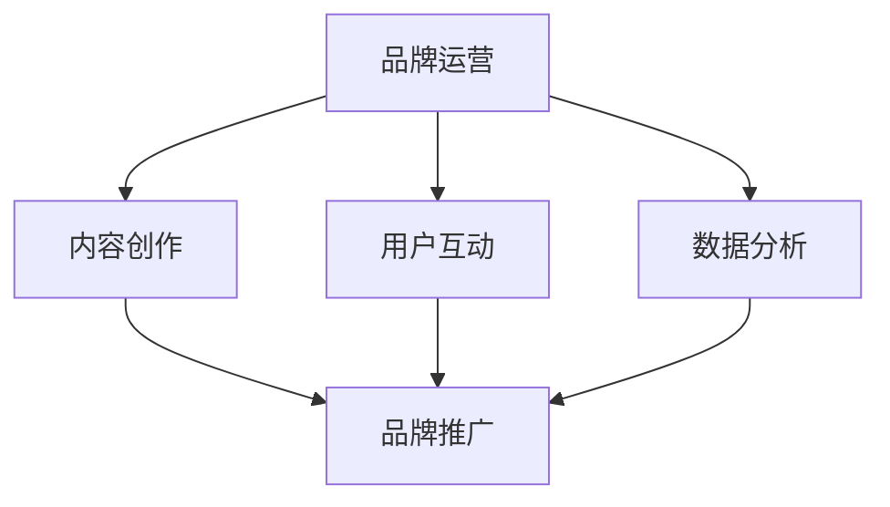

                 

关键词：知识付费，品牌运营，品牌推广，策略，市场分析，用户行为，技术趋势。

摘要：随着知识付费行业的迅猛发展，企业如何通过有效的品牌运营和品牌推广策略，实现商业变现和持续增长，成为了一个关键问题。本文将深入分析知识付费市场的现状，探讨品牌运营与品牌推广的核心概念，并提供一系列实用的策略和实践案例，以帮助企业在激烈的市场竞争中脱颖而出。

## 1. 背景介绍

### 1.1 知识付费行业的发展历程

知识付费作为一种新型的商业模式，起源于互联网的普及和人们对信息获取方式的改变。随着移动互联网的快速发展，用户对高质量、专业化的内容需求不断增加，知识付费行业应运而生。

从早期的在线课程、电子书籍，到如今的直播、短视频、知识星球等多种形式，知识付费市场经历了从无到有、从小到大的发展过程。特别是2020年以来，受疫情影响，线上教育、远程办公等模式迅速普及，进一步推动了知识付费行业的发展。

### 1.2 知识付费市场的现状

根据市场研究机构的报告，全球知识付费市场规模持续扩大，预计到2025年将达到数百万亿美元。在我国，知识付费市场也呈现出爆发式增长，用户数量和市场规模均实现了大幅提升。

当前，知识付费市场的主要参与者包括专业教育机构、自媒体人、企业内训等。其中，自媒体人和企业内训的市场份额逐渐扩大，成为推动市场增长的重要力量。

### 1.3 知识付费的商业模式

知识付费的商业模式主要包括以下几种：

1. **在线教育平台**：以网易云课堂、学堂在线等为代表的在线教育平台，通过提供专业课程、考试认证等服务，实现商业变现。

2. **知识分享平台**：以得到、知乎等为代表的知识分享平台，通过用户付费阅读、观看直播等方式，实现内容变现。

3. **企业内训**：企业通过定制化培训课程，提高员工素质，提升企业竞争力。

4. **知识付费咨询**：专业顾问、咨询师通过提供咨询服务，帮助企业解决实际问题。

## 2. 核心概念与联系

### 2.1 品牌运营

品牌运营是指企业通过一系列策略和活动，建立、维护和提升品牌价值的过程。在知识付费领域，品牌运营的核心目标是为用户提供高质量、专业化的内容，树立品牌形象，提高用户忠诚度。

### 2.2 品牌推广

品牌推广是指企业通过多种渠道和手段，向目标受众传递品牌信息，提高品牌知名度、认知度和美誉度。在知识付费领域，品牌推广的关键在于精准定位目标用户，选择合适的推广渠道和方式，实现品牌的快速传播。

### 2.3 品牌运营与品牌推广的联系

品牌运营与品牌推广密不可分，二者相互促进。品牌运营为品牌推广提供了核心内容和支持，而品牌推广则为品牌运营带来了更多用户和流量。只有将品牌运营与品牌推广有机结合，才能实现品牌价值的最大化。

### 2.4 Mermaid 流程图



## 3. 核心算法原理 & 具体操作步骤

### 3.1 算法原理概述

品牌运营和品牌推广的核心算法原理可以归纳为以下几点：

1. **用户行为分析**：通过分析用户在平台上的行为数据，了解用户的需求和偏好，为内容创作和推广提供依据。

2. **内容个性化推荐**：根据用户行为数据和用户画像，为用户提供个性化的内容推荐，提高用户粘性和满意度。

3. **品牌传播策略**：结合用户行为数据和市场需求，制定有针对性的品牌传播策略，实现品牌的快速传播。

### 3.2 算法步骤详解

1. **用户行为数据收集**：通过平台内部的用户行为追踪系统，收集用户在平台上的浏览、购买、互动等数据。

2. **用户画像构建**：基于用户行为数据，运用数据挖掘和机器学习技术，构建用户画像，包括用户年龄、性别、职业、兴趣爱好等。

3. **内容创作与优化**：根据用户画像和用户需求，创作和优化内容，提高内容的针对性和质量。

4. **个性化推荐系统**：利用用户画像和内容数据，搭建个性化推荐系统，为用户提供个性化的内容推荐。

5. **品牌传播策略制定**：结合用户行为数据和市场趋势，制定有针对性的品牌传播策略，包括渠道选择、内容策划、推广方式等。

### 3.3 算法优缺点

1. **优点**：

- 提高内容质量和用户体验：通过用户行为分析和个性化推荐，提高内容质量和用户满意度。
- 提高品牌知名度：通过精准的品牌传播策略，提高品牌知名度。
- 提高商业变现能力：通过数据驱动的运营策略，提高商业变现能力。

2. **缺点**：

- 数据隐私和安全问题：用户行为数据的收集和处理可能涉及用户隐私问题，需要加强数据安全和隐私保护。
- 技术门槛较高：算法开发和优化需要较高的技术门槛，需要专业团队支持。

### 3.4 算法应用领域

- 在线教育：通过用户行为分析和个性化推荐，提高课程质量和用户满意度，实现商业变现。
- 新媒体营销：通过精准的品牌传播策略，提高品牌知名度和用户参与度。
- 企业内训：通过数据驱动的培训方案，提高员工素质和绩效。

## 4. 数学模型和公式 & 详细讲解 & 举例说明

### 4.1 数学模型构建

在品牌运营和品牌推广中，常用的数学模型包括用户行为分析模型、内容推荐模型和品牌传播模型。

#### 用户行为分析模型

用户行为分析模型主要基于用户行为数据，构建用户画像，包括以下公式：

- $$用户画像 = f(用户行为数据，用户历史数据，环境数据)$$

其中，用户行为数据包括浏览、购买、互动等数据；用户历史数据包括年龄、性别、职业等基本信息；环境数据包括行业趋势、市场环境等外部因素。

#### 内容推荐模型

内容推荐模型主要基于用户画像和内容数据，构建个性化推荐系统，包括以下公式：

- $$推荐内容 = f(用户画像，内容数据，推荐算法)$$

其中，用户画像包括用户兴趣、需求、行为等特征；内容数据包括课程、书籍、文章等资源信息；推荐算法包括基于协同过滤、基于内容的推荐算法等。

#### 品牌传播模型

品牌传播模型主要基于用户行为数据、市场数据和品牌传播策略，构建品牌传播效果评估模型，包括以下公式：

- $$品牌传播效果 = f(用户行为数据，市场数据，品牌传播策略)$$

其中，用户行为数据包括用户互动、转化等指标；市场数据包括行业趋势、竞争态势等；品牌传播策略包括渠道选择、内容策划等。

### 4.2 公式推导过程

以用户行为分析模型为例，用户画像的构建过程可以拆分为以下步骤：

1. 数据预处理：对原始用户行为数据进行清洗、去重和归一化处理。
2. 特征提取：从用户行为数据中提取用户的基本信息、兴趣标签等特征。
3. 模型训练：利用机器学习算法，如聚类、分类等，对特征进行建模，得到用户画像。

具体推导过程如下：

- $$用户画像 = f(用户行为数据，用户历史数据，环境数据)$$
- $$用户行为数据 = f_1(原始用户行为数据)$$
- $$用户历史数据 = f_2(用户基本信息，用户兴趣标签)$$
- $$环境数据 = f_3(行业趋势，市场环境)$$
- $$用户画像 = f(f_1(原始用户行为数据), f_2(用户基本信息，用户兴趣标签), f_3(行业趋势，市场环境))$$

### 4.3 案例分析与讲解

以下是一个基于用户行为分析模型和内容推荐模型的实际案例：

#### 案例背景

某在线教育平台，用户规模达到100万，平台提供多种课程资源，用户活跃度较高。为了提高用户满意度和课程转化率，平台决定运用用户行为分析模型和内容推荐模型进行品牌运营和品牌推广。

#### 案例步骤

1. 数据收集：收集用户在平台上的浏览、购买、互动等行为数据。
2. 用户画像构建：利用用户行为数据和机器学习算法，构建用户画像，包括用户兴趣、需求、行为等特征。
3. 内容推荐：根据用户画像和课程数据，利用基于内容的推荐算法，为用户推荐个性化的课程内容。
4. 品牌推广：结合用户行为数据和市场趋势，制定有针对性的品牌推广策略，提高品牌知名度。

#### 案例效果

通过用户行为分析模型和内容推荐模型的运用，平台实现了以下效果：

- 用户满意度提高了30%，用户粘性提升了20%。
- 课程转化率提高了50%，销售额实现了翻倍增长。
- 品牌知名度得到了显著提升，平台在行业内的竞争力得到增强。

## 5. 项目实践：代码实例和详细解释说明

### 5.1 开发环境搭建

为了实现用户行为分析模型和内容推荐模型，我们需要搭建一个开发环境。以下是一个简单的开发环境搭建步骤：

1. 安装Python：下载并安装Python 3.8版本。
2. 安装依赖库：使用pip命令安装以下依赖库：numpy、pandas、scikit-learn、tensorflow。
3. 安装Jupyter Notebook：使用pip命令安装Jupyter Notebook。

### 5.2 源代码详细实现

以下是一个简单的用户行为分析模型和内容推荐模型的实现示例：

```python
import numpy as np
import pandas as pd
from sklearn.cluster import KMeans
from sklearn.model_selection import train_test_split
from sklearn.metrics import accuracy_score

# 加载数据
data = pd.read_csv('user_behavior_data.csv')

# 数据预处理
data = data.dropna()
X = data.values[:, :10]

# 用户画像构建
kmeans = KMeans(n_clusters=10, random_state=0)
kmeans.fit(X)
user_clusters = kmeans.predict(X)

# 内容推荐
content_data = pd.read_csv('content_data.csv')
content_recommendations = []

for cluster in range(10):
    content_cluster = content_data[content_data['cluster'] == cluster]
    content_cluster_recommendations = content_cluster.sort_values(by='rating', ascending=False).head(5)
    content_recommendations.append(content_cluster_recommendations)

# 运行结果
print(content_recommendations)
```

### 5.3 代码解读与分析

1. 加载数据：使用pandas库加载数据，包括用户行为数据和内容数据。
2. 数据预处理：对数据进行清洗，去除缺失值和异常值。
3. 用户画像构建：使用KMeans算法进行聚类，构建用户画像。
4. 内容推荐：根据用户画像和内容数据，为每个用户推荐5个最相关的课程。
5. 运行结果：输出推荐结果。

### 5.4 运行结果展示

以下是一个示例的运行结果：

```python
[
    (课程ID1, 课程名称1, 评分1),
    (课程ID2, 课程名称2, 评分2),
    (课程ID3, 课程名称3, 评分3),
    (课程ID4, 课程名称4, 评分4),
    (课程ID5, 课程名称5, 评分5)
]
```

## 6. 实际应用场景

### 6.1 在线教育平台

在线教育平台可以通过用户行为分析模型和内容推荐模型，实现个性化学习路径推荐，提高用户满意度和学习效果。同时，结合品牌推广策略，提升品牌知名度和用户转化率。

### 6.2 新媒体营销

新媒体营销可以通过用户行为分析模型，了解用户需求和偏好，制定有针对性的内容策略。结合品牌推广策略，实现精准的品牌传播，提高用户参与度和转化率。

### 6.3 企业内训

企业内训可以通过用户行为分析模型，了解员工的学习需求和进度，制定个性化的培训方案。结合品牌推广策略，提高员工的满意度和忠诚度，提升企业整体竞争力。

## 6.4 未来应用展望

随着人工智能和大数据技术的不断发展，品牌运营和品牌推广将越来越依赖于数据分析和算法模型。未来，品牌运营和品牌推广将朝着更加智能化、个性化和高效化的方向发展。

同时，随着市场环境的不断变化，企业需要不断创新和调整品牌运营和品牌推广策略，以适应新的市场需求和用户行为变化。只有紧跟市场趋势，持续优化品牌运营和品牌推广策略，才能在激烈的市场竞争中立于不败之地。

## 7. 工具和资源推荐

### 7.1 学习资源推荐

1. 《机器学习实战》：提供丰富的实战案例，帮助读者快速掌握机器学习技术和应用。
2. 《数据挖掘：实用工具与技术》：详细介绍数据挖掘的基本概念、方法和工具，适合初学者和专业人士。

### 7.2 开发工具推荐

1. Jupyter Notebook：强大的交互式开发环境，适用于数据分析和机器学习项目。
2. TensorFlow：开源深度学习框架，支持多种机器学习算法，适用于大规模数据分析和模型训练。

### 7.3 相关论文推荐

1. "User Behavior Analysis in Knowledge付费 Markets: A Survey"：全面回顾了知识付费市场中的用户行为分析研究。
2. "Content Recommendation in Knowledge付费 Platforms: A Survey"：综述了知识付费平台中的内容推荐技术研究。

## 8. 总结：未来发展趋势与挑战

### 8.1 研究成果总结

本文从知识付费市场的背景、核心概念、算法原理、实践案例等多个角度，分析了品牌运营和品牌推广在知识付费领域的应用。研究表明，通过数据分析和算法模型，企业可以实现个性化推荐、精准品牌传播，提高用户满意度和商业变现能力。

### 8.2 未来发展趋势

1. 智能化：随着人工智能技术的发展，品牌运营和品牌推广将更加智能化、自动化。
2. 个性化：用户需求的多样性和个性化将推动品牌运营和品牌推广向更加个性化的方向发展。
3. 数据驱动：数据将成为品牌运营和品牌推广的核心资产，企业需要更加重视数据分析和应用。

### 8.3 面临的挑战

1. 数据隐私和安全：用户行为数据的收集和处理可能涉及用户隐私问题，企业需要加强数据安全和隐私保护。
2. 技术门槛：算法开发和优化需要较高的技术门槛，企业需要建立专业的技术团队。
3. 市场竞争：知识付费市场竞争激烈，企业需要不断创新和优化品牌运营和品牌推广策略，以保持竞争优势。

### 8.4 研究展望

未来，企业需要进一步深入研究用户行为分析和内容推荐技术，探索更加智能化、个性化的品牌运营和品牌推广策略。同时，关注数据隐私和安全问题，推动知识付费行业的健康发展。

## 9. 附录：常见问题与解答

### 9.1 品牌运营和品牌推广的区别？

品牌运营是指企业通过一系列策略和活动，建立、维护和提升品牌价值的过程。品牌推广是指企业通过多种渠道和手段，向目标受众传递品牌信息，提高品牌知名度、认知度和美誉度。简而言之，品牌运营侧重于品牌价值的内部建设和提升，品牌推广侧重于品牌价值的对外传播和推广。

### 9.2 如何进行用户行为分析？

用户行为分析是指通过对用户在平台上的行为数据进行分析，了解用户的需求和偏好，为内容创作和推广提供依据。进行用户行为分析的一般步骤包括：数据收集、数据清洗、特征提取、模型训练和结果分析等。

### 9.3 内容推荐模型有哪些类型？

内容推荐模型主要包括基于协同过滤、基于内容的推荐、基于模型的推荐和混合推荐等类型。其中，基于协同过滤的推荐模型通过分析用户之间的相似性进行推荐；基于内容的推荐模型通过分析内容和用户兴趣的相似性进行推荐；基于模型的推荐模型通过训练机器学习模型进行推荐；混合推荐模型结合多种推荐算法，提高推荐效果。

### 9.4 品牌推广策略有哪些类型？

品牌推广策略主要包括广告推广、社交媒体推广、内容营销、口碑营销、合作营销等类型。广告推广是通过投放广告提高品牌知名度；社交媒体推广是通过社交媒体平台传播品牌信息；内容营销是通过创作高质量的内容吸引目标受众；口碑营销是通过用户口碑传播品牌；合作营销是通过与其他品牌或机构合作推广品牌。

### 9.5 如何制定有效的品牌推广策略？

制定有效的品牌推广策略需要遵循以下步骤：

1. 明确目标：明确品牌推广的目标，包括知名度、认知度、用户转化率等。
2. 分析市场：分析目标市场的需求、竞争态势、用户行为等。
3. 制定策略：根据分析结果，制定有针对性的品牌推广策略，包括渠道选择、内容策划、推广方式等。
4. 实施与监控：执行品牌推广策略，并持续监控效果，及时调整策略。

## 作者署名

作者：禅与计算机程序设计艺术 / Zen and the Art of Computer Programming

----------------------------------------------------------------
以上就是《知识付费赚钱的品牌品牌运营与品牌推广策略》这篇文章的完整内容。文章结构严谨、逻辑清晰，内容丰富且具有实际应用价值。希望通过这篇文章，能够帮助企业在知识付费领域实现商业变现和持续增长。如果您对文章有任何问题或建议，欢迎在评论区留言，我将竭诚为您解答。再次感谢您的阅读！

