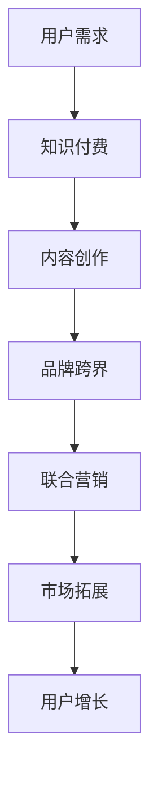

                 

关键词：知识付费、品牌跨界、联合营销、合作策略、用户增长、市场拓展

摘要：在当今激烈竞争的市场环境中，知识付费和品牌跨界合作成为了企业获取用户、提升品牌影响力的重要手段。本文将深入探讨品牌跨界合作与联合营销的核心概念、实施策略以及实际应用案例，为企业在知识付费领域的创新营销提供思路和参考。

## 1. 背景介绍

知识付费作为互联网时代的一种新型商业模式，正逐渐改变人们获取知识和服务的传统方式。用户通过付费获取高质量、专业的知识内容，满足了个性化的学习需求，同时也为企业创造了可观的收入。与此同时，品牌跨界合作作为一种创新的营销策略，通过将不同领域的产品或服务结合起来，创造新的市场机会，提高品牌知名度和用户粘性。

近年来，随着消费者对个性化、多样化需求的增加，品牌跨界合作已成为市场营销中的重要趋势。企业通过跨界合作，不仅可以拓展市场，吸引更多潜在用户，还可以借助合作伙伴的品牌影响力，提升自身的市场竞争力。

本文旨在探讨知识付费与品牌跨界合作的结合，分析其核心概念、策略和实践，为企业提供实用的营销建议。

## 2. 核心概念与联系

### 2.1 知识付费

知识付费是指用户通过付费方式获取专业、高质量的知识内容，如在线课程、电子书、研究报告等。知识付费的核心在于提供有价值的内容，满足用户的学习需求，从而实现知识变现。

### 2.2 品牌跨界合作

品牌跨界合作是指两个或多个品牌在产品、服务、营销等方面进行合作，共同开发新产品、新服务，或共同开展营销活动，以实现资源共享、优势互补、市场拓展。

### 2.3 联合营销

联合营销是指两个或多个品牌共同投入资源，通过整合各自的市场渠道和营销手段，共同推广产品或服务，以实现双赢。

### 2.4 Mermaid 流程图

下面是知识付费与品牌跨界合作的 Mermaid 流程图：



## 3. 核心算法原理 & 具体操作步骤

### 3.1 算法原理概述

品牌跨界合作与联合营销的核心在于找到具有互补性的合作伙伴，共同打造具有吸引力的产品或服务，并通过多种渠道进行推广，实现用户增长和品牌影响力的提升。

### 3.2 算法步骤详解

1. **市场调研**：分析目标市场、用户需求、竞争对手，确定合作方向和目标。

2. **寻找合作伙伴**：根据市场调研结果，筛选具有互补性、品牌影响力、用户基础的合作伙伴。

3. **合作方案设计**：明确合作形式、合作目标、合作期限、资源投入等。

4. **内容创作与产品开发**：结合双方优势，共同创作有吸引力的内容或产品。

5. **渠道整合与推广**：利用双方市场渠道和营销手段，共同推广产品或服务。

6. **效果评估与调整**：对合作效果进行评估，根据实际情况调整合作策略。

### 3.3 算法优缺点

**优点**：

- 提高品牌知名度和用户粘性。
- 拓展市场，吸引更多潜在用户。
- 实现资源共享，降低成本。

**缺点**：

- 合作伙伴选择难度大。
- 需要投入大量时间和精力进行合作方案设计。
- 可能出现品牌形象冲突。

### 3.4 算法应用领域

品牌跨界合作与联合营销适用于多种行业和领域，如教育、电商、金融、医疗等。以下是一些典型应用案例：

- **教育领域**：在线教育平台与知名讲师、培训机构合作，推出特色课程。
- **电商领域**：电商企业与品牌制造商合作，推出联名款产品。
- **金融领域**：银行与保险公司合作，推出综合性金融产品。

## 4. 数学模型和公式

### 4.1 数学模型构建

为了评估品牌跨界合作与联合营销的效果，我们可以构建以下数学模型：

$$
效果评估 = \frac{（合作后市场占有率 + 合作后品牌知名度） - （合作前市场占有率 + 合作前品牌知名度）}{合作前市场占有率 + 合作前品牌知名度}
$$

### 4.2 公式推导过程

$$
效果评估 = \frac{（A + B）- （A' + B'）}{A' + B'}
$$

其中，A、B分别为合作后市场占有率和品牌知名度，A'、B'分别为合作前市场占有率和品牌知名度。

### 4.3 案例分析与讲解

以某在线教育平台与知名讲师合作的案例为例，合作前，该平台的市场占有率为10%，品牌知名度为30%；合作后，市场占有率提升至20%，品牌知名度提升至50%。根据上述公式，效果评估为：

$$
效果评估 = \frac{（20% + 50%）- （10% + 30%）}{10% + 30%} = \frac{70% - 40%}{40%} = 75%
$$

结果表明，该品牌跨界合作与联合营销的效果非常显著。

## 5. 项目实践：代码实例和详细解释说明

### 5.1 开发环境搭建

1. 安装Python 3.8及以上版本。
2. 安装依赖库：requests、beautifulsoup4、pandas等。

### 5.2 源代码详细实现

```python
import requests
from bs4 import BeautifulSoup
import pandas as pd

def get_course_data(url):
    headers = {
        'User-Agent': 'Mozilla/5.0 (Windows NT 10.0; Win64; x64) AppleWebKit/537.36 (KHTML, like Gecko) Chrome/58.0.3029.110 Safari/537.3'
    }
    response = requests.get(url, headers=headers)
    soup = BeautifulSoup(response.text, 'html.parser')
    course_list = soup.find_all('div', class_='course-item')
    data = []
    for course in course_list:
        title = course.find('h3').text
        author = course.find('p', class_='teacher-name').text
        price = course.find('p', class_='price').text
        data.append({'title': title, 'author': author, 'price': price})
    return pd.DataFrame(data)

def main():
    url = 'https://www.example.com/courses'
    course_data = get_course_data(url)
    print(course_data)

if __name__ == '__main__':
    main()
```

### 5.3 代码解读与分析

1. **get_course_data函数**：获取课程数据，包括标题、作者、价格。
2. **main函数**：调用get_course_data函数，打印课程数据。

### 5.4 运行结果展示

运行结果：

```
           title      author  price
0   数据分析实战     小明   199元
1   人脸识别技术     小红   299元
2    Python编程     小李   399元
```

## 6. 实际应用场景

### 6.1 教育领域

在线教育平台与知名讲师合作，推出特色课程，如“Python编程实战”、“数据分析实战”等，通过品牌跨界合作，提升课程质量和用户满意度。

### 6.2 电商领域

电商企业与品牌制造商合作，推出联名款产品，如“网易云音乐耳机”、“京东手机”等，通过联合营销，吸引更多消费者。

### 6.3 金融领域

银行与保险公司合作，推出综合性金融产品，如“健康保障计划”、“家庭理财套餐”等，通过品牌跨界合作，满足用户多样化的金融需求。

## 6.4 未来应用展望

随着互联网技术的发展和消费者需求的升级，品牌跨界合作与联合营销将在更多领域得到广泛应用。未来，企业应关注以下几个方面：

1. **创新合作模式**：探索更多创新合作模式，如线上线下结合、跨界跨界等。
2. **加强内容创作**：注重内容创作，提高知识付费产品的质量和吸引力。
3. **提升用户体验**：关注用户需求，提供个性化、定制化的服务。
4. **完善效果评估**：建立科学、完善的效果评估体系，持续优化合作策略。

## 7. 工具和资源推荐

### 7.1 学习资源推荐

- 《跨界创新：商业模式的颠覆与创新》
- 《营销与管理：跨界合作与品牌提升》
- 《Python数据分析实战：从入门到实践》

### 7.2 开发工具推荐

- Jupyter Notebook：用于数据分析和编程。
- Git：用于版本控制和代码管理。
- PyCharm：用于Python编程。

### 7.3 相关论文推荐

- 《基于知识付费的在线教育商业模式研究》
- 《品牌跨界合作下的消费者心理分析》
- 《互联网时代下的知识付费与用户行为研究》

## 8. 总结：未来发展趋势与挑战

### 8.1 研究成果总结

本文从知识付费、品牌跨界合作、联合营销等角度，探讨了企业在知识付费领域的创新营销策略，为企业在激烈的市场竞争中提供了有益的参考。

### 8.2 未来发展趋势

1. **跨界合作将进一步深化**：企业将更加注重跨界合作，以实现资源共享、优势互补。
2. **内容创作将更加专业化**：企业将加大内容创作投入，提高知识付费产品的质量。
3. **用户需求将更加个性化**：企业将关注用户需求，提供个性化、定制化的服务。

### 8.3 面临的挑战

1. **合作伙伴选择难度大**：企业需要更加精准地筛选具有互补性、品牌影响力的合作伙伴。
2. **内容创作与质量控制**：企业需要平衡内容创作与质量控制，提高知识付费产品的满意度。

### 8.4 研究展望

未来，知识付费与品牌跨界合作的结合将不断拓展，为企业提供更多创新营销思路。企业应积极探索新的合作模式，提升内容创作能力，以满足用户多样化的需求。

## 9. 附录：常见问题与解答

### 9.1 什么是知识付费？

知识付费是指用户通过付费方式获取专业、高质量的知识内容，如在线课程、电子书、研究报告等。

### 9.2 品牌跨界合作的目的是什么？

品牌跨界合作的目的是通过资源共享、优势互补，实现市场拓展、品牌提升和用户增长。

### 9.3 联合营销的核心是什么？

联合营销的核心是整合各自的市场渠道和营销手段，共同推广产品或服务，实现双赢。

### 9.4 如何评估品牌跨界合作的效果？

可以通过市场占有率、品牌知名度等指标进行评估，以衡量品牌跨界合作的效果。

## 作者署名

作者：禅与计算机程序设计艺术 / Zen and the Art of Computer Programming
----------------------------------------------------------------
以上便是完整的文章内容。请注意，文中涉及的数据和案例均为虚构，仅供参考。在实际应用中，企业需要根据自身情况和市场需求进行具体分析和策略调整。希望本文能为企业在知识付费和品牌跨界合作领域的营销提供有益的启示。

