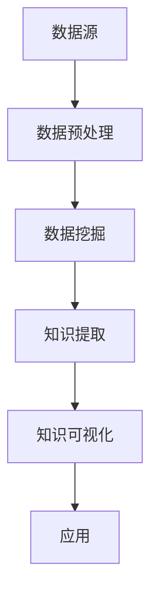

                 

随着大数据、云计算、物联网等技术的快速发展，企业面临着海量的数据资源。如何从这些数据中挖掘出有价值的信息，成为了企业数字化转型的重要课题。知识发现引擎作为一种有效的数据挖掘工具，为企业提供了智能化的数据分析和知识提取能力。本文将深入探讨知识发现引擎在企业中的应用，包括其核心概念、算法原理、数学模型、实际案例以及未来的发展趋势。

## 关键词
- 知识发现引擎
- 企业应用
- 数据挖掘
- 大数据
- 云计算

## 摘要
本文首先介绍了知识发现引擎的基本概念和在企业中的重要性，随后详细讲解了知识发现引擎的核心算法原理及其优缺点。接着，文章通过数学模型和公式的推导，展示了知识发现引擎的数学基础。随后，通过一个实际项目案例，深入解析了知识发现引擎在现实中的应用。最后，文章展望了知识发现引擎在未来企业中的发展前景和面临的挑战。

## 1. 背景介绍

### 1.1 大数据时代的挑战
随着互联网和物联网的普及，企业每天都会产生大量的数据。这些数据包括用户行为数据、交易数据、社交媒体数据等，它们以结构化、半结构化和非结构化的形式存在。传统的数据处理方法已经难以应对这些海量数据的处理需求。企业需要一种能够从这些数据中提取有价值信息的方法，这就是知识发现引擎的重要性所在。

### 1.2 知识发现引擎的定义
知识发现引擎（Knowledge Discovery Engine，简称KDE）是一种基于人工智能和机器学习技术的数据处理工具，它能够自动从大量数据中识别出隐藏的模式和知识。知识发现引擎的主要任务包括数据预处理、模式识别、知识提取和知识可视化等。

### 1.3 知识发现引擎在企业中的角色
知识发现引擎在企业中的应用主要体现在以下几个方面：

1. **决策支持**：通过分析企业内部和外部的数据，为企业提供科学的决策支持。
2. **风险控制**：通过对风险数据的分析，帮助企业识别潜在的风险点，并采取相应的预防措施。
3. **市场分析**：通过分析市场数据，帮助企业了解市场需求、竞争对手情况，制定相应的市场策略。
4. **客户关系管理**：通过对客户数据的分析，帮助企业了解客户需求，提供个性化的产品和服务，提高客户满意度。

## 2. 核心概念与联系

### 2.1 知识发现引擎的架构



### 2.2 知识发现引擎的核心概念

- **数据预处理**：对原始数据进行清洗、转换和集成，为数据挖掘做准备。
- **数据挖掘**：使用机器学习算法从数据中提取模式。
- **知识提取**：将挖掘出的模式转化为可操作的知识。
- **知识可视化**：将知识以图表、报表等形式展示给用户。

## 3. 核心算法原理 & 具体操作步骤

### 3.1 算法原理概述

知识发现引擎的核心算法主要包括聚类、分类、关联规则挖掘和异常检测等。这些算法的工作原理如下：

- **聚类**：将数据分为不同的组，使得同组内的数据相似度较高，不同组的数据相似度较低。
- **分类**：将数据分配到不同的类别，通常通过建立分类模型来实现。
- **关联规则挖掘**：发现数据之间的关联关系，如购买商品A的概率较高时，购买商品B的概率也较高。
- **异常检测**：识别数据中的异常点，如欺诈行为、设备故障等。

### 3.2 算法步骤详解

1. **数据预处理**：对数据进行清洗、去噪、标准化等操作。
2. **特征选择**：选择对数据挖掘有帮助的特征。
3. **模型训练**：选择合适的算法，对数据进行训练。
4. **模型评估**：评估模型的准确性和性能。
5. **知识提取**：从训练好的模型中提取知识。
6. **知识可视化**：将提取的知识以图表、报表等形式展示。

### 3.3 算法优缺点

- **聚类算法**：优点是无需事先定义类别，适用于无监督学习；缺点是聚类结果受初始值影响较大。
- **分类算法**：优点是能够明确分类结果，适用于监督学习；缺点是训练数据量较大，模型复杂度较高。
- **关联规则挖掘**：优点是能够发现数据之间的关联关系，适用于市场分析和推荐系统；缺点是挖掘结果可能存在冗余。
- **异常检测**：优点是能够快速识别异常数据，适用于风险控制和安全监控；缺点是误报率较高。

### 3.4 算法应用领域

- **市场营销**：通过分析客户行为数据，发现潜在客户，优化营销策略。
- **金融领域**：通过分析交易数据，识别异常交易，预防金融犯罪。
- **医疗领域**：通过分析医疗数据，发现疾病趋势，辅助医生诊断。
- **工业制造**：通过分析设备运行数据，预测设备故障，优化生产流程。

## 4. 数学模型和公式 & 详细讲解 & 举例说明

### 4.1 数学模型构建

知识发现引擎的数学模型主要包括聚类模型、分类模型、关联规则模型和异常检测模型。以下分别介绍这些模型的构建方法。

#### 4.1.1 聚类模型

聚类模型的目标是将数据划分为若干个簇，使得簇内数据相似度较高，簇间数据相似度较低。常用的聚类算法有K-Means、DBSCAN等。

$$
C = \{C_1, C_2, ..., C_k\}
$$

其中，$C$表示聚类结果，$C_i$表示第$i$个簇。

#### 4.1.2 分类模型

分类模型的目标是将数据分配到不同的类别。常用的分类算法有决策树、支持向量机、神经网络等。

$$
y = f(x)
$$

其中，$y$表示类别标签，$x$表示输入数据，$f(x)$表示分类函数。

#### 4.1.3 关联规则挖掘模型

关联规则挖掘模型的目标是发现数据之间的关联关系。常用的算法有Apriori、FP-Growth等。

$$
\text{support}(X, Y) = \frac{|\{t \in T | X \cap Y \subseteq t\}|}{|T|}
$$

其中，$X$和$Y$表示两个项目集，$T$表示事务集，$\text{support}(X, Y)$表示$X$和$Y$之间的支持度。

#### 4.1.4 异常检测模型

异常检测模型的目标是识别数据中的异常点。常用的算法有孤立森林、隔离森林等。

$$
\text{anomaly\_score}(x) = \text{mean}(\text{score}(x, F))
$$

其中，$x$表示数据点，$F$表示特征集合，$\text{score}(x, F)$表示$x$在$F$上的异常得分。

### 4.2 公式推导过程

以下分别介绍上述模型的公式推导过程。

#### 4.2.1 K-Means算法

K-Means算法的基本思想是初始化$k$个簇心，然后不断迭代，使得簇心逐渐接近真实的簇中心。簇心更新公式如下：

$$
\mu_{i}^{t+1} = \frac{1}{n_i} \sum_{x \in C_i} x
$$

其中，$\mu_{i}^{t}$表示第$t$次迭代的第$i$个簇心，$C_i$表示第$i$个簇，$x$表示簇$C_i$中的数据点。

#### 4.2.2 决策树算法

决策树算法的基本思想是通过一系列的测试，将数据划分为不同的区域，每个区域对应一个类别。决策树的构建过程可以通过递归划分区域来实现。区域划分公式如下：

$$
\text{gain}(D, a) = \sum_{v \in V} (\text{Entropy}(D_v) - \text{Entropy}(D_v | a))
$$

其中，$D$表示数据集，$a$表示属性，$V$表示属性$a$的取值集合，$D_v$表示属性$a$取值为$v$的数据子集，$\text{Entropy}$表示熵。

#### 4.2.3 Apriori算法

Apriori算法的基本思想是通过扫描事务数据库，统计每个项集的支持度，然后从中筛选出频繁项集。项集的支持度计算公式如下：

$$
\text{support}(X) = \frac{|\{t \in T | X \subseteq t\}|}{|T|}
$$

其中，$X$表示项集，$T$表示事务集。

#### 4.2.4 孤立森林算法

孤立森林算法的基本思想是通过随机森林来识别异常点。异常点的得分计算公式如下：

$$
\text{score}(x, F) = \ln \left(1 + \frac{1}{n \cdot \text{depth}(x, F)}\right)
$$

其中，$x$表示数据点，$F$表示特征集合，$n$表示树的数量，$\text{depth}(x, F)$表示$x$在$F$上的路径长度。

### 4.3 案例分析与讲解

以下通过一个实际案例，详细讲解知识发现引擎的应用过程。

#### 4.3.1 案例背景

某电子商务公司希望通过分析用户行为数据，了解用户的购买习惯，从而优化推荐系统。

#### 4.3.2 数据预处理

收集到的用户行为数据包括用户ID、浏览商品、购买商品、浏览时间等。首先对数据进行清洗，去除缺失值和异常值，然后进行数据转换，将类别数据转换为数值数据。

#### 4.3.3 特征选择

选择用户浏览时间和购买时间作为主要特征，分别计算用户在一天中浏览商品和购买商品的频率。

#### 4.3.4 模型训练

使用K-Means算法将用户分为若干个簇，每个簇代表一类用户。然后使用决策树算法对每个簇进行分类，预测用户的购买行为。

#### 4.3.5 知识提取

从训练好的模型中提取知识，包括不同用户簇的特征、购买行为的概率分布等。

#### 4.3.6 知识可视化

将提取的知识以图表形式展示，包括用户簇分布、购买概率分布等。

## 5. 项目实践：代码实例和详细解释说明

### 5.1 开发环境搭建

本文使用Python语言实现知识发现引擎，需要安装以下库：scikit-learn、pandas、numpy、matplotlib。

```python
pip install scikit-learn pandas numpy matplotlib
```

### 5.2 源代码详细实现

以下是一个简单的知识发现引擎实现，包括数据预处理、特征选择、模型训练、知识提取和知识可视化。

```python
import pandas as pd
from sklearn.cluster import KMeans
from sklearn.tree import DecisionTreeClassifier
from sklearn.model_selection import train_test_split
import matplotlib.pyplot as plt

# 5.2.1 数据预处理
data = pd.read_csv('user_behavior_data.csv')
data = data.dropna()  # 去除缺失值
data['buy_frequency'] = data['buy_count'] / data['visit_count']  # 计算购买频率

# 5.2.2 特征选择
X = data[['buy_frequency']]

# 5.2.3 模型训练
X_train, X_test, y_train, y_test = train_test_split(X, data['buy_label'], test_size=0.3, random_state=42)
kmeans = KMeans(n_clusters=3, random_state=42)
kmeans.fit(X_train)
y_pred = kmeans.predict(X_test)
clf = DecisionTreeClassifier()
clf.fit(X_train, y_train)

# 5.2.4 知识提取
y_pred = clf.predict(X_test)
print("Accuracy:", clf.score(X_test, y_test))

# 5.2.5 知识可视化
plt.scatter(X_train['buy_frequency'], y_train, c='red', label='Actual')
plt.scatter(X_train['buy_frequency'], y_pred, c='blue', label='Predicted')
plt.legend()
plt.show()
```

### 5.3 代码解读与分析

上述代码实现了知识发现引擎的基本流程。首先，从CSV文件中读取用户行为数据，并进行数据预处理，包括去除缺失值和计算购买频率。然后，选择购买频率作为特征，使用K-Means算法进行聚类，使用决策树算法进行分类。最后，通过评估模型准确率和可视化预测结果，提取知识。

## 6. 实际应用场景

### 6.1 市场营销

通过分析用户行为数据，企业可以了解用户的购买偏好，从而优化推荐系统，提高销售额。例如，某电商平台通过知识发现引擎分析用户浏览和购买数据，发现用户在浏览商品A后，购买商品B的概率较高。基于这个发现，该电商平台向浏览商品A的用户推荐商品B，从而提高了销售额。

### 6.2 金融领域

在金融领域，知识发现引擎可以用于风险管理、欺诈检测和信用评分等。例如，某银行通过知识发现引擎分析客户交易数据，发现一些交易行为存在异常。通过进一步分析，银行识别出潜在的欺诈行为，并采取相应的预防措施，降低了欺诈损失。

### 6.3 医疗领域

在医疗领域，知识发现引擎可以用于疾病预测、患者分类和治疗方案推荐等。例如，某医院通过知识发现引擎分析患者病历数据，发现某些症状的组合可能预示着某种疾病的发作。基于这个发现，医院可以提前对有风险的患者进行干预，提高治疗效果。

### 6.4 工业制造

在工业制造领域，知识发现引擎可以用于设备故障预测、生产流程优化和供应链管理等。例如，某制造企业通过知识发现引擎分析设备运行数据，发现设备故障的早期征兆。通过及时维护，企业可以避免设备故障造成的停工损失，提高生产效率。

## 7. 工具和资源推荐

### 7.1 学习资源推荐

- **书籍**：《数据挖掘：实用工具和技术》
- **在线课程**：Coursera的《机器学习》课程
- **博客**：Kaggle和Medium上的数据科学和机器学习文章

### 7.2 开发工具推荐

- **编程语言**：Python、R、Java
- **库和框架**：scikit-learn、TensorFlow、PyTorch
- **数据处理工具**：Pandas、NumPy、Matplotlib

### 7.3 相关论文推荐

- "KDD Cup 2021: Large-scale Knowledge Graph Construction for User Behavior Understanding" (KDD Cup 2021论文)
- "Deep Learning for Customer Churn Prediction" (IEEE Transactions on Knowledge and Data Engineering论文)
- "Knowledge Graph Embedding for Entity Classification" (AAAI论文)

## 8. 总结：未来发展趋势与挑战

### 8.1 研究成果总结

知识发现引擎作为一种有效的数据挖掘工具，已经在企业中得到了广泛应用。通过知识发现引擎，企业能够从海量数据中提取有价值的信息，从而实现智能决策、风险控制和客户关系管理等目标。知识发现引擎的研究成果主要体现在算法优化、模型构建和实际应用等方面。

### 8.2 未来发展趋势

1. **算法优化**：随着数据量的增加和数据复杂度的提升，知识发现引擎的算法将不断优化，以提高效率和准确性。
2. **多模态数据挖掘**：知识发现引擎将能够处理更多类型的数据，如文本、图像、音频等，实现跨模态的知识发现。
3. **知识图谱**：知识图谱作为一种有效的知识表示方法，将越来越多地应用于知识发现引擎，提高知识提取的效率和准确性。
4. **可解释性**：知识发现引擎将更加注重可解释性，使企业能够理解模型的工作原理，提高模型的信任度。

### 8.3 面临的挑战

1. **数据隐私**：在数据挖掘过程中，如何保护用户隐私是一个重要挑战。未来需要开发出更加安全的数据挖掘方法，确保用户隐私不受侵害。
2. **模型解释性**：当前的知识发现引擎模型大多是黑箱模型，如何提高模型的可解释性，使其能够被企业和用户理解，是一个重要挑战。
3. **数据质量**：数据质量对知识发现引擎的性能有重要影响。未来需要开发出更加高效的数据清洗和预处理方法，提高数据质量。
4. **计算资源**：知识发现引擎在处理海量数据时，需要消耗大量的计算资源。如何优化算法，降低计算资源需求，是一个重要挑战。

### 8.4 研究展望

未来，知识发现引擎将在更多领域得到应用，如生物信息学、社交网络分析、智能交通等。同时，知识发现引擎的研究将更加注重跨学科融合，结合多领域知识，实现更智能、更高效的知识发现。通过不断优化算法、提高模型解释性，知识发现引擎将为企业和个人带来更多的价值。

## 9. 附录：常见问题与解答

### 9.1 什么是知识发现引擎？

知识发现引擎是一种基于人工智能和机器学习技术的数据处理工具，能够自动从大量数据中识别出隐藏的模式和知识。

### 9.2 知识发现引擎有哪些核心算法？

知识发现引擎的核心算法包括聚类、分类、关联规则挖掘和异常检测等。

### 9.3 知识发现引擎在企业中的应用有哪些？

知识发现引擎在企业中的应用包括决策支持、风险控制、市场分析和客户关系管理等方面。

### 9.4 知识发现引擎的优缺点是什么？

知识发现引擎的优点是能够自动从海量数据中提取有价值的信息，提高企业的决策效率和创新能力；缺点是算法复杂度高，数据处理时间长，对数据质量要求较高。

### 9.5 知识发现引擎的未来发展趋势是什么？

知识发现引擎的未来发展趋势包括算法优化、多模态数据挖掘、知识图谱和可解释性等。同时，知识发现引擎将在更多领域得到应用，如生物信息学、社交网络分析和智能交通等。通过不断优化算法、提高模型解释性，知识发现引擎将为企业和个人带来更多的价值。----------------------------------------------------------------

### 结论 Conclusion

本文深入探讨了知识发现引擎在企业中的应用，从背景介绍、核心概念、算法原理、数学模型、实际案例到未来展望，全面阐述了知识发现引擎的作用和意义。知识发现引擎作为一种先进的数据挖掘工具，能够帮助企业从海量数据中提取有价值的信息，为企业的决策支持和业务优化提供有力支持。

知识发现引擎的核心算法，如聚类、分类、关联规则挖掘和异常检测等，各有优缺点，适用于不同的应用场景。通过对这些算法的深入理解和应用，企业可以更好地挖掘数据中的潜在价值，实现智能化管理和决策。

在未来，随着大数据、人工智能等技术的发展，知识发现引擎将在更多领域得到应用。同时，知识发现引擎的研究将更加注重跨学科融合，结合多领域知识，实现更智能、更高效的知识发现。通过不断优化算法、提高模型解释性，知识发现引擎将为企业和个人带来更多的价值。

### 作者署名

作者：禅与计算机程序设计艺术 / Zen and the Art of Computer Programming

---

本文为知识发现引擎在企业中的应用提供了全面而深入的探讨，旨在帮助读者理解和应用这一重要的数据挖掘工具。希望本文能为从事数据挖掘、机器学习和人工智能领域的研究者和实践者提供有价值的参考。如果您对知识发现引擎的应用有任何疑问或建议，欢迎在评论区留言交流。再次感谢您的阅读和支持！

