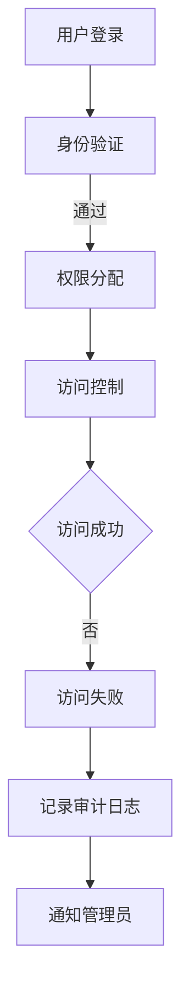

                 

关键词：知识发现引擎、用户权限管理、安全性、访问控制、权限策略、加密技术、认证机制、数据隐私保护、权限模型。

> 摘要：本文旨在深入探讨知识发现引擎的用户权限管理机制，包括权限模型、认证和加密技术、访问控制策略及其在实际应用中的重要性。通过分析当前的技术挑战和未来发展趋势，本文旨在为相关领域的研究者和开发者提供有价值的参考。

## 1. 背景介绍

在当今信息化的时代，数据的价值愈发凸显。知识发现引擎作为一种高级的数据分析工具，通过对大规模数据的挖掘和模式识别，为企业和研究机构提供了宝贵的信息资源。然而，随着知识发现引擎的广泛应用，用户权限管理的问题也逐渐成为关注的焦点。

用户权限管理是指控制不同用户对系统资源的访问权限，确保系统安全性和数据隐私保护。对于知识发现引擎而言，用户权限管理至关重要，因为它涉及到敏感数据和高级分析工具的访问。不当的用户权限管理可能导致数据泄露、滥用或非法访问，从而带来严重的法律和经济后果。

### 1.1 知识发现引擎的功能与特点

知识发现引擎具有以下几个关键特点：

- **数据多样性**：能够处理结构化、半结构化和非结构化数据。
- **数据量级**：支持海量数据的实时处理和分析。
- **智能分析**：运用机器学习、数据挖掘等算法发现潜在的知识和模式。
- **可视化**：通过直观的图表和报表展示分析结果。

### 1.2 用户权限管理的挑战

知识发现引擎的用户权限管理面临以下几个挑战：

- **复杂性**：不同用户角色、不同权限级别的需求复杂，需要精细的权限分配和管理。
- **安全性**：防止未经授权的访问和内部泄露，保护敏感数据。
- **可扩展性**：随着用户和数据的增长，权限管理系统需要具备良好的扩展性。
- **合规性**：遵循数据保护法规，确保隐私和安全合规。

## 2. 核心概念与联系

### 2.1 权限模型

权限模型是用户权限管理的基础。常见的权限模型包括：

- **基于角色的访问控制（RBAC）**：通过角色来分配权限，简化了权限管理。
- **基于属性的访问控制（ABAC）**：基于用户的属性和资源的属性来决定访问权限。
- **基于任务的访问控制（TBAC）**：根据用户执行的任务来分配权限。

### 2.2 认证和加密技术

认证技术用于确认用户的身份，确保只有授权用户才能访问系统资源。常见的认证技术包括：

- **单点登录（SSO）**：用户只需登录一次，即可访问多个系统。
- **双因素认证（2FA）**：结合密码和手机验证码等多重认证方式。

加密技术则用于保护数据的安全性，防止数据在传输和存储过程中被窃取。常见的加密技术包括：

- **对称加密**：如AES。
- **非对称加密**：如RSA。
- **哈希函数**：如SHA-256。

### 2.3 访问控制策略

访问控制策略是控制用户访问资源的一系列规则和措施。常见的访问控制策略包括：

- **最小权限原则**：用户只能访问其工作所需的资源。
- **审计和监控**：记录用户的活动，以便在发生安全事件时进行调查。
- **访问控制列表（ACL）**：明确列出每个用户或角色的权限。

### 2.4 权限管理架构

权限管理架构通常包括以下几个关键组件：

- **用户身份验证服务**：处理用户认证过程。
- **权限分配服务**：根据用户角色和属性分配权限。
- **访问控制服务**：根据访问控制策略控制用户访问。
- **审计和监控服务**：记录和监控用户活动。

### 2.5 Mermaid 流程图



## 3. 核心算法原理 & 具体操作步骤

### 3.1 算法原理概述

用户权限管理的核心算法主要包括身份认证算法和访问控制算法。身份认证算法用于确认用户的身份，常见的算法有：

- **密码认证**：通过用户名和密码进行验证。
- **生物特征认证**：如指纹、面部识别等。

访问控制算法则用于确定用户对资源的访问权限，常见的算法有：

- **基于角色的访问控制（RBAC）**：通过用户角色来分配权限。
- **基于属性的访问控制（ABAC）**：通过用户属性和资源属性来决定访问权限。

### 3.2 算法步骤详解

#### 3.2.1 身份认证算法步骤

1. 用户输入用户名和密码。
2. 系统验证用户名和密码是否匹配。
3. 如果验证通过，生成用户会话，否则提示认证失败。

#### 3.2.2 访问控制算法步骤

1. 系统根据用户角色和资源属性，确定用户的访问权限。
2. 用户尝试访问资源。
3. 系统检查用户权限，如果权限符合，则允许访问，否则拒绝访问。

### 3.3 算法优缺点

- **身份认证算法**：优点是简单易用，缺点是安全性较低，容易受到密码泄露和暴力破解攻击。
- **访问控制算法**：优点是灵活性和安全性较高，缺点是实现复杂，需要维护大量的角色和权限信息。

### 3.4 算法应用领域

身份认证算法和访问控制算法广泛应用于各类信息系统，如企业内网、电子商务平台、在线教育系统等。

## 4. 数学模型和公式 & 详细讲解 & 举例说明

### 4.1 数学模型构建

用户权限管理涉及到的数学模型主要包括：

- **用户角色模型**：用集合表示不同角色，如管理员、普通用户等。
- **资源模型**：用集合表示不同资源，如数据库、文件等。
- **权限模型**：用二元关系表示用户和资源之间的权限关系。

### 4.2 公式推导过程

假设用户集合为 \( U = \{u_1, u_2, \ldots, u_n\} \)，角色集合为 \( R = \{r_1, r_2, \ldots, r_m\} \)，资源集合为 \( S = \{s_1, s_2, \ldots, s_p\} \)，权限关系可以用二元关系 \( P \subseteq U \times R \times S \) 表示。

1. **用户角色分配**：设 \( A \subseteq U \times R \)，表示用户角色分配关系，公式为：
   $$ A = \{(u, r) \mid u \in U, r \in R\} $$

2. **资源权限分配**：设 \( B \subseteq R \times S \)，表示角色资源权限分配关系，公式为：
   $$ B = \{(r, s) \mid r \in R, s \in S\} $$

3. **用户权限分配**：设 \( C \subseteq U \times S \)，表示用户资源权限分配关系，公式为：
   $$ C = \{(u, s) \mid \exists r \in R, (u, r) \in A, (r, s) \in B\} $$

### 4.3 案例分析与讲解

假设有一个知识发现引擎系统，用户集合 \( U = \{u_1, u_2, u_3\} \)，角色集合 \( R = \{r_1, r_2\} \)，资源集合 \( S = \{s_1, s_2, s_3\} \)。用户角色分配关系 \( A = \{(u_1, r_1), (u_2, r_1), (u_3, r_2)\} \)，角色资源权限分配关系 \( B = \{(r_1, s_1), (r_1, s_2), (r_2, s_3)\} \)。

根据用户权限分配关系 \( C \)，可以计算得出：

- 用户 \( u_1 \) 有权限访问资源 \( s_1 \) 和 \( s_2 \)。
- 用户 \( u_2 \) 有权限访问资源 \( s_1 \) 和 \( s_2 \)。
- 用户 \( u_3 \) 有权限访问资源 \( s_3 \)。

这确保了每个用户只能访问其授权的资源，实现了精细的权限控制。

## 5. 项目实践：代码实例和详细解释说明

### 5.1 开发环境搭建

1. 确保安装了Python环境。
2. 安装依赖库，如 Flask、SQLAlchemy、Flask-Login等。

```shell
pip install Flask SQLAlchemy Flask-Login
```

### 5.2 源代码详细实现

下面是一个简单的用户权限管理系统的实现：

```python
from flask import Flask, request, jsonify
from flask_login import LoginManager, UserMixin, login_user, logout_user, login_required
from sqlalchemy import create_engine, Column, Integer, String, ForeignKey
from sqlalchemy.ext.declarative import declarative_base
from sqlalchemy.orm import sessionmaker, relationship

app = Flask(__name__)
app.secret_key = 'your_secret_key'
login_manager = LoginManager()
login_manager.init_app(app)

Base = declarative_base()

class User(Base, UserMixin):
    __tablename__ = 'users'
    id = Column(Integer, primary_key=True)
    username = Column(String(100), unique=True, nullable=False)
    password = Column(String(100), nullable=False)
    role = Column(String(50), nullable=False)

class Role(Base):
    __tablename__ = 'roles'
    id = Column(Integer, primary_key=True)
    name = Column(String(50), nullable=False)

class Resource(Base):
    __tablename__ = 'resources'
    id = Column(Integer, primary_key=True)
    name = Column(String(100), nullable=False)

class Permission(Base):
    __tablename__ = 'permissions'
    id = Column(Integer, primary_key=True)
    user_id = Column(Integer, ForeignKey('users.id'), nullable=False)
    role_id = Column(Integer, ForeignKey('roles.id'), nullable=False)
    resource_id = Column(Integer, ForeignKey('resources.id'), nullable=False)

engine = create_engine('sqlite:///sqlite.db')
Base.metadata.create_all(engine)
Session = sessionmaker(bind=engine)
session = Session()

@login_manager.user_loader
def load_user(user_id):
    return session.query(User).get(int(user_id))

@app.route('/login', methods=['POST'])
def login():
    username = request.form['username']
    password = request.form['password']
    user = session.query(User).filter_by(username=username, password=password).first()
    if user:
        login_user(user)
        return jsonify({'status': 'success'})
    else:
        return jsonify({'status': 'failure'})

@app.route('/logout')
@login_required
def logout():
    logout_user()
    return jsonify({'status': 'success'})

@app.route('/permissions', methods=['GET'])
@login_required
def get_permissions():
    user = login_user.current_user
    permissions = session.query(Permission).filter_by(user_id=user.id).all()
    return jsonify([{'role': p.role, 'resource': p.resource} for p in permissions])

if __name__ == '__main__':
    app.run(debug=True)
```

### 5.3 代码解读与分析

该代码实现了一个简单的用户权限管理系统，主要功能包括用户登录、登出和查询权限。

- **用户模型**：表示用户的基本信息，如用户名、密码和角色。
- **角色模型**：表示不同角色，如管理员和普通用户。
- **资源模型**：表示不同资源，如数据库和文件。
- **权限模型**：表示用户和角色对资源的访问权限。

- **登录功能**：通过用户名和密码验证用户身份，登录成功后创建用户会话。
- **登出功能**：注销用户会话。
- **权限查询功能**：查询当前用户的权限信息。

### 5.4 运行结果展示

运行该程序后，可以通过浏览器访问以下URL：

- 登录：`http://localhost:5000/login?username=<用户名>&password=<密码>`
- 登出：`http://localhost:5000/logout`
- 权限查询：`http://localhost:5000/permissions`

成功登录后，可以查询到当前用户的权限信息。

## 6. 实际应用场景

用户权限管理在知识发现引擎中有着广泛的应用场景，以下是一些典型的应用实例：

### 6.1 企业内部数据安全

企业内部的知识发现引擎通常涉及大量敏感数据，如客户信息、商业计划等。通过用户权限管理，企业可以确保只有授权人员才能访问这些数据，防止数据泄露和滥用。

### 6.2 研究机构资源共享

研究机构往往需要共享大量数据和研究资源，用户权限管理可以确保不同研究团队和研究人员之间有明确的权限界限，避免资源滥用和知识产权侵犯。

### 6.3 在线教育平台

在线教育平台的知识发现引擎可以用于分析学生学习行为，通过用户权限管理，平台可以确保教师和学生有适当的访问权限，同时保护学生隐私。

### 6.4 医疗保健信息管理

医疗保健领域的知识发现引擎涉及患者隐私和敏感医疗信息。用户权限管理可以确保只有授权的医疗人员可以访问和处理这些信息。

## 7. 工具和资源推荐

### 7.1 学习资源推荐

- 《黑客攻防技术宝典：Web实战篇》
- 《深入理解计算机系统》
- 《计算机安全：艺术与科学》

### 7.2 开发工具推荐

- Flask：Python Web 开发框架。
- SQLAlchemy：Python 数据库ORM。
- Flask-Login：Flask用户认证扩展。

### 7.3 相关论文推荐

- 《基于角色的访问控制模型研究》
- 《基于属性的访问控制模型研究》
- 《知识发现引擎中的用户权限管理策略》

## 8. 总结：未来发展趋势与挑战

### 8.1 研究成果总结

用户权限管理在知识发现引擎中具有重要意义，通过身份认证、加密技术、访问控制策略等手段，可以确保系统安全和数据隐私。目前，基于角色的访问控制（RBAC）和基于属性的访问控制（ABAC）等模型已经得到广泛应用。

### 8.2 未来发展趋势

未来，用户权限管理将朝着更加智能、自动化和高效的方向发展。例如，利用人工智能技术实现自适应权限管理，通过机器学习算法分析用户行为，动态调整权限设置。

### 8.3 面临的挑战

用户权限管理面临的主要挑战包括：

- **复杂性**：随着用户和数据量的增长，权限管理系统的复杂性增加，需要更高效的权限分配和管理方法。
- **安全性**：不断出现的新型攻击手段对权限管理系统提出了更高的安全要求。
- **可扩展性**：权限管理系统需要具备良好的扩展性，以适应不同规模和复杂度的应用场景。

### 8.4 研究展望

未来，用户权限管理的研究方向可以包括：

- **自适应权限管理**：利用人工智能和机器学习技术实现动态权限调整。
- **隐私保护**：研究如何在权限管理过程中保护用户隐私。
- **跨域权限管理**：研究如何在不同系统和平台之间实现统一的权限管理。

## 9. 附录：常见问题与解答

### 9.1 权限管理与安全性的关系

权限管理是确保系统安全性的重要手段，通过控制用户对系统资源的访问权限，可以防止未经授权的访问和数据泄露。

### 9.2 如何实现用户权限分配

用户权限分配可以通过基于角色的访问控制（RBAC）和基于属性的访问控制（ABAC）模型实现。具体方法包括：

- 初始化角色和资源信息。
- 配置角色与资源的权限关系。
- 根据用户角色和资源权限，分配用户权限。

### 9.3 如何处理权限冲突

当出现权限冲突时，可以通过以下方法处理：

- 定义优先级规则：确定不同权限之间的优先级。
- 用户选择：由用户选择优先执行的权限。
- 系统自动处理：根据预设规则自动处理权限冲突。

### 9.4 如何监控用户权限使用

可以通过以下方法监控用户权限使用：

- 审计日志：记录用户的活动和权限使用情况。
- 定期审计：定期检查权限使用情况，发现异常行为。
- 监控工具：使用专门的监控工具，实时监控权限使用情况。

作者：禅与计算机程序设计艺术 / Zen and the Art of Computer Programming

---

本篇文章详细探讨了知识发现引擎的用户权限管理机制，包括核心概念、算法原理、数学模型、项目实践和实际应用场景。通过深入分析，本文为相关领域的研究者和开发者提供了有价值的参考和指导。随着技术的发展，用户权限管理将继续成为确保系统安全和数据隐私的关键因素。未来，我们将看到更多智能化和自动化的权限管理方案，为信息系统的安全性和可用性提供更强有力的保障。|

