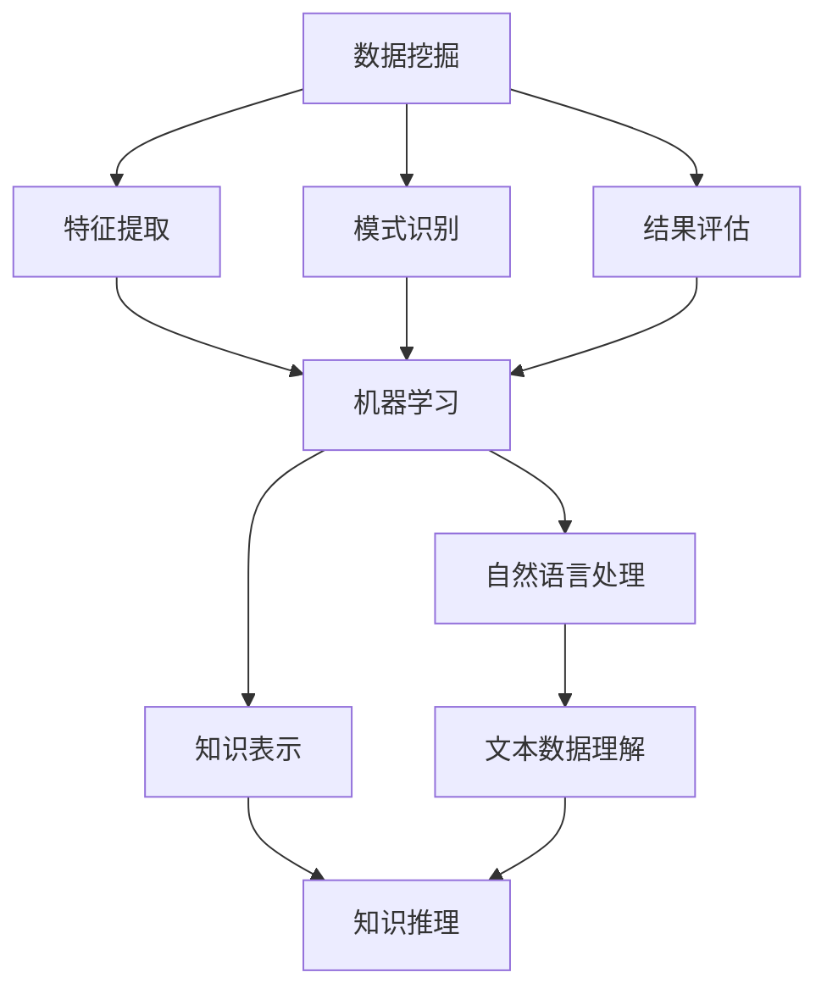

                 

关键词：知识发现，人工智能，认知科学，大数据，深度学习，语义网

> 摘要：本文深入探讨了知识发现引擎的核心概念、原理、算法以及其在人类认知领域的重要性。通过对当前技术进展的分析，本文探讨了知识发现引擎在各个领域的实际应用，并展望了其未来的发展趋势与挑战。

## 1. 背景介绍

随着互联网的飞速发展和大数据时代的到来，人类产生的数据量呈指数级增长。如何从这些海量数据中提取出有价值的信息和知识，成为了当前人工智能领域的一个重要研究方向。知识发现引擎（Knowledge Discovery Engine，简称KDE）正是为了解决这一问题而诞生。知识发现引擎旨在通过人工智能技术和算法，从原始数据中自动识别出潜在的模式、关联和知识，从而帮助人类更好地理解和利用数据。

知识发现引擎的应用领域非常广泛，包括金融、医疗、零售、交通、教育等多个行业。在金融领域，知识发现引擎可以用于风险控制、市场预测和投资决策；在医疗领域，可以用于疾病诊断、药物研发和个性化治疗；在零售领域，可以用于需求预测、库存管理和营销策略；在交通领域，可以用于交通流量分析、路线规划和交通事故预警；在教育领域，可以用于学习分析、教学评估和学生个性化推荐。

## 2. 核心概念与联系

### 2.1 核心概念

知识发现引擎的核心概念包括数据挖掘、机器学习和自然语言处理等。数据挖掘是一种从大量数据中发现有价值信息的过程，主要包括数据预处理、特征提取、模式识别和结果评估等步骤。机器学习是使计算机通过数据和经验自主改进性能的一门技术，主要包括监督学习、无监督学习和强化学习等。自然语言处理是使计算机能够理解、生成和处理自然语言的技术，包括词法分析、句法分析、语义分析和语音识别等。

### 2.2 联系

知识发现引擎的核心概念之间存在着紧密的联系。数据挖掘和机器学习是知识发现的基础，通过数据挖掘可以提取出数据中的潜在模式和知识，而机器学习则可以帮助计算机从数据中学习和改进。自然语言处理则使得知识发现引擎能够理解和处理非结构化的文本数据，从而扩展其应用范围。

下面是一个使用Mermaid绘制的知识发现引擎的核心概念和联系流程图：



## 3. 核心算法原理 & 具体操作步骤

### 3.1 算法原理概述

知识发现引擎的核心算法主要包括聚类、分类、关联规则挖掘、文本挖掘等。聚类算法将数据分为多个群组，使得同一群组内的数据尽可能相似，而不同群组之间的数据尽可能不同。分类算法则是根据已知的数据和标签，将新的数据分为不同的类别。关联规则挖掘则是从数据中找出不同项之间的关联关系。文本挖掘则是从文本数据中提取出有价值的信息。

### 3.2 算法步骤详解

1. **数据预处理**：包括数据清洗、数据整合和数据变换。数据清洗旨在去除数据中的噪声和错误，数据整合则是将来自不同数据源的数据进行合并，数据变换则是将数据转换为适合算法处理的形式。

2. **特征提取**：根据数据的类型和任务需求，选择合适的特征提取方法，如统计特征、文本特征、图像特征等。

3. **模式识别**：使用聚类、分类、关联规则挖掘等方法，从数据中识别出潜在的规律和知识。

4. **结果评估**：对识别出的模式进行评估，判断其是否具有实际意义和价值。

5. **知识表示**：将识别出的模式以适当的形式表示出来，如规则、决策树、网络图等。

### 3.3 算法优缺点

- **聚类算法**：优点是简单、易于实现，缺点是可能陷入局部最优，且对初始值敏感。

- **分类算法**：优点是准确、稳定，缺点是训练过程耗时较长，对数据量大的情况表现不佳。

- **关联规则挖掘**：优点是能够发现数据中的潜在关联，缺点是可能产生大量的冗余规则。

- **文本挖掘**：优点是能够处理非结构化的文本数据，缺点是计算复杂度高，对算法的性能要求较高。

### 3.4 算法应用领域

知识发现引擎的算法在各个领域都有广泛应用。在金融领域，聚类和分类算法可以用于客户分类、风险控制和市场预测；在医疗领域，文本挖掘和分类算法可以用于疾病诊断、药物研发和个性化治疗；在零售领域，关联规则挖掘可以用于需求预测、库存管理和营销策略；在交通领域，聚类和分类算法可以用于交通流量分析、路线规划和交通事故预警。

## 4. 数学模型和公式 & 详细讲解 & 举例说明

### 4.1 数学模型构建

知识发现引擎的数学模型主要包括聚类模型、分类模型、关联规则挖掘模型和文本挖掘模型。下面以聚类模型为例，介绍其数学模型构建。

假设有n个数据点，每个数据点表示为d-dimensional向量，聚类模型的目标是将这n个数据点分为k个簇，使得同一簇内的数据点尽可能相似，而不同簇之间的数据点尽可能不同。

假设第i个簇的中心点为mi，则聚类模型的优化目标为：

$$
\min \sum_{i=1}^{k} \sum_{x \in S_i} ||x - m_i||
$$

其中，S_i表示第i个簇中的数据点集合。

### 4.2 公式推导过程

为了推导出聚类模型的优化目标，我们可以使用最小二乘法。设第i个簇中的数据点为x_i，则第i个簇的中心点mi可以表示为：

$$
m_i = \frac{1}{|S_i|} \sum_{x \in S_i} x
$$

将mi代入优化目标，得到：

$$
\min \sum_{i=1}^{k} \sum_{x \in S_i} ||x - \frac{1}{|S_i|} \sum_{y \in S_i} y||
$$

根据平方的性质，上式可以化简为：

$$
\min \sum_{i=1}^{k} \sum_{x \in S_i} \left( ||x - y|| - \frac{1}{|S_i|} \sum_{y \in S_i} ||y - \frac{1}{|S_i|} \sum_{z \in S_i} z|| \right)
$$

因为每个数据点只能属于一个簇，所以上式中的第二项可以忽略，最终得到：

$$
\min \sum_{i=1}^{k} \sum_{x \in S_i} ||x - y||
$$

### 4.3 案例分析与讲解

假设有4个数据点，分别表示为x1 = [1, 1], x2 = [2, 2], x3 = [4, 4], x4 = [5, 5]。我们希望将这4个数据点分为2个簇。

首先，我们可以随机选择一个初始中心点，例如选择x1作为第一个簇的中心点m1 = [1, 1]，然后计算每个数据点到m1的距离，选择距离最远的点x4作为第二个簇的中心点m2 = [5, 5]。

接下来，我们计算每个数据点的新簇中心点，即计算每个簇中数据点的平均值：

$$
m1 = \frac{1}{2} (x1 + x4) = \frac{1}{2} ([1, 1] + [5, 5]) = [3, 3]
$$

$$
m2 = \frac{1}{2} (x2 + x3) = \frac{1}{2} ([2, 2] + [4, 4]) = [3, 3]
$$

然后，我们再次计算每个数据点到新簇中心点的距离，选择距离最远的点作为新的中心点，重复上述过程，直到收敛为止。

最终，我们得到了两个簇：第一个簇包含x1和x4，第二个簇包含x2和x3。这表明我们的聚类模型成功地找到了数据点之间的分组。

## 5. 项目实践：代码实例和详细解释说明

### 5.1 开发环境搭建

为了演示知识发现引擎的核心算法，我们将使用Python作为开发语言，并依赖几个常用的机器学习和数据可视化库，如scikit-learn、matplotlib和pandas。

首先，确保你的Python环境已经安装好，然后通过以下命令安装所需的库：

```bash
pip install scikit-learn matplotlib pandas
```

### 5.2 源代码详细实现

下面是一个简单的Python代码实例，用于演示聚类算法：

```python
import numpy as np
import matplotlib.pyplot as plt
from sklearn.cluster import KMeans

# 创建数据集
X = np.array([[1, 1], [2, 2], [4, 4], [5, 5]])

# 初始化KMeans聚类算法
kmeans = KMeans(n_clusters=2, random_state=0).fit(X)

# 获取聚类结果
labels = kmeans.labels_
centroids = kmeans.cluster_centers_

# 绘制聚类结果
plt.scatter(X[:, 0], X[:, 1], c=labels, s=100, cmap='viridis')
plt.scatter(centroids[:, 0], centroids[:, 1], c='red', s=200, alpha=0.5)
plt.show()
```

### 5.3 代码解读与分析

- **数据集创建**：我们使用NumPy库创建了一个简单的二维数据集X，包含了4个数据点。

- **初始化KMeans算法**：我们使用scikit-learn库中的KMeans类来初始化聚类算法。参数n_clusters指定了簇的数量，random_state用于保证结果的可重复性。

- **拟合数据**：调用fit方法将数据集X拟合到KMeans算法中，算法会自动计算簇的中心点。

- **获取聚类结果**：通过labels属性获取每个数据点的簇标签，通过cluster_centers_属性获取簇的中心点坐标。

- **绘制聚类结果**：使用matplotlib库绘制数据点的簇分布和簇中心点。颜色表示不同的簇，红色圆点表示簇中心点。

### 5.4 运行结果展示

运行上述代码后，我们将看到一个二维平面上的散点图，其中每个数据点根据其簇标签被分配了不同的颜色，簇中心点则以红色圆点的形式显示。通过观察结果，我们可以验证聚类算法是否成功地找到了数据点之间的分组。


## 6. 实际应用场景

知识发现引擎在各个行业都有广泛的应用。以下是一些实际应用场景：

### 6.1 金融领域

在金融领域，知识发现引擎可以用于风险评估、客户细分、市场预测和投资决策。例如，银行可以使用知识发现引擎来分析客户的信用评分和行为模式，从而提高风险管理能力。证券公司可以使用知识发现引擎来分析市场数据，预测股票价格走势，辅助投资决策。

### 6.2 医疗领域

在医疗领域，知识发现引擎可以用于疾病诊断、药物研发和个性化治疗。例如，医院可以使用知识发现引擎来分析病人的病史和临床表现，提高诊断准确率。制药公司可以使用知识发现引擎来分析大量实验数据，发现潜在的药物候选。

### 6.3 零售领域

在零售领域，知识发现引擎可以用于需求预测、库存管理和营销策略。例如，零售商可以使用知识发现引擎来分析销售数据，预测未来商品的需求量，优化库存管理。同时，知识发现引擎还可以用于分析消费者的购物行为和偏好，制定个性化的营销策略。

### 6.4 交通领域

在交通领域，知识发现引擎可以用于交通流量分析、路线规划和交通事故预警。例如，城市交通管理部门可以使用知识发现引擎来分析交通数据，优化交通信号控制策略，提高交通流畅度。此外，知识发现引擎还可以用于分析交通事故数据，预测潜在的事故风险。

### 6.5 教育领域

在教育领域，知识发现引擎可以用于学习分析、教学评估和学生个性化推荐。例如，学校可以使用知识发现引擎来分析学生的学习行为和成绩，发现学习困难点，制定个性化的教学计划。同时，知识发现引擎还可以用于分析教师的授课质量，优化教学策略。

## 7. 工具和资源推荐

### 7.1 学习资源推荐

- 《数据挖掘：概念与技术》：这是一本经典的数据挖掘教材，详细介绍了数据挖掘的基本概念、算法和技术。

- 《机器学习》：这是一本全面介绍机器学习理论和应用的教材，包括监督学习、无监督学习和强化学习等内容。

- 《自然语言处理实战》：这是一本关于自然语言处理实践的书，涵盖了许多实际应用案例和技术。

### 7.2 开发工具推荐

- Jupyter Notebook：一个交互式的计算环境，适用于数据分析和机器学习项目。

- TensorFlow：一个开源的机器学习框架，适用于深度学习和大规模数据处理。

- Scikit-learn：一个开源的机器学习库，提供了许多常用的机器学习算法和工具。

### 7.3 相关论文推荐

- "K-Means Clustering: A Review"：一篇关于K-Means聚类算法的综述文章，详细介绍了算法的原理和适用场景。

- "Deep Learning for Natural Language Processing"：一篇关于深度学习在自然语言处理领域应用的论文，介绍了许多前沿的研究成果。

- "Data Mining: Practical Machine Learning Tools and Techniques"：一篇关于数据挖掘实际应用和机器学习技术的论文，提供了许多实用的方法和案例。

## 8. 总结：未来发展趋势与挑战

知识发现引擎在人工智能、大数据和认知科学等领域的交叉点，具有重要的理论和实践价值。未来，知识发现引擎的发展趋势主要体现在以下几个方面：

### 8.1 深度学习与知识发现的融合

深度学习在图像识别、语音识别和自然语言处理等领域取得了巨大的成功。未来，深度学习技术将更多地与知识发现引擎相结合，以实现更高效、更准确的知识提取和发现。

### 8.2 多模态数据融合

随着物联网、5G和智能硬件的发展，数据来源越来越多样化。知识发现引擎将需要处理包括文本、图像、声音、视频等多种模态的数据，实现跨模态的知识发现。

### 8.3 知识图谱与语义网的发展

知识图谱和语义网技术将使知识发现引擎能够更好地理解、组织和利用数据。未来，知识发现引擎将更多地依赖于知识图谱和语义网技术，以实现更智能、更精准的知识发现。

### 8.4 开源与共享

随着人工智能技术的普及，越来越多的企业和研究机构将加入知识发现引擎的研发和推广。未来，开源和共享将成为知识发现引擎发展的重要趋势，以推动技术的进步和应用的普及。

### 8.5 挑战

尽管知识发现引擎在许多领域取得了显著成果，但仍面临着一系列挑战：

- **数据隐私和安全**：知识发现引擎需要处理大量的敏感数据，如何确保数据隐私和安全是一个重要挑战。

- **算法可解释性**：知识发现引擎的算法往往复杂且难以解释，如何提高算法的可解释性是一个亟待解决的问题。

- **计算资源**：知识发现引擎的计算需求往往很高，如何高效地利用计算资源是一个重要的挑战。

- **领域适应性**：知识发现引擎在不同领域的适用性不同，如何提高其在特定领域的适应性是一个关键问题。

总之，知识发现引擎作为人工智能领域的一个重要研究方向，具有广阔的应用前景和发展潜力。未来，随着技术的不断进步和应用的不断拓展，知识发现引擎将为人类认知和智能发展带来新的机遇和挑战。

## 9. 附录：常见问题与解答

### 9.1 什么是知识发现引擎？

知识发现引擎是一种通过人工智能技术和算法，从海量数据中自动识别出潜在模式和知识的人工智能系统。

### 9.2 知识发现引擎有哪些应用领域？

知识发现引擎的应用领域非常广泛，包括金融、医疗、零售、交通、教育等多个行业。

### 9.3 知识发现引擎的核心算法有哪些？

知识发现引擎的核心算法主要包括聚类、分类、关联规则挖掘和文本挖掘等。

### 9.4 如何选择合适的知识发现算法？

选择合适的知识发现算法需要考虑数据类型、任务需求、计算资源和可解释性等因素。例如，对于结构化数据，聚类和分类算法比较适用；对于非结构化数据，文本挖掘算法可能更有效。

### 9.5 知识发现引擎的未来发展趋势是什么？

知识发现引擎的未来发展趋势包括深度学习与知识发现的融合、多模态数据融合、知识图谱与语义网的发展以及开源与共享等。

---

作者：禅与计算机程序设计艺术 / Zen and the Art of Computer Programming

