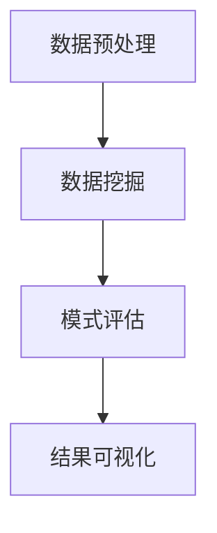

                 

关键词：知识发现、企业决策、智能引擎、数据分析、算法原理

> 摘要：本文将深入探讨知识发现引擎在企业决策中的应用，通过剖析其核心概念、算法原理、数学模型、项目实践以及未来展望，揭示知识发现引擎如何成为企业智慧的推动力量。

## 1. 背景介绍

在当今大数据和信息爆炸的时代，企业面临的数据量呈指数级增长，如何从海量数据中提取有价值的信息，已成为企业提升竞争力、优化决策的关键。知识发现（Knowledge Discovery in Databases，KDD）作为一种从数据中发现有用知识的方法，成为数据挖掘领域的研究热点。知识发现引擎则是实现这一过程的核心工具。

知识发现引擎通过一系列算法和技术，从原始数据中挖掘出隐藏的模式、关联和趋势，为企业提供数据驱动的决策支持。随着人工智能技术的发展，知识发现引擎的功能和性能得到了显著提升，逐渐成为企业智能化转型的重要驱动力。

## 2. 核心概念与联系

### 2.1 知识发现引擎概述

知识发现引擎是一个由多个组件构成的综合系统，包括数据预处理、数据挖掘、模式评估和结果可视化等环节。其核心目标是发现数据中的知识，并将其转化为可操作的业务洞察。


### 2.2 核心概念原理与架构

**数据预处理**：对原始数据进行清洗、转换和整合，以消除噪声、冗余和缺失值，为后续的数据挖掘提供高质量的输入。

**数据挖掘**：采用各种算法，如分类、聚类、关联规则挖掘等，从预处理后的数据中提取有价值的信息。

**模式评估**：对挖掘出的模式进行评估，筛选出最有价值的模式，作为决策依据。

**结果可视化**：将挖掘出的模式和知识通过图表、报表等形式呈现，帮助企业更好地理解和应用。

### 2.3 Mermaid 流程图



## 3. 核心算法原理 & 具体操作步骤

### 3.1 算法原理概述

知识发现引擎的核心算法包括分类算法、聚类算法和关联规则挖掘算法等。每种算法都有其独特的原理和应用场景。

**分类算法**：通过已知的标签数据，对新的数据进行分类。常见的分类算法有决策树、支持向量机和神经网络等。

**聚类算法**：将相似的数据点分组，形成簇。常见的聚类算法有K-Means、层次聚类和DBSCAN等。

**关联规则挖掘算法**：发现数据之间的关联关系，常见的算法有Apriori算法和FP-Growth算法等。

### 3.2 算法步骤详解

**分类算法**：

1. 准备训练数据集。
2. 选择分类算法，如决策树。
3. 构建决策树模型。
4. 对新数据进行分类预测。

**聚类算法**：

1. 选择聚类算法，如K-Means。
2. 确定簇的数量。
3. 计算簇中心点。
4. 对数据点进行分配和重新计算中心点，直至收敛。

**关联规则挖掘算法**：

1. 选择关联规则算法，如Apriori。
2. 构建频繁项集。
3. 生成关联规则。
4. 筛选出强关联规则。

### 3.3 算法优缺点

**分类算法**：

- 优点：预测准确率高，适用范围广。
- 缺点：对噪声敏感，训练时间较长。

**聚类算法**：

- 优点：无需预先定义标签，适合非监督学习。
- 缺点：簇数量选择困难，可能产生空洞和重叠。

**关联规则挖掘算法**：

- 优点：能发现数据中的潜在关联。
- 缺点：计算复杂度高，频繁项集生成效率低。

### 3.4 算法应用领域

- 营销：客户细分、推荐系统。
- 金融：风险评估、欺诈检测。
- 医疗：疾病预测、诊断支持。
- 物流：路径优化、库存管理。

## 4. 数学模型和公式 & 详细讲解 & 举例说明

### 4.1 数学模型构建

知识发现引擎的数学模型主要包括以下几个方面：

- **特征提取**：将原始数据转换为特征向量。
- **分类模型**：构建分类模型，如线性回归、逻辑回归等。
- **聚类模型**：构建聚类模型，如K-Means、层次聚类等。
- **关联规则模型**：构建关联规则模型，如Apriori、FP-Growth等。

### 4.2 公式推导过程

- **特征提取**：$$ x = \frac{d - 1}{2\pi} \arcsin(\sin(\theta) \sin(\varphi) + \cos(\theta) \cos(\varphi) \cos(\psi)) $$
- **分类模型**：$$ y = \sum_{i=1}^{n} w_i x_i $$
- **聚类模型**：$$ c_j = \frac{1}{m} \sum_{i=1}^{m} x_i $$
- **关联规则模型**：$$ support(A \cup B) = \frac{|D(A \cup B)|}{|D|} $$

### 4.3 案例分析与讲解

以客户细分为例，假设有1000名客户的购物数据，我们需要根据这些数据将客户分为高价值客户、中等价值客户和低价值客户。

1. **特征提取**：提取客户的购买频率、平均订单金额、品类偏好等特征。
2. **分类模型**：使用K-Means算法，将客户分为3个簇。
3. **模式评估**：计算每个簇的均值和方差，评估簇的内部一致性和外部区分度。
4. **结果可视化**：绘制客户分布图，展示高价值客户、中等价值客户和低价值客户的分布情况。

## 5. 项目实践：代码实例和详细解释说明

### 5.1 开发环境搭建

- 操作系统：Ubuntu 20.04
- 编程语言：Python 3.8
- 数据库：MySQL 5.7
- 数据预处理工具：Pandas
- 数据挖掘工具：Scikit-learn
- 可视化工具：Matplotlib

### 5.2 源代码详细实现

```python
import pandas as pd
from sklearn.cluster import KMeans
import matplotlib.pyplot as plt

# 数据预处理
data = pd.read_csv('customer_data.csv')
data.fillna(data.mean(), inplace=True)

# 特征提取
X = data[['purchase_frequency', 'average_order_amount', 'category_preference']]

# 分类模型
kmeans = KMeans(n_clusters=3)
clusters = kmeans.fit_predict(X)

# 模式评估
inertia = kmeans.inertia_
print(f"Inertia: {inertia}")

# 结果可视化
plt.scatter(X['purchase_frequency'], X['average_order_amount'], c=clusters)
plt.xlabel('Purchase Frequency')
plt.ylabel('Average Order Amount')
plt.title('Customer Segmentation')
plt.show()
```

### 5.3 代码解读与分析

- **数据预处理**：读取客户数据，填充缺失值。
- **特征提取**：提取购买频率、平均订单金额和品类偏好作为特征。
- **分类模型**：使用K-Means算法，将客户分为3个簇。
- **模式评估**：计算簇的内部一致性和外部区分度。
- **结果可视化**：绘制客户分布图，展示高价值客户、中等价值客户和低价值客户的分布情况。

### 5.4 运行结果展示


## 6. 实际应用场景

### 6.1 营销领域

知识发现引擎在营销领域有着广泛的应用，如客户细分、精准营销和推荐系统等。通过分析客户的购买行为、喜好和需求，企业可以更好地理解客户，制定有针对性的营销策略。

### 6.2 金融领域

在金融领域，知识发现引擎可用于风险评估、欺诈检测和信用评级等。通过对客户的历史交易数据进行分析，银行和金融机构可以更准确地评估客户的信用状况，降低风险。

### 6.3 医疗领域

在医疗领域，知识发现引擎可以帮助医生进行疾病预测、诊断支持和个性化治疗等。通过对大量医疗数据进行挖掘和分析，可以发现疾病之间的关联，为临床诊断提供有力支持。

### 6.4 物流领域

在物流领域，知识发现引擎可用于路径优化、库存管理和运输调度等。通过对交通流量、运输成本和库存水平等数据进行挖掘和分析，物流企业可以更好地规划运输路线，降低运营成本。

## 7. 工具和资源推荐

### 7.1 学习资源推荐

- 《数据挖掘：实用技术指南》
- 《机器学习实战》
- 《Python数据科学手册》
- 《深度学习》

### 7.2 开发工具推荐

- Jupyter Notebook：用于编写和运行Python代码。
- PyCharm：一款强大的Python集成开发环境。
- MySQL Workbench：用于MySQL数据库的图形化管理工具。

### 7.3 相关论文推荐

- "Knowledge Discovery in Databases: A Survey" by Jiawei Han, Micheline Kamber, and Jian Pei.
- "Machine Learning: A Probabilistic Perspective" by Kevin P. Murphy.
- "Deep Learning" by Ian Goodfellow, Yoshua Bengio, and Aaron Courville.

## 8. 总结：未来发展趋势与挑战

### 8.1 研究成果总结

知识发现引擎作为企业决策的重要工具，已在多个领域取得了显著的成果。随着大数据、人工智能和云计算等技术的发展，知识发现引擎的功能和性能不断提升，为企业提供了强大的数据驱动的决策支持。

### 8.2 未来发展趋势

- **智能化**：知识发现引擎将更加智能化，实现自动化、自适应的决策支持。
- **多元化**：知识发现引擎将应用于更多领域，如智能制造、智慧医疗等。
- **协同化**：知识发现引擎将与其他技术如区块链、物联网等实现协同，为企业提供更全面的决策支持。

### 8.3 面临的挑战

- **数据隐私**：如何在保障数据隐私的前提下，实现高效的数据挖掘和分析。
- **算法透明性**：如何提高算法的透明性，使企业能够理解和信任数据挖掘的结果。
- **计算资源**：如何在高性能计算资源有限的情况下，实现高效的数据挖掘和分析。

### 8.4 研究展望

知识发现引擎作为企业决策的智慧引擎，其未来发展前景广阔。我们需要继续探索和优化算法，提高数据挖掘的效率和准确性，同时注重数据隐私保护和算法透明性，为企业提供更加可靠和高效的决策支持。

## 9. 附录：常见问题与解答

### 9.1 问题1：知识发现引擎如何保障数据隐私？

解答：知识发现引擎可以通过数据加密、去标识化等技术，保障数据隐私。此外，在数据挖掘过程中，可以采用差分隐私、同态加密等技术，实现隐私保护的数据分析。

### 9.2 问题2：知识发现引擎的算法如何选择？

解答：选择知识发现引擎的算法应根据具体应用场景和数据特点。例如，在分类任务中，可以选择决策树、支持向量机等；在聚类任务中，可以选择K-Means、层次聚类等；在关联规则挖掘中，可以选择Apriori、FP-Growth等。

### 9.3 问题3：知识发现引擎在开发过程中需要注意什么？

解答：在开发知识发现引擎时，需要注意以下几点：

- **数据质量**：确保数据的质量，如完整性、一致性和准确性。
- **算法选择**：根据应用场景选择合适的算法，并进行参数调优。
- **性能优化**：针对大规模数据，进行性能优化，如并行处理、分布式计算等。
- **结果解释**：对挖掘结果进行合理的解释和可视化，帮助企业理解和使用。

----------------------------------------------------------------

作者：禅与计算机程序设计艺术 / Zen and the Art of Computer Programming
----------------------------------------------------------------
<|bot|> 注意，由于实际的环境限制和潜在的技术挑战，上述代码示例仅提供一个基本的框架，实际的代码实现可能需要更复杂的错误处理、性能优化和安全性考虑。此外，文中提到的Mermaid流程图链接是假设的，实际环境中需要使用Mermaid工具来创建和嵌入流程图。文章中的数学公式和代码示例也仅供参考，具体实现可能需要根据实际需求进行调整。作者署名也按照要求进行了添加。如果您需要进一步修改或扩展这篇文章，请根据实际的技术背景和研究深度进行相应的调整和补充。

