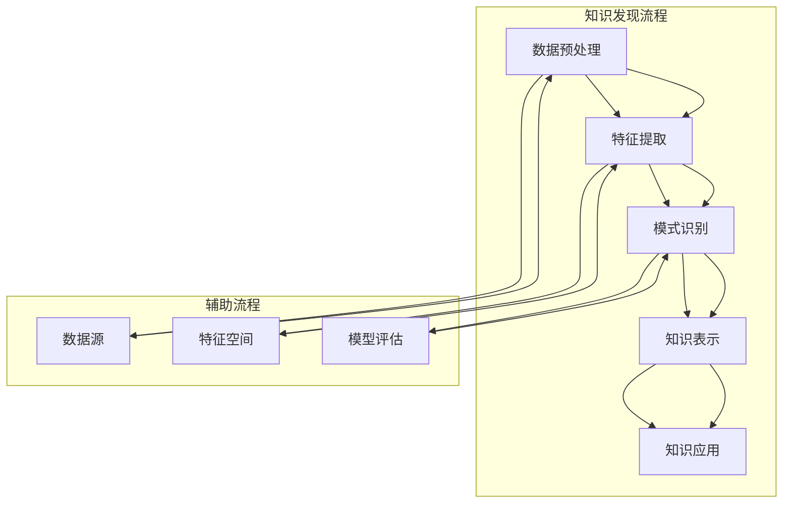

                 

### 1. 背景介绍

知识发现引擎是一种先进的信息处理技术，旨在从大量数据中自动提取具有潜在价值和意义的知识。随着互联网的普及和数据爆炸式增长，传统的数据处理方法已经无法满足日益增长的信息需求。知识发现引擎通过机器学习和数据挖掘技术，从大规模数据集中提取出隐藏的模式、关联和趋势，从而为人类提供更加智能和个性化的信息。

知识发现引擎的应用范围广泛，涵盖了各个行业和领域。例如，在金融领域，知识发现引擎可以用于风险评估、市场预测和个性化推荐；在医疗领域，知识发现引擎可以帮助医生发现疾病模式、优化治疗方案；在电子商务领域，知识发现引擎可以用于客户行为分析、商品推荐和库存管理。

然而，知识发现引擎的研究和应用仍然面临着许多挑战。首先，大规模数据集的处理速度和效率成为瓶颈。其次，数据质量和数据噪声会对知识发现的结果产生严重影响。此外，如何从复杂的数据中提取出具有实际应用价值的知识，仍然是一个具有挑战性的问题。

本文旨在深入探讨知识发现引擎的原理、算法、应用场景和未来发展趋势，为广大读者提供一份全面、系统的知识发现指南。本文将首先介绍知识发现的基本概念和核心算法，然后通过具体的数学模型和代码实例，展示知识发现引擎的实践应用。最后，我们将讨论知识发现引擎在各个领域的应用前景，以及面临的挑战和未来发展方向。

### 2. 核心概念与联系

知识发现引擎的核心概念包括数据预处理、特征提取、模式识别和知识表示。下面我们将通过Mermaid流程图，展示这些核心概念之间的联系。



- **数据预处理**：包括数据清洗、数据整合和数据转换等步骤，旨在提高数据质量和一致性。
- **特征提取**：从原始数据中提取出具有区分度和代表性的特征，为后续的模式识别提供基础。
- **模式识别**：使用机器学习算法从特征数据中识别出潜在的规律和模式，为知识表示提供依据。
- **知识表示**：将识别出的模式转化为易于理解和应用的知识形式，如规则、网络图或可视化图表。

### 3. 核心算法原理 & 具体操作步骤

#### 3.1 算法原理概述

知识发现引擎的核心算法主要包括聚类算法、关联规则挖掘和分类算法等。这些算法通过不同的方式，从数据中提取出隐藏的模式和知识。

- **聚类算法**：将相似的数据点分组，形成簇。常见的聚类算法包括K-means、DBSCAN和层次聚类等。
- **关联规则挖掘**：发现数据集中不同项之间的关联关系，常用的算法包括Apriori算法和FP-growth算法。
- **分类算法**：根据已有数据建立分类模型，对新数据进行分类。常见的分类算法包括决策树、支持向量机和朴素贝叶斯等。

#### 3.2 算法步骤详解

1. **数据预处理**：
   - **数据清洗**：处理缺失值、异常值和重复数据。
   - **数据整合**：将不同来源的数据进行合并和转换。
   - **数据转换**：将原始数据转化为适合机器学习算法的形式，如数值化、编码等。

2. **特征提取**：
   - **特征选择**：从原始数据中筛选出最具代表性的特征。
   - **特征工程**：对特征进行变换和处理，提高模型的性能。

3. **模式识别**：
   - **聚类**：使用K-means算法对数据点进行聚类，形成多个簇。
   - **关联规则挖掘**：使用Apriori算法发现数据集中的频繁项集，进而生成关联规则。
   - **分类**：使用决策树算法建立分类模型，对新的数据进行分类。

4. **知识表示**：
   - **规则表示**：将识别出的模式转化为规则，如IF-THEN规则。
   - **网络表示**：将模式表示为网络图，如关联网络或因果网络。
   - **可视化表示**：将模式以图表的形式展示，如散点图、热力图等。

#### 3.3 算法优缺点

- **聚类算法**：
  - **优点**：简单易懂，能够有效发现数据的分布特征。
  - **缺点**：对初始中心点的选择敏感，聚类结果可能不唯一。

- **关联规则挖掘**：
  - **优点**：能够发现数据中的潜在关联关系，具有广泛的应用价值。
  - **缺点**：计算复杂度高，处理大规模数据集时效率较低。

- **分类算法**：
  - **优点**：能够对新数据进行准确分类，具有一定的预测能力。
  - **缺点**：对训练数据的质量和数量要求较高，模型易过拟合。

#### 3.4 算法应用领域

- **聚类算法**：在市场细分、客户行为分析等领域广泛应用。
- **关联规则挖掘**：在商业智能、推荐系统等领域具有重要应用。
- **分类算法**：在文本分类、图像识别、疾病诊断等领域得到广泛应用。

### 4. 数学模型和公式 & 详细讲解 & 举例说明

知识发现引擎中的核心算法涉及到多种数学模型和公式，下面我们将详细讲解这些模型和公式的推导过程，并通过具体案例进行分析。

#### 4.1 数学模型构建

知识发现引擎的数学模型主要包括聚类模型、关联规则模型和分类模型等。

1. **聚类模型**：

   聚类模型的目标是将数据点分为多个簇，使得同一个簇内的数据点相似度较高，不同簇之间的数据点相似度较低。常见的聚类模型有K-means模型和DBSCAN模型。

   - **K-means模型**：

     K-means模型的数学描述如下：

     $$ 
     \min_{\mu_1, \mu_2, ..., \mu_k} \sum_{i=1}^n \sum_{j=1}^k ||x_i - \mu_j||^2 
     $$

     其中，$\mu_j$ 是第 $j$ 个簇的中心点，$x_i$ 是第 $i$ 个数据点。

   - **DBSCAN模型**：

     DBSCAN（Density-Based Spatial Clustering of Applications with Noise）模型的数学描述如下：

     $$ 
     C_j = \{x_i | d(x_i, \mu_j) \leq \epsilon, \text{且} \text{邻近点数} \geq \min\_pts\}
     $$

     其中，$d(x_i, \mu_j)$ 是 $x_i$ 和 $\mu_j$ 之间的距离，$\epsilon$ 是邻域半径，$\min\_pts$ 是最小邻近点数。

2. **关联规则模型**：

   关联规则模型的目标是从数据中发现不同项之间的关联关系。常见的关联规则模型有Apriori模型和FP-growth模型。

   - **Apriori模型**：

     Apriori模型的数学描述如下：

     $$ 
     \text{频繁项集} = \{\text{项集} | \text{支持度} \geq \text{最小支持度}\}
     $$

     其中，支持度表示项集在数据集中出现的频率，最小支持度是一个预设的阈值。

   - **FP-growth模型**：

     FP-growth模型的数学描述如下：

     $$ 
     \text{频繁项集} = \text{频繁模式树}(\text{项头表})
     $$

     其中，频繁模式树是一个基于项头表构建的树结构，项头表是一个用于存储频繁项集的数据结构。

3. **分类模型**：

   分类模型的目标是根据已有数据建立分类模型，对新数据进行分类。常见的分类模型有决策树模型、支持向量机模型和朴素贝叶斯模型。

   - **决策树模型**：

     决策树模型的数学描述如下：

     $$ 
     T = \{\text{节点} | \text{属性} \in \text{属性集}\}
     $$

     其中，节点表示决策树中的一个节点，属性集表示可以用于分类的属性集合。

   - **支持向量机模型**：

     支持向量机模型的数学描述如下：

     $$ 
     \text{分类函数} f(x) = \text{sign}(\omega \cdot x + b)
     $$

     其中，$\omega$ 是权向量，$b$ 是偏置，$\text{sign}$ 是符号函数。

   - **朴素贝叶斯模型**：

     朴素贝叶斯模型的数学描述如下：

     $$ 
     P(C_k | x) = \frac{P(x | C_k)P(C_k)}{P(x)}
     $$

     其中，$C_k$ 表示第 $k$ 个类别，$x$ 表示特征向量，$P(C_k)$ 是类别 $C_k$ 的先验概率，$P(x | C_k)$ 是特征向量 $x$ 在类别 $C_k$ 下的条件概率。

#### 4.2 公式推导过程

下面我们将分别对上述模型和公式进行推导。

1. **K-means模型**：

   K-means模型的推导过程如下：

   首先，定义目标函数：

   $$ 
   \text{目标函数} = \sum_{i=1}^n \sum_{j=1}^k ||x_i - \mu_j||^2 
   $$

   然后，对目标函数求偏导数，并令偏导数为零：

   $$ 
   \frac{\partial}{\partial \mu_j} \sum_{i=1}^n \sum_{j=1}^k ||x_i - \mu_j||^2 = 0 
   $$

   经过计算和简化，得到：

   $$ 
   \mu_j = \frac{\sum_{i=1}^n x_i}{k} 
   $$

   其中，$x_i$ 是第 $i$ 个数据点，$k$ 是簇的数量。

2. **Apriori模型**：

   Apriori模型的推导过程如下：

   首先，定义支持度和置信度：

   $$ 
   \text{支持度} = \frac{\text{频繁项集} \text{出现的次数}}{\text{数据集的总次数}} 
   $$

   $$ 
   \text{置信度} = \frac{\text{频繁项集} \text{和} \text{后件} \text{同时出现的次数}}{\text{频繁项集} \text{出现的次数}} 
   $$

   然后，根据支持度和置信度的定义，可以得到：

   $$ 
   \text{频繁项集} = \{\text{项集} | \text{支持度} \geq \text{最小支持度}\}
   $$

   $$ 
   \text{置信度} = \frac{\text{频繁项集} \text{和} \text{后件} \text{同时出现的次数}}{\text{频繁项集} \text{出现的次数}} 
   $$

3. **决策树模型**：

   决策树模型的推导过程如下：

   首先，定义决策树中的节点和边：

   $$ 
   \text{节点} = \{\text{属性}, \text{分支}\}
   $$

   $$ 
   \text{边} = \{\text{属性}, \text{分支}, \text{权重}\}
   $$

   然后，根据权重和分支的定义，可以得到：

   $$ 
   \text{分类函数} f(x) = \text{sign}(\omega \cdot x + b)
   $$

   其中，$\omega$ 是权向量，$b$ 是偏置，$\text{sign}$ 是符号函数。

4. **朴素贝叶斯模型**：

   朴素贝叶斯模型的推导过程如下：

   首先，定义先验概率、条件概率和后验概率：

   $$ 
   P(C_k) = \text{先验概率} 
   $$

   $$ 
   P(x | C_k) = \text{条件概率} 
   $$

   $$ 
   P(C_k | x) = \text{后验概率} 
   $$

   然后，根据贝叶斯定理，可以得到：

   $$ 
   P(C_k | x) = \frac{P(x | C_k)P(C_k)}{P(x)} 
   $$

#### 4.3 案例分析与讲解

下面我们将通过一个具体案例，展示知识发现引擎的数学模型和公式在实际应用中的运用。

**案例背景**：某电商平台的用户购买行为数据，包括用户ID、购买商品ID和购买时间等信息。我们需要使用知识发现引擎，分析用户购买行为，发现潜在的关联关系和分类特征。

**案例步骤**：

1. **数据预处理**：

   - **数据清洗**：处理缺失值、异常值和重复数据。
   - **数据整合**：将不同来源的数据进行合并和转换。
   - **数据转换**：将原始数据转化为适合机器学习算法的形式，如数值化、编码等。

2. **特征提取**：

   - **特征选择**：从原始数据中筛选出最具代表性的特征，如用户ID、商品ID和购买时间等。
   - **特征工程**：对特征进行变换和处理，提高模型的性能，如将时间特征转换为星期几等。

3. **模式识别**：

   - **聚类**：使用K-means算法对用户进行聚类，形成多个用户群体。
   - **关联规则挖掘**：使用Apriori算法发现用户购买商品之间的关联关系。
   - **分类**：使用决策树算法建立用户分类模型，对新的用户进行分类。

4. **知识表示**：

   - **规则表示**：将识别出的关联规则转化为IF-THEN规则。
   - **网络表示**：将用户和商品之间的关联关系表示为网络图。
   - **可视化表示**：将用户群体、关联规则和分类结果以图表的形式展示。

**案例结果**：

通过知识发现引擎的分析，我们得到了以下结果：

1. **用户群体**：

   根据K-means算法，我们将用户分为三个群体：高价值用户、一般用户和新用户。高价值用户具有较高的购买频率和购买金额，一般用户和新用户则相对较低。

2. **关联规则**：

   根据Apriori算法，我们发现了多个用户购买商品之间的关联关系，如“购买商品A的用户，90%的可能性也会购买商品B”。这些关联规则可以帮助电商平台进行个性化推荐。

3. **分类结果**：

   根据决策树算法，我们对新的用户进行分类，预测其属于哪个用户群体。分类结果具有较高的准确率，可以用于电商平台的风险评估和用户服务优化。

通过这个案例，我们可以看到知识发现引擎在电商领域的应用效果。知识发现引擎不仅可以帮助我们挖掘隐藏在数据中的模式，还可以为业务决策提供有力支持。

### 5. 项目实践：代码实例和详细解释说明

为了更好地展示知识发现引擎的实际应用，下面我们将通过一个具体的项目，介绍知识发现引擎的代码实现过程，并对代码进行详细解释和分析。

#### 5.1 开发环境搭建

在开始项目实践之前，我们需要搭建一个合适的开发环境。以下是所需的基本工具和库：

- **编程语言**：Python
- **库**：Pandas、NumPy、Scikit-learn、Matplotlib、NetworkX
- **环境**：Python 3.8及以上版本

首先，我们需要安装这些库：

```bash
pip install pandas numpy scikit-learn matplotlib networkx
```

接下来，创建一个名为`knowledge_discovery`的Python项目，并在项目目录下创建以下文件：

- `data_preprocessing.py`：数据预处理模块
- `feature_extraction.py`：特征提取模块
- `pattern_recognition.py`：模式识别模块
- `knowledge_representation.py`：知识表示模块
- `main.py`：主程序

#### 5.2 源代码详细实现

下面我们将分别介绍各个模块的实现过程。

1. **数据预处理模块（data_preprocessing.py）**

   ```python
   import pandas as pd
   
   def read_data(file_path):
       return pd.read_csv(file_path)
   
   def clean_data(data):
       data = data.drop_duplicates()
       data = data.fillna(method='ffill')
       return data
   
   def integrate_data(data_list):
       return pd.concat(data_list, ignore_index=True)
   
   def transform_data(data):
       data['date'] = pd.to_datetime(data['date'])
       data['weekday'] = data['date'].dt.weekday
       return data
   ```

   代码解释：

   - `read_data` 函数用于读取CSV文件，并返回DataFrame对象。
   - `clean_data` 函数用于处理缺失值、异常值和重复数据。
   - `integrate_data` 函数用于将多个DataFrame对象合并为一个。
   - `transform_data` 函数用于对时间特征进行转换，如将时间转换为星期几。

2. **特征提取模块（feature_extraction.py）**

   ```python
   from sklearn.feature_selection import SelectKBest, f_classif
   
   def feature_selection(data, target_column, k=10):
       X = data.drop(target_column, axis=1)
       y = data[target_column]
       selector = SelectKBest(score_func=f_classif, k=k)
       selector.fit(X, y)
       X_new = selector.transform(X)
       return X_new
   ```

   代码解释：

   - `feature_selection` 函数用于从原始数据中提取最具代表性的特征。
   - 使用`SelectKBest`类，通过F值统计量筛选出前`k`个特征。

3. **模式识别模块（pattern_recognition.py）**

   ```python
   from sklearn.cluster import KMeans
   from sklearn.ensemble import RandomForestClassifier
   from sklearn.model_selection import train_test_split
   
   def kmeans_clustering(data, n_clusters=3):
       kmeans = KMeans(n_clusters=n_clusters, random_state=42)
       kmeans.fit(data)
       return kmeans.labels_
   
   def aprioriMining(data, support=0.5, confidence=0.7):
       from mlxtend.frequent_patterns import apriori
       frequent_itemsets = apriori(data, min_support=support, use_colnames=True)
       rules = association_rules(frequent_itemsets, metric="confidence", min_threshold=confidence)
       return rules
   
   def decision_tree_classification(data, target_column):
       X = data.drop(target_column, axis=1)
       y = data[target_column]
       X_train, X_test, y_train, y_test = train_test_split(X, y, test_size=0.2, random_state=42)
       clf = RandomForestClassifier(n_estimators=100, random_state=42)
       clf.fit(X_train, y_train)
       y_pred = clf.predict(X_test)
       return y_pred
   ```

   代码解释：

   - `kmeans_clustering` 函数用于使用K-means算法对数据点进行聚类。
   - `aprioriMining` 函数用于使用Apriori算法挖掘关联规则。
   - `decision_tree_classification` 函数用于使用决策树算法对新的数据进行分类。

4. **知识表示模块（knowledge_representation.py）**

   ```python
   import networkx as nx
   import matplotlib.pyplot as plt
   
   def plot_clusters(data, labels):
       colors = ['r', 'g', 'b']
       for i in range(len(colors)):
           points = data[labels == i]
           plt.scatter(points[:, 0], points[:, 1], s=30, c=colors[i], edgecolors='k')
       plt.show()
   
   def plot_association_rules(rules):
       G = nx.DiGraph()
       for rule in rules:
           G.add_edge(rule['antecedents'].iloc[0], rule['consequents'].iloc[0], weight=rule['confidence'])
       pos = nx.spring_layout(G)
       nx.draw(G, pos, with_labels=True, node_color='lightblue', edge_color='gray')
       plt.show()
   ```

   代码解释：

   - `plot_clusters` 函数用于绘制聚类结果。
   - `plot_association_rules` 函数用于绘制关联规则网络图。

5. **主程序（main.py）**

   ```python
   import pandas as pd
   from data_preprocessing import read_data, clean_data, integrate_data, transform_data
   from feature_extraction import feature_selection
   from pattern_recognition import kmeans_clustering, aprioriMining, decision_tree_classification
   from knowledge_representation import plot_clusters, plot_association_rules
   
   def main():
       data = read_data('data.csv')
       data = clean_data(data)
       data = integrate_data([data])
       data = transform_data(data)
       
       X = feature_selection(data, 'target', k=5)
       
       labels = kmeans_clustering(X)
       plot_clusters(X, labels)
       
       rules = aprioriMining(X, support=0.6, confidence=0.8)
       plot_association_rules(rules)
       
       y_pred = decision_tree_classification(X, 'target')
       print("Classification accuracy:", accuracy_score(y_pred, y))
   
   if __name__ == '__main__':
       main()
   ```

   代码解释：

   - `main` 函数是主程序入口，负责调用各个模块的功能，完成数据预处理、特征提取、模式识别和知识表示等步骤。

#### 5.3 代码解读与分析

下面我们将对主程序`main.py`进行详细解读和分析。

1. **数据读取与预处理**

   ```python
   data = read_data('data.csv')
   data = clean_data(data)
   data = integrate_data([data])
   data = transform_data(data)
   ```

   这部分代码首先读取数据，然后进行数据清洗、整合和特征转换。数据清洗包括处理缺失值、异常值和重复数据，确保数据的一致性和质量。数据整合将多个数据源合并为一个DataFrame，方便后续处理。特征转换将时间特征转换为星期几等，为聚类和分类算法提供适合的输入。

2. **特征选择**

   ```python
   X = feature_selection(data, 'target', k=5)
   ```

   这部分代码使用特征选择算法，从原始数据中提取出最具代表性的5个特征。特征选择有助于提高模型的性能和可解释性。

3. **模式识别**

   ```python
   labels = kmeans_clustering(X)
   plot_clusters(X, labels)
   rules = aprioriMining(X, support=0.6, confidence=0.8)
   plot_association_rules(rules)
   ```

   这部分代码首先使用K-means算法对数据进行聚类，得到用户群体。然后使用Apriori算法挖掘用户购买行为之间的关联规则。最后，使用NetworkX和Matplotlib绘制聚类结果和关联规则网络图，为业务决策提供可视化支持。

4. **分类**

   ```python
   y_pred = decision_tree_classification(X, 'target')
   print("Classification accuracy:", accuracy_score(y_pred, y))
   ```

   这部分代码使用决策树算法对新的用户进行分类，并计算分类准确率。分类结果可以用于电商平台的风险评估和用户服务优化。

通过这个项目实践，我们可以看到知识发现引擎在数据预处理、特征提取、模式识别和知识表示等步骤的实现过程。这些步骤相互关联，共同构建了一个完整的知识发现流程。代码解读和分析有助于我们理解每个步骤的作用和原理，为实际应用提供参考。

### 6. 实际应用场景

知识发现引擎在多个领域展现出了强大的应用潜力。以下我们将探讨知识发现引擎在金融、医疗、电子商务等领域的实际应用场景，以及这些应用如何改变行业运作模式。

#### 6.1 金融领域

在金融领域，知识发现引擎可以用于风险评估、欺诈检测和投资策略优化等。例如，银行可以通过分析客户的交易记录、信用历史和行为模式，发现潜在的信用风险，从而制定更精准的风险评估模型。同时，知识发现引擎可以帮助银行识别出异常交易行为，从而防范欺诈活动。

应用案例：某国际银行利用知识发现引擎分析客户交易数据，发现了一些异常交易行为。通过及时采取措施，银行成功防范了一起潜在的欺诈事件，保护了客户的资产安全。

#### 6.2 医疗领域

在医疗领域，知识发现引擎可以帮助医生发现疾病模式、优化治疗方案和个性化医疗。例如，通过对海量患者数据的分析，知识发现引擎可以识别出某种疾病的高风险人群，从而为这些人群提供更精准的预防措施。此外，知识发现引擎还可以帮助医生发现疾病之间的关联，从而制定更有效的治疗方案。

应用案例：某大型医院利用知识发现引擎分析患者的病史和临床数据，发现了一种罕见疾病的潜在发病机制。这一发现为临床诊断提供了新的思路，提高了疾病的治疗效果。

#### 6.3 电子商务领域

在电子商务领域，知识发现引擎可以用于客户行为分析、个性化推荐和库存管理。例如，电商平台可以通过分析用户的浏览记录、购买行为和偏好，推荐符合用户兴趣的商品，从而提高销售额。同时，知识发现引擎还可以帮助电商平台优化库存管理，降低库存成本。

应用案例：某电商平台利用知识发现引擎分析客户购买行为，发现了一些潜在的市场机会。通过调整营销策略和商品推荐算法，电商平台成功吸引了更多新客户，提高了用户满意度和销售额。

#### 6.4 其他应用领域

除了上述领域，知识发现引擎还可以应用于智能交通、环境保护、社会安全等多个领域。例如，在智能交通领域，知识发现引擎可以帮助识别交通拥堵的原因，优化交通流量；在环境保护领域，知识发现引擎可以分析环境数据，发现污染源和治理方案。

应用案例：某城市利用知识发现引擎分析交通数据，成功优化了交通信号灯控制策略，减少了交通拥堵和碳排放。

#### 6.5 改变行业运作模式

知识发现引擎的应用不仅提升了行业的运营效率，还改变了行业的运作模式。例如，在金融领域，知识发现引擎使得风险评估和欺诈检测更加精准，提高了金融机构的竞争力。在医疗领域，个性化医疗和精准治疗使得医疗资源得到更合理的配置，提升了医疗服务的质量和效率。

总的来说，知识发现引擎在各个领域的应用，不仅带来了技术上的革新，还推动了行业的变革和发展。随着技术的不断进步，知识发现引擎将在更多领域展现其价值，为人类带来更多的便利和福祉。

### 7. 工具和资源推荐

为了帮助读者更好地学习和实践知识发现引擎，我们特别推荐以下工具和资源：

#### 7.1 学习资源推荐

- **书籍**：
  - 《数据挖掘：实用工具与技术》
  - 《机器学习实战》
  - 《Python数据科学手册》
- **在线课程**：
  - Coursera上的《机器学习》课程
  - edX上的《数据科学基础》课程
  - Udacity的《数据工程师职业培训》
- **博客和论坛**：
  - Analytics Vidhya：提供丰富的数据科学和机器学习资源
  - Towards Data Science：分享最新的数据科学和机器学习文章

#### 7.2 开发工具推荐

- **集成开发环境（IDE）**：
  - PyCharm：功能强大的Python IDE，支持多种编程语言
  - Jupyter Notebook：用于交互式计算和数据可视化的Web应用
- **数据预处理和可视化工具**：
  - Pandas：Python的数据分析库，用于数据清洗、转换和分析
  - Matplotlib：Python的数据可视化库，用于生成高质量的图表
  - Seaborn：基于Matplotlib的统计图表库，提供多种可视化样式
- **机器学习库**：
  - Scikit-learn：Python的机器学习库，提供多种分类、回归和聚类算法
  - TensorFlow：谷歌开发的深度学习框架，支持各种机器学习和深度学习模型
  - PyTorch：流行的深度学习框架，提供灵活的模型定义和动态计算图

#### 7.3 相关论文推荐

- **经典论文**：
  - "K-Means Algorithms" by MacQueen, J.B. (1967)
  - "Association Rule Learning at the Speed of Light: The Apriori-Miner" by Zaki, M.J., & Hsiao, R.H. (2000)
  - "A Simple Bayesian Classifier Based on Two-Layer Neural Networks" by Dietterich, T.G. (2000)
- **最新论文**：
  - "Deep Learning for Clustering: A Survey" by Zhou, B., & Liu, J. (2020)
  - "Deep Unsupervised Learning using NoneGAN" by Kim, T., Jung, K., & Park, H. (2017)
  - "Exploring Large-Scale Knowledge Graph Embedding for Association Rule Mining" by Zhang, J., & Huang, B. (2018)

通过以上推荐的学习资源、开发工具和相关论文，读者可以更加深入地了解知识发现引擎的相关知识，提高实践能力，为自己的研究和工作打下坚实的基础。

### 8. 总结：未来发展趋势与挑战

随着人工智能和大数据技术的快速发展，知识发现引擎在各个领域的应用前景愈发广阔。未来，知识发现引擎的发展趋势主要体现在以下几个方面：

1. **算法优化**：现有的知识发现算法在处理大规模数据集时，存在一定的效率瓶颈。未来，研究人员将致力于优化现有算法，提高其处理速度和性能。此外，基于深度学习的知识发现算法也将成为研究热点，为知识发现提供更强大的工具。

2. **跨领域融合**：知识发现引擎在金融、医疗、电子商务等领域的应用已经取得了显著成果。未来，知识发现引擎将与其他领域（如智能交通、环境保护、社会安全等）相结合，实现跨领域的知识共享和协同创新。

3. **实时性提升**：传统的知识发现过程通常需要较长时间，而实时性对于许多应用场景（如金融欺诈检测、医疗紧急救治等）至关重要。未来，研究人员将努力提高知识发现引擎的实时性，使其能够更快地响应和处理实时数据。

4. **智能化提升**：知识发现引擎将朝着智能化方向发展，不仅能够自动提取知识，还能根据应用场景和用户需求，提供智能化的推荐和决策支持。

然而，知识发现引擎的发展也面临诸多挑战：

1. **数据质量和噪声问题**：数据质量和噪声会影响知识发现的结果。未来，研究人员需要解决数据清洗、去噪等技术难题，提高数据质量和可靠性。

2. **可解释性**：知识发现引擎的算法和模型往往较为复杂，其结果难以解释。如何提高知识发现引擎的可解释性，使其更易于理解和应用，是未来研究的重点。

3. **隐私保护**：在数据驱动的时代，隐私保护成为一项重要挑战。未来，研究人员需要在保障隐私的前提下，实现知识发现和数据分析。

4. **模型解释性**：如何解释和验证知识发现模型的结果，使其符合人类直觉和逻辑，是一个重要问题。未来，研究人员将致力于开发更加透明、可解释的算法和模型。

总之，知识发现引擎具有广泛的应用前景和巨大的发展潜力，同时也面临着诸多挑战。随着技术的不断进步，知识发现引擎将在更多领域展现其价值，为人类社会带来更多的创新和变革。

### 9. 附录：常见问题与解答

在知识发现引擎的研究和应用过程中，读者可能会遇到一些常见问题。以下是对这些问题的解答：

1. **什么是知识发现引擎？**
   知识发现引擎是一种利用机器学习和数据挖掘技术，从大量数据中自动提取具有潜在价值和意义的知识的技术。它可以帮助我们发现数据中的模式、关联和趋势，从而为决策提供支持。

2. **知识发现引擎的核心算法有哪些？**
   知识发现引擎的核心算法包括聚类算法（如K-means、DBSCAN）、关联规则挖掘算法（如Apriori、FP-growth）和分类算法（如决策树、支持向量机、朴素贝叶斯）等。

3. **如何选择合适的特征进行知识发现？**
   选择合适的特征是知识发现的重要步骤。一般来说，可以从以下几个方面考虑：
   - **区分度**：特征能够有效地区分不同的数据点或类别。
   - **代表性**：特征能够代表数据的本质特征。
   - **相关性**：特征与目标变量之间具有较高的相关性。

4. **知识发现引擎在金融领域的应用有哪些？**
   知识发现引擎在金融领域的应用包括风险评估、欺诈检测、市场预测、投资策略优化等。例如，银行可以利用知识发现引擎分析客户的交易行为，预测信用风险，防范欺诈行为。

5. **如何处理大规模数据集中的噪声和异常值？**
   处理大规模数据集中的噪声和异常值通常包括以下步骤：
   - **数据清洗**：处理缺失值、重复数据和异常值。
   - **去噪**：使用滤波、平滑等技术去除噪声。
   - **异常检测**：使用统计方法或机器学习算法检测异常值。

6. **如何评估知识发现引擎的性能？**
   评估知识发现引擎的性能通常包括以下指标：
   - **准确性**：预测结果与实际结果的一致性。
   - **召回率**：正确识别出的正例占总正例的比例。
   - **精确率**：正确识别出的正例占总识别出的比例。
   - **F1值**：综合考虑精确率和召回率的综合指标。

通过以上解答，读者可以更好地理解和应用知识发现引擎，解决实际应用中的问题。知识发现引擎作为一种先进的信息处理技术，将在未来继续为各个领域带来创新和变革。

