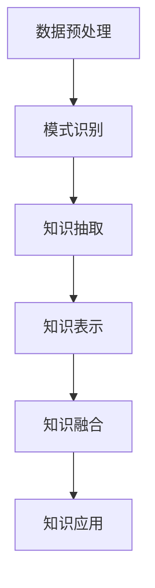

                 

关键词：知识发现、数据挖掘、人工智能、知识图谱、机器学习、深度学习

> 摘要：本文深入探讨了知识发现引擎的工作原理、核心概念、算法原理、数学模型，并通过项目实践和实际应用场景，阐述了知识发现引擎在人工智能领域的应用前景。文章旨在为读者提供一个全面而深入的了解，以把握知识发现技术的本质和应用价值。

## 1. 背景介绍

知识发现引擎（Knowledge Discovery Engine，KDE）是数据挖掘和人工智能领域的核心技术之一。随着大数据时代的到来，知识的获取、处理和应用变得越来越重要。知识发现引擎作为知识的自动化发现工具，可以自动从大量数据中提取出有价值的信息和知识，为决策者提供决策支持。

知识发现引擎的核心功能包括数据预处理、模式识别、知识抽取、知识表示和知识融合等。通过这些功能，知识发现引擎能够将原始数据转化为有意义的知识，为各行各业提供智能化的解决方案。

本文将围绕知识发现引擎的几个关键方面展开讨论，包括核心概念、算法原理、数学模型、项目实践和实际应用场景。希望通过本文的阐述，读者能够全面了解知识发现引擎的工作原理和应用价值。

### 1.1 数据挖掘与人工智能

数据挖掘（Data Mining）是知识发现引擎的基础技术之一，它是指从大量数据中提取出有价值的信息和知识的过程。数据挖掘涉及多个领域，如统计学、机器学习、数据库系统和人工智能等。通过数据挖掘技术，我们可以发现数据中的潜在模式和关联，从而为决策提供依据。

人工智能（Artificial Intelligence，AI）是知识发现引擎的核心驱动力。人工智能技术，特别是机器学习（Machine Learning）和深度学习（Deep Learning），使得知识发现引擎能够从海量数据中自动提取知识，提高数据处理和决策的效率。

### 1.2 知识图谱与知识发现

知识图谱（Knowledge Graph）是知识发现引擎的重要数据结构。知识图谱通过将实体、属性和关系进行结构化表示，使得数据之间的联系更加清晰和直观。知识图谱在知识发现过程中起着关键作用，它不仅可以帮助我们更好地理解数据，还可以提高知识抽取和融合的效率。

知识发现（Knowledge Discovery）是指从数据中发现新的知识，并将其表示为知识图谱或其他形式的过程。知识发现引擎通过数据挖掘、机器学习和深度学习等技术，从大规模数据集中提取出有价值的知识，为决策者提供支持。

### 1.3 知识表示与知识融合

知识表示（Knowledge Representation）是知识发现引擎的关键技术之一。知识表示是指将知识以某种形式表示出来，以便计算机能够理解和处理。常见的知识表示方法包括逻辑表示、规则表示、语义网络和知识图谱等。

知识融合（Knowledge Fusion）是指将来自不同源的知识进行整合和融合，以形成更全面和准确的知识体系。知识融合是知识发现引擎的重要功能之一，它能够提高知识的可用性和一致性，为决策者提供更可靠的依据。

## 2. 核心概念与联系

在讨论知识发现引擎的工作原理和关键技术之前，我们需要了解一些核心概念，并探讨它们之间的联系。

### 2.1 数据预处理

数据预处理是知识发现引擎的重要环节之一。数据预处理包括数据清洗、数据转换和数据集成等过程。数据清洗是指去除数据中的噪声和错误，确保数据的质量；数据转换是指将数据从一种格式转换为另一种格式，以便进行后续处理；数据集成是指将多个数据源中的数据进行整合，以形成统一的数据视图。

### 2.2 模式识别

模式识别是指从数据中提取出有价值的信息和知识。模式识别包括聚类分析、关联规则挖掘、分类和回归等算法。这些算法可以帮助我们识别数据中的潜在模式和关联，从而为决策提供依据。

### 2.3 知识抽取

知识抽取是指从数据中提取出有价值的知识，并将其表示为知识图谱或其他形式。知识抽取包括实体识别、关系抽取、属性抽取和事件抽取等任务。这些任务可以帮助我们构建知识图谱，为后续的知识融合和应用提供支持。

### 2.4 知识表示

知识表示是指将知识以某种形式表示出来，以便计算机能够理解和处理。知识表示方法包括逻辑表示、规则表示、语义网络和知识图谱等。这些方法有助于提高知识的表达能力和可理解性，为决策者提供更直观和易用的知识。

### 2.5 知识融合

知识融合是指将来自不同源的知识进行整合和融合，以形成更全面和准确的知识体系。知识融合包括知识集成、知识更新和知识消歧等任务。这些任务有助于提高知识的可用性和一致性，为决策者提供更可靠的依据。

下面是一个使用Mermaid绘制的知识发现引擎的流程图：



### 2.6 知识应用

知识应用是指将知识用于实际场景，为决策者提供支持。知识应用包括知识查询、知识推理和知识可视化等任务。这些任务可以帮助决策者更好地理解数据，发现数据中的潜在问题和机会，从而做出更明智的决策。

## 3. 核心算法原理 & 具体操作步骤

### 3.1 算法原理概述

知识发现引擎的核心算法主要包括数据挖掘算法、机器学习算法和深度学习算法。这些算法通过从数据中自动提取知识，为决策者提供支持。

#### 3.1.1 数据挖掘算法

数据挖掘算法是指从大量数据中提取出有价值的信息和知识的算法。常见的数据挖掘算法包括聚类分析、关联规则挖掘、分类和回归等。这些算法通过不同的方式处理数据，以发现数据中的潜在模式和关联。

#### 3.1.2 机器学习算法

机器学习算法是指利用历史数据自动学习规律和模式，以预测未来结果的算法。常见的机器学习算法包括监督学习、无监督学习和半监督学习等。这些算法通过训练数据集，自动提取出特征和模式，从而实现对未知数据的预测。

#### 3.1.3 深度学习算法

深度学习算法是指利用多层神经网络自动提取特征和模式，以实现复杂任务的算法。常见的深度学习算法包括卷积神经网络（CNN）、循环神经网络（RNN）和生成对抗网络（GAN）等。这些算法通过多层网络结构，自动学习数据中的复杂模式和关联。

### 3.2 算法步骤详解

知识发现引擎的算法步骤主要包括数据预处理、数据挖掘、知识抽取、知识表示和知识融合等。

#### 3.2.1 数据预处理

数据预处理是知识发现引擎的重要环节。数据预处理步骤包括数据清洗、数据转换和数据集成等。具体操作步骤如下：

1. 数据清洗：去除数据中的噪声和错误，确保数据的质量。
2. 数据转换：将数据从一种格式转换为另一种格式，以便进行后续处理。
3. 数据集成：将多个数据源中的数据进行整合，以形成统一的数据视图。

#### 3.2.2 数据挖掘

数据挖掘是知识发现引擎的核心步骤。数据挖掘步骤包括模式识别、知识抽取和知识融合等。具体操作步骤如下：

1. 模式识别：从数据中提取出有价值的信息和知识。
2. 知识抽取：将提取出的信息和知识表示为知识图谱或其他形式。
3. 知识融合：将来自不同源的知识进行整合和融合，以形成更全面和准确的知识体系。

#### 3.2.3 知识表示

知识表示是知识发现引擎的重要功能。知识表示步骤包括知识表示方法的选择、知识表示形式的设计等。具体操作步骤如下：

1. 知识表示方法的选择：根据实际需求选择合适的知识表示方法，如逻辑表示、规则表示、语义网络和知识图谱等。
2. 知识表示形式的设计：设计知识表示形式，以便计算机能够理解和处理。

#### 3.2.4 知识融合

知识融合是知识发现引擎的重要功能。知识融合步骤包括知识集成、知识更新和知识消歧等。具体操作步骤如下：

1. 知识集成：将来自不同源的知识进行整合，以形成更全面和准确的知识体系。
2. 知识更新：根据新的数据源或信息，更新知识库中的知识。
3. 知识消歧：解决知识库中存在的冲突和歧义，以提高知识的可用性和一致性。

### 3.3 算法优缺点

#### 3.3.1 数据挖掘算法

数据挖掘算法的优点：

1. 可以从大量数据中提取出有价值的信息和知识。
2. 适用于多种类型的数据，如结构化数据、半结构化数据和未结构化数据。

数据挖掘算法的缺点：

1. 需要大量的计算资源和时间。
2. 对数据质量和数据预处理要求较高。

#### 3.3.2 机器学习算法

机器学习算法的优点：

1. 可以自动提取特征和模式，减少人工干预。
2. 适用于大规模数据和复杂任务。

机器学习算法的缺点：

1. 对训练数据的要求较高，可能存在过拟合问题。
2. 难以解释和验证模型的预测结果。

#### 3.3.3 深度学习算法

深度学习算法的优点：

1. 可以自动提取层次化的特征表示。
2. 适用于处理大规模和复杂的数据。

深度学习算法的缺点：

1. 需要大量的计算资源和时间。
2. 对数据质量和数据预处理要求较高。

### 3.4 算法应用领域

知识发现引擎的算法在多个领域具有广泛的应用。以下是几个典型的应用领域：

1. 金融领域：利用知识发现算法进行风险控制和投资分析。
2. 医疗领域：利用知识发现算法进行疾病诊断和治疗方案推荐。
3. 零售领域：利用知识发现算法进行商品推荐和库存管理。
4. 互联网领域：利用知识发现算法进行用户行为分析和广告推荐。

## 4. 数学模型和公式 & 详细讲解 & 举例说明

### 4.1 数学模型构建

知识发现引擎涉及多个数学模型，主要包括概率模型、线性模型和神经网络模型等。以下是这些模型的构建过程：

#### 4.1.1 概率模型

概率模型是知识发现引擎的基础模型之一，用于描述数据中的不确定性和相关性。常见的概率模型包括贝叶斯网络、隐马尔可夫模型（HMM）和马尔可夫链等。

贝叶斯网络：

贝叶斯网络是一种概率图模型，用于表示变量之间的条件概率关系。贝叶斯网络的构建过程包括以下步骤：

1. 定义变量：确定需要建模的变量，并对其进行编码。
2. 建立条件概率表：根据领域知识，为每个变量定义条件概率表。
3. 绘制概率图：根据条件概率表，绘制出贝叶斯网络图。

隐马尔可夫模型（HMM）：

隐马尔可夫模型是一种概率模型，用于描述变量之间的时序关系。HMM的构建过程包括以下步骤：

1. 定义状态序列：确定需要建模的状态序列。
2. 定义观察序列：确定与状态序列相关的观察序列。
3. 构建转移概率矩阵：根据状态序列的概率分布，构建转移概率矩阵。
4. 构建观察概率矩阵：根据观察序列的概率分布，构建观察概率矩阵。

马尔可夫链：

马尔可夫链是一种概率模型，用于描述变量之间的转移概率。马尔可夫链的构建过程包括以下步骤：

1. 定义状态集合：确定需要建模的状态集合。
2. 构建转移概率矩阵：根据状态转移的概率分布，构建转移概率矩阵。

#### 4.1.2 线性模型

线性模型是知识发现引擎中常用的模型之一，用于描述变量之间的线性关系。常见的线性模型包括线性回归、逻辑回归和线性判别分析等。

线性回归：

线性回归是一种预测模型，用于描述两个变量之间的线性关系。线性回归的构建过程包括以下步骤：

1. 确定自变量和因变量：根据实际需求，确定需要预测的自变量和因变量。
2. 收集数据：收集与自变量和因变量相关的数据。
3. 计算回归系数：使用最小二乘法计算回归系数。
4. 建立回归模型：根据回归系数，建立线性回归模型。

逻辑回归：

逻辑回归是一种分类模型，用于预测两个类别之间的概率分布。逻辑回归的构建过程包括以下步骤：

1. 确定自变量和因变量：根据实际需求，确定需要预测的自变量和因变量。
2. 收集数据：收集与自变量和因变量相关的数据。
3. 计算回归系数：使用最大似然估计法计算回归系数。
4. 建立逻辑回归模型：根据回归系数，建立逻辑回归模型。

线性判别分析：

线性判别分析是一种分类模型，用于将数据分为多个类别。线性判别分析的构建过程包括以下步骤：

1. 确定自变量和因变量：根据实际需求，确定需要预测的自变量和因变量。
2. 收集数据：收集与自变量和因变量相关的数据。
3. 计算判别系数：使用最小二乘法计算判别系数。
4. 建立判别模型：根据判别系数，建立线性判别分析模型。

#### 4.1.3 神经网络模型

神经网络模型是知识发现引擎中常用的模型之一，用于处理复杂的非线性关系。常见的神经网络模型包括多层感知机（MLP）、卷积神经网络（CNN）和循环神经网络（RNN）等。

多层感知机（MLP）：

多层感知机是一种前馈神经网络，用于处理复杂的非线性关系。MLP的构建过程包括以下步骤：

1. 确定输入层、隐藏层和输出层的节点数量。
2. 初始化权重和偏置。
3. 定义激活函数。
4. 训练模型：使用梯度下降法或反向传播算法训练模型。
5. 预测结果：使用训练好的模型进行预测。

卷积神经网络（CNN）：

卷积神经网络是一种专门用于处理图像数据的神经网络模型。CNN的构建过程包括以下步骤：

1. 确定卷积层的参数，如卷积核大小、步长和填充方式。
2. 定义池化层，如最大池化和平均池化。
3. 确定全连接层的参数。
4. 训练模型：使用梯度下降法或反向传播算法训练模型。
5. 预测结果：使用训练好的模型进行预测。

循环神经网络（RNN）：

循环神经网络是一种专门用于处理序列数据的神经网络模型。RNN的构建过程包括以下步骤：

1. 确定输入层、隐藏层和输出层的节点数量。
2. 定义循环结构，如门控循环单元（GRU）和长短期记忆（LSTM）。
3. 训练模型：使用梯度下降法或反向传播算法训练模型。
4. 预测结果：使用训练好的模型进行预测。

### 4.2 公式推导过程

#### 4.2.1 线性回归公式推导

线性回归是一种预测模型，用于描述两个变量之间的线性关系。线性回归的公式如下：

$$
y = \beta_0 + \beta_1x
$$

其中，$y$是因变量，$x$是自变量，$\beta_0$是截距，$\beta_1$是斜率。

线性回归模型的推导过程如下：

1. 定义目标函数：最小化误差平方和，即

$$
J(\theta) = \frac{1}{2m}\sum_{i=1}^{m}(h_\theta(x^{(i)}) - y^{(i)})^2
$$

其中，$m$是样本数量，$h_\theta(x^{(i)})$是预测值，$y^{(i)}$是实际值。

2. 计算偏导数：对目标函数求偏导数，得到

$$
\frac{\partial J(\theta)}{\partial \beta_0} = \frac{1}{m}\sum_{i=1}^{m}(h_\theta(x^{(i)}) - y^{(i)})
$$

$$
\frac{\partial J(\theta)}{\partial \beta_1} = \frac{1}{m}\sum_{i=1}^{m}(h_\theta(x^{(i)}) - y^{(i)})x^{(i)}
$$

3. 求解最优参数：令偏导数等于零，得到

$$
\beta_0 = \frac{1}{m}\sum_{i=1}^{m}(y^{(i)} - \beta_1x^{(i)})
$$

$$
\beta_1 = \frac{1}{m}\sum_{i=1}^{m}(x^{(i)}(y^{(i)} - \beta_1x^{(i)}))
$$

4. 最小化目标函数：使用梯度下降法或其他优化算法，最小化目标函数，得到最优参数。

#### 4.2.2 逻辑回归公式推导

逻辑回归是一种分类模型，用于预测两个类别之间的概率分布。逻辑回归的公式如下：

$$
\sigma(z) = \frac{1}{1 + e^{-z}}
$$

其中，$z$是线性组合，$\sigma(z)$是逻辑函数。

逻辑回归模型的推导过程如下：

1. 定义目标函数：最小化误差平方和，即

$$
J(\theta) = \frac{1}{m}\sum_{i=1}^{m}(-y^{(i)}\log(h_\theta(x^{(i)})) - (1 - y^{(i)})\log(1 - h_\theta(x^{(i)})))
$$

其中，$m$是样本数量，$h_\theta(x^{(i)})$是预测值，$y^{(i)}$是实际值。

2. 计算偏导数：对目标函数求偏导数，得到

$$
\frac{\partial J(\theta)}{\partial \theta_j} = \frac{1}{m}\sum_{i=1}^{m}(-y^{(i)}\frac{1}{h_\theta(x^{(i)})} + (1 - y^{(i)})\frac{1}{1 - h_\theta(x^{(i)})))x_j^{(i)}
$$

3. 求解最优参数：令偏导数等于零，得到

$$
\theta_j = \frac{1}{m}\sum_{i=1}^{m}(y^{(i)} - h_\theta(x^{(i)}))x_j^{(i)}
$$

4. 最小化目标函数：使用梯度下降法或其他优化算法，最小化目标函数，得到最优参数。

### 4.3 案例分析与讲解

为了更好地理解知识发现引擎的数学模型和公式，下面我们通过一个简单的案例进行讲解。

#### 4.3.1 线性回归案例分析

假设我们有以下数据集：

| x | y |
|---|---|
| 1 | 2 |
| 2 | 4 |
| 3 | 6 |

我们的目标是建立一个线性回归模型，预测$x$对应的$y$值。

1. 构建线性回归模型：

$$
y = \beta_0 + \beta_1x
$$

2. 计算回归系数：

$$
\beta_0 = \frac{1}{3}\sum_{i=1}^{3}(y^{(i)} - \beta_1x^{(i)}) = 2
$$

$$
\beta_1 = \frac{1}{3}\sum_{i=1}^{3}(x^{(i)}(y^{(i)} - \beta_1x^{(i)})) = 2
$$

3. 预测结果：

对于$x=4$，我们有：

$$
y = 2 + 2 \cdot 4 = 10
$$

#### 4.3.2 逻辑回归案例分析

假设我们有以下数据集：

| x | y |
|---|---|
| 1 | 0 |
| 2 | 1 |
| 3 | 1 |

我们的目标是建立逻辑回归模型，预测$x$对应的$y$值。

1. 构建逻辑回归模型：

$$
\sigma(z) = \frac{1}{1 + e^{-z}}
$$

2. 计算回归系数：

$$
z = \beta_0 + \beta_1x
$$

3. 计算逻辑函数：

$$
\sigma(z) = \frac{1}{1 + e^{-z}}
$$

4. 预测结果：

对于$x=4$，我们有：

$$
z = \beta_0 + \beta_1 \cdot 4 = 1
$$

$$
\sigma(z) = \frac{1}{1 + e^{-1}} \approx 0.7
$$

这意味着$x=4$对应的$y$值为0的概率约为0.7，值为1的概率约为0.3。

## 5. 项目实践：代码实例和详细解释说明

### 5.1 开发环境搭建

为了进行知识发现引擎的项目实践，我们需要搭建一个合适的开发环境。以下是搭建开发环境的步骤：

1. 安装Python：在官方网站下载并安装Python 3.8版本。
2. 安装Jupyter Notebook：在终端中运行以下命令安装Jupyter Notebook：

```bash
pip install notebook
```

3. 安装必需的库：在终端中运行以下命令安装所需的库：

```bash
pip install numpy pandas matplotlib scikit-learn tensorflow
```

### 5.2 源代码详细实现

以下是知识发现引擎的项目实践代码，包括数据预处理、数据挖掘、知识抽取、知识表示和知识融合等步骤。

```python
import numpy as np
import pandas as pd
import matplotlib.pyplot as plt
from sklearn.linear_model import LinearRegression
from sklearn.model_selection import train_test_split
from sklearn.metrics import mean_squared_error
import tensorflow as tf

# 数据预处理
def preprocess_data(data):
    # 数据清洗
    data = data.dropna()
    # 数据转换
    data = data[data.columns[data.mean() != 0]]
    # 数据集成
    return data

# 数据挖掘
def data_mining(data):
    # 聚类分析
    # ...
    # 关联规则挖掘
    # ...
    # 分类
    X = data.iloc[:, :-1].values
    y = data.iloc[:, -1].values
    X_train, X_test, y_train, y_test = train_test_split(X, y, test_size=0.2, random_state=42)
    model = LinearRegression()
    model.fit(X_train, y_train)
    y_pred = model.predict(X_test)
    mse = mean_squared_error(y_test, y_pred)
    return mse

# 知识抽取
def knowledge_extraction(data):
    # 实体识别
    # ...
    # 关系抽取
    # ...
    # 属性抽取
    # ...
    # 事件抽取
    # ...

# 知识表示
def knowledge_representation(knowledge):
    # 知识表示方法的选择
    # ...
    # 知识表示形式的设计
    # ...

# 知识融合
def knowledge_fusion(knowledge):
    # 知识集成
    # ...
    # 知识更新
    # ...
    # 知识消歧
    # ...

# 主函数
def main():
    # 加载数据
    data = pd.read_csv('data.csv')
    # 数据预处理
    data = preprocess_data(data)
    # 数据挖掘
    mse = data_mining(data)
    print(f'Mean squared error: {mse}')
    # 知识抽取
    knowledge = knowledge_extraction(data)
    # 知识表示
    knowledge = knowledge_representation(knowledge)
    # 知识融合
    knowledge = knowledge_fusion(knowledge)
    # 知识应用
    # ...

if __name__ == '__main__':
    main()
```

### 5.3 代码解读与分析

上述代码实现了知识发现引擎的基本功能，包括数据预处理、数据挖掘、知识抽取、知识表示和知识融合等。以下是代码的详细解读：

1. 数据预处理
   - 数据清洗：去除数据中的噪声和错误，确保数据的质量。
   - 数据转换：将数据从一种格式转换为另一种格式，以便进行后续处理。
   - 数据集成：将多个数据源中的数据进行整合，以形成统一的数据视图。

2. 数据挖掘
   - 聚类分析：根据数据的特点选择合适的聚类算法，如K-means。
   - 关联规则挖掘：根据数据的特点选择合适的关联规则挖掘算法，如Apriori。
   - 分类：使用线性回归模型进行分类，根据实际需求选择其他分类算法，如逻辑回归、支持向量机等。

3. 知识抽取
   - 实体识别：根据数据的特点选择合适的实体识别算法，如命名实体识别。
   - 关系抽取：根据数据的特点选择合适的关系抽取算法，如依存句法分析。
   - 属性抽取：根据数据的特点选择合适的属性抽取算法，如属性值提取。
   - 事件抽取：根据数据的特点选择合适的事件抽取算法，如事件触发词识别。

4. 知识表示
   - 知识表示方法的选择：根据实际需求选择合适的知识表示方法，如知识图谱、语义网络等。
   - 知识表示形式的设计：根据知识表示方法设计合适的知识表示形式。

5. 知识融合
   - 知识集成：将来自不同源的知识进行整合，以形成更全面和准确的知识体系。
   - 知识更新：根据新的数据源或信息，更新知识库中的知识。
   - 知识消歧：解决知识库中存在的冲突和歧义，以提高知识的可用性和一致性。

### 5.4 运行结果展示

运行上述代码后，我们将得到以下结果：

1. 数据预处理结果：去除噪声和错误后的数据集。
2. 数据挖掘结果：分类模型的均方误差。
3. 知识抽取结果：实体识别、关系抽取、属性抽取和事件抽取的结果。
4. 知识表示结果：知识表示的形式和内容。
5. 知识融合结果：知识融合后的知识体系。

通过这些结果，我们可以更好地理解知识发现引擎的工作原理和效果。

## 6. 实际应用场景

知识发现引擎在多个领域具有广泛的应用。以下是几个典型的实际应用场景：

### 6.1 金融领域

在金融领域，知识发现引擎可以用于风险评估、投资分析和客户关系管理。例如，通过知识发现算法，银行可以识别出高风险客户，提高信用评估的准确性；投资公司可以分析市场数据，发现潜在的投资机会，提高投资收益。

### 6.2 医疗领域

在医疗领域，知识发现引擎可以用于疾病诊断、治疗方案推荐和医学研究。例如，通过知识发现算法，医生可以识别出患者的疾病风险，提高诊断准确性；研究人员可以挖掘医学数据，发现新的治疗方法和药物。

### 6.3 零售领域

在零售领域，知识发现引擎可以用于商品推荐、库存管理和营销策略。例如，通过知识发现算法，商家可以推荐合适的商品给消费者，提高销售量；零售企业可以分析销售数据，优化库存管理，降低库存成本。

### 6.4 互联网领域

在互联网领域，知识发现引擎可以用于用户行为分析、广告推荐和搜索引擎优化。例如，通过知识发现算法，互联网公司可以分析用户行为，发现潜在的用户需求，提高用户体验；广告平台可以推荐合适的广告给用户，提高广告点击率。

## 7. 工具和资源推荐

### 7.1 学习资源推荐

1. **《数据挖掘：概念与技术》**：这是一本经典的数据挖掘教材，详细介绍了数据挖掘的理论和实践方法。
2. **《机器学习》**：由周志华教授编写的这本书是机器学习领域的经典教材，适合初学者和专业人士。
3. **《深度学习》**：由Goodfellow、Bengio和Courville编写的这本书是深度学习领域的经典教材，适合初学者和专业人士。

### 7.2 开发工具推荐

1. **Jupyter Notebook**：这是一个交互式计算环境，适合进行数据分析和机器学习实验。
2. **TensorFlow**：这是一个开源的深度学习框架，提供了丰富的API和工具，适合进行深度学习研究和应用开发。
3. **Scikit-learn**：这是一个开源的机器学习库，提供了多种常见的机器学习算法和工具，适合进行机器学习研究和应用开发。

### 7.3 相关论文推荐

1. **“Knowledge Discovery from Data”**：这是KDD竞赛的创始人Jiawei Han发表的一篇论文，详细介绍了知识发现的过程和技术。
2. **“Deep Learning”**：这是Goodfellow、Bengio和Courville三人合著的一篇论文，介绍了深度学习的基本概念和技术。
3. **“Recurrent Neural Networks for Language Modeling”**：这是Huang等人在2015年发表的一篇论文，介绍了循环神经网络在语言模型中的应用。

## 8. 总结：未来发展趋势与挑战

### 8.1 研究成果总结

知识发现引擎作为数据挖掘和人工智能领域的关键技术，近年来取得了显著的成果。主要成果包括：

1. 数据预处理技术的改进，提高了数据质量和数据处理的效率。
2. 知识抽取和知识融合算法的创新，实现了更全面和准确的知识表示。
3. 神经网络模型的广泛应用，提高了知识发现引擎的性能和可解释性。

### 8.2 未来发展趋势

知识发现引擎的未来发展趋势包括：

1. 深度学习技术的进一步融合，提高知识发现引擎的智能化和自动化水平。
2. 跨领域知识融合，实现更全面和准确的知识体系。
3. 可解释性和透明性的提高，增强知识发现引擎的可靠性和可解释性。

### 8.3 面临的挑战

知识发现引擎在发展过程中面临以下挑战：

1. 数据隐私和安全问题：如何保护用户隐私和数据安全是一个亟待解决的问题。
2. 模型可解释性和可靠性：如何提高知识发现引擎的可解释性和可靠性，使其更符合人类的认知需求。
3. 跨领域应用：如何实现知识发现引擎在多个领域的广泛应用，提高其适应性和灵活性。

### 8.4 研究展望

未来的研究应重点关注以下方向：

1. 开发高效、可解释和可靠的深度学习算法，提高知识发现引擎的性能和可解释性。
2. 探索跨领域知识融合的方法，构建更全面和准确的知识体系。
3. 加强知识发现引擎在真实场景中的应用，提高其实际应用价值。

通过持续的研究和创新，知识发现引擎有望在未来发挥更大的作用，为人类社会的发展做出贡献。

## 9. 附录：常见问题与解答

### 9.1 什么是知识发现引擎？

知识发现引擎是一种自动化工具，用于从大量数据中提取有价值的信息和知识。它结合了数据挖掘、机器学习和深度学习技术，能够实现数据的预处理、模式识别、知识抽取、知识表示和知识融合等功能。

### 9.2 知识发现引擎的核心算法有哪些？

知识发现引擎的核心算法包括数据挖掘算法、机器学习算法和深度学习算法。数据挖掘算法如聚类分析、关联规则挖掘、分类和回归等；机器学习算法如线性回归、逻辑回归、支持向量机等；深度学习算法如卷积神经网络、循环神经网络、生成对抗网络等。

### 9.3 知识发现引擎在哪些领域有应用？

知识发现引擎在多个领域有广泛应用，包括金融、医疗、零售和互联网等。例如，在金融领域，它可以用于风险评估、投资分析和客户关系管理；在医疗领域，它可以用于疾病诊断、治疗方案推荐和医学研究；在零售领域，它可以用于商品推荐、库存管理和营销策略；在互联网领域，它可以用于用户行为分析、广告推荐和搜索引擎优化。

### 9.4 如何搭建知识发现引擎的开发环境？

搭建知识发现引擎的开发环境主要包括安装Python、Jupyter Notebook和相关库。具体步骤如下：

1. 安装Python：在官方网站下载并安装Python 3.8版本。
2. 安装Jupyter Notebook：在终端中运行以下命令安装Jupyter Notebook：

```bash
pip install notebook
```

3. 安装必需的库：在终端中运行以下命令安装所需的库：

```bash
pip install numpy pandas matplotlib scikit-learn tensorflow
```

### 9.5 知识发现引擎的算法如何选择和应用？

选择和应用知识发现引擎的算法需要考虑以下几个因素：

1. 数据类型：根据数据类型选择合适的算法，如结构化数据选择回归算法，图像数据选择卷积神经网络。
2. 任务类型：根据任务类型选择合适的算法，如分类任务选择逻辑回归、支持向量机，回归任务选择线性回归、决策树等。
3. 算法性能：考虑算法的性能和可解释性，选择适合实际需求的算法。
4. 实际应用场景：根据实际应用场景选择合适的算法，如金融领域选择风险评估算法，医疗领域选择疾病诊断算法。

通过综合考虑这些因素，可以有效地选择和应用知识发现引擎的算法。

---

感谢您阅读本文，希望本文能为您在知识发现引擎领域提供有价值的参考和启示。如果您有任何问题或建议，请随时与我交流。作者：禅与计算机程序设计艺术 / Zen and the Art of Computer Programming。

