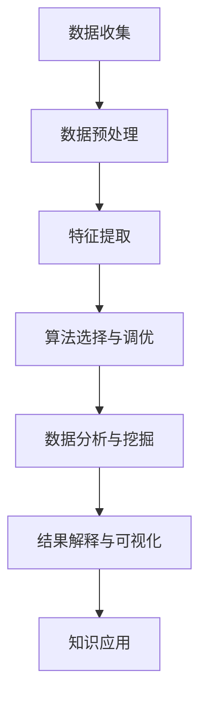

                 

关键词：知识发现、科学研究、人工智能、算法、数学模型、实践案例

> 摘要：本文将深入探讨知识发现引擎在推动科学研究方面的巨大潜力。通过详细解析其核心概念、算法原理、数学模型、实际应用案例，我们将展示知识发现引擎如何成为科学研究的强大工具，助力科学家们突破研究边界，开启科研新纪元。

## 1. 背景介绍

在过去的几十年里，科学研究的进程受到了数据的爆发性增长和数据处理的复杂性的挑战。随着大数据时代的到来，如何从海量数据中提取有价值的信息成为了科学家们亟待解决的问题。知识发现引擎正是为了应对这一挑战而诞生的一种技术。

知识发现引擎是一种利用人工智能和机器学习技术，从大规模数据集中自动提取知识、模式和关联的智能系统。它通过算法和模型分析数据，帮助科学家们发现数据中的隐藏规律和知识，从而为科学研究提供新的洞察和方向。

知识发现引擎的应用领域广泛，涵盖了生物信息学、医学研究、社会科学、经济学、环境科学等多个领域。在生物信息学领域，知识发现引擎可以帮助科学家们分析基因序列，发现新的基因关联和疾病机制；在医学研究中，知识发现引擎可以挖掘患者数据，预测疾病发生和提供个性化治疗方案；在社会科学领域，知识发现引擎可以分析社会行为数据，揭示社会现象背后的规律和趋势。

本文将详细介绍知识发现引擎的核心概念、算法原理、数学模型以及实际应用案例，帮助读者全面了解这一强大工具在科学研究中的重要作用。

## 2. 核心概念与联系

### 2.1 知识发现引擎的定义

知识发现引擎（Knowledge Discovery Engine，简称KDE）是一种集成了多种人工智能和机器学习技术的智能系统。它通过算法和模型分析海量数据，自动识别数据中的模式、关联和知识，为用户提供有价值的信息和洞察。

### 2.2 知识发现引擎的核心组成部分

知识发现引擎主要包括以下核心组成部分：

- **数据预处理模块**：负责对原始数据进行清洗、转换和整合，使其符合算法的要求。
- **特征提取模块**：从预处理后的数据中提取出能够代表数据特性的特征，以便算法进行分析。
- **算法模块**：根据不同的应用场景，选择合适的算法对数据进行分析，如聚类、分类、关联规则挖掘等。
- **结果解释模块**：对算法分析结果进行解释和可视化，帮助用户理解分析结果的意义和价值。

### 2.3 知识发现引擎的工作流程

知识发现引擎的工作流程可以分为以下几个步骤：

1. **数据收集**：收集相关领域的大量数据，如基因序列、医疗记录、社交媒体数据等。
2. **数据预处理**：对原始数据进行清洗、转换和整合，去除噪声和异常值，确保数据的质量。
3. **特征提取**：从预处理后的数据中提取出代表数据特性的特征。
4. **算法选择与调优**：根据应用场景和需求，选择合适的算法，并对算法参数进行调优。
5. **数据分析与挖掘**：使用算法对特征数据进行分析，发现数据中的模式和关联。
6. **结果解释与可视化**：对分析结果进行解释和可视化，帮助用户理解分析结果的意义和价值。
7. **知识应用**：将分析结果应用于实际场景，如疾病预测、药物研发、市场分析等。

### 2.4 Mermaid 流程图

下面是一个简化的知识发现引擎的 Mermaid 流程图，展示了其核心组成部分和工作流程：



## 3. 核心算法原理 & 具体操作步骤

### 3.1 算法原理概述

知识发现引擎的核心在于其算法模块，不同的算法适用于不同的场景和数据类型。以下是几种常见的算法原理：

- **聚类算法**：将数据划分为多个类别，使同类别内的数据点之间的距离最小，不同类别之间的距离最大。常用的聚类算法有K-means、DBSCAN等。
- **分类算法**：将数据分为已知类别，通过训练模型，使新数据能够被正确分类。常用的分类算法有决策树、支持向量机（SVM）、神经网络等。
- **关联规则挖掘**：从数据中挖掘出不同变量之间的关联关系，常用的算法有Apriori、Eclat等。
- **时间序列分析**：分析数据中的时间依赖关系，常用的算法有ARIMA、LSTM等。

### 3.2 算法步骤详解

以下以K-means算法为例，详细说明其操作步骤：

#### 3.2.1 K-means算法原理

K-means算法是一种基于距离的聚类算法，通过迭代计算将数据划分为K个类别。算法的基本思想是：首先随机初始化K个簇心，然后计算每个数据点到簇心的距离，将数据点分配到最近的簇心所属的类别。接着，重新计算簇心的位置，重复上述过程，直到簇心的位置收敛。

#### 3.2.2 算法步骤

1. **初始化簇心**：随机选择K个数据点作为初始簇心。
2. **分配数据点**：计算每个数据点到各个簇心的距离，将数据点分配到最近的簇心所属的类别。
3. **更新簇心位置**：计算每个类别的均值，将均值作为新的簇心。
4. **重复步骤2和3**，直到簇心的位置收敛或达到预设的最大迭代次数。

#### 3.2.3 算法优缺点

- **优点**：计算简单，易于实现，适用于处理高维度数据。
- **缺点**：对初始簇心的选择敏感，可能导致局部最优解。

### 3.3 算法应用领域

K-means算法在数据挖掘、文本分类、图像处理等领域有广泛的应用。以下是一些具体的应用场景：

- **数据挖掘**：用于数据预处理，将数据划分为多个类别，简化数据分析过程。
- **文本分类**：用于文本数据的聚类，识别文本的主题和类别。
- **图像处理**：用于图像分割，将图像划分为多个区域。

## 4. 数学模型和公式 & 详细讲解 & 举例说明

### 4.1 数学模型构建

知识发现引擎的算法通常基于数学模型，以下以K-means算法为例，介绍其数学模型构建。

#### 4.1.1 K-means算法的数学模型

假设数据集D包含n个数据点，每个数据点x属于d维空间。给定聚类个数K，K-means算法的目标是最小化数据点到簇心的距离平方和。

目标函数：
$$
J = \sum_{i=1}^{K} \sum_{x \in S_i} \| x - \mu_i \|^2
$$
其中，$S_i$为第i个簇的数据点集合，$\mu_i$为第i个簇心的坐标。

#### 4.1.2 簇心更新公式

在K-means算法中，簇心的更新是基于簇内数据点的均值。簇心更新公式如下：
$$
\mu_i = \frac{1}{|S_i|} \sum_{x \in S_i} x
$$
其中，$|S_i|$为簇$S_i$的数据点个数。

### 4.2 公式推导过程

K-means算法的推导过程主要涉及优化目标函数。具体步骤如下：

1. **定义目标函数**：根据簇心与数据点之间的距离，定义目标函数为数据点到簇心的距离平方和。
2. **目标函数求导**：对目标函数关于簇心求导，得到导数为0的簇心更新公式。
3. **迭代优化**：根据簇心更新公式，迭代更新簇心，直到目标函数收敛。

### 4.3 案例分析与讲解

以下通过一个简单的案例，展示K-means算法的数学模型和推导过程。

#### 案例数据

给定数据集D如下：
$$
D = \{ (1, 2), (2, 2), (2, 3), (1, 3), (3, 3), (3, 2) \}
$$
其中，数据点为二维空间中的点。

#### 案例步骤

1. **初始化簇心**：随机选择两个数据点作为初始簇心：
   $$
   \mu_1 = (1, 2), \mu_2 = (3, 3)
   $$
2. **分配数据点**：计算每个数据点到两个簇心的距离，将数据点分配到最近的簇心所属的类别。结果如下：
   $$
   S_1 = \{ (1, 2), (2, 2), (1, 3) \}, S_2 = \{ (3, 3), (3, 2) \}
   $$
3. **更新簇心位置**：计算每个类别的均值，更新簇心位置：
   $$
   \mu_1 = \frac{(1+2+1)}{3} = (1, 2), \mu_2 = \frac{(3+3+3)}{3} = (3, 3)
   $$
4. **重复步骤2和3**：由于簇心位置未发生改变，算法收敛。

#### 案例总结

通过上述案例，我们可以看到K-means算法的数学模型和推导过程。在实际应用中，算法的性能取决于初始簇心的选择和数据分布。通过适当的参数调整和算法优化，K-means算法可以有效地进行数据聚类。

## 5. 项目实践：代码实例和详细解释说明

### 5.1 开发环境搭建

为了演示知识发现引擎的应用，我们将使用Python作为编程语言，结合常用的机器学习库Scikit-learn，实现K-means算法。以下是开发环境的搭建步骤：

1. **安装Python**：确保已安装Python 3.x版本。
2. **安装Scikit-learn**：使用pip命令安装Scikit-learn库：
   ```
   pip install scikit-learn
   ```

### 5.2 源代码详细实现

以下是一个简单的K-means算法实现，展示了从数据预处理、模型训练到结果可视化的完整过程。

```python
import numpy as np
from sklearn.cluster import KMeans
from sklearn.datasets import make_blobs
import matplotlib.pyplot as plt

# 生成模拟数据集
X, _ = make_blobs(n_samples=50, centers=3, n_features=2, random_state=0)

# 初始化KMeans模型，设置簇数为3
kmeans = KMeans(n_clusters=3, random_state=0)

# 训练模型
kmeans.fit(X)

# 获取聚类结果
labels = kmeans.predict(X)

# 可视化聚类结果
plt.scatter(X[:, 0], X[:, 1], c=labels, s=100, cmap='viridis')
centers = kmeans.cluster_centers_
plt.scatter(centers[:, 0], centers[:, 1], c='red', s=300, alpha=0.5);
plt.show()
```

### 5.3 代码解读与分析

1. **数据生成**：使用`make_blobs`函数生成一个包含50个样本的数据集，每个样本是二维空间中的一个点，有三个簇。
2. **模型初始化**：使用`KMeans`类初始化K-means模型，设置簇数为3。
3. **模型训练**：使用`fit`方法训练模型，模型会自动计算簇心和进行聚类。
4. **预测与可视化**：使用`predict`方法对数据进行预测，然后使用`scatter`函数绘制聚类结果。

### 5.4 运行结果展示

运行上述代码后，我们将在图形界面中看到数据点的聚类结果。每个簇用不同的颜色表示，簇心用红色圈出。这个简单的案例展示了K-means算法的基本应用和实现过程。

## 6. 实际应用场景

### 6.1 生物信息学

在生物信息学领域，知识发现引擎可以帮助科学家们分析基因序列，发现新的基因关联和疾病机制。例如，利用K-means算法对基因表达数据进行聚类，可以帮助识别出不同基因在不同细胞类型中的表达模式，进而揭示基因的功能和相互作用。

### 6.2 医学研究

医学研究中的知识发现引擎可以挖掘患者数据，预测疾病发生和提供个性化治疗方案。通过分析患者的基因、生活方式、病史等多维数据，知识发现引擎可以帮助医生制定个性化的诊疗方案，提高治疗效果。

### 6.3 社会科学

在社会科学领域，知识发现引擎可以分析社会行为数据，揭示社会现象背后的规律和趋势。例如，通过对社交媒体数据的聚类分析，可以识别出不同用户群体的特征和行为模式，为市场营销和公共政策的制定提供依据。

### 6.4 环境科学

环境科学中的知识发现引擎可以帮助研究人员分析环境数据，预测环境污染趋势和生态系统的变化。例如，通过分析水质、空气质量等环境数据，知识发现引擎可以识别出污染物的主要来源和传播路径，为环境治理提供科学依据。

## 7. 未来应用展望

随着人工智能技术的不断发展，知识发现引擎在科学研究中的应用前景将更加广阔。未来，知识发现引擎将朝着以下方向发展：

1. **算法优化**：通过改进算法和模型，提高知识发现引擎的效率和准确性，更好地处理复杂的数据集。
2. **多模态数据融合**：将多种数据类型（如图像、文本、声音等）进行融合，实现更全面的知识发现。
3. **实时分析**：实现知识发现引擎的实时分析能力，为科研人员提供即时的数据洞察。
4. **个性化推荐**：利用知识发现引擎为科研人员提供个性化的数据分析和研究推荐，提高科研效率。

## 8. 工具和资源推荐

### 8.1 学习资源推荐

- **《机器学习》（周志华著）**：系统介绍了机器学习的基础理论和应用方法，是学习知识发现引擎的入门好书。
- **《数据挖掘：实用机器学习技术》（魏晓宇著）**：详细介绍了数据挖掘的方法和技术，包括知识发现引擎的相关内容。

### 8.2 开发工具推荐

- **Python**：Python是一种广泛使用的编程语言，具有丰富的机器学习库，如Scikit-learn、TensorFlow等，适合开发知识发现引擎。
- **Jupyter Notebook**：Jupyter Notebook是一种交互式计算环境，方便编写和运行代码，是学习知识发现引擎的好工具。

### 8.3 相关论文推荐

- **"Knowledge Discovery in Databases: A Survey"**：这是一篇经典的综述论文，详细介绍了知识发现的理论和方法。
- **"Deep Learning for Knowledge Discovery"**：这篇论文探讨了深度学习在知识发现中的应用，为研究者提供了新的研究方向。

## 9. 总结：未来发展趋势与挑战

### 9.1 研究成果总结

知识发现引擎作为一种强大的数据处理工具，已经在多个领域取得了显著的研究成果。通过算法优化、多模态数据融合等技术，知识发现引擎在生物信息学、医学研究、社会科学等领域发挥了重要作用，推动了科学研究的发展。

### 9.2 未来发展趋势

未来，知识发现引擎将继续向高效、实时、个性化方向发展。随着人工智能技术的不断进步，知识发现引擎将能够处理更复杂的数据集，提供更准确的分析结果。同时，多模态数据融合和实时分析能力也将成为知识发现引擎的重要发展方向。

### 9.3 面临的挑战

尽管知识发现引擎在科学研究中有巨大的潜力，但也面临一些挑战。首先，算法效率和准确性需要进一步提高，以处理大规模、多维度的数据集。其次，数据隐私和安全性问题需要得到有效解决，确保知识发现过程中的数据安全。此外，知识发现引擎的可解释性也是一个重要的挑战，如何提高算法的可解释性，使科研人员能够理解分析结果，是未来研究的重点。

### 9.4 研究展望

随着技术的不断发展，知识发现引擎将在科学研究、工业应用、社会治理等多个领域发挥更重要的作用。未来，我们期待看到知识发现引擎在更广泛的场景中得到应用，为人类社会的进步做出更大贡献。

## 附录：常见问题与解答

### 问题1：知识发现引擎和大数据分析有什么区别？

**解答**：知识发现引擎和大数据分析都是用于处理大量数据的工具，但它们的目标和应用场景有所不同。大数据分析主要关注数据的存储、管理和处理，以实现数据的快速查询和分析。而知识发现引擎则侧重于从大数据中提取有价值的信息、模式和知识，为用户提供深入的洞察和指导。简而言之，大数据分析是知识发现引擎的基础，而知识发现引擎则是在大数据分析的基础上实现知识的提取和应用。

### 问题2：知识发现引擎在科学研究中的具体应用有哪些？

**解答**：知识发现引擎在科学研究中有多种应用。例如，在生物信息学中，知识发现引擎可以帮助科学家分析基因序列，发现新的基因关联和疾病机制；在医学研究中，知识发现引擎可以挖掘患者数据，预测疾病发生和提供个性化治疗方案；在社会科学中，知识发现引擎可以分析社会行为数据，揭示社会现象背后的规律和趋势；在环境科学中，知识发现引擎可以帮助研究人员分析环境数据，预测环境污染趋势和生态系统的变化。总之，知识发现引擎在各个科学领域都有广泛的应用潜力。

### 问题3：如何选择合适的算法进行知识发现？

**解答**：选择合适的算法进行知识发现需要考虑多个因素。首先，需要根据数据类型（如结构化数据、非结构化数据等）和规模来选择算法。其次，要考虑应用场景和目标，例如，如果目标是分类问题，可以选择分类算法；如果目标是关联规则挖掘，可以选择关联规则挖掘算法。此外，还需要考虑算法的效率和准确性，根据实际情况进行参数调整和优化。总之，选择合适的算法需要综合考虑多个因素，并结合具体应用场景进行选择。

### 问题4：知识发现引擎如何保证数据隐私和安全？

**解答**：知识发现引擎在处理数据时，需要采取多种措施来保障数据隐私和安全。首先，数据在传输和存储过程中需要使用加密技术，防止数据被窃取或篡改。其次，在数据预处理阶段，可以采用匿名化技术，对敏感信息进行脱敏处理。此外，知识发现引擎的设计和实现过程中，需要遵循隐私保护原则，确保用户数据不被滥用。最后，需要建立完善的数据安全管理制度，对数据访问权限进行严格控制，确保只有授权人员才能访问和处理数据。通过这些措施，可以有效保障数据隐私和安全。

### 问题5：知识发现引擎的发展前景如何？

**解答**：知识发现引擎的发展前景非常广阔。随着大数据和人工智能技术的不断发展，知识发现引擎在科学研究、工业应用、社会治理等多个领域都有巨大的应用潜力。未来，知识发现引擎将朝着高效、实时、个性化的方向发展，为人类社会的进步做出更大贡献。在科研领域，知识发现引擎将帮助科学家们从海量数据中提取有价值的信息，推动科学研究的发展。在工业应用中，知识发现引擎可以帮助企业实现数据驱动的决策，提高生产效率和竞争力。在社会治理领域，知识发现引擎可以揭示社会现象背后的规律和趋势，为政府制定政策提供科学依据。总之，知识发现引擎将在未来发挥越来越重要的作用，成为推动社会进步的重要工具。

