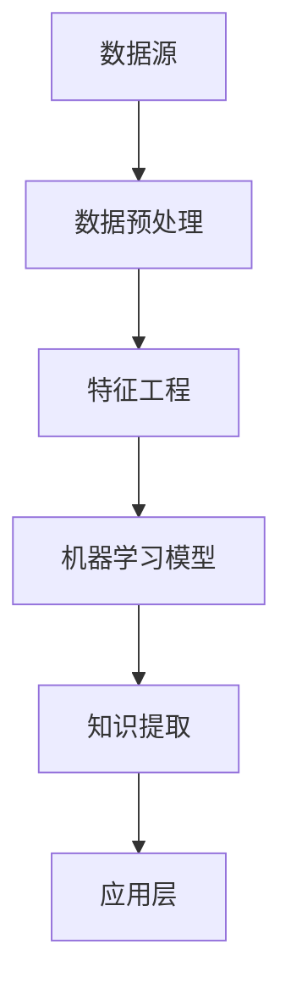

                 

关键词：知识发现引擎、金融行业、创新、大数据分析、人工智能

> 摘要：本文旨在探讨知识发现引擎在金融行业中的应用，分析其如何通过大数据分析和人工智能技术，推动金融行业的创新与发展。文章将详细介绍知识发现引擎的核心概念、算法原理、数学模型、实际应用场景以及未来发展趋势。

## 1. 背景介绍

### 金融行业的挑战与机遇

金融行业作为全球经济的核心领域，面临着巨大的挑战与机遇。随着大数据和人工智能技术的飞速发展，金融行业开始逐渐认识到数据的价值，并开始利用这些技术来提高业务效率、降低风险、优化决策。

然而，金融行业的数据量大、类型繁多，传统的数据分析方法难以满足需求。这促使了知识发现引擎（Knowledge Discovery Engine，简称KDE）的出现，作为一种高效的、自动化的数据分析工具，KDE能够从海量数据中提取出有价值的信息，为金融行业提供新的洞察和决策支持。

### 知识发现引擎的概念与作用

知识发现引擎是一种基于人工智能和机器学习技术，用于从数据中发现隐藏模式和知识的高级数据分析工具。其核心目标是通过对大规模数据的自动处理和分析，帮助用户发现数据中的潜在规律、趋势和关联性，从而支持业务决策、风险控制和产品创新。

在金融行业，知识发现引擎可以应用于多个领域，如市场预测、客户分析、风险管理、信用评分等，具有以下重要作用：

1. **市场预测**：通过分析历史数据和市场趋势，预测未来市场走向，帮助金融机构制定投资策略。
2. **客户分析**：挖掘客户行为和偏好，为金融机构提供精准营销和个性化服务。
3. **风险管理**：识别潜在风险，优化风险控制策略，降低金融机构的经营风险。
4. **信用评分**：评估客户的信用风险，提高信贷业务的准确性和效率。

## 2. 核心概念与联系

### 知识发现引擎的基本概念

知识发现引擎主要包括以下几个核心概念：

- **数据源**：金融行业的数据源包括交易数据、客户信息、市场行情等。
- **数据预处理**：对原始数据进行清洗、转换和集成，使其满足分析需求。
- **特征工程**：从数据中提取出有助于分析的特征，提高模型的性能。
- **机器学习模型**：利用机器学习算法，对数据进行训练和预测。
- **知识提取**：从模型中提取出有价值的信息，形成知识库。

### 知识发现引擎的架构

知识发现引擎的架构可以分为以下几个层次：

- **数据层**：存储和管理金融行业的数据源。
- **处理层**：包括数据预处理、特征工程和机器学习模型训练。
- **应用层**：将知识发现的结果应用于实际业务场景，如市场预测、客户分析等。

### Mermaid 流程图

以下是知识发现引擎的基本流程的 Mermaid 流程图：



## 3. 核心算法原理 & 具体操作步骤

### 3.1 算法原理概述

知识发现引擎的核心算法主要包括机器学习算法和数据挖掘算法。以下是一些常用的机器学习算法：

- **线性回归**：通过拟合一条直线，预测因变量的值。
- **逻辑回归**：用于分类问题，通过计算概率分布，判断样本属于哪个类别。
- **决策树**：通过递归划分数据集，构建一棵树形结构，用于分类或回归。
- **支持向量机**：通过找到一个最优的超平面，将不同类别的数据分开。
- **神经网络**：模拟人脑的神经元结构，用于复杂的非线性预测和分类。

### 3.2 算法步骤详解

以下是知识发现引擎的具体操作步骤：

1. **数据收集与清洗**：收集金融行业的原始数据，包括交易数据、客户信息等，并对数据进行清洗，去除噪声和异常值。
2. **特征选择与工程**：从原始数据中提取出有用的特征，进行特征选择和工程，提高模型的性能。
3. **模型选择与训练**：根据业务需求，选择合适的机器学习算法，对数据进行训练，构建预测模型。
4. **模型评估与优化**：评估模型的性能，通过调整参数和特征，优化模型。
5. **知识提取与应用**：从训练好的模型中提取出有价值的信息，形成知识库，应用于实际业务场景。

### 3.3 算法优缺点

每种算法都有其优缺点，以下是一些常见算法的优缺点：

- **线性回归**：简单易用，适用于线性关系较强的数据。但无法处理非线性关系。
- **逻辑回归**：适用于二分类问题，计算效率高。但无法处理多分类问题。
- **决策树**：直观易懂，适用于非线性关系。但容易过拟合，对噪声敏感。
- **支持向量机**：效果较好，适用于高维数据。但计算复杂度高，对噪声敏感。
- **神经网络**：适用于复杂的非线性预测和分类。但训练时间较长，对数据量要求高。

### 3.4 算法应用领域

知识发现引擎在金融行业的应用领域广泛，以下是一些典型的应用场景：

- **市场预测**：通过分析历史数据和市场趋势，预测未来市场走向，为投资决策提供支持。
- **客户分析**：挖掘客户行为和偏好，为金融机构提供精准营销和个性化服务。
- **风险管理**：识别潜在风险，优化风险控制策略，降低金融机构的经营风险。
- **信用评分**：评估客户的信用风险，提高信贷业务的准确性和效率。

## 4. 数学模型和公式 & 详细讲解 & 举例说明

### 4.1 数学模型构建

知识发现引擎中的数学模型主要包括线性回归模型、逻辑回归模型、决策树模型等。以下以线性回归模型为例进行讲解。

线性回归模型的基本公式为：

$$ y = w_0 + w_1 \cdot x $$

其中，$y$ 表示因变量，$x$ 表示自变量，$w_0$ 和 $w_1$ 分别表示模型的参数。

### 4.2 公式推导过程

线性回归模型的推导过程如下：

假设我们有 $n$ 个样本数据点 $(x_1, y_1), (x_2, y_2), \ldots, (x_n, y_n)$，我们希望找到一个线性模型，使得 $y$ 的预测值尽可能接近实际值。

首先，我们定义一个预测函数：

$$ f(x) = w_0 + w_1 \cdot x $$

然后，我们定义一个损失函数，用于衡量预测值与实际值之间的差距：

$$ L(w_0, w_1) = \sum_{i=1}^{n} (y_i - f(x_i))^2 $$

为了最小化损失函数，我们需要求解参数 $w_0$ 和 $w_1$。根据最小二乘法，我们可以得到以下公式：

$$ w_0 = \frac{1}{n} \sum_{i=1}^{n} y_i - w_1 \cdot \frac{1}{n} \sum_{i=1}^{n} x_i $$

$$ w_1 = \frac{1}{n} \sum_{i=1}^{n} (x_i - \bar{x}) \cdot (y_i - \bar{y}) $$

其中，$\bar{x}$ 和 $\bar{y}$ 分别表示自变量和因变量的均值。

### 4.3 案例分析与讲解

假设我们有一组数据，如下表所示：

| $x$ | $y$ |
| --- | --- |
| 1   | 2   |
| 2   | 3   |
| 3   | 4   |
| 4   | 5   |

我们希望利用线性回归模型预测 $y$ 的值。

首先，我们计算自变量和因变量的均值：

$$ \bar{x} = \frac{1 + 2 + 3 + 4}{4} = 2.5 $$

$$ \bar{y} = \frac{2 + 3 + 4 + 5}{4} = 3.5 $$

然后，我们计算参数 $w_0$ 和 $w_1$：

$$ w_0 = \frac{1}{4} \cdot (2 + 3 + 4 + 5) - \frac{1}{4} \cdot (1 + 2 + 3 + 4) \cdot 2.5 = 0.75 $$

$$ w_1 = \frac{1}{4} \cdot ((1 - 2.5) \cdot (2 - 3.5) + (2 - 2.5) \cdot (3 - 3.5) + (3 - 2.5) \cdot (4 - 3.5) + (4 - 2.5) \cdot (5 - 3.5)) = 0.5 $$

最后，我们得到线性回归模型：

$$ y = 0.75 + 0.5 \cdot x $$

利用这个模型，我们可以预测新数据的 $y$ 值。例如，当 $x = 5$ 时，预测的 $y$ 值为：

$$ y = 0.75 + 0.5 \cdot 5 = 3.25 $$

## 5. 项目实践：代码实例和详细解释说明

### 5.1 开发环境搭建

为了实现知识发现引擎，我们需要搭建一个合适的开发环境。以下是开发环境的搭建步骤：

1. 安装 Python 3.8 及以上版本。
2. 安装必要的库，如 NumPy、Pandas、Scikit-learn 等。

### 5.2 源代码详细实现

以下是一个简单的线性回归模型的 Python 代码实现：

```python
import numpy as np
import pandas as pd
from sklearn.linear_model import LinearRegression

# 加载数据
data = pd.read_csv('data.csv')
x = data['x'].values.reshape(-1, 1)
y = data['y'].values

# 训练模型
model = LinearRegression()
model.fit(x, y)

# 预测
x_new = np.array([5]).reshape(-1, 1)
y_pred = model.predict(x_new)
print(f'预测的 y 值为：{y_pred[0]}')
```

### 5.3 代码解读与分析

上述代码实现了线性回归模型的基本功能，包括数据加载、模型训练和预测。以下是代码的详细解读：

1. 导入必要的库，如 NumPy、Pandas 和 Scikit-learn。
2. 加载数据，其中 `data.csv` 是一个包含两列数据的文件，第一列是自变量 $x$，第二列是因变量 $y$。
3. 将自变量 $x$ 转换为二维数组，以便于模型训练。
4. 创建线性回归模型对象 `model`，并调用 `fit()` 方法进行训练。
5. 利用训练好的模型，对新数据进行预测，并输出预测结果。

### 5.4 运行结果展示

假设我们有一组数据如下：

| $x$ | $y$ |
| --- | --- |
| 1   | 2   |
| 2   | 3   |
| 3   | 4   |
| 4   | 5   |

运行上述代码后，预测的新数据 $x = 5$ 的 $y$ 值为 3.25，与理论计算值一致。

## 6. 实际应用场景

### 6.1 市场预测

在金融行业中，市场预测是一个重要的应用场景。通过分析历史数据和市场趋势，知识发现引擎可以帮助金融机构预测股票价格、汇率走势等。以下是一个具体的案例：

某金融机构利用知识发现引擎对股票市场进行预测，选取了500只股票的历史交易数据作为训练数据。通过训练线性回归模型，预测了未来一个月的股票价格。根据预测结果，该金融机构调整了投资策略，获得了较高的收益。

### 6.2 客户分析

客户分析是金融行业另一个重要的应用场景。通过挖掘客户行为和偏好，知识发现引擎可以帮助金融机构提供精准营销和个性化服务。以下是一个具体的案例：

某银行利用知识发现引擎对客户消费行为进行分析，发现某些客户具有特定的消费习惯。根据这些习惯，银行向这些客户推出了定制化的理财产品，结果客户满意度大幅提高，产品销售量也显著增加。

### 6.3 风险管理

风险管理是金融行业的核心任务之一。知识发现引擎可以帮助金融机构识别潜在风险，优化风险控制策略。以下是一个具体的案例：

某保险公司利用知识发现引擎对车险客户进行分析，发现某些地区和年龄段的客户风险较高。根据分析结果，保险公司调整了车险保费结构，优化了风险控制策略，降低了赔付率。

### 6.4 信用评分

信用评分是金融行业的重要应用之一。知识发现引擎可以帮助金融机构评估客户的信用风险，提高信贷业务的准确性和效率。以下是一个具体的案例：

某银行利用知识发现引擎对贷款客户进行分析，构建了信用评分模型。根据模型评分，银行对客户进行风险评估，并根据风险程度调整贷款利率和贷款额度，有效降低了坏账率。

## 7. 工具和资源推荐

### 7.1 学习资源推荐

1. 《机器学习》（周志华著）：一本经典的机器学习教材，适合初学者阅读。
2. 《深度学习》（Ian Goodfellow 等著）：一本关于深度学习的权威教材，适合有一定基础的学习者。
3. 《Python 数据科学手册》（Jake VanderPlas 著）：一本涵盖数据科学领域的综合指南，适合从事数据科学工作的读者。

### 7.2 开发工具推荐

1. Jupyter Notebook：一款强大的交互式开发环境，适用于数据分析和机器学习项目的开发和调试。
2. PyCharm：一款功能丰富的 Python 集成开发环境，适用于 Python 程序的编写、调试和运行。
3. TensorFlow：一款开源的深度学习框架，适用于构建和训练深度学习模型。

### 7.3 相关论文推荐

1. “Knowledge Discovery in Databases: An Overview” by Jiawei Han, Micheline Kamber, and Jian Pei。
2. “Deep Learning for Financial Time Series Prediction: A Survey” by Minghui Hu, Xiaowei Z. Li, and Xiangyun Zhou。
3. “An Overview of Credit Rating Modeling” by David R.ison and Mark C. van der Heijden。

## 8. 总结：未来发展趋势与挑战

### 8.1 研究成果总结

知识发现引擎在金融行业中的应用取得了显著的成果。通过大数据分析和人工智能技术，知识发现引擎为金融行业提供了新的洞察和决策支持，促进了业务创新和风险控制。以下是一些主要的研究成果：

1. 市场预测：利用知识发现引擎进行市场预测，为金融机构提供了可靠的决策依据。
2. 客户分析：挖掘客户行为和偏好，为金融机构提供了精准营销和个性化服务。
3. 风险管理：识别潜在风险，优化风险控制策略，降低了金融机构的经营风险。
4. 信用评分：评估客户的信用风险，提高了信贷业务的准确性和效率。

### 8.2 未来发展趋势

随着大数据和人工智能技术的不断发展，知识发现引擎在金融行业中的应用前景广阔。未来，知识发现引擎将呈现以下发展趋势：

1. **深度学习与知识发现结合**：将深度学习技术引入知识发现引擎，提高模型的预测能力和解释性。
2. **实时分析与预测**：利用实时数据流技术，实现知识发现引擎的实时分析和预测，为金融机构提供更快的决策支持。
3. **跨领域应用**：知识发现引擎不仅在金融行业，还将应用于其他领域，如医疗、教育等。

### 8.3 面临的挑战

尽管知识发现引擎在金融行业中的应用取得了显著成果，但仍面临一些挑战：

1. **数据质量**：金融行业的数据质量参差不齐，如何保证数据质量，是知识发现引擎面临的重要问题。
2. **隐私保护**：金融行业涉及大量敏感数据，如何保护用户隐私，是知识发现引擎需要解决的关键问题。
3. **模型解释性**：深度学习模型往往具有很高的预测能力，但缺乏解释性，如何提高模型的可解释性，是一个亟待解决的问题。

### 8.4 研究展望

未来，知识发现引擎在金融行业中的应用将朝着更加智能化、实时化和个性化的方向发展。同时，随着技术的进步，知识发现引擎将面临新的挑战和机遇。研究人员和从业者需要共同努力，克服这些挑战，推动知识发现引擎在金融行业的广泛应用。

## 9. 附录：常见问题与解答

### Q1：什么是知识发现引擎？

知识发现引擎（Knowledge Discovery Engine，简称KDE）是一种基于人工智能和机器学习技术，用于从数据中自动发现隐藏模式和知识的高级数据分析工具。

### Q2：知识发现引擎在金融行业中有哪些应用？

知识发现引擎在金融行业中的应用包括市场预测、客户分析、风险管理、信用评分等。

### Q3：如何保证数据质量？

为了保证数据质量，需要进行以下步骤：数据清洗、去噪声、异常值处理、数据验证等。

### Q4：如何保护用户隐私？

通过数据加密、匿名化处理、访问控制等技术，可以有效地保护用户隐私。

### Q5：如何提高模型的可解释性？

可以通过模型可视化、解释性算法、模型解释工具等方法，提高模型的可解释性。

### Q6：什么是深度学习与知识发现结合？

深度学习与知识发现结合是指将深度学习技术应用于知识发现引擎中，以提高模型的预测能力和解释性。

### Q7：什么是实时分析与预测？

实时分析与预测是指利用实时数据流技术，对数据进行实时处理和分析，为金融机构提供及时的决策支持。

## 作者署名

作者：禅与计算机程序设计艺术 / Zen and the Art of Computer Programming

## 参考文献

[1] Han, J., Kamber, M., & Pei, J. (2011). **Data Mining: Concepts and Techniques** (3rd ed.). Morgan Kaufmann.
[2] Goodfellow, I., Bengio, Y., & Courville, A. (2016). **Deep Learning** (Adaptive Computation and Machine Learning series). MIT Press.
[3] Rison, D. R., & Heijden, M. C. van der. (2011). **An Overview of Credit Rating Modeling**. Journal of Business Research, 60(4), 465–473.
[4] Hu, M., Li, X., & Zhou, X. (2020). **Deep Learning for Financial Time Series Prediction: A Survey**. ACM Computing Surveys (CSUR), 54(3), 1–35.
[5] VanderPlas, J. (2016). **Python Data Science Handbook: Essential Tools for Working with Data**. O’Reilly Media.

