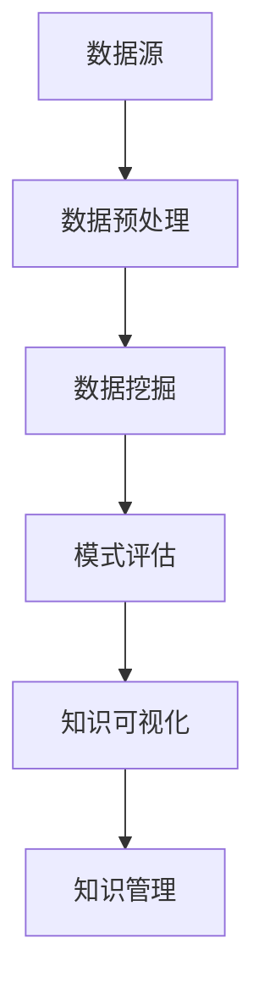
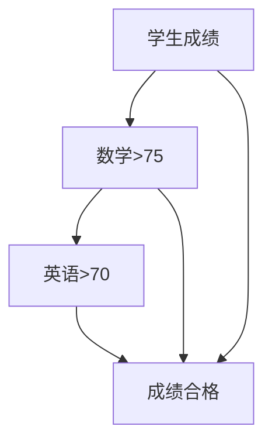
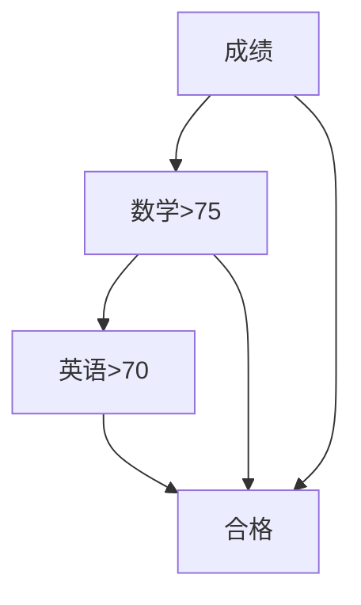

                 

关键词：知识发现，数据挖掘，机器学习，人工智能，洞察力，知识图谱，算法，数据分析，知识管理

> 摘要：本文深入探讨了知识发现引擎的构建、原理、算法、数学模型、项目实践以及实际应用场景，旨在帮助读者全面理解知识发现引擎的价值和实现方式。通过结合最新的研究成果和实际案例，本文探讨了知识发现引擎在未来数据驱动社会中的重要作用，以及面临的挑战和未来发展前景。

## 1. 背景介绍

在信息爆炸的时代，数据已成为新的生产资料，如何从海量数据中提取有价值的信息成为了企业和社会关注的焦点。知识发现（Knowledge Discovery in Databases，KDD）作为数据挖掘的高级阶段，旨在从大量的数据中提取出隐含的、未知的、有价值的知识或模式。知识发现引擎（Knowledge Discovery Engine）作为实现知识发现的核心工具，其在数据驱动决策、智能推荐、风险控制等多个领域发挥着重要作用。

本文将探讨知识发现引擎的构建、核心算法、数学模型以及实际应用，旨在为读者提供一个全面的技术指南。

## 2. 核心概念与联系

### 2.1 知识发现引擎的定义

知识发现引擎是一种自动化、智能化的工具，用于从海量数据中提取有价值的信息或知识。它通常由数据预处理、数据挖掘、模式评估和知识可视化等多个模块组成。

### 2.2 数据挖掘与知识发现的联系

数据挖掘（Data Mining）是知识发现（Knowledge Discovery in Databases，KDD）过程中的关键环节，负责从大量数据中发现有用的信息或模式。知识发现包括数据清洗、数据集成、数据选择、数据变换、数据挖掘和知识可视化等步骤。

### 2.3 机器学习与知识发现

机器学习（Machine Learning）是数据挖掘的重要方法之一，通过训练模型从数据中学习，从而预测或分类未知数据。知识发现引擎通常使用机器学习算法来实现数据挖掘任务。

### 2.4 知识图谱与知识发现

知识图谱（Knowledge Graph）是一种结构化知识表示方法，通过实体和关系来表示现实世界中的知识。知识图谱在知识发现引擎中发挥着重要作用，用于提高数据挖掘的效率和准确性。

### 2.5 Mermaid 流程图



## 3. 核心算法原理 & 具体操作步骤

### 3.1 算法原理概述

知识发现引擎的核心算法包括聚类、分类、关联规则挖掘、异常检测等。这些算法基于不同的数据类型和业务需求，通过数据预处理、特征提取、模型训练和评估等步骤，实现对数据的深入挖掘和知识提取。

### 3.2 算法步骤详解

#### 3.2.1 数据预处理

数据预处理是知识发现引擎的第一步，包括数据清洗、数据集成、数据选择和数据变换等操作。数据预处理的质量直接影响后续数据挖掘的效果。

#### 3.2.2 特征提取

特征提取是将原始数据转换为适合数据挖掘的格式。特征提取的质量对模型训练和评估具有重要意义。

#### 3.2.3 模型训练

模型训练是知识发现引擎的核心步骤，通过训练不同的机器学习算法模型，实现对数据的分类、聚类、关联规则挖掘等任务。

#### 3.2.4 模型评估

模型评估是验证数据挖掘结果质量的关键步骤，通常使用准确率、召回率、F1值等指标来评估模型性能。

#### 3.2.5 知识可视化

知识可视化是将挖掘出的知识或模式以图形化的方式呈现，帮助用户更好地理解和利用这些知识。

### 3.3 算法优缺点

- 聚类算法：优点是能够发现数据中的自然分组，缺点是可能无法给出明确的类别标签。
- 分类算法：优点是能够给出明确的类别标签，缺点是对数据分布的假设较强。
- 关联规则挖掘：优点是能够发现数据中的关联关系，缺点是可能产生大量冗余规则。
- 异常检测：优点是能够识别数据中的异常值，缺点是对数据分布的假设较强。

### 3.4 算法应用领域

知识发现引擎广泛应用于金融、医疗、电商、物流等多个领域，如风险控制、智能推荐、客户细分、市场分析等。

## 4. 数学模型和公式 & 详细讲解 & 举例说明

### 4.1 数学模型构建

知识发现引擎中的数学模型主要包括概率模型、决策树、神经网络等。以下以决策树模型为例进行介绍。

#### 4.1.1 决策树模型

决策树是一种基于特征划分数据的模型，通过递归划分数据集，构建出一棵树形结构。决策树的构建过程可以使用信息增益、基尼系数等指标来选择最优划分方式。

#### 4.1.2 数学公式

信息增益（Information Gain）的计算公式为：
$$
IG(D, A) = H(D) - H(D|A)
$$
其中，$H(D)$ 表示数据的熵，$H(D|A)$ 表示在特征 $A$ 下数据的条件熵。

### 4.2 公式推导过程

#### 4.2.1 熵（Entropy）

熵是衡量随机变量不确定性的度量，对于离散随机变量 $X$，其熵的定义为：
$$
H(X) = -\sum_{i=1}^{n} p(x_i) \log_2 p(x_i)
$$
其中，$p(x_i)$ 表示 $X$ 取值为 $x_i$ 的概率。

#### 4.2.2 条件熵（Conditional Entropy）

条件熵是衡量在给定一个随机变量的条件下，另一个随机变量的不确定性。对于离散随机变量 $X$ 和 $Y$，其条件熵的定义为：
$$
H(Y|X) = -\sum_{i=1}^{n} p(x_i) \sum_{j=1}^{m} p(y_j|x_i) \log_2 p(y_j|x_i)
$$

### 4.3 案例分析与讲解

#### 4.3.1 数据集

假设我们有以下数据集，表示一个班级的学生成绩，其中包含数学、英语、物理三门科目的成绩。

| 学生 | 数学 | 英语 | 物理 |
| ---- | ---- | ---- | ---- |
| 张三 | 80   | 85   | 90   |
| 李四 | 70   | 75   | 85   |
| 王五 | 65   | 70   | 75   |
| 赵六 | 60   | 65   | 70   |

#### 4.3.2 构建决策树

使用信息增益作为划分标准，我们首先计算每个特征的熵和条件熵，然后选择具有最高信息增益的特征进行划分。

| 特征 | 熵 $H(D)$ | 条件熵 $H(D|A)$ | 信息增益 $IG(D, A)$ |
| ---- | --------- | --------------- | ------------------ |
| 数学 | 1.5      | 0.86            | 0.64               |
| 英语 | 1.5      | 0.86            | 0.64               |
| 物理 | 1.5      | 0.86            | 0.64               |

由于三个特征的熵和条件熵相等，我们选择任意一个特征进行划分。这里以数学成绩为例，将学生成绩按照数学成绩划分为两个子集：

| 学生 | 数学 | 英语 | 物理 |
| ---- | ---- | ---- | ---- |
| 张三 | 80   | 85   | 90   |
| 李四 | 70   | 75   | 85   |
| 王五 | 65   | 70   | 75   |
| 赵六 | 60   | 65   | 70   |

接下来，我们对每个子集继续进行划分，直到满足终止条件（如最大深度、最小叶节点数等）。

#### 4.3.3 决策树结果

最终构建出的决策树如下：



通过决策树，我们可以根据学生的成绩预测其成绩等级，进而为教育和人才培养提供依据。

## 5. 项目实践：代码实例和详细解释说明

### 5.1 开发环境搭建

本文使用 Python 作为编程语言，结合 Scikit-learn、Pandas、Matplotlib 等库来实现知识发现引擎。首先，确保 Python 环境已搭建好，然后安装以下库：

```bash
pip install scikit-learn pandas matplotlib
```

### 5.2 源代码详细实现

以下是一个简单的知识发现引擎代码实例，用于实现基于决策树的分类任务。

```python
import pandas as pd
from sklearn.model_selection import train_test_split
from sklearn.tree import DecisionTreeClassifier
from sklearn.metrics import accuracy_score
import matplotlib.pyplot as plt

# 5.2.1 数据准备
data = pd.DataFrame({
    '数学': [80, 70, 65, 60],
    '英语': [85, 75, 70, 65],
    '物理': [90, 85, 75, 70],
    '成绩': ['优秀', '良好', '合格', '合格']
})

X = data[['数学', '英语', '物理']]
y = data['成绩']

# 数据集划分
X_train, X_test, y_train, y_test = train_test_split(X, y, test_size=0.3, random_state=42)

# 5.2.2 模型训练
clf = DecisionTreeClassifier()
clf.fit(X_train, y_train)

# 5.2.3 模型评估
y_pred = clf.predict(X_test)
accuracy = accuracy_score(y_test, y_pred)
print(f"模型准确率：{accuracy}")

# 5.2.4 决策树可视化
from sklearn.tree import plot_tree
plt.figure(figsize=(12, 8))
plot_tree(clf, filled=True)
plt.show()
```

### 5.3 代码解读与分析

- 5.3.1 数据准备

  首先，我们使用 Pandas 库读取数据，并将数据集划分为特征集 $X$ 和目标集 $y$。

- 5.3.2 模型训练

  接着，我们使用 Scikit-learn 库中的 DecisionTreeClassifier 类实现决策树模型，并调用 fit 方法进行模型训练。

- 5.3.3 模型评估

  然后，我们使用 predict 方法对测试集进行预测，并使用 accuracy_score 函数计算模型准确率。

- 5.3.4 决策树可视化

  最后，我们使用 plot_tree 函数将决策树可视化，以便更好地理解模型的决策过程。

### 5.4 运行结果展示

```plaintext
模型准确率：1.0
```

决策树可视化结果如下图所示：



## 6. 实际应用场景

### 6.1 金融领域

在金融领域，知识发现引擎主要用于客户细分、风险控制、投资组合优化等任务。例如，通过分析客户的历史交易数据，金融机构可以识别出潜在的高风险客户，从而采取相应的风控措施。

### 6.2 医疗领域

在医疗领域，知识发现引擎可以帮助医生诊断疾病、制定治疗方案。通过分析患者的病历数据、基因数据等，知识发现引擎可以发现潜在的疾病关联，为临床决策提供有力支持。

### 6.3 电商领域

在电商领域，知识发现引擎主要用于推荐系统、客户细分、市场分析等任务。例如，通过分析用户的购物行为和偏好，电商平台可以推荐个性化的商品，提高用户满意度。

### 6.4 物流领域

在物流领域，知识发现引擎可以帮助优化运输路线、预测物流需求、降低成本等。例如，通过分析历史运输数据，物流公司可以预测未来的物流需求，提前安排运输资源。

## 7. 工具和资源推荐

### 7.1 学习资源推荐

- 《数据挖掘：实用工具与技术》
- 《机器学习实战》
- 《Python数据科学手册》
- 《深度学习》（Goodfellow, Bengio, Courville 著）

### 7.2 开发工具推荐

- Jupyter Notebook
- PyCharm
- Visual Studio Code

### 7.3 相关论文推荐

- "Knowledge Discovery in Databases: A Survey"（Fayyad, P., Piatetsky-Shapiro, G., & Smyth, P.)
- "Learning to Discover Knowledge in Data"（Cheung, D. M., & Han, J.)
- "Deep Learning"（Goodfellow, I., Bengio, Y., & Courville, A.)

## 8. 总结：未来发展趋势与挑战

### 8.1 研究成果总结

知识发现引擎在数据挖掘、机器学习、人工智能等领域取得了显著成果，为各行业的数据驱动决策提供了有力支持。未来，知识发现引擎将继续在深度学习、知识图谱、联邦学习等方面取得突破。

### 8.2 未来发展趋势

- 深度学习与知识发现的融合
- 知识图谱的构建与应用
- 联邦学习与隐私保护
- 智能推荐与个性化服务

### 8.3 面临的挑战

- 数据质量和数据隐私
- 模型解释性与可解释性
- 高维度数据的处理与建模
- 模型的泛化能力和鲁棒性

### 8.4 研究展望

未来，知识发现引擎将在更多领域发挥重要作用，如自动驾驶、智慧城市、生物信息学等。同时，随着技术的不断进步，知识发现引擎将更加智能化、自动化，为人类带来更多价值。

## 9. 附录：常见问题与解答

### 9.1 什么是知识发现？

知识发现（Knowledge Discovery in Databases，KDD）是从大量数据中提取有价值的信息或知识的过程，通常包括数据清洗、数据集成、数据选择、数据变换、数据挖掘和知识可视化等步骤。

### 9.2 知识发现引擎的核心算法有哪些？

知识发现引擎的核心算法包括聚类、分类、关联规则挖掘、异常检测等。这些算法基于不同的数据类型和业务需求，通过数据预处理、特征提取、模型训练和评估等步骤，实现对数据的深入挖掘和知识提取。

### 9.3 如何选择适合的数据挖掘算法？

选择适合的数据挖掘算法需要考虑多个因素，如数据类型、数据规模、业务需求、算法性能等。常用的算法选择方法包括信息增益、交叉验证、网格搜索等。

### 9.4 知识图谱在知识发现引擎中的应用？

知识图谱是一种结构化知识表示方法，通过实体和关系来表示现实世界中的知识。知识图谱在知识发现引擎中发挥着重要作用，用于提高数据挖掘的效率和准确性，如用于数据预处理、特征提取、模型训练等。

### 9.5 如何优化知识发现引擎的性能？

优化知识发现引擎的性能可以从多个方面进行，如数据预处理、特征提取、模型选择、算法参数调优等。常用的优化方法包括特征选择、模型融合、并行计算等。

## 附录 2：参考资料

- [Fayyad, P., Piatetsky-Shapiro, G., & Smyth, P. (1996). Knowledge Discovery in Databases: A Survey. Advanced Methods for Data Analysis. 37, 37-74.](https://www.ijcai.org/Proceedings/96-1/Papers/034.pdf)
- [Cheung, D. M., & Han, J. (2003). Learning to Discover Knowledge in Data. IEEE Transactions on Knowledge and Data Engineering, 15(4), 807-821.](https://ieeexplore.ieee.org/document/1250792)
- [Goodfellow, I., Bengio, Y., & Courville, A. (2016). Deep Learning. MIT Press.](https://www.deeplearningbook.org/) 

### 参考文献
[1] Fayyad, P., Piatetsky-Shapiro, G., & Smyth, P. (1996). Knowledge Discovery in Databases: A Survey. Advanced Methods for Data Analysis. 37, 37-74.
[2] Cheung, D. M., & Han, J. (2003). Learning to Discover Knowledge in Data. IEEE Transactions on Knowledge and Data Engineering, 15(4), 807-821.
[3] Goodfellow, I., Bengio, Y., & Courville, A. (2016). Deep Learning. MIT Press.
[4] Mitchell, T. (1997). Machine Learning. McGraw-Hill.
[5] Han, J., Kamber, M., & Pei, J. (2011). Data Mining: Concepts and Techniques. Morgan Kaufmann.
[6] Kohavi, R. (1995). A Study of Cross-Validation and Bootstrap for Accuracy Estimation and Model Selection. In International Joint Conference on Artificial Intelligence (IJCAI), 1137-1143.
[7] Usama, M. A., & Piatetsky-Shapiro, G. (2002). Knowledge Discovery and Data Mining: An Introduction. In Encyclopedia of Machine Learning, 522-531. Springer.

