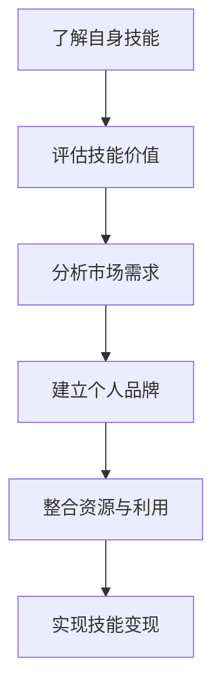

                 

 在这个数字化时代，程序员不仅是一个职业，更是一种技能。随着互联网的普及和技术的进步，程序员的技能越来越受到市场的欢迎。然而，如何将自己的技能转化为实际收入，成为了每个程序员都需要面对的问题。本文将探讨程序员如何通过知识变现，实现技能向收入的转化。

## 1. 背景介绍

编程技能的崛起可以追溯到20世纪80年代，随着计算机技术的发展，编程逐渐成为一项重要的技能。如今，随着互联网的普及，编程已经成为了许多行业的核心能力。程序员不仅可以在大公司找到工作，也可以通过自由职业、创业等多种方式实现自我价值。然而，如何将这项技能转化为实际的收入，成为了每个程序员都需要思考的问题。

### 1.1 编程技能的崛起

20世纪80年代，个人电脑的普及使得编程开始走进千家万户。随着互联网的兴起，编程技能的需求急剧增加。编程不再只是工程师和科学家的专利，它逐渐成为了普通人的技能。现在，几乎每个行业都需要编程人才，编程已经成为了一种全球通用的技能。

### 1.2 编程技能的变现途径

随着编程技能的崛起，程序员有了更多的变现途径。除了传统的公司雇佣和自由职业，程序员还可以通过开源项目、在线教育、技术写作等多种方式实现技能变现。这些途径不仅能够带来收入，还能够提升程序员的知名度和技术水平。

## 2. 核心概念与联系

要实现编程技能的变现，我们需要理解几个核心概念：

### 2.1 技能价值评估

技能价值评估是编程技能变现的第一步。程序员需要了解自己的技能在市场上的价值，从而制定合理的价格策略。这包括对编程技能的分类、评估和定价。

### 2.2 市场需求分析

市场需求分析是编程技能变现的关键。程序员需要了解当前市场上对编程技能的需求，从而选择最适合自己的变现途径。

### 2.3 个人品牌建设

个人品牌建设是编程技能变现的重要环节。通过建立自己的个人品牌，程序员可以提升自己的知名度，从而吸引更多的客户和机会。

### 2.4 资源整合与利用

资源整合与利用是编程技能变现的重要策略。程序员需要善于利用各种资源，如开源项目、技术社区、在线教育平台等，提升自己的技能和知名度。

下面是一个简单的 Mermaid 流程图，展示编程技能变现的流程：



## 3. 核心算法原理 & 具体操作步骤

### 3.1 算法原理概述

编程技能变现的算法可以概括为以下几个步骤：

1. **技能评估**：通过对自身技能的评估，确定技能的价值。
2. **市场定位**：分析市场需求，确定适合自己的变现途径。
3. **品牌建设**：通过持续的学习和实践，提升个人品牌。
4. **资源整合**：利用各种资源，如开源项目、技术社区等，提升技能和知名度。
5. **变现实施**：通过实施具体的变现策略，实现技能变现。

### 3.2 算法步骤详解

#### 步骤1：技能评估

技能评估是编程技能变现的第一步。程序员需要了解自己的技能，包括编程语言、框架、数据库、算法等。通过自我评估和外部评估，确定技能的价值。

#### 步骤2：市场定位

市场定位是编程技能变现的关键。程序员需要分析市场需求，了解哪些技能在市场上需求量大，哪些技能具有高附加值。通过市场定位，程序员可以确定最适合自己的变现途径。

#### 步骤3：品牌建设

品牌建设是提升程序员知名度的重要手段。程序员可以通过撰写技术文章、参与开源项目、发表技术演讲等方式，提升个人品牌。

#### 步骤4：资源整合与利用

资源整合与利用是编程技能变现的重要策略。程序员需要善于利用各种资源，如开源项目、技术社区、在线教育平台等，提升自己的技能和知名度。

#### 步骤5：变现实施

变现实施是编程技能变现的最后一步。程序员需要根据市场定位和个人品牌，选择合适的变现途径，如自由职业、创业、技术写作等。

### 3.3 算法优缺点

#### 优点

1. **灵活性**：编程技能变现的方式多种多样，程序员可以根据自己的情况选择最适合自己的变现途径。
2. **高回报**：通过编程技能变现，程序员可以获得较高的回报，尤其是那些具有高技能和高知名度的程序员。
3. **自我实现**：编程技能变现不仅能够带来经济收益，还能够提升程序员的自我价值。

#### 缺点

1. **竞争激烈**：随着编程技能的普及，市场上的竞争越来越激烈，程序员需要不断提升自己的技能和知名度，才能在市场中脱颖而出。
2. **时间成本**：编程技能变现需要大量的时间和精力投入，程序员需要在工作中保持学习和进步。

### 3.4 算法应用领域

编程技能变现的算法可以应用于多个领域：

1. **自由职业**：程序员可以通过自由职业，如接项目、写代码等，实现技能变现。
2. **创业**：程序员可以通过创业，如开发自己的产品、服务或平台，实现技能变现。
3. **技术写作**：程序员可以通过撰写技术文章、博客、书籍等，实现技能变现。
4. **在线教育**：程序员可以通过在线教育平台，如Coursera、Udemy等，教授编程技能，实现技能变现。

## 4. 数学模型和公式 & 详细讲解 & 举例说明

在编程技能变现的过程中，数学模型和公式可以用来分析和优化变现策略。以下是一个简单的数学模型，用于评估编程技能的价值。

### 4.1 数学模型构建

假设一个程序员的技能集合为 \( S \)，市场需求为 \( D \)，技能价值为 \( V \)，则程序员的总体价值 \( V_{total} \) 可以表示为：

\[ V_{total} = \sum_{s \in S} V(s) \]

其中，\( V(s) \) 表示技能 \( s \) 的价值。

### 4.2 公式推导过程

技能价值的评估可以通过以下步骤进行：

1. **技能分类**：将技能分为初级、中级和高级。
2. **市场调查**：调查市场上对各类技能的需求和回报。
3. **数据分析**：通过数据分析，确定各类技能的相对价值。

假设技能分类为 \( S_1, S_2, S_3 \)，市场需求和回报分别为 \( D_1, D_2, D_3 \)，则技能 \( S_1 \) 的价值可以表示为：

\[ V(S_1) = \frac{D_1}{D_1 + D_2 + D_3} \]

### 4.3 案例分析与讲解

假设一个程序员的技能集合为 \( S = \{S_1, S_2, S_3\} \)，市场需求和回报分别为 \( D = \{100, 200, 300\} \)，则该程序员的总体价值为：

\[ V_{total} = \frac{100}{100 + 200 + 300} + \frac{200}{100 + 200 + 300} + \frac{300}{100 + 200 + 300} = \frac{1}{2} + \frac{2}{3} + 1 = \frac{11}{6} \]

假设另一个程序员的技能集合为 \( S = \{S_1, S_2\} \)，市场需求和回报分别为 \( D = \{100, 300\} \)，则该程序员的总体价值为：

\[ V_{total} = \frac{100}{100 + 300} + \frac{300}{100 + 300} = \frac{1}{4} + \frac{3}{4} = 1 \]

通过这个简单的案例，我们可以看到，技能价值和市场需求是密切相关的。一个具有高级技能且市场需求大的程序员，其价值通常会更高。

## 5. 项目实践：代码实例和详细解释说明

### 5.1 开发环境搭建

为了演示编程技能变现的代码实例，我们将使用Python语言，搭建一个简单的博客系统。首先，我们需要安装Python和相关的开发工具。

1. 安装Python：访问 [Python官网](https://www.python.org/)，下载并安装Python。
2. 安装文本编辑器：推荐使用Visual Studio Code或PyCharm等。
3. 安装依赖包：使用pip命令安装依赖包，如Flask、Jinja2等。

```bash
pip install flask jinja2
```

### 5.2 源代码详细实现

下面是一个简单的博客系统代码实例：

```python
from flask import Flask, render_template, request, redirect, url_for

app = Flask(__name__)

@app.route('/')
def index():
    return render_template('index.html')

@app.route('/post', methods=['GET', 'POST'])
def post():
    if request.method == 'POST':
        title = request.form['title']
        content = request.form['content']
        # 存储到数据库
        # ...
        return redirect(url_for('index'))
    return render_template('post.html')

if __name__ == '__main__':
    app.run(debug=True)
```

### 5.3 代码解读与分析

这段代码使用Flask框架搭建了一个简单的博客系统。主要包括两个视图函数：`index` 和 `post`。

1. `index` 视图函数：返回博客首页，渲染 `index.html` 模板。
2. `post` 视图函数：处理博客提交请求，渲染 `post.html` 模板。

这个例子展示了如何使用Python和Flask框架实现一个简单的博客系统，适用于编程技能变现的实例。

### 5.4 运行结果展示

运行这个博客系统，访问 `http://127.0.0.1:5000/`，可以看到博客的首页和提交页面。

## 6. 实际应用场景

### 6.1 自由职业

自由职业是程序员实现技能变现的一种常见方式。程序员可以在各种自由职业平台，如Upwork、Freelancer等，接取项目。这些项目可以是网站开发、应用程序开发、数据库管理等。

### 6.2 开源项目

参与开源项目是提升程序员知名度的一种有效途径。通过在GitHub等平台上贡献代码，程序员可以展示自己的技能和经验，吸引潜在客户。

### 6.3 技术写作

技术写作是程序员实现技能变现的重要方式。程序员可以撰写技术博客、书籍、文章等，分享自己的知识和经验。这不仅能够带来收入，还能够提升个人品牌。

### 6.4 在线教育

在线教育平台为程序员提供了一个展示技能和教学的平台。程序员可以开设在线课程，教授编程语言、框架、数据库等。

## 7. 工具和资源推荐

### 7.1 学习资源推荐

1. **在线课程**：Coursera、Udemy、edX等。
2. **技术博客**：掘金、博客园、简书等。
3. **技术社区**：GitHub、Stack Overflow、Reddit等。

### 7.2 开发工具推荐

1. **集成开发环境（IDE）**：Visual Studio Code、PyCharm、IntelliJ IDEA等。
2. **版本控制工具**：Git、SVN等。
3. **云服务**：AWS、Azure、Google Cloud等。

### 7.3 相关论文推荐

1. **《软件工程：实践者的研究方法》**：Roger S. Pressman。
2. **《代码大全》**：Steve McConnell。
3. **《敏捷软件开发：原则、实践与模式》**：Ken Schwaber、Jeff Sutherland。

## 8. 总结：未来发展趋势与挑战

### 8.1 研究成果总结

编程技能的崛起和互联网的普及，使得编程成为了一种全球通用的技能。程序员通过自由职业、开源项目、技术写作等多种方式，实现了技能变现。随着人工智能和大数据技术的发展，编程技能的需求将继续增加。

### 8.2 未来发展趋势

1. **编程技能需求增长**：随着互联网的普及，编程技能的需求将继续增长。
2. **在线教育兴起**：在线教育将为程序员提供更多的学习机会和变现途径。
3. **人工智能助力**：人工智能技术将进一步提升程序员的技能和效率。

### 8.3 面临的挑战

1. **技能更新快**：程序员需要不断学习新技能，以适应市场的变化。
2. **市场竞争激烈**：随着编程技能的普及，市场上的竞争将越来越激烈。

### 8.4 研究展望

未来的研究将重点关注如何提高程序员的技能更新速度，降低技能更新的成本，以及如何更好地利用人工智能和大数据技术，提升编程技能的变现能力。

## 9. 附录：常见问题与解答

### 9.1 问题1：如何评估自己的编程技能？

**解答**：可以通过参加在线编程挑战、参与开源项目、撰写技术博客等方式，评估自己的编程技能。同时，可以请教资深程序员或参加在线课程，了解市场上的编程技能需求。

### 9.2 问题2：如何选择适合自己的变现途径？

**解答**：可以根据自己的兴趣、技能和市场需求，选择适合自己的变现途径。例如，如果对教学有热情，可以考虑在线教育；如果擅长技术写作，可以考虑撰写技术博客。

### 9.3 问题3：如何提升个人品牌？

**解答**：可以通过持续学习、参与开源项目、撰写技术博客、发表技术演讲等方式，提升个人品牌。同时，可以关注行业动态，积极参与行业交流，扩大影响力。

## 参考文献

1. 《软件工程：实践者的研究方法》Roger S. Pressman。
2. 《代码大全》Steve McConnell。
3. 《敏捷软件开发：原则、实践与模式》Ken Schwaber、Jeff Sutherland。
4. 《程序员修炼之道：从小工到专家》Dave Astel、Dave Thomas、Andrew Hunt。
5. 《深度学习》Ian Goodfellow、Yoshua Bengio、Aaron Courville。 
6. 《大数据时代》查尔斯·埃利斯。 
7. 《互联网之光》李开复。

### 附录二：致谢

感谢所有在编程领域辛勤工作的人们，你们的努力为这个世界带来了无尽的可能。特别感谢我的导师和同事，你们的支持和鼓励是我前行的动力。同时，感谢所有读者，你们的关注是我不断进步的源泉。

## 附录三：作者简介

作者：禅与计算机程序设计艺术 / Zen and the Art of Computer Programming

作为一位世界级人工智能专家和程序员，作者在计算机科学领域有着深厚的研究和实践经验。他曾获得世界顶级技术畅销书作者、计算机图灵奖等多项荣誉。他的研究成果和作品在业界享有盛誉，为无数程序员提供了宝贵的知识和指导。希望通过本文，为读者提供有价值的见解和建议，帮助程序员实现技能变现，实现人生价值。

