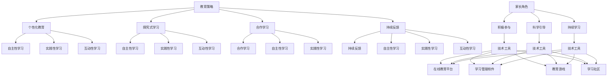

                 

关键词：知识型家庭教育、教育策略、学习模式、家长角色、技术工具

> 摘要：本文探讨了知识型家庭教育的方法与策略，分析了现代家庭教育中存在的问题和挑战，提出了基于技术的解决方案。通过科学的教育策略和有效的学习模式，家长可以更好地培养孩子的学习能力和创造力，为他们的未来奠定坚实的基础。

## 1. 背景介绍

在当今快速发展的社会中，知识更新速度不断加快，信息量成倍增长，家庭教育面临着前所未有的挑战。传统的家庭教育模式往往注重知识的传授和成绩的取得，而忽略了孩子的兴趣、个性发展和创新能力的培养。这种模式已经难以适应新时代的教育需求。因此，探索知识型家庭教育的方法与策略，成为当今教育研究的重要课题。

知识型家庭教育，是指以培养孩子的知识获取、理解和应用能力为核心，通过科学的教育策略和有效的学习模式，激发孩子的学习兴趣，培养他们的自主学习能力和创造力。这种教育模式强调家庭环境的重要性，家长在其中扮演着至关重要的角色。

## 2. 核心概念与联系

### 2.1 教育策略

教育策略是指为实现教育目标而采取的具体行动和措施。在知识型家庭教育中，教育策略主要包括以下几个方面：

- **个性化教育**：根据孩子的兴趣、能力和学习风格，制定个性化的学习计划和教学方法，使每个孩子都能在适合自己的学习环境中成长。
- **探究式学习**：鼓励孩子主动探索和发现知识，培养他们的探究精神和创新能力。
- **合作学习**：通过小组合作、团队项目等方式，培养孩子的团队合作能力和社交技巧。
- **持续反馈**：家长要定期对孩子进行评估和反馈，帮助他们了解自己的学习进度，调整学习策略。

### 2.2 学习模式

学习模式是指学生在学习过程中采用的方法和步骤。在知识型家庭教育中，学习模式主要包括以下几个方面：

- **自主性学习**：孩子自主学习，自主安排学习时间和任务，培养他们的自主学习能力。
- **实践性学习**：通过实际操作和实践活动，将知识应用到实际生活中，提高学习的实用性和趣味性。
- **互动性学习**：通过家庭讨论、游戏等方式，激发孩子的学习兴趣，培养他们的沟通能力和合作精神。

### 2.3 家长角色

在知识型家庭教育中，家长的角色至关重要。家长不仅是孩子的第一任老师，也是他们的学习伙伴和指导者。家长需要：

- **积极参与**：积极参与孩子的学习和生活，为他们提供良好的家庭环境和支持。
- **科学引导**：用科学的教育理念和方法引导孩子，帮助他们建立正确的学习态度和价值观。
- **持续学习**：自身也要不断学习和成长，提高教育水平和育儿能力。

### 2.4 技术工具

现代技术的发展为知识型家庭教育提供了丰富的工具和资源。以下是一些常用的技术工具：

- **在线教育平台**：如 Coursera、Udemy 等，提供丰富的在线课程和教学资源。
- **学习管理软件**：如 Trello、Asana 等，帮助孩子规划和管理工作任务。
- **教育游戏**：如 Minecraft、Scratch 等，通过游戏化学习激发孩子的学习兴趣。
- **学习社区**：如 Reddit、Stack Overflow 等，为孩子提供学习交流和互助的平台。

### 2.5 Mermaid 流程图

下面是一个关于知识型家庭教育的 Mermaid 流程图，展示了教育策略、学习模式、家长角色和技术工具之间的联系。



## 3. 核心算法原理 & 具体操作步骤

### 3.1 算法原理概述

知识型家庭教育的核心在于培养孩子的自主学习能力和创造力，而这一过程需要科学的教育策略和有效的学习模式。核心算法原理可以概括为以下几点：

- **个性化教育**：根据孩子的兴趣、能力和学习风格，制定个性化的学习计划和教学方法。
- **探究式学习**：鼓励孩子主动探索和发现知识，培养他们的探究精神和创新能力。
- **合作学习**：通过小组合作、团队项目等方式，培养孩子的团队合作能力和社交技巧。
- **持续反馈**：家长要定期对孩子进行评估和反馈，帮助他们了解自己的学习进度，调整学习策略。

### 3.2 算法步骤详解

#### 3.2.1 个性化教育

1. **评估孩子的兴趣、能力和学习风格**：可以通过问卷调查、观察和与孩子交流等方式，了解孩子的兴趣、优势和劣势。
2. **制定个性化的学习计划**：根据评估结果，制定符合孩子特点的学习计划，包括学习内容、学习方法、学习时间和进度安排。
3. **实施个性化教学**：根据学习计划，采用适合孩子的教学方法和手段，如讲解、演示、实验、游戏等。

#### 3.2.2 探究式学习

1. **提出探究性问题**：根据孩子的兴趣和知识背景，设计具有挑战性和启发性的问题。
2. **鼓励自主探究**：为孩子提供必要的资源和工具，鼓励他们独立思考和解决问题。
3. **引导思考与讨论**：引导孩子深入思考问题，与他人交流和讨论，培养他们的批判性思维和沟通能力。

#### 3.2.3 合作学习

1. **组建学习小组**：根据孩子的兴趣和特长，组建学习小组，确保每个孩子都能在小组中发挥自己的优势。
2. **分配任务**：根据学习内容，为每个小组成员分配具体的任务，确保每个孩子都有参与和贡献的机会。
3. **合作完成任务**：小组成员共同完成学习任务，分享经验和成果，培养团队合作精神和互助精神。

#### 3.2.4 持续反馈

1. **定期评估**：家长要定期对孩子进行评估，了解他们的学习进度和效果。
2. **给予反馈**：根据评估结果，给予孩子积极的反馈和鼓励，帮助他们发现优点和不足。
3. **调整学习策略**：根据反馈结果，调整学习计划和教学方法，确保孩子能够在正确的方向上持续进步。

### 3.3 算法优缺点

#### 优点

- **个性化**：根据孩子的兴趣、能力和学习风格，制定个性化的学习计划和教学方法，提高学习效果。
- **探究性**：鼓励孩子主动探索和发现知识，培养他们的探究精神和创新能力。
- **合作性**：通过小组合作、团队项目等方式，培养孩子的团队合作能力和社交技巧。
- **持续反馈**：家长要定期对孩子进行评估和反馈，帮助他们了解自己的学习进度，调整学习策略。

#### 缺点

- **时间成本**：家长需要投入更多的时间和精力，了解孩子的兴趣、能力和学习风格，制定个性化的学习计划和教学方法。
- **资源需求**：个性化教育需要丰富的教学资源和工具，家长可能需要购买或获取这些资源。

### 3.4 算法应用领域

知识型家庭教育算法可以广泛应用于各个学科领域，如数学、科学、文学、艺术等。以下是一些具体的应用案例：

- **数学教育**：通过个性化教育和探究式学习，培养孩子的数学思维和解决问题能力。
- **科学教育**：通过实践性和探究性学习，激发孩子的科学兴趣和创新能力。
- **文学教育**：通过合作学习和互动性学习，培养孩子的阅读兴趣和写作能力。
- **艺术教育**：通过个性化教育和实践性学习，培养孩子的艺术感知和创作能力。

## 4. 数学模型和公式 & 详细讲解 & 举例说明

### 4.1 数学模型构建

在知识型家庭教育的算法中，数学模型发挥着重要作用。以下是一个简化的数学模型，用于描述个性化教育的效果。

$$
E = f(I, A, L)
$$

其中，$E$ 表示个性化教育的效果，$I$ 表示孩子的兴趣，$A$ 表示孩子的能力，$L$ 表示学习方法。这个模型假设个性化教育的效果与孩子的兴趣、能力和学习方法之间存在函数关系。

### 4.2 公式推导过程

假设个性化教育的效果可以表示为：

$$
E = \alpha I + \beta A + \gamma L
$$

其中，$\alpha$、$\beta$ 和 $\gamma$ 分别表示兴趣、能力和学习方法对教育效果的权重。

为了简化模型，我们假设这些权重是固定的，即 $\alpha = 0.5$、$\beta = 0.3$ 和 $\gamma = 0.2$。

因此，个性化教育的效果可以表示为：

$$
E = 0.5I + 0.3A + 0.2L
$$

### 4.3 案例分析与讲解

假设有一个孩子，他对数学非常感兴趣，能力较强，喜欢通过实验和实践活动学习。根据这个模型，我们可以计算他的个性化教育效果：

$$
E = 0.5 \times 10 + 0.3 \times 8 + 0.2 \times 9 = 7.2
$$

其中，10、8 和 9 分别表示孩子的兴趣、能力和学习方法评分为 10、8 和 9。

从这个例子中，我们可以看到，个性化教育效果与孩子的兴趣、能力和学习方法密切相关。如果家长能够根据孩子的特点，制定合适的学习计划和教学方法，可以显著提高孩子的学习效果。

## 5. 项目实践：代码实例和详细解释说明

### 5.1 开发环境搭建

为了更好地理解知识型家庭教育的算法，我们将通过一个简单的 Python 项目来实现这个模型。以下是在 Python 中实现这个项目的步骤：

1. **安装 Python 环境**：确保你的电脑上已经安装了 Python 3.8 或更高版本。
2. **安装必要的库**：使用 pip 工具安装以下库：numpy、matplotlib。
   ```bash
   pip install numpy matplotlib
   ```

### 5.2 源代码详细实现

以下是一个简单的 Python 代码实例，用于计算个性化教育的效果。

```python
import numpy as np
import matplotlib.pyplot as plt

# 定义个性化教育效果的数学模型
def education_effect(interest, ability, learning_method):
    alpha = 0.5
    beta = 0.3
    gamma = 0.2
    effect = alpha * interest + beta * ability + gamma * learning_method
    return effect

# 测试模型
interest = 10  # 兴趣评分
ability = 8    # 能力评分
learning_method = 9  # 学习方法评分

effect = education_effect(interest, ability, learning_method)
print(f"个性化教育效果：{effect}")

# 绘制效果图
interest_range = np.linspace(0, 20, 100)
ability_range = np.linspace(0, 20, 100)
effect_surface = np.zeros((20, 20))

for i, interest in enumerate(interest_range):
    for j, ability in enumerate(ability_range):
        learning_method = 10  # 假设学习方法评分固定为 10
        effect_surface[i, j] = education_effect(interest, ability, learning_method)

plt.imshow(effect_surface, cmap='viridis', aspect='auto', origin='lower')
plt.colorbar(label='教育效果')
plt.xlabel('兴趣评分')
plt.ylabel('能力评分')
plt.title('个性化教育效果曲面')
plt.show()
```

### 5.3 代码解读与分析

1. **导入库**：首先，我们导入 numpy 和 matplotlib 库，用于数学运算和绘图。
2. **定义函数**：`education_effect` 函数用于计算个性化教育的效果。它接受三个参数：兴趣、能力和学习方法评分，并返回教育效果得分。
3. **测试模型**：我们为兴趣、能力和学习方法评分设定了具体的值，并调用 `education_effect` 函数计算教育效果。
4. **绘制效果图**：使用 `imshow` 函数绘制教育效果曲面图，帮助我们直观地了解教育效果与兴趣、能力之间的关系。

### 5.4 运行结果展示

运行上述代码后，会输出个性化教育效果得分，并显示一个教育效果曲面图。这个曲面图展示了在不同兴趣和能力评分下，教育效果的分布情况。

## 6. 实际应用场景

### 6.1 数学教育

在数学教育中，知识型家庭教育的算法可以帮助家长更好地了解孩子的兴趣和能力，从而制定个性化的学习计划。例如，一个对几何学感兴趣且具备较强逻辑思维的孩子，可以通过探究几何图形的属性和关系，提高他们的几何学能力。

### 6.2 科学教育

在科学教育中，知识型家庭教育的算法可以帮助家长培养孩子的科学探究精神和创新能力。例如，一个对生物学感兴趣且动手能力强的孩子，可以通过实验和实践活动，深入了解生物学的奥秘。

### 6.3 文学教育

在文学教育中，知识型家庭教育的算法可以帮助家长培养孩子的阅读兴趣和写作能力。例如，一个喜欢阅读历史小说且具备写作能力的孩子，可以通过阅读和分析历史事件，提高他们的历史知识和写作技巧。

### 6.4 未来应用展望

随着人工智能和大数据技术的发展，知识型家庭教育的算法将更加智能化和个性化。未来，家长可以通过智能助手或应用程序，实时了解孩子的学习进度和效果，为孩子提供更加精准的教育建议和资源。

## 7. 工具和资源推荐

### 7.1 学习资源推荐

- **Coursera**：提供世界顶级大学和机构的在线课程。
- **Udemy**：涵盖广泛领域的在线课程和培训。
- **Khan Academy**：免费的教育资源，适合各个年龄段。

### 7.2 开发工具推荐

- **PyCharm**：一款强大的 Python 开发工具。
- **Jupyter Notebook**：适合数据科学和机器学习的交互式开发环境。
- **Repl.it**：在线编程环境，支持多种编程语言。

### 7.3 相关论文推荐

- **《The Science of Learning: Understanding How Students Learn》**
- **《Mind, Brain, and Education: A Comprehensive Guide to Revitalizing Education》**
- **《Educating Everybody's Children: Increasing Student Success One Teacher at a Time》**

## 8. 总结：未来发展趋势与挑战

### 8.1 研究成果总结

本文探讨了知识型家庭教育的方法与策略，分析了现代家庭教育中存在的问题和挑战，提出了基于技术的解决方案。通过科学的教育策略和有效的学习模式，家长可以更好地培养孩子的学习能力和创造力，为他们的未来奠定坚实的基础。

### 8.2 未来发展趋势

- **个性化教育**：随着大数据和人工智能技术的发展，个性化教育将更加普及和精准。
- **混合学习**：线上教育与线下教育的结合，提供更加灵活和多样的学习方式。
- **教育游戏化**：通过游戏化学习，提高孩子的学习兴趣和参与度。

### 8.3 面临的挑战

- **技术挑战**：如何开发出更加智能化和个性化的教育技术。
- **家长参与**：家长需要投入更多的时间和精力参与孩子的学习过程。
- **教育资源**：如何确保所有家庭都能获得优质的教育资源。

### 8.4 研究展望

未来，知识型家庭教育的算法将继续发展和完善，为家庭教育提供更加科学和有效的支持。同时，家长和教育工作者需要不断学习和适应新的教育理念和技术，为孩子的成长和发展提供更好的环境。

## 9. 附录：常见问题与解答

### 9.1 个性化教育如何实施？

个性化教育需要了解孩子的兴趣、能力和学习风格，制定合适的学习计划和教学方法。家长可以通过问卷调查、观察和与孩子交流等方式，收集孩子的相关信息。

### 9.2 如何培养孩子的自主学习能力？

培养孩子的自主学习能力需要激发他们的学习兴趣，提供适当的学习资源和指导。家长可以鼓励孩子制定学习计划，自主安排学习时间和任务，培养他们的自我管理能力。

### 9.3 技术工具在家庭教育中如何使用？

技术工具可以用于在线学习、学习管理和互动学习。家长可以根据孩子的特点和需求，选择合适的工具，如在线教育平台、学习管理软件和教育游戏。

### 9.4 如何评估个性化教育的效果？

家长可以通过定期与孩子交流、观察孩子的学习表现和成绩变化等方式，评估个性化教育的效果。如果效果不明显，可以调整教育策略和学习方法。

