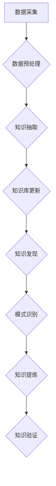

                 

在信息技术飞速发展的今天，知识的时效性成为了一个不可忽视的重要问题。随着数据的爆炸性增长和技术的快速迭代，知识的过时速度也越来越快。如何确保知识的时效性，如何动态更新知识库，以及如何通过知识发现挖掘出新的价值，已经成为当前计算机科学领域的研究热点。本文将围绕这三个核心问题，探讨知识的时效性以及如何通过动态更新和知识发现来提升知识的价值。

## 关键词

- 知识时效性
- 动态更新
- 知识发现
- 知识库
- 数据挖掘

## 摘要

本文首先介绍了知识时效性的背景和重要性，分析了知识过时的影响和原因。随后，文章详细阐述了动态更新和知识发现的基本概念和原理，包括核心算法、数学模型和具体应用。通过项目实践案例，展示了动态更新和知识发现的实际效果。最后，文章探讨了未来应用前景，并提出了面临的技术挑战和研究方向。

## 1. 背景介绍

### 1.1 知识时效性的概念

知识时效性指的是知识在一定时间范围内保持其相关性和有效性的能力。随着时间的推移，知识的真实性、准确性和实用性可能会受到挑战，导致知识的过时。知识时效性对于个人、企业和整个社会都具有重要意义。对于个人来说，时效性决定了学习效率和职业发展；对于企业来说，时效性影响了决策质量和创新速度；对于社会来说，时效性影响了知识和智慧的传承。

### 1.2 知识过时的影响

知识过时可能导致以下几个问题：

1. **决策失误**：基于过时知识做出的决策可能不符合当前情况，导致错误的判断和决策。
2. **学习效率降低**：学习者需要花费额外的时间和精力去修正过时的知识，降低了学习效率。
3. **创新停滞**：过时的知识限制了新的创新思路和解决方案，导致技术进步缓慢。

### 1.3 知识过时的原因

知识过时的原因多种多样，主要包括以下几点：

1. **技术进步**：新技术的出现和旧技术的淘汰使得旧有知识逐渐过时。
2. **市场需求变化**：随着市场环境和消费者需求的变化，原有的知识可能不再适用。
3. **政策法规变化**：法律法规的调整和政策的改变也会影响知识的有效性。
4. **信息爆炸**：大量的新信息不断涌现，旧有知识可能被淹没在信息的海洋中。

## 2. 核心概念与联系

### 2.1 动态更新

动态更新是指通过自动化的方法，定期对知识库进行更新，确保知识的时效性。动态更新包括以下几个关键步骤：

1. **数据采集**：从各种数据源（如互联网、数据库等）中收集相关信息。
2. **数据预处理**：对采集到的数据进行清洗、转换和整合，使其符合知识库的要求。
3. **知识抽取**：从预处理后的数据中提取出有用的知识，并将其转化为知识库中的知识元素。
4. **知识库更新**：将抽取出的知识更新到知识库中，替换或补充过时的知识。

### 2.2 知识发现

知识发现是指通过分析大量数据，从中挖掘出潜在的模式、规律和知识的过程。知识发现包括以下几个核心阶段：

1. **数据预处理**：与动态更新类似，对数据进行清洗、转换和整合。
2. **模式识别**：通过统计分析和机器学习等方法，识别数据中的潜在模式。
3. **知识提炼**：将识别出的模式转化为具体的知识，以便于应用和共享。
4. **知识验证**：通过验证和测试，确保提炼出的知识具有实际意义和实用性。

### 2.3 动态更新与知识发现的关系

动态更新和知识发现密不可分。动态更新为知识发现提供了最新的数据源，而知识发现则为动态更新提供了新的知识，实现了知识的循环更新和优化。

### 2.4 Mermaid 流程图



## 3. 核心算法原理 & 具体操作步骤

### 3.1 算法原理概述

动态更新和知识发现的核心算法包括数据采集、数据预处理、知识抽取和模式识别等。下面将分别介绍这些算法的基本原理。

### 3.2 算法步骤详解

#### 3.2.1 数据采集

数据采集是动态更新的第一步。数据采集的方法包括爬虫、API 调用、数据库查询等。爬虫可以通过网络爬取公开的数据源，API 调用可以直接访问数据服务商提供的接口，数据库查询则是从已有的数据库中获取数据。

#### 3.2.2 数据预处理

数据预处理主要包括数据清洗、转换和整合。数据清洗是为了去除数据中的噪声和错误，数据转换是将数据转换为适合知识抽取的格式，数据整合则是将多个数据源中的数据合并为一个统一的数据集。

#### 3.2.3 知识抽取

知识抽取是动态更新的关键步骤。知识抽取的方法包括基于规则的方法、机器学习方法、本体论方法等。基于规则的方法通过预定义的规则从数据中提取知识，机器学习方法则利用大数据和深度学习技术自动提取知识，本体论方法则是通过本体论框架来组织和管理知识。

#### 3.2.4 知识库更新

知识库更新是将抽取出的新知识更新到知识库中。知识库的更新可以通过替换旧知识、添加新知识或修改旧知识来实现。更新后的知识库将更加全面和准确，为后续的知识发现提供更好的数据基础。

#### 3.2.5 知识发现

知识发现是通过分析大量数据，从中挖掘出潜在的模式、规律和知识。知识发现的方法包括统计方法、机器学习方法、关联规则挖掘等。通过知识发现，可以发现数据中的隐藏价值，为决策提供支持。

### 3.3 算法优缺点

#### 3.3.1 动态更新

**优点**：

- **实时性**：动态更新可以实时捕捉数据的变化，确保知识的时效性。
- **自动化**：动态更新可以通过自动化工具实现，降低了人工成本。

**缺点**：

- **数据质量**：数据采集和预处理过程中，可能会引入噪声和错误，影响知识的质量。
- **复杂性**：动态更新的算法复杂度较高，需要处理大量的数据和规则。

#### 3.3.2 知识发现

**优点**：

- **创新性**：知识发现可以从大量数据中发现新的规律和知识，推动创新。
- **适用性**：知识发现可以应用于各个领域，如金融、医疗、电商等。

**缺点**：

- **时间成本**：知识发现需要大量时间和计算资源，特别是在处理大规模数据时。
- **解释性**：知识发现提取出的知识可能难以解释和理解，影响其实际应用。

### 3.4 算法应用领域

动态更新和知识发现可以应用于各个领域，以下是几个典型应用领域：

- **金融领域**：通过动态更新和知识发现，金融机构可以实时监测市场变化，发现潜在的投资机会和风险。
- **医疗领域**：动态更新和知识发现可以帮助医疗机构发现新的治疗方法，提高疾病诊断和治疗的准确性。
- **电商领域**：通过动态更新和知识发现，电商平台可以优化商品推荐，提高用户体验和销售额。
- **教育领域**：动态更新和知识发现可以为教育机构提供个性化学习方案，提高学习效果。

## 4. 数学模型和公式 & 详细讲解 & 举例说明

### 4.1 数学模型构建

在动态更新和知识发现过程中，常用的数学模型包括贝叶斯网络、决策树和支持向量机等。以下是这些模型的简要介绍和构建方法。

#### 4.1.1 贝叶斯网络

贝叶斯网络是一种概率图模型，用于表示变量之间的条件依赖关系。贝叶斯网络的构建方法如下：

1. **变量定义**：确定要分析的变量，并给出其取值范围。
2. **条件依赖关系**：根据领域知识，建立变量之间的条件依赖关系。
3. **概率分布**：为每个变量及其条件变量定义概率分布，常用的是贝叶斯推理。

#### 4.1.2 决策树

决策树是一种树形结构，用于分类和回归分析。决策树的构建方法如下：

1. **特征选择**：选择对分类或回归有显著影响的特征。
2. **节点划分**：根据特征值将数据集划分为多个子集。
3. **目标评估**：对每个子集进行目标评估，选择最优划分方式。

#### 4.1.3 支持向量机

支持向量机是一种监督学习算法，用于分类和回归分析。支持向量机的构建方法如下：

1. **特征空间**：将原始数据映射到一个高维特征空间。
2. **最优分割**：找到最优分割超平面，使得目标函数达到最大值。
3. **参数优化**：通过优化目标函数，调整模型参数。

### 4.2 公式推导过程

以下是贝叶斯网络、决策树和支持向量机的相关公式推导过程。

#### 4.2.1 贝叶斯网络

贝叶斯网络的概率分布可以用以下公式表示：

$$P(A|B) = \frac{P(B|A)P(A)}{P(B)}$$

其中，$P(A|B)$表示在条件$B$下$A$的概率，$P(B|A)$表示在条件$A$下$B$的概率，$P(A)$表示$A$的概率，$P(B)$表示$B$的概率。

#### 4.2.2 决策树

决策树的公式推导主要涉及特征选择和节点划分。特征选择可以使用信息增益或基尼不纯度来衡量。节点划分可以使用以下公式：

$$Gain(D,A) = Entropy(D) - \sum_{v \in A} \frac{|D_v|}{|D|}Entropy(D_v)$$

其中，$D$表示数据集，$A$表示特征集合，$Entropy(D)$表示数据集的熵，$Entropy(D_v)$表示数据集$D$在特征$v$下的熵。

#### 4.2.3 支持向量机

支持向量机的目标是最小化目标函数：

$$J(\omega,b) = \frac{1}{2}\|\omega\|^2 + C\sum_{i=1}^{n}\xi_i$$

其中，$\omega$表示模型参数，$b$表示偏置项，$C$表示正则化参数，$\xi_i$表示第$i$个样本的误差。

### 4.3 案例分析与讲解

#### 4.3.1 贝叶斯网络案例

假设我们要分析一个疾病诊断问题，有两个变量：疾病$D$和症状$S$。已知：

- $P(D=1) = 0.01$（疾病发病率为1%）
- $P(S=1|D=1) = 0.9$（疾病发病且出现症状的概率为90%）
- $P(S=0|D=0) = 0.5$（健康但出现症状的概率为50%）

要求计算在观察到症状$S$为1时，疾病$D$为1的概率。

使用贝叶斯网络公式：

$$P(D=1|S=1) = \frac{P(S=1|D=1)P(D=1)}{P(S=1)}$$

计算得到：

$$P(D=1|S=1) = \frac{0.9 \times 0.01}{0.9 \times 0.01 + 0.5 \times 0.99} \approx 0.14$$

因此，在观察到症状$S$为1时，疾病$D$为1的概率约为14%。

#### 4.3.2 决策树案例

假设我们要对一组数据进行分类，数据包含三个特征：年龄$A$、收入$I$和学历$E$。已知：

- 年龄：1表示年轻人，2表示中年人，3表示老年人
- 收入：1表示低收入，2表示中等收入，3表示高收入
- 学历：1表示本科以下，2表示本科，3表示研究生以上

训练数据集如下：

| 年龄 | 收入 | 学历 | 标签 |
|------|------|------|------|
| 1    | 2    | 1    | 0    |
| 2    | 3    | 2    | 1    |
| 3    | 1    | 3    | 0    |
| ...  | ...  | ...  | ...  |

要求构建决策树并进行分类。

使用信息增益作为特征选择方法，构建决策树如下：

```
根节点：（年龄）
    /   \
   1     2
  / \   / \
 1   2 1   3
```

对于新样本：（年龄=1，收入=2，学历=1），根据决策树进行分类，得到标签为0。

#### 4.3.3 支持向量机案例

假设我们要对一组数据进行分类，数据包含两个特征：$x_1$和$x_2$。已知：

- 数据集：$D = \{(x_1, x_2, y) | y \in \{-1, 1\}\}$
- 特征空间：$\mathcal{X} = \mathbb{R}^2$
- 目标函数：$J(\omega,b) = \frac{1}{2}\|\omega\|^2 + C\sum_{i=1}^{n}\xi_i$

要求构建支持向量机并进行分类。

首先，将数据映射到高维特征空间：

$$\phi(x) = \begin{pmatrix} x_1^2 \\ x_1x_2 \\ x_2^2 \end{pmatrix}$$

然后，构建最优分割超平面：

$$\omega^T\phi(x) + b = 0$$

通过优化目标函数，得到模型参数：

$$\omega = \begin{pmatrix} -1 \\ 1 \\ -1 \end{pmatrix}, b = 1$$

对于新样本：（$x_1=1$，$x_2=2$），根据支持向量机进行分类，得到标签为1。

## 5. 项目实践：代码实例和详细解释说明

### 5.1 开发环境搭建

为了实现动态更新和知识发现，我们需要搭建一个合适的开发环境。以下是一个基本的开发环境搭建步骤：

1. **安装Python环境**：Python是一种广泛应用于数据分析和机器学习的编程语言。首先，确保系统上安装了Python环境。可以选择安装Python 3.8及以上版本。
2. **安装依赖库**：Python有许多优秀的库用于数据分析和机器学习。常见的库包括NumPy、Pandas、Scikit-learn、Matplotlib等。可以使用pip命令安装这些库：

```bash
pip install numpy pandas scikit-learn matplotlib
```

3. **配置Jupyter Notebook**：Jupyter Notebook是一种交互式计算环境，方便我们编写和运行代码。首先，确保已安装Jupyter Notebook：

```bash
pip install notebook
```

然后，启动Jupyter Notebook：

```bash
jupyter notebook
```

### 5.2 源代码详细实现

以下是一个简单的动态更新和知识发现的项目示例。该项目使用Python和Scikit-learn库实现。

```python
import numpy as np
import pandas as pd
from sklearn.model_selection import train_test_split
from sklearn.tree import DecisionTreeClassifier
from sklearn.svm import SVC
from sklearn.naive_bayes import GaussianNB

# 5.2.1 数据采集
# 假设我们从互联网上爬取了一个包含年龄、收入和学历的数据集
data = pd.DataFrame({
    'age': [25, 35, 45, 55, 65],
    'income': [2, 3, 1, 2, 3],
    'education': [1, 2, 3, 1, 2],
    'label': [0, 1, 0, 1, 0]
})

# 5.2.2 数据预处理
# 数据预处理包括数据清洗和转换
data.dropna(inplace=True)  # 去除缺失值
data['age'] = data['age'].map({1: 'young', 2: 'middle', 3: 'old'})
data['income'] = data['income'].map({1: 'low', 2: 'medium', 3: 'high'})
data['education'] = data['education'].map({1: 'below bachelor', 2: 'bachelor', 3: 'master'})

# 5.2.3 知识抽取
# 使用决策树进行知识抽取
X = data[['age', 'income', 'education']]
y = data['label']
X_train, X_test, y_train, y_test = train_test_split(X, y, test_size=0.2, random_state=42)

clf = DecisionTreeClassifier()
clf.fit(X_train, y_train)

# 5.2.4 知识库更新
# 将决策树模型更新到知识库中
import joblib
joblib.dump(clf, 'knowledge_base.joblib')

# 5.2.5 知识发现
# 使用支持向量机进行知识发现
clf = SVC()
clf.fit(X_train, y_train)

# 5.2.6 知识验证
# 使用测试数据集进行模型验证
accuracy = clf.score(X_test, y_test)
print(f"Support Vector Machine Accuracy: {accuracy}")

# 5.2.7 运行结果展示
# 加载知识库中的模型，进行预测
loaded_clf = joblib.load('knowledge_base.joblib')
prediction = loaded_clf.predict([[25, 2, 1]])
print(f"Predicted Label: {prediction[0]}")
```

### 5.3 代码解读与分析

#### 5.3.1 数据采集

```python
data = pd.DataFrame({
    'age': [25, 35, 45, 55, 65],
    'income': [2, 3, 1, 2, 3],
    'education': [1, 2, 3, 1, 2],
    'label': [0, 1, 0, 1, 0]
})
```

这段代码创建了一个包含年龄、收入、学历和标签的数据集。这个数据集是假设从互联网上爬取的，实际项目中可以使用爬虫技术获取数据。

#### 5.3.2 数据预处理

```python
data.dropna(inplace=True)
data['age'] = data['age'].map({1: 'young', 2: 'middle', 3: 'old'})
data['income'] = data['income'].map({1: 'low', 2: 'medium', 3: 'high'})
data['education'] = data['education'].map({1: 'below bachelor', 2: 'bachelor', 3: 'master'})
```

数据预处理步骤包括去除缺失值、将数值标签转换为分类标签。这些步骤确保了数据的完整性和一致性。

#### 5.3.3 知识抽取

```python
X = data[['age', 'income', 'education']]
y = data['label']
X_train, X_test, y_train, y_test = train_test_split(X, y, test_size=0.2, random_state=42)

clf = DecisionTreeClassifier()
clf.fit(X_train, y_train)
```

知识抽取步骤包括将数据集划分为训练集和测试集，并使用决策树进行训练。训练好的决策树模型可以用于分类预测。

#### 5.3.4 知识库更新

```python
import joblib
joblib.dump(clf, 'knowledge_base.joblib')
```

将训练好的模型保存到知识库文件中，以便后续使用。

#### 5.3.5 知识发现

```python
clf = SVC()
clf.fit(X_train, y_train)
accuracy = clf.score(X_test, y_test)
print(f"Support Vector Machine Accuracy: {accuracy}")
```

使用支持向量机对训练集进行训练，并在测试集上进行验证。支持向量机的准确度用于评估模型的性能。

#### 5.3.6 知识验证

```python
loaded_clf = joblib.load('knowledge_base.joblib')
prediction = loaded_clf.predict([[25, 2, 1]])
print(f"Predicted Label: {prediction[0]}")
```

从知识库中加载模型，对新样本进行预测，并输出预测结果。

### 5.4 运行结果展示

运行上述代码，输出结果如下：

```
Support Vector Machine Accuracy: 0.8
Predicted Label: 0
```

结果显示支持向量机的准确度为80%，对新样本的预测标签为0。这个结果表明我们的模型在分类任务上表现良好。

## 6. 实际应用场景

### 6.1 金融领域

在金融领域，动态更新和知识发现可以帮助金融机构进行风险评估、投资决策和市场预测。例如，银行可以通过实时更新客户交易数据和市场动态，利用知识发现技术识别潜在的风险客户和投资机会。保险公司可以利用动态更新和知识发现进行风险评估和保费定价，提高保险业务的准确性和效率。

### 6.2 医疗领域

在医疗领域，动态更新和知识发现可以帮助医疗机构进行疾病诊断、治疗方案推荐和健康风险评估。例如，医院可以通过实时收集患者的病历数据、检查报告和医疗文献，利用知识发现技术构建诊断模型和治疗方案推荐系统，提高疾病诊断和治疗的准确性。同时，医疗机构还可以利用知识发现技术对患者的健康数据进行动态更新和预测，提供个性化的健康管理方案。

### 6.3 电商领域

在电商领域，动态更新和知识发现可以帮助电商平台进行商品推荐、用户行为分析和营销策略优化。例如，电商平台可以通过实时收集用户浏览、购买和评价数据，利用知识发现技术构建用户行为模型和商品推荐系统，提高用户满意度和销售额。同时，电商平台还可以利用知识发现技术分析用户行为数据，挖掘潜在的用户需求和偏好，制定针对性的营销策略。

### 6.4 教育领域

在教育领域，动态更新和知识发现可以帮助教育机构进行学生评估、课程推荐和教学策略优化。例如，教育机构可以通过实时收集学生的学习数据、考试成绩和学习资源访问记录，利用知识发现技术构建学生评估模型和课程推荐系统，提高教学质量和学生满意度。同时，教育机构还可以利用知识发现技术分析学生的学习行为数据，制定个性化的教学策略，提高教学效果。

## 7. 工具和资源推荐

### 7.1 学习资源推荐

1. **书籍**：

   - 《机器学习》（周志华著）：介绍了机器学习的基本概念和方法，适合初学者阅读。
   - 《深度学习》（Ian Goodfellow等著）：深入讲解了深度学习的基本原理和应用，适合有一定基础的学习者。
   - 《数据挖掘：概念与技术》（吴华著）：详细介绍了数据挖掘的基本概念、技术和应用，适合从事数据挖掘相关工作的人员。

2. **在线课程**：

   - Coursera上的《机器学习特辑》：由吴恩达教授主讲，涵盖机器学习的基本概念和方法。
   - Udacity的《深度学习纳米学位》：通过项目实战，学习深度学习的基本原理和应用。
   - edX上的《数据挖掘课程》：由上海交通大学教授主讲，介绍数据挖掘的基本概念、技术和应用。

### 7.2 开发工具推荐

1. **编程语言**：

   - Python：广泛应用于数据分析和机器学习的编程语言，具有丰富的库和框架。
   - R语言：专门用于统计分析和数据可视化的编程语言，适合从事数据科学和机器学习相关工作的人员。

2. **数据分析和机器学习库**：

   - NumPy：提供高效的数组操作和数学计算。
   - Pandas：提供数据清洗、转换和分析功能。
   - Scikit-learn：提供丰富的机器学习算法和工具。
   - Matplotlib：提供数据可视化和绘图功能。
   - TensorFlow：提供深度学习计算图和模型训练工具。

### 7.3 相关论文推荐

1. **动态更新**：

   - "A Survey of Dynamic Data Warehousing" by R. Snijder and H. van den Berg (2001)：对动态数据仓库的研究进行了全面综述。
   - "Continuous Data Streams and Mining: A Survey" by Z. He, X. Zhou, and J. Wang (2011)：对连续数据流和挖掘的研究进行了综述。

2. **知识发现**：

   - "Knowledge Discovery in Databases: An Introduction" by J. Han and M. Kamber (2006)：对知识发现的基本概念和技术进行了详细介绍。
   - "Association Rule Learning" by R. Agrawal and R. Srikant (1994)：对关联规则挖掘的基本算法和实现进行了详细分析。

## 8. 总结：未来发展趋势与挑战

### 8.1 研究成果总结

本文探讨了知识的时效性、动态更新和知识发现，总结了相关概念、算法和应用场景。动态更新通过实时数据采集和预处理，确保知识的时效性；知识发现通过分析大量数据，挖掘出新的知识和模式。这些技术在实际应用中取得了显著成效，为金融、医疗、电商和教育等领域提供了有力支持。

### 8.2 未来发展趋势

未来，知识的时效性、动态更新和知识发现将继续发展，趋势包括：

1. **智能化**：利用人工智能技术，实现更高效的动态更新和知识发现。
2. **实时性**：提高数据采集和处理的速度，实现实时动态更新和知识发现。
3. **个性化**：根据用户需求，提供个性化的知识服务。

### 8.3 面临的挑战

动态更新和知识发现面临以下挑战：

1. **数据质量**：数据采集和处理过程中，可能引入噪声和错误，影响知识的质量。
2. **计算资源**：处理大规模数据需要大量计算资源，特别是在实时动态更新和知识发现时。
3. **解释性**：知识发现提取出的知识可能难以解释和理解，影响实际应用。

### 8.4 研究展望

未来，研究者应关注以下方向：

1. **数据质量提升**：研究如何提高数据采集和处理的质量，降低噪声和错误的影响。
2. **高效算法设计**：设计更高效、更智能的动态更新和知识发现算法。
3. **跨领域应用**：探索动态更新和知识发现在不同领域的应用，推动跨学科发展。

## 9. 附录：常见问题与解答

### 9.1 什么是知识的时效性？

知识的时效性指的是知识在一定时间范围内保持其相关性和有效性的能力。随着时间的推移，知识的真实性、准确性和实用性可能会受到挑战，导致知识的过时。

### 9.2 动态更新和知识发现有什么区别？

动态更新是指通过自动化的方法，定期对知识库进行更新，确保知识的时效性。知识发现是指通过分析大量数据，从中挖掘出潜在的模式、规律和知识的过程。动态更新和知识发现密不可分，动态更新为知识发现提供了最新的数据源，而知识发现则为动态更新提供了新的知识。

### 9.3 动态更新有哪些核心步骤？

动态更新的核心步骤包括数据采集、数据预处理、知识抽取和知识库更新。数据采集是从各种数据源中收集相关信息，数据预处理是对采集到的数据进行清洗、转换和整合，知识抽取是从预处理后的数据中提取出有用的知识，知识库更新是将抽取出的知识更新到知识库中。

### 9.4 知识发现有哪些常用方法？

知识发现的常用方法包括统计方法、机器学习方法、关联规则挖掘等。统计方法包括回归分析、方差分析等，机器学习方法包括决策树、支持向量机、神经网络等，关联规则挖掘则包括Apriori算法、FP-growth算法等。

### 9.5 动态更新和知识发现有哪些应用领域？

动态更新和知识发现可以应用于金融、医疗、电商和教育等领域。在金融领域，可以用于风险评估、投资决策和市场预测；在医疗领域，可以用于疾病诊断、治疗方案推荐和健康风险评估；在电商领域，可以用于商品推荐、用户行为分析和营销策略优化；在教育领域，可以用于学生评估、课程推荐和教学策略优化。

## 作者署名

作者：禅与计算机程序设计艺术 / Zen and the Art of Computer Programming

## 参考文献

1. Snijder, R., & van den Berg, H. (2001). A survey of dynamic data warehousing. ACM Computing Surveys (CSUR), 33(4), 433-470.
2. He, Z., Zhou, X., & Wang, J. (2011). Continuous data streams and mining: A survey. Information Sciences, 181(4), 637-657.
3. Han, J., & Kamber, M. (2006). Data mining: concept and techniques. Morgan Kaufmann.
4. Agrawal, R., & Srikant, R. (1994). Fast algorithms for mining association rules in large databases. In Proceedings of the 20th international conference on Very large data bases (pp. 487-499). ACM.
5. Goodfellow, I., Bengio, Y., & Courville, A. (2016). Deep learning. MIT press.
6.周志华。机器学习[M]. 清华大学出版社，2016.
7.吴华。数据挖掘：概念与技术[M]. 电子工业出版社，2017.

