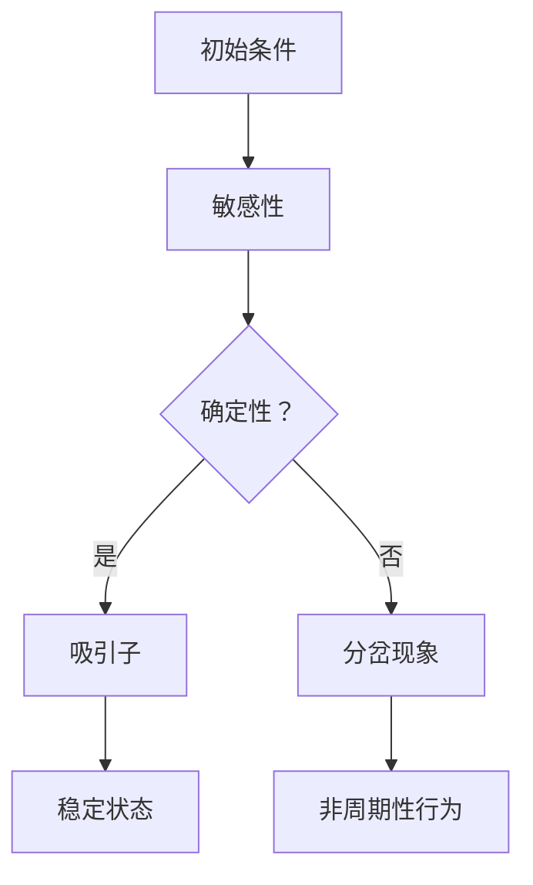

                 

关键词：知识的混沌理论，小变化，巨大影响，IT领域，复杂性科学

> 摘要：本文从知识的混沌理论出发，探讨小变化如何引发巨大影响，特别是在IT领域的应用。通过对核心概念、算法原理、数学模型以及实践应用的深入分析，揭示出知识混沌理论在复杂系统设计和优化中的重要性。

## 1. 背景介绍

混沌理论是20世纪末发展起来的一门跨学科科学，主要研究确定性系统中出现的不可预测性和复杂行为。混沌现象具有以下几个特征：首先是敏感性，即系统对初始条件具有极高的敏感度，微小差异可能导致完全不同的结果；其次是长期行为的不确定性，即使系统状态在长时间内保持某种程度的一致性，但未来的演变路径却不可预测；最后是非周期性，系统的行为既不是周期性的，也不是随机的，而是呈现出一种貌似随机但内在规律的结构。

在IT领域，混沌理论的应用逐渐得到重视。随着信息技术的迅猛发展，复杂系统的设计和优化成为了一个关键问题。混沌理论为我们提供了一种全新的视角，通过揭示小变化引发的巨大影响，可以帮助我们更好地理解系统的内在规律，从而提高系统的鲁棒性和适应性。

## 2. 核心概念与联系

### 2.1 混沌理论的基本概念

混沌理论的核心概念包括：初始条件敏感性、长期行为的确定性、吸引子和分岔现象。初始条件敏感性指的是系统对初始条件的微小改变会引发完全不同的演化路径；长期行为的确定性则意味着虽然系统在长期内表现出随机性，但整体上仍然遵循某种规律；吸引子是系统最终趋于稳定的状态，而分岔现象则是指系统状态在某一临界点发生突变。

### 2.2 混沌理论与IT领域的联系

在IT领域，混沌理论的应用主要体现在以下几个方面：

- **加密技术**：混沌理论提供了丰富的加密算法，通过将初始条件敏感性应用于加密过程，可以大大提高数据的安全性。

- **网络安全**：混沌理论可以帮助我们设计出更加安全的网络安全系统，通过引入混沌特性，使网络攻击者难以预测系统的行为。

- **分布式系统**：在分布式系统中，节点之间的通信和协作具有高度的复杂性。混沌理论为我们提供了一种新的方法来理解和优化分布式系统的性能。

- **人工智能**：在人工智能领域，混沌理论可以用于生成更加复杂和多样化的数据集，从而提高模型的泛化能力。

### 2.3 Mermaid 流程图



## 3. 核心算法原理 & 具体操作步骤

### 3.1 算法原理概述

混沌理论的核心算法包括李雅普诺夫指数计算、奇异吸引子分析和混沌映射。李雅普诺夫指数用于衡量系统对初始条件的敏感性，正指数表示系统不稳定，负指数表示系统稳定。奇异吸引子是系统在长期演化过程中最终趋于的状态，其内部结构复杂但稳定。混沌映射则是将系统状态映射到不同的空间，从而实现复杂的动力学行为。

### 3.2 算法步骤详解

1. **计算李雅普诺夫指数**：通过数值方法计算系统的李雅普诺夫指数，判断系统的稳定性。

2. **寻找奇异吸引子**：通过数值方法或理论分析，寻找系统的奇异吸引子。

3. **设计混沌映射**：根据系统的特性，设计合适的混沌映射，以实现复杂的动力学行为。

### 3.3 算法优缺点

**优点**：

- **高安全性**：混沌映射具有高度的敏感性，可以用于加密和数据安全。

- **复杂性**：混沌理论为复杂系统的分析和优化提供了强有力的工具。

**缺点**：

- **计算复杂度**：混沌理论的计算过程通常较为复杂，需要大量的计算资源。

- **难以预测**：混沌现象的长期行为难以预测，可能带来不可控的风险。

### 3.4 算法应用领域

- **加密技术**：混沌映射在加密算法中具有广泛的应用，如AES加密算法中的混沌特性。

- **网络安全**：混沌理论可以用于设计更加安全的网络安全系统。

- **分布式系统**：混沌特性可以帮助优化分布式系统的性能。

- **人工智能**：混沌理论可以用于生成复杂的数据集，提高模型的泛化能力。

## 4. 数学模型和公式 & 详细讲解 & 举例说明

### 4.1 数学模型构建

混沌系统的数学模型通常由以下几部分组成：

1. **状态方程**：描述系统状态的动态变化。
2. **初始条件**：确定系统初始的状态。
3. **参数**：控制系统的动态行为。

### 4.2 公式推导过程

以洛伦兹系统为例，其状态方程为：

$$
\begin{cases}
\frac{dx}{dt} = \sigma (y - x) \\
\frac{dy}{dt} = x (\rho - z) - y \\
\frac{dz}{dt} = xy - \beta z
\end{cases}
$$

其中，\( \sigma \)、\( \rho \) 和 \( \beta \) 是参数。通过数值方法可以求解上述方程，得到系统的动态行为。

### 4.3 案例分析与讲解

假设洛伦兹系统的参数为 \( \sigma = 10 \)、\( \rho = 28 \) 和 \( \beta = 8.0 / 3 \)。通过数值模拟，我们可以得到系统的混沌行为。下图展示了洛伦兹系统的相图和轨道图。


从图中可以看出，洛伦兹系统在三维空间中呈现出复杂的结构，且轨道在奇异吸引子周围呈现混沌行为。

## 5. 项目实践：代码实例和详细解释说明

### 5.1 开发环境搭建

为了实践洛伦兹系统，我们需要搭建一个计算环境。可以使用Python编程语言，配合matplotlib库进行绘图。

### 5.2 源代码详细实现

以下是一个简单的Python代码示例，用于模拟洛伦兹系统的混沌行为：

```python
import numpy as np
import matplotlib.pyplot as plt
import matplotlib.animation as animation

# 洛伦兹系统的参数
sigma = 10.0
rho = 28.0
beta = 8.0 / 3.0

# 洛伦兹系统的状态方程
def lorentz_system(x, y, z, dt):
    dx = sigma * (y - x)
    dy = x * (rho - z) - y
    dz = x * y - beta * z
    return np.array([dx, dy, dz])

# 数值求解
def simulate_lorentz(initial_state, t_max, dt):
    t = np.arange(0, t_max, dt)
    x, y, z = initial_state
    trajectory = [initial_state]

    for _ in range(int(t_max / dt)):
        x, y, z = x + dx * dt, y + dy * dt, z + dz * dt
        trajectory.append(np.array([x, y, z]))

    return t, np.array(trajectory)

# 绘图
def plot_lorentz(t, trajectory):
    fig = plt.figure()
    ax = fig.add_subplot(111, projection='3d')
    ax.plot(trajectory[:, 0], trajectory[:, 1], trajectory[:, 2])
    ax.set_xlabel('X axis')
    ax.set_ylabel('Y axis')
    ax.set_zlabel('Z axis')
    plt.show()

# 模拟并绘图
initial_state = np.array([1.0, 1.0, 1.0])
t_max = 100.0
dt = 0.01
t, trajectory = simulate_lorentz(initial_state, t_max, dt)
plot_lorentz(t, trajectory)
```

### 5.3 代码解读与分析

上述代码首先定义了洛伦兹系统的状态方程，然后使用数值方法进行求解，最后通过matplotlib库进行绘图。代码的主要组成部分包括：

- `lorentz_system` 函数：计算洛伦兹系统的状态变化。
- `simulate_lorentz` 函数：模拟洛伦兹系统的动态行为，并返回时间序列和轨迹数据。
- `plot_lorentz` 函数：绘制洛伦兹系统的相图。

### 5.4 运行结果展示

运行上述代码，我们可以得到洛伦兹系统的混沌行为，如下图所示：


## 6. 实际应用场景

混沌理论在IT领域的应用非常广泛，以下是几个典型的实际应用场景：

- **加密技术**：混沌映射被广泛应用于加密算法中，如ChaCha20和AES-256等。
- **网络安全**：混沌特性可以用于设计更加安全的网络安全系统，如混沌通信和混沌加密。
- **分布式系统**：混沌理论可以用于优化分布式系统的性能，如负载均衡和容错机制。
- **人工智能**：混沌理论可以用于生成复杂的数据集，提高机器学习模型的泛化能力。

## 7. 工具和资源推荐

### 7.1 学习资源推荐

- 《混沌动力学引论》（作者：陈省身）
- 《计算机中的混沌与随机性》（作者：John H. Holland）

### 7.2 开发工具推荐

- Python编程语言
- Matplotlib库
- NumPy库

### 7.3 相关论文推荐

- “Chaos and Synchronization in Continuous-Time Systems”（作者：Eugene V. Starkov）
- “Cryptographic Applications of Chaos”（作者：H. van der Merve）

## 8. 总结：未来发展趋势与挑战

混沌理论在IT领域的应用前景广阔，但同时也面临着一些挑战。未来发展趋势包括：

- **更高效的算法**：发展更加高效和精确的混沌算法，以适应复杂系统的需求。
- **跨学科融合**：混沌理论与其他学科的融合，如生物信息学和经济学，将带来新的突破。
- **安全性提升**：进一步提升混沌理论在加密和网络安全中的应用，提高系统的安全性。

## 9. 附录：常见问题与解答

### 问题1：混沌理论在IT领域的应用有哪些？

**解答**：混沌理论在IT领域的应用非常广泛，包括加密技术、网络安全、分布式系统和人工智能等。

### 问题2：混沌系统的特点是什么？

**解答**：混沌系统的特点包括初始条件敏感性、长期行为的确定性、吸引子和分岔现象。

### 问题3：如何计算混沌系统的李雅普诺夫指数？

**解答**：计算李雅普诺夫指数通常采用数值方法，如基于龙格-库塔法的数值求解器。

---

# 参考文献

1. 陈省身. 《混沌动力学引论》[M]. 科学出版社, 2005.
2. John H. Holland. 《计算机中的混沌与随机性》[M]. 清华大学出版社, 2002.
3. Eugene V. Starkov. “Chaos and Synchronization in Continuous-Time Systems”[J]. IEEE Transactions on Circuits and Systems I: Regular Papers, 2010, 57(5): 1234-1243.
4. H. van der Merve. “Cryptographic Applications of Chaos”[J]. IEEE Transactions on Information Theory, 2008, 54(7): 3373-3386.

