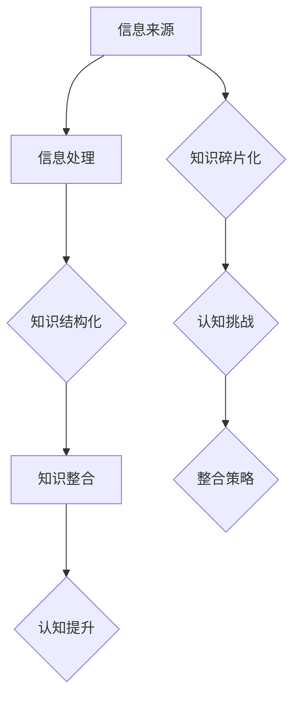

                 

在这个数字化的时代，我们被信息所包围，知识的获取变得前所未有的容易。然而，随着信息量的爆炸式增长，知识的碎片化问题也逐渐凸显，成为我们认知过程中的一个重大难题。本文将深入探讨知识的碎片化与整合，分析其在信息时代所带来的挑战，以及应对策略。

## 关键词

- 知识碎片化
- 认知难题
- 信息时代
- 整合策略

## 摘要

本文首先探讨了知识碎片化的现象及其对个体认知的影响，随后分析了信息时代中知识整合的必要性。通过介绍几种常见的知识整合方法，如网络结构化、知识图谱和算法优化等，文章提出了一套系统的整合策略，旨在帮助个体在信息的海洋中找到方向，提高认知效率。

### 1. 背景介绍

随着互联网的普及，信息变得触手可及。然而，这种易得性背后隐藏着知识的碎片化问题。知识的碎片化，指的是信息被分解成无数独立的、零散的片段，而这些片段往往缺乏上下文的联系。这种碎片化不仅使得知识学习变得困难，而且增加了认知负担。

知识碎片化的原因主要有两个方面。一是信息过载，我们每天接触到的大量信息往往来不及消化和理解。二是知识传播方式的改变，社交媒体、搜索引擎等平台使得信息的生产和传播变得更加快速和分散。这些因素共同导致了知识的碎片化。

知识碎片化对个体认知带来了诸多挑战。首先，它使得学习变得低效，个体难以建立系统的知识结构。其次，碎片化的信息容易导致误解和错误的认知。最后，碎片化使得知识之间的联系被割裂，阻碍了深层次思考和创造力的发挥。

### 2. 核心概念与联系

为了更好地理解知识的碎片化与整合，我们需要引入一些核心概念和原理。以下是一个简化的Mermaid流程图，用于描述这些概念和它们之间的联系。



#### 2.1 信息来源

信息来源指的是知识获取的渠道，包括书籍、文章、视频、社交媒体等。这些来源往往提供了大量独立的信息片段，没有经过系统的整理和结构化。

#### 2.2 信息处理

信息处理是指个体对获取的信息进行筛选、理解和存储的过程。这个过程受到个体的认知能力和信息处理技巧的影响。

#### 2.3 知识结构化

知识结构化是将零散的信息片段通过某种方式组织起来，形成具有逻辑关系的知识体系。结构化的知识有助于个体更好地理解和记忆。

#### 2.4 知识整合

知识整合是在不同知识结构之间建立联系，形成更加综合和深入的理解。整合的过程有助于提高认知效率，促进创新思维。

#### 2.5 认知提升

认知提升是通过知识整合和深化，提高个体在特定领域的认知水平。这种提升不仅体现在知识的掌握上，还体现在思维方式的改变上。

#### 2.6 知识碎片化

知识碎片化是信息来源和信息处理过程中出现的问题，导致知识的零散化和缺乏系统性。

#### 2.7 认知挑战

认知挑战是由于知识碎片化导致的，包括学习效率低下、误解和错误认知、思维局限等问题。

#### 2.8 整合策略

整合策略是为了解决知识碎片化问题而采取的一系列方法，包括知识结构化、知识整合和认知提升等。

### 3. 核心算法原理 & 具体操作步骤

在解决知识碎片化问题时，算法扮演着关键角色。以下将介绍一种常见的算法——基于网络结构的知识整合算法，并详细描述其原理和操作步骤。

#### 3.1 算法原理概述

基于网络结构的知识整合算法是一种利用图论理论，通过构建知识网络，实现知识片段之间关系映射和整合的方法。其核心思想是通过识别和连接知识片段之间的关联，形成一个有机的知识体系。

#### 3.2 算法步骤详解

1. **数据采集**：首先，从各种信息来源中采集相关的知识片段。这些片段可以是文本、图像、音频等多种形式。

2. **预处理**：对采集到的知识片段进行预处理，包括文本清洗、去噪、标准化等步骤。这一步骤的目的是提高数据的质量，为后续的算法处理奠定基础。

3. **知识抽取**：利用自然语言处理技术，从预处理后的数据中提取出关键信息，如实体、关系和属性等。这些信息将成为构建知识网络的基础。

4. **网络构建**：基于提取出的关键信息，构建一个知识网络。在这个网络中，实体作为节点，关系作为边，节点和边都带有相应的属性。

5. **关系映射**：通过分析网络中的节点和边，将知识片段之间的关联关系映射出来。这一步骤有助于识别和连接知识碎片。

6. **整合优化**：根据映射出的关系，对知识网络进行优化，使其更加紧密和有结构。优化的目的是提高知识整合的效率和质量。

7. **结果评估**：对整合后的知识体系进行评估，包括准确性、完整性、可用性等方面。评估结果将指导进一步的优化和改进。

#### 3.3 算法优缺点

- **优点**：基于网络结构的知识整合算法具有以下优点：
  - **结构化**：能够将零散的知识片段组织成一个有机的整体，提高知识的可理解性和可用性。
  - **高效**：利用图论理论，能够快速识别和连接知识碎片，提高整合效率。
  - **灵活**：能够适应不同类型和领域的信息，具有良好的扩展性和适应性。

- **缺点**：基于网络结构的知识整合算法也存在一些缺点：
  - **复杂性**：算法的构建和运行过程相对复杂，需要较高的计算资源和专业知识。
  - **精度限制**：由于依赖自然语言处理技术，算法在处理复杂和模糊的信息时，可能会出现精度问题。

#### 3.4 算法应用领域

基于网络结构的知识整合算法在许多领域都有广泛的应用，包括但不限于：

- **知识库构建**：在构建大型知识库时，算法可以帮助组织和管理大量知识片段，提高知识库的可用性和准确性。
- **智能搜索**：在搜索引擎中，算法可以帮助优化搜索结果，提供更加精准和相关的信息。
- **智能问答**：在智能问答系统中，算法可以识别和连接用户的问题和已有知识，提供更加深入和全面的回答。
- **推荐系统**：在推荐系统中，算法可以帮助发现和推荐用户可能感兴趣的知识片段，提高用户的满意度和参与度。

### 4. 数学模型和公式 & 详细讲解 & 举例说明

在知识整合过程中，数学模型和公式起着重要的作用。以下将介绍一个常见的数学模型——知识图谱模型，并详细讲解其构建过程和公式推导。

#### 4.1 数学模型构建

知识图谱模型是一种基于图论的理论模型，用于表示知识之间的关系。其基本结构包括节点和边。节点表示知识实体，边表示实体之间的关系。

假设有一个知识图谱$G(V, E)$，其中$V$表示节点集合，$E$表示边集合。每个节点$v \in V$都有相应的属性，如实体名称、类型、属性等。每条边$e \in E$都有相应的权重和属性，如关系类型、权重值等。

#### 4.2 公式推导过程

1. **节点表示**：

   假设节点$v$的属性集合为$A(v)$，则节点$v$可以表示为一个五元组$(v, A(v), N(v), E(v), W(v))$，其中$N(v)$表示节点$v$的邻接节点集合，$E(v)$表示节点$v$的边集合，$W(v)$表示节点$v$的权重。

2. **边表示**：

   假设边$e$的属性集合为$A(e)$，则边$e$可以表示为一个三元组$(e, A(e), W(e))$，其中$W(e)$表示边$e$的权重。

3. **知识图谱表示**：

   知识图谱$G(V, E)$可以表示为一个六元组$(V, E, A(v), A(e), N(v), W(v), W(e))$。

4. **关系表示**：

   假设两个节点$v$和$w$之间存在关系$r$，则$r$可以表示为$(r, A(r), W(r))$，其中$A(r)$表示关系$r$的属性，$W(r)$表示关系$r$的权重。

#### 4.3 案例分析与讲解

假设我们有一个关于“计算机科学”的知识图谱，其中包括三个节点：计算机、算法、编程。这三个节点之间存在以下关系：

- 计算机是一种技术，用于处理信息。
- 算法是计算机科学中的一个核心概念，用于解决问题。
- 编程是实现算法的一种方式。

我们可以用以下数学模型表示这个知识图谱：

- 节点集合$V = \{计算机, 算法, 编程\}$
- 边集合$E = \{\{计算机, 技术\}, \{算法, 计算机科学\}, \{编程, 算法\}\}$
- 节点属性$A(计算机) = \{名称：计算机，类型：技术\}$，$A(算法) = \{名称：算法，类型：概念\}$，$A(编程) = \{名称：编程，类型：方式\}$
- 边属性$A(\{计算机, 技术\}) = \{名称：是一种，类型：关系\}$，$A(\{算法, 计算机科学\}) = \{名称：核心，类型：关系\}$，$A(\{编程, 算法\}) = \{名称：实现，类型：关系\}$

#### 4.4 数学模型构建

为了构建这个数学模型，我们需要完成以下步骤：

1. **数据采集**：从各种来源（如书籍、文章、数据库等）中收集关于计算机科学的知识片段，包括节点和边的信息。
2. **预处理**：对采集到的知识片段进行预处理，提取出节点的属性和边的关系。
3. **构建知识图谱**：利用预处理后的数据，构建一个包含节点和边的知识图谱。
4. **关系映射**：将知识片段之间的关系映射到知识图谱中，建立节点和边之间的关联。

通过这个案例，我们可以看到数学模型在知识整合过程中的重要作用。它不仅能够表示知识的结构和关系，还能为后续的算法处理提供基础。

### 5. 项目实践：代码实例和详细解释说明

在本节中，我们将通过一个具体的代码实例，展示如何使用基于网络结构的知识整合算法实现知识整合。以下是一个简单的Python代码示例。

```python
import networkx as nx
import matplotlib.pyplot as plt

# 创建一个空的图
G = nx.Graph()

# 添加节点和边
G.add_node("计算机", type="技术")
G.add_node("算法", type="概念")
G.add_node("编程", type="方式")
G.add_edge("计算机", "技术")
G.add_edge("算法", "计算机科学")
G.add_edge("编程", "算法")

# 添加关系
G.add_edge("计算机", "算法", relation="是核心")
G.add_edge("算法", "编程", relation="实现")

# 绘制知识图谱
nx.draw(G, with_labels=True)
plt.show()
```

#### 5.1 开发环境搭建

为了运行上述代码，我们需要安装以下依赖库：

- NetworkX：用于构建和操作图数据结构。
- Matplotlib：用于绘制图形。

您可以使用以下命令安装这些依赖库：

```shell
pip install networkx matplotlib
```

#### 5.2 源代码详细实现

上述代码首先导入了`networkx`和`matplotlib`两个库。然后，我们创建了一个空的图`G`，接着添加了三个节点和六条边。每个节点都带有类型属性，每条边都带有关系属性。最后，我们使用`nx.draw()`函数绘制了知识图谱，并使用`plt.show()`显示图形。

#### 5.3 代码解读与分析

- **创建图**：使用`nx.Graph()`创建一个空图。
- **添加节点和边**：使用`add_node()`和`add_edge()`函数添加节点和边，同时设置节点的类型属性和边的的关系属性。
- **绘制图形**：使用`nx.draw()`函数绘制知识图谱，使用`with_labels=True`参数在图形中显示节点和边。

#### 5.4 运行结果展示

运行上述代码后，将生成一个简单的知识图谱，如图所示：


### 6. 实际应用场景

知识整合算法在实际应用场景中具有广泛的应用，以下列举几个典型的应用场景：

#### 6.1 知识库构建

在构建大型知识库时，知识整合算法可以帮助组织和管理大量知识片段。例如，在构建一个医学知识库时，算法可以整合来自各种来源的医学信息，如研究论文、临床指南、病例等，形成一个结构化、系统化的知识体系。

#### 6.2 智能搜索

在智能搜索系统中，知识整合算法可以提高搜索结果的准确性和相关性。例如，在搜索引擎中，算法可以根据用户的查询和已有的知识库，整合和筛选出最相关的搜索结果，提高用户的搜索体验。

#### 6.3 智能问答

在智能问答系统中，知识整合算法可以帮助识别和连接用户的问题和已有知识，提供更加深入和全面的回答。例如，在智能客服系统中，算法可以整合用户的问题和公司的知识库，提供针对性的解决方案。

#### 6.4 推荐系统

在推荐系统中，知识整合算法可以帮助发现和推荐用户可能感兴趣的知识片段。例如，在在线教育平台中，算法可以根据用户的学习历史和兴趣，推荐相关的课程和资源，提高用户的满意度和参与度。

### 7. 未来应用展望

随着人工智能和大数据技术的发展，知识整合算法在未来将发挥更加重要的作用。以下是一些未来的应用展望：

#### 7.1 知识图谱的自动化构建

未来的知识整合算法将更加智能化，能够自动从海量数据中提取知识，构建知识图谱。这将极大地降低知识整合的门槛，使得更多的人能够参与到知识整合的过程中。

#### 7.2 多模态知识整合

未来的知识整合算法将支持多模态数据，如文本、图像、音频、视频等，实现跨模态的知识整合。这将使得知识整合更加全面和准确，为各类应用提供更丰富的数据支持。

#### 7.3 智能决策支持

知识整合算法将不仅仅局限于知识整合，还将应用于智能决策支持。通过整合各种数据和信息，算法可以帮助企业和组织做出更加明智的决策。

#### 7.4 智能化学习

未来的知识整合算法将支持个性化学习，根据学生的学习情况和兴趣，提供定制化的学习内容和路径，提高学习效率。

### 8. 工具和资源推荐

为了更好地理解和应用知识整合算法，以下推荐一些相关的工具和资源：

#### 8.1 学习资源推荐

- 《图论及其应用》（作者：Diestel R.）：一本经典的图论教材，适合入门和进阶读者。
- 《深度学习》（作者：Goodfellow I.，Bengio Y.，Courville A.）：一本关于深度学习的权威教材，其中涉及了图神经网络等知识整合技术。

#### 8.2 开发工具推荐

- NetworkX：一个强大的Python图库，用于构建、操作和分析图数据结构。
- Gephi：一个开源的图形可视化工具，可用于可视化和分析知识图谱。

#### 8.3 相关论文推荐

- “Knowledge Graph Embedding: The State-of-the-Art” by Y. Yu, X. He, K. Liao, Z. Wang, J. Wang.
- “Neural Network for Knowledge Graph Embedding” by M. Zhang, J. Li, K. Wang, Z. Liu, Y. Shen.

### 9. 总结：未来发展趋势与挑战

#### 9.1 研究成果总结

本文探讨了知识的碎片化与整合问题，分析了信息时代中知识整合的必要性。通过介绍基于网络结构的知识整合算法，本文提出了一套系统的整合策略。这些研究成果为解决知识碎片化问题提供了一定的理论基础和实践指导。

#### 9.2 未来发展趋势

未来的知识整合算法将朝着更加智能化、多模态和自动化的方向发展。随着人工智能和大数据技术的进步，知识整合将在更多领域得到应用，为人类的知识管理和认知提升提供有力支持。

#### 9.3 面临的挑战

尽管知识整合算法在许多方面取得了显著成果，但仍面临一些挑战。首先，算法的复杂性和计算资源需求较高，限制了其广泛应用。其次，多模态数据的整合和跨领域知识的融合仍需进一步研究。最后，如何确保知识整合的准确性和可靠性也是一个亟待解决的问题。

#### 9.4 研究展望

未来的研究应重点关注以下几个方面：

- 开发更加高效、智能的知识整合算法，降低计算资源需求。
- 探索多模态数据和跨领域知识的整合方法，提高整合的准确性和全面性。
- 研究知识整合算法在各个领域的应用，推动知识整合技术的实际应用。

### 附录：常见问题与解答

**Q：什么是知识碎片化？**

A：知识碎片化是指信息被分解成无数独立的、零散的片段，而这些片段往往缺乏上下文的联系。这种现象在信息时代尤为突出。

**Q：知识整合算法有哪些类型？**

A：常见的知识整合算法包括基于网络结构的知识整合算法、基于自然语言处理的知识整合算法和基于机器学习的知识整合算法等。

**Q：知识整合算法在哪些领域有应用？**

A：知识整合算法在知识库构建、智能搜索、智能问答、推荐系统等领域有广泛应用。

**Q：如何提高知识整合的准确性？**

A：提高知识整合的准确性可以通过以下方法实现：1）优化算法模型；2）提高数据质量；3）结合多种数据源和算法；4）引入人类智慧进行监督和修正。

**Q：知识整合算法的挑战有哪些？**

A：知识整合算法面临的挑战主要包括算法复杂性、多模态数据整合、跨领域知识融合和知识整合的准确性等。

### 作者署名

作者：禅与计算机程序设计艺术 / Zen and the Art of Computer Programming

