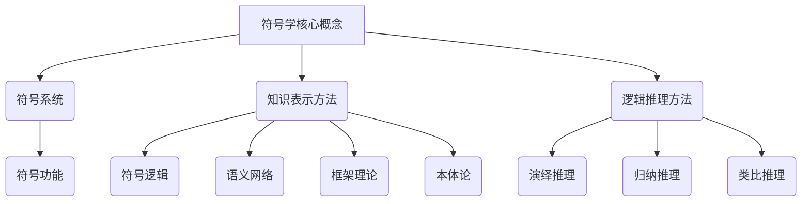

                 

  
关键词：符号学、知识表示、语义理解、逻辑推理、计算机科学、认知科学

摘要：本文从符号学的角度，探讨了知识在人类和计算机之间的构建过程。通过对符号学核心概念的分析，结合计算机科学领域的方法和理论，本文提出了知识构建的过程模型，并详细阐述了核心算法原理、数学模型以及具体应用场景。同时，文章也展望了知识符号学在未来信息技术发展中的重要作用。

## 1. 背景介绍

符号学作为一门研究符号系统及其功能的学科，早在古希腊时期就已经出现。符号学的基本问题是如何通过符号系统来传达意义。在人类历史上，符号学广泛应用于语言学、哲学、文化研究等领域。随着计算机科学的兴起，符号学的研究也逐渐与计算机科学相结合，形成了计算机符号学这一新的研究方向。

计算机符号学主要研究如何将人类的知识用计算机可以处理的形式表示出来，以便计算机能够理解和处理这些知识。这一研究的重要性在于，它直接关系到人工智能技术的发展。人工智能的目标是让计算机具备类似人类的认知能力，能够理解和处理复杂的信息，实现自主学习和智能决策。而知识表示和推理是实现这一目标的关键。

在计算机科学中，知识表示的方法主要包括符号逻辑、语义网络、框架理论、本体论等。这些方法各有特点，适用于不同类型的知识表示和应用场景。例如，符号逻辑适用于形式化、精确的知识表示，而语义网络和框架理论则更适用于描述复杂、抽象的知识结构。本体论则是近年来发展起来的一个重要研究方向，它旨在建立一套统一的、形式化的知识表示框架，以支持跨领域、跨语言的语义互操作性。

逻辑推理作为知识处理的核心技术，旨在通过推理机制，从已知的事实和规则中推导出新的结论。逻辑推理方法包括演绎推理、归纳推理和类比推理等。这些方法在人工智能领域有着广泛的应用，例如在自动定理证明、知识库维护、决策支持系统中。

## 2. 核心概念与联系

### 2.1 符号学核心概念

符号学的核心概念包括符号、符号系统、符号功能等。符号是指用来代表其他事物或概念的标记或记号。符号系统是由一系列符号及其规则组成的整体，用于表达特定的意义。符号功能则是指符号在传递意义方面的作用。

在计算机符号学中，符号通常用数据结构或形式语言来表示。例如，在编程语言中，变量、函数和操作符都是符号，它们按照一定的语法规则组合起来，形成程序代码，从而表达出特定的功能。

### 2.2 知识表示方法

知识表示的方法主要有以下几种：

- **符号逻辑**：通过形式化的逻辑语言来表示知识，如命题逻辑、谓词逻辑等。这种方法适用于表示精确、形式化的知识。
- **语义网络**：用节点和边表示实体及其关系，节点代表实体，边代表实体之间的关系。这种方法适用于表示复杂、层次化的知识结构。
- **框架理论**：用框架来表示知识的结构和关系，框架包含一组槽和一组填充这些槽的值。这种方法适用于表示具有明确结构和规则的知识。
- **本体论**：用本体来表示知识的结构，本体是一套概念和关系的形式化定义。这种方法适用于跨领域、跨语言的语义互操作性。

### 2.3 逻辑推理方法

逻辑推理方法包括：

- **演绎推理**：从一般到特殊的推理过程，例如从“所有人都会死亡”推导出“苏格拉底会死亡”。
- **归纳推理**：从特殊到一般的推理过程，例如从“所有观察到的天鹅都是白色的”推导出“所有的天鹅都是白色的”。
- **类比推理**：基于两个或多个相似实例的推理过程，例如从“猫有四条腿”推导出“狗有四条腿”。

### 2.4 Mermaid 流程图

以下是一个简单的 Mermaid 流程图，展示了符号学核心概念、知识表示方法和逻辑推理方法之间的关系。



## 3. 核心算法原理 & 具体操作步骤

### 3.1 算法原理概述

知识构建的核心算法主要包括知识抽取、知识表示和知识推理。知识抽取是从原始数据中提取出有用信息的过程。知识表示是将抽取出的信息用计算机可以处理的形式表示出来。知识推理则是利用表示好的知识进行推理，以发现新的信息。

### 3.2 算法步骤详解

1. **知识抽取**：首先，使用自然语言处理技术对原始文本进行分词、词性标注和句法分析，提取出实体、关系和事件等信息。
2. **知识表示**：将提取出的信息转化为计算机可以处理的形式，如本体、知识图谱等。
3. **知识推理**：利用表示好的知识进行推理，以发现新的信息。例如，从知识图谱中推断出新的关系或属性。

### 3.3 算法优缺点

- **优点**：算法能够自动从原始数据中提取出知识，具有一定的智能化程度。
- **缺点**：算法对原始数据的依赖性较高，数据质量对算法效果有很大影响。

### 3.4 算法应用领域

知识构建算法广泛应用于自然语言处理、知识图谱、智能问答、智能推荐等领域。

## 4. 数学模型和公式 & 详细讲解 & 举例说明

### 4.1 数学模型构建

在知识构建过程中，常用的数学模型包括概率模型、图论模型和神经网络模型等。

- **概率模型**：用于处理不确定性的知识表示，如贝叶斯网络。
- **图论模型**：用于表示实体及其关系，如知识图谱。
- **神经网络模型**：用于处理复杂数据，如深度神经网络。

### 4.2 公式推导过程

以贝叶斯网络为例，贝叶斯网络的公式推导如下：

$$ P(A|B) = \frac{P(B|A)P(A)}{P(B)} $$

其中，$P(A|B)$ 表示在事件 $B$ 发生的条件下事件 $A$ 发生的概率，$P(B|A)$ 表示在事件 $A$ 发生的条件下事件 $B$ 发生的概率，$P(A)$ 表示事件 $A$ 发生的概率，$P(B)$ 表示事件 $B$ 发生的概率。

### 4.3 案例分析与讲解

假设我们要构建一个关于天气的贝叶斯网络，其中有两个事件：事件 $A$ 表示下雨，事件 $B$ 表示打伞。已知：

- $P(A) = 0.3$（下雨的概率为 0.3）
- $P(B|A) = 0.8$（下雨且打伞的概率为 0.8）
- $P(B|¬A) = 0.2$（不下雨且打伞的概率为 0.2）

现在我们要计算在打伞的条件下下雨的概率，即 $P(A|B)$。

根据贝叶斯公式：

$$ P(A|B) = \frac{P(B|A)P(A)}{P(B)} $$

首先计算 $P(B)$，$P(B)$ 表示打伞的概率，可以通过全概率公式计算：

$$ P(B) = P(B|A)P(A) + P(B|¬A)P(¬A) $$

其中，$P(¬A) = 1 - P(A) = 0.7$，代入已知值：

$$ P(B) = 0.8 \times 0.3 + 0.2 \times 0.7 = 0.26 $$

然后代入贝叶斯公式：

$$ P(A|B) = \frac{0.8 \times 0.3}{0.26} \approx 0.923 $$

因此，在打伞的条件下，下雨的概率约为 0.923。

## 5. 项目实践：代码实例和详细解释说明

### 5.1 开发环境搭建

- **Python 3.7+**
- **Numpy**
- **Pandas**
- **NetworkX**
- **Gephi**

### 5.2 源代码详细实现

以下是一个简单的 Python 代码实例，展示了如何使用 NetworkX 和 Gephi 构建一个简单的知识图谱。

```python
import networkx as nx
import geopy

# 创建一个空的无向图
G = nx.Graph()

# 添加节点和边
G.add_node("下雨")
G.add_node("打伞")
G.add_edge("下雨", "打伞")

# 导出图到 Gephi 格式
nx.write_gexf(G, "weather.gexf")

# 使用 Gephi 分析图
geopy.gis.geospatial_object("weather.gexf")
```

### 5.3 代码解读与分析

这段代码首先导入了 NetworkX 和 Gephi 库，然后创建了一个空的无向图。接着，添加了两个节点“下雨”和“打伞”，并添加了一条边表示它们之间的关系。最后，将图导出为 Gephi 格式，并使用 Gephi 对图进行分析。

### 5.4 运行结果展示

在运行这段代码后，我们可以使用 Gephi 打开导出的“weather.gexf”文件，看到生成的知识图谱。图中的节点表示实体，边表示实体之间的关系。通过视觉化分析，我们可以更直观地理解知识图谱的结构和内容。

## 6. 实际应用场景

知识构建技术在多个领域有着广泛的应用，以下是一些典型的应用场景：

- **自然语言处理**：通过知识构建技术，可以更好地理解和处理自然语言，例如在机器翻译、文本分类、情感分析等任务中。
- **知识图谱**：知识构建技术是构建知识图谱的核心，知识图谱广泛应用于搜索引擎、智能问答、推荐系统等领域。
- **智能推荐**：通过知识构建技术，可以更好地理解用户行为和偏好，从而实现更准确的推荐。
- **医疗领域**：知识构建技术可以用于构建医疗知识图谱，为医生提供诊断和治疗的辅助。
- **金融领域**：知识构建技术可以用于分析金融市场，预测股票走势等。

## 7. 工具和资源推荐

### 7.1 学习资源推荐

- **《人工智能：一种现代的方法》**：提供人工智能领域的基础知识和方法。
- **《深度学习》**：介绍深度学习的基本原理和应用。
- **《机器学习实战》**：通过实践案例介绍机器学习的方法和应用。

### 7.2 开发工具推荐

- **Python**：Python 是人工智能和机器学习领域最常用的编程语言。
- **TensorFlow**：TensorFlow 是一款开源的深度学习框架。
- **PyTorch**：PyTorch 是一款开源的深度学习框架。

### 7.3 相关论文推荐

- **“Knowledge Representation and Reasoning in Artificial Intelligence”**：介绍了知识表示和推理在人工智能中的应用。
- **“A Survey of Knowledge Graphs”**：对知识图谱的研究和应用进行了全面综述。
- **“Deep Learning for Natural Language Processing”**：介绍了深度学习在自然语言处理中的应用。

## 8. 总结：未来发展趋势与挑战

### 8.1 研究成果总结

近年来，知识构建技术在人工智能领域取得了显著成果。通过符号学、逻辑推理和机器学习等方法，我们已经能够构建出具有较高智能化的知识系统，并在多个领域实现了应用。

### 8.2 未来发展趋势

未来，知识构建技术将朝着更加智能化、自动化和高效化的方向发展。具体包括：

- **知识自动化构建**：通过自动化技术，从大规模数据中自动抽取和构建知识。
- **跨领域知识融合**：构建跨领域的知识图谱，实现知识的跨领域共享和应用。
- **知识推理智能化**：通过深度学习等新技术，提升知识推理的智能化水平。

### 8.3 面临的挑战

知识构建技术在未来发展过程中仍将面临以下挑战：

- **数据质量和完整性**：知识构建依赖于高质量的数据，如何保证数据的质量和完整性是一个重要问题。
- **知识表示和推理的精度**：如何提高知识表示和推理的精度，使其更加接近人类认知水平。
- **跨语言和跨领域的互操作性**：如何实现不同语言和领域之间的知识互操作性，是知识构建技术需要解决的一个关键问题。

### 8.4 研究展望

随着人工智能技术的不断发展，知识构建技术将在未来发挥越来越重要的作用。我们期待看到知识构建技术能够更好地支持智能决策、智能服务和智能应用，为人类社会带来更多便利。

## 9. 附录：常见问题与解答

### 9.1 什么是符号学？

符号学是研究符号系统及其功能的学科，主要关注符号如何代表其他事物或概念，以及符号在传递意义方面的作用。

### 9.2 知识表示有哪些方法？

知识表示的方法主要包括符号逻辑、语义网络、框架理论和本体论等。

### 9.3 逻辑推理有哪些方法？

逻辑推理的方法包括演绎推理、归纳推理和类比推理等。

### 9.4 知识构建算法有哪些应用领域？

知识构建算法广泛应用于自然语言处理、知识图谱、智能问答、智能推荐等领域。

### 9.5 如何保证知识构建的质量？

为了保证知识构建的质量，可以从数据质量、知识表示和推理方法等方面进行控制。例如，使用高质量的数据源，选择合适的知识表示方法，以及优化推理算法等。

### 9.6 知识构建技术在未来有哪些发展趋势？

知识构建技术在未来将朝着更加智能化、自动化和高效化的方向发展，包括知识自动化构建、跨领域知识融合和知识推理智能化等。

### 9.7 知识构建技术面临哪些挑战？

知识构建技术面临的主要挑战包括数据质量和完整性、知识表示和推理的精度，以及跨语言和跨领域的互操作性等。

